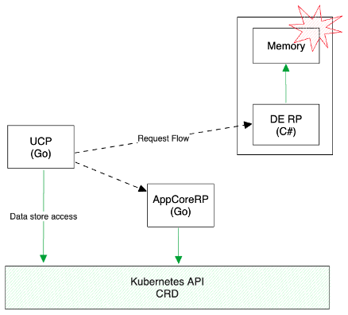
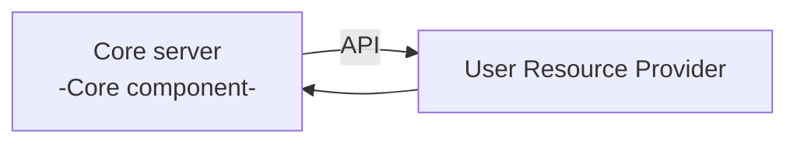
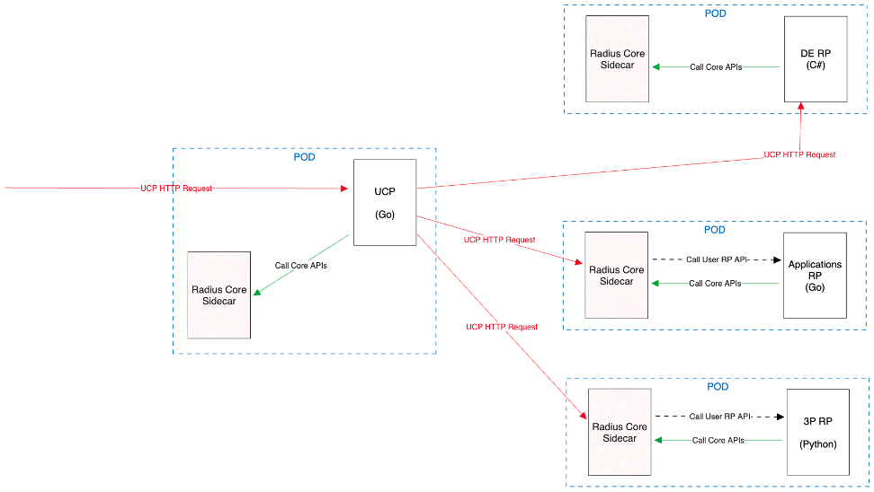
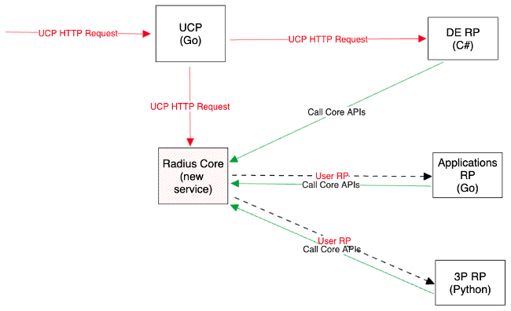

# Radius service architecture vNext

* **Status**: Reviewing
* **Author**: Young Bu Park (@youngbupark)

## Overview

Radius service architecture vNext proposal aims to enhance Radius service architecture and define a new programming model that addresses the following problems:

#### In-memory data store and queue in Deployment Engine (DE)

Radius has three core services: Universal Control Plane (UCP), Applications RP, and Deployment Engine (DE). UCP and Applications RP utilize Kubernetes CRD for storing resource metadata and implementing queue, while Deployment Engine uses an in-memory data store for resource metadata and queue. The in-memory data store is designed for development/test purposes, which raises questions about service reliability and resiliency. 

 
Specifically, DE cannot persistently store deployment metadata and queue messages, leading to
1.	loss of on-going deployments upon crashes or restarts and
2.	unable to run DE with multiple instances for high availability.

A naive solution of porting Go CRD store implementation to C# could solve this, but managing two separate codebases for the same implementation is inefficient and non-maintainable. Besides, this approach would not scale well if we want to support new datastores and distributed queues.

#### Complexity in Building New Resource Providers

The current design of RP is too complicated to implement new namespaces and resource types, especially for our strategic partners who may wish to build their own resource providers. For those partners, understanding how ARM/UCP internals and leveraging armrpc package (written in Go) can be cumbersome for creating new resource provider.

#### Insufficient Control Plane Features – Resource Change Notification

Currently, UCP lacks resource change notification feature. The notification feature is critical to informing each RP about changes in foreign resources—like ARM’s Azure Resource Notifications and Kubernetes' resource informer. In the current Radius implementation, each RP requires the change (even though it will be part of armrpc package) for publishing and subscribing to the notification messages. Beyond notification features, this approach is inefficient and may not scale effectively in the long run.

## Terms and definitions

<!--
Include any terms, definitions, or acronyms that are used in
this design document to assist the reader. They may or may not
be part of the user-facing experience once implemented, and can
be specific to this design context.
-->

## Objectives

### Goals

1. Understand the existing problems in the current service design.
2. Propose vNext architecture changes to address the existing problems.

### Non goals

This proposal does not describe the detailed design for each options. The detailed design for the proposal will be written later.

## Design

This vNext architecture proposal starts from the key idea of decomposing the components of Radius Resource Provider (RP) server into two entities: Core Server and User Resource Provider. The Core Server includes common components leveraged by User RPs, while the User Resource Provider includes RP-specific components, implementing business logic for each resource type.

| **Common components** |
|---|
| Data store providers (CRD, CosmosDB) |
| Queue providers (CRD) |
| OpenAPI request validator |
| Common LIST and GET APIs |
| Create/Update/Delete APIs for Sync/Async |
| Async operation worker service |
| Etag/Pagination handling |
| Routing registration for each namespace and resource type |
| Handling ARM RPC available operations |
| Subscription notification (Not implemented) |
| Resource notification (ARN) (Not implemented) |
| **RP-specific components** |
| Resource Request Validators |
| Versioned Model and Data model converters |
| Swagger files for OpenAPI validation. |
| Sync API controllers |
| Async Long running job tasks (processors, deployment processors) |
| Resource notification handler (Not implemented) |

<The components in Radius resource provider>

The decomposition not only addresses current outstanding issues but also offers several benefits:

1. It can establish a new programming model by Core server to streamline and simplify the Radius resource provider implementation.
2. It enables us to maintain the core server and user resource provider separately, eliminating the need to recompile each resource provider code when applying common component fixes.
3. It enables our partners to use any programming language to implement their own resource providers.

When it comes to implementation, we have two architectural choices for the core server—centralized service vs sidecar design. After evaluating them, we propose adopting the sidecar pattern for the core server. This design provides better flexibility and extensibility, benefiting us not only in the short term but also offering long-term advantages.

### Option 1: Sidecar
Radius Core sidecar is the separate sidecar container image, which serves the common components. Radius Core sidecar will be deployed with User RP as a POD.

Footnotes:
* UCP : UCP is not only gateway but also control plane and proxies for multiple cloud providers, so it will need to proxess the incoming request directly. It may use a few functionalities such as data store / queue access like DE.
* DE : Since we decide to leverage ARM deployment engine service as much as possible, UCP will bypass Radius Core sidecar while proxying UCP HTTP request to DE. DE will use Radius Core sidecar to access datastore and queue resources.

Advantages:

1. This design inherits all benefits from the decomposition design.
1. We can adopt sidecar pattern without impacting other services because UCP can still talk to sidecar with ARM RPC. 
1. User RP does not need external dependency except for localhost network.
1. User RP does not need any secret to access datastore and queue resources.
1. When we build Radius managed service (with ARM), sidecar pattern allows us to integrate with ARM because it has external service dependency unlike centralized service design. 

Disadvantages:
1. Radius core sidecar is always required.

### Option 2: Centralized service (alternative)

UCP or new service will have common components with APIs and each RP exposes predefined APIs for UCP to implement Radius programming model. 

**Advantages:**
1. This design also inherits all benefits from the decomposition design.
2. User RP does not need any secret to access datastore and queue resources.

**Disadvantages:**
1. Each RP will have additional dependency on this centralized service. For instance, if service and network go down, all services can be impacted.

## Test plan

N/A

## Security

N/A

## Compatibility (optional)

<!--
Describe potential compatibility issues with other components, such as
incompatibility with older CLIs, and include any breaking changes to
behaviors or APIs.
-->

## Monitoring

N/A

## Development plan

<!--
Describe how you will deliver your features. This includes aligning work items
to features, scenarios, or requirements, defining what deliverable will be
checked in at each point in the product and estimating the cost of each work
item. Don’t forget to include the Unit Test and functional test in your
estimates.
-->

## Open issues

1. Network latency for localhost?
1. How do we maintain the API version of Radius core sidecar?
