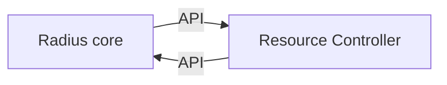

# Radius service architecture vNext

* **Author**: Young Bu Park (@youngbupark)

## Overview

Radius service architecture vNext proposal aims to enhance Radius service 
architecture and define a new programming model that addresses the following 
problems:

#### In-memory data store and queue in Deployment Engine (DE)

Radius has three core services: Universal Control Plane (UCP), Applications RP, 
and Deployment Engine (DE). UCP and Applications RP utilize Kubernetes CRD for 
storing resource metadata and implementing queue, while Deployment Engine uses 
an in-memory data store for resource metadata and queue. The in-memory data 
store is designed for development/test purposes, which raises questions about 
service reliability and resiliency. 

Specifically, DE cannot persistently store deployment metadata and queue 
messages, leading to

- loss of on-going deployments upon crashes or restarts and
- unable to run DE with multiple instances for high availability.

A naive solution of porting Go CRD store implementation to C# could solve this, 
but managing two separate codebases for the same implementation is inefficient 
and non-maintainable. Besides, this approach would not scale well if we want to 
support new datastores and distributed queues.

#### Complexity in Building New Resource Providers

The current design of RP is too complicated to implement new namespaces and 
resource types, especially for our strategic partners who may wish to build 
their own resource providers. For those partners, understanding how ARM/UCP 
internals and leveraging armrpc package (written in Go) can be cumbersome for 
creating new resource provider.

#### Insufficient Control Plane Features – Resource Change Notification

Currently, UCP lacks resource change notification feature. The notification 
feature is critical to informing each RP about changes in foreign 
resources—like ARM's Azure Resource Notifications and Kubernetes' resource 
informer. In the current Radius implementation, each RP requires the change 
(even though it will be part of armrpc package) for publishing and subscribing 
to the notification messages. Beyond notification features, this approach is 
inefficient and may not scale effectively in the long run.

## Terms and definitions

1. ARM RPC: ARM RPC is [Azure Resource Manager Provider Contract](https://github.com/Azure/azure-resource-manager-rpc/tree/master). Radius uses the extended ARM-RPC contract to implement resource types.
1. Radius Core: This is new sidecar service in this proposal.
1. Resource Controller: This is the [primary application](https://learn.microsoft.com/en-us/azure/architecture/patterns/sidecar#solution) which uses Radius Core. It implements the API handlers to handle the resource
   type related APIs.

## Objectives

### Goals

1. Understand the existing problems in the current service architecture.
2. Propose vNext architecture changes to address the existing problems.

### Non goals

This proposal does not describe the detailed design for each options. The 
detailed design for the proposal will be written later.

## Design

This vNext architecture proposal starts from the key idea of decomposing the 
components of Radius Resource Provider (RP) server into two entities: **Radius Core Server** and 
**Resource Controller**. The Radius Core Server includes common components 
leveraged by Resource Controllers, while the Resource Controller includes RP-specific 
components, implementing business logic for each resource type.

| Radius resource provider components |
|---|
| **Common components** |
| Data store providers (CRD, CosmosDB) |
| Queue providers (CRD) |
| OpenAPI request validator |
| Common LIST and GET APIs |
| Create/Update/Delete APIs for Sync/Async |
| Async operation worker service |
| Etag/Pagination handling |
| Routing registration for each namespace and resource type |
| Handling ARM RPC available operations |
| Subscription notification (Not implemented) |
| Resource notification (ARN) (Not implemented) |
| **RP-specific components** |
| Resource Request Validators |
| Versioned Model and Data model converters |
| Swagger files for OpenAPI validation. |
| Sync API controllers |
| Async Long running job tasks (processors, deployment processors) |
| Resource notification handler (Not implemented) |

The decomposition not only addresses current outstanding issues but also offers 
several benefits:

1. It can establish a new programming model by Core server to streamline and 
   simplify the Radius resource provider implementation.
1. It enables us to maintain the Radius core server and resource controller  
   separately, eliminating the need to recompile each resource provider code 
   when applying common component fixes.
1. It enables our partners to use any programming language to implement their
   own resource providers.

When it comes to implementation, we have two architectural choices for the core 
server—centralized service vs sidecar design. After evaluating them, we propose 
adopting the sidecar pattern for the core server. This design provides better 
flexibility and extensibility, benefiting us not only in the short term but 
also offering long-term advantages.

Radius Core sidecar is the separate sidecar container image, which serves the 
common components. Radius Core sidecar will be deployed with Resource Controller 
as a POD.

The following diagram shows how to change the existing design with sidecar 
pattern at high-level.

* **UCP** : UCP is not only gateway but also control plane and proxies for 
  multiple cloud providers, so it will need to process the incoming request 
  directly. It may use a few functionalities such as data store / queue access 
  like DE.
* **DE** : Since we decide to leverage ARM deployment engine service as much as 
  possible, UCP will bypass Radius Core sidecar while proxying UCP HTTP request 
  to DE. DE will use Radius Core sidecar to access datastore and queue 
  resources.

Although each service needs to be deployed with the sidecar, we can get the below benefits:

1. This design inherits all benefits from the decomposition design.
2. We can adopt sidecar pattern without impacting other services because UCP 
   can still talk to sidecar with ARM RPC. 
3. Resource Controller does not need external dependency except for localhost network.
4. Resource Controller does not need any secret to access datastore and queue resources.
5. When we build Radius managed service (with ARM), sidecar pattern allows us
   to integrate with ARM because it has external service dependency unlike
   centralized service design. 

### Detailed design

We will decompose the the existing radius components into `Radius Core` 
(sidecar) and `Resource Controller` like below.

| `Radius Core (sidecar)` | Localhost Network Boundary | `Resource Controller` |
|---|:---:|---|
| `Common components` | | `Common components` |
| Data store providers (CRD, CosmosDB) | `<----API----` | (Data Store client)
| Queue providers (CRD) | | |
| OpenAPI request validator | | |
| Common LIST and GET APIs | | |
| Create/Update/Delete APIs for Sync/Async | | |
| Async operation worker service | | |
| Etag/Pagination handling | | |
| Routing registration for each namespace and resource type | | |
| Handling ARM RPC available operations | | |
| Subscription notification (Not implemented) | | |
| Resource notification (ARN) (Not implemented) | | |
| `RP-specific components` | | `RP-specific components` |
| ARM/UCP Request handler | `------->` | Resource Request Validators |
| | | Versioned Model and Data model converters |
| | | Swagger files for OpenAPI validation. |
| | `------->` | Sync API controllers |
| | `------->` | Async Long running job tasks (processors, deployment processors) |
| | `------->` | Resource notification handler (Not implemented) |

`Radius Core (sidecar)` contains all common components needed to implement ARM 
RPC. `Resource Controller`, on the other hand, calls datastore APIs and 
implements predefined APIs according to the new programming model. That is, as 
an RP developer, there's no need to run the worker service or implement 
operationStatuses API to establish an async operation API. Instead, predefined 
APIs can be implemented to run async operation jobs, with Radius Sidecar taking 
care of the execution model for async operation workers.

Moreover, `Radius Core` exposes an HTTP endpoint through the ARM Request 
Handler to process ARM/UCP requests from UCP. This handler validates the 
request schema using the swagger file, pre-processes the request (handling etag 
and pagination) before forwarding it to Resource Controller.

Sidecar design and *new Radius RP programming model* enables to implement User 
RP in any programming language. In terms of extensibility, we can introduce 
additional features to the sidecar without impacting the Resource Controller.

## Alternatives considered

### Centralized service

UCP or new service will have common components with APIs and each RP exposes predefined APIs for UCP to implement Radius programming model. 

**Advantages:**
1. This design also inherits all benefits from the decomposition design.
1. Resource Controller does not need any secret to access datastore and queue resources.

**Disadvantages:**
1. Each RP will have additional dependency on this centralized service. For instance, if service and network go down, all services can be impacted.

## Test plan

N/A

## Security

* Communication between the Radius Core (sidecar) and Resource Controller occurs over 
  localhost within the same Kubernetes POD context. The TCP port for the 
  internal APIs is not exposed outside the POD, ensuring that external actors 
  are unable to directly access the Radius core sidecar's internal APIs.
* The datastore and queue requires secrets can be accessible only by Radius 
  core (sidecar). As a result, the Resource Controller no longer needs to manage these 
  secrets directly, simplifying the security model.

## Monitoring

N/A

## Development plan

While our immediate focus is on resolving the issues in DE, our long-term 
vision with this proposal is to streamline the Radius service architecture and 
its programming model. This approach not only simplifies the current RP 
implementation but also provides an extensible framework for our strategic 
partners interested in building their own resource providers.

In the initial phase, we aim to develop the Radius core sidecar utilized with 
common datastore and queue APIs. Subsequently, we plan to migrate the remaining 
common blocks to the core server, beyond data access and queue. This migration 
will significantly reduce the code complexity of UCP and Applications RP.

For our partners interested in introducing their own namespaces and resource 
types, our proposal will enable them to develop their own RP without an 
in-depth knowledge of ARM RPC.

### Phase 1 – Implement Data Access and Queue API for DE 

Phase 1 focuses on creating a sidecar that exposes datastore and queue APIs. 
The primary goal of this phase is to address the issues surrounding the current 
in-memory data provider and queues specifically for Deployment Engine (DE). The 
initial version of the sidecar will expose data access and queue APIs via gRPC. 
The datastore provider and queue provider in the DE will then interact with 
these APIs, thereby leveraging the datastore and queue offered by the sidecar. 

### Phase 2 – Design new programming model (beyond data access and queue) 

This phase aims to move all common components to the Radius Core Sidecar and establish a new programming model for the Radius Resource Provider (RP).

## References

1. [ARM RPC 1.0 specification](https://github.com/Azure/azure-resource-manager-rpc/blob/master/v1.0/async-api-reference.md)

## Open issues

1. Network Latency on Localhost
   * A: The network latency for localhost is significantly low. However, to further 
   minimize the impact, we could utilize domain sockets, which offer a more 
   robust security model and even lower latency.
1. Maintenance of API Version for Radius Core Sidecar
   * A: For maintaining the API version of the Radius core sidecar, we plan to 
   use gRPC for the communication between the Sidecar and Resource Controller. With gRPC 
   protobuf idl, we can maintain API version efficiently.
1. Addressing Scalability Concerns for the Sidecar
   * A: Our current design is monolithic, containing both the frontend and 
   backend servers into a single binary. Given that common components of this 
   design don't demand extensive computing or memory resources, we do not 
   anticipate scalability issues exclusively for the sidecar container. If we 
   encounter such challenges, it may indicate the need to revisit our resource 
   API design.
