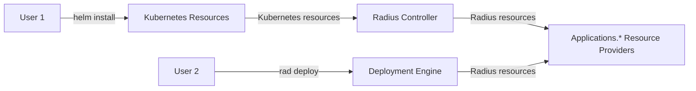
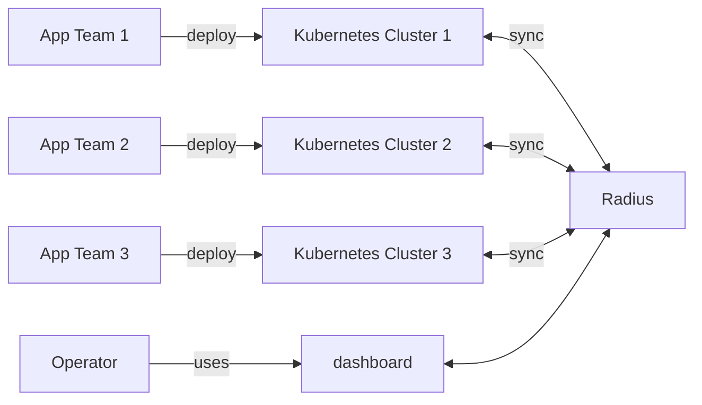
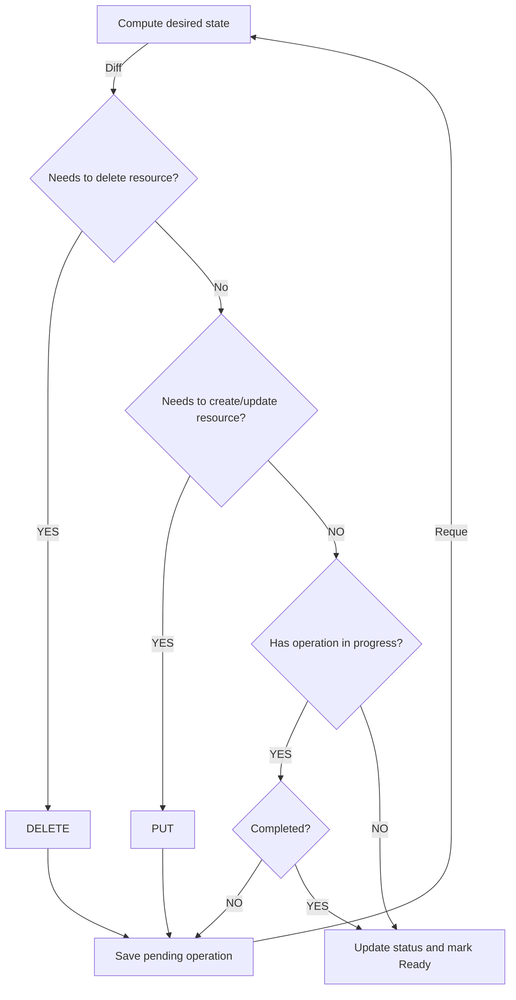

# Kubernetes Integration

* **Status**: Approved
* **Author**: Ryan Nowak (`@rynowak`)

## Overview

To adopt Radius, we ask users to describe their application using Bicep and Radius' application model. Moving customer workloads to Radius' application model supports our strategy for the project, we're trying to evangelize a broadly-applicable **cloud-native abstraction** and then build multiple implementations of that abstraction. As the end goal: users that adopt Radius can seamlessly move between Kubernetes, on-premises platforms, *and serverless hosting platforms provided by various clouds*. Unfortunately migrating existing applications complicated and dangerous work. To make that worse, few users actually need the kind of hosting platform portability we're planning, and we're a long ways off from building it. We believe that these factors explain much of the hesitation we're seeing from users when they have experienced the problems that Radius is solving, but don't become enthusiastic about using Radius.

Building a universal cloud-native abstraction is a bold and radical goal, and results in users being shown a radically-different experience compared to what they are using today. However, without both the desire and and means to move applications between hosting platforms this is not radically better for users as evidenced by the low adoption that we've seen.

This document proposes an alternative strategy focused on adoption of Radius and it's concepts by 1) replacing less of the user's deployment tooling, 2) providing a quicker time-to-value by being more incremental to adopt. Users will be able to quickly benefit from features like Recipes and Connections without replacing or rewriting existing deployment assets.

While the proposal details a different experience for *users*, there is little proposed change for our architecture and investments in Radius other than documentation and samples. The proposal is that we delay the evangelism and messaging of a cloud-native abstraction until we have critical mass and instead focus on messaging ease-of-adoption and time-to-value. In the meantime it is our choice how much to continue investment in the abstraction and its associated tooling (Bicep). We would retain and continue to invest in UCP and the Radius resource providers as these are the basis for features like Recipes, Dashboard and the Application Graph.


## Terms and definitions

| Term                     | Definition                                                                                                                                                                                                                                                                                                                                                     |
| ------------------------ | -------------------------------------------------------------------------------------------------------------------------------------------------------------------------------------------------------------------------------------------------------------------------------------------------------------------------------------------------------------- |
| Application model        | A syntax and schema for describing a cloud-native application that can be deployed and run by one or more hosting platforms.                                                                                                                                                                                                                                   |
| Hosting platform         | A platform for running cloud-native applications. This is more than just a container runtime, it also includes networking, storage, configuration systems, and potentially more features. Examples include: AWS ECS, Azure ContainerApps, Kubernetes, Google Cloud-Run.                                                                                        |
| Cloud-native abstraction | An application-model that is decoupled from any *specific* hosting platform. As a counter-example: the Kubernetes object model is not an abstraction. Data types like: `Deployments`, `Pods`, and `Services` are fundamental to Kubernetes itself.                                                                                                             |
| Application graph        | A feature of the Radius API that provides users with a graph describing the topology and dependencies of their deployed applications. Can be viewed at either the application, environment, or whole enterprise scope.                                                                                                                                         |
| Golden templates         | A design pattern where a central team maintains templates for common (blessed) architectural patterns. Application teams can use these templates with minimal knowledge of how to configure the underlying systems. A common example is a Helm chart written by platform engineers where the application team provides configuration like the container image. |

## Objectives

### Goals

- User can adopt Radius **trivially** for existing Kubernetes applications.
- Users can leverage existing investments in Kubernetes-specific toolchains like Helm, Flux, Argo, etc.
- Users can benefit from valuable features like connections and recipes with minimal change and minimal effort.

### Non goals

- Changes in the overall Radius architecture.
- Changes to existing developer experiences with Bicep and our resource types.
- Abandoning the cloud-native abstraction or making choices that prevent us from building one in the future.

### User scenarios (optional)

#### Developer: Onboarding an existing Kubernetes application to Radius

As an application developer at Contoso, I am responsible for the maintenance of a microservices application made up of 3 containerized services. My team is responsible for the application code (business logic & UI) as well as the `Dockerfile`s and Helm Charts used to deploy the containers to Kubernetes. None of us are experts on Helm and Kubernetes, but the things we're doing are simple so we can get by.

We're adopting Radius as a company so that we can automatically catalog all of our cloud assets. It's my job to onboard our services to Radius so that the architecture can be catalogued. To do this, I edit each Helm chart and add an annotation to each Kubernetes `Deployment` indicating that Radius should be enabled (`radapp.io/enabled: 'true'`). When I do this, I'm just changing metadata and no behaviors of my application change. When I merge the pull-request the metadata is updated in my deployments, which automatically triggers the create of a Radius application and container resources that belong to that application. This updates the  **application-graph** for our whole company and now my components are visible.

This was easy to do because it only required features I already use (labels and annotations) and did not change any behaviors of my application or the deployment tooling I use.

#### Platform Engineer: Authoring golden templates for developers

As a platform engineer at Contoso, I am responsible for developing and documenting **golden templates**. Each of these templates is a Helm chart that provides a packaged version of the deployment assets for a common architecture like a website + PostgreSQL database. The application developer teams that use these templates only provide the configuration for the things they care about. When I write the templates I can ensure that operational requirements like metrics or health checks are configured correctly.

The templates that we've written so far only contain the compute, networking, and configuration resources for containers - we don't have a good way to include dependencies like databases because they aren't part of Kubernetes. Instead we have pre-requisites. Application teams can pre-provision a database through our internal Backstage portal, and then can map the configuration for the database into a Kubernetes secret. The *golden template* ensures that the configuration from the secret will be mapped into the container when it gets deployed.

I learned about Radius recently, and I want to use recipes to remove this step from the workflow so it can be automated. I'm starting with the website + PostgreSQL template - what I want to do instead is use a recipe to create PostgreSQL and the secret - this was previously a manual step. Since we're adopting Radius I also want to make sure these templates work with the application graph.

First I ensure that all of the resources in the template have Radius enabled (`radapp.io/enabled: 'true'`). I can do this with annotations on the Kubernetes objects. Since my template will be used for multiple applications, I let the user configure the application name. That's all that was required to onboard the application, next I want to start using a recipe. I add a `Recipe` resource to the Helm chart, and I configure it to output the connection data to the same secret as before. Lastly I add a connection between the website container and the `Recipe` so we can document the connection.

Getting onboarded with Radius was very quick because it works with the tools that we're already using. This enabled us to easily remove a manual provisioning process and manual management of secrets.

## Design

The proposal is to add a *Kubernetes-centric configuration experience* focused **only on developer scenarios** (the Bicep/API experience includes operator scenarios). This will enable trivial adoption of Radius for applications that use the Kubernetes application model (`Deployment`, `Service`, etc.) for configuration and use the common Kubernetes toolchains for application deployment (Helm, Flux). For the developer that lives in Kubernetes already, they will not need to learn Bicep, Terraform or `rad` to use Radius. 

Operators will continue to use the `rad` CLI and Bicep/Terraform for their work when interfacing with Radius. We believe that we provide exceptional value to operators by acting as a bridge between the cloud(s) and the many Kubernetes clusters they use. 

The new capabilities will include configuring a Kubernetes `Deployment` to behave as an `Applications.Core/containers` resource and to create Recipes of all types (including all portable resources + all cloud resources). The new configuration can be added to a  `Deployment` using labels and annotations, similar to Dapr's configuration. Without expensive migration, users can start using features of `containers` from a Kubernetes `Deployment` like automatic IAM, connections, and the application-graph.  

Users will be able to create recipes using a new CRD type (`Recipe`) that can be used for any type of resource that supports recipes. This will also support configuring a Kubernetes `Secret` as an output of the recipe which makes interop seamless with anything else in Kubernetes. 

Other types in the Radius application model are not important for this scenario and can be ignored for now (`Volumes`, `SecretStores`, `Gateways`). The Kubernetes application model already provides these features. 

---

The new features are implemented using a Kubernetes controller that must be deployed to the cluster where applications are running. This new controller is responsible for reacting to changes to the Kubernetes objects and mirroring those changes to the Radius API. The controller also modifies the user's `Deployment` objects to inject connection data similar to our current functionality.

The impact on the overall architecture can be depicted by the following diagram showing both the existing Bicep flow side-by-side with the new Kubernetes-flow.



<p style="text-align: center;">Graphic: side-by-side depiction of `helm install` and  `rad deploy`.</p>

The new Radius Controller will be client of our existing resource providers. Its function is to *project* the understanding of Kubernetes resources into Radius. As a result the Kubernetes controller can inject data back into Kubernetes, and also contribute to the application graph.

---

This architecture strongly supports the use case where Radius is hosted centrally, and a slim agent runs on each Kubernetes cluster in a federation model with the centralized control-plane.



<p style="text-align: center;">Graphic: Interactions with a single instance of Radius and multiple Kubernetes clusters.</p>


### Example Scenario

This is a walkthrough our existing demo application (tutorial) from the point-of-view of onboarding an existing Kubernetes application. The application is a TODO website that uses Redis as a database.

Starting Assumptions:

- Redis is managed by the user to start with (probably without IaC).
- The user manually (or with a script) copies the connection info into a Kubernetes secret. Secrets 
- The application is deployed using a Helm chart.
- We can assume the Radius environment has already been configured using `rad init`.

#### Step 0: At the beginning

This YAML file describes the Kubernetes `Deployment` that will run the website. For brevity we're omitted details of the chart that won't change in this walkthrough.

As mentioned earlier, Redis is not part of the Helm chart, just the website. Notice that the container image is configured using the embedded template language - versioning is one of the typical reasons users need Helm in the first place.

The application code reads the `DB_CONNECTION` environment variable. This deployment manifest expects that the Redis URL is present in the `url` key of the `redis-secret` object.

The expectation is that Redis and the secret holding it's credentials have been manually provisioned by the user before deploying the Helm chart.

```yaml
apiVersion: apps/v1
kind: Deployment
metadata:
  name: demo
spec:
  selector:
    matchLabels:
      app: demo
  template:
    metadata:
      labels:
        app: demo
    spec:
      containers:
      - name: demo
        image: {{ .Values.container.image }}
        env: 
        - name: DB_CONNECTION
          valueFrom:
            secretKeyRef:
              name: redis-secret
              key: url
        ports:
        - containerPort: 3000
```

#### Step 1: Onboard to Radius

In this step we're adding a single annotation: `radapp.io/enabled: 'true'`.

This makes the `Deployment` visible to Radius and will make it appear as part of the application graph. For this case we will infer the application name from the namespace, and the resource name from the Kubernetes object name (`demo`).

This is all that is needed to *onboard*. From this point on we're adding value and improving the user's workflow.

```yaml
apiVersion: apps/v1
kind: Deployment
metadata:
  name: demo
  annotations:
    radapp.io/enabled: 'true'
spec:
  selector:
    matchLabels:
      app: demo
  template:
    metadata:
      labels:
        app: demo
    spec:
      containers:
      - name: demo
        image: {{ .Values.container.image }}
        - name: DB_CONNECTION
          valueFrom:
            secretKeyRef:
              name: redis-secret
              key: url
        ports:
        - containerPort: 3000
```

#### Step 2: Add Recipe

In this step we've added a `Recipe` Kubernetes object. This will use the registered recipe on the environment to provision a Redis cache, and then will update the `redis-secret` secret. 

At this point we haven't made any code changes to the application code, and only a few changes to the Helm chart, but we're now onboarded to recipes! We can remove the manual provisioning of Redis and the manual management of the secret.

```yaml
apiVersion: apps/v1
kind: Deployment
metadata:
  name: demo
  annotations:
    radapp.io/enabled: 'true'
spec:
  selector:
    matchLabels:
      app: demo
  template:
    metadata:
      labels:
        app: demo
    spec:
      containers:
      - name: demo
        image: {{ .Values.container.image }}
        env: 
        - name: DB_CONNECTION
          valueFrom:
            secretKeyRef:
              name: redis-secret
              key: url
        ports:
        - containerPort: 3000
---
apiVersion: radapp.io/v1
kind: Recipe
metadata:
  name: db
spec:
  type: Applications.Link/redisCaches
  secretName: 'redis-secret'
```

#### Step 3: Using connections

In this step we're going to change the environment variable using used for the Redis URL from `DB_CONNECTION` --> `CONNECTION_REDIS_URL` (Radius convention). By doing this we can replace the management of the secret and binding it to environment variables and replace it with `radapp.io/connection-redis: 'db'` which declares a connection.

We can optionally remove `radapp.io/enabled: 'true'`. Declaring a connection allows us to infer that Radius should be enabled for the `Deployment`.

```yaml
apiVersion: apps/v1
kind: Deployment
metadata:
  name: demo
  annotations:
    radapp.io/connection-redis: 'db'
spec:
  selector:
    matchLabels:
      app: demo
  template:
    metadata:
      labels:
        app: demo
    spec:
      containers:
      - name: demo
        image: {{ .Values.container.image }}
        ports:
        - containerPort: 3000
---
apiVersion: radapp.io/v1
kind: Recipe
metadata:
  name: db
spec:
  type: Applications.Link/redisCaches
```

### Design details

#### New control-plane component

The Kubernetes controllers will be delivered as a separate executable and container as part of our Helm chart. In the future we can separate the deployment of the Kubernetes controllers from the Radius control-plane to support multi-cluster scenarios.

#### Interactions between Kubernetes controllers and Radius API

The Kubernetes controllers for `Deployments` and `Recipes` will need to invoke the corresponding Radius APIs, which are asynchronous. Kubernetes controllers have polling and retries built in to the programming model. It's worth reviewing how we can combine these two asynchronous models to simplify the overall task.

The algorithm that each controller (`Deployments`, `Recipes`) needs to follow can be abstractly described as follows:

- Based on the desired state of a Kubernetes resource, compute the *goal* state of the *paired* resource in the Radius API.
  - For `Deployments` this will be an `Applications.Core/containers` resource.
  - For `Recipes` this could be any resource type that supports Recipes.
- Diff the goal state of the Radius API with the current state of the resource being *managed* by the controller.
  - This might require a `PUT` operation against the Radius API to create or update the paired resource. 
  - This might require a `DELETE` operation against the Radius API to delete and re-create the paired resource.
- If the *paired* resource needs to be changed, then make the API call to the Radius API and save the result.
  - The API call may complete synchronously. In that case, proceed to the next step.
  - The API call may complete asynchronously. In that case, save the **resume token** and queue the current operation for retry. The resume token is a feature of the autorest SDK that encodes the operation result in a durable format.
- If the controller has an operation in progress (**resume token**), check the status of that operation.
  - The API call may have completed. In that case, proceed to the next step.
  - The API call may still be processing. In that case, save the **resume token** and queue the current operation for retry.
- If the API call has completed, update the status of the Kubernetes resource and mark it as `Ready`.

Note again that retries are built-in to a Kubernetes controller. If any of these steps fails, the operation will be automatically retried with a backoff. 


This diagram presents the algorithm as a flowchart:



For state-tracking we will follow the standard practices of using `.status`, `.status.observedGeneration`, and `.metadata.generation` for the Recipe controller. For `Deployments`, the data type is system-defined and so we must use annotations for state-storage.

## Finalizers and deletion

Since the Radius controllers are managing external resources, we must use finalizers to block the deletion of our Kubernetes resources until the appropriate time.

This follows a standard pattern:

- The controller registers a finalizer for an object of interest.
- When that object is deleted the controller will be called to reconcile the deletion. The object **cannot** be deleted until all finalizers are resolved.
- The controller performs whatever action it must take (in our case a Radius API call).
- When the operation completes, the controller removes its finalizer.
- Deletion of the object may proceed.

#### Configuration for deployments

The `Deployment` controller has an overlap of functionality with the container renderer. It must be able to apply features like *connections* and automatic  identity to the `Deployment`. 

For now we will implement these features using a shared-code approach. The controller and container renderer will call into the same functions on separate code paths. This avoids the need for us to build the render outputs into our public API surface.

#### Rollouts and Deployments

As a special case for `Deployments`, we want to prevent the creation of a new `ReplicaSet` when the `Deployment` configuration changes, before the Radius configuration can be resolved.

Consider the following sequence of actions:

- User creates a `Recipe` resource in Kubernetes.
- User creates a `Deployment` resource with a connection to the `Recipe`.
- The reconciler needs to process the `Deployment`, but the connection data is not yet available until the `Recipe` completes processing.

Without any intervention this will *churn* the set of `ReplicaSets` and `Pods`. The `Deployment` will create a new `ReplicaSet` and start running the application without the connection environment variables in place. Since these `Pods` are missing required settings, it's likely they will crash. Then when the Recipe is done processing, the environment variables will be updated, and another set of `Pods` will be created.

We can avoid this by using the `pause` [feature](https://kubernetes.io/docs/concepts/workloads/controllers/deployment/#pausing-and-resuming-a-deployment) of `Deployment`. This is a setting on the `Deployment` that will prevent rollout when set to true. We can set this value to `true` with a `MutatingWebhook` when a `Deployment` is changed, and then set it back to `false` once our settings have been applied.

#### Resource groups and environments

The target user for this feature has little interaction with Radius concepts like resource groups and environments.

For now we'll make the following simplifying assumptions:

- We will choose the `default` environment unless otherwise specified.
  - Users can configure the environment using an annotation on the `Deployment`, and a setting on the `Recipe`.
  - We will need to configure this for our own testing.
- The application name is chosen based on the Kubernetes namespace where the resources are created.
  - Users can configure the application name using an annotation on the `Deployment` and a setting on the `Recipe`.
- The resource group name will be the combination the application and environment name.

### API design (if applicable)

#### Additions to Kubernetes API

We're adding a new resource type to Kubernetes.

```yaml
apiVersion: radapp.io/v1alph3
kind: Recipe
metadata:
  name: db
spec:
  type: Applications.Link/redisCaches # (required) Any recipe type goes here
  secretName: mySecret # (optional) Specify the name of a secret to create/update
  application: myApp # (optional) Override the application name
  environment: myEnv # (optional) Override the environment name
```

We're also adding annotations to `Deployment`:

```yaml
apiVersion: apps/v1
kind: Deployment
metadata:
  name: demo
  annotations:
    radapp.io/enabled: 'true' # Enable Radius functionality
    radapp.io/application: myApp # (optional) Override the application name
    radapp.io/environment: myEnv # (optional) Override the environment name
    radapp.io/connection-foo: bar # Declare a connection named 'foo' to Recipe 'bar'
```

#### Changes to Radius API

The `Applications.Core/containers` type now needs to operate in `'manual'` mode similar to portable resource functionality. When a Kubernetes `Deployment` enables Radius, our controller will create an `Applications.Core/containers` instance, and needs to **prevent** that `containers` instance for creating mode Kubernetes resources.

The proposal is to add a `resourceProvisioning` and `resources` field that mirrors the functionality of these fields for portable resources. The difference is that the `resourceProvisioning` values will be `internal` and `manual` rather than `recipe`.

```tsp
@doc("Container properties")
model ContainerProperties {
  ...ApplicationScopedResource;

  @doc("Definition of a container.")
  container: Container;

  @doc("Specifies a connection to another resource.")
  connections?: Record<ConnectionProperties>;

  @doc("Configuration for supported external identity providers")
  identity?: IdentitySettings;

  @doc("Extensions spec of the resource")
  @extension("x-ms-identifiers", [])
  extensions?: Extension[];

  @doc("Specifies how the underlying container resource is provisioned and managed.")
  resourceProvisioning?: ContainerResourceProvisioning; // ADDED

  @doc("A collection of references to resources associated with the container")
  resources?: ResourceReference[]; // ADDED

  @doc("Specifies Runtime-specific functionality")
  runtimes?: RuntimesProperties;
}

// ADDED
@doc("Specifies how the underlying service/resource is provisioned and managed. Available values are 'internal', where Radius manages the lifecycle of the resource internally, and 'manual', where a user manages the resource.")
enum ContainerResourceProvisioning {
  @doc("The resource lifecycle will be managed internally by Radius")
  internal,

  @doc("The resource lifecycle will be managed by the user")
  manual,
}
```

## Alternatives considered

- The most interesting alternative to discuss is whether the build this functionality at all. As established in the introduction, we feel strongly justified in adding a streamlined Kubernetes onboarding path at this time.

- We could build the controller components into one of our other services. It doesn't seem to offer any advantages other than size.

## Test plan

The functionality of the Kubernetes controllers will be primarily covered using API Server integration tests and a mocked version of the Radius API. This allows us to test the behavior of the controllers and webhooks in a "unit test" style without creating any compute resources.

We'll create a functional test that covers the example scenario described above. This will provide coverage of the interactions between the Kubernetes controllers and the Radius API. 

## Security

The Kubernetes controllers needs to access the `listSecrets` endpoints of various resources (used with Recipes) and then store the results in a Kubernetes secret. This is not an expansion of the existing security perimeter.

The Radius controllers will be delivered in their own executable/container which allows us to grant them least-privilege.

Similar to UCP, the controllers binary requires access to certificates for TLS (webhook). These certificates are currently generated as part of Helm chart, and need to be manually rotated. This is not a new problem as we already face it with UCP.

## Compatibility (optional)

No known issues. API changes are adding optional fields.

## Monitoring

The Kubernetes controller-runtime exposes a metrics endpoint with a standard set of metrics. This will integrate with our existing metrics collection without requiring any bespoke work.

The Kubernetes controller executable will use our existing tracing infrastructure and configuration to trace its calls to the Radius API.

The Kubernetes controller executable will use `stdout` for logging as all of our existing components do.

## Development plan

These features have been prototyped and demoed to the team. The development plan mostly consists of splitting the existing work into digestable steps.

- (*In PR*) Implement the skeleton (container, executable, helm authoring)
- (*In PR*) Add support for `listSecrets` to the generic client
- (*In PR*) Add `resourceProvisioning` and `resources` to container type
- Implement Recipe controller and integration tests
- Implement Deployment controller and integration tests
- Add E2E test for demo scenario
- Add overrides for application and environment
- Add Deployment webhook to `pause` deployments
- Add Recipe webhook for resource-type validation
- Add documentation: new tutorial
- Add documentation: new overview page and how-to
- Update metrics dashboard

## Open issues

### Namespace headaches

The way namespaces are associated with applications causes conflicts with these features. By default Radius will try to associate the `default` namespace with the **shared resources** created by the `default` environment. This causes problems cause users frequently deploy applications to the `default` Kubernetes namespace. The most simple thing a user can do will cause a conflict.

We have a plan in mind to revisit this, but it will be considered a follow-up from this work. 

### Drift detection

The current design does detect or react to changes initiated by Radius (eg: a change to an environment). We could definitely implement drift detection in the controller such that we redeploy applications as necessary and regularly digest updates.

This is going to be filed away as a possible future enhancement.
