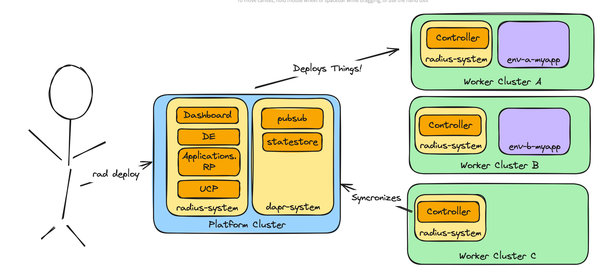

# External Kubernetes Clusters

* **Status**: Pending
* **Author**: `Ryan Nowak (@rynowak)`

## Overview

Right now the main way users use Radius is by hosting the Radius control-plane in a Kubernetes cluster, and using it to manage applications on the same Kubernetes cluster. This is a great choice for tutorials and experimentation as no additional setup is needed beyond a single Kubernetes cluster.

Radius is designed to manage applications across multiple deployment environments. For production applications that run on Kubernetes the most likely deployment scenario is that each environment maps to a separate Kubernetes cluster. This means that environments need to be able to describe any Kubernetes cluster that Radius can talk to.

We designed Radius so that the control-plane can be hosted on any containerized infrastructure. We haven't proven this out yet, and there are a few known places where we take a dependency on Kubernetes features for Radius' operations. This is still an important design-tenet because we want Radius to function without Kubernetes in the picture.

This document proposes the high level set of investments to decouple Radius from being hosted-on and deploying-to a single cluster. Additional follow-up documents will cover complex parts of the change.

## Terms and definitions

## Objectives

> **Issue Reference:** https://github.com/radius-project/roadmap/issues/42

> **Issue Reference:** https://github.com/radius-project/roadmap/issues/39

### Goals

- Support hosting the Radius control-plane on any containerized infrastructure. 
  - It's ok if this requires more complex configuration than Kubernetes-hosting.
- Support Radius managing applications on multiple Kubernetes clusters.

### Non goals

- (out of scope) Non-Kubernetes runtimes are covered by other issues.
- (out of scope) Changes to support data stores and queues are covered by other issues. This is discussed in the document for clarity, but won't be solved totally in this proposal.
- (out of scope) Detailed design. This is a high level document, and we'll review detailed designs for all major investments separately from this doc.
- (out of scope) Using Radius to create compute environments or Kubernetes clusters.

### User scenarios (optional)

#### Hosting the control-plane

Angie is a platform engineer setting up Radius for her organization. She uses Terraform to provision an ECS cluster in AWS and uses that to host the Radius control-plane. She finds examples of how to run Radius in Docker in the official documentation, and uses those to configure ECS.

She puts an API gateway in front of Radius to handle authentication using their enterprise credentials.

#### Configuring environments

Angie then creates production EKS clusters and configures Radius to communicate with them. She has to specify the addresses of those servers, as well as credentials to authenticate. Then once Radius knows about the Kubernetes clusters she configures an environment for each one so that it can be used by applications. 

She's able to find examples in the documentation, and she can either use the `rad` CLI to do this manually or use Bicep to make it repeatable.

#### Deploying applications

Ned works at the same company as Angie and needs to deploy applications. He's able to connect to the Radius control-plane that's hosted in ECS using his SSO credentials. 

Once connected, Ned can see the list of environments he has access to. He configures his CI/CD pipelines to deploy applications to the correct ones. Ned does not need credentials or access to the production Kubernetes clusters.

## User Experience (if applicable)

*This document is high-level. User experiences will be described in detailed design-documents.*

## Design

### High Level Design

We'll break this down into a few categories of work:

- Hosting: how does the Radius control-plane function?
- Application Management: how does Radius deploy and manage applications?
- Kubernetes-Controllers: how do the Radius Kubernetes controllers communicate with the Radius API?
- Tooling: how do features like the CLI and Dashboard interact with with applications?

To make the distinction clear, hosting covers the non-user-facing functionality of Radius. This also includes the configuration passed to Radius on startup. These features are the base layer upon while the Radius API functions.

Application Management includes the user-facing features of Radius like: registering Kubernetes clusters, credentials, environments, deploying applications. These features are implemented as part of the Radius API.

The Radius Kubernetes-Controllers support using the Kubernetes API and application model to interact with Radius and describe applications. This allows Kubernetes-native applications to register themselves with Radius and use features like Recipes. 

Tooling includes the user-facing features of Radius like: viewing the Dashboard,
streaming logs from `rad run`, or port-forwarding. These features are implemented as a hybrid of the Radius API and interactions with the underlying compute runtimes.

#### Hosting

The Radius control-plane needs:

- A database (current = Kubernetes CRDs, ETCd, CosmosDB)
- A message queue (current = Kubernetes CRDs, ServiceBus, in-memory)
- A secret store (current = Kubernetes, in-memory)
- *future* A job dispatcher for containerized Recipe drivers (none)

These are our major *intentional* touchpoints with the hosting environment where the control-plane is running.

We intend to be *somewhat* portable between data sources because we want Radius to be hostable in a variety of environments. In particular with *managed* cloud services as data stores for ease of operations. There's a clear gap where some of Azure's proprietary services are supported but nothing for AWS or other clouds.

*note: we won't address all of the gaps we have today with hosting as part of this proposal.*

#### Application Management

The application management features of Radius include:

- Environments: that describe compute runtimes and networks
- Applications: make up of ...
  - Compute/networking/storage resources: that run on compute runtimes (current = Kubernetes)
  - Recipes: that *might* also use those compute runtimes

Right now the compute runtime is assumed to be a single Kubernetes cluster that is *known* at startup time for the control-plane. The work is to make the selection of the runtime dynamic based on the environment.

In short:

- Users can use environments and related features to configure the compute runtime it is bound to. In the scope of this design we're referring to Kubernetes clusters.
- When Radius deploys compute/networking/storage resources it will find the right Kubernetes cluster and target it.
- When Radius executes a Recipe, it will provide the Recipe with the credentials and configuration for the right Kubernetes cluster.

*We have planned work to target different kinds of runtimes besides Kubernetes, but it is not part of this proposal.*

#### Kubernetes-Controllers

Radius provides a set of Kubernetes-Controllers to synchronize Kubernetes-native applications with the Radius API. These need to run on the target Kubernetes cluster, not with the control-plane; they are clients of the Radius API. 

Right now these are always installed via Helm as part of the Radius Chart. We should provide additional installation options for these. We also need to address authentication between the controllers and the Radius API.

#### Tooling

Radius provides two relevant tooling experiences, the `rad` CLI and the Dashboard. 

The Dashboard is hosted alongside the Radius control-plane and only communicates with the Radius API. There are no known planned changes to the Dashboard for this work other than what's necessary to authenticate with the Radius API.

The CLI *mostly* communicates with the Radius API. It provides two features that talk to the underlying compute platform:

- Streaming logs as part of `rad run`
- Port-forwarding as part of `rad run` or `rad expose`.

The work is enlighten the CLI about the target Kubernetes cluster based on the environment and provide access to credentials so the CLI can provide these functions. The CLI can already be configured to connect to a non-Kubernetes-hosted Radius control-plane as we do this in local debugging scenarios.

### Architecture Diagram

*Fig: Diagram showing Radius managing applications on multiple Kubernetes clusters. [link](https://excalidraw.com/#json=I7cFxaKzDTae5ydHWnebJ,fH_OxKNB6_zWni0_CW8UEQ)*

### Detailed Design

The detailed design for this feature will be broken up into a series of design documents for specific areas.

Here's a list that will be updated as individual design-documents are submitted, signed-off, and implemented.

#### Hosting

- Adopt Dapr in Radius 
  - Pending: Install Dapr as part of `rad init` & `rad install` and update documentation.
  - Pending: Initialize a Dapr statestore as part of installation. 
  - Pending: Use Dapr statestore as database.
  - Pending: Use Dapr statestore as secret store.
- Run Radius outside of Kubernetes
  - Pending: Provide an example docker-compose file as an example.

It's worth considering the alternatives for hosting. Our needs inside Radius (currently) are to have access to a database and a message queue. Currently we built our own abstractions for these inside Radius. If we want to support more options (we do) then we'd need to invest more in these abstractions and building out implementations.

The advantage of choosing Dapr is it is an existing project that addresses these needs and provides much more. [Dapr Workflows](https://docs.dapr.io/developing-applications/building-blocks/workflow/workflow-overview/) provide an excellent foundation for building control-plane code, and will likely be required to modernize the deployment engine (separate from this proposal). Dapr also has a strong security posture, and adopting its features will significantly simplify our requirements for security. 

The disadvantage of Dapr is that it's another dependency. 

#### Application management

- Add Kubernetes cluster registration to UCP
  - Approved: Improve `/planes/...` APIs to use more specific resource types [link](https://github.com/radius-project/design-notes/pull/42)
  - Pending: Add Kubernetes plane API.
- Pending: Update environment to support specifying non-local Kubernetes cluster.
- Pending: Update Applications RP code (non-Recipes) to dynamically select Kubernetes cluster.
- Pending: Update Bicep deployment engine to dynamically select Kubernetes cluster.
- Pending: Update Recipes to pass in correct Kubernetes credentials.

#### Kubernetes-Controllers

- Pending: Add authentication and configuration for an external UCP/Radius API.
- Pending: Support installing Kubernetes-Controllers without the control-plane.

## Tooling

- Pending: Support `rad run` features based on the environment's Kubernetes cluster
- Pending: Simplify registration via CLI of Kubernetes clusters.
- Pending: Update `rad init` to support multi-cluster. 
- Pending: Update dashboard to make Radius URL/location configurable.

### API design (if applicable)

Will be addressed in detailed follow-up docs. The follow proposals are expected to require API design:

- Add Kubernetes cluster registration to UCP.
- Update environment to support specifying non-local Kubernetes cluster.

## CLI Design (if applicable)

Will be addressed in detailed follow-up docs. The following proposals are expected to required CLI design:

- Support `rad run` features based on the environment's Kubernetes cluster
- Simplify registration via CLI of Kubernetes clusters.
- Update `rad init` to support multi-cluster. 

## Implementation Details

Will be addressed in detailed follow-up docs.

## Error Handling

Will be addressed in detailed follow-up docs.

## Test plan

At a high level the best way for us to test this feature is to host Radius *outside* of a Kubernetes cluster and run all of our existing tests. There should be functional difference in these scenarios.

This would be an additional variation of our functional test runs. This can be done on a schedule like our long-haul tests because we don't expect regressions in these features to be frequent.

Tests for specific features will be addressed in the detailed follow-up docs.

## Security

Security will be discussed as part of the detailed design proposals that handle authentication as this involves additional secret handling as well as choosing from the (many) possible authentication implementations.

Parts of the overall proposal that introduce additional security scope are:

- Registration and secret-handling of Kubernetes clusters and credentials.
- Authentication to the Radius API by tools and controllers.
- Integration of Dapr. 

The detailed proposals for these areas will describe the security issues.

---

Adding Dapr as a dependency of Radius will decrease our security footprint because we can leverage features of Dapr to improve our security posture. Some relevant examples:

- mTLS for encrypting communication between UCP and RPs.
- Component scoping to limit access to our data stores.
- Built in support for key/certificate rotation for Dapr/Radius internals.

These features all fill gaps in Radius existing security posture.

## Compatibility (optional)

Specific API changes my require breaking changes. The proposal a whole is additive and compatible with existing functionality.

Replacing our database with Dapr will be a breaking change, but we don't currently guarantee release-to-release compatibility.

## Monitoring

No additional monitoring configuration needed.

## Development plan

Will be covered as part of individual feature design-documents.

The **critical path** prerequisite for all of this work is enabling the registration of Kubernetes clusters, and creation of environments. All other work-items require this.

An example progression of work looks like:

**Phase 1:**

- Enable Kubernetes *planes* and credentials in UCP.
- Update all Radius components to connect to Kubernetes using the planes API to get connection details.
  - Applications RP (non-Recipes)
  - Applications RP (Recipes)
  - Bicep DE
- Add multi-cluster features to the `rad` CLI.
  - `rad init` understands multiple clusters.
  - Some TBD convenience commands for registering clusters (eg: `rad cluster ...`)
  - `rad run` understands multiple clusters.
- Update controllers to make the address of Radius API configurable.

At this point users can use Radius to deploy applications to multiple clusters with no regressions or gaps in functionality.

**Phase 2:**

- Add Dapr to Radius
  - Install Dapr and configure some components at install-time.
  - Update Radius components to use Dapr statestore.
  - Update Radius components to use Dapr + Workflows for async-worker.
- Update dashboard to make the address of Radius API configurable.
- Provide a sample and documentation for hosting Radius outside of Kubernetes.

At this point users can host Radius on any configurable infrastructure.

## Open issues

*TBD*

## Alternatives considered

The main alternative would be to *increase* the level of coupling between Radius and Kubernetes. We could address multi-cluster scenarios by taking a dependency on projects like ArgoCD for the *last-mile* deployment of resources in Kubernetes. We'd need to build a proxy for tooling features like `rad run`. 

Taking a bigger dependency inside the control-plane is not aligned with our project goals and should be rejected. 

The proposal here provides the same operational model for Kubernetes as we will pursue for other compute runtimes. 

## Design Review Notes

*TBD*