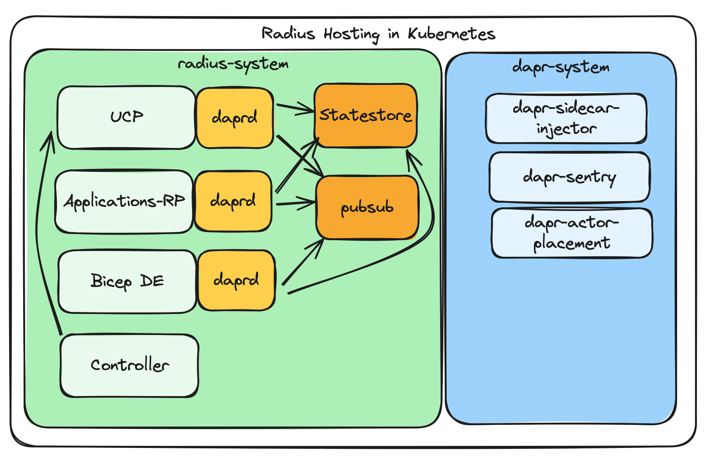

# Radius on Dapr

* **Status**: Approved
* **Author**: Ryan Nowak (`@rynowak`)

## Overview

The design doc proposes replacing some existing plumbing in Radius with [Dapr](https://dapr.io) and taking an install-time dependency on Dapr. Radius needs a database and a message queue to do its work. Dapr provides implementations of its [building block APIs](https://docs.dapr.io/concepts/building-blocks-concept/) that work across self-hostable open-source technology and managed cloud services. Compared to developing our own data layer, adopting Dapr will accelerate development and production-readiness of Radius because Dapr is already mature and production-hardened. Dapr provides SDKs for most languages, including Go and C# so it can be used in the Deployment Engine.

Dapr also brings with it a powerful [workflow](https://docs.dapr.io/developing-applications/building-blocks/workflow/) programming model that can be used to write reliable and scalable distributed systems workflows. This is ideal for building more complex background processing in Radius, and also ideal for us to offer extensibility to users.

Dapr is well-supported both inside and outside of Kubernetes. Adopting a technology like Dapr will help Radius work well regardless of the hosting scenario.

This document will outline and adoption plan for us to leverage Dapr inside Radius' implementation.

## Terms and definitions

*These terms are part of the Dapr project, not defined by us as part of Radius.*

**This document assumes some level of familiarity with Dapr. I'd suggest anyone new to Dapr stop reading this document and read the [Dapr conceptual overview](https://docs.dapr.io/concepts/overview/) before proceeding.**

| Term               | Definition                                                                                                                                                                                                                                                                                                                                                            |
| ------------------ | --------------------------------------------------------------------------------------------------------------------------------------------------------------------------------------------------------------------------------------------------------------------------------------------------------------------------------------------------------------------- |
| Building Block API | Distributed systems primitives provided by Dapr. Each building block has multiple components that implement it. Examples include state store, pub/sub, workflows. [docs](https://docs.dapr.io/developing-applications/building-blocks/).                                                                                                                              |
| Component          | An implementation of a specific building block. For example, Dapr provides a Redis component that implements the state store building block. Component is also used as the term for Dapr's configuration format.                                                                                                                                                      |
| Pub/Sub            | A messaging building-block that implements commonly-used [pub/sub](https://aws.amazon.com/what-is/pub-sub-messaging/#:~:text=The%20publish%2Dsubscribe%20(pub%2Fsub)%20model%20enables%20event,placed%20in%20a%20shopping%20cart.) functionality. See [docs](https://docs.dapr.io/reference/components-reference/supported-pubsub/) for supported pub/sub components. |
| State store        | A key-value-store building block. See [docs](https://docs.dapr.io/reference/components-reference/supported-state-stores/) for supported state stores.                                                                                                                                                                                                                 |
| Workflows          | A [workflow-as-code](https://docs.dapr.io/developing-applications/building-blocks/workflow/workflow-overview/) programming model for reliable distributed applications.                                                                                                                                                                                               |


## Objectives

> **Issue Reference:** <!-- (If appropriate) Reference an existing issue that describes the feature or bug. -->

### Goals

- Adopt Dapr for our data storage and messaging needs. 
  - Keep `rad init` and `rad install` simple by including Dapr and a default choice of components as part of our Helm chart.
  - Keep the Helm chart flexible by documenting how to BYO components.
  - Provide production-guidance for Radius based on Dapr's existing guidance.
- Remove our existing messaging and storage implementations in favor of Dapr.

### Non goals

- (out of scope) User-facing behavior changes other than installation/dependencies.
- (out of scope/follow-up) Adoption of Dapr workflows.
  - While this is highly valuable for us, this 

### User scenarios (optional)

#### Wendy tries Radius out

Wendy wants to learn more about Radius, so she fires up a Kubernetes cluster and tries some of our tutorials. She runs `rad init` to install Radius, which includes Dapr and some components that Radius can use for its storage. This is easy for her because she didn't need to learn about Dapr to try Radius out.

*This scenario is here to point out that the simplicity of the current user experience is maintained.*

#### Wendy and Jake put Radius in production

Wendy's been successful experimenting with Radius, and she wants to take it to production. She works with Jake to set up some cloud datastores for Radius to use, to ensure that data is persisted. Jake creates a DynamoDB table and the necessary SNS/SQS resources, following the Dapr documentation. Jake reads the Radius documentation, installs Dapr, and configures the `Component` objects in Kubernetes that are required. Lastly, Jake runs `helm install radius radius -n radius-system` to install Radius without its default component configuration.


## User Experience (if applicable)

**Sample Input:**

*n/a*

**rad init Sample Output:**

Running `rad init`:

Before 

```txt
✅ Installing Radius 0.32.0 on kind-kind
✅ Create new environment default
   - Kubernetes namespace: default
   - Recipe pack: local-dev
✅ Update local configuration
```


After 

```txt
✅ Installing Radius 0.32.0 on kind-kind
✅ Installing Dapr 1.13.0 on kind-kind
✅ Create new environment default
   - Kubernetes namespace: default
   - Recipe pack: local-dev
✅ Update local configuration
```


**Sample Recipe Contract:**

*n/a*

### Development Experience

*Adding Dapr as a dependency has the potential to impact our development experience. We can follow some existing patterns that Dapr users like to simplify this.*

Wilford is a developer that's making some contributions to Radius for the first time. To get started, he reads the developer document at in [the repo](https://github.com/radius-project/radius/blob/main/docs/contributing/contributing-code/contributing-code-control-plane/running-controlplane-locally.md). He sees that installing Dapr is part of the prerequisites, so he follows the [getting started instructions](https://docs.dapr.io/getting-started/).

After that he follows the rest of the instructions to set up a Kubernetes cluster, and configure his `rad` CLI to talk to the local instance of Radius. When he's done with the setup instructions, he can launch Radius in the debugger. When he does that Radius manages the lifetime of each Dapr process so that Wilford does not to do that manually or learn any extra commands.

## Design

### High Level Design

For our immediate needs we'll be replacing the Radius database and message queue with Dapr's functionality. This doesn't require an architectural change or a large update to the Radius codebase. We'll keep our existing abstractions like the async worker and state store in place. 

### Architecture Diagram

The diagram depicted here shows the organization of resources in Kubernetes. Notably, each of our pods will include Dapr as a sidecar.

We'd use a standard install/configuration of Dapr. The details inside the `dapr-system` are shown for clarity.

Also note that the Radius controller will not need to communicate with Dapr, it communicates only with the UCP API.



<p style="text-align: center;font-style: italic;">
Fig: Diagram depicting Radius hosting in Kubernetes. <a href="https://excalidraw.com/#json=plLzyHWUCb76t3NnOoiQf,kKABl_YcZOObWznIGKj1jQ">link</a>
</p>

### Detailed Design

We can break the detailed design into four main categories of work:

- Including Dapr in `rad init` and `rad install`. 
- Including default component configurations in our Helm Chart.
- Updating the database implementation.
- Updating the async work worker.
- Deleting unused code.

#### Setup

For setup (`rad init`/`rad install`) we previously installed Dapr (a long time ago) along with Contour. We should follow the same design approach we currently do for Contour:

- `rad install` will install Dapr.
- `rad uninstall` will not uninstall Dapr.
- `rad install --reinstall` will not upgrade Dapr.

This is our existing precedent for a dependency that's installed with Radius. We should not deviate from this or add additional options without getting user feedback.

We'll need to configure the Dapr [annotations](https://docs.dapr.io/operations/configuration/configuration-overview/#sidecar-configuration) on UCP, ApplicationsRP, and the DE to enable Dapr.

We should also use our existing metrics and otel configuration settings to configure [Dapr's telemetry features](https://docs.dapr.io/operations/configuration/configuration-overview/#tracing).

We should not add a dependency from our Helm chart onto Dapr's Helm chart. Dependencies in Helm aren't widely used because they are inflexible. It's better if users can manage Dapr on their own terms.

#### Default components

We need to choose a default state store and pub/sub to be included with `rad install` and `rad init`. 

On paper, best option sounds like Redis, because it's both a state store and pub/sub. This is also ways `dapr init` installs by default. However, we're likely to leverage transactions heavily in the implementation of the database. Redis only has [partial support](https://docs.dapr.io/reference/components-reference/supported-state-stores/setup-redis/) for transactions, so I propose that we avoid it.

Our criteria for deciding the best components should look something like:

- Supports the features we need.
- Open-source and self-hostable.
- High level of confidence in the quality of documentation and support.
- Low runtime overhead and simple management.

**State store:** From this [list](https://docs.dapr.io/reference/components-reference/supported-state-stores/) my shortlist is CockroachDB, etcd, MongoDB, MySql/MariaDB, and Postgres.

**Pub/sub:** From this [list](https://docs.dapr.io/reference/components-reference/supported-pubsub/) my shortlist is Kafka, JetStream, RabbitMQ, and Redis.

I have a slight preference towards Postgres and RabbitMQ due to my familiarity, but we should do more investigation before deciding.

---

Whichever options we choose, we'll add them to our Helm chart with a new option `global.dapr.defaultComponents=true` as an opt-in. Our `rad init` and `rad install` commands will set this option. 

I feel better about opt-in vs out-out for the Helm Chart. It's very typical that Helm Charts require additional settings or configuration when dependencies are involved. 

These components should be configured to balance resource usage and complexity versus production readiness. We want to do something reasonable, but we also don't expect users to use our default components for production.

#### State store

Our task is to implement the [`StorageClient` API](https://github.com/radius-project/radius/blob/main/pkg/ucp/store/client.go#L25) on top of the Dapr state store API. Since we'll be keeping the existing store API this change should have no impact on the rest of the codebase.

The storage API in Radius is already oriented around key-value stores, so it's mostly a 1:1 replacement. 

The challenging portion is that Dapr lacks a widely-supported query API. The state store building block includes an optional query feature, but it's deprecated and not widely supported. We shouldn't use it.

The challenge this introduces is for our "list" operations that are part of the standard resource lifecycle. Without a good way to list the resources contained at a given scope, it's impossible to implement operations like "list all applications in resource group my-group". 

There are a few solutions to this:

- Build our own "index".
- Use our own database separate from the state store.

##### Building our own index

One alternative is to use the transactions API to maintain the index for each "list at scope" query. Let's assume we're using resource ids as state store keys.

To build an index, it would look something like:

- Choose a key for the "index" that won't collide with other valid keys.
  - For example: `/planes/radius/local/resourcegroups/my-group/providers/applications.core/applications/.index`. The `.index` part ensures we don't collide with the keyspace of valid key names.
  - The `.index` key will store an array of resource ids that are contained within the scope.
- Each upsert or delete operation on a resource will use a transaction to update both the `.index` and the destination resource id.

When we need to do a "list at scope" query, there are now two operations:

- First retrieve the `.index` key and read the list of resource ids.
- Then use the "bulk state" API to read all keys of the matching resource ids.

This is not the most efficient thing in the world but it allows us to implement the list functionality with only two roundtrips.

##### Use our own database

If we test out the above, and we don't feel good about it we can use a separate database from the state store. Here's an example of what this might look like:

- We require PostgreSQL for Radius. 
- We install PostgreSQL as a default component.
- We configure PostgreSQL as a Dapr state store, so that we can use features that require a state store.
- We additional configure PostgreSQL databases for Radius to use directly.

The disadvantage of this is that we require a specific database technology. The advantage is that we're not limited by the state store API.

##### My Opinion

My opinion is that we should try the "index" approach and make sure it's implementable and performs reasonably for some realistic amount of data. Maybe 200 resources at a given scope as a limit. 

Using Dapr's features sounds really appealing and we miss out on some valuable ones like outbox and TTL if we bypass the state store. We should decide as part of the follow-up design document on the storage layer.

#### Pub/Sub + Async Worker

Our task is to reimplement the [async worker](https://github.com/radius-project/radius/blob/main/pkg/armrpc/asyncoperation/worker/worker.go#L130) using Dapr pub/sub instead of our message queue abstraction. Since we'll be keeping the existing controller API this change should have no impact on the rest of the codebase.

There's an important [semantic difference](https://www.baeldung.com/pub-sub-vs-message-queues) between a message queue and the kind of pub/sub implemented by Dapr. Our current async worker implementation relies heavily on the *extend* and *retry* semantics that are common in message queues. Basically when we read a message, we don't *commit* the read until it's been processed end-to-end, which might be an hour later. This isn't a pattern that pub/sub supports.

To address this, we'll use pub/sub messages to trigger an actor, and use the actor to execute the existing logic that applies retries and backoff. This ensures that the message is not *committed* until it's been accepted by an actor. Actors provide their own functionality for deferred retries that we can leverage. 

-- 

I'm also working on an additional proposal to replace the async worker with Dapr workflows. If we think it's better, we could skip the intermediate step of upgrading the current architecture. The path outlined above is the most incremental approach. 

#### Development Experience

Since Dapr is a new required component, we will need to make some investments or our development experience will be poor. 

I'm proposing that we require Dapr to by installed by users to develop Radius. We'll need the `daprd` binary to be present on the user's system.

There are three tasks we need to solve to get Dapr working in development:

- Configure statestore and pubsub components
- Start the centralized "placement" service
- Start a sidecar for each process

I propose that we make UCP responsible for 1) and 2). These are tasks that should be done once for that are "system-wide". Inside UCP we'll write code that
can generate the necessary component definitions on disk and will start the placement service. 

For the components, we can start with SQLite for the state store and in-memory for pub-sub. This means that database changes will persisted across debugging sessions. Since SQLite is file-based it is easy to delete and recreate the database to recover from a bad state.

Each service will also be responsible for the lifecycle of its own sidecar. 

These behaviors will be configurable in our configuration file. This is just for development purposes and won't be used when Radius is running in Kubernetes.

### API design (if applicable)

*n/a: no API change.*

### CLI Design (if applicable)

*n/a: no CLI change.*

### Implementation Details

*n/a: described as part of detailed design.*

### Error Handling

No new error handling is needed in our existing. The data layer contract will remain the same.

There are two possible cases for misconfiguration of Radius production scenarios:

- Dapr has not been installed. The Dapr sidecars will not be injected, and so Radius will not be able to connect to Dapr. We should check for this condition at startup and crash with a descriptive error.
- Dapr has been installed but no components are configured. We should use the Dapr metadata API to verify the configuration at startup and crash with a descriptive error. 

## Test plan

Dapr will become a required dependency that is installed in all Radius configurations. We will get significant test coverage from our existing functional and long-haul tests.

Additionally we have an existing "compliance" suite of tests for our data store package. The new implementation of the Dapr state store data layer can leverage these tests.

Dapr is also easy to use in integration tests because it provides in-memory components. We can test more of Radius in integration tests by using this support.

## Security

Adopting Dapr as described in this document does not change our existing security posture. However Dapr comes with many security features we can leverage in the future, and will make improving our security posture easier.

## Compatibility (optional)

We don't currently support upgrades from one release to another. Adopting Dapr and mature database technology like Postgres will help us support upgrades in the future.

## Monitoring and Logging

We should use our existing metrics and otel configuration settings to configure [Dapr's telemetry features](https://docs.dapr.io/operations/configuration/configuration-overview/#tracing).

## Development plan

Stage 0:

- Build support for local development of Radius based on Dapr (off by default). This gives Radius the ability to launch its own Dapr sidecars for testing.
- Build database layer for Radius based on Dapr statestore (off by default).
- Update UCP integration tests to use Dapr statestore instead of etcd.
- Build support for automatic component generation for UCP. 
  - Acceptance criteria: UCP can complete its startup sequence in the debugger with no Kubernetes, only Dapr.

*These work items is being frontloaded to increase productivity of the remaining work. When this is done will have good workflows for development and for integration tests.*

Stage 1:

- Add Dapr installation to `rad init` and `rad install`.
- Add Dapr annotations to our Kubernetes components.
- Add default components to our Helm chart.
- Add startup-time verification to our services to verify correct configuration of Dapr and its components.

Stage 2: 

- Switch our Go-based services to use the Dapr state store.
- Remove etcd-based, crd-based, and cosmosdb-based database implementations.

Stage 3:

- Implement new async-worker.
  - Acceptance criteria: works in UCP integration tests with no Kubernetes, only Dapr.
- Switch our Go-based services to use the new async-worker.
- Remove queue abstraction and implementations from Radius.

Stage 4:

- Add Dapr sidecar management and startup-time verification to DE.
- Replace DE in-memory data layer with Dapr state store, update integration tests.

## Open Questions / FAQ

### Decisions

*These are topics in-scope of this document, where we've had enough discussion to make a decision.*

**Q: Can we use the Dapr state store as a database? What are the tradeoffs?**

The Dapr state store building block provides the capabilities of a generic key-value-store. This is lower level than a document store like MongoDB or a RDBMS like PostgreSQL. 

This isn't bad, we designed Radius around a key-value-store abstraction. Our existing database abstraction is similar to Dapr's state store. It's a good fit.

There's one minor issue to address which is how to implement "list" operations (eg: list all containers in resource group X). Dapr state store doesn't have list functionality (though most key-value-stores do). The well-known solution for this is to maintain our own "index" as it's own key. This is a common enough solution that we shouldn't be concerned. 

----

*Follow-up: Why don't we use the Query building block in Dapr?*

The query building-block is [deprecated](https://github.com/dapr/dapr/issues/7338#issuecomment-2132282783), and supported by a limited set of state stores. The query building-block will not see more investment, we should not take a dependency.

----

*Follow-up: What do we miss out on since we're not using an RDBMS?*

RDBMS'es are useful when a system needs rich and flexible query capabilities, and the ability to enforce referential integrity across entities. These aren't requirements that we have in Radius. It's very hard to predict the future, and this design-document does not try.

Using a key-value-store abstraction gives us the widest set of options for scalability and support of different technologies.

**Q. Can we make Dapr optional?**

No. The benefit of adopting Dapr as a dependency is that we can use its features for core functionality. Some examples:

- Using Dapr state store as our database.
- Using Dapr to encrypt intra-RP traffic with mTLS.
- Using Dapr pub/sub for notifications.
- Using Dapr workflows inside our RPs and UCP to implement complex background tasks.

If we wanted Dapr to be optional we'd have to have replacements for these features. Dapr is itself an abstraction-layer, and we'd be building an abstraction-layer for the abstraction-layer. If we did enough work to make Dapr an optional dependency of Radius we wouldn't add capabilities, we'd just add work.

**Q: What if users don't want Dapr?**

We're **definitely** going to add some dependencies on our way to production. Taking a bet on Dapr is a way to scope down the number of different dependencies we add. We should not be concerned about this, other projects with a similar flavor to Radius also include their own dependencies.

The only scenario where a dependency on Dapr impacts users is when **ALL** of the following are true:

- The user needs Dapr in their applications.
- The user's applications run on the same cluster as Radius.
- The user's applications **require** a different version of Dapr that we cannot use. 

### Open Questions to address in follow-ups

*There are topics out-of-scope of this document, since it is an overview. We'll address these topics as part of follow-up discussions.*

**Q. What state store and pubsub should we choose by default?**

The best options right now feel like Redis for pub/sub and PostgreSQL for the state store. These are defaults and users are free to select different options.

We can't use Redis for the state store because it's not really transactional. If Redis were a good solution for the state store, it would be our best option because we'd only need one dependency.

## Alternatives considered

It's always an option not to take a dependency. However, Dapr addresses a lot of needs that we have. In my view it's going to take a small amount of work to adopt, versus the work we would do to address gaps in our production story without Dapr.

## Design Review Notes

See open questions. This design document is an overview, and the discussion was mainly focused on:

- Understanding Dapr and the scope of improvements to Radius.
- Understanding the open questions (above).

Open questions that do not have answers will be addressed in follow-up documents.