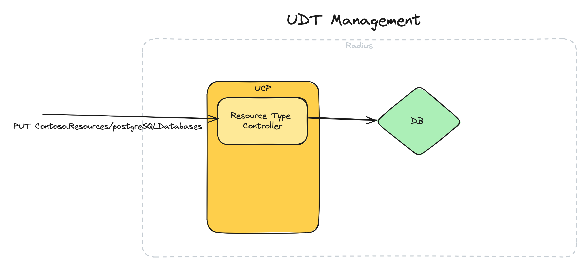
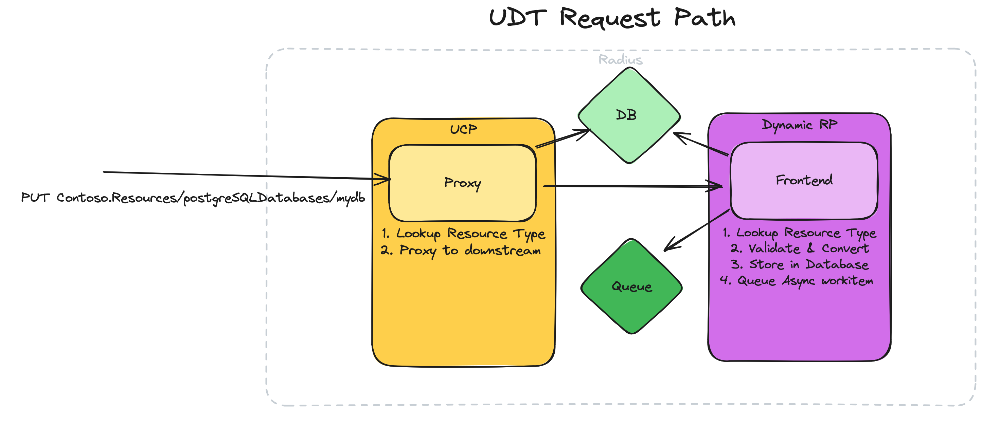
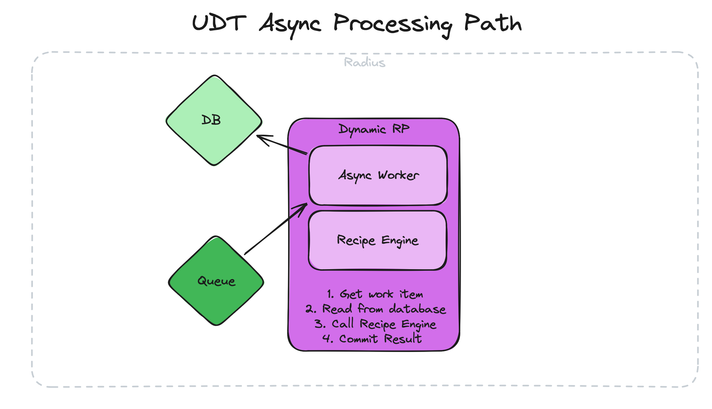

* **Status**: Pending/Approved
* **Author**: `Ryan Nowak` (`@rynowak`)

## Overview

*This document is a high-level overview of the user-defined types feature. The scope of user-defined types is BIG. So we'll have several follow-up documents to dig into details where important.*

Resources are the unit of exchange in the Radius API. All of our user-experiences like the CLI, Dashboard, and Bicep authoring are oriented around the catalog of resources. Because Radius is strongly-typed, the set of resource types and their schemas are also defined as a primary concept in Radius. In order for Radius to support each additional kind of resources, for example a PostgreSQL database, we must first have a type definition.

However, the set of resource types in Radius are currently *system-defined*. Users cannot define additional resource types without making a custom build of Radius. The *user-defined-types* feature enables end-users to define their own resource types as part of their tenant of Radius. User-defined types have the same set of capabilities and enable the same features (connections, app graph, recipes, etc) as system-defined types in Radius. 

Lastly, we'll know that the user-defined types feature is right when we can use it for the resource types that are shipped as part of Radius. It's our goal to update existing implementations of types like `Applications.Datastores/redisCaches` to use user-defined types.

## Terms and definitions

*Please read the [Radius API](https://docs.radapp.io/concepts/technical/api/) conceptual documentation. This document will heavily use the terminology and concepts defined there.*

| Term                 | Definition                                                                                                                                                                                                                                                                                                                                                                                                                                                                                                            |
| -------------------- | --------------------------------------------------------------------------------------------------------------------------------------------------------------------------------------------------------------------------------------------------------------------------------------------------------------------------------------------------------------------------------------------------------------------------------------------------------------------------------------------------------------------- |
| System-defined type  | A resource type that is built-in to Radius. Cannot be defined or modified except by making a custom build of Radius.                                                                                                                                                                                                                                                                                                                                                                                                  |
| User-defined type    | A resource-type that can be defined or modified by end-users.                                                                                                                                                                                                                                                                                                                                                                                                                                                         |
| OpenAPI/Schema       | A format for documenting HTTP-based APIs. We use OpenAPI v2 currently in Radius for client-sdk generation and validation of inbound requests. OpenAPI v3 is more widely adopted. In this document we're primarily concerned with the parts of OpenAPI pertaining to request/response bodies.                                                                                                                                                                                                                                                             |
| Declarative          | Functionality based on static definition of schemas and static definition of behaviors. In contrast with imperative functionality. Example: validation of a request body based on an OpenAPI schema is declarative validation.                                                                                                                                                                                                                                                                                        |
| Tracked resource     | A resource type that is *tracked* by UCP. Tracked resources are cached by UCP and their existence can easily be queried without sending a request to the resource provider. All existing resource types in Radius are tracked resources.                                                                                                                                                                                                                                                                              |
| Normal resource type | A resource type that is part of the `radius` plane and exists inside a resource group. Also has the `TrackedResource` set of fields and behaviors. This is the case for most resource types in Radius today. Normal resource types are our scenario priority because they are optimized for being part of an application. The resource types that are not *normal* are not usually part of an application, for example `System.AWS/credentials` is not part of an application and does not exist in a resource group. |

## Objectives

> **Issue Reference:** https://github.com/radius-project/radius/issues/6688

### Guiding principles

We have two guiding principles for how we make decisions and prioritize investments. 
- User-defined types must be simple and declarative for application and recipe scenarios.  The highest value scenario is building custom application platforms. We want to build a big ecosystem and so user-defined types should be easy to adopt and easy to develop.
- User-defined types should be powerful enough for the Radius maintainers to use. We want to leverage user-defined types and declarative functionality as much as possible.
- 
### Goals

- Support users defining their own resource types and resource type schemas for use with Radius.
	- Support rich declarative validation of resource request bodies based on schema.
	- Support versioning for user-defined resource types.
		- Including the ability to support multiple API versions.
		- Including the ability to introduce breaking changes between versions.
	- eg: Users can define a new resource type and it's schema. Radius will use the schema for validation. Users can add new versions of the resource type, and old ones continue to function.
- Support dynamic management of resource types.
	- eg: Users can register and unregister resource types.
	- eg: Tooling like the Dashboard and `rad` CLI dynamically query the set of resource types rather than hardcoding a list of known types.
- Support use of user-defined types in Bicep with full fidelity.
	- eg: Users can define their own types and use them in their Bicep application definitions.
- Support use of user-defined types as part of an application with full fidelity.
	- User defined types can opt-in to support connections, recipes, application-graph.
	- eg: Users can define their own types and incorporate them in applications. They work the same as existing types that weren't defined by the user.
- Support multiple implementation choices for user-defined types.
	- User-defined types should be easy to implement using declarative functionality.
	- User-defined types should be powerful enough to support implementing a resource-provider.
- Cultivate an open-source ecosystem for user-defined types.
	- Users can find documentation for how to define and publish user-defined types either through open-source or internally to their organization.
	- Users can find prescriptive guidance to simplify the design of resource schemas. 
	- Users have a productive inner-loop for developing resource types.
	- The Radius project maintains a community types repository with infrastructure for testing, publishing, and contributing.
	- The Radius project defines a maturity model for a type graduating from the *community* repository to official support as part of the `Applications.[xyz]` namespace.
- The Radius project heavily leverages the user-defined types infrastructure for the implementation of Radius.
	- All system-defined types provide a schema through the same registration mechanism as user-defined types. 
	- Most of the currently system-defined types migrate to use user-defined types. We will allow exceptions for resource types that have unique requirements like `Applications.Core/secretStores`.

### Non goals

- (non-goal): Migrate **all** existing resource types. 
	- Some types in Radius have special behaviors that are intentionally unique.
	- eg: `Applications.Core/secretStores` has a unique set of capabilities for interacting with secrets. We should probably not expand the scope of user-defined types to include this because it's complex and not valuable.
- (non-goal): Support all existing API-design constructs in user-defined types. 
	- It's our goal to simplify the API design guidance for users. We should be open to rethinking existing practices if they cause us or users difficulty.
- (non-goal): Support compatibility with existing APIs/features as we migrate existing Radius functionality. 
	- It's our goal to simplify the experience for users. We should be open to rethinking existing features and designs if it is overall better. 
- (out of scope): Building an SDK for writing a resource provider. Our priority is to simplify the experience for authoring resource types that will be used in applications. We will wait for feedback before creating comprehensive support to author a resource provider microservice.
- (out of scope): Supporting resource types other than *Normal Resource Types*. Our priority is to simplify the experience for authoring resource types that will be used in applications. 
  
### User scenarios (optional)

The scenario document for user-defined types is in progress [here](https://github.com/radius-project/design-notes/pull/58). Please refer to the scenarios defined in that doc.

## User Experience (if applicable)

Proposed user-experience changes are defined in the [scenario doc](https://github.com/radius-project/design-notes/pull/58).

## Design

### High Level Design

User-defined types functionality can be broken down into a few different dataflows and systems.

- **Registration and management of user-defined types**: This is a new API that provides CRUDL behavior for the concept of *resource type*.
- **Request path for resources implemented declaratively**: This includes routing, validation, storage, and versioning. We typically refer to this today in Radius as the *frontend*.
- **Processing for resources implemented declaratively**: This includes Recipes or any other asynchronous processing that occurs as a result of a `PUT` or `DELETE` operation. We typically refer to this today in Radius as the *async-worker*.
- **Tooling that interacts with the Radius API**: This includes the `rad` CLI and Dashboard. When the set of resource-types in Radius is dynamic, then the tools need to be dynamic as well. 
- **Tooling to author user-defined type schemas**: This includes any tooling we produce to validate a schema, or to transform a schema into a Bicep extension. 

We can also break these systems down by their components in Radius. 
- Registration and management of user-defined types is part of UCP. Since UCP is the *front-controller* for Radius and is responsible for routing, it makes logical sense that UCP would implement the management of user-defined types.
- Request path for declarative resources is either part of UCP or a new component. 
	- UCP implements routing, and will validate that the incoming request is destined for a valid resource type. 
	- The other *frontend* concerns (validation, storage, versioning) could either be implemented inside UCP or another new component. 
- Processing for declarative resources is either part of UCP or a new component.
	- The async-worker for user-defined types should probably be hosted in the same component as the `frontend` like our existing resource providers.
- Tooling that interacts with the Radius API is outside the control plane. These features are implemented in the relevant tool. 
- Tooling to author user-defined type schemas is outside the control plane. Depending on the exact needs this is part of the `rad` CLI or some other tool. 

From this can extract the idea of a *Dynamic RP* - this is a new component that executes the declarative logic on behalf of a user-defined type. It's like our existing resource providers, except it's dynamic and driven by the schema definitions provided by users.

**Note: Dynamic RP is a tentative name.... Suggestions welcome**

This new component could be hosted inside of UCP or could be its own new microservice. My bias is towards a new microservice to maintain the separation between UCP's functionality and the resource provider's functionality. 

### Architecture Diagram

**For clarity, this design document will depict Dynamic RP as a separate component. We might choose to host it in UCP if that makes sense.**

#### Resource Type Management



<center>

*Figure: Diagram of user-defined type registration* [link](https://excalidraw.com/#json=V8jLG-XK7VYZQ5AMAfsRJ,zwUXvuelafgFL2AAGZDsEA)

</center>

#### Request Path



<center>

*Figure: Diagram of user-defined type request path* [link](https://excalidraw.com/#json=cqcrjP7qY1UgbWETA6nDC,bW1ZTLIrshMgCgD50NrzBg)

</center>

#### Asynchronous Processing



<center>

*Figure: Diagram of user-defined type async processing* [link](https://excalidraw.com/#json=kHTPUX6ihLJOsW01eSL-o,tr8NQU3nHDBA2OfhGTWPzw)

</center>


### Detailed Design

This is an overview design document and so the bulk of the decision making will be carried out via follow-up documents. The following documents are planned:

- Resource Type registration APIs (TODO)
	- Includes enhancements to UCP routing.
- Resource Type schemas (TODO)
	- Includes API design guidelines, naming guidelines.
	- Includes validation behaviors.
	- Includes capability model (eg: how does a resource type opt-in to Recipes or Connections)
- Declarative API versioning (TODO)
	- Includes support for multiple versions and support for breaking changes.
- Dynamic RP (TODO)
	- Ties together the decisions about validation, versioning, storage.
	- Calls into Recipe engine.
- Tooling support for using user-defined types (TODO)
	- Includes new CLI commands for managing user-defined types.
	- Includes updates to existing CLI commands for user-defined types.
	- Includes updates to existing Dashboard functionality for user-defined types.
- Tooling support for authoring user-defined types (TODO)
	- Includes functionality for scaffolding a user-defined type project.
	- Includes functionality for generating or authoring a resource type manifest.
	- Includes functionality for generating a Bicep extension.
- Community repository and process for resource-types. (TODO)

----

There are also a few major decisions to be made at a top-down level, which are captured here.

#### User-defined types are declarative

Our scenario doc and jobs-to-be-done analysis highlights that authoring user-defined-types needs to be easy and have a low barrier to entry. This design prop supports that goal by providing a fully-declarative path for implementing a user-defined type.

- Validation is declarative (OpenAPI + CEL with no imperative component).
- Versioning and conversion is declarative (CEL with no imperative component).
- Asynchronous processing uses Recipes.

The alternative would be to implement a resource provider, *which is already supported*. However, we're not going to push users towards implementing a resource provider.

---

The advantage of a fully-declarative system is that easy to implement and that there are no additional control-plane components to host. Users can easily reuse the Recipe engine, which expected to be common. If we consider the need to support a variety of cloud technologies as dependencies, it's clear that Recipes are a key scenario.

The disadvantages of a fully-declarative system is that it's not as powerful. Users can only do the things we enable.  As a comparison we can consider the Kubernetes extensibility model, because it's mature and widely used. The Kubernetes extensibility model requires users to implement a control-plane component (webhook) when versioning is needed, or when imperative validation is needed. The downside of this is that a misbehaving webhook can impact the availability of the overall system. Kubernetes is adding [declarative validation](https://kubernetes.io/docs/reference/access-authn-authz/validating-admission-policy/) using CEL so that imperative validation is needed in fewer scenarios. 

----

In contrast, the advantage of the resource provider model is that if gives users full-control over the resource lifecycle (both request-path and async processing). However implementing a new resource provider is a significant undertaking.  

The disadvantage of the resource provider model is that it's very complex and requires a lot of code. It takes an engineer familiar with Radius approximately a week of time to implement a new type. Additionally, the resource provider is a control-plane component that users must manage. We don't expect the community to adopt the existing resource provider programming model en-masse. There's also significant cost to us to because we need to create SDKs and documentation that make users successful at writing a resource provider.

##### Proposal

The proposal is that we lean heavily on declarative functionality. We'll support two models, but push users towards the declarative model:
- Fully declarative (OpenAPI, CEL, Recipes)
- Fully imperative (Resource Provider)

If we need to, we can add more hooks in the future to create hybrids. This is complex and costly so we should set a high bar for it.

#### User-defined types are implemented as an RP 

The proposal for user-defined types creates a new resource provider (Dynamic RP) to host the implementation of all user-defined types. The contract between UCP and a user-defined type is the same as for any full resource provider.

The main advantage of implementing user-defined types as a resource provider is that it's consistent with our current architecture. 

The proxy layer in UCP completes the following steps to route traffic:

- Validate the existence of the destination plane and resource group.
- Look up the resource provider / resource type and its downstream address.
- Proxy traffic to the resource provider.
- Interpret the result and update internal state.

#### Proposal

We should implement user-defined types as a resource provider with dynamic behavior. The new resource-provider could be hosted inside UCP directly or in its own microservice.

### API design (if applicable)

API design will be covered as part of the *Resource Type registration APIs* and *Resource Type schemas* design documents.

### CLI Design (if applicable)

CLI design will be covered as part of the *Tooling support for using user-defined types* design document.

### Implementation Details

N/A for this document. This is an overview. 

### Error Handling

N/A for this document. This is an overview. 

## Test plan

N/A for this document. This is an overview. 

## Security

The user-defined types feature has a few touchpoints with security.

- Secret handling: As part of the API design document we will review a proposed approach for handling secrets securely. The goal of this proposal is to rely on the `secretStores` type and avoid handling secrets as part of other APIs. This will simplify the security model overall for Radius.

- Strong typing for APIs and storage: As described in the [Kubernetes Structural Schema](https://kubernetes.io/blog/2019/06/20/crd-structural-schema/#towards-complete-knowledge-of-the-data-structure) blog post, an API can introduce vulnerabilities whenever it persists unvalidated data. The implementation of user-defined types will increase the level of validation and improve the overall security posture of Radius.

## Compatibility (optional)

Current UCP does not know the individual resource types that belong to a resource provider. It only validates the provider namespace. When we introduce the APIs for registration of resource types/providers, we should begin registering the built-in types. This can be rolled our gradually without breaking users.

## Monitoring and Logging

No new diagnostics or telemetry is required. The user-defined types features will leverage existing components with existing telemetry implementations.

## Development plan

We can implement user-defined types through a staged development plan. This plan is designed to enable the user-defined type end-to-end early to unblock functional testing and community feedback. After user-defined types reach MVP status, we shift focus to enhancing them.

Stages are described in linear order, but many of them can be parallelized.

### Phase 1: Enabling the UDT end-to-end

#### Stage 1: Type Registration APIs

- Define API for CRUDL operations and resource providers and resource types.
- Add `rad` CLI commands `rad resourceprovider xyz` and `rad resourcetype xyz`.
- Update UCP routing logic to leverage the stored resource type data.
- Add functional tests for registering a resource type and querying it.

Exit criteria: it's possible to register and perform operations on the resource provider/type APIs.

#### Stage 2: Register built-in types

- Define resource provider manifests for built-in resource providers/types like `Applications.Core` and `Microsoft.Resources/deployments`. Schemas for these types are not required.
- Use the UCP startup sequence to register these manifests.
- Remove legacy code path from UCP routing logic. Now only registered types are supported.

Dependency: Stage 1

Exit criteria: all functional tests passing using new routing behavior in UCP. All built-in resource types can be queried with the CLI.

#### Stage 3: CLI enhancements

- Remove hardcoded resource type validation from the CLI and replace with queries of the resource provider/type APIs.
- Add support for `rad resource create`. A new CLI command that can create resources of any type. This is needed to properly exercise the user-defined types feature until Bicep support comes online.

Dependency: Stage 1

Exit criteria: existing tests passing. Add functional test for `rad resource create` using an existing built-in resource.

#### Stage 4: Dynamic Resource Provider

- Implement dynamic resource provider with support for CRUDL operations.
  - No support for validation (yet).
  - The dynamic resource provider requires the use of Recipes.
- Implement integration tests and functional tests for Dynamic RP's basic resource lifecycle using `rad resource create`.

Dependency: Stage 2

Exit criteria: new functional tests exercise the dynamic resource provider.

#### Stage 5: Bicep Support

- Implement a TypeSpec generator that can generate a resource provider manifest and Bicep extension manifest.
- (If necessary): Update deployment engine logic to generate correct resource ids/URLs for user-defined types.
- Implement functional tests that exercise user-defined types with Bicep.

Dependency: Stage 4 needed for functional testing, no dependency to begin work.

Exit criteria: new functional tests that exercise the dynamic resource provider with Bicep. 

### Phase 2: Completing the UDT feature

Note: at this point the UDT feature can do useful work end-to-end. The stages in this section make UDT feature-complete.

#### Stage 6: Schema Validation

- Accept an OpenAPI v3 schema as part of a resource type.
- Implement OpenAPI validation in the dynamic resource provider.

Dependency: Stage 4

Exit criteria: new negative tests for the dynamic resource provider.

#### Stage 7: Safe Unregistration/Modification

- Polish support for unregistering a resource provider.
  - An in-progress `DELETE` operation on a resource type should block operations on resources of that type other than `DELETE`.
  - An in-progress `PUT` operation on a resource type should block all operations on resources of that type.
  - When a resource type is being `DELETE`ed it should also delete all resources of that type.

Dependency: Stage 4

Exit criteria: new negative tests for the dynamic resource provider.

#### Stage 8: Implement connections

- The container RP should be able to define connections to a user-defined type. 
  - Connections includes app-graph.
  - Connections includes injecting configuration values and secrets into the container.

Dependency: Stage 4

Exit criteria: new functional tests the connections scenario.


## Open Questions

**Q. What is the authoring format for defining user-defined types?** 

Our proposal is to use TypeSpec. TypeSpec is highly extensible and allows us to generate all of the assets needed from a single definition (resource provider manifest, bicep extension manifest, documentation) and has extensible validation/linting.

We need to do additional prototyping to prove out the approach. For now this design document assumes that TypeSpec will be used.

**Q: Will the deployment engine need any changes?**

I'm not sure. 

For each resource provider we'll generate a separate Bicep extension. The code that users will write is similar to:

```bicep
extension radius
extension contoso

resource foo 'Contoso.Example/someExampleResources@2024-01-01' = {
	...
}
```

When the deployment engine gets the compiled ARM-JSON template it will need to know that `contoso` is a Radius extension. We'll want to confer with the Bicep team on how this should work.

## Alternatives considered

The major alternative would be to avoid implementing extensibility for types. We definitely want this feature.

## Design Review Notes

TBD