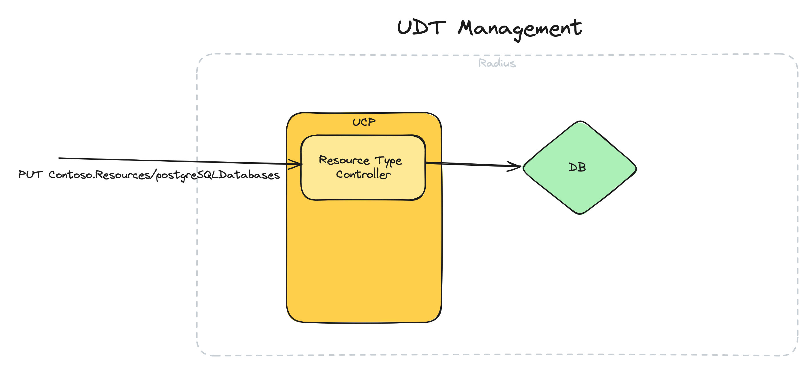
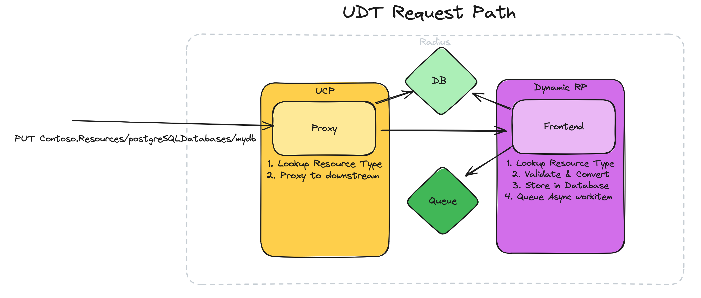

# User-Defined Types

* **Author**: `Ryan Nowak` (`@rynowak`)

## Overview

*This document is a high-level overview of the user-defined types feature. The scope of user-defined types is BIG. So we'll have several follow-up documents to dig into details where important.*

Resources are the unit of exchange in the Radius API. All of our user-experiences like the CLI, Dashboard, and Bicep authoring are oriented around the catalog of resources. Because Radius is strongly-typed, the set of resource types and their schemas are also defined as a primary concept in Radius. In order for Radius to support each additional kind of resources, for example a PostgreSQL database, we must first have a type definition.

However, the set of resource types in Radius are currently *system-defined*. Users cannot define additional resource types without making a custom build of Radius. The *user-defined-types* feature enables end-users to define their own resource types as part of their tenant of Radius. User-defined types have the same set of capabilities and enable the same features (connections, app graph, recipes, etc) as system-defined types in Radius. 

Since our goal is to enable a broad community, we want to lower the barrier of entry for creating a new type. This document will define a new model for creating user-defined types based on a dynamic and declarative implementation. The declarative approach for defining a user-defined type will be supported alongside the existing support for imperative resource providers.

Lastly, we'll know that the user-defined types feature is right when we can use it for the resource types that are shipped as part of Radius. It's our goal to update existing implementations of types like `Applications.Datastores/redisCaches` to use user-defined types.

## Terms and definitions

*Please read the [Radius API](https://docs.radapp.io/concepts/technical/api/) conceptual documentation. This document will heavily use the terminology and concepts defined there.*

| Term                          | Definition                                                                                                                                                                                                                                                                                                                                                                                                                                    |
| ----------------------------- | --------------------------------------------------------------------------------------------------------------------------------------------------------------------------------------------------------------------------------------------------------------------------------------------------------------------------------------------------------------------------------------------------------------------------------------------- |
| System-defined type           | A resource type that is built-in to Radius. Cannot be defined or modified except by making a custom build of Radius.                                                                                                                                                                                                                                                                                                                          |
| User-defined type             | A resource-type that can be defined or modified by end-users.                                                                                                                                                                                                                                                                                                                                                                                 |
| OpenAPI/Schema                | A format for documenting HTTP-based APIs. In this document we're primarily concerned with the parts of OpenAPI pertaining to request/response bodies.                                                                                                                                                                                                                                                                                         |
| Resource Provider (RP)        | A microservice that implements support for one or more resource types grouped under the same namespace (eg: `Applications.Core`). Radius provides several resource providers in the default installation. Resource provider can also refer to a group of related types under a common namespace.                                                                                                                                              |
| Resource Provider protocol    | The protocol used for communication between UCP and the resource provider. Resource providers must implement validation, versioning, storage, and asynchronous processing for the resources they manage.                                                                                                                                                                                                                                      |
| Imperative Resource Provider  | An implementation of the resource provider protocol that handles all implementation aspects with explicit code (validation, versioning, storage, asynchronous processing). Our existing resource provider implementations are considered imperative.                                                                                                                                                                                          |
| Declarative Resource Provider | A resource provider implementation that relies on declarative functionality to implement the resource provider protocol. For example, a resource provider could rely on declarative schemas for validation and conversion, and recipes asynchronous provisioning. This is a new model for defining types in Radius and is the focus of this document. All existing Radius functionality uses imperative resource providers (not declarative). |

## Objectives

> **Issue Reference:** https://github.com/radius-project/radius/issues/6688

### Guiding principles

We have two guiding principles for how we make decisions and prioritize investments. 
- User-defined types must be simple and declarative for application and recipe scenarios.  The highest value scenario is building custom application platforms. We want to build a big ecosystem and so user-defined types should be easy to adopt and easy to develop.
- User-defined types should be powerful enough for the Radius maintainers to use. We want to leverage user-defined types and declarative functionality as much as possible.


### Goals

- Support dynamic management of resource providers and resource types.
	- eg: Users can register and unregister resource providers and resource types.
	- eg: Tooling like the Dashboard and `rad` CLI dynamically query the set of resource types rather than hardcoding a list of known types.
- Support users defining their own resource providers and resource types declaratively.
	- Support rich declarative validation of resource request bodies based on schema.
	- Support versioning for user-defined resource types.
		- Including the ability to support multiple API versions.
		- Including the ability to introduce breaking changes between versions.
	- eg: Users can define a new resource type and it's schema. Radius will use the schema for validation. Users can add new versions of the resource type, and old ones continue to function.
- Support use of user-defined types in Bicep with full fidelity.
	- eg: Users can define their own types and use them in their Bicep application definitions.
- Support use of user-defined types as part of an application with full fidelity.
	- User defined types can opt-in to support connections, recipes, application-graph.
	- eg: Users can define their own types and incorporate them in applications. They work the same as existing types that weren't defined by the user.
- Support multiple implementation choices for user-defined types.
	- User-defined types should be easy to implement using declarative functionality.
	- User-defined types should be powerful enough to support implementing a resource-provider.
- Cultivate an open-source ecosystem for user-defined types.
	- Users can find documentation for how to define and publish user-defined types either through open-source or internally to their organization.
	- Users can find prescriptive guidance to simplify the design of resource schemas. 
	- Users have a productive inner-loop for developing resource types supported by tooling and documentation.
	- The Radius project maintains a community types repository with infrastructure for testing, publishing, and contributing.
	- The Radius project defines a maturity model for a type graduating from the *community* repository to official support as part of the `Applications.[xyz]` namespace.
- The Radius project heavily leverages the user-defined types infrastructure for the implementation of Radius.
	- All system-defined types provide a schema through the same registration mechanism as user-defined types. 
	- Most of the currently system-defined types migrate to use user-defined types. We will allow exceptions for resource types that have unique requirements like `Applications.Core/secretStores`.

### Non goals

- (non-goal): Migrate **all** existing resource types to use the declarative approach. 
	- Some types in Radius have special behaviors that are intentionally unique.
	- eg: `Applications.Core/secretStores` has a unique set of capabilities for interacting with secrets. We should probably not expand the scope of declarative user-defined types to include this because it's complex and not valuable.
- (non-goal): Support all existing API-design constructs in declarative user-defined types. 
	- It's our goal to simplify the API design guidance for users. We should be open to rethinking existing practices if they cause us or users difficulty.
- (non-goal): Support compatibility with existing APIs/features as we migrate existing Radius functionality. 
	- It's our goal to simplify the experience for users. We should be open to rethinking existing features and designs if it is overall better. 
- (out of scope): Building an SDK for writing a resource provider microservices. Our priority is to simplify the experience for authoring resource types declaratively. We will wait for feedback before creating comprehensive support to author a resource provider microservice.
- (out of scope): Supporting resource types for use cases other than applications. Our priority is to simplify the experience for authoring resource types that will be used in applications. 
  - eg: Extensibility for other planes like Azure. (It doesn't make sense).
  - eg: Resources in the Radius plane that use scopes other than resource group. (Not a top priority, can be added in the future).
  
### User scenarios (optional)

The scenario document for user-defined types is in progress [here](https://github.com/radius-project/design-notes/pull/58). Please refer to the scenarios defined in that doc.

## User Experience (if applicable)

Proposed user-experience changes are defined in the [scenario doc](https://github.com/radius-project/design-notes/pull/58).

Here's a abstract summary. 

Jenny is a platform engineer implementing support for PostgreSQL in Radius. This is her first time creating a new resource type in Radius. Her E2E experience authoring a declarative user-defined type looks like this:

**Authoring**

1. Choose a name for the resource provider and new type. She chooses `Contoso.Example/postgreSQLDatabases` as the resource type (meaning `Contoso.Example` is the name of the resource provider).
2. Design a schema for the new type. She's inspired by the design of `Applications.Datastores/sqlDatabases` (MS SQL Server) and chooses something similar. Her new type will return fields like `database`, `port`, `host`, `username`, `password`, and `url`. 
3. Author a manifest for the new resource provider `Contoso.Example`. She needs to make a few choices at this stage:
   1. Choose an API version, she picks `2024-08-01`. 
   2. She wants to use recipes for provisioning with the new type.
4. Use the tools + manifest to generate:
   1.  A Bicep extension (like the `radius` or `aws` Bicep extension)
   2.  A "cooked" version of the manifest that can be used with `rad resourceprovider create ...`. 

*At this point she's done authoring code/assets for the new type and resource provider.*

**Using**

1. Use `rad resourceprovider create ...` to register the resource provider and resource type with Radius.
2. Use `rad recipe register ...` to register a recipe for `Contoso.Example/postgreSQLDatabases`
3. Add the Bicep extension to her local `bicepconfig.json`. Now she can add `extension contoso` to a Bicep file and use `Contoso.Example/postgreSQLDatabases` from Bicep.
4. `rad deploy app.bicep`

**Publishing (optional)**

*Depending on who she wants to share her work with, she might do a few different things.*

1. Publishing to the internet.
   1. She publishes the Bicep provider to a public OCI registry.
   2. She hosts the provider manifest on `github.com` in a personal public repo.
   3. She publishes instructions for use and some example recipes in the same public repo.
2. Publishing internally to her company.
   1. She publishes the Bicep provider to an internal OCI registry.
   2. She adds the provider manifest to internal repos that are used with GitOps. Now the type is available in all of their internal Radius installations.
   3. She does the same with recipes.
   4. She adds instructions for use to internal wikis and templates.
3. Contributing to upstream
   1. She forks the `radius-project/types` repo (real name TBD).
   2. She follows an issue template in the repo and creates a pull-request to make her new type available as `Applications.Datastores/postgreSQLDatabases`.
   3. She does the same with the recipes that she created.
   4. After a few rounds of feedback her work is accepted and merged.
   5. The official Radius project will publish the Bicep extension and maintain support for `Applications.Datastores/postgreSQLDatabases` going forward.

## Design

For users who want to implement new types, the biggest choice is how they want provisioning to behave. Users have the option to use the declarative support provided by recipes, or write imperative code in a resource provider to implement their own custom logic.

Recipes are a good choice when the provisioning logic for a resource type should be configurable. Choosing recipes means that end-users (operations users) of the resource type can configure IaC templates and specialize the configuration of the resources on a per-environment basis. Since the Recipe Engine is provided by Radius, choosing recipes places a lower burden on the implementer.

Custom (imperative) provisioning logic is the best choice if the provisioning logic is based on pre-existing code, or when the logic should not be made configurable. A good use case would be an existing internal-only authentication/identity service. It's a goal to reuse existing code, and it's a non-goal to make the service replaceable/configurable via recipes. Since the provisioning logic is custom, implementer need to author and deploy a control-plane service (called the Resource Provider) to host their custom logic.

----
In Radius/UCP, resource providers perform the following main tasks:

- Validation/Serving of requests
- Versioning 
- Storage and retrieval
- Asynchronous Provisioning

Our existing resource providers (like our `Applications.Core`) implement all of these tasks imperatively in code. We know from our own experience that this is a lot of work, and probably too much work to grow a community. We also know from user-research that platform teams will use features like UDTs **heavily**. The big consumers won't be writing 3 types, they will be writing 30+. 

As a result, the focus of the user-defined types workstream is to reduce the investment needed to define a new type by introducing a declarative approach. The work proposed here will provide declarative implementations of Validation/Serving, Versioning, and Storage/Retrieval for implementers to leverage. It's helpful to think of declarative resource provider functionality as an a-la-carte menu rather than a binary decision. We will provide escape hatches where the built-in support is not sufficient.

implementers of extensibility should be empowered to focus on the asynchronous provisioning task, which they can implement either with recipes (declarative) or in custom code (imperative).

For the features we own (like our `Applications.Core`) they already exist as fully-imperative resource providers. We should try to leverage the declarative UDT infrastructure where possible to reduce maintenance and test cost. This will take time, and not everything should be migrated. 

We should conclude that the resource provider protocol must be supported long term, and also that a hybrid approach must be supported. eg: It must be viable for a single resource provider to support both the imperative approach for some types and the declarative approach for others. This is essential to provide continuity for our own services, and also to ensure that users can opt-in to more power when the tradeoff is right.

The focus of this design document will be on the new declarative functionality because it's new. Keep in mind that the existing resource provider support will remain in place. We're not talking much about it because it already works.

### High Level Design

User-defined types functionality can be broken down into a few different dataflows and systems.

- **Registration and management of user-defined types**: This is a new API that provides CRUDL behavior for the concept of *resource type*. This applies to all resource types regardless of implementation.
- **Request path for resources implemented declaratively**: This includes routing, validation, storage, and versioning. We typically refer to this today in Radius as the *frontend*.
- **Processing for resources implemented declaratively**: This includes Recipes or any other asynchronous processing that occurs as a result of a `PUT` or `DELETE` operation. We typically refer to this today in Radius as the *async-worker*.
- **Tooling that interacts with the Radius API**: This includes the `rad` CLI, Bicep, and Dashboard. When the set of resource-types in Radius is dynamic, then the tools need to be dynamic as well. 
- **Tooling to author user-defined type schemas**: This includes any tooling we produce to validate a schema, or to transform a schema into a Bicep extension. 

We can also break these systems down by their components in Radius. 
- Registration and management of user-defined types is part of UCP. Since UCP is the *front-controller* for Radius and is responsible for routing, it makes logical sense that UCP would implement the management of user-defined types.
- Request path for declarative resources is either part of UCP or a new component. 
	- UCP implements routing, and will validate that the incoming request is destined for a valid resource type. 
	- The other *frontend* concerns (validation, storage, versioning) could either be implemented inside UCP or another new component. 
- Asynchronous processing using recipes is either part of UCP or a new component.
	- The async-worker for the `backend` should probably be hosted in the same component as the `frontend` like our existing resource providers.
- Tooling that interacts with the Radius API is outside the control plane. These features are implemented in the relevant tool. 
  - Bicep already has extensibility that we can leverage.
- Tooling to author user-defined type schemas is outside the control plane. Depending on the exact needs this is part of the `rad` CLI or some other tool. 

From this can extract the idea of a *Dynamic-RP* - this is a new component that executes the declarative logic on behalf of a user-defined type. It's like our existing resource providers, except it's dynamic and driven by the schema definitions provided by users.

### Architecture Diagram

#### Resource Type Management



<center>

*Figure: Diagram of user-defined type registration* [link](https://excalidraw.com/#json=V8jLG-XK7VYZQ5AMAfsRJ,zwUXvuelafgFL2AAGZDsEA)

</center>

#### Request Path



<center>

*Figure: Diagram of user-defined type request path* [link](https://excalidraw.com/#json=cqcrjP7qY1UgbWETA6nDC,bW1ZTLIrshMgCgD50NrzBg)

</center>

#### Asynchronous Processing


<center>

*Figure: Diagram of user-defined type async processing* [link](https://excalidraw.com/#json=kHTPUX6ihLJOsW01eSL-o,tr8NQU3nHDBA2OfhGTWPzw)

</center>


### Detailed Design

This is an overview design document and so the bulk of the decision making will be carried out via follow-up documents. The following documents are planned:

- Resource Type registration APIs (TODO)
	- Includes enhancements to UCP routing.
- Declarative Resource Type schemas (TODO)
	- Includes API design guidelines, naming guidelines.
	- Includes validation behaviors.
	- Includes capability model (eg: how does a resource type opt-in to Recipes or Connections)
- Declarative API versioning (TODO)
	- Includes support for multiple versions and support for breaking changes.
- Dynamic-RP (TODO)
	- Ties together the decisions about validation, versioning, storage.
	- Calls into Recipe engine.
- Tooling support for using user-defined types (TODO)
	- Includes new CLI commands for managing user-defined types.
	- Includes updates to existing CLI commands for user-defined types.
	- Includes updates to existing Dashboard functionality for user-defined types.
- Tooling support for authoring user-defined types (TODO)
	- Includes functionality for scaffolding a user-defined type project.
	- Includes functionality for generating or authoring a resource type manifest.
	- Includes functionality for generating a Bicep extension.
- Community repository and process for resource-types. (TODO)

----

There are also a few major decisions to be made at a top-down level, which are captured here.

#### Declarative resource providers are most valuable

Our scenario doc and jobs-to-be-done analysis highlights that authoring user-defined-types needs to be easy and have a low barrier to entry. This design proposal supports that goal by providing a fully-declarative path for implementing a user-defined type. 

**Consider the easiest we could make it for users:**

- Validation is declarative (OpenAPI + annotations for validation).
- Versioning and conversion is declarative and automatic (annotations for conversion).
- Storage is built-in and not managed by users.
- Asynchronous processing uses Recipes.

The advantage of a fully-declarative system is that easy to implement and that there are no additional control-plane components to host. 

> Consider a case where a user needs to validate input against a regex. It's obvious how this can be implemented in a fully-declarative way.

Declarative validation can be quite powerful. Kubernetes is enhancing their [declarative validation](https://kubernetes.io/docs/reference/access-authn-authz/validating-admission-policy/) using [CEL](https://github.com/google/cel-spec) so that imperative validation is needed in fewer scenarios. 

For asynchronous processing, we're starting from a strong position using the recipe engine. The vast majority of useful scenarios for extensibility are creating abstractions over cloud resources.

---

**If this isn't enough (validation & versioning):**

The disadvantages of a fully-declarative system is that it's fundamentally limited. Users can only do the things we enable. As a motivating example, consider a resource that needs to validate the availability of a hostname against an existing internal service registry. There's no way to make this declarative, because Radius doesn't know how to talk to the service registry. This requires extensibility for the **frontend** of Dynamic-RP.

The well-understood solution to this problem is to offer support for webhooks. If we find significant cases where declarative validation or conversion is not enough, then we'd go down a [similar path to Kubernetes](https://kubernetes.io/docs/reference/access-authn-authz/extensible-admission-controllers/) and add webhooks. 

**The decision to add webhook support is not part of the planned initial scope - it will be driven by user-feedback.**

----

**If this isn't enough (asynchronous processing):**

The disadvantage of the recipe engine is that it's limited to the things that recipes can already do (IaC). Recipes also bring with them flexibility that may not be desirable. The value of a recipe is that it's customizable, and that may not be right for all user scenarios. If a users has some existing Java code that want to use inside a resource provider, it's not obvious how recipes enable that. This requires extensibility for the **backend** of Dynamic-RP.

The well-understood solution to this would be to offer callbacks for backend operations. It's appealing to base this on Dapr, and Dapr workflows in particular for ease of extensibility. Dapr supports all mainstream programming languages, so we would not be limiting users.

We've done prototyping of this approach using Dapr workflows and really liked the results. This won't be covered by this document - instead it's a likely future direction.

**The decision to add extensibility to the backend of Dynamic-RP is not part of the planned initial scope - it will be driven by user-feedback.**

##### Proposal

The proposal is that the first iteration of user-defined types will provide support for fully-declarative approach outlined above.

We also need to support the fully-imperative approach that we're already using. We won't document this or encourage users to use it. 

We also have future options to offer extensibility where the fully-declarative approach is too limiting:

- Webhooks for validation and conversion.
- Workflows for asynchronous processing.

#### Declarative resource types are implemented as an RP 

The proposal is to host the declarative infrastructure inside a new resource provider (Dynamic-RP). This ensures that the resource provider protocol is used for all interactions between UCP and any resource. UCP will not need to behave differently depending on how the resource provider is implemented.

The main advantage of implementing the new declarative functionality as a resource provider is that it's consistent with our current architecture. 

The proxy layer in UCP completes the following steps to route traffic:

- Validate the existence of the destination plane and resource group.
- Look up the resource provider / resource type and its downstream address.
- Proxy traffic to the resource provider.
- Interpret the result and update internal state.

##### Proposal

We should implement user-defined types as a resource provider with dynamic behavior. The new resource-provider could be hosted inside UCP directly or in its own microservice.

### API design (if applicable)

API design will be covered as part of the *Resource Type registration APIs* and *Resource Type schemas* design documents.

### CLI Design (if applicable)

CLI design will be covered as part of the *Tooling support for using user-defined types* design document.

### Implementation Details

N/A for this document. This is an overview. 

### Error Handling

N/A for this document. This is an overview. 

## Test plan

N/A for this document. This is an overview. 

## Security

The user-defined types feature has a few touchpoints with security.

- Secret handling: As part of the API design document we will review a proposed approach for handling secrets securely. The goal of this proposal is to rely on the `secretStores` type and avoid handling secrets as part of other APIs. This will simplify the security model overall for Radius.

- Strong typing for APIs and storage: As described in the [Kubernetes Structural Schema](https://kubernetes.io/blog/2019/06/20/crd-structural-schema/#towards-complete-knowledge-of-the-data-structure) blog post, an API can introduce vulnerabilities whenever it persists unvalidated data. The implementation of user-defined types will increase the level of validation and improve the overall security posture of Radius.

## Compatibility (optional)

Current UCP does not know the individual resource types that belong to a resource provider. It only validates the provider namespace. When we introduce the APIs for registration of resource types/providers, we should begin registering the built-in types. This can be rolled our gradually without breaking users.

## Monitoring and Logging

The Dynamic-RP design document will cover monitoring and logging. We don't anticipate any new kinds of telemetry, but if we build a new component we must add the boilerplate to produce the telemetry we already support.

## Development plan

We can implement user-defined types through a staged development plan. This plan is designed to enable the user-defined type end-to-end early to unblock functional testing and community feedback. After user-defined types reach MVP status, we shift focus to enhancing them and getting the community involved.

Stages are described in linear order, but many of them can be parallelized. I chose what I felt was a sensible progression, but it's not strictly defined.

### Phase 1: Enabling the UDT end-to-end

#### Stage 1: Type Registration APIs

- Define API for CRUDL operations and resource providers and resource types.
- Add `rad` CLI commands `rad resourceprovider xyz` and `rad resourcetype xyz`.
- Update UCP routing logic to leverage the stored resource type data.
- Add functional tests for registering a resource type and querying it.

Exit criteria: it's possible to register and perform operations on the resource provider/type APIs.

#### Stage 2: Register built-in types

- Define resource provider manifests for built-in resource providers/types like `Applications.Core` and `Microsoft.Resources/deployments`. Schemas for these types are not required.
- Use the UCP startup sequence to register these manifests.
- Remove legacy code path from UCP routing logic. Now only registered types are supported.

Dependency: Stage 1

Exit criteria: all functional tests passing using new routing behavior in UCP. All built-in resource types can be queried with the CLI.

#### Stage 3: CLI enhancements

- Remove hardcoded resource type validation from the CLI and replace with queries of the resource provider/type APIs.
- Add support for `rad resource create`. A new CLI command that can create resources of any type. This is needed to properly exercise the user-defined types feature until Bicep support comes online.

Dependency: Stage 1

Exit criteria: existing tests passing. Add functional test for `rad resource create` using an existing built-in resource.

#### Stage 4: Dynamic Resource Provider (Dynamic-RP)

- Implement dynamic resource provider with support for CRUDL operations.
  - No support for validation (yet).
  - The dynamic resource provider requires the use of Recipes.
- Implement integration tests and functional tests for Dynamic-RP's basic resource lifecycle using `rad resource create`.

Dependency: Stage 2

Exit criteria: new functional tests exercise the dynamic resource provider.

#### Stage 5: Bicep Support

- Implement a TypeSpec generator that can generate a resource provider manifest and Bicep extension manifest.
- (If necessary): Update deployment engine logic to generate correct resource ids/URLs for user-defined types.
- Implement functional tests that exercise user-defined types with Bicep.

Dependency: Stage 4 needed for functional testing, no dependency to begin work.

Exit criteria: new functional tests that exercise the dynamic resource provider with Bicep. 

### Phase 2: Completing the UDT feature

Note: at this point the UDT feature can do useful work end-to-end. The stages in this section make UDT feature-complete.

#### Stage 6: Documentation and Samples

We can begin adding documentation and samples once we reach **Stage 5**. Starting as soon as the features are useful allows us to incremental improve the documentation as more features come online.

Dependency: Stage 5

Exit criteria:

- Tutorial created for an end-to-end of authoring a user-defined type and using it.
- Conceptual documentation for extensibility.
- Call-to-action for users to try it out and give feedback.

#### Stage 7: Schema Validation

- Accept an OpenAPI v3 schema as part of a resource type.
- Implement OpenAPI validation in the dynamic resource provider.

Dependency: Stage 4

Exit criteria: new negative tests for the dynamic resource provider.

#### Stage 8: Creation of community repo and contribution process

At this stage we don't expect breaking changes going forward. UDTs will have reasonable guardrails in place (schema-based validation) so they are usable for many cases. 

- Create a community *contrib* repository for user-defined types.
- Create test automation to support contribution process.
- Define maturity model.
- Update existing `extenders` samples to use UDTs.
- Call-to-action for users to start contributing and building the catalog of supported services + recipes.

Dependency: Stage 7

Exit criteria: community members and adopters try out using + contributing UDTs and give us feedback. 

#### Stage 8: Safe Unregistration/Modification

- Polish support for unregistering a resource provider.
  - An in-progress `DELETE` operation on a resource type should block operations on resources of that type other than `DELETE`.
  - An in-progress `PUT` operation on a resource type should block all operations on resources of that type.
  - When a resource type is being `DELETE`ed it should also delete all resources of that type.

Dependency: Stage 4

Exit criteria: new negative tests for the dynamic resource provider.

#### Stage 9: Implement connections

- The container RP should be able to define connections to a user-defined type. 
  - Connections includes app-graph.
  - Connections includes injecting configuration values and secrets into the container.

Dependency: Stage 4

Exit criteria: new functional tests the connections scenario.

## Open Questions

**Q. What is the authoring format for defining user-defined types?** 

Our proposal is to use TypeSpec. TypeSpec is highly extensible and allows us to generate all of the assets needed from a single definition (resource provider manifest, bicep extension manifest, documentation) and has extensible validation/linting.

We need to do additional prototyping to prove out the approach. For now this design document assumes that TypeSpec will be used.

**Q: Will the deployment engine need any changes?**

I'm not sure. 

For each resource provider we'll generate a separate Bicep extension. The code that users will write is similar to:

```bicep
extension radius
extension contoso

resource foo 'Contoso.Example/someExampleResources@2024-01-01' = {
	...
}
```

When the deployment engine gets the compiled ARM-JSON template it will need to know that `contoso` is a Radius extension. We'll want to confer with the Bicep team on how this should work.

## Alternatives considered

The major alternative would be to avoid implementing extensibility for types. We definitely want this feature.

## Design Review Notes

- Significant iterations in terminology:
  - Declarative UDT -> Declarative Resource Provider
- Simplifications of the doc:
  - Moved complex and detailed decisions out of this document into detailed docs.
- Clarifications:
  - Detailing future options and hybrid scenarios.
  - Made it clear that declarative functionality is a menu rather than a binary choice.