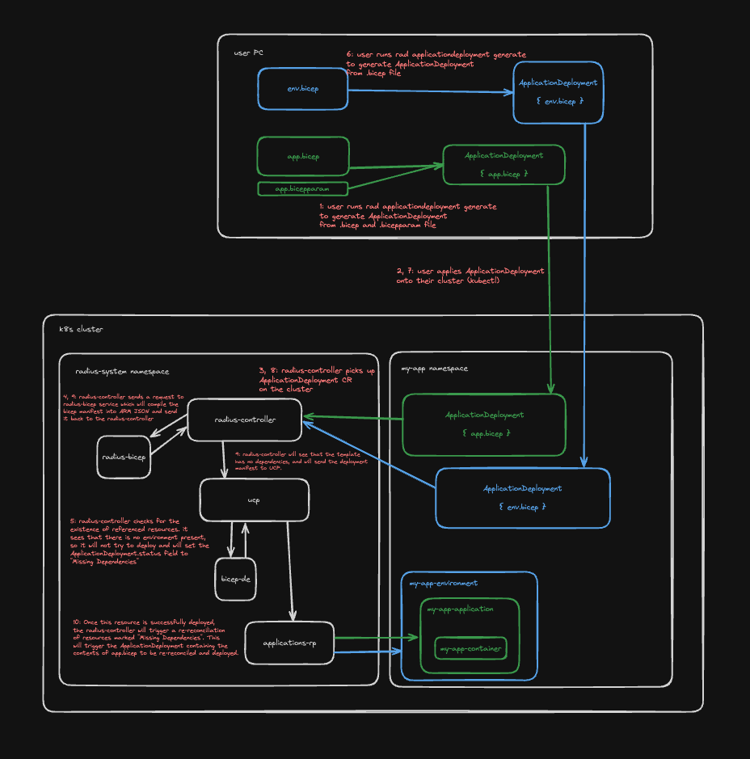

# ApplicationDeployment Controller

* **Author**: Will Smith (@willdavsmith)

## Overview

<!--
Provide a succinct high-level description of the component or feature and 
where/how it fits in the big picture. The overview should be one to three 
paragraphs long and should be understandable by someone outside the Radius
team. Do not provide the design details in this, section - there is a
dedicated section for that later in the document.
-->

Currently, there is little support for deploying Radius resources without the use of the Radius CLI. This complicates future scenarios (such as support for GitOps) because GitOps and other tools that we want to integrate with are unable to deploy Radius resources (as defined in Bicep manifests) directly. Today, Radius is primarily deployed onto Kubernetes clusters, and naturally most of the existing Kubernetes ecosystem only works with Kubernetes resources. This design document proposes updates to Radius will allow users to deploy Radius resources by authoring Kubernetes CRDs.

## Terms and definitions

<!--
Include any terms, definitions, or acronyms that are used in
this design document to assist the reader. They may or may not
be part of the user-facing experience once implemented, and can
be specific to this design context.
-->

**CRD (Custom Resource Definition)**: A Kubernetes resource that allows users to define their own resource types.

**GitOps** A way to do Kubernetes cluster management and application delivery. It works by using Git as a single source of truth for declarative infrastructure and applications.

## Objectives

<!--
Describe goals/non-goals and user-scenario of this feature to understand
the end-user goals.
* If the feature shares the same objectives of the existing design, link
  to the existing doc and section rather than repeat the same context.
* If the feature has a scenario, UX, or other product feature design doc,
  link it here and summarize the important parts.
-->

### Goals

<!--
Describe goals to define why we are doing this work, how we will make
priority decisions, and how we will determine success.
-->

**Goal: Radius resources can be deployed by authoring a Kubernetes CRD**

**Goal: Radius resources can be deployed without using the Radius CLI or directly calling Radius APIs**

**Users have a simple script available to generate the necessary CRD**

### Non-goals

<!--
Describe non-goals to identify something that we won’t be focusing on 
immediately. We won’t be expending any effort on these matters. If there
will be follow-ups after this work, list them here. If there are things
we plan to do in the future, but are out of scope of this design, list
them here. Provide a brief explanation on why this is a non-goal.
-->

**Non-goal: Full support for GitOps**
- We will not yet be implementing automatic generation of ApplicationDeployment resources from Bicep manifests or querying Git repositories. This design will be covered in a separate design document.

**Non-goal: Deletion of resources**
- This design document does not cover the specifics of how resources will be deleted after they are removed from a Bicep manifest. For now, we will only be focusing on the creation of resources similar to how the Radius CLI works today. This design will be covered in a separate design document.

### User scenarios

<!--
Describe the user scenarios for this design. Ensure that you define the
roles and personas in these user scenarios when it requires API design.
If you have an existing issue that describes the user scenarios, please
link to that issue instead.
-->

#### Rin can use Radius with GitOps

Rin is an infrastructure operator who uses GitOps to automate the creation of developer Kubernetes clusters. Today, she publishes Kubernetes manifests to a GitHub repository, and a GitOps tool watches the repository and applies the manifests to the Kubernetes cluster. She wants to have a Radius environment and a set of recipes available on the clusters for her developers to use, since they are building applications using Radius.

She first sets up the Radius Helm chart as a dependency in the cluster, and then runs the `rad applicationdeployment generate -t env.bicep -p env.bicepparam -o env.yaml` command on her machine to create an ApplicationDeployment resource that contains the template and parameters specified. She then commits the ApplicationDeployment resource to the Git repository.

When a developer creates a new development cluster using the configuration specified in Rin's GitHub repository with a GitOps tool, the ApplicationDeployment resource is applied to the cluster, and the Radius environment defined in the `env.bicep` Bicep manifest is deployed. The developer can then use the environment to deploy and test their applications using Radius.

## User Experience
<!--
If the change impacts the user experience, provide expected interaction 
flow we aim to achieve through this proposal.

When users interact with Radius through the CLI, include sample 
input commands and their corresponding output. Include a bicep/helm code 
sample, if this proposal involves updates to that experience.
-->

**Sample Input:**
<!--
Provide a sample CLI command input and/or bicep/helm code.
-->

#### `env.bicep`
```bicep
extension radius

param k8sNamespace string

resource env 'Applications.Core/environments@2023-10-01-preview' = {
  name: 'env'
  properties: {
    compute: {
      kind: 'kubernetes'
      namespace: k8sNamespace
    }
  }
}
```

#### `env.bicepparam`
```bicep
using './env.bicep'

param k8sNamespace string = 'demo'
```

```
> rad applicationdeployment generate -t env.bicep -p env.bicepparam -o env.yaml
```

**Sample Output:**
<!--
Provide a sample output for the inputs provided above.
-->
```
> rad applicationdeployment generate -t env.bicep -p env.bicepparam -o env.yaml

Generating ApplicationDeployment resource...
ApplicationDeployment resource generated at env.yaml

To apply the ApplicationDeployment resource, run:
kubectl apply -f env.yaml
```

#### `env.yaml`
```yaml
kind: ApplicationDeployment
apiVersion: radapp.io/v1alpha3
metadata:
  name: demo
  namespace: demo
spec:
  template: |
    extension radius

    param k8sNamespace string

    resource env 'Applications.Core/environments@2023-10-01-preview' = {
      name: 'env'
      properties: {
        compute: {
          kind: 'kubernetes'
          namespace: k8sNamespace
        }
      }
    }
  parameters: |
    using './env.bicep'

    param k8sNamespace string = 'demo'
```

## Design

### High Level Design
<!--
High level overview of the data flow and key components.

Provide a high-level description, using diagrams as appropriate, and top-level
explanations to convey the architectural/design overview. Don’t go into a lot
of details yet but provide enough information about the relationship between
these components and other components. Call out or highlight new components
that are not part of this feature (dependencies). This diagram generally
treats the components as black boxes. Provide a pointer to a more detailed
design document, if one exists. 
-->

This design proposes the creation of two new components of the Radius control plane: the ApplicationDeployment reconciler (part of the `radius-controller`) and a new service that is responsible for compiling ARM JSON from Bicep manifests (`radius-bicep`).

The `radius-controller` will be responsible for reconciling ApplicationDeployment resources. When an ApplicationDeployment resource is created or updated, the controller will read the Bicep template and parameters from the ApplicationDeployment resource and send them to the `radius-bicep` service. The `radius-bicep` service will compile the Bicep and bicepparam files into ARM JSON and return the ARM JSON to the `radius-controller`. The `radius-controller` will then send the ARM JSON payload to UCP to deploy the resources.

### Architecture Diagram
<!--
Provide a diagram of the system architecture, illustrating how different
components interact with each other in the context of this proposal.

Include separate high level architecture diagram and component specific diagrams, wherever appropriate.
-->



### Detailed Design

<!--
This section should be detailed and thorough enough that another developer
could implement your design and provide enough detail to get a high confidence
estimate of the cost to implement the feature but isn’t as detailed as the 
code. Be sure to also consider testability in your design.

For each change, give each "change" in the proposal its own section and
describe it in enough detail that someone else could implement it. Cover
ALL of the important decisions like names. Your goal is to get an agreement
to proceed with coding and PRs.

If there are alternatives you are considering please include that in the open
questions section. If the product has a layered architecture, it's good to
align these sections with the product's layers. This will help readers use
their current understanding to understand your ideas.

Discuss the rationale behind architectural choices and alternative options 
considered during the design process.
-->

#### ApplicationDeployment Custom Resource Definition

The `ApplicationDeployment` resource will be a new Kubernetes CRD that will be used to contain the Bicep template and parameters for deploying Radius resources. The CRD will have the following fields:

- `spec.template`: The Bicep template file that defines the resources to deploy
- `spec.parameters`: The Bicep parameters file that defines the parameters for the template
- `status`: The status of the deployment, which will be one of the following values:
  - `Pending`: The deployment is pending
  - `Deployed`: The deployment has been completed
  - `Missing Dependencies`: The deployment is missing dependencies

#### `rad applicationdeployment generate` Command

The `rad applicationdeployment generate` command will be a new command that will generate an ApplicationDeployment resource from a Bicep template and parameters file. The command will take the following arguments:

- `-t, --template`: The path to the Bicep template file
- `-p, --parameters`: The path to the Bicep parameters file
- `-o, --output`: The path to the output file where the ApplicationDeployment resource will be written

The command will read the Bicep template and parameters files and generate an ApplicationDeployment resource with the template and parameters set. The command will write the ApplicationDeployment resource to the output file.

#### ApplicationDeployment Controller

The `radius-controller` will be updated to include a new controller that watches for ApplicationDeployment resources. When an ApplicationDeployment resource is created or updated, the controller will read the Bicep template and parameters from the ApplicationDeployment resource and send them to the `radius-bicep` service. The `radius-bicep` service will compile the Bicep and bicepparam files into ARM JSON and return the ARM JSON to the `radius-controller`.

For each of the resources in the template, the `radius-controller` will determine if the dependencies for the resource already exist by querying UCP. If they do not, then the controller will mark the ApplicationDeployment resource as "Missing Dependencies" with the resource that is missing and will not deploy the resource. If the dependencies do already exist for each of the resources in the template, then the controller will send the ARM JSON payload to UCP to deploy the resources. Once the deployment is complete, The controller will trigger a re-deployment of resources with status "Missing Dependencies" that depend on the newly deployed resources. The controller will update the status of the ApplicationDeployment resource to "Deployed" once all resources have been deployed.

#### Bicep Service

The `radius-bicep` service will be a new service that is responsible for compiling ARM JSON from Bicep manifests. The service will expose an HTTP endpoint that accepts a payload containing a Bicep template and bicepparam file and returns the compiled ARM JSON. The service will use the Bicep compiler to compile the Bicep manifest and will return the ARM JSON to the caller. The service will be stateless and will not store any data.

### Alternatives Considered

We could package the Bicep compiler into the `radius-controller` service instead of creating a separate service.

### API design (if applicable)

<!--
Include if applicable – any design that changes our public REST API, CLI
arguments/commands, or Go APIs for shared components should provide this
section. Write N/A here if not applicable.
- Describe the REST APIs in detail for new resource types or updates to
  existing resource types. E.g. API Path and Sample request and response.
- Describe new commands in the CLI or changes to existing CLI commands.
- Describe the new or modified Go APIs for any shared components.
-->

#### API

There will be no changes to the Radius API.

#### CLI

There will be a new CLI command `rad applicationdeployment generate` that will generate an ApplicationDeployment resource from a Bicep template and parameters file.

### Error Handling
<!--
Describe the error scenarios that may occur and the corresponding recovery/error handling and user experience.
-->

#### ApplicationDeployment Controller

- If the Bicep template or parameters file is invalid, the controller will mark the ApplicationDeployment resource as "Invalid" and will not deploy the resources.
- If the dependencies for a resource do not exist, the controller will mark the ApplicationDeployment resource as "Missing Dependencies" and will not deploy the resource.
- If there is an error deploying a resource, the controller will mark the ApplicationDeployment resource as "Error" and will not deploy any more resources.

#### Bicep Service

- If the Bicep template or parameters file is invalid, the service will return an error response to the caller.


## Test plan

<!--
Include the test plan to validate the features including the areas that
need functional tests.

Describe any functionality that will create new testing challenges:
- New dependencies
- External assets that tests need to access
- Features that do I/O or change OS state and are thus hard to unit test
-->

TBW

## Security

<!--
Describe any changes to the existing security model of Radius or security 
challenges of the features. For each challenge describe the security threat 
and its mitigation with this design. 

Examples include:
- Authentication 
- Storing secrets and credentials
- Using cryptography

If this feature has no new challenges or changes to the security model
then describe how the feature will use existing security features of Radius.
-->

TBW

## Compatibility (optional)

<!--
Describe potential compatibility issues with other components, such as
incompatibility with older CLIs, and include any breaking changes to
behaviors or APIs.
-->

There should be no breaking changes or compatibility issues with other components.

## Monitoring and Logging

<!--
Include the list of instrumentation such as metric, log, and trace to 
diagnose this new feature. It also describes how to troubleshoot this feature
with the instrumentation. 
-->

TBW

## Development plan

<!--
Describe how you will deliver your features. This includes aligning work items
to features, scenarios, or requirements, defining what deliverable will be
checked in at each point in the product and estimating the cost of each work
item. Don’t forget to include the Unit Test and functional test in your
estimates.
-->

TBW

## Open Questions

<!--
Describe (Q&A format) the important unknowns or things you're not sure about. 
Use the discussion to answer these with experts after people digest the 
overall design.
-->

## Design Review Notes

<!--
Update this section with the decisions made during the design review meeting. This should be updated before the design is merged.
-->
