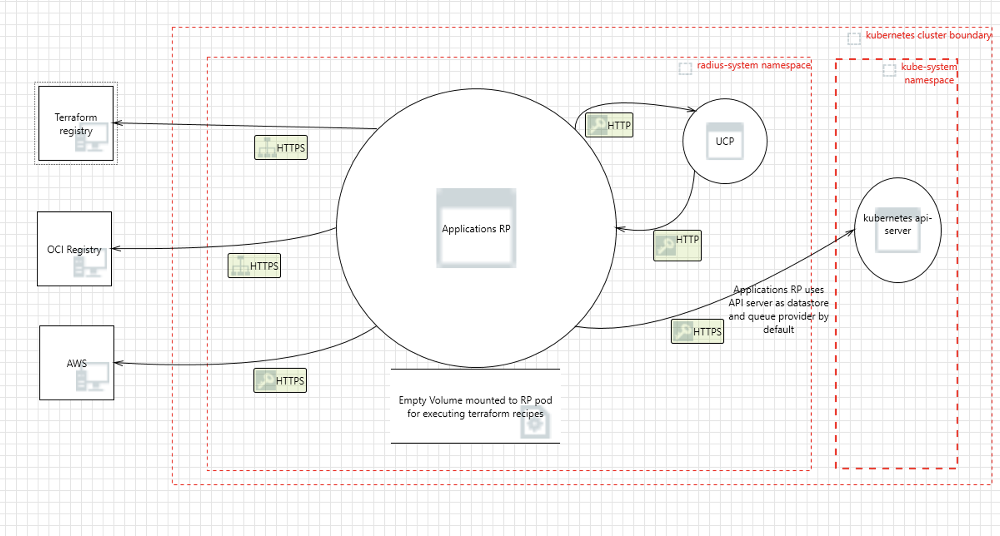

# Radius Applications RP Component Threat Model

- **Author**: @nithyatsu

## Overview

This document provides a threat model for the Radius Applications RP component. It identifies potential security threats to this critical part of Radius and suggests possible mitigations. The document includes an analysis of the system, its assets, identified threats, and recommended security measures to protect the system.

## Terms and Definitions

| Term                  | Definition                                                                                                                                                                                  |
| --------------------- | ------------------------------------------------------------------------------------------------------------------------------------------------------------------------------------------- |
| RP                 | Resource Provider    |
| UCP                 | Universal Control Plane for Radius   |

## System Description

Applications RP is a Radius control-plane microservice that acts as resource provider for application and its resources. When users deploy an application using Radius, Applications RP manages the lifecycle of the created resources on the user's behalf. 

- Deploying an application may launch the user application's code on the same cluster as Radius, or a different cluster. 

- Deploying application may created resources in the cloud using Recipes. These *recipes* are bicep or terraform code, and are responsible for creating These  application infrastructure components like databases.

- As a result, Applications RP has access to the user's cloud credentials and can managed the user's cloud resources.

Resource providers (including Applications RP) communicate over HTTP and manage the lifecycle of resources. See the [architecture documentation](https://docs.radapp.io/concepts/technical/architecture/) for more context.  Users and clients cannot directly communicate with Applications RP. They instead communicate with UCP. UCP forwards relevant requests to Applications RP. 
The RP has a datastore for storing Radius data, message queue for processing asynchronous requests, and a secret Store for storing sensitive information such as certificates. All these are configurable components and support multiple implementations.  

### Architecture

The RP consists of four types of resource providers for managing various types of resources in an application. `Applications.Core` resource provider manages core application resources such as application, environment, container and gateways. `Applications.Dapr` resource provider manages all dapr resources that are deployed as part of application. `Applications.Datastore` resource provider supports provisioning SQL database, Mongo DB and Redis Cache.
`Applications.Messaging` resources provider manages queues such as Rabbit MQ.

Applications RP has a key sub component `Recipe Engine` to execute `recipes`. 
`Recipes` are Bicep or Terraform code supplied by user that is used to deploy infrastructure components on Azure and AWS. The Bicep recipes are fetched from OCI compliant registries. Terraform recipes are public modules and fetched from internet too. 

In order to execute Terraform recipes, Applications RP installs latest Terraform. It also mounts an empty directory `/terraform` into Applications RP pod. It uses this directory for executing terraform recipes using the installed executable. The output resources generated from terraform module are converted to Radius output resources and stored in our datastore. 

In order to deploy bicep recipes, Applications RP sends a request to UCP, which in turn forwards it to Deployment Engine. 

The RP uses a queue to process requests asyncronously. Information about resources that are deployed / being deployed is stored in a datastore. 

Below is a high level overview of various key subcomponents in Applications RP
 

### Implementation Details

#### Use of Cryptography

1. **Computing the Hash for Terraform Backend Configuration**: [Link to code](https://github.com/radius-project/radius/blob/main/pkg/recipes/terraform/config/backends/kubernetes.go#L110).

   1. **Purpose**: The purpose of computing the hash is to compute a key for kubernetes secret which has the etrraform backend config
   2. **Library**: The library used to calculate the hash of the deployment configuration is the crypto library, which is one of the standard libraries of Go: [Link to library](https://pkg.go.dev/crypto@go1.23.1).
   3. **Type**: [SHA1](https://www.rfc-editor.org/rfc/rfc3174.html). Note: "SHA-1 is cryptographically broken and should not be used for secure applications." [Link to warning](https://pkg.go.dev/crypto/sha1@go1.23.1). This is used as an optimization for detecting changes, not as a security protection.

2. Applications RP also uses UCP's queue and store libraries. These libraries use Cryptography and are detailed in UCP threat model. [link to be added]

#### Storage of secrets

Applications RP has access to sensitive information related to the application resource it manages as well as the cloud credentials it requires for managing cloud resources on Azure and AWS. 

##### Managing cloud credentails

Applications RP requires AWS and Azure credentials for accessing and managing resources in cloud. It fetches credentials using UCP Secret Provider library. 
Credentials are not available for retrieval through API. The RP also supports [federated identity](https://docs.radapp.io/guides/operations/providers/overview) for both Azure and AWS. Unless there is a limitation that prevents using federated identity, users should prefer using this since it removes the need to store secrets. 

Using these credentials, Applications RP can create other resources in AWS and Azure. The RP also can create managed identities for azure which will decide who can deploy and run user code. 

#### Managing secrets for applications

Applications RP provides a secret store which can be used to store sensitive information such as TLS certificate and private keys. It uses kubernetes secrets to implement this secret store. In most cases, sensitive application data can be stored in this secret store and consumed by the application's other components such as a container. 

###### Managing secrets for datastores

Applications RP service has a Datastore RP. This RP is the resource provider for datstores such as SQL database, Mongo DB and Redis Cache. As of today, sensitive information such as DB connection string, user/ password that is required to provision these resources is stored in plain text. The feature which enables datastores to use a secret store is in progress. Until the feature is available, we recommend the users use recipes to deploy datastores. With recipe, the secrets are not stored in plain text.

#### Access to cluster

The RP can create and manage Kubernetes resources on behalf of the user. For example, it can deploy a container based on the image provided by the user. This container can execute arbitrary code and may create additional resources within the cluster where Radius is running or even in another cluster. The Application RP's service account allows the RP to securely authenticate with Kubernetes to perform these actions. The service account is configured with appropriate permissions to enable this. 

#### Exposing User Application to Internet

The Radius RP can create ingress Kubernetes objects, which can expose a kubernetes service to internet. 

#### Bicep Recipe execution

Bicep recipes can provision arbitrary infrastructure resources in the cloud, and are provided by users. In order to execute a Bicep recipe, Applications RP's Recipe Engine first authenticates with a OCI compliant registry and then  downloads the recipe from it. RP uses the stored Azure credentials to authenticate with the registry. RP also supports federated credentials. When enabled, RP uses this to authenticate with the registry. Whenever possible, federated identies should be preferred and used for robust security. After retrieving the Bicep recipe, the RP requests UCP to deploy it.

#### Terraform Recipe execution

Terraform recipes are download from internet too. We support public and private modules as well as different kinds of authentication.

Terraform downloads providers from the internet onto an empty directory `/terraform` which is mounted into the applications RP pod and executes them. This means that these providers have access to the network, filesystem, and environment variables, as well as the running memory of Applications RP. Terraform communicates with AWS as needed to deploy resources.

#### Data Serialization / Formats

We use custom parsers to parse Radius-related resource IDs and do not use any other custom parsers. The custom parser that parses Radius resource IDs has its own security mechanisms that don't accept anything other than a Radius resource ID. 

We also use json for data interchange between Applications RP and other services. We use golang standard libraries to parse json. 

## Clients

**UCP** UCP is the client of Applications RP.  It forwards all requests related to Applications and several of Application resources deployment to Applications RP.

## Trust Boundaries

We have a few different trust boundaries for the Controller component:

- **Kubernetes Cluster**: The overall environment where the Applications RP  operates and receives requests from the UCP.
- **Namespaces within the Cluster**: Logical partitions within the cluster to separate and isolate resources and workloads.

The Applications RP component lives inside the `radius-system` namespace in the Kubernetes cluster where it is installed. UCP also resides within the same namespace.

The Kubernetes API Server, with which Applications RP interacts, runs in the `kube-system` namespace within the cluster.

Today, the RP assumes that incoming requests are from a trusted user who is authorized to make the request. It should enforce this by checking that the requests are made by UCP. UCP in turn should accept requests from authorized and authenticated users and clients such as `rad cli`. Once we have Radius RBAC support, we should configure UCP so that it accepts requests only from authorized and authenticated users.

Applications RP deploys each Application and its resources in its own namespace. This is necessary for administrators of the Kubernetes cluster to correctly configure RBAC and limit the scope of permissions. 

## Assumptions 

This threat model assumes that:

1. The Radius installation is not tampered with.
2. The Kubernetes cluster that Radius is installed on is not compromised.
3. It is the responsibility of the Kubernetes cluster to authenticate users. Administrators and users with sufficient privileges can perform their required tasks. Radius cannot prevent actions taken by an administrator.
4. Radius stores and queues used by Applications RP are not compromised. 

## Data Flow

Below are the key points associated with data flow:
1. Applications RP receives request to deploy resources from UCP and sends back appropriate response.
2. Depending on the resource to be deployed Applications RP takes the next step 
    1. If the request is to deploy a recipe, Applications RP first downloads the recipe from a OCI registry (for bicep) or public module (for terraform)
    2. Applications RP requests UCP to deploy bicep recipes. Or if its a Terraform recipe, the downloaded recipe is exceuted using the installed terraform, in the empty terraform directory mounted into the Applications RP pod. As part of this executiion, Terraform integrated in RP makes AWS and Azure API calls. 
    3. If it is a kubernetes resource such as container, the RP interacts with API srever to render the resource.
3. Application RP uses API server to save Radius resources and Async Operations By default, API Server is used as Radius Datastore and Queue.

## Threats

#### Spoofing Applications RP could cause information disclosure, DDoS and misuse of cloud resources.

**Description:** If a malicious actor can spoof Applications RP, requests from UCP to be sent to the malicious actor. The malicious actor can also send requests to UCP such as fetching credentials. 

**Impact:** All data sent from UCP to Applications RP will be available to the malicious actor, such as payloads of resources. Applications RP would also be able to retreive credentials through UCP and make it available to malicious actor. The credentials can be used to misuse Az/ AWS resources. It might also request controller to update Environment recipes to use an outdated/ vulnerable version of the resource.

**Mitigations:**

Spoofing Applications RP, tampering with the applications rp code and configuration would require access to modify the `radius-system` namespace. Our threat model assumes that the operator has limited access to the `radius-system` namespace using Kubernetes' existing RBAC mechanism.

**Status:** All mitigations listed are currently active. Operators are expected to secure their cluster and limit access to the `radius-system` namespace.

#### Malicious user can make arbitrary requests to Applications RP API. 

**Impact**

This can cause a load of various Radius services and result in DDoS.

**Mitigation**

Radius currently does not support RBAC. Once we have that, we should restrict Radius API access to only Radius users/ admins. 

**Status**

Pending

#### Sniffing the communication between Applications RP  and Kubernetes API Server / UCP could cause information disclosure 

**Description:** 
If a malicious actor could sniff communication between the applications RP and the Kubernetes API Server Or UCP, the actor could replay the packets and cause a DDoS. 

**Impact:** 
A malicious actor could use the information about the resources and operations in progress. They can also replay the same requests to cause a DDoS.

**Mitigations**

1. Tampering with Application RP code/ configs would require access to modify the `radius-system` namespace. Our threat model assumes that the operator has limited access to the `radius-system` namespace using Kubernetes' existing RBAC mechanism.

**Status:** All mitigations listed are currently active. Operators are expected to secure their cluster and limit access to the `radius-system` namespace.

#### Using vulnerable images in recipes can increase the chances of security attack, leading to compromises on application resources as well as cluster. 

**Description** 
A malicious user could become the admin, and configure recipes to download vulnerable images for infrasture resources such as sql db.

**Impact** 
This can facilitate the attackers to exploit vulnerabilities and easily attack applications on the cluster and the cluster itself.

**Mitigations**
Ability to register recipes should be given to only trusted employees. This in turn requires Radius to support rbac. 

Since each application resource is deployed in application's namespace, we can still use kubernetes rbac to confine what resources can do across namespaces.

**Status**
Radius rbac support is pending. 

#### Using application definition to deploy malicious containers

**Description** 
Application definitions could create pods from any arbitrary image. This container executes code, and it can potentially lead to mis use of cluster resources. 

**Impact** 
These containers can then potentially expose secrets, over consume resources and create several resources , delete important infrasture etc. 

**Mitigations**
Application definition and images and recipes used should be reviewed and confined to trusted employees of the organization.

**Status**
Active (dependant on user's processes)

#### Applications RP has the a ability to create managed identities which if misused can lead to Escalation of Privilege

**Description:** If a malicious actor uses Radius, he could deploy Azure managed identity that could rpovide escalated priviledges to users.

**Impact:** A malicious actor use this ability to gain inappropriate access to azure resources. 

**Mitigations:**

1. Only authorized users should be able to deploy applications using Radius. 
   
**Status:** 

Pending. This mitigation requires RBAC support in radius.

## Open Questions

## Action Items

