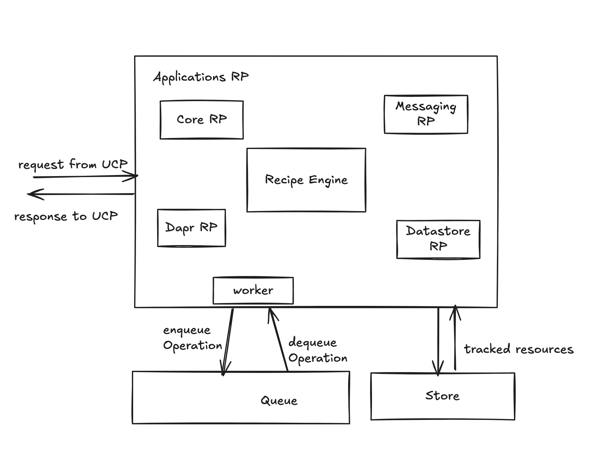

# Radius Applications RP Component Threat Model

- **Author**: @nithyatsu

## Overview

This document provides a threat model for the Radius Applications RP component. It identifies potential security threats to this critical part of Radius and suggests possible mitigations. The document includes an analysis of the system, its assets, identified threats, and recommended security measures to protect the system.

## Terms and Definitions

| Term                  | Definition                                                                                                                                                                                  |
| --------------------- | ------------------------------------------------------------------------------------------------------------------------------------------------------------------------------------------- |
| RP                 | Resource Provider    |
| UCP                 | Universal Control Plane for Radius   |
| DE | Deployment Engine |

## System Description

Applications RP is a Radius control-plane microservice that acts as resource provider for application and its resources. When users deploy an application using Radius, Applications RP manages the lifecycle of the created resources on the user's behalf. 

- Deploying an application may launch the user application's code on the same cluster as Radius, or a different cluster. 

- Deploying application may create resources in the cloud using Recipes. These *recipes* are bicep or terraform code, and are responsible for creating   application infrastructure components like databases.

- As a result, Applications RP has access to the user's cloud credentials and can manage the user's cloud resources.

Resource providers (including Applications RP) communicate over HTTP and manage the lifecycle of resources. See the [architecture documentation](https://docs.radapp.io/concepts/technical/architecture/) for more context.  Users and clients cannot directly communicate with Applications RP. They instead communicate with UCP. UCP forwards relevant requests to Applications RP. 
The RP has a datastore for storing Radius data, message queue for processing asynchronous requests, and a secret Store for storing sensitive information such as certificates. All these are configurable components and support multiple implementations.  

### Architecture

The RP consists of four types of resource providers for managing various types of resources in an application. `Applications.Core` resource provider manages core application resources such as application, environment, container and gateways. `Applications.Dapr` resource provider manages all dapr resources that are deployed as part of application. `Applications.Datastore` resource provider supports provisioning SQL database, Mongo DB and Redis Cache.
`Applications.Messaging` resources provider manages queues such as Rabbit MQ.

Applications RP has a key sub component `Recipe Engine` to execute `recipes`. 
`Recipes` are Bicep or Terraform code supplied by user that is used to deploy infrastructure components on Azure, AWS and Kubernetes. The Bicep recipes are fetched from OCI compliant registries. Terraform recipes are public modules and fetched from internet too. 

In order to execute Terraform recipes, Applications RP installs latest Terraform. It also mounts an empty directory `/terraform` into Applications RP pod. It uses this directory for executing terraform recipes using the installed Terraform. The output resources generated from terraform module are converted to Radius output resources and stored in our datastore. 

In order to deploy bicep recipes, Applications RP sends a request to UCP, which in turn forwards it to Deployment Engine. 

The RP uses a queue to process requests asynchronously. Information about resources that are deployed / being deployed is stored in a datastore. 

Sample high level flow:

Let us consider a bicep definition of application which has a container and a SQL Server DB. The container code queries the SQL Server DB. We are using a SQL Server DB recipe.

1. Request to deploy comes from cli to UCP
2. UCP sends the deploy request to Deployment Engine
3. UCP gets container creation request from Deployment Engine and forwards it to Applications RP
4. As part of container creation, Applications RP creates the below entities and stores information about them in its datastore:
   1. Kubernetes deployment object responsible  managing for the pods of this container
   2. Kubernetes service account which provides identity for the pod
   3. Kubernetes role which defines the accesses this pod can have
   4. Kubernetes role binding which binds the role to the service account
   5. Kubernetes service if the container has ports. 
   6. Since the pod has to communicates with an azure resource (SQLServer DB), Applications RP also creates a managed identity, assigns appropriate roles so that it can query the DB. It is able to do this since it has access to user's Azure credentials. 
5. UCP gets SQL Server DB creation request from Deployment Engine 
6. UCP forwards the request to create SQL server DB to Applications RP
7. Applications RP communicates with OCI registry, downloads the bicep recipe for creating SQLServer DB. 
8. Applications RP then sends a request to UCP for deploying the bicep recipe and also stores information about it in its datastore.
9. UCP requests DE to deploy the SQL Server DB.

Below is a high level overview of various key subcomponents in Applications RP
 

### Implementation Details

#### Use of Cryptography

1. **Computing the Hash for Terraform Backend Configuration**: [Link to code](https://github.com/radius-project/radius/blob/main/pkg/recipes/terraform/config/backends/kubernetes.go#L110).

   1. **Purpose**: The purpose of computing the hash is to compute a key for kubernetes secret which has the Terraform backend config
   2. **Library**: The library used to calculate the hash of the deployment configuration is the crypto library, which is one of the standard libraries of Go: [Link to library](https://pkg.go.dev/crypto@go1.23.1).
   3. **Type**: [SHA1](https://www.rfc-editor.org/rfc/rfc3174.html). Note: "SHA-1 is cryptographically broken and should not be used for secure applications." [Link to warning](https://pkg.go.dev/crypto/sha1@go1.23.1). This is used as an optimization for detecting changes, not as a security protection.

2. Applications RP also uses UCP's queue and store libraries. These libraries use Cryptography and are detailed in UCP threat model. [link to be added]

#### Storage of secrets

Applications RP has access to sensitive information related to the application resource it manages as well as the cloud credentials it requires for managing cloud resources on Azure and AWS. 

##### Managing cloud credentials

Applications RP requires AWS and Azure credentials for accessing and managing resources in cloud. It fetches credentials using UCP Secret Provider library. 
Credentials are not available for retrieval through Radius' public API. The secret provider library relies on internals of Radius to read the data from Kubernetes. Any user of the Kubernetes cluster that has read-access to secrets in the `radius-system` namespace can read these values.

The RP also supports [federated identity](https://docs.radapp.io/guides/operations/providers/overview) for both Azure and AWS. Unless there is a limitation that prevents using federated identity, users should prefer using this since it removes the need to store secrets. 

Using these credentials, Applications RP can create and manage other resources in AWS and Azure. 

##### Managing secrets for applications

Applications RP provides a secret store which can be used to store sensitive information such as TLS certificate and private keys. It uses kubernetes secrets to implement this secret store. In most cases, sensitive application data can be stored in this secret store and consumed by the application's other components such as a container. 

###### Managing secrets for datastores

Applications RP service has a Datastore RP. This RP is the resource provider for datastores such as SQL database, Mongo DB and Redis Cache. As of today, sensitive information such as DB connection string, user/ password that is required to provision these resources is stored in plain text. The feature which enables datastores to use a secret store is in progress. Once the support is in, we will remove the ability to supply plain text secrets. Until the feature is available, we recommend the users use recipes to deploy datastores. 
ref: [Extending use cases for Radius secret stores](https://github.com/radius-project/design-notes/blob/6a05f7e736e62070f9d9bca50cb1a9b2bec8aa35/resources/2024-07-secretstore-feature-spec.md)

#### Access to cluster

The RP can create and manage Kubernetes resources on behalf of the user. For example, it can deploy a container based on the image provided by the user. This container can execute arbitrary code and may create additional resources within the cluster where Radius is running or even in another cluster. The Application RP's service account allows the RP to securely authenticate with Kubernetes to perform these actions. The service account is configured with appropriate permissions to enable this. 

#### Exposing User Application to Internet

The Applications RP can create ingress Kubernetes objects. While deploying a Radius 'Gateway' resource, the RP creates HTTPProxy objects, which expose Kubernetes service to outside of cluster. The service can be made available on both HTTP and HTTPS. Users should make their applications accessible using HTTPS for best security practices.

#### Bicep Recipe execution

Bicep recipes can provision arbitrary infrastructure resources in the cloud, and are provided by users. In order to execute a Bicep recipe, Applications RP's Recipe Engine first authenticates with a OCI compliant registry and then  downloads the recipe from it. RP uses the stored Azure credentials to authenticate with the registry. RP also supports federated credentials. When enabled, RP uses this to authenticate with the registry. Whenever possible, federated identities should be preferred and used for robust security. After retrieving the Bicep recipe, the RP requests UCP to deploy it.

By default, the communication with registries use TLS. We allow plain text download of the recipes with locally hosted registry which might not have TLS capabilities. This is not recommended unless absolutely necessary, to avoid any potential modification to the recipes.  

#### Terraform Recipe execution

Terraform recipes are download from internet too. We support public and private modules as well as different kinds of authentication. Terraform modules can be downloaded only on TLS.

Terraform downloads providers from the internet onto an empty directory `/terraform` which is mounted into the applications RP pod and executes them. This means that these providers have access to the network, file system, and environment variables, as well as the running memory of Applications RP. Terraform communicates with AWS as needed to deploy resources.

Terraform containerization efforts are in progress, which aims to overcome the above mentioned security challenges.

#### Data Serialization / Formats

We use custom parsers to parse Radius-related resource IDs and do not use any other custom parsers. Radius resource ids are a custom string format that can be parsed from untrusted data. The parser is a shared component.

We also use json for data interchange between Applications RP and other services. We use golang standard libraries to parse json. 

## Clients

**UCP** UCP is the client of Applications RP.  It forwards all requests related to Applications and several of Application resources deployment to Applications RP.

## Trust Boundaries

We have a few different trust boundaries for the Controller component:

- **Kubernetes Cluster**: The overall environment where the Applications RP  operates and receives requests from the UCP.
- **Namespaces within the Cluster**: Logical partitions within the cluster to separate and isolate resources and workloads.

The Applications RP component lives inside the `radius-system` namespace in the Kubernetes cluster where it is installed. UCP also resides within the same namespace.

The Kubernetes API Server, with which Applications RP interacts, runs in the `kube-system` namespace within the cluster.

Today, the RP assumes that incoming requests are from an authorized user. At the time of writing there is no authentication or encryption for requests inbound to Applications RP.

We have planned work to implement TLS encryption for requests in transit, and an authentication to enforce that only UCP may send requests to Applications RP. This threat model document will be updated once this work is complete.

Applications RP relies on UCP to implement and enforce granular authorization policies. Applications RP will not implement its own authorization system. At the time of writing there is no support in UCP for granular authorization policies. This threat model document will be updated once this work is complete.

Applications RP deploys each Application and its resources in its own namespace. This is necessary for administrators of the Kubernetes cluster to correctly configure RBAC and limit the scope of permissions. 

## Assumptions 

This threat model assumes that:

1. The Radius installation is not tampered with.
2. The Kubernetes cluster that Radius is installed on is not compromised.
3. It is the responsibility of the Kubernetes cluster to authenticate users. Administrators and users with sufficient privileges can perform their required tasks. Radius cannot prevent actions taken by an administrator.
4. Radius stores and queues used by Applications RP are not compromised. 
HTTP requests forwarded to Applications RP from UCP originated from an authorized user. HTTP requests or other network traffic that has not been forwarded by UCP are considered unauthorized.

## Data Flow

Below are the key points associated with data flow:
1. Applications RP receives request to deploy resources from UCP and sends back appropriate response.
2. Depending on the resource to be deployed Applications RP takes the next step 
    1. If the request is to deploy a recipe, Applications RP first downloads the recipe from a OCI registry (for bicep) or public module (for terraform)
    2. Applications RP requests UCP to deploy bicep recipes. Or if its a Terraform recipe, the downloaded recipe is executed using the installed terraform, in the empty terraform directory mounted into the Applications RP pod. As part of this execution, Terraform integrated in RP makes AWS and Azure API calls. 
    3. If it is a kubernetes resource such as container, the RP interacts with API server to render the resource.
3. Application RP uses API server to save Radius resources and Async Operations By default, API Server is used as Radius Datastore and Queue.

## Threats

#### Impersonating Applications RP could cause information disclosure

**Description:** 
If a malicious actor can impersonate Applications RP, requests from UCP will be received by the malicious actor. 

**Impact:** 
All data sent from UCP to Applications RP will be available to the malicious actor, such as payloads of resources. These payloads can disclose information about Application resources which can then be misused.

**Mitigations:**

1. Impersonating Applications RP, tampering with the applications rp code and configuration would require access to modify the `radius-system` namespace. Our threat model assumes that the operator has limited access to the `radius-system` namespace using Kubernetes' existing RBAC mechanism.

2. We should add support in Radius to authenticate communication between UCP and Applications RP.

**Status:** 

1. Active. All mitigations which make use of kubernetes RBAC are currently active. Operators are expected to secure their cluster and limit access to the `radius-system` namespace. 
   
2. Pending. We should add support in Radius to authenticate communication between UCP and Applications RP.

#### Impersonating Applications RP could cause DoS

**Description:** 

If a malicious actor can impersonate Applications RP, the malicious actor can  send requests to UCP and access cloud credentials.

**Impact:** 

The credentials can be used by impersonator to create and consume Azure and AWS resources leading to unexpected costs.

**Mitigations:**

1. Impersonating Applications RP, tampering with the applications rp code and configuration would require access to modify the `radius-system` namespace. Our threat model assumes that the operator has limited access to the `radius-system` namespace using Kubernetes' existing RBAC mechanism.

2. We should add support in Radius authenticate communication between UCP and Applications RP.

**Status:** 

1. Active. All mitigations which make use of kubernetes RBAC are currently active. Operators are expected to secure their cluster and limit access to the `radius-system` namespace. 
   
2. Pending. We should add support in Radius authenticate communication between UCP and Applications RP.

#### Malicious user can make arbitrary requests to Applications RP API. 

**Impact**

This can result in unintended application resource changes.

**Mitigation**

Radius should add authentication to make sure the incoming request is from UCP. 

**Status**

Pending

#### Sniffing the communication between Applications RP and Kubernetes API Server / UCP could cause information disclosure 

**Description:** 

If a malicious actor could sniff communication between the applications RP and the UCP, the actor could save the sniffed traffic as packet capture and replay the packets using tools such as tcpreplay. 

**Impact:** 

A malicious actor could misuse the information about the resources and operations in progress. They can also replay the same requests to cause a DoS or send a modified payload to cause inadvertent changes to application.

**Mitigations**

1.Capturing network traffic would require access to the `radius-system` namespace. Our threat model assumes that the operator has limited access to the `radius-system` namespace using Kubernetes' existing RBAC mechanism. It would be challenging for an arbitrary user to gain access to the cluster and capture traffic.

1. We should add support in Radius to authenticate communication between UCP and Applications RP.

**Status:** 

1. Active. All mitigations listed are currently active. Operators are expected to secure their cluster and limit access to the `radius-system` namespace.

2. Pending. We should authenticate communication between UCP and Applications RP.

#### Using recipes can cause escalation of privilege

**Description** 

A malicious user could become the admin, and configure recipes to create / update resources without having permissions to access these resources directly.

**Impact** 

This can facilitate the malicious user to create and manage certain resources, even when they do not have the permissions on these resources directly. 

**Mitigations**

1. Ability to register recipes should be given to only trusted employees. This will be possible once Radius supports RBAC. 

2. Since each application resource is deployed in the application's namespace, we can use Kubernetes RBAC to confine potential security implications to the application's namespace.

3. Any container launched by Radius is subject to Kubernetes as the platform. Users should configure their Kubernetes cluster to ensure that pods are created only from images hosted by trusted URLs or registries.

4. Users should configure RBAC of Radius with principle of least privilege so that blast radius of any security incidents involving Radius is minimized.

**Status**

1. Pending. We should implement Radius RBAC and then use the feature to restrict recipe registration to only trusted employees.
   
2. Active. Operators are expected limit access so that an application in its own namespace cannot by affected by application in another namespace.
   
3. Active. Operators are expected to configure their Kubernetes cluster with trusted URLs or registries.
   
4. Pending. We should review and configure Radius components with least permissions that comply with our requirements. 

#### Using application definition to deploy malicious containers

**Description** 

Application definitions could create pods from any arbitrary image. This container executes code, and it can potentially lead to misuse of cluster resources. 

**Impact** 

These containers can then potentially expose secrets, overconsume resources or create several resources, delete important infrastructure etc. 

**Mitigations**

1. Application definition and images and recipes used should be reviewed and updated only by authorized users. Radius RBAC, once implemented, could enable only trusted users to manage application definition, recipe configurations and deployment.
   
2. Any container launched by Radius is subject to Kubernetes as the platform. Users should configure their Kubernetes cluster to ensure that pods are created only from images hosted by trusted URLs or registries.

**Status**

1. Pending. This mitigation requires RBAC support in radius. 
   
2. Active. Operators are expected to configure their Kubernetes cluster with trusted URLs or registries.

#### Applications RP has the ability to create managed identities which if misused can lead to Escalation of Privilege

**Description:** 

If a malicious actor uses Radius, they can deploy managed identities which can provide escalated privileges to users.

**Impact:** 

A malicious actor can use this ability to gain inappropriate access to cloud resources. 

**Mitigations:**

Only authorized users should be able to manage application definition and  deployment using Radius. 
   
**Status:** 

Pending. This mitigation requires RBAC support in radius.

## Open Questions

None

## Action Items

1. Implement authentication for communication between Applications RP and UCP. 
   
2. Implement Radius RBAC capability.
   
3. Introduce fuzz testing to make sure Radius parsers are robust and not vulnerable.

4. Review and update the RBAC policies of Radius components.

   

