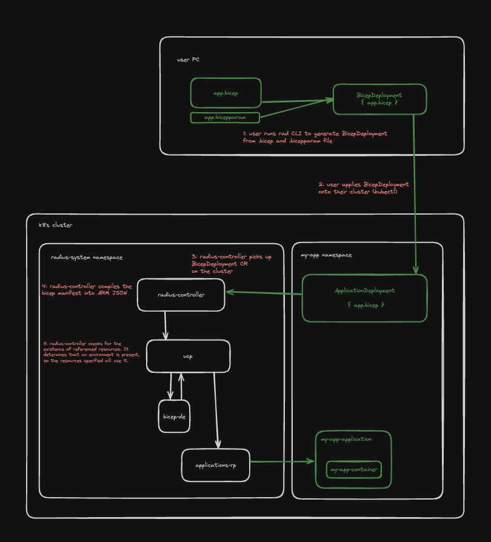

# BicepDeployment Controller

* **Author**: Will Smith (@willdavsmith)

## Overview

<!--
Provide a succinct high-level description of the component or feature and 
where/how it fits in the big picture. The overview should be one to three 
paragraphs long and should be understandable by someone outside the Radius
team. Do not provide the design details in this, section - there is a
dedicated section for that later in the document.
-->

Today, users of Radius and future adopters of Radius use many Kubernetes-specific tools in their production workflows. Most of these tools operate on Kubernetes resources exclusively - which presents a problem when trying to deploy resources defined in Bicep manifests. This design proposes the creation of a new Kubernetes controller (BicepDeployment controller) in Radius that will allow users to deploy resources defined in Bicep manifests using Kubernetes tooling.

## Terms and definitions

<!--
Include any terms, definitions, or acronyms that are used in
this design document to assist the reader. They may or may not
be part of the user-facing experience once implemented, and can
be specific to this design context.
-->

**CRD (Custom Resource Definition)**: A definition for a Kubernetes resource that allows users to define their own resource types.

**CR (Custom Resource)**: An instance of a CRD that represents a custom resource in Kubernetes.

**Bicep**: A Domain Specific Language (DSL) for defining Azure resources, or when used with Radius, Azure resources, AWS resources, and Radius resources.

## Objectives

<!--
Describe goals/non-goals and user-scenario of this feature to understand
the end-user goals.
* If the feature shares the same objectives of the existing design, link
  to the existing doc and section rather than repeat the same context.
* If the feature has a scenario, UX, or other product feature design doc,
  link it here and summarize the important parts.
-->

### Goals

<!--
Describe goals to define why we are doing this work, how we will make
priority decisions, and how we will determine success.
-->

**Goal: Users can use Kubernetes tooling to deploy and manage resources defined in Bicep manifests**
- With this work, users will be able to deploy resources defined in Bicep using only Kubernetes. We will essentially be providing a "translation layer" between Kubernetes resources (that Kubernetes tools can understand) and Radius resources (that Radius can understand).

**Goal: Users can quickly generate a Kubernetes CR from Bicep using the Radius CLI**
- We will provide a CLI command that generates the BicepDeployment resource from a Bicep manifest to make this feature easy to adopt.

**Goal: The behavior of BicepDeployment is consistent with user expectations for a Kubernetes-enabled tool**
- We will follow user expectations for Kubernetes controllers and resources when designing the BicepDeployment controller and resource. This includes building in support for retries, status updates, and error handling.

### Non-goals

<!--
Describe non-goals to identify something that we won’t be focusing on 
immediately. We won’t be expending any effort on these matters. If there
will be follow-ups after this work, list them here. If there are things
we plan to do in the future, but are out of scope of this design, list
them here. Provide a brief explanation on why this is a non-goal.
-->

**Non-goal: Full support for GitOps**
- We will not yet be implementing automatic generation of BicepDeployment resources from Bicep manifests or querying Git repositories. This design will enable this work, and it will be covered in a future design document.

### User scenarios

<!--
Describe the user scenarios for this design. Ensure that you define the
roles and personas in these user scenarios when it requires API design.
If you have an existing issue that describes the user scenarios, please
link to that issue instead.
-->

#### Jon can deploy cloud (Azure or AWS) resources defined in Bicep manifests using Kubernetes tools

Jon is an infrastructure operator for an enterprise company. His team manages a production application that is deployed on Kubernetes and uses cloud resources. Jon wants to declare all dependencies for his application in Kubernetes manifests, including cloud resources. He installs Radius on his cluster and uses the rad CLI to generate a custom resource from his Bicep manifest. Jon applies the custom resource to his cluster, and Radius deploys the cloud resources defined in the Bicep manifest. If he wants to update or delete the cloud resources, he can do so by re-applying the updated custom resource or deleting the custom resource.

#### Jon can deploy Radius resources defined in Bicep manifests using Kubernetes tools

Now that he can see that Radius can deploy cloud resources defined in Bicep manifests, Jon wants to take advantage of Radius tooling, such as the App Graph, and fully "Rad-ify" his application. He writes a Bicep manifest that defines a Radius container that connects to the cloud resources, and uses the rad CLI to generate a custom resource from the Bicep manifest. Jon applies the custom resource to his cluster, and Radius deploys the Radius resources defined in the Bicep manifest. Now, Jon can take advantage of Radius tooling, such as the Radius Dashboard and App Graph, to manage his application.

#### Bran 

## User Experience
<!--
If the change impacts the user experience, provide expected interaction 
flow we aim to achieve through this proposal.

When users interact with Radius through the CLI, include sample 
input commands and their corresponding output. Include a bicep/helm code 
sample, if this proposal involves updates to that experience.
-->

### Radius Container

**Sample Input:**
<!--
Provide a sample CLI command input and/or bicep/helm code.
-->

#### `app.bicep`
```bicep
extension radius

param application string
param tag string
param port int

resource container 'Applications.Core/containers@2023-10-01-preview' = {
  name: 'container'
  properties: {
    application: application
    container: {
      image: 'ghcr.io/radius-project/samples/demo:${tag}'
      ports: {
        web: {
          containerPort: port
        }
      }
    }
  }
}
```

#### `app.bicepparam`
```bicep
using 'app.bicep'

param application = ''
param tag = ''
```

#### `appnetworking.bicepparam
```bicep
using 'app.bicep'

param port = 3000
```

**Sample Output:**
<!--
Provide a sample output for the inputs provided above.
-->
```
> rad bicep generate-kubernetes app.bicep --parameters @app.bicepparam --parameters tag=latest --parameters appnetworking.bicepparam --outfile env.yaml

Generating BicepDeployment resource...
BicepDeployment resource generated at env.yaml

To apply the BicepDeployment resource onto your cluster, run:
kubectl apply -f app.yaml
```

#### `app.yaml`
```yaml
kind: BicepDeployment
apiVersion: radapp.io/v1alpha3
metadata:
  name: env
  namespace: radius-system
spec:
  template: |
    extension radius

    param application string
    param tag string
    param port int

    resource container 'Applications.Core/containers@2023-10-01-preview' = {
      name: 'container'
      properties: {
        application: application
        container: {
          image: 'ghcr.io/radius-project/samples/demo:${tag}'
          ports: {
            web: {
              containerPort: port
            }
          }
        }
      }
    }
  parameters: |
    application=''
    tag='latest'
    port=3000
```

### Bicep Module

#### `main.bicep`
```bicep
param location string = resourceGroup().location
param storageAccountName string

// Import the storage module
module storageModule 'storage.bicep' = {
  name: 'storageModule'
  params: {
    location: location
    storageAccountName: storageAccountName
  }
}

// Output the storage account ID
output storageAccountId string = storageModule.outputs.storageAccountId
```

#### `storage.bicep`
```bicep
// Define parameters
param location string
param storageAccountName string

// Create a storage account
resource storageAccount 'Microsoft.Storage/storageAccounts@2021-04-01' = {
  name: storageAccountName
  location: location
  sku: {
    name: 'Standard_LRS'
  }
  kind: 'StorageV2'
  properties: {}
}

// Output the storage account ID
output storageAccountId string = storageAccount.id
```

**Sample Output:**
<!--
Provide a sample output for the inputs provided above.
-->
```
> rad bicep generate-kubernetes main.bicep --parameters storageAccountName=myaccount --outfile main.yaml

Generating BicepDeployment resource...
BicepDeployment resource generated at main.yaml

To apply the BicepDeployment resource onto your cluster, run:
kubectl apply -f main.yaml
```

#### `main.yaml`
```yaml
kind: BicepDeployment
apiVersion: radapp.io/v1alpha3
metadata:
  name: env
  namespace: radius-system
spec:
  template: |
    param location string = resourceGroup().location
    param storageAccountName string

    // Import the storage module
    module storageModule 'storage.bicep' = {
      name: 'storageModule'
      params: {
        location: location
        storageAccountName: storageAccountName
      }
    }

    // Output the storage account ID
    output storageAccountId string = storageModule.outputs.storageAccountId
  modules:
    - name: storageModule
      template: |
        param location string
        param storageAccountName string

        // Create a storage account
        resource storageAccount 'Microsoft.Storage/storageAccounts@2021-04-01' = {
          name: storageAccountName
          location: location
          sku: {
            name: 'Standard_LRS'
          }
          kind: 'StorageV2'
          properties: {}
        }

        // Output the storage account ID
        output storageAccountId string = storageAccount.id
  parameters: |
    storageAccountName=myaccount
```

## Design

### High Level Design
<!--
High level overview of the data flow and key components.

Provide a high-level description, using diagrams as appropriate, and top-level
explanations to convey the architectural/design overview. Don’t go into a lot
of details yet but provide enough information about the relationship between
these components and other components. Call out or highlight new components
that are not part of this feature (dependencies). This diagram generally
treats the components as black boxes. Provide a pointer to a more detailed
design document, if one exists. 
-->

This design proposes the creation of a new Kubernetes controller (BicepDeployment controller) packaged within the `radius-controller` service.

The BicepDeployment controller will be implemented as a Kubernetes controller that watches and reconciles BicepDeployment resources on the cluster. It will be responsible for compiling Bicep templates and parameters into ARM JSON and deploying the resources defined in the Bicep template to Radius. It will also be responsible for updating and deleting resources defined in the Bicep template.

### Architecture Diagram
<!--
Provide a diagram of the system architecture, illustrating how different
components interact with each other in the context of this proposal.

Include separate high level architecture diagram and component specific diagrams, wherever appropriate.
-->



### Detailed Design

<!--
This section should be detailed and thorough enough that another developer
could implement your design and provide enough detail to get a high confidence
estimate of the cost to implement the feature but isn’t as detailed as the 
code. Be sure to also consider testability in your design.

For each change, give each "change" in the proposal its own section and
describe it in enough detail that someone else could implement it. Cover
ALL of the important decisions like names. Your goal is to get an agreement
to proceed with coding and PRs.

If there are alternatives you are considering please include that in the open
questions section. If the product has a layered architecture, it's good to
align these sections with the product's layers. This will help readers use
their current understanding to understand your ideas.

Discuss the rationale behind architectural choices and alternative options 
considered during the design process.
-->

#### BicepDeployment Custom Resource Definition

The `BicepDeployment` resource will be a new Kubernetes CRD that will be used to contain the Bicep template and parameters for deploying Radius resources. The CRD will have the following fields:

```go
// BicepDeploymentSpec defines the desired state of a BicepDeployment
type BicepDeploymentSpec struct {
  // Template is the Bicep template that defines the resources to deploy.
  Template string `json:"template"`

  // Parameters is the Bicep parameters file that specifies the parameters for the template.
  Parameters string `json:"parameters"`

  // Modules is a list of Bicep modules that are used in the template.
  Modules []BicepDeploymentModule `json:"modules,omitempty"`
}

// Deploy again and check output resources. if they are the same, then we are good to go. if there are resources that are missing, then delete them and update resources 

// BicepDeploymentPhrase is a string representation of the current status of a Bicep Deployment.
type BicepDeploymentPhrase string

const (
	// BicepDeploymentPhraseUpdating indicates that the Bicep Deployment is being updated.
	BicepDeploymentPhraseUpdating BicepDeploymentPhrase = "Updating"

	// BicepDeploymentPhraseReady indicates that the Bicep Deployment is ready.
	BicepDeploymentPhraseReady BicepDeploymentPhrase = "Ready"

	// BicepDeploymentPhraseFailed indicates that the Bicep Deployment has failed.
	BicepDeploymentPhraseFailed BicepDeploymentPhrase = "Failed"

	// BicepDeploymentPhraseDeleting indicates that the Bicep Deployment is being deleted.
	BicepDeploymentPhraseDeleting BicepDeploymentPhrase = "Deleting"

	// BicepDeploymentPhraseDeleted indicates that the Bicep Deployment has been deleted.
	BicepDeploymentPhraseDeleted BicepDeploymentPhrase = "Deleted"
)

// BicepDeploymentStatus defines the observed state of the Bicep Deployment.
type BicepDeploymentStatus struct {
	// ObservedGeneration is the most recent generation observed for this Bicep Deployment. It corresponds to the Deployment's generation, which is updated on mutation by the API Server.
	ObservedGeneration int64 `json:"observedGeneration,omitempty" protobuf:"varint,1,opt,name=observedGeneration"`

	// Scope is the resource ID of the scope.
	Scope string `json:"scope,omitempty"`

	// Resource is the resource ID of the deployment.
	Resource string `json:"resource,omitempty"`

	// Operation tracks the status of an in-progress provisioning operation.
	Operation *ResourceOperation `json:"operation,omitempty"`

	// Phrase indicates the current status of the Bicep Deployment.
	Phrase BicepDeploymentPhrase `json:"phrase,omitempty"`

  // Description is a human-readable description of the status of the Bicep Deployment.
  Description string `json:"description,omitempty"`

  // Resources is a list of resources that are created by the BicepDeployment.
  Resources []BicepDeploymentResource `json:"resources,omitempty"`
}
```

#### `rad bicep generate-kubernetes` Command

The `rad bicep generate-kubernetes` command will be a new command that will generate a Kubernetes custom resource when provided a Bicep template, modules, and parameters The command will take the following arguments:

- `-p, --parameters`: The parameters for the Bicep template. Can be specified in the same way as [`rad deploy` parameters](https://edge.docs.radapp.io/reference/cli/rad_deploy/).
- `-o, --outfile`: The path to the output file where the BicepDeployment resource will be written.

#### BicepDeployment Controller

The `radius-controller` will be updated to include a new controller that reconciles BicepDeployment resources. It will have the following control loop:

 The BicepDeployment controller will adhere to the following control loop for BicepDeployment resources on the cluster:

1. Check if there is an in-progress operation. If so, check its status:
    1. If the operation is still in progress, then queue another reconcile operation and continue processing.
	  2. If the operation completed successfully, then update the `status.phrase` and `status.description` fields as succeeded. Set the contents of the `status.resources` to match the set of deployed resources. This operation is complete, so we can continue processing.
	  3. If the operation failed, then update the `status.phrase` and `status.description` as failed and continue processing.
2. If the BicepDeployment is being deleted, then process deletion:
    1. Queue a DELETE operation for each of the resources in the `status.resources` list.
    2. After all resources are deleted, update the `status.phrase` and `status.description` fields as deleted.
3. If the BicepDeployment is not being deleted then process this as a create or update:
    1. Compile the Bicep template, modules, and parameters into ARM JSON.
    1. The controller will perform some simple lookups to Radius to determine if the provided template can be deployed:
        - Check if the template contains an empty `param environment`. If it does, the controller will query the Radius API to get an environment ID (must have exactly one environment if left unspecified like this) and deploy the template using that environment.
        - Check if the template contains an empty `param application`. If it does, the controller will query the Radius API to get an application ID. If there is exactly one application present, the controller will deploy the template using that application. If there are no applications, then the controller will create one.
    2. Queue a PUT operation against the Radius API to deploy compiled ARM JSON.

The controller will also be shipped with a Bicep binary and a `bicepconfig.json` which will allow it to compile Bicep templates and parameters into ARM JSON. The Bicep binary will be included in the `radius-controller` container image.

### Alternatives Considered

- We could create a separate service for Bicep compilation.

- We could move the compilation of Bicep to the user's CLI (client-side build vs. server-side build).

### API design (if applicable)

<!--
Include if applicable – any design that changes our public REST API, CLI
arguments/commands, or Go APIs for shared components should provide this
section. Write N/A here if not applicable.
- Describe the REST APIs in detail for new resource types or updates to
  existing resource types. E.g. API Path and Sample request and response.
- Describe new commands in the CLI or changes to existing CLI commands.
- Describe the new or modified Go APIs for any shared components.
-->

#### API

There will be no changes to the Radius API.

#### CLI

There will be a new CLI command `rad bicep generate-kubernetes` that will generate a BicepDeployment resource from a Bicep template and parameters file.

### Error Handling
<!--
Describe the error scenarios that may occur and the corresponding recovery/error handling and user experience.
-->

TBW

## Test plan

<!--
Include the test plan to validate the features including the areas that
need functional tests.

Describe any functionality that will create new testing challenges:
- New dependencies
- External assets that tests need to access
- Features that do I/O or change OS state and are thus hard to unit test
-->

TBW

## Security

<!--
Describe any changes to the existing security model of Radius or security 
challenges of the features. For each challenge describe the security threat 
and its mitigation with this design. 

Examples include:
- Authentication 
- Storing secrets and credentials
- Using cryptography

If this feature has no new challenges or changes to the security model
then describe how the feature will use existing security features of Radius.
-->

TBW

## Compatibility

<!--
Describe potential compatibility issues with other components, such as
incompatibility with older CLIs, and include any breaking changes to
behaviors or APIs.
-->

The changes describes are only additive, so there should be no breaking changes or compatibility issues with other components.

## Monitoring and Logging

<!--
Include the list of instrumentation such as metric, log, and trace to 
diagnose this new feature. It also describes how to troubleshoot this feature
with the instrumentation. 
-->

TBW

## Development plan

<!--
Describe how you will deliver your features. This includes aligning work items
to features, scenarios, or requirements, defining what deliverable will be
checked in at each point in the product and estimating the cost of each work
item. Don’t forget to include the Unit Test and functional test in your
estimates.
-->

TBW

## Open Questions

<!--
Describe (Q&A format) the important unknowns or things you're not sure about. 
Use the discussion to answer these with experts after people digest the 
overall design.
-->

- Should we build the Bicep compilation into the controller or the CLI?

## Design Review Notes

<!--
Update this section with the decisions made during the design review meeting. This should be updated before the design is merged.
-->
