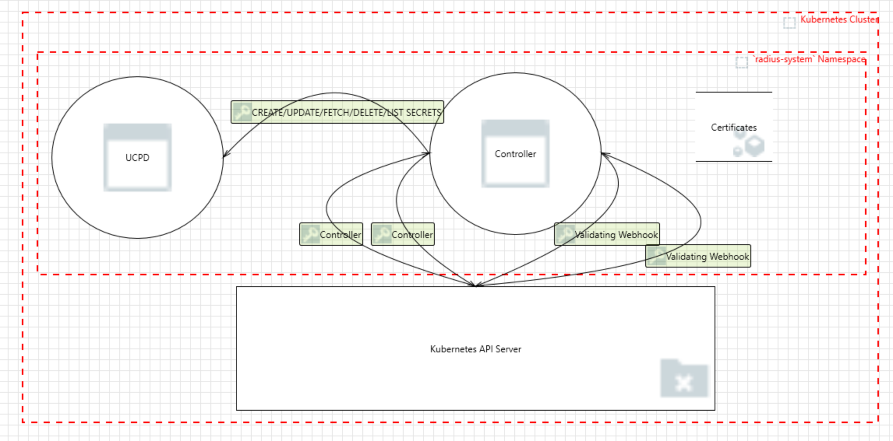

# Title

- **Author**: ytimocin

## Overview

This document aims to provide a threat model for the Radius Controller component. In this threat model, you will find potential security threats to the Controller component, an important part of Radius, and possible mitigations to the risks they pose. The document includes an analysis of the system, its assets, security objectives, identified threats, and recommended security measures to protect the system.

This document will not include designs for the proposed measures to each threat.

## System Description

The Controller component is where we keep our Kubernetes controllers, a validating webhook, and a few other important parts. We will dive into more details on the controller below.

Note: If you would like to learn more about Kubernetes controllers, you can visit [this link](https://kubernetes.io/docs/concepts/architecture/controller/).

### Architecture

The Controller component consists of several key parts:

- **Recipe and Deployment Controllers**: Custom Kubernetes controllers registered with the manager. Each controller is responsible for watching specific Kubernetes resources (Recipe and Radius Deployment) and reconciling their state.
- **Recipe Validating Webhook**: [Used if TLS certificates are provided] This webhook is triggered by the Kubernetes API in case of a change in a Recipe resource. Kubernetes API reaches out to this webhook in case of a creation, an update, or a deletion of a Recipe. Webhook validates the action, if it is a valid action, and responds to the Kubernetes API. For more information about webhooks, refer to the [official documentation](https://kubernetes.io/docs/reference/access-authn-authz/extensible-admission-controllers/).
- **Health Checks**: Health checks are implemented to monitor the status and performance of the controllers. They ensure that the controllers are functioning correctly and can take corrective actions if any issues are detected.

### Clients

In this section we are going to be talking about different clients of the Controller component. Clients are systems that reach out to the Controller component to trigger an action. Here are the clients of the Controller component:

1. **Kubernetes API Server**: The primary client that interacts with the controller. It sends events related to resource changes (e.g., creation, update, or deletion of a Recipe and/or Deployment) to the controller manager. The controller watches for these events and reconciles the state of the resources accordingly.
1. **Validating Webhook Clients**: If webhooks are enabled and registered, clients that interact with the Kubernetes API server (e.g., `kubectl`, other controllers) can trigger webhook calls.
1. **Health Check Probes**: Kubernetes itself can act as a client by performing health and readiness checks on the controller manager.
1. **Metrics Scrapers**: If metrics are enabled, Prometheus or other monitoring tools can scrape metrics from the controller manager.

## Data Flow

### Diagram

1. **Resource Creation/Update/Delete**: When a user creates, updates, or deletes a Recipe or a Radius Deployment resource, the request is sent to the Kubernetes API server.
2. **Webhook Validation/Mutation**: If a custom webhook is configured, the request is intercepted by the webhook for validation. The webhook ensures that the resource complies with the required policies. You can see the details of the Recipe Webhook implementation via [this link](https://github.com/radius-project/radius/blob/main/pkg/controller/reconciler/recipe_webhook.go#L46).
3. **Controller Reconciliation**: When the action (create/update/delete) is validated by the Validating Webhook as discussed in the previous step, Kubernetes API reaches out to the Controller component and triggers the necessary action. Then, the controllers reconcile the resource's state to match the desired configuration.
4. **Communication with UCPD**: Controller also calls UCPD in some cases when doing reconcilations. The communication with UCPD is one-way, meaning that UCPD doesn't make calls to the Controller component, just responds to its requests. Controller reaches out to UCPD to read a resource and/or write to a resource. In some cases, it can request secrets for a given resource.

### Detailed Data Flows

#### Kubernetes API Server - Validating Webhook for the Recipe Resource

- **Assumptions**:
  - TLS Certificates are defined on the startup of Controller component.
- **Flow**:
  1. Kubernetes API Server receives a request to create, update, or delete a Recipe or Radius Deployment resource.
  1. Kubernetes API Server sends the request to the Validating Webhook for validation.
  1. The webhook evaluates the request and responds with an approval or a rejection.
  1. If approved, Kubernetes API Server proceeds with the action.
- **Risks and Mitigations**:
  - **Risk**: Could someone inject dangerous data into the resource object that would also get an approval from the webhook?
    - **Mitigation**: Implement comprehensive validation logic in the webhook to check for malicious data patterns, enforce strict schema validation, and sanitize inputs.
  - **Risk**: What if the webhook server is unavailable or slow to respond?
    - **Mitigation**: Configure timeouts and retries for webhook calls, and implement fallback mechanisms to handle webhook failures gracefully.
    - **References**:
      - <https://kubernetes.io/docs/reference/access-authn-authz/extensible-admission-controllers/#timeouts>
      - <https://kubernetes.io/docs/reference/access-authn-authz/extensible-admission-controllers/#failure-policy>
  - **Risk**: What if the TLS certificates used for securing communication are compromised?
    - **Mitigation**: Implement strong certificate management practices, including regular rotation of certificates, using short-lived certificates, and monitoring for certificate anomalies.
  - **Risk**: Could an insider with access to the webhook server modify its behavior to approve malicious requests?
    - **Mitigation**: Implement strict access controls, audit logs, and monitoring for changes to the webhook server configuration and code.
  - **Risk**: What if the webhook logic contains bugs that lead to incorrect validation decisions?
    - **Mitigation**: Implement thorough testing, including unit tests, integration tests, and fuzz testing, to ensure the correctness of the webhook logic.

#### Kubernetes API Server - Radius Controllers - UCPD

- **Assumptions**:
  - Change to a Recipe or Radius Deployment resource are validated by the Validating Webhook.
- **Flow**:
  1. The Kubernetes API Server communicates with the necessary controller to trigger the reconciler for the affected resource.
  1. The controller calls the function that will perform the reconciliation for the given resource.
  1. Based on the change, the controller can make calls to the UCPD to read details like resource information or secrets for the given resource, or to write the updated resource.
  1. UCPD responds to the request of the controller. The controller continues the process of reconciliation for the resource.
- **Risks and Mitigations**:
  - **Risk**: Inconsistent state due to partial failures during reconciliation.
    - **Mitigation**: Implement idempotent operations in the controller to ensure that repeated executions do not cause inconsistent state, and use transaction mechanisms where applicable.
  - **Risk**: Unavailability of the UCPD.
    - **Mitigation**: Implement high availability and redundancy for the UCPD, and use retry mechanisms with exponential backoff in the controller.
  - **Risk**: Unauthorized access to the Kubernetes API Server.
    - **Mitigation**: Implement strong authentication and authorization mechanisms, such as RBAC (Role-Based Access Control) and network policies to restrict access.
  - **Risk**: Data tampering during communication between the controller and UCPD.
    - **Mitigation**: Use TLS to encrypt communication between the controller and UCPD, and ensure proper certificate management.
  - **Risk**: Controller logic errors leading to incorrect reconciliation.
    - **Mitigation**: Implement thorough testing, including unit tests, integration tests, and end-to-end tests, to ensure the correctness of the controller logic.
  - **Risk**: Performance bottlenecks due to high load on the controller.
    - **Mitigation**: Optimize the controller code for performance, use efficient algorithms, and implement rate limiting to control the number of requests processed at a time.
  - **Risk**: Security vulnerabilities in the controller code.
    - **Mitigation**: Conduct regular security audits and code reviews, and follow secure coding practices to minimize vulnerabilities.

## Trust Boundaries

We have a few different trust boundaries for the Controller component:

- Kubernetes cluster,
- Namespaces within the cluster.

The Controller component lives inside the `radius-system` namespace in the Kubernetes cluster where it is installed. UCPD also lives inside the same namespace.

The Kubernetes API Server, which is the main interactor of the Controller component, runs in the `kube-system` namespace within the cluster.

1. Different namespaces separate and isolate resources and workloads within the Kubernetes cluster.
2. Access controls and other permissions are implemented to manage interactions between namespaces.

## Assets and Security Objectives

### Assets

1. **Kubernetes Resources**

   - **Description**: Custom resources managed by the controllers: Recipes, and Deployments.
   - **Importance**: These resources are critical for the operation of the Kubernetes cluster and the applications running on it. Unauthorized access or modification could lead to service disruptions or security breaches.

1. **TLS Certificates**

   - **Description**: Certificates used for securing communication between the validating webhook and the Kubernetes API server.
   - **Importance**: Ensuring the confidentiality and integrity of communications. Compromised certificates could lead to man-in-the-middle attacks. [Related](https://stackoverflow.com/a/2109786).

1. **Configuration Files**

   - **Description**: Configuration files that define the behavior of the controllers and the webhook. We have a configuration file for the Controller component and certificates for the Validating Webhook.
   - **Importance**: Incorrect or malicious configurations could lead to unintended behavior or security vulnerabilities.

1. **Logs and Monitoring Data**
   - **Description**: Logs and monitoring data generated by the controllers and webhook.
   - **Importance**: Essential for auditing, troubleshooting, and detecting security incidents. Unauthorized access could lead to information disclosure or tampering.

### Security Objectives

1. **Confidentiality**

   - **Objective**: Ensure that sensitive data, such as TLS certificates and configuration files, are accessible only to authorized entities.
   - **Measures**: Implement access controls, encryption, and secure storage mechanisms.

1. **Integrity**

   - **Objective**: Ensure that Kubernetes resources, configuration files, and logs are not tampered with.
   - **Measures**: Implement checksums, digital signatures, and access controls to prevent unauthorized modifications.

1. **Availability**

   - **Objective**: Ensure that the controllers and webhook are available and functioning correctly to maintain the desired state of the Kubernetes resources.
   - **Measures**: Implement health checks, redundancy, and failover mechanisms to ensure high availability.

1. **Authentication and Authorization**

   - **Objective**: Ensure that only authenticated and authorized users and systems can interact with the controllers and webhook.
   - **Measures**: Implement strong authentication mechanisms and fine-grained role-based access control (RBAC).

1. **Auditability**

   - **Objective**: Ensure that all actions performed by the controllers and webhook are logged and can be audited. This will also be good for debugging certain issues we may have in the Controller component.
   - **Measures**: Implement comprehensive logging and monitoring, and ensure that logs are protected from tampering.

1. **Compliance**
   - **Objective**: Ensure that the system complies with relevant security standards and regulations.
   - **Measures**: Regularly review and update security policies and procedures to align with industry standards and regulatory requirements.

## Residual Risks

<!--
Identify any residual risks that remain after mitigations have been applied. Describe the potential impact and likelihood of these risks, and justify why they are considered acceptable.
-->

## Open Questions

<!--
List any unresolved questions or uncertainties about the threat model. Use this section to gather feedback from experts or team members and to track decisions made during the review process.
-->

## Alternatives Considered

<!--
Discuss alternative approaches to the threat model or different mitigation strategies that were considered. Explain why the chosen approach was selected over the alternatives.
-->

## Review Notes

<!--
Update this section with the decisions and feedback from the threat model review meeting. Document any changes made to the model based on the review.
-->
