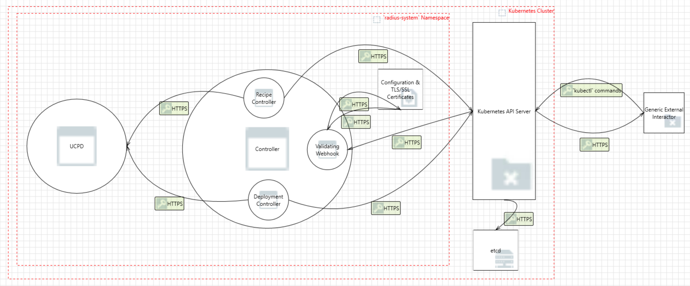

# Radius Controller Component Threat Model

- **Author**: ytimocin

## Overview

This document provides a threat model for the Radius Controller component. It identifies potential security threats to this critical part of Radius and suggests possible mitigations. The document includes an analysis of the system, its assets, identified threats, and recommended security measures to protect the system.

The Radius Controller component monitors changes (create, update, delete) in the definitions of Recipe and Deployment resources. Based on these changes, the appropriate controller takes the necessary actions. Below, you will find detailed information about the key parts of the Radius controllers and the objects they manage.

## Terms and Definitions

| Term                  | Definition                                                                                                                                                                                  |
| --------------------- | ------------------------------------------------------------------------------------------------------------------------------------------------------------------------------------------- |
| Admission Controllers | An admission controller is a piece of code that intercepts requests to the Kubernetes API server prior to persistence of the object, but after the request is authenticated and authorized. |
| mTLS                  | Mutual Transport Layer Security (mTLS) allows two parties to authenticate each other during the initial connection of an SSL/TLS handshake.                                                 |
| UCPD                  | Universal Control Plane Daemon for Radius                                                                                                                                                   |

## System Description

The Controller component enables users to manage Radius resources through the Kubernetes API. Users define their application using existing Kubernetes resource types like `Deployment` and the `Recipe` CRD provided by Radius. The job of the controller is to ensure that the desired state of the system is maintained in both Radius and Kubernetes by continuously monitoring and reconciling resources.

The Controller component consists of two Kubernetes controllers (Recipe and Deployment controllers), a validating webhook for changes in the Recipe object, and several other important parts. We will dive into more details on the controller below.

Note: If you would like to learn more about Kubernetes controllers, you can visit [this link](https://kubernetes.io/docs/concepts/architecture/controller/).

Note: Kubernetes has [admission controllers](https://kubernetes.io/docs/reference/access-authn-authz/admission-controllers/) that intercept requests to the Kubernetes API Server before the persistence of the object. Admission controllers may be **validating**, **mutating**, or both. Here is a simple diagram of the flow from the command entered by the user to the persistence of the object to etcd.

### Architecture

The Controller component consists of several key parts:

- **Recipe and Deployment Controllers**: These are reconciliation loops that watch for changes in Recipe and Deployment resources. These changes can include the addition, update, or deletion of these resources. Whenever one of the reconciliation loops detects a change, it attempts to move the state of the cluster to the desired state.
  - **Recipe Controller**: This reconciliation loop specifically watches for changes in the Recipe resources. After detecting a change, it determines the type of change (addition, update, or deletion) and calls the UCPD to perform the necessary actions.
    - If the change is a create or an update, the Controller calls UCPD to create or update the necessary resources (including secrets).
    - If the change is a delete of a Recipe resource, the Controller calls UCPD to delete the resource and all related resources.
  - **Deployment Controller**: This reconciliation loop specifically watches for changes in the Deployment resources. After detecting a change, it determines the type of change (addition, update, or deletion) and calls the UCPD to perform the necessary actions.
    - If the change is a create or an update, the Controller calls UCPD to create or update the necessary resources (including secrets).
    - If the change is a delete of a Deployment resource, the Controller calls UCPD to delete the resource and all related resources.
- **Recipe Validating Webhook**: This webhook is triggered by the Kubernetes API Server when there is a change (create, update, or delete) in a Recipe resource. The webhook validates the action and responds to the Kubernetes API Server with an approval or a rejection. In our case, the validating webhook only checks if the recipe is one of the Radius portable resources in create or update cases. For more information about webhooks, refer to the [official documentation](https://kubernetes.io/docs/reference/access-authn-authz/extensible-admission-controllers/).
- **Health Checks**: Health checks are implemented to monitor the status and performance of the Controller component as a whole, which includes both controllers and the validating webhook. They ensure that the controllers and the webhook are functioning correctly and can trigger corrective actions if any issues are detected.

### Implementation Details

#### Use of Cryptography

1. **Computing the Hash of the Deployment Configuration**: [Link to code](https://github.com/radius-project/radius/blob/8151a96665b7f5bcd6474f5e33aff35d01adfa5a/pkg/controller/reconciler/annotations.go#L78).

   1. **Purpose**: The purpose of computing the hash of the deployment configuration resource is to determine if the deployment is up-to-date or needs an update.
   2. **Library**: The library used to calculate the hash of the deployment configuration is the crypto library, which is one of the standard libraries of Go: [Link to library](https://pkg.go.dev/crypto@go1.23.1).
   3. **Type**: [SHA1](https://www.rfc-editor.org/rfc/rfc3174.html). Note: "SHA-1 is cryptographically broken and should not be used for secure applications." [Link to warning](https://pkg.go.dev/crypto/sha1@go1.23.1).

2. **Hashing the Secret Data**: [Link to code](https://github.com/radius-project/radius/blob/8151a96665b7f5bcd6474f5e33aff35d01adfa5a/pkg/controller/reconciler/deployment_reconciler.go#L580).

   1. **Purpose**: We hash the secret data and add it to the Pod definition to determine if the secret has changed in an update.
   2. **Library**: The library used to calculate the hash of the secret is the crypto library, which is one of the standard libraries of Go: [Link to library](https://pkg.go.dev/crypto@go1.23.1).
   3. **Type**: [SHA1](https://www.rfc-editor.org/rfc/rfc3174.html). Note: "SHA-1 is cryptographically broken and should not be used for secure applications." [Link to warning](https://pkg.go.dev/crypto/sha1@go1.23.1).

#### Storage of secrets

Below you will find where and how Radius stores secrets. We create Kubernetes Secret objects and rely on Kubernetes security measures to protect these secrets.

1. **Deployment Reconciler**: Creates or updates a Kubernetes Secret for the connection values in a Deployment object. This Kubernetes Secret is deleted when the Deployment is deleted.
2. **Recipe Reconciler**: Creates a Kubernetes Secret for the Recipe object if it is defined in its spec. If there is an update to the secret object, the old one is deleted and the new one is added. When the Recipe is deleted, the Secret is also deleted.

#### Data Serialization / Formats

We do not use custom parsers and instead rely on Kubernetes built-in parsers. Therefore, we trust Kubernetes security measures to handle data serialization and formats securely.

### Clients

In this section, we will discuss the different clients of the Controller component. Clients are systems that interact with the Controller component to trigger actions. Here are the clients of the Controller component:

1. **Kubernetes API Server**: The primary client that interacts with the controller. It communicates with the validating webhook and the controllers in case of resource changes (e.g., creation, update, or deletion of a Recipe or Deployment) requested by another interactor (for example; a human running `kubectl` commands). The controllers watch for these calls and reconcile the state of the resources accordingly.
1. **Health Check Probes**: Kubernetes itself can act as a client by performing health and readiness checks on the controller manager.
1. **Metrics Scrapers**: If metrics are enabled, Prometheus or other monitoring tools can scrape metrics from the controller manager.

## Trust Boundaries

We have a few different trust boundaries for the Controller component:

- **Kubernetes Cluster**: The overall environment where the Controller component operates and receives requests from the clients.
- **Namespaces within the Cluster**: Logical partitions within the cluster to separate and isolate resources and workloads.

The Controller component lives inside the `radius-system` namespace in the Kubernetes cluster where it is installed. UCPD also resides within the same namespace.

The Kubernetes API Server, which is the main interactor of the Controller component, runs in the `kube-system` namespace within the cluster.

### Key Points of Namespaces

1. **Isolation of Resources and Workloads**: Different namespaces separate and isolate resources and workloads within the Kubernetes cluster.
2. **Access Controls and Permissions**: Access controls and other permissions are implemented to manage interactions between namespaces.
3. **Separation of Concerns**: Namespaces support the separation of concerns by allowing different teams or applications to manage their resources independently, reducing the risk of configuration errors and unauthorized changes.

## Assumptions

This threat model assumes that:

1. The Radius installation is not tampered with.
2. The Kubernetes cluster that Radius is installed on is not compromised.
3. It is the responsibility of the Kubernetes cluster to authenticate users. Administrators and users with sufficient privileges can perform their required tasks. Radius cannot prevent actions taken by an administrator.

## Data Flow

### Diagram

1. **User creates/updates/deletes a Recipe or a Deployment resource**: When a user requests to create, update, or delete a Recipe or a Deployment resource, the request is handled by the Kubernetes API Server. One way, and probably the most common way, a user can do this request is by running a **kubectl** command. Kubernetes takes care of the authentication and the authorization of the user and its request(s) so we (Radius) don't need to worry about anything here.

2. **Validating Webhook**: The only type of admission controller we have in Radius is the validating webhook for the Recipe resource. The validating webhook ensures that the Recipe object to be created or updated is one of the Radius portable resources. Whenever Kubernetes API Server receives a request to create or update a Recipe object, it communicates the proposed changes with the validating webhook. If the validating webhook validates the changes, then it is persisted to the **etcd** by the Kubernetes API Server.

3. **Recipe and Deployment Reconcilers**: When there is a request to create, update, or delete a Recipe or a Deployment resource, after being validated if the resource is a Recipe resource, the next step is the reconcilation of the resource by the appropriate reconciler. In the Controller component, there are two reconcilers: Recipe and Deployment. These reconcilers are loops that watch the changes in the Recipe and Deployment resources. Whenever there is a change, the reconcilers take the necessary actions to move the actual state to the desired state. These necessary actions include communication with the UCPD to create, update, and/or delete necessary resources.

   1. Communication:
      1. Controller and UCPD:
         1. Poll long-running operations (create, update, or delete) for a Recipe or a Deployment resource.
         2. Create a Radius Resource Group if needed.
         3. Create a Radius Application if needed.
         4. Get a Radius resource like the Environment that is associated with the resource.
         5. Create/Update/Delete a Recipe or a Deployment resource.
         6. Create/Update/Delete a Secret for a Recipe or a Deployment resource.
      2. Controller and the Kubernetes API Server:
         1. Fetch a Recipe or a Deployment object.
         2. Send events related to the operations running.
         3. Update a Recipe or a Deployment object.
         4. Create/Update/Delete a Secret associated with a Recipe or a Deployment object.
         5. List Deployments by filtering them by a specific Recipe object.

### Threats

#### Threat: Users with access to the webhook server modifying the behavior of the webhook server

A user with access to the webhook server can modify its behavior to approve malicious requests, which can be reconciled in the next step of the data flow. Reconciliation loops can also trigger resource updates or even deletions by calling UCPD with the malicious requests.

**Impact**:

1. **Unauthorized Operations**: With the approval of malicious requests, unauthorized operations could be performed on user resources, including the creation, update, or deletion of resources.
2. **Resource Deletion**: Malicious modifications could lead to the deletion of existing resources, causing potential data loss and service disruption.

**Mitigation**:

1. **Audit Logs**:

   - **Description**: Implement detailed audit logging to track which user performs which operation on the webhook server. Regularly review these logs to detect any unauthorized or suspicious activities.
   - **Status**:

2. **RBAC (Role-Based Access Control)**:

   - **Description**: Implement strict RBAC policies to ensure that only authorized users have the necessary permissions to access and modify the webhook server. This minimizes the risk of unauthorized access and modifications.
   - **Status**:

#### Threat: Webhook server being unavailable or slow to respond

If the webhook server becomes unavailable or slow to respond, it can lead to delays or failures in processing requests. This may not be a direct security issue but it can affect the overall reliability of the system.

**Impact**:

**Mitigation**:

## Open Questions

## Action Items

1. Use a hashing algorithm other than SHA-1 while computing the hash of the configuration of a Deployment object. This is a breaking change because deployments that are already hashed with SHA1 should be redeployed so that reconciler can work as expected.
2. Check if TLS is enabled for every component to ensure secure communication. Make changes to the necessary components if required.
3. Ensure that all communication uses mTLS (Mutual TLS) to authenticate both the client and server, providing an additional layer of security. Verify that mTLS is correctly configured for all components and endpoints. Make changes to the necessary components if required.
4. Check if RBAC with Least Privilege is configured for every component to ensure that each component has only the permissions it needs to function. Make changes to the necessary components if required.
5. Define and implement necessary Network Policies to ensure that communication is accepted only from expected and authorized components. Regularly review and update these policies to maintain security.
6. Separate and firewall the etcd cluster to ensure the safety of the datastore. Implement network segmentation to isolate the etcd cluster from other components. Configure firewall rules to restrict access to the etcd cluster, allowing only authorized components and administrators to communicate with it. Regularly review and update firewall rules and network policies to maintain security.
7. Containers should run as a non-root user wherever possible to minimize the risks. Check if we can run any of the Radius containers as non-root. Do the necessary updates.

## Review Notes

<!--
Update this section with the decisions and feedback from the threat model review meeting. Document any changes made to the model based on the review.
-->

## References

1. <https://kubernetes.io/blog/2018/07/18/11-ways-not-to-get-hacked>
2. <https://www.rfc-editor.org/rfc/rfc3174.html>
3. <https://pkg.go.dev/crypto/sha1@go1.23.1>
