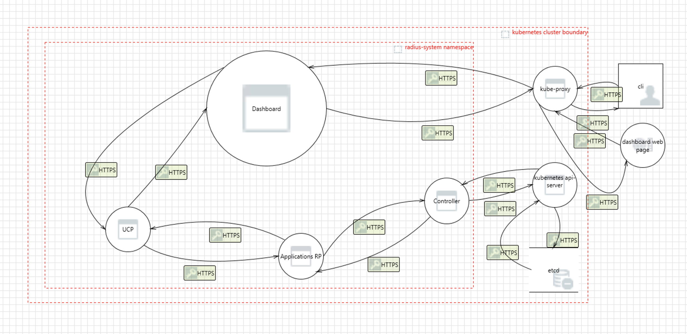

# Radius Dashboard Component Threat Model

- **Author**: nithyasu

## Overview

This document provides a threat model for the Radius Dashboard component. It identifies potential security threats to this part of Radius and suggests possible mitigations. The document includes an analysis of the system, its assets, identified threats, and recommended security measures to protect the system.

The Radius Dashboard component provides the frontend experience for Radius. 
It provides visual and textual representation of user's applications, environments and recipes.

## Terms and Definitions

| Term                  | Definition      |
| --------------------- | ----------------------------- |
| mTLS | Mutual Transport Layer Security (mTLS) allows two parties to authenticate each other during the initial connection of an SSL/TLS handshake. |
| UCPD | Universal Control Plane Daemon for Radius |
| DDoS | Distributed Denial of Service |

## System Description

The Dashboard component is an SPA built as [Backstage](https://backstage.io/) plugin. It is a client of Radius API. It queries the graph of an application or a list of environment and constructs a visual representation of the response. 

### Architecture

The Dashboard component consists of mainly two parts:

- **radius plugin for Backstage** is hosted on Backstage, allowing Radius to be integrated with a variety of other Backstage plugins. This helps enhance the abilities of Radius. For example, the appgraph component in plugin can be integrated with an Observability plugin on backstage, to visualize the health of parts of application and their impact on overall application health. 
  
- **rad-components** This package provides React components that are useful for visualizing concepts in Radius. Currently, it includes an app-graph component and a node component. `rad-components` are designed to be used both by the Backstage Radius plugin and natively within the Radius dashboard experience (To be built).
  
Both the plugin and rad-components are rendered as React Single Page Applications (SPAs). This web application is not intended to be public-facing; it is available on the intranet for use by both development and operations personnel working on a radified application.

The data for rendering plugin is obtained by calling different Radius APIs.
At present, Dashboard can only present the Radius application metadata visually. It has no capability to Create, Modify, Update or Delete any of the Radius application resources. 

### Implementation Details

The Radius Dashboard is developed as a Backstage Plugin, making it dependent on the Backstage framework for both display and backend functionality. For detailed information on Backstage's threat model, refer to the [Backstage Threat Model](https://backstage.io/docs/overview/threat-model/).

Additionally, we introduced `rad-components` public package to provide graph and node components, which are implemented using React Flow.

It is crucial to be aware of potential vulnerabilities in the node packages used by the application. To mitigate these risks, we should keep packages up to date using tools like Dependabot and Snyk.

#### Storage of secrets

We do not store any secrets for Dashboard. 

#### Data Serialization / Formats

NA

### Clients

The primary user of Dashboard is a Dev/Ops persona. At present, we dont have any other Backstage plugin that cloud be a Radius Dashboard client but that could change in future. 

## Trust Boundaries

We have a few different trust boundaries for the Controller component:

- **Kubernetes Cluster**: The overall environment where the Dashboard pod is located, serving requests from client browser. 
- **Namespaces within the Cluster**: The Dashboard component lives inside the `radius-system` namespace in the Kubernetes cluster where it is installed. 

## Assumptions

This threat model assumes that:

1. The Radius installation is not tampered with.
2. The Kubernetes cluster that Radius is installed on is not compromised.
3. It is the responsibility of the Kubernetes cluster to authenticate users. Administrators and users with sufficient privileges can perform their required tasks. Radius cannot prevent actions taken by an administrator.

## Data Flow

### Diagram

1. User types the backstage url and accesses Radius plugin
2. Request reaches the dashboard pod in `radius-system` namespace in kubernetes cluster.
3. The dashboard service sends a Radius API request to UCP.
4. UCP workings with ApplicationCore-RP and sends response back to Dashboard SPA.
5. Dashboard SPA contructs the visuals using backstage, rad-component components and data in API response and responds with appropriate page to the user. 

### Threats

#### Threat: DoS

A user can access Dashboard repeatedly or write a script to fetch the page in a loop.

**Impact**:

1. **DoS**: Due to the volume of requests Dashboard as well as the UCP, AppCore-RP components involved could run out of resource to serve a legitimate request.
   
**Mitigation**:

1. **Audit Logs**:

   - **Description**: Explore audit logging capabilities of BAckstage to track which user performs which operation on the server. Regularly review these logs to detect any unauthorized or suspicious activities.
   - **Status**:

2. **User Logins**:

   - **Description**: Utilize Backstage Login to provide credentials to authorized users only. 

#### Threat: Access to app graph can provide information on dependency.

**Impact**:

A malicious user can utilize the graph of application to stage effective attack by targeting a component that has most dependency.

**Mitigation**:

1. **Audit Logs**:

   - **Description**: Explore audit logging capabilities of BAckstage to track which user performs which operation on the server. Regularly review these logs to detect any unauthorized or suspicious activities.
   - **Status**:

2. **User Logins**:

   - **Description**: Utilize Backstage Login to provide credentials to authorized users only. 

#### Threat: third party packages used could have vulnerabilities

Since we use many node packages, we would update these time to time with automated scripts like Dependabot to make sure we are not using packages with vulnerabilities.

**Impact**:

**Mitigation**:

#### SPAs are suseptable to CSRF (Cross Site Request Forgery) and XSS (Cross Site Scripting)

## Open Questions

## Action Items

## Review Notes

<!--
Update this section with the decisions and feedback from the threat model review meeting. Document any changes made to the model based on the review.
-->

## References

https://backstage.io/docs/overview/threat-model/