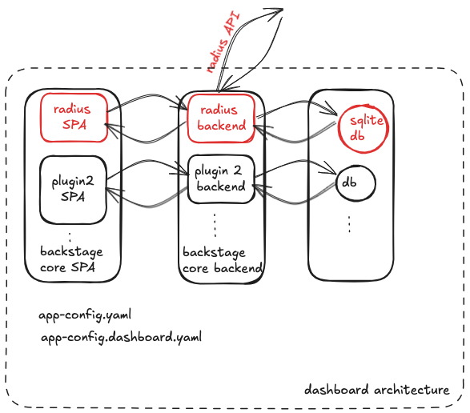

# Radius Dashboard Component Threat Model

- **Author**: @nithyatsu

## Overview

This document provides a threat model for the Radius Dashboard component. It identifies potential security threats to this part of Radius and suggests possible mitigations. The document includes an analysis of the system, its assets, identified threats, and recommended security measures to protect the system.

The Radius Dashboard component provides the frontend experience for Radius. 
It provides visual and textual representation of user's applications, environments and recipes.

## Terms and Definitions

| Term                  | Definition      |
| --------------------- | ----------------------------- |
| mTLS | Mutual Transport Layer Security (mTLS) allows two parties to authenticate each other during the initial connection of an SSL/TLS handshake. |
| UCPD | Universal Control Plane Daemon for Radius |
| DoS | Denial of Service |

## System Description

The Dashboard component is an SPA built as [Backstage](https://backstage.io/) plugin. It is a client of Radius API. It queries the graph of an application or a list of environment and constructs a visual representation of the response. 

### Architecture



Given that the Radius Dashboard is developed as a Backstage plugin, it is essential to first examine the Backstage architecture. Backstage provides a core Backstage SPA, core Backstage backend and the ability to configure a desired database. The core functionality can be enhanced using plugins. In order to deploy Radius dashboard as a backstage plugin, we have a Radius SPA plugin that binds with core Backstage SPA, a Radius backend plugin that binds with core Backstage backend. Since we do not need a database, we configured Radius Dashboard App to use a lightweight sqlite db.

This application is run as dashboard pod in radius-system namespace along with other Radius pods. 

### Implementation Details

The Radius Dashboard is developed as a Backstage Plugin, making it dependent on the Backstage framework for both display and backend functionality. For detailed information on Backstage's threat model, refer to the [Backstage Threat Model](https://backstage.io/docs/overview/threat-model/).

The application uses three config files: app-config.yaml, app-config.local.yaml,
app-config.dashboard.yaml. 

app-config.local.yaml has settings for dev environment and merges and overlays the configs in app-config.yaml. 
app-config.dashboard.yaml has settings for dashboard installation as part of Radius installation.  

We have used these files to configure our application to
1.  use sqlite DB. This is light weight, stored on disk, not accessible and contains no useful information.
  
```
app-config.yaml :

backend:
  database:
    client: better-sqlite3
    connection: ':memory:'
```

2. be allowed to communicate using Radius API. The data for rendering Radius visuals is obtained by calling different Radius APIs. 

```
app-config.local.yaml:
backend:
  # Allow the backend to make requests to the local Kubernetes cluster.
  reading:
    allow:
      - host: localhost:8001
      - host: 127.0.0.1:8001
```
```
app-config.dashboard.yaml

kubernetes:
  serviceLocatorMethod:
    type: singleTenant
  # Use the local proxy on localhost:8001 to talk to the local Kubernetes cluster.
  clusterLocatorMethods:
    - type: config
      clusters:
        - name: self
          # The URL to the in-cluster Kubernetes API server.
          # Backstage docs state it should be ignored when in-cluster, but it appears to be used.
          url: https://kubernetes.default.svc.cluster.local
```

3. not expose backend directly.

```
app-config.yaml

backend:
  # Note that the baseUrl should be the URL that the browser and other clients
  # should use when communicating with the backend, i.e. it needs to be
  # reachable not just from within the backend host, but from all of your
  # callers. When its value is "http://localhost:7007", it's strictly private
  # and can't be reached by others.
  baseUrl: http://localhost:7007
  # The listener can also be expressed as a single <host>:<port> string. In this case we bind to
  # all interfaces, the most permissive setting. The right value depends on your specific deployment.
  listen: ':7007'
```

At present, Dashboard can only present the Radius application metadata visually. It has no ability to Create, Modify, Update or Delete any of the Radius application resources. This eliminates the scope of threats that require "write" action.

#### Storage of secrets

None

#### Data Serialization / Formats

None

### Cryptography 

None

### Clients

The primary user of Dashboard is browser. At present, we dont have any other Backstage plugin that cloud be a Radius Dashboard client but that could change in future. 

## Trust Boundaries

We have a few different trust boundaries for the Dashboard component:

- **Kubernetes Cluster**: The overall environment where the Dashboard component operates and serves clients.
- **Namespaces within the Cluster**: Logical partitions within the cluster to separate and isolate resources and workloads.

#### Key Points of Namespaces

1. **Isolation of Resources and Workloads**: Different namespaces separate and isolate resources and workloads within the Kubernetes cluster.
2. **Access Controls and Permissions**: Access controls and other permissions are implemented to manage interactions between namespaces.
3. **Separation of Concerns**: Namespaces support the separation of concerns by allowing different teams or applications to manage their resources independently, reducing the risk of configuration errors and unauthorized changes.

The Dashboard component lives inside the `radius-system` namespace in the Kubernetes cluster where it is installed. UCPD also resides within the same namespace.

The webapp is accessible to various configured users. Quoting from Backstage threat model, these users could belong to one of these trust levels:

**An internal user** is an authenticated user that generally belongs to the organization of a particular Backstage deployment. These users are trusted to the extent that they are not expected to compromise the availability of Backstage, but they are not trusted to not compromise data confidentiality or integrity.

**An operator**:** is a user responsible for configuring and maintaining an instance of Backstage. Operators are fully trusted, since they operate the system and database and therefore have root access to the host system. Additional measures can be taken by adopters of Backstage in order to restrict or observe the access of this group, but that falls outside of the current scope of Backstage.

**A builder** is an internal or external code contributor and end up having a similar level of access as operators. When installing Backstage plugins you should vet them just like any other package from an external source. While it’s possible to limit the impact of for example a supply chain attack by splitting the deployment into separate services with different plugins, the Backstage project itself does not aim to prevent these kinds of attacks or in any other way sandbox or limit the access of plugins.

**An external user** is a user that does not belong to the other two groups, for example a malicious actor outside of the organization. The security model of Backstage currently assumes that this group does not have any direct access to Backstage, and it is the responsibility of each adopter of Backstage to make sure this is the case.

Users that are signed-in in to Backstage generally have full access to all information and actions. If more fine-grained control is required, the permissions system should be enabled and configured to restrict access as necessary.

This web application is not intended to be public-facing; it is available on the intranet for use by both development and operations personnel working on a radified application. Decisions to make Dashboard public-facing should be the user's conscious choice. 


## Assumptions

This threat model assumes that:

1. The Radius installation is not tampered with.
2. The Kubernetes cluster that Radius is installed on is not compromised.
3. It is the responsibility of the Kubernetes cluster to authenticate users. Administrators and users with sufficient privileges can perform their required tasks. Radius cannot prevent actions taken by an administrator.
4. Dashboard users have been configured to have right level of access by following [Backstage Threat Model](https://backstage.io/docs/overview/threat-model/). These users are trusted to the extent that they are not expected to compromise the availability of Backstage, but they are not trusted to not compromise data confidentiality or integrity.
5. Dashboard is not public facing.
6. Access to Dashboard is using HTTPS.
7. Authentication mechanism provided by Backstage is robust.

## Data Flow

### Diagram


1. User types the backstage url and accesses Radius plugin
2. Request reaches the dashboard pod in `radius-system` namespace in kubernetes cluster.
3. The dashboard service sends a Radius API request to UCP.
4. UCP works with ApplicationCore-RP and sends response back to Dashboard SPA.
5. Dashboard SPA contructs the visuals using backstage, rad-component components and data in API response and responds with appropriate page to the user. 

### Threats
 
#### Threat 1: DoS

**Description**

A client can access Dashboard repeatedly or fetch the page in a loop.

**Impact**

Due to the volume of requests Dashboard as well as the UCP, AppCore-RP components involved in serving the request could run out of resource to serve a legitimate request.
   
**Mitigation**:

1. Access to Dashboard should be provided to trusted users.  The [Backstage  permissions system](https://backstage.io/docs/permissions/overview) should be enabled and configured to restrict access as necessary.
   
**Status**:

Active. Operators are expected to configure the system and limit access to Dashboard portal. 

2. Audit logs should be enabled to monitor and report on suspicious user activity. 

**Status**

[In Progress](https://github.com/backstage/backstage/issues/23950)

#### Threat 2: Information Disclosure by unauthorized access to application information

**Description**

Access to app graph can provide information on dependency.

**Impact**:

A malicious user can utilize the app graph to stage effective attack by targeting a component that has most dependency.

**Mitigation**:

1. Access to Dashboard should be provided to trusted users. While we dont expose any secrets in db, users should still enable authentocation and secure access to data based on roles.
   
**Status**:

Active. Operators are expected to configure the [Backstage  permissions system](https://backstage.io/docs/permissions/overview) to restrict access as necessary. 

2. Audit logs should be enabled to monitor and report on suspicious user activity. 

**Status**

[In Progress](https://github.com/backstage/backstage/issues/23950)

#### Threat 3: Misuse of information

## Open Questions

## Action Items

1. Dashboard should be accessed only on HTTPS. Currently, we can access the application on http. 
2. Enable authentication on Dashboard. This could be tied to RBaC support on Radius, since we might want the same users to be allowed dashboard logins by default with permissions configured using Backstage permission system.

## Review Notes

<!--
Update this section with the decisions and feedback from the threat model review meeting. Document any changes made to the model based on the review.
-->

## References

https://backstage.io/docs/overview/threat-model/
https://backstage.io/docs/permissions/overview
