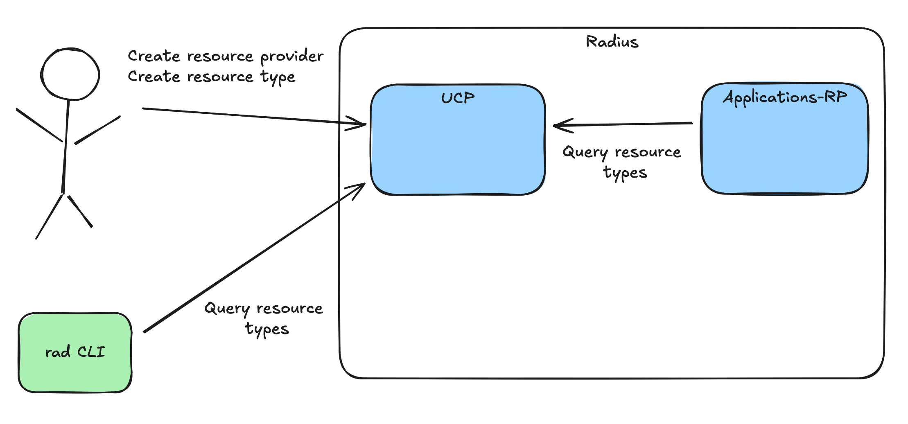

# Resource Type Registration APIs

* **Author**: `Ryan Nowak` (`@rynowak`)

## Overview

*This document describes the resource type registration APIs. This is a detailed design doc focused on one aspect of the overall user-defined types feature area. Please see the overall user-defined-types plan for more context.*

Resources are the unit of exchange in the Radius API. All of our user-experiences like the CLI, Dashboard, and Bicep authoring are oriented around the catalog of resources. Because Radius is strongly-typed, the set of resource types and their schemas are also defined as a primary concept in Radius. In order for Radius to support each additional kind of resources, for example a PostgreSQL database, we must first have a type definition.

The registration APIS for resource types determine how users add, change, or remove types from Radius. The APIs defined in this document define the *capabilities* of the Radius/UCP implementation with respect to registration of resource providers, resource types, and locations. The vast majority of Radius users will not interact with these APIs in detail. 

## Terms and definitions

*Please read the [Radius API](https://docs.radapp.io/concepts/technical/api/) conceptual documentation. This document will heavily use the terminology and concepts defined there.*

*Please see additional terms and context in the [overall user-defined-types](https://github.com/radius-project/design-notes/pull/56/files) design note.*

| Term                        | Definition                                                                                                                                                                                                                                                                                                                                                                           |
| --------------------------- | ------------------------------------------------------------------------------------------------------------------------------------------------------------------------------------------------------------------------------------------------------------------------------------------------------------------------------------------------------------------------------------ |
| Resource Provider           | A microservice that implements support for one or more resource types grouped under the same namespace (eg: Applications.Core). Radius provides several resource providers in the default installation. Resource provider can also refer to a group of related types under a common namespace. This proposal introduces an API for registering and unregistering resource providers. |
| Resource Provider Namespace | A group of related or similar resources that share a resource provider. eg: In `Applications.Core/containers` the resource provider namespace is `Applications.Core`.                                                                                                                                                                                                                |
| Resource Type               | An API entity that provides CRUDL operations. Resource Types are implemented by a resource provider and belong to a resource provider namespace. Resource types are a new resource type introduced by this proposal. This proposal introduces an API for registering and unregistering resource resource types.                                                                      |
| OpenAPI/Schema              | A format for documenting HTTP-based APIs. In this document we're primarily concerned with the parts of OpenAPI pertaining to request/response bodies.                                                                                                                                                                                                                                |
| Location/Region             | An instance of a loosely-connected deployment of UCP. Regions of a UCP can collaborate to serve route requests between each other. A multi-regional deployment of UCP provides fault-isolation. In a multi-regional deployment of UCP, each region is responsible for processing requests that correspond to its region based on the `location` field.                               |

## Objectives

> **Issue Reference:** https://github.com/radius-project/radius/issues/6688

### Goals

- Support granular registration of resource providers and resource types (add/change/remove) by users.
- Support efficient querying of resource type data for any API consumer.
- Register resource types for existing Radius functionality like Deployment Engine and `Applications.*` resource types.
- Support the future of UCP as a multi-regional control-plane by avoiding breaking changes in the future.
  - For now we ensure the `location` field and concept is surfaced in the API by assuming that multi-regional deployments are possible. In practice only a single region will be present.

### Non goals

- (out of scope): Complete the user-defined type implementation. This design document is scoped to registration of resource types.
- (out of scope): Tooling for resource type registration (CLI, Bicep). This work is tracked by another design document.
- (non-goal): Provide non-user-facing mechanisms for resource type registration.
- (out of scope): A complete multi-locational architecture for UCP. 

### User scenarios (optional)

#### Defining new types

Suzy is a platform engineer at Contoso working on the internal developer platform. She defines a resource type for an internal service `ContosoBus` named `Contoso.Platform/contosoBuses`. 

She can use tools like Bicep, GitOps, or the `rad` CLI to register the new resource types in any tenant of Radius.

*Note: the exact set of tooling implementations are out of scope for this document.*

#### Removing default resource types

Suzy is a platform engineer at Contoso working on the internal developer platform. She wants to avoid confusion about the set of resource types supported by the platform.

The application teams are Contoso are allowed to use `Applications.Datastores/redisCaches` and `Applications.Datastores/postgreSQLDatabases`. They can't use other databases like `Applications.Datastores/sqlServerDatabases`. Suzy uses the `rad` CLI to unregister other types in the `Applications.Datastores` namespace.

*Note: the exact set of tooling implementations are out of scope for this document.*

## User Experience (if applicable)

See API design. Tooling and user-experiences are out of scope for this document.

## Design

### High Level Design

The registration APIs allow a user to control the set of resource types known to UCP. Since UCP is responsible for routing, it needs to know the set of resource providers and resource types so that it can send them traffic. 

While resource types are the primary concept for **consumers** of extensibility (eg: application developers using Radius), resource providers are a significant concept for users that **implement** extensibility. The API design proposed here includes resource providers as a concept, and supports important scenarios for operating and versioning resource providers over time, based on lessons-learned from ARM.

For anyone skeptical about this, the concept of resource provider is already present in **every** resource id/URL. This is the meaning of the `providers` segment. Currently URLs like `/planes/radius/local/providers` don't have any functionality associated with them, and return a 404 - this proposal addresses this gap.

One of these lessons-learned is the ability to register multiple regions/locations where a resource provider can operate. In particular users will need the ability to gradually roll out functionality across regions rather than updating all regions at once. This is complex, and doesn't help us in the short term. The approach taken here is aligned with our current strategy for region/location in Radius. The APIs are designed for multi-region but the implementation assumes a single region is used.

#### Resource Types

The registration APIs add a few new resource types:

- `System.Resources/resourceProviders` for resource providers.
- `System.Resources/resourceProviders/resourceTypes` for resource types.
- `System.Resources/resourceProviders/resourceTypes/apiVersions` for API versions of resource types.
- `System.Resources/resourceProviders/locations` for the configuration of a resource provider in a specific location/region.

These new resource types define the full CRUDL set of APIs. These APIs are optimized for operations that need to modify or deeply understand resource types. 

These are our first nested resource type in UCP/Radius. This is a good usecase for a nested resource types because:

- The `apiVersions` body will be large due to the inclusion of an OpenAPI schema. 
- Users need granular registration and unregistration of individual resource types and API versions. (See scenario 2 above).
- Modeling `location` as a resource optimizes for per-region rollouts and validation of new functionality.

---

These new resource types are scoped to the Radius plane. 

> eg: `/planes/radius/local/providers/System.Resources/resourceProviders`

The rationale for this is to support registration/unregistration per-tenant of Radius rather than per-installation.

#### Query Patterns

The nested resource pattern is the best approach to support the data access patterns needed to implement UDTs. 

Some examples:

- UCP Request Routing:
  - UCP knows the location, resource type, and API version.
  - UCP can query a single `locations` resource to check for support and find the downstream API address.
- Dynamic-RP Validation:
  - Dynamic-RP knows the resource type and API version.
  - Dynamic-RP can query a single `apiVersions` resource to fetch its schema for validation. 

#### Resource Type Summaries

The proposal also defines two new **non-resource** APIs:

- `GET /planes/radius/{plane}/providers/`: list the most commonly used fields all resource providers.
- `GET /planes/radius/{plane}/providers/{provider}` shows the most commonly used fields of specific resource provider.

These APIs are optimized for queries and are consistent with similar APIs in ARM. To understand why this is important, remember that the OpenAPI schema for a resource type can be quite large, and the overall structure of the APIs is complex. Some functionality in Radius will need to query resource types frequently. For example, consider the need for the `rad recipe register` to validate a resource type. Building a separate API for queries allows us to optimize the behavior.

These APIs can also be implemented consistently across all planes in the future. For example Azure doesn't support user-defined types, but it does support looking up the set of resource types.

#### Locations

UCP is a multi-regional control-plane like the control-plane that inspired it (ARM). We don't use UCP/Radius in any multi-region scenarios right now but it's important we avoid lock-in to a single-region design. ARM has a mature multi-location design but doesn't expose to users the ability to register types. However we can learn a lot from the scenarios supported by ARM for rolling out new API versions and new types.

- Resource providers (non-declarative) are deployed per-location.
- New functionality (API versions + types) is rolled out per-location.

Some examples:

> Resource provider `Contoso.Example` is only available in the `westus-1` location. UCP must reject creation requests to other locations.

> Resource type `Contoso.Example/widgets` is available in all locations, but new API version `2024-08-01-preview` is only in the `eastus-2` location. UCP should block all requests for unsupported API version x location pairs.

The design proposal includes axes for configuring location affinity:

- `System.Resources/resourceProviders/locations` allows separate configuration of each location with an optional `address` in each location for the resource provider.
- `System.Resources/resourceProviders/locations` includes the list of supported resource types and supported API versions for the location.
- `System.Resources/resourceProviders/resourceTypes` is the canonical definition for a given resource type.
- `System.Resources/resourceProviders/resourceTypes/apiVersions` is the canonical definition for a given API version of a resource type.

The structure and semantics of each resource type and API version must have a single definition. Each location may specify the resource types and API version it supports, but may not provide different definitions or semantics for resource types and API versions.

### Architecture Diagram

Resource type registration and querying is implemented in UCP. Any client may call the registration APIs or query APIs including resource providers.

<center>



**Fig: Diagram of resource type registration and querying** [link](https://excalidraw.com/#json=FzQQaxv1d-vlmmDBAeOfc,UUXIasjO8p27hN0AB8qeiw)

</center>

### Detailed Design

#### Nested resource type primer 

Since this is our first nested resource type, a basic primer on nested types is needed. A nested resource type exists *inside* another resource type. A resource type is that is not nested is *top-level*. These relationships are also sometimes referred to as a parent and child. 

The following statements are all accurate:

- The `System.Resources/resourceProviders` type is the parent of `System.Resources/resourceProviders/resourceTypes`. 
- The `System.Resources/resourceProviders/resourceTypes` type is the child of `System.Resources/resourceProviders`.
- The `System.Resources/resourceProviders/resourceTypes` type is nested within `System.Resources/resourceProviders`.
- The `System.Resources/resourceProviders` type is a top-level resource type.

Any resource type with two segments (separated by `/`) is a top-level resource type. Any resource type with 3 or more segments (separate by `/`) is a nested resource type.

##### Structure

The resource ids (and URLs) are written like the following:

- `/planes/radius/{plane}/providers/System.Resources/resourceProviders` - List all resource providers.
- `/planes/radius/{plane}/providers/System.Resources/resourceProviders/Contoso.Example` - Get the Contoso.Example resource provider.
- `/planes/radius/{plane}/providers/System.Resources/resourceProviders/Contoso.Example/resourceTypes` - List all resource types inside the `Contoso.Example` resource provider/namespace.
- `/planes/radius/{plane}/providers/System.Resources/resourceProviders/Contoso.Example/resourceTypes/contosoBuses` - Gets the `contosoBuses` resource type inside the `Contoso.Example` resource provider/namespace.

---
**Note: These ids refer to the type definition of the `Contoso.Example/contosoBuses` resource type . The ids of `Contoso.Example/contosoBuses` resources are structured like our existing resource types.**

- `/planes/radius/{plane}/resourceGroups/{resourceGroup}/providers/Contoso.Example/contosoBuses` - Lists the `Contoso.Example/contosoBuses` resources inside the `/planes/radius/{plane}/resourceGroups/{resourceGroup}` scope.

---

Adding additional levels of nesting is allowed. eg: `/planes/radius/{plane}/providers/System.Resources/resourceProviders/Contoso.Example/resourceTypes/contosoBuses/apiVersion/2024-01-01`. ARM defines an artificial limit of 3 levels of children for simplicity.


##### Semantics

Nesting a resource type also nests the lifecycle of the resource. Using our examples above, the `/planes/radius/{plane}/providers/System.Resources/resourceProviders/resourceTypes/Contoso.Example/contosoBuses` type cannot exist unless `/planes/radius/{plane}/providers/System.Resources/resourceProviders/Contoso.Example` already exists.

There are a few simple rules for this:

- For operations on parent resources...
  - A `DELETE` operation on a parent resource deletes all children.

- For operations on child resources...
  - A *`CRUL`* operation (anything but delete) on a child resource must return a `404` when the parent does not exist.
  - A `DELETE` operation on a child resource never returns a `404`, because `DELETE` operations never return `404` in our API.

### API design

We should consider the set of concepts that need to be included in the resource provider and resource type APIs. For this design doc we'll consider the minimal set necessary to route to one of our existing resource providers. As we build more features for user-defined types we'll add more functionality. We don't want to design functionality in the API separately from its usage -- an incremental approach is better.

The set of concepts needed right now looks like this:

Resource providers:

- (child resource): resource types
- (child resource): locations

Resource types:

- (child resource): API versions
- The default API version: the API version that should by used by a client that has no coupling to the API. This will mostly be internal UCP functionality like resource group deletion.

API Versions:

- ... (silence) ...
- For now this will be empty. We'll add more functionality in the future as we build the rest of user-defined types.

Locations:

- An optional address/URL of the resource provider. This is optional because it won't be needed for declarative user-defined types.
- The list of resource types supported in the location.
  - The list of API versions supported for the resource type in the location

Note: A resource type and API version may not be supported in all locations where the resource providers exists. This allows locations to be specialized based on functionality. This also allows for staged rollouts of new types.

```typespec
@doc("The resource provider namespace")
@maxLength(63)
@pattern("^([A-Za-z]([-A-Za-z0-9]*[A-Za-z0-9]))\\.([A-Za-z]([-A-Za-z0-9]*[A-Za-z0-9]))?$")
scalar ResourceProviderNamespaceString extends string;

@doc("The resource type name")
@maxLength(63)
@pattern("^([A-Za-z]([-A-Za-z0-9]*[A-Za-z0-9]))$")
scalar ResourceTypeNameString extends string;

@doc("The API version name")
@maxLength(63)
@pattern("^(\\d{4}-\\d{2}-\\d{2}(-preview)?$")
scalar ApiVersionNameString extends string;

@doc("The location name")
@maxLength(63)
@pattern("^([A-Za-z]([-A-Za-z0-9]*[A-Za-z0-9]))$")
scalar LocationNameString extends string;

#suppress "@azure-tools/typespec-azure-resource-manager/arm-resource-path-segment-invalid-chars"
model ResourceProviderResource is TrackedResource<ResourceProviderProperties> {
  @key("resourceProviderName")
  @doc("The resource provider name.")
  @path
  @segment("providers/System.Resources/resourceproviders")
  name: ResourceProviderNamespaceString;
}

@doc("Resource provider properties")
model ResourceProviderProperties {
  @doc("The status of the asynchronous operation.")
  @visibility("read")
  provisioningState?: ProvisioningState;
}

@doc("A resource type supported by the resource provider.")
model ResourceTypeResource is TrackedResource<ResourceTypeProperties> {
  @key("resourceTypeName")
  @doc("The resource type name.")
  @path
  @segment("resourcetypes")
  name: ResourceTypeNameString;
}

@doc("Resource type properties.")
model ResourceTypeProperties {
  @doc("The status of the asynchronous operation.")
  @visibility("read")
  provisioningState?: ProvisioningState;

  @doc("The default api version for the resource type.")
  defaultApiVersion: ApiVersionNameString;
}

@doc("A resource type API version supported by the resource provider.")
model ApiVersionResource is TrackedResource<ApiVersionProperties> {
  @key("apiVersion")
  @doc("The api version name.")
  @path
  @segment("apiversions")
  name: ApiVersionNameString;
}

@doc("Resource provider properties")
model ApiVersionProperties {
  @doc("The status of the asynchronous operation.")
  @visibility("read")
  provisioningState?: ProvisioningState;

  // TODO: schema and other properties will be added here in the future.
}

@doc("A location supported by the resource provider.")
model LocationResource is TrackedResource<LocationProperties> {
  @key("locations")
  @doc("The locations name.")
  @path
  @segment("locations")
  name: LocationNameString;
}

@doc("Location properties")
model LocationProperties {
  @doc("The status of the asynchronous operation.")
  @visibility("read")
  provisioningState?: ProvisioningState;

  @doc("Configuration for resource types supported by the location.")
  resourceTypes?: Record<LocationResourceType>
}

@doc("Configuration for a resource type.")
model LocationResourceType {
  @doc("Address of a resource provider implementation.")
  address?: string;

  @doc("Configuration for API versions of a resource type supported by the location.")
  apiVersions?: Record<LocationResourceTypeApiVersion>
}

@doc("Configuration for an API version of an resource type.")
model LocationResourceTypeApiVersion {
  // Empty for now.
}

@doc("A resource provider and its types.")
model ResourceProviderSummaryResult {
  @doc("The resource provider name.")
  name: ResourceProviderNamespaceString;

  @doc("The resource provider locations.")
  locations: Record<ResourceProviderSummaryResultLocation>;

  @doc("The resource types supported by the resource provider.")
  resourceTypes: Record<ResourceTypeSummaryResult>;
}

@doc("The configuration of a resource provider in a specific location.")
model ResourceProviderQueryResultLocation {
}

@doc("A resource type and its versions.")
model ResourceTypeQueryResult {
  @doc("API versions supported by the resource type.")
  apiVersions: Record<ResourceTypeSummaryResultApiVersion>;

  @doc("The default api version for the resource type.")
  defaultApiVersion: string;

}

// Operations omitted for brevity...
```

#### Example: Resource Provider PUT

```txt
PUT /planes/radius/local/providers/System.Resources/resourceProviders/Contoso.Platform
```

```json
{
  "location": "global",
  "properties": {}
}
```

```json
{
  "id": "/planes/radius/local/providers/System.Resources/resourceProviders/Contoso.Platform",
  "name": "Contoso.Platform",
  "type": "System.Resources/resourceProviders",
  "location": "global",
  "properties": {
    "provisioningState": "Succeeded"
  },
  "systemData": {}
}
```

**Example: Resource Type PUT**

```txt
PUT /planes/radius/local/providers/System.Resources/resourceProviders/Contoso.Platform/resourceTypes/contosoBuses
```

```json
{
  "properties": {
    "defaultApiVersion": "2024-08-01",
  }
}
```

```json
{
  "id": "/planes/radius/local/providers/System.Resources/resourceProviders/Contoso.Platform/resourceTypes/contosoBuses",
  "name": "contosoBuses",
  "type": "System.Resources/resourceProviders/resourceTypes",
  "properties": {
    "defaultApiVersion": "2024-08-01",
    "provisioningState": "Succeeded"
  },
  "systemData": {}
}
```

**Example: Resource Type API Version PUT**

```txt
PUT /planes/radius/local/providers/System.Resources/resourceProviders/Contoso.Platform/resourceTypes/contosoBuses/apiVersions/2024-08-01
```

```json
{
  "properties": {
    "schema": {},
  }
}
```

```json
{
  "id": "/planes/radius/local/providers/System.Resources/resourceProviders/Contoso.Platform/resourceTypes/contosoBuses/apiVersions/2024-08-01",
  "name": "2024-08-01",
  "type": "System.Resources/resourceProviders/resourceTypes/apiVersions",
  "properties": {
    "schema": {},
    "provisioningState": "Succeeded"
  },
  "systemData": {}
}
```

**Example: Resource Provider Location PUT**

```txt
PUT /planes/radius/local/providers/System.Resources/resourceProviders/Contoso.Platform/locations/global
```

```json
{
  "properties": {
    "address": "http://myrp.global.cluster.svc.local",
    "resourceTypes": {
      "contosoBuses": {
        "apiVersions": {
          "2024-08-01": {}
        }
      }
    }
  }
}
```

```json
{
  "id": "/planes/radius/local/providers/System.Resources/resourceProviders/Contoso.Platform/locations/global",
  "name": "global",
  "type": "System.Resources/resourceProviders/locations",
  "properties": {
    "address": "http://myrp.global.cluster.svc.local",
    "resourceTypes": {
      "contosoBuses": {
        "apiVersions": {
          "2024-08-01": {}
        }
      }
    },
    "provisioningState": "Succeeded"
  },
  "systemData": {}
}
```

#### Example: Resource Provider Query

```txt
GET /planes/radius/local/providers
```

```json
{
  "value": [
    {
      "name": "Contoso.Platform",
      "resourceTypes": {
        "apiVersions": {
          "2024-05-01": {},
          "2024-08-01": {}
        },
        "defaultApiVersion": "2024-08-01"
      }
    }
  ]
}
```

### Implementation Details

#### UCP

##### Special case: child resources

We encounter one (ugly) special case in the API design - defining the resource id for a child resource.

Consider two resource types:

- `Contoso.Platform/contosoBuses`
- `Contoso.Platform/contosoBuses/queues`

This causes an issue when we try to write the resource ids for the **type definitions** of these two types:

- `Contoso.Platform/contosoBuses` -> `/planes/radius/local/providers/System.Resources/resourceProviders/Contoso.Platform/resourceTypes/contosoBuses`

What about `Contoso.Platform/contosoBuses/queues`? Which of these is right?

- `/planes/radius/local/providers/System.Resources/resourceProviders/Contoso.Platform/resourceTypes/contosoBuses/resourceTypes/queues`?
- `/planes/radius/local/providers/System.Resources/resourceProviders/Contoso.Platform/resourceTypes/contosoBuses/queues`?

Neither of these is acceptable. We don't want to define recursive types like the first example. The second one is also bad, because it makes it seem like `queues` is a resource type in the UDT infrastructure. Placing a name in a location where the resource id parser expects a type breaks the world.

We really want the string `contosoBuses/queues` to be parsed as the resource name, but using a `/` will prevent that from happening. We need some kind of escaping. 

My proposal is that we escape this be replacing `/` with `_`. We do this transformation on resource types elsewhere in code where `/` is not allowed, for example Kubernetes labels. So the result would be:

- `/planes/radius/local/providers/System.Resources/resourceProviders/Contoso.Platform/resourceTypes/contosoBuses_queues`

HTTP defines `%`-encoding to escape significant characters like `%` as part of the URL. So if we follow the HTTP convention this would be:

- `/planes/radius/local/providers/System.Resources/resourceProviders/Contoso.Platform/resourceTypes/contosoBuses%25queues`

I don't like this idea. It's less obvious to users to figure out why `%25` is the right replacement. It's also problematic in implementations. Many HTTP server implementations will decode `%25` -> `/` as part of a defense-in-depth approach to protecting against path-navigation exploits. This behavior varies per-HTTP server and is usually not configurable. It's also unclear whether we'll support other percent-encodings in the future, which we shouldn't do. 

##### New APIs

The new APIs will be implemented using our existing *shared* controllers inside the Radius module of UCP. The existing *shared* controllers will be improved as necessary to implement the correct behaviors for a nested resource.

##### Bootstrap registration

UCP provides a *bootstrap* implementation that registers planes instances during startup using its configuration file. This will be used to register the resource providers and resource types that Radius includes by default. The *bootstrap* implementation will be enhanced as needed to implement this functionality. The design considerations of improving the *bootstrap* are out of scope of this document and will be covered in the next one.

### Error Handling

The important error handling scenarios for this change are related to the nested resource lifecycle.

eg: Returning a `404` on a `PUT` to a child resource when the parent resource provider does not exist.

## Test plan

*See implementation plan in the overall user-defined types document. This document will only cover the testing of the registration APIs.*

The overall type registration feature will be tested by integration tests for UCP. These features don't interact with the outside world and so we can fully test them with integration tests. 

## Security

This change does not introduce any new security-sensitive features.

## Compatibility (optional)

This change is additive and does not introduce any compatibility risk.

## Monitoring and Logging

This change does not need any need telemetry.

## Development plan

See the overall development plan. This design document tracks one step of that plan.

## Open Questions

**Q: Should we support resource type registration at more granular scopes?**

> eg. Could I register a resource type scoped to a resource group rather than the plane?

This is an interesting idea and feels very powerful. It's also very complex.

Operations in UCP/Radius rarely cross instances of a plane/tenant. For example there are no operations that would combine data from the `contoso-prod` and `contoso-test` Radius planes. This is by-design. 

If resource types are registered per-plane then it's very simple to reason about them. If you see a resource type, you know it's valid for the whole plane. It also means that resource types are **nominally-typed** - meaning that the same name `<==>` the same type. 

If resource types can be registered at more granular scopes then these assumptions are false. 

- There are **holes** where a given resource type may not be defined.
- Two resource types with the same name may not be the same.

My suggested action is that we identify the limitations and hard problems introduced by adding resource-group-scoped-resource-types while we build the features. This will help us understand whether to modify the design now or file this away for future prioritization.

## Alternatives considered

**Q: Should we try to hide resource providers as a concept in the API?**

> eg. What if we surfaced `System.Resources/resourceTypes` as a top-level resource instead of nested as `System.Resources/resourceProviders/resourceTypes`?

If we wanted to do this, we'd have to combine the functionality of `System.Resources/resourceProviders` and `resourceTypes`. `resourceTypes` would have the union of all of these properties.

We'd instantly have a problem writing down the resource id / resource name for `resourceTypes` resource. Consider what happens when `Applications.Datastores` and `Contoso.Internal` both want to define a `postgreSQLDatabases` type - without a way to fully-qualify the name, it would be a conflict. We'd have to resort to encoding like we must for child resources. 

Other resource types like `locations` would need to be nested inside `resourceTypes` as well. Anything **operational** related to the resource provider would be configured as part of the resource type, since there would no longer be a `System.Resources/resourceProviders` resource. This could be difficult to manage, or lead to problematic cases with error reporting with duplication of data.

My conclusion is that the proposed design better-reflects the invariants and requirements of the system. Removing `System.Resources/resourceProviders` is an oversimplification and will be harder to maintain.

**Q: Should resource type registration be an API? at all, or an offline process?**

> eg. In ARM resource types are added/modified through an internal process, not through the public API. 

Since we want resource types to be user-modifiable, exposing registration through the public API is the obvious choice. 

**Q: Should resource providers require an explicit opt-in per-plane?**

> eg. In ARM resource providers have a **Registered**/**Unregistered** state at the subscription level. This allows administrative users to control the set of resource providers allowed in a subscription.

In our design resource provider is a resource type. Creation/deletion plays the same role as registration/unregistration.

## Design Review Notes

- Lots of discussion about regions/locations. Most reviewers are new to this idea. Expanded the explanation.
  - Action item: let's explain this more in the documentation. It's an important enough concept for us to build into the API, so it deserves better coverage.
- Refined the API to be more complex but also a better fit for our expected data-access patterns.
- Added explanation for defining nested resource types.