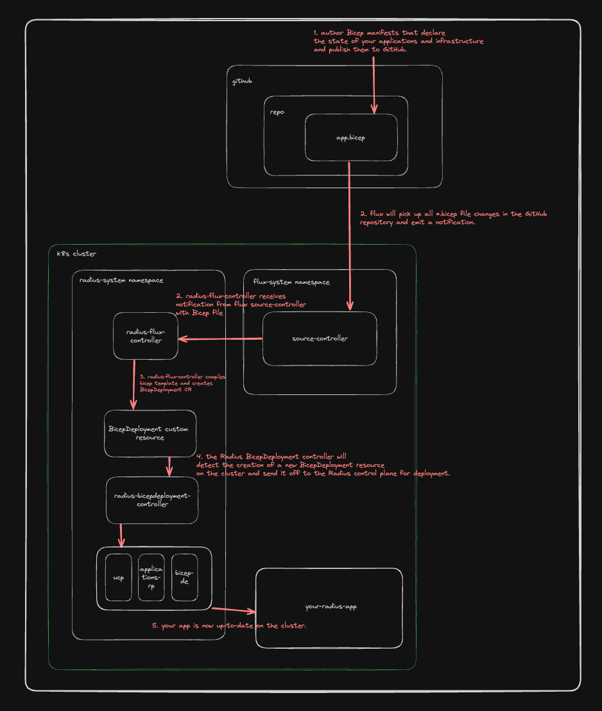

# Radius Flux Controller Technical Design

* **Author**: Will Smith (@willdavsmith)

## Overview

<!--
Provide a succinct high-level description of the component or feature and 
where/how it fits in the big picture. The overview should be one to three 
paragraphs long and should be understandable by someone outside the Radius
team. Do not provide the design details in this, section - there is a
dedicated section for that later in the document.
-->

Many enterprise application teams use GitOps practices to organize and manage their infrastructure and applications, which are deployed onto Kubernetes clusters based on the declarative configuration stored in Git repositories. [Flux](https://fluxcd.io/) is a project that implements GitOps practices for Kubernetes clusters. Flux is only compatible with Kubernetes resources, and it does not support Radius resources defined in `.bicep` files. This design outlines the changes required to support Flux in Radius, allowing users to manage their entire infrastructure and application stack using GitOps and Radius practices.

This document is a technical design that outlines the changes required to support Flux in Radius. For a more general outline and a more comprehensive user scenario document, please see the [Radius + GitOps Feature Spec](https://github.com/radius-project/design-notes/blob/main/tools/2024-06-gitops-feature-spec.md).

## Terms and definitions

<!--
Include any terms, definitions, or acronyms that are used in
this design document to assist the reader. They may or may not
be part of the user-facing experience once implemented, and can
be specific to this design context.
-->

- **GitOps**: A set of practices that utilize Git as a single source of truth for declarative infrastructure and applications.

- **Flux**: GitOps tool that automates the deployment of applications and infrastructure on Kubernetes clusters.

- **ArgoCD**: Another Kubernetes + GitOps tool.

- **SRE**: Site Reliability Engineer.

## Objectives

<!--
Describe goals/non-goals and user-scenario of this feature to understand
the end-user goals.
* If the feature shares the same objectives of the existing design, link
  to the existing doc and section rather than repeat the same context.
* If the feature has a scenario, UX, or other product feature design doc,
  link it here and summarize the important parts.
-->

> **Issue Reference:** https://github.com/radius-project/radius/issues/6689

### Goals

<!--
Describe goals to define why we are doing this work, how we will make
priority decisions, and how we will determine success.
-->

**Goal: Users can publish Radius resources to Git repositories and use Flux to deploy them to Kubernetes clusters.**

Users of Radius who are already using Flux for their Kubernetes resources should be able to use Flux to deploy Radius environments, applications, and other resources as well. This will allow users to manage their entire infrastructure and application stack using GitOps practices.

**Goal: Users of Radius + Flux can patch their applications using bicepparams.**

Users that are running Radius applications on Kubernetes clusters using Flux should be able to patch their applications using bicepparams.

### Non goals

<!--
Describe non-goals to identify something that we won’t be focusing on 
immediately. We won’t be expending any effort on these matters. If there
will be follow-ups after this work, list them here. If there are things
we plan to do in the future, but are out of scope of this design, list
them here. Provide a brief explanation on why this is a non-goal.
-->

**Non-goal: Support for other GitOps tools**

This design is focused on supporting Flux. Support for other GitOps tools (such as ArgoCD) is out of scope for this design and will be considered in a future design. The design principles outlined here may be applicable to other GitOps tools, but the implementation details will be specific to Flux.

**Non-goal: Re-implement Bicep compiler features.**

The Bicep compiler is a separate component that is responsible for compiling Bicep manifests into ARM templates. This design is doing as much as possible to leverage the existing Bicep compiler and not re-implement its features.

### User scenarios

<!--
Describe the user scenarios for this design. Ensure that you define the
roles and personas in these user scenarios when it requires API design.
If you have an existing issue that describes the user scenarios, please
link to that issue instead.
-->

Please see the [Radius + GitOps Feature Spec](https://github.com/radius-project/design-notes/blob/main/tools/2024-06-gitops-feature-spec.md) for user scenarios. This design is focused on the technical implementation details required to support Flux in Radius.

## Design

### High Level Design
<!--
High level overview of the data flow and key components.

Provide a high-level description, using diagrams as appropriate, and top-level
explanations to convey the architectural/design overview. Don’t go into a lot
of details yet but provide enough information about the relationship between
these components and other components. Call out or highlight new components
that are not part of this feature (dependencies). This diagram generally
treats the components as black boxes. Provide a pointer to a more detailed
design document, if one exists. 
-->

This design proposes a new Radius controller, the Radius Flux Controller, that subscribes to notifications from the Flux Source Controller when `.bicep` and `.bicepparam` files are updated in the source git repository. The controller will then compile the Bicep manifests and create, update, or delete `BicepDeployment` resources on the Kubernetes cluster as necessary.

### Architecture Diagram
<!--
Provide a diagram of the system architecture, illustrating how different
components interact with each other in the context of this proposal.

Include separate high level architecture diagram and component specific diagrams, wherever appropriate.
-->

### Detailed Design

<!--
This section should be detailed and thorough enough that another developer
could implement your design and provide enough detail to get a high confidence
estimate of the cost to implement the feature but isn’t as detailed as the 
code. Be sure to also consider testability in your design.

For each change, give each "change" in the proposal its own section and
describe it in enough detail that someone else could implement it. Cover
ALL of the important decisions like names. Your goal is to get an agreement
to proceed with coding and PRs.

If there are alternatives you are considering please include that in the open
questions section. If the product has a layered architecture, it's good to
align these sections with the product's layers. This will help readers use
their current understanding to understand your ideas.

Discuss the rationale behind architectural choices and alternative options 
considered during the design process.
-->

#### Flux Controller

The Radius Flux Controller will be a Kubernetes controller, based on the [Flux source watcher](https://fluxcd.io/flux/gitops-toolkit/source-watcher/) pattern to watch for changes to `.bicep` and `.bicepparam` files in the Flux source controller. When a change is detected, the controller will compile the Bicep manifests and create or update `BicepDeployment` resources on the Kubernetes cluster. The controller is responsible for compiling Bicep manifests, so it will need to construct a "file system" that the Bicep compiler can use to resolve dependencies.

Some edge cases to consider:
* If the bicep file was there, and now it's not, delete the exising CRD

#### Advantages (of each option considered)
<!--
Describe what's good about this plan relative to other options. 
Provides better user experience? Does it feel easy to implement? 
Provides flexibility for future work?
-->

#### Disadvantages (of each option considered)
<!--
Describe what's not ideal about this plan. Does it lock us into a 
particular design for future changes or is it flexible if we were to 
pivot in the future. This is a good place to cover risks.
-->

#### Proposed Option
<!--
Describe the recommended option and provide reasoning behind it.
-->

### API design (if applicable)

<!--
Include if applicable – any design that changes our public REST API, CLI
arguments/commands, or Go APIs for shared components should provide this
section. Write N/A here if not applicable.
- Describe the REST APIs in detail for new resource types or updates to
  existing resource types. E.g. API Path and Sample request and response.
- Describe new commands in the CLI or changes to existing CLI commands.
- Describe the new or modified Go APIs for any shared components.
-->

### CLI Design (if applicable)
<!--
Include if applicable – any design that changes Radius CLI
arguments/commands. Write N/A here if not applicable.
- Describe new commands in the CLI or changes to existing CLI commands.
-->

### Implementation Details
<!--
High level description of updates to each component. Provide information on 
the specific sub-components that will be updated, for example, controller, processor, renderer,
recipe engine, driver, to name a few.
-->

#### UCP (if applicable)
#### Bicep (if applicable)
#### Deployment Engine (if applicable)
#### Core RP (if applicable)
#### Portable Resources / Recipes RP (if applicable)

### Error Handling
<!--
Describe the error scenarios that may occur and the corresponding recovery/error handling and user experience.
-->

## Test plan

<!--
Include the test plan to validate the features including the areas that
need functional tests.

Describe any functionality that will create new testing challenges:
- New dependencies
- External assets that tests need to access
- Features that do I/O or change OS state and are thus hard to unit test
-->

## Security

<!--
Describe any changes to the existing security model of Radius or security 
challenges of the features. For each challenge describe the security threat 
and its mitigation with this design. 

Examples include:
- Authentication 
- Storing secrets and credentials
- Using cryptography

If this feature has no new challenges or changes to the security model
then describe how the feature will use existing security features of Radius.
-->

## Compatibility (optional)

<!--
Describe potential compatibility issues with other components, such as
incompatibility with older CLIs, and include any breaking changes to
behaviors or APIs.
-->

## Monitoring and Logging

<!--
Include the list of instrumentation such as metric, log, and trace to 
diagnose this new feature. It also describes how to troubleshoot this feature
with the instrumentation. 
-->

## Development plan

<!--
Describe how you will deliver your features. This includes aligning work items
to features, scenarios, or requirements, defining what deliverable will be
checked in at each point in the product and estimating the cost of each work
item. Don’t forget to include the Unit Test and functional test in your
estimates.
-->

## Open Questions

<!--
Describe (Q&A format) the important unknowns or things you're not sure about. 
Use the discussion to answer these with experts after people digest the 
overall design.
-->

Should we package the `radius-flux-controller` in-process with the `radius-controller` or outside of it?

## Alternatives considered

<!--
Describe the alternative designs that were considered or should be considered.
Give a justification for why alternative approaches should be rejected if
possible. 
-->

## Design Review Notes

<!--
Update this section with the decisions made during the design review meeting. This should be updated before the design is merged.
-->