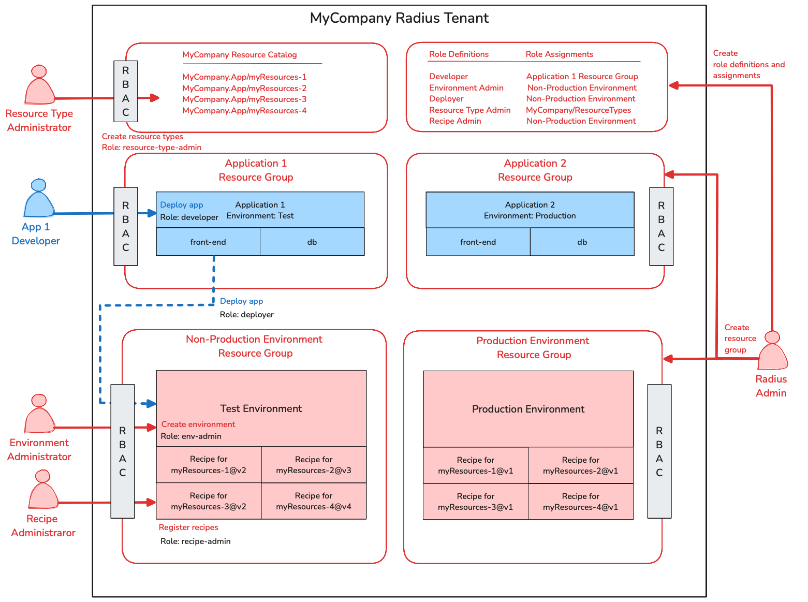

# Radius Authorization Feature Specification

* **Author**: Zach Casper (@zachcasper)

## Summary

Radius is inherently a multi-tenant system with several different personas. Separation of concerns between developers and platform engineers is a core concept. Developers model their applications using resource types abstracted away from the infrastructure while platform engineers configure how those resource types are deployed. Radius is also designed to support multiple different applications, developers, and groups of developers. 

The building blocks of this multi-tenancy is implemented today with resource groups. Every resource, whether it is an application, an environment, or a recipe, resides in a resource group. However, today, access to Radius is binary—you ether have access to the API or you do not. It is not possible to control permissions to these resources and resource groups. This feature specification describes the requirements and user experience for authorizing users to perform a granular set of actions on a granular set of resources and resource groups.

### Goals

This feature specification describes:

* Granting and revoking permission to users to perform Radius administrative actions at the control-plane level and tenant level
* Granting and revoking permission to users to perform create, read, update, delete actions on resources and resource groups including applications, user-defined resource types, environments, and recipe registrations
* Granting and revoking permission to users to associate resources between resource groups

### Non-goals (out of scope)

This feature specification only addresses authorization. A separate feature specification is under development for authenticating users.

## User profiles and challenges

**IAM administrator** – This person is not a Radius user, but rather someone who administers the organization's identity and access management or identity provider system. The IAM administrator models the organization's structure into a set of user groups which will be leveraged by external systems such as Radius. These groups are stored as user to group mapping in an identity provider such as Microsoft Entra ID, Okta, and Ping Identity. 

**Radius administrator** – The Radius administrator needs to model their organization's structure into a set of resource groups within Radius and grant access to these groups. The Radius administrator must have awareness of the user groups stored in the identity provider in order to associate a set of users with a resource group. Therefore, in some organizations, the Radius administrator may have some access to the identity provider system.

**Developers** – Developers need to use the resource types available to them to model their applications and deploy to environments which they have access to.

**Environment administrators** – An environment administrator needs to create and maintain environments in Radius for developers to deploy their applications to. The environment administrator must ensure the physical or cloud environment is prepared to have applications deployed to it and that the Radius environment is configured correctly. In some organizations, the environment administrator will determine who has permission to deploy applications to which environment.

**Resource type administrators** – A resource type administrator needs to maintain the resource types which are available in the Radius system and manage who can use those resource types within their applications.

**Recipe administrators** – A recipe administrator needs to manage the set of recipes registered to an environment. They must author, test, and maintain infrastructure as code modules such as Terraform or Bicep to implement the recipe. In many organizations, a recipe administrator and an environment administrator will be the same person. However, in other organizations, administration of recipes may be delegated to specialty teams for certain resource types; e.g., DBAs may maintain recipes for database resource types.

## Scenarios

The following scenarios will describe a final setup similar to the image below.



Summarizing the diagram, below are the envisioned roles and permissions described in these scenarios. 

| Role                | Scope          | Resources                                                    | Allowed Action |
| ------------------- | -------------- | ------------------------------------------------------------ | -------------- |
| Radius Admin        | Control plane  | *                                                          | *            |
| Resource Type Admin | Tenant         | System.Resources/resourceproviders for all resource namespaces | *            |
|                     | Tenant         | System.Resources/resourceproviders/MyCompany.App for a specific resource namespace | *            |
| Environment Admin   | Resource group | Applications.Core/environments                               | *            |
|                     | Resource group | Applications.Core/secretStores                               | *            |
|                     | Resource group | System.AWS/credentials                                       | *            |
|                     | Resource group | System.Azure/credentials                                     | *            |
| Recipe Admin        | Resource group | Only the recipe property of environments; tentatively denoted as Applications.Core/environments/*/recipes/ in this document | *            |
| Developer           | Resource group | Applications.Core/applications                            | *            |
|                     | Resource group | UDT namespace, e.g., MyCompany.App                         | *            |
| Deployer            | Resource group | Applications.Core/environments                             | deployTo     |

> [!NOTE]
>
> These roles names and role definitions are illustrative only. Radius admins can create whatever roles work best for their organization using any combination of actions. 

### Scenario 1 – Adding Radius administrators

As a Radius administrator, I just installed Radius on a Kubernetes cluster and now I need to add an additional user as a Radius administrator.

**User Experience**

```bash
# Radius administrative access is granted via membership in the radius-admin role in the radius-system namespace
# Add user-1 to the radius-admin role
kubectl create rolebinding user-1-admin --role radius-admin --user user-1 -n radius-system
```

**Result**

A new RoleBinding is created in the `radius-system` namespace for `user-1` to be granted the `radius-admin` role.

### Scenario 2 – Create resource group for applications

As a Radius administrator, I need to create a resource group for applications and application resources to be created in as well as set permissions which define who can create applications in that group.

**User Experience**

```bash
# Create application resource group 
rad group create rg-app-1

# Create developer role
rad role definition create -f developer-role-definition.yaml

# Assign the developer role to members of the developers group in the identity provider
# Permissions only apply in the rg-app-1 resource group
rad role assignment create \
  # group/ or user/ or rolebinding/
  --assignee group/grp-developers \
  --role developer \
  --scope /planes/radius/MyCompany/resourceGroup/rg-app-1
```

The contents of `developer-role-definition.yaml` is similar to:

```yaml
---
name: developer
description: Role to manage applications and application resources within a resource group
actions:
  # Grant permissions to CRUDL applications in the scoped resource group
  - Applications.Core/applications/*
  # Restrict using any resource type except those in the MyCompany.App namespace
  - MyCompany.App/*
```

**Result**

1. An empty resource group is created called `rg-app-1`
2. The developer role is created 
3. The `grp-developers` group is validated to exist in the identity provider
4. The `developer` role is assigned to the `grp-developers` group to manage applications and MyCompany-specified resources

**Exceptions**

The operation fails and informs the user interactively if:

* The current user is not a member of the `radius-admin` Role

* The resource group already exists

* The role definition or assignment already exists

* The `grp-developers` group does not exist in the identity provider

**Alternatives**

1. If there is no configured identity provider, the Radius admin could assign the role to a Kubernetes RoleBinding within the `radius-system` namespace.

```bash
rad role assignment create \
  # group/ or user/ or rolebinding/
  --assignee rolebinding/developers \
  --role developer \
  --scope /planes/radius/MyCompany/resourceGroup/rg-app-1
```

2. The Radius admin could have also assigned the role to a single user in the identity provider. Multiple role assignments could be created for each user.

> [!WARNING]
>
> This use case is classified as p3 or low priority. It's not necessary for this use case to be fully thought out at this time.

```bash
# Add user-1 as a developer
rad role assignment create \
  --assignee users/user-1 \
  --role developer \
  --scope /planes/radius/MyCompany/resourceGroup/rg-app-1

# Add user-2 as a developer
rad role assignment create \
  --assignee users/user-2 \
  --role developer \
  --scope /planes/radius/MyCompany/resourceGroup/rg-app-1
```

### Scenario 3 – Create resource group for environments

As a Radius administrator, I need to create a resource group for environments in Radius and set permissions which define who can create environments in that group.

**User Experience**

```bash
# Create resource group for non-production environments
rad group create rg-non-prod-env

# Create environment administrator role
rad role definition create -f env-admin-role-definition.yaml

# Assign environment administrator role to the cloud engineering user group
# Permissions only apply in the non-production resource group
rad role assignment create \
  --assignee group/grp-cloud-engineering \
  --role env-admin \
  --scope /planes/radius/MyCompany/resourceGroup/rg-non-prod-env
```

The contents of `env-admin-role-definition.yaml` is similar to:

```yaml
---
name: env-admin
description: Role to manage environments within a resource group
actions:
  # Grant permissions to CRUDL environments and secrets in the scoped resource group
  - Applications.Core/environments/*
  - Applications.Core/secretStores/*
  # Grant permissions to configure connections to AWS, Azure, and Kubernetes in the scoped resource group
  - System.AWS/credentials/* 
  - System.Azure/credentials/*
```

**Result**

1. An empty resource group is created called `rg-non-prod-env`
2. The `env-admin` role is created 
3. The cloud engineering user group is validated to exist in the identity provider
4. The `env-admin` role is granted to the cloud engineering group to manage environments within the `rg-non-prod-env` resource group

**Exceptions**

The operation fails and informs the user interactively if:

* The current user is not a member of the `radius-admin` Role

* The resource group already exists

* The role definition or assignment already exists

* The `grp-cloud-engineering` group does not exist in the identity provider

### Scenario 4 – Create the Deployer role

As a Radius administrator, I need to set permissions which define who can deploy applications and resources into these environments.

**User Experience**

```bash
# Create deployer role
rad role definition create -f deployer-role-definition.yaml

# Assign deployer role to the developers group in the identity provider
# Permissions only apply in the rg-non-prod-env resource group
rad role assignment create \
  --assignee group/grp-developers
  --role deployer
  --scope /planes/radius/MyCompany/resourceGroup/rg-non-prod-env
```

The contents of `deployer-role-definition.yaml` is similar to:

```yaml
---
name: deployer
description: Role granting ability to deploy to an environment
actions:
  # Grant permission to deploy resouces to environments within the scoped resource group
  - Applications.Core/environments/deployTo
```

> [!NOTE]
>
> The `deployTo` action is a new verb which grants permission to associate a resource in another resource group to an environment in the resource in scope.

**Result**

1. The `deployer` role is created 
2. The `grp-developers` group is validated to exist in the identity provider
3. The `deployer` role is granted to the the developers group to allow deploying applications to environments in the `rg-non-prod-env` resource group, but not CRUDL resources in that group

**Exceptions**

The operation fails and informs the user interactively if:

* The role definition or assignment already exists
* The `grp-developers` group does not exist in the identity provider

### Scenario 5 – Creating Resource Type Admin role

As a Radius administrator, I need to delegate the ability to manage resource types in Radius to my platform engineering team.

**User Experience**

```bash
# Create resource type administrator role
rad role definition create -f resource-type-admin-definition.yaml

# Assign the resource type administrator role to users in the platform engineering user group
rad role assignment create \
  --assignee group/grp-platform-engineering \
  --role resource-type-admin \
  --scope /planes/radius/MyCompany/ResourceTypes
```

The contents of `resource-type-admin-definition.yaml` is similar to:

```yaml
---
name: resource-type-admin
description: Role to manage resource types for MyCompany
actions:
  # Grant permissions to CRUDL resource types in the MyCompany.App and MyCompany.Net resource namespaces
  - System.Resources/resourceproviders/MyCompany.App/*
  - System.Resources/resourceproviders/MyCompany.Net/*
```

**Result**

1. The `resource-type-admin` role is created 
2. The `grp-platform-engineering` group is validated to exist in the identity provider
3. The `resource-type-admin` role is granted to the `grp-platform-engineering` group to operate on MyCompany's resource types

**Exceptions**

The operation fails and informs the user interactively if:

* The current user is not a member of the `radius-admin` Role
* The role definition or assignment already exists
* The `grp-platform-engineering` group does not exist in the identity provider

### Scenario 6 – Creating Recipe Admin role

As a Radius administrator, I need to delegate the ability to manage recipes in Radius to my cloud engineering and DBA teams.

> [!WARNING]
>
> This use case is classified as p3 or low priority. It's not necessary for this use case to be fully thought out at this time.

**User Experience**

```bash
# Create resource type administrator role
rad role definition create -f recipe-admin-definition.yaml

# Assign the resource type administrator role to users in the cloud engineering user group
rad role assignment create \
  --assignee group/grp-cloud-engineering \
  --role recipe-admin \
  --scope /planes/radius/MyCompany/resourceGroup/*

# Assign the resource type administrator role to users in the DBA user group
rad role assignment create \
  --assignee group/grp-dba \
  --role recipe-admin \
  --scope /planes/radius/MyCompany/resourceGroup/*
```

The contents of `recipe-admin-definition.yaml` is similar to:

```yaml
---
name: recipe-admin
description: Role to manage recipe registrations
actions:
  # Grant permissions to update the recipes on environments in the scoped resource group
  - Applications.Core/environments/*/recipes/*
```

> [!CAUTION]
>
> This action may not be correct. The intent is to permit the ability to register and unregistered recipes on all environments within a certain resource group. The scenario is that the environment administrator has created the environment and connected it to the cloud provider. But there are certain resource types that require a specific team expertise such as DBAs. The Radius admin wants to permit the ability to register/unregister recipes only while not being able to modify the environment or the resource types.

**Result**

1. The `recipe-admin` role is created 
2. The `grp-dba` group is validated to exist in the identity provider
3. The `recipe-admin` role is granted to the DBA group to register and unregistered recipes on environments in resource groups in scope

**Exceptions**

The operation fails and informs the user interactively if:

* The role definition or assignment already exists
* The `grp-dba` group does not exist in the identity provider

### Scenario 7 – Deleting a role definition and assignment

As a Radius administrator, I need to delete a role definition and assignment I previously created.

**User Experience**

```bash
# Create resource type administrator role
rad role definition delete recipe-admin

# Error is shown because existing role assignments for this definition exist
ERROR: The following role assignments exist for the recipe-admin role definition
ROLE          ASSIGNEE       SCOPE
recipe-admin  group/grp-dba  /planes/radius/MyCompany/resourceGroup/*

# Delete the role assignment
rad role assignment delete \
  --assignee group/grp-cloud-engineering \
  --role recipe-admin \
  --scope /planes/radius/MyCompany/resourceGroup/*

# Delete the role definition
rad role definition delete recipe-admin
```

**Result**

1. The role assignments for the `recipe-admin` role are deleted
2. The `recipe-admin` role definition is deleted

**Exceptions**

The operation fails and informs the user interactively if:

* Role assignments for the role definition exist as shown in the example

## Feature Summary

| Priority | Size | Feature                                                      |
| -------- | ---- | ------------------------------------------------------------ |
| p0       | L    | Create role definitions for developers via `rad role definition create` with the ability to grant permission to perform actions on applications, and specified resource type namespaces (`Applications.Core/applications/*` and `MyCompany.App/*`) |
| p0       | L    | Create role definition for deployers which grants permission to deploy resources to an environment in a separate resource group (`Applications.Core/environments/deployTo` action or something similar) |
| p0       | M    | Assign a role to users in an existing Kubernetes RoleBinding for a resource group (`rad role assignment create --assignee rolebinding/myGroup`) |
| p1       | S    | Assign a role to users in an existing group in the configured identity provider system for a resource group (`rad role assignment create --assignee group/myGroup`) |
| p1       | S    | The `radius-admin` Role is created when Radius is installed in a Kubernetes cluster and a RoleBinding is created for the current user |
| p2       | S    | Create role definition for environment administrators which grants permission to perform actions on environments and cloud provider credentials (`Applications.Core/environments/*`, `Applications.Core/secretStores`/*, `System.AWS/credentials/*`, and  `System.Azure/credentials/*`) |
| p2       | S    | Create role definition for resource type administrators which grants permission create, modify, and delete resource types in the tenant (`System.Resources/resourceproviders/`) |
| p3       | S    | Assign a role to an individual user the configured identity provider system for a resource group (`rad role assignment create --assignee user/user-1`) |
| p3       | M    | Create role definition for recipe administrators which grants permission to only register and unregister recipes with an environment  (`Applications.Core/environments/*/recipes/*` or something similar) |

## Future Features

In the future, Radius should consider these features:

* Ability to delegate role definitions and assignments to users and groups from the identity provider (this spec assumes all role defining and assigning requires being a part of the `radius-system` RoleBinding)
* Ability to manage role definitions and assignments via the Radius dashboard
* Ability to automatically grant permission to an environment based upon existing permissions assigned to the AWS account or Azure resource group