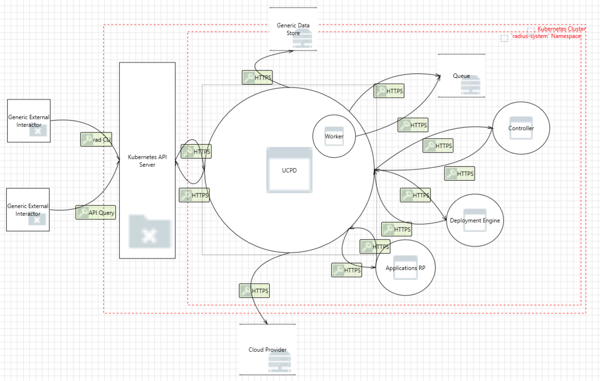

# Radius UCP Component Threat Model

- **Author**: ytimocin

## Overview

This document provides a threat model for the Radius UCP (Universal Control Plane) component. It identifies potential security threats to this critical part of Radius and suggests possible mitigations. The document includes an analysis of the system, its assets, identified threats, and recommended security measures to protect the system.

One of the most important goals of Radius is to be cloud agnostic and to enable portability of applications across platforms and environments. Therefore, the Radius UCP (Universal Control Plane) component helps the user apply ARM capabilities to non-Azure hosting models like AWS, GCP, and Kubernetes.

In brief, the UCP is a lightweight proxy that sits in front of resource providers such as Applications RP, AWS, and Azure. It routes traffic from various clients of Radius to the appropriate resource provider. It holds the necessary credentials (Azure and/or AWS) to manage resources on behalf of Radius users. **As of November 15, 2024, there is no Role-Based Access Control (RBAC) implemented, and the traffic between the UCP and the resource providers is unauthenticated.**

In the near future, we plan to provide Radius users with the capability to add their custom resource providers, increasing the number of resource providers that the UCP will route user requests to.

## Terms and Definitions

| Term | Definition |
| ---- | ---------- |
|      |            |

## System Description

An example flow:

1. Radius user runs `rad deploy app.bicep`. `app.bicep` includes a Radius environment, a Radius application, a Redis Cache on AWS.
2. ARM JSON Template is generated from the `app.bicep` file.
3. CLI makes a PUT call to UCP: `/planes/radius/local/resourcegroups/{rg}/providers/Microsoft.Resources/deployments/{name}`
4. UCP forwards that request to the Deployment Engine: `/planes/radius/local/resourcegroups/{rg}/providers/Microsoft.Resources/deployments/{name}`
5. Deployment Engine makes 3 calls back to the UCP:
   1. PUT for the Radius environment.
   2. PUT for the Radius application.
   3. PUT for the Redis Cache on AWS.
6. UCP proxies these requests to the necessary resource providers and then starts polling the statuses of these operations.
7. Deployment Engine also polls the operation statuses and results for these 3 resources.

### Architecture

The UCP (Universal Control Plane) consists of several important pieces:

- **Storage Provider**: Radius needs a data store to store all the information related to the resources of the installation. UCP keeps the information of resources by converting them to tracked resources. Available implementations of the Radius Storage Provider:

  1. Cosmos Database
  2. etcd (in-memory or persistent)
  3. In-Memory storage
  4. PostgreSQL
  5. apiserver

- **Secret Provider**: The UCP occasionally needs to create and store secrets. Available implementations of the UCP Secret Provider are:

  1. etcd
  2. Kubernetes Secrets
  3. In-memory

- **Queue Provider**: This component handles asynchronous operations. Whenever an operation that is handled asynchronously is requested, it is added as a message to the queue, which is then processed by the UCP worker.

- **Worker**: As mentioned above, the worker is for handling the asynchronous operations. It gets the operation messages from the queue and starts handling them.

### Implementation Details

#### UCP Container runs as Non-Root

As of November 24, 2024, the UCP container runs as a non-root user. This security measure helps to limit the potential impact of a container compromise by restricting the privileges available to the container. Running containers as non-root users is a best practice that enhances the overall security posture of the system. For more details, refer to the [Dockerfile](https://github.com/radius-project/radius/blob/96504063bbab8c0ee53b0955a9647cf00c7f5fae/deploy/images/ucpd/Dockerfile#L14).

#### Use of Cryptography

1. **Generating Unique Keys for Queue Messages**: [Link to code](https://github.com/radius-project/radius/blob/main/pkg/ucp/queue/apiserver/client.go#L152)

   1. **Purpose:** To generate unique keys for messages to be added to the queue in the Kubernetes CRD-based implementation of the Radius Queue.
   2. **Library:** Uses the Go standard `crypto/rand` package: [crypto/rand](https://pkg.go.dev/crypto/rand)
   3. **Type:** Random data generated using `crypto/rand`

2. **Hashing Resource IDs for Data Store Resource Names**: [Link to code](https://github.com/radius-project/radius/blob/main/pkg/ucp/store/apiserverstore/apiserverclient.go#L406)

   1. **Purpose:** To hash the resource ID to generate a unique key for the resource name in the data store.
   2. **Library:** Uses the Go standard `crypto/sha1` package: [crypto/sha1](https://pkg.go.dev/crypto/sha1)
   3. **Type:** SHA-1  
      _Note:_ SHA-1 is used here for generating unique identifiers, not for security.

3. **Hashing Resource IDs for Tracking Resource Names**: [Link to code](https://github.com/radius-project/radius/blob/main/pkg/ucp/trackedresource/name.go#L52)

   1. **Purpose:** To hash a given resource ID to compute the tracked resource name.
   2. **Library:** Uses the Go standard `crypto/sha1` package: [crypto/sha1](https://pkg.go.dev/crypto/sha1)
   3. **Type:** SHA-1  
      _Note:_ As previously noted, SHA-1 is used for optimization purposes only.

4. **Hashing Input Data to Generate New ETags**: [Link to code](https://github.com/radius-project/radius/blob/main/pkg/ucp/util/etag/etag.go#L30)

   1. **Purpose:** To hash input data to generate new ETags for resource versioning.
   2. **Library:** Uses the Go standard `crypto/sha1` package: [crypto/sha1](https://pkg.go.dev/crypto/sha1)
   3. **Type:** SHA-1  
      _Note:_ SHA-1 usage here is for generating ETags and not for cryptographic security.

---

##### General Note on SHA-1 Usage

In all instances where SHA-1 is utilized within the codebase, it serves for generating hashes to ensure uniqueness or detect changes efficiently. It is **not** used for cryptographic security purposes due to known vulnerabilities. For security-critical hashing, a more secure algorithm (e.g., SHA-256) should be employed.

---

#### Storage of Secrets

Below you will find where and how Radius stores secrets. We create Kubernetes Secret objects and rely on Kubernetes security measures to protect these secrets.

1. **Creating or Updating a Cloud Provider Credential Resource**: [Azure Implementation](https://github.com/radius-project/radius/blob/95409fe179d7adca884a3fc1d82f326bc81c8da0/pkg/ucp/frontend/controller/credentials/azure/createorupdateazurecredential.go#L89), [AWS Implementation](https://github.com/radius-project/radius/blob/95409fe179d7adca884a3fc1d82f326bc81c8da0/pkg/ucp/frontend/controller/credentials/aws/createorupdateawscredential.go#L81). When a **Cloud Provider Credential** resource is deployed, Radius creates a new Kubernetes Secret or updates an existing one. The Kubernetes Secret is deleted when the **Cloud Provider Credential** is deleted. We should also note that these credentials cannot be retrieved or updated through API calls.

#### Data Serialization / Formats

We use custom parsers to parse Radius-related resource IDs and do not use any other custom parsers. Radius resource IDs are a custom string format that can be parsed from untrusted data. The parser is a shared component.

### Clients

In this section, we will discuss the different clients of the Radius UCP (Universal Control Plane) component. Clients are systems that interact with the UCP component to trigger actions. Here are the clients of the UCP component:

1. **All Components of Radius**: Every component other than UCP is a client of UCP. This list includes the Radius CLI, Deployment Engine, Controller, Deployment Engine, Dashboard, and Applications RP.

2. **Health Check Probes**: Kubernetes itself can act as a client by performing health and readiness checks on the Universal Control Plane.

3. **Metrics Scrapers**: If metrics are enabled, Prometheus or other monitoring tools can scrape metrics from the Universal Control Plane.

## Trust Boundaries

### Trust Model of UCP Clients

UCP is a [Kubernetes API Service](https://kubernetes.io/docs/concepts/extend-kubernetes/api-extension/apiserver-aggregation/) that aims to extend Kubernetes with its APIs and capabilities. So anything that is sent to an API path that starts with `/apis/api.ucp.dev/v1alpha3` gets sent to the UCP through the Kubernetes API Server. This means that requests coming into UCP originate from an authorized user that is authorized by Kubernetes.

### Trust Model of Internal Resource providers

In terms of authentication between UCP and resource providers, we also don't have any authentication mechanisms right now. We use [AnonymousCredential](https://github.com/radius-project/radius/blob/main/pkg/azure/tokencredentials/anonymous.go#L50) while making calls to the resource providers from UCP. It basically means that there are no tokens in the request making the communication unauthenticated.

### Trust Model of External Resource Managers (Azure and AWS)

The UCP routes user requests to Azure and AWS whenever a resource from those providers is requested. In these cases, we rely on Azure and AWS to establish the trust boundary and operate under the assumption that they are secure and trustworthy. We provide necessary credentials that the user has provided to us and authenticate to these cloud providers. We, then, trigger the next action.

We communicate with external resource managers through their public HTTPS APIs. We use standard authentication mechanisms, with credentials provided by the user. Therefore we can assume that external resource managers are authentic, and our requests and subject to the authorization model provided by those resource managers.

## Assumptions

This threat model assumes that:

1. The Radius installation is not tampered with.
2. The Kubernetes cluster that Radius is installed on is not compromised.
3. It is the responsibility of the Kubernetes cluster to authenticate users. Administrators and users with sufficient privileges can perform their required tasks. Radius cannot prevent actions taken by an administrator.
4. The Data Store (can be one of these: etcd, Cosmos DB, PostgreSQL, in-memory, and API Server) that the UCP uses to keep important data is not compromised.
5. The Secret Store (can be one of these: etcd, Kubernetes Secrets) that the UCP uses to keep important data is not compromised.
6. The Queue that the UCP uses to write messages for the async operations is not compromised.
7. External Resource Managers (Azure and AWS) are not compromised and are working as expected.

## Data Flow

### Diagram

1. **User runs `rad deploy app.bicep` using Radius CLI**: When a user runs `rad deploy app.bicep` using the Radius CLI, the Bicep file gets converted to a JSON Template file and is sent to the UCP.
2. **UCP forwards the template to the Deployment Engine**
3. **Deployment Engine sends the list of resources back to the UCP as requests**
4. **UCP sends each request to the corresponding Resource Provider**
5. **UCP updates its data store with the information of the resources**

### Threats

#### Threat: Spoofing a Resource Provider Could Cause Information Disclosure and Denial of Service

**Description:** If a malicious actor can spoof any one of Radius resource providers by tampering with the configuration in the UCP, the UCP will start sending requests to the malicious server. The malicious server can capture the traffic, leading to information disclosure. This would effectively disable the functionality of the resource provider and the UCP, causing a Denial of Service.

**Impact:** All data sent to the resource provider by the UCP will be available to the malicious actor, including payloads of resources in the applications. The functionality of the UCP for managing resources will be disabled. Users will not be able to deploy updates to their applications.

**Mitigations:**

1. Tampering with the UCP code, configuration, or certificates would require access to modify the `radius-system` namespace. Our threat model assumes that the operator has limited access to the `radius-system` namespace using Kubernetes' existing RBAC mechanism.
2. The resource payloads sent to the resource provider by the UCP **MAY** contain sensitive operational information (e.g., passwords).

**Status:** All mitigations listed are currently active. Operators are expected to secure their cluster and limit access to the `radius-system` namespace.

#### Threat: Information Disclosure by Unauthorized Access to Secrets

**Description:** A malicious actor could circumvent Kubernetes RBAC controls and gain unauthorized access to Kubernetes secrets managed by Radius. These secrets may contain sensitive information, such as credentials intended for use by applications.

**Impact:** A malicious actor could gain access to sensitive information.

**Mitigations:**

1. Secret data managed by the UCP is stored at rest in Kubernetes secrets or etcd. Our threat model assumes that the API server and mechanisms like Kubernetes authentication/RBAC are not compromised.
2. Secrets managed by Radius are always placed in the same namespace as the object that "owns" them. This is a requirement of the Kubernetes RBAC model.
3. Secrets managed by Radius are subject to the Kubernetes RBAC model for controlling access. Operators are expected to limit access for users using existing tools.

**Status:** All mitigations listed are currently active. Operators are expected to secure their cluster and limit access for users.

#### Threat: Escalation of Privilege by Using Radius to Circumvent Kubernetes RBAC Controls

**Description:** A malicious actor could circumvent Kubernetes RBAC controls and create arbitrary resources in Kubernetes by exploiting the Universal Control Plane (UCP). The UCP has the following permissions as of November 24, 2024:

- Create, Delete, Get, List, Patch, Update, and Watch on ConfigMaps, Secrets, Services, Deployments, StatefulSets, and `ucp.dev` resources.
- All permissions on `api.ucp.dev` resources.

**Impact:** This level of access could allow an attacker to perform unauthorized actions, potentially compromising the entire Kubernetes cluster and its resources. Unauthorized resource creation, modification, or deletion could lead to data breaches, service disruptions, and loss of control over the cluster.

**Mitigations:**

1. **Limit Direct Access to the Radius API Using Kubernetes RBAC:**
   1. Action: Implement strict RBAC policies to limit which users and service accounts can access the Radius API. Ensure that only trusted and necessary entities have the required permissions.
   2. Implementation: Review and update the RBAC policies regularly to ensure they adhere to the principle of least privilege.
2. **Enhance Authorization Controls:**
   1. Action: Develop and implement more granular authorization controls within the UCP to enforce fine-grained access policies.
   2. Implementation: Introduce role-based access controls within the UCP itself, allowing for more specific permissions and roles tailored to different user needs.

**Status:** These mitigations are partial and require configuration by the operator. We will revisit and improve this area in the future.

#### Threat: Lack of Role-Based Access Control (RBAC) and Unauthorized Traffic

**Description:** As mentioned above, as of November 15, 2024, the UCP does not implement RBAC, and communication between the UCP and resource providers is unauthenticated.

**Impact:** Increased risk of unauthorized access and actions, making it easier for attackers to interact with resource providers or manipulate user resources without proper authorization.

**Mitigations:**

1. **Implement RBAC within the UCP:** An authentication and authorization mechanism that verifies the identity of clients and enforces access policies must be developed.
2. **Secure Communication Between UCP and Other Components:** A form of authentication (e.g., mTLS) should be enabled.
3. **Network Policies and Firewall Rules:** Application of Kubernetes Network Policies to control traffic flow to and from the UCP.

**Status:** None of the mitigations is currently active and we created action items to work on them.

#### Threat: A Malicious Actor Could Exploit SHA-1 Weaknesses to Generate Hash Collisions

**Description:** A malicious actor could exploit the known vulnerabilities of the SHA-1 hashing algorithm to generate hash collisions. The UCP currently uses SHA-1 for hashing resource IDs and generating ETags. This could potentially allow an attacker to create two different inputs that produce the same hash value, leading to unauthorized access or data manipulation.

**Impact:** Although SHA-1 is used for non-security purposes, its vulnerabilities could be exploited to create hash collisions. This could result in unauthorized access to resources, data corruption, or other security weaknesses if the hashes are used in security-sensitive contexts. Using a stronger cryptographic hashing algorithm is essential to ensure the integrity and security of the system.

**Mitigations:**

1. **Replace SHA-1 with a Stronger Algorithm**:
   1. **Action**: Identify all instances where SHA-1 is used in the codebase.
   2. **Implementation**: Replace SHA-1 with SHA-256 or another secure hashing algorithm for hashing resource IDs and generating ETags. Ensure that the new algorithm is consistently used across all components. Test to verify that the change does not impact system functionality.

**Status:** The mitigation is not active as of now. An action item has been created to update the cryptographic algorithm used in hashing resource IDs and generating ETags, as well as in other components of Radius.

## Open Questions

## Action Items

1. **Use a Stronger Hashing Algorithm**:
   1. **Action**: Replace SHA-1 with a more secure hashing algorithm (e.g., SHA-256) for computing the hash of resource IDs and generating ETags. The issue that keeps track of this action item: <https://github.com/radius-project/radius/issues/8084>.
2. **Ensure RBAC with Least Privilege is Configured for UCP**:
   1. **Action**: Implement strict RBAC policies to limit which users and service accounts can access the UCP. Ensure that only trusted and necessary entities have the required permissions. Refer to the following pull request for more details: <https://github.com/radius-project/radius/pull/8080>.
3. **Secure Communication Between UCP and Resource Providers**:
   1. **Action**: Implement a form of authentication (e.g., mTLS) and apply Network Policies where applicable to secure communication between the UCP and resource providers. Documentation should also be added. Here is the issue that keeps track of this action item: <https://github.com/radius-project/radius/issues/8083>.

## Review Notes

1. Initial review on the 5th of November, 2024.
2. Comments addressed on the 15th of November, 2024.

## References

1. <https://kubernetes.io/blog/2018/07/18/11-ways-not-to-get-hacked>
2. <https://www.rfc-editor.org/rfc/rfc3174.html>
3. <https://pkg.go.dev/crypto/sha1@go1.23.1>
