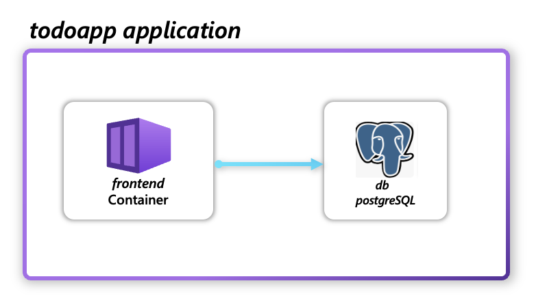

# Topic: CLI commands for User-Defined-Type definitions

* **Author**: Reshma Abdul Rahim (reshrahim)

## Topic Summary
<!-- A paragraph or two to summarize the topic area. Just define it in summary form so we all know what it is. -->
User-Defined Types enable Platform engineers to define and deploy their organization's custom services in Radius. More details around the feature, user scenarios and experience can be found [here](/architecture/2024-06-resource-extensibility-feature-spec.md). This document will focus on the user experience for creating and deploying a user defined type in Radius. 

### Top level goals
<!-- At the most basic level, what are we trying to accomplish? -->
- Enable a simple and intuitive experience for platform engineers to define the schema for their User-Defined-Type with low concept count and minimal learning curve
- Ensure that the schema definitions are authored in a unified, consistent and standard format across all resource types
- Ensure that users receive transparent and detailed error messages when the schema definition is incorrect or when there are breaking changes in the schema definition.

### Non-goals (out of scope)
<!-- What are we explicitly not trying to accomplish? -->
Below goals are out of scope for the first iteration but might be considered in future iterations based on user feedback:

- Other interfaces and experiences to interact with user defined resource type definitions and resources are out of scope for this document
- Defining child resources or nested resources in the schema definition
- Adding new resource methods or operations to the resource type
- Providing a full-fledged TypeSpec tooling experience for authoring the schema definition with autocompletion, error validation at development time.
- Providing solutions to handle breaking changes on API versions of the resource type

### Key scenarios
<!-- List ~3-7 high level scenarios to clarify the value and point to how we will decompose this big area into component capabilities. We may ultimately have more than one level of scenario. -->
The key scenarios for UDTs are outlined [here](/architecture/2024-06-resource-extensibility-feature-spec.md). 

### User Experience

Below is an illustrative example of how a user would define and deploy the demo todoapp with a user defined PostgreSQL resource type. 



Pre-requisites: Radius is installed in a Kubernetes cluster and the user has the Radius CLI installed.

1. Author the resource-type schema definition for the PostgreSQL database in a `postgresql.yaml` file. Note this schema definition is illustrative and may not be the final schema definition. 

    postgreSQL.yaml

    ```yaml
        ---
        name: MyCompany.Resources
        types:
        postgreSQLDatabase:
            apiVersions:
            '2025-01-01-preview':
                schema: 
                type: object
                properties:
                    size:
                    type: string
                    description: The size of database to provision
                    enum:
                    - S
                    - M
                    - L
                    - XL
                required:
                - size
            capabilities: ["SupportsRecipes"]

1. User creates the resource type for the PostgreSQL database using the CLI

    ```bash
    rad resource-type create postgreSQLDatabase -f postgreSQL.yaml
    ```
    The resource type `MyCompany.Resources/postgreSQLDatabase` is created in Radius.

1. User creates a Recipe for the postgreSQLDatabase resource type

    postgreSQL.bicep

    ```bicep
    @description('Information about what resource is calling this Recipe. Generated by Radius. For more information visit https://docs.radapp.dev/operations/custom-recipes/')
    param context object

    @size('The size of the postgreSQL. Valid values ('S', 'M', 'L', 'XL')')
    param size = context.resource.properties.size

    extension kubernetes with {
    kubeConfig: ''
    namespace: context.runtime.kubernetes.namespace
    } as kubernetes

    var uniqueName = 'postgres-${uniqueString(context.resource.id)}'
    var port = 5432

    resource postgresql 'apps/Deployment@v1' = {
    ..
    }

    resource svc 'core/Service@v1' = {
    ..
    }

    output result object = {
    resources: [
    ..
    ]
    values: {
        host: '${svc.metadata.name}.${svc.metadata.namespace}.svc.cluster.local'
        port: port
        database: database
        username: user
    }
    ```
    
1. User publishes the postgreSQL Recipe to a registry

    ```bash
    rad bicep publish --file postgreSQL.bicep --target br:ghcr.io/mycompany/recipes/postgreSQL:1.1.0
    ```
    The Recipe for the postgreSQLDatabase is published to the registry 

1. User registers the postgreSQL Recipe to an environment in Radius

    ```bash
    rad recipe register postgreSQL --env myenv --resource-type MyCompany.Resources/postgreSQLDatabase --template-path ghcr.io/mycompany/recipes/postgreSQL:1.1.0
    ```
    The Recipe for the postgreSQLDatabase resource type is registered to the environment `myenv` in Radius.

1. User generates a bicep extension for the postgreSQLDatabase resource type

    ```bash
    rad bicep publish-extension mycompany -f postgreSQL.yaml
    ```
    The bicep extension `mycomoany` for the postgreSQLDatabase resource type is generated and published thus enabling the user to author the postgreSQLDatabase resource type in Bicep.

1. User authors the todoapp application with the postgreSQLDatabase resource type

    todoapp.bicep

    ```bicep
    extension radius
    extension mycompany

    resource  'Applications.Core/containers@2023-10-01-preview' = {
        name: 'demo'
        properties: {
            container: {
                image: 'ghcr.io/radius-project/samples/demo:latest'
                ports: {
                    web: {
                    containerPort: 3000
                    }
                }
                env: {
                    DB_HOST: 'db.properties.host'
                    DB_USERNAME: 'db.properties.username'
                }
            }
        }
    }

    resource db 'Mycompany.resources/postgreSQLdatabase@2025-01-01-preview' = {
        name: 'postgresdb'
        properties: {
           size: 'M' 
        }
    }

1. User deploys the todoapp application with the postgreSQLDatabase resource type

    ```bash
    rad run todoapp.bicep
    ```
    The todoapp application is deployed with the postgreSQLDatabase resource type in Radius.


