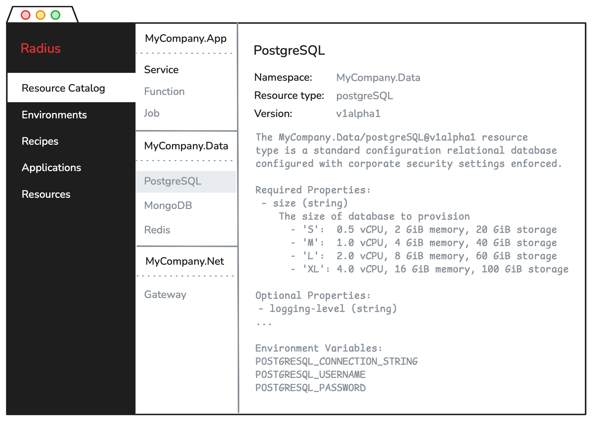

# User-Defined Resource Types Feature Spec

[@zachcasper](https://github.com/zachcasper), [@reshrahim](https://github.com/reshrahim)

## Summary

Radius is a core component of internal developer platforms for organizations building cloud-native applications. It enables developers to model their application using resource types defined within Radius and enables platform engineers to control the deployment of these resources within the environment they specify. Today, Radius includes core resource types such as containers, gateways, secrets, and volumes as well as portable resource types such as MongoDB and Redis. Core resource types are considered foundational and cannot be customized. Radius can be customized by platform engineers by exposing parameters on portable resource types or allowing developers to use the `Applications.Core/extenders` resource type. 

However, these customization methods are insufficient for a mature internal developer platform within a sophisticated organization. For platform engineers to adopt Radius, the set of resource types must be extensible. A pre-defined set of resources is not sufficient.

Platform engineers require the ability to:

* Offer a catalog of resource types which fit the organization's structure, workflows, and policies 
* Define and enforce a contract between developers and the internal developer platform
* Abstract developers from the underlying infrastructure
* Reuse their existing investment in their infrastructure as code (IaC) solution, overwhelmingly Terraform

This document details the requirements and user experience for user-defined resource types for Radius. User-defined resource types empower platform engineers to extend Radius to meet their organization's unique requirements and enable their developers to model their applications using organization-specific resource types while supporting all the capabilities of Radius. 

> [!NOTE]
>
> This document uses the term user-defined resource type to avoid confusion. It does not use the abbreviation UDT because there already exists user-defined types in Bicep. In the Radius documentation, user-defined resource types will be simply referred to as Radius resource types.

### **Vision** 

The vision for user-defined resource types is to significantly expand the set of resource types available to developers and platform engineers by democratizing the creation of new resource types. User-defined resource types will:

* Make the creation of new resource types easy to accomplish by platform engineers
* Make it easy to distribute new resource types to internal developers including configuring developer tools to use the organization's resource types
* Optimize the developer experience by integrating with popular developer portals and IDEs and enabling platform engineers to annotate resource types with documentation, examples, and point of contact details
* Enable the Radius project to accelerate the number of resource types shipped as part of the project by eliminating the need to make code changes in order to ship a new resource type
* Enable the Radius community to share user-defined resource types and associated recipes amongst other Radius users and ease the discover of new resource types from outside the user's organization

With these capabilities, not only will there be a wide selection of resource types available directly from the Radius project, but additional types from other sources. Ultimately, the vision is for platform teams across organizations, other open-source projects, independent software vendors (ISVs), and, other cloud service providers to share their own resource types.

These new resource types can be: 

* Commonly used application components which do not currently ship with Radius, such as PostgreSQL
* Application components which have higher levels of abstraction such as a microservice, function, or job
* Application components which are composed of multiple resources such as a HTTPS proxy or sidecar container
* Entire deployments of commercial software solutions
* Cloud-provider specific services which use recipes to provision

## Goals

- Enable platform engineers to define user-defined resource types to meet their organization's unique requirements 
- Enable Radius community developers to extend Radius resource types independently of the core project 
- Enable platform engineers and Radius community developers to share their user-defined resource types and associated recipes 
- Enable developers to use and integrate user-defined resource types into their applications seamlessly
- Enable specifying user-defined resource types with minimal configuration overhead 
- Support all core Radius functionality with user-defined resources 

## Non-Goals (out of scope)

* Modifying, versioning, and deprecation of resource types
* Deployment of updates to resources
* Radius-maintained and tested sample repository 

## About this Document

This document is structured around a series of user stories ordered sequentially to describe an end-to-end user journey. Each user story is described with detailed examples. The examples are used to convey the user experience and technical detail. While attention has been paid to technical accuracy such as syntax and structure, expressiveness is prioritized over accuracy. The syntax and structure is expected to change during implementation.

At the conclusion of the user stories, the Feature Summary section lists specific features which are required to fulfill the described user story. These features are an initial decomposition of work derived from the user stories. The features are stack ranked in order of priority resulting in a roadmap of features for user-defined resource types. Therefore, the reader is encouraged to reference the Feature Summary when questioning the priority of a user story—low priority user stories are described side by side with higher priority ones. 

## Definition of Terms

**Resource** – An abstraction representing an application, application component, cloud resource, or Radius configuration item

**Resource type** – The type for a resource which includes the name, namespace, and set of properties

**Resource type definition** – A structured description of a resource type including its namespace, name, API version, and OpenAPI-based schema

**Resource provider** – A service with an associated API which manages the lifecycle of resources. Users will be familiar with Azure resource providers and Terraform providers which provide services. Today, Radius ships with the `Application.Core` resource provider which manages the creation and deletion of core resource types locally, in Azure, and in AWS. Now that Radius has user-defined resource types, the resource provider concept becomes confusing as it's the recipes which consume resource providers. Resource providers will remain in the implementation of Radius but not in the UI.

**Recipe** – A Terraform configuration or Bicep template which manages the lifecycle of a resource within a cloud environment using resource providers from service providers

**Core resource types** – Foundational resource types which Radius has built-in logic for creating and deleting and which other resource types can be built upon; includes application, container, gateway, secrets, and volumes; the `Application.Core` resource provider manages these resource types

**Portable resource types** – Resource types which are pre-defined in Radius but rely on recipes to be deployed

**User-defined resource types** – A custom resource with a name, namespace, and an OpenAPI schema

**Resource type catalog** – The entire collection of user-defined resource types in a Radius tenant; may include multiple namespaces and resource types

**Resource type namespace** – A logical grouping of resource types; resource type names are unique within a namespace

**Create** – A Radius API action where a resource gets created in the Radius tenant; i.e. the contents of the request payload is copied into the control plane; e.g., resource types are created

**Register** – A Radius API action where a the <u>location</u> of a resource is created in the Radius tenant; i.e. a pointer to a resource is created; e.g. recipes are registered

## User Personas

**Platform Engineers** – Platform engineers are responsible for building and maintaining the internal developer platform used by application developers within their organization. This developer platform provides the tooling and services which enables developers to build applications in a self-service manner using standardized practices within the organization. These practices include the consistent use of cloud services, continuous integration and testing, enforcement of security and operational best practices, accurate cost attribution, and other capabilities. In addition to enforcing these best practices, the developer platform performs also perform automated deployments to local and shared non-production environments (continuous delivery). 

**Application Developers** – Application developers, or simply developers, are responsible for building applications within their organization. They are responsible for technical design, implementation, and test cases. Developers typically build, run, and test their applications on a local development workstation then deploy the application to a cloud-based environment. Some organizations provide a cloud environment for individual developers, while others require developers to commit their code to a source code repository; after which the developer platform's continuous delivery capability will deploy to the cloud environment. 

**System Reliability Engineers (SREs) and Operators** – SRE and operators are responsible for managing the infrastructure and ensuring that the applications are running smoothly. They are responsible for maintaining the infrastructure and providing support for the infrastructure.  

**Security Engineer** – Security engineers are responsible for identifying and remediating security vulnerabilities within an organization's applications and infrastructure. When a vulnerability is identified, they need tools and processes to identify which software components need to be updated and the ability to quickly apply those updates across their non-production and production environments. 

**Open-Source Contributors** – A wide variety of organizations and personas may collaborate with other Radius contributors by building, testing, and providing feedback on user-defined resource types and their associated recipes. This includes platform engineers and developers discussed above, but also other open-source projects, system integrators, IT operations service providers, ISVs, and other cloud service providers. 

## Scenario 1 – Defining resource types

### User Story 1 – Creating a resource type

As a platform engineer, I need to create a resource type in Radius. I want to define typed properties for my developers to use in their application definitions and include documentation and examples.

**Summary**

The platform engineer will create a resource type in their Radius tenant using the CLI. The resource type will have a namespace and an OpenAPI schema. 

> [!NOTE]
>
> A previous version of this document proposed defining resource types using Bicep. After the initial launch of user-defined resource types, this proposal has been withdrawn for the following reasons:
>
> * The previous proposal mixed interface and implementation. By using YAML and TypeSpec we maintain that separation. The only implementation will by via recipes.
> * A primary driver of Bicep was the need to define composite resource types (e.g., a web service with a reverse proxy, application container, and sidecar, or a database with a secret). The previous proposal used Bicep to define a resource type which had a schema as well as child resources (not just child resource types). We learned that recipes was a more appropriate place to define these composite resource types because recipes can, not only use resources from traditional resource providers like Azure services, but can also use Radius resource types.
> * We have already prototyped the ability to use Radius resource types in a Terraform recipe via a new Radius provider for Terraform.
> * There is a need to support TypeSpec for resource type definition. Implementing user-defined resource types in Bicep complicates this objective because it introduces the ability to build functionality into the type definition rather than into the recipe. By modeling user-defined resource types only in YAML and TypeSpec, there is a clear separation of interface and implementation.
> * Long-term, we envision Radius being polyglot rather than purely Bicep. Not only will Radius support multiple IaC solutions, but could also have language specific SDKs for developers. Imagine a cloud development kit with support for Python, Java, Node, etc. which was built on resource types defined by the platform engineer.
> * YAML has already been implemented and is getting positive feedback from early users.
>
> The original proposal for Bicep was based on this user feedback:
>
> - **Child resources.** Users want to embed core resources such as containers and secrets in a UDT wrapping these core resources behind a custom schema. They also want to embed a UDT within a UDT. For example, one user wanted to model a web service which has a proxy such as NGINX, a container, and various sidecar containers. 
>   - Child resources are implemented via recipes in this feature spec. Both Bicep and Terraform (with enhancements proposed in this spec) recipes can build deployments composed of Radius and non-Radius resource types. Therefore, YAML format is simpler.
>
> - **Conditional resources.** Building on child resources, provisioning resources based on the value of developer-specified properties was a use case identified. In the web service example, they want to have a single web service resource type which has a boolean specifying whether an ingress gateway is provisioned or not. (More concretely, a boolean to control whether the Kubernetes service is of type cluster IP or load balancer.) 
>   - This feature spec demonstrates how to do conditional resources via recipes.
>
> - **Data manipulation and validation functions**. For example, one user wanted to be able to concatenate two properties which gets passed to the recipe. They need data validation functions with property specific error messages when validation does not pass. Regular expressions were proposed but their feedback was regex may be too complex. 
>   - One advantage of Bicep-based resource type definitions was bringing the data validation earlier in the deployment. This type of validation is still possible in a Bicep and Terraform recipe.

**User Experience 1 – Using YAML** 

```bash
# Create the resource type
rad resource-type create --from-file postgreSQL-resource-type.yaml
Creating resource type Radius.Resources/postgreSQL
The resource type Radius.Resources/postgreSQL has been created
```

> [!NOTE]
>
> This document uses `Radius.Resources` for the namespace for resource types and the documentation will instruct uses to use the same. In previous examples, you may see `MyCompany.App` or `MyCompany.Resources`. While that it still possible, having uses use `Radius.Resources` simplifies the experience and there is no benefit to using the company name.

**`postgreSQL-resource-type.yaml`**:

```yaml
namespace: Radius.Resources
types:
  postgreSQL:
    apiVersions:
      '2025-05-05':
        schema: 
          type: object
          properties:
            # Required property
            environment:
              type: string
            application:
              type: string
            database:
              type: string
            # Enum property
            size:
              type: string
              enum:
              - S
              - M
              - L
              - XL
            # Read only property
            host:
              type: string
              readOnly: true
            # Integer property
            port:
              type: integer
              readOnly: true
            # Nested property
            credentials:
              type: object
              properties:
              username:
                type: string
                readOnly: true
              password:
                type: string
                readOnly: true
            required:
            - environment
            - database
```

**User Experience 2 – Using TypeSpec** 

```bash
# Create the resource type
rad resource-type create --from-file postgreSQL-resource-type.tsp
Creating resource type Radius.Resources/postgreSQL
The resource type Radius.Resources/postgreSQL has been created
```

**`postgreSQL-resource-type.tsp`** (converted via CoPilot):

```yaml
@versioned("2025-05-05")
model PostgreSQL {
  environment: string;
  application?: string;
  database: string;
  size?: "S" | "M" | "L" | "XL";
  @readonly
  host: string;
  @readonly
  port: int32;
  @readonly
  credentials: {
    @readonly
    username: string;
    @readonly
    password: string;
  };
}
```
**Result** 

1. The postgreSQL resource type is created or updated

**Exceptions**

The operation fails and informs the user interactively if:

1. The API is not in conformance with the OpenAPI v3.1 specification
2. The user does not have permission to perform the create action on `System.Resources/resourceProviders`

This example demonstrates several features:

* Required properties using the `required` property
* Read only properties which are set by the recipe denoted with `readOnly: true`
* String and integer types; Radius also needs to support arrays
* Enumerations as shown in the `size` property
* Nested properties as demonstrated with the credentials property

> [!NOTE]
>
> Today's implementation is very resource provider-centric. The behavior of `rad resource-type create` for example is different dependent upon if the resource provider exists or not and users are notified about resource providers being created. Since users are defining types and not providers, they have no concept of what a resource provider is. The implementation will change to remove resource providers from the user experience.

> [!CAUTION]
>
> Today, Radius enforces the ARM naming standards. This includes enforcing that:
>
> * Resource namespaces are two PascalCased segments separated by period and without a hyphen
> * Resource type names are camelCased without a hyphen
> * Resource properties are camelCased without a hyphen
>
> However, Kubernetes and most cloud-native projects follow [RFC 1123](https://tools.ietf.org/html/rfc1123) or [RFC 1035](https://tools.ietf.org/html/rfc1035) for object naming which enforce:
>
> * contain at most 63 characters
> * contain only lowercase alphanumeric characters or '-'
> * start with an alphabetic character
> * end with an alphanumeric character
>
> Complicating enforcing a naming convention is that Terraform uses an underscore for resource and variable names (e.g., `resource "aws_instance"` and `variable "web_instance_count"`).
>
> Given Radius is cloud provider-agnostic, the current restriction will be removed and replaced with RFC 1035. Underscores will not be allowed as it is common practice for Terraform users to substitute underscores for hyphens.
>
> However, all examples in the documentation will conform to the more restrictive ARM standard to encourage consistency.

> [!CAUTION]
>
> Today, Radius enforces the ARM API versioning standard. From the [source code](https://github.com/radius-project/radius/blob/main/pkg/cli/manifest/validation.go#L33) `An API version must be a date in YYYY-MM-DD format, and may optionally have the suffix '-preview'. Example: 2025-01-01"`. However, Kubernetes and most cloud-native project follow a [different versioning scheme](https://kubernetes.io/docs/reference/using-api/). The [Terraform versioning scheme](https://developer.hashicorp.com/terraform/plugin/best-practices/versioning) is similar to Kubernetes. Because Radius is cloud provider-agnostic, Radius will not enforce a specific API versioning scheme on the user.
>
>  However, all examples in the documentation will continue to use the date schema used today.
>
> In the fullness of time, Radius needs to support a semantic versioning scheme rather than only specific API versions.

### User Story 2 – Conditionally requiring properties

As a platform engineer, as I am authoring a resource type, I need to define properties which are required only if another property matches a value.

**Summary**

When creating the resource type, the platform engineer can add an `if`, `then`, `else` properties which are supported in the OpenAPI 3.1 JSON Schema specification. In the example below, the developer must specify the `fullyQualifiedHostname` only when `ingress` is true.

**`webservice-resource-type.yaml`**:

```diff
namespace: Radius.Resources
types:
  webService:
    apiVersions:
      '2025-05-05':
        schema: 
          type: object
          properties:
            ingress:
              type: boolean
              description: "Optional: When true, provisions an L7 ingress gateway mapped to the port named http"
            hostname:
              type: string
              description: "Required when ingress is true: Set the hostname for the service"
            container:
              ...
          required:
          - environment
          - container
+          if:
+            properties:
+              ingress:
+                const: true
+          then:
+            required: hostname
```

### User Story 3 – Providing developer documentation 

As a platform engineer, I need to annotate my new resource type with documentation for the developer. My organization has a variety of data fields which may change based on the team and over time.

**Summary**

When creating the resource type, the platform engineer can annotate the resource type to include developer documentation.

**`postgreSQL-resource-type.yaml`**:

```diff
namespace: Radius.Resources
types:
  postgreSQL:
+    description: |
+      The Radius.Resources/postgreSQL resource type
+      is a standard configuration relational database configured with 
+      corporate security settings enforced. 
+
+      Example:
+      ...
+    
+      Owner:
+      author-platform-engineer@mycompany.com
+    
+      Change Log:
+      ...
    apiVersions:
      '2025-05-05':
        schema: 
          type: object
          properties:
            environment:
              type: string
+              description: "Required: The ID of the Radius environment; typically set by the rad CLI"
            application:
              type: string
+              description: "Optional: The ID of the Radius application which the resource is associated with"
            database:
              type: string
+              description: "Required: The name of the database"
            size:
              type: string
+              description: |
+                Optional: The size of database to provision; defaults to 'S' if not specified
+                  - 'S': 0.5 vCPU, 2 GiB memory, 20 GiB storage
+                  - 'M': 1. vCPU, 4 GiB memory, 40 GiB storage
+                  - 'L': 2.0 vCPU, 8 GiB memory, 60 GiB storage
+                  - 'XL': 4.0 vCPU, 16 GiB memory, 100 GiB storage
              enum:
              - S
              - M
              - L
              - XL
            host:
              type: string
+              description: "Read only: Fully qualified host name of the database server"
              readOnly: true
            port:
              type: integer
+              description: "Read only: The port number of the database server"
              readOnly: true
            credentials:
              type: object
              properties:
              username:
                type: string
+                description: "Read only: The username for the database"
                readOnly: true
              password:
                type: string
+                description: "Read only: The password for the database"
                readOnly: true
            required:
            - environment
            - database
```

> [!NOTE]
>
> During implementation, the description property on the resource type should be large enough to have at least one page of documentation. Properties can be smaller.

**User Experience 1 – Command Line**


The developer can:

```bash
# List all resource types
rad resource-type list
NAMESPACE                RESOURCE TYPE
Applications.Core        containers
Applications.Core        gateways
...
Radius.Resources         webService
Radius.Resources         postgreSQL
```

```bash
# List all resource types filtering by namespace
rad resource-type list --namespace Radius.Resources
NAMESPACE                RESOURCE TYPE
Radius.Resources         webService
Radius.Resources         postgreSQL
```

```bash
# Show details of a resource type
rad resource-type show Radius.Resources/postgreSQL
NAMESPACE                Radius.Resources
RESOURCE TYPE            postgreSQL
DEFAULT VERSION          2025-05-05

DESCRIPTION
  The Radius.Resources/postgreSQL resource type
  is a standard configuration relational database configured with 
  corporate security settings enforced.
  
  Example:
  ...

  Owner:
  author-platform-engineer@mycompany.com
     
  Change Log:
  ...

REQUIRED PROPERTIES
  - environment (id) The ID of the Radius environment; typically set by the rad CLI
  - database (string) The name of the database
  
OPTIONAL PROPERTIES  
  - application (string) The ID of the Radius application which the resource is associated with
  - size (enum) The size of database to provision
      - 'S': 0.5 vCPU, 2 GiB memory, 20 GiB storage
      - 'M': 1. vCPU, 4 GiB memory, 40 GiB storage
      - 'L': 2.0 vCPU, 8 GiB memory, 60 GiB storage
      - 'XL': 4.0 vCPU, 16 GiB memory, 100 GiB storage

READ-ONLY PROPERTIES
  - host (string) Fully qualified host name of the database server
  - port (integer) The port number of the database server
  - credentials.username (string) The username for the database
  - credentials.password (string) The password for the database user

CONNECTED CONTAINER ENVIRONMENT VARIABLES
  - POSTGRESQL_HOSTNAME (host)
  - POSTGRESQL_PORT (port)
  - POSTGRESQL_USERNAME (credentials.username)
  - POSTGRESQL_PASSWORD (credentials.password)
```

**User Experience 2 – Radius Dashboard**

The developer can browse the resource catalog via the Radius dashboard. Resources are organized by namespace.



### User Story 4 – Configuring developer workstations

As a platform engineer, I need to configure my developer's workstations and keep them up to date with the latest resource types.

**Summary**

This user story addresses configuring the Radius client with resource types configured in a shared Radius environment. Packaging a standalone Radius installation pre-configured with resource types is out of scope for this document.

Several technical requirements are needed to configure a developer workstation to use resource types defined in a shared Radius environment:

1. A Kubernetes context set to the host Kubernetes cluster
2. A Radius workspace set to the Kubernetes context, Radius group, and Radius environment
3. A Bicep extension for the organization's resource types created and stored in a shared location
4. A bicepconfig.json file with the organization's Bicep extension

Creating the Bicep extension, distributing it to workstations, and updating the bicepconfig.json is challenging. Bicep only supports storing Bicep extensions in Azure Container Registry and the file system. Azure Container Registry is not sufficient because not all Radius users use Azure Container Registry. Today, that process looks like this:

1. Create the resource type in Radius via `rad resource-type create`
2. Create the Bicep extension and store it in Azure Container Registry via `rad bicep publish-extension`
   * – or – 
     * Create the Bicep extension on the workstation and store in on the local file system
     * Update the local bicepconfig.json with the file location
   * – or –
     * Create the Bicep extension on the workstation and store in on a shared drive 
     * Update the local bicepconfig.json
3. Repeat this process for each new or modified resource type

**To Be User Experience**

When the platform engineer creates or modifies a resource type via `rad resource-type create` Radius will:

1. Compile a Bicep extension (this is performed first to catch compilation errors early)
2. Create or update the resource type in Radius
3. Store the Bicep extension within the Radius control plane which has the appropriate enhancements to support Bicep extensions

When the resource type is deleted, the associated Bicep extension is deleted as well.

When the developer executes rad CLI commands Radius will:

* `rad workspace create` – Creating a new workspace will create a bicepconfig.json in the working directory which has a reference to each Radius-hosted Bicep extension (if bicepconfig.json exists in the working directory, update the file to ensure it has each of the Radius-hosted Bicep extensions)
* `rad workspace update` – This is a new command which will refresh the local configuration with the latest Bicep extensions
* `rad workspace switch`, `rad run`, or `rad deploy` – If the bicepconfig.json file is out of date relative to the Radius-hosted version, the command will fail and instruct the user to run `rad workspace update`.

## Scenario 2 – Authoring recipes 

### **User Story 5 – Composite resources** 

As a platform engineer, I need to define a resource type which is composed of many resources. Some of the embedded resources will be core Radius resources but others may be other resource types I have created.

**Summary**

The goal of user-defined resource types is to enable users and the broader Radius community to build a library of resource types which model cloud-native application components rather than cloud infrastructure resources. Some organizations will choose to model their resources with granular resource types such as containers and databases, while others will only offer abstracted resource types such as a microservice in their resource catalog. These abstract resource types will be composed of many resources just an an application is composed of many resources. 

A microservice, for example, could be composed of an application container, an in-memory cache, a reverse proxy, and a container security sidecar. In order to model the microservice resource type, the platform engineer needs the ability to specify a schema for the resource type, as well as the resources that compose the microservice. What makes this user story unique compared to those previously discussed is that the resources composing this microservice are other Radius resource types—not only infrastructure. 

**`webservice-resource-type.yaml`**:

```yaml
namespace: Radius.Resources
types:
  webService:
    apiVersions:
      '2025-05-05':
        schema: 
          type: object
          properties:
            ...
            container:
              type: object
              properties:
                image:
                  type: string
                  description: "Required: The container image"
                ports:
                  type: object
                  properties:
                    containerPort:
                      type: string
                      description: "Required: The port the container is listening on"
                    protocol:
                      type: string
                      description: "Optional: The protocol the container listening on; defaults to tcp"
                ...
`````

**User Experience 1 – Using  Terraform configuration**

**`/recipes/webservice/main.tf`**

```
terraform {
  required_providers {
    radius = {
      source  = "terraform.radapp.io"
      version = "~> 0.46"
    }
  }
}

variable "context" {
  description = "This variable contains Radius recipe context."
  type = any
}

resource "radius_applications_core_containers" "proxy" {
  name                = "proxy"
  environment         = var.context.environment.id
  application         = var.context.application
  container_image     = "envoy:latest"
}

resource "radius_applications_core_containers" "webServiceContainer" {
  name                = "${var.context.resource.name}-container"
  environment         = var.context.environment.id
  application         = var.context.application.id
  container_image     = var.context.resource.properties.container.image
  ...
}
```

**User Experience 2 – Using Bicep template**

The recipe for the service resource type will leverage Radius resource types.

**`webservice-recipe.bicep`**:

```yaml
extension radius

@description('Information about what resource is calling this Recipe. Generated by Radius.')
param context object

resource proxy 'Applications.Core/containers@2023-10-01-preview' = {
  name: 'proxy'
  properties: [
    environment: context.environment.id
    application: context.application.id
    container: {
      image: 'envoy:latest'
      ...
    },
  ]
}

resource webServiceContainer 'Applications.Core/containers@2023-10-01-preview' = {
  name: '${context.resource.name}-container'
  properties: {
    application: context.application.id
    container: context.resource.properties.container
    ...
  }
}
```

### **User Story 6 – Conditional resources** 

As a platform engineer, I need to write a recipe which creates additional resources dependent upon the properties set by the developer.

**Summary**

The platform engineer adds a boolean property to the `webservice` resource type from the previous user story.

**`webservice-resource-type.yaml`**:

```diff
namespace: Radius.Resources
types:
  webService:
    apiVersions:
      '2023-10-01-preview':
        schema: 
          type: object
          properties:
            ...
+            ingress:
+              type: boolean
+              description: "Optional: When true, provisions an L7 ingress gateway mapped to the port named http"
            container:
              type: object
              properties:
                image:
                  type: string
                  description: "Required: The container image"
                ...
```

**User Experience 1 – Using Terraform configuration**

**`/recipes/webservice/main.tf`**

```diff
terraform {
  required_providers {
    radius = {
      source  = "terraform.radapp.io"
      version = "~> 0.46"
    }
  }
}

variable "context" {
  description = "This variable contains Radius recipe context."
  type = any
}

+ if var.context.resource.properties.ingress {
+  resource "applications_core_gateways" "gateway" {
    name                = "gateway"
    environment         = var.context.environment.id
    application         = var.context.application
    routes = {
      path              = "/"
      destination       = "http://${local.webServiceContainer.name}:${context.resource.properties.container.ports.http.containerPort}'
    }     

  }
}

resource "applications_core_containers" "webServiceContainer" {
  name                = "${var.context.resource.name}-container"
  environment         = var.context.environment.id
  application         = var.context.application.id
  container_image     = context.resource.properties.container.image
  ...
}
```

**User Experience 2 – Using Bicep template**

The recipe will have a conditional on the ingress property to determine whether to deploy a gateway resource.

**`webservice-recipe.bicep`**:

```diff
extension radius

@description('Information about what resource is calling this Recipe. Generated by Radius.')
param context object

+resource gateway 'Applications.Core/gateways@2023-10-01-preview' = if (context.resource.properties.ingress) {
  name: 'gateway'
  properties: {
    application: context.application.id
    routes: [
      {
        path: '/'
        destination: 'http://${webServiceContainer.name}:${context.resource.properties.container.ports.http.containerPort}'
      }
    ]
  }
}

resource webServiceContainer 'Applications.Core/containers@2023-10-01-preview' = {
  name: '${context.resource.name}-container'
  properties: {
    application: context.application.id
    container: context.resource.properties.container
    ...
  }
}
```

### User Story 7 – Registering recipes

As a platform engineer, I need to register a recipe which implements my new resource type. 

**Summary**

Registering recipes works as expected just like existing portable resource types. However, since user-defined resource types introduces new capabilities, there are adjustments made to the recipe capabilities of Radius.

**User Experience**

```bash
# Register the PostgreSQL Terraform recipe in the myEnv environment
rad recipe register \
  --environment myEnv \
  --resource-type Radius.Resources/postgreSQL \
  --recipe-kind terraform \
  --recipe-path git://github.com/<username>/repo.git//recipes/postgreSQL
Registering recipe for Radius.Resources/postgreSQL
The recipe for Radius.Resources/postgreSQL is registered in the myEnv environment
```

There are two changes here:

**Retirement of named recipes** – Today, Radius supports named recipes. When deploying a portable resource type, developers can override the default recipe by specifying a recipe name in their application definition. This enables developers to punch through the separation of concerns between platform and developers. Based on strong user feedback, user-defined resource types will not implement the ability to punch through and use alternate recipes. 

Furthermore, once portable resource types are refactored into user-defined resource types, the ability to specify a recipe name will be retired. The command will change from `rad recipe register <recipeName>` to `rad recipe register`. This also has the benefit of not having to build developer documentation for discovering available recipes. 

**Rename of template-kind and template-path** – Radius is not opinionated about which infrastructure as code solution to use. Therefore, it is important that Radius is not biased towards one solution versus another. The parameter `--template-kind` and `--template-path` are biased towards Bicep as Bicep files are called templates and Terraform files are configurations. 

Given this, the `--template-kind` and `--template-path` arguments will be renamed `--recipe-kind` and `--recipe-path`. The previous commands will be retained for backwards compatibility.

## Scenario 3 – Using resource types

### User Story 8 – Injecting environment variables

As a developer, I need to read properties for resources in my application definition and set environment variables for my container. For example, when I create a database resource, I need to set an environment variable in my container which gives my application the connection string.

**User Experience 1 – Set manually by the developer**

The develop can manually inject environment variables into the container using Bicep. 

> [!NOTE]
>
> This functionality exists today. There are no changes. It is included here for context with the other examples.

**`myApp.bicep`**:

```diff
extension radius
extension radiusResources

resource myApp 'Applications.Core/applications@2023-10-01-preview' = {
  name: 'todolist'
  properties: {
    environment: environment
  }
}

resource frontend 'Applications.Core/containers@2023-10-01-preview' = {
  name: 'frontend'
  properties: {
    container: {
      image: 'frontend:latest'
      connections: {
      backend: {
        source: backend.id
      }
   }
}

resource backend 'Applications.Core/containers@2023-10-01-preview' = {
  name: 'backend'
  properties: {
    container: {
      image: 'backend:latest'
+      // Set environment variables in the container by referencing properties via Bicep
+      env: [
+        ORDERS_DB_CONNECTION_STRING: {
+          value: ordersDB.connectionString
+        },
+        ORDERS_DB_USERNAME: {
+          value: ordersDB.credentias.username
+        },
+        ORDERS_DB_PASSWORD: {
+          value: ordersDB.credentias.password
+        }
+      ]
   }
}

resource ordersDB 'Radius.Resources/postgreSQL@2025-05-05' = {
  name: 'ordersDB'
  properties: {
     size: 'M' 
  }
}
```

**Result**

The environment variables set specified by the developer are set in the container.

**User Experience 2 – Automatically injected by platform engineer** 

The platform engineer can specify default environment variables which will automatically be injected into a connected container when a connection is established. This is similar to existing functionality for portable resource types in Radius today (see the [Redis type](https://docs.radapp.io/reference/resource-schema/cache/redis/#environment-variables-for-connections) for example). Note that user experience 1 and 2 can be used side by side.

**`postgreSQL-resource-type.yaml`**:

```diff
namespace: Radius.Resources
types:
  postgreSQL:
    description: |
      ...
    apiVersions:
      '2025-05-05':
        schema: 
          type: object
          properties:
            ...
            host:
              type: string
              description: "Read only: Fully qualified host name of the database server"
              readOnly: true
+              connected-resource-environment-variable: POSTGRESQL_HOSTNAME
            port:
              type: integer
              description: "Read only: The port number of the database server"
              readOnly: true
+              connected-resource-environment-variable: POSTGRESQL_PORT
            credentials:
              type: object
              properties:
              username:
                type: string
                description: "Read only: The username for the database"
                readOnly: true
+                connected-resource-environment-variable: POSTGRESQL_USERNAME
              password:
                type: string
                description: "Read only: The password for the database"
                readOnly: true
+                connected-resource-environment-variable: POSTGRESQL_PASSWORD
            required:
            - environment
            - database
```

**Result**

When a developer creates a postgreSQL resource and a connection to that resource from a container, the environment variables are automatically set in the container. The `env` property does not need to be set on the container resource.

**`myApp.bicep`**:

```diff
extension radius
extension radiusResources

resource myApp 'Applications.Core/applications@2023-10-01-preview' = {
...
}

resource frontend 'Applications.Core/containers@2023-10-01-preview' = {
...
}

resource backend 'Applications.Core/containers@2023-10-01-preview' = {
  name: 'backend'
  properties: {
    container: {
      image: 'backend:latest'
-      // Set environment variables in the container by referencing properties via Bicep
-      env: [
-        ORDERS_DB_CONNECTION_STRING: {
-          value: ordersDB.connectionString
-        },
-        ORDERS_DB_USERNAME: {
-          value: ordersDB.credentias.username
-        },
-        ORDERS_DB_PASSWORD: {
-          value: ordersDB.credentias.password
-        }
-      ]
   }
}

resource ordersDB 'Radius.Resources/postgreSQL@2025-05-05' = {
...
}
```

### **User Story 9 – Modeling an external resource** 

As a platform engineer, I need to enable my developers to connect to already deployed resources outside of the environment. I need a method of publishing these external resources for my developers to connect their application to. 

**Summary**

Today, Radius restricts the ability to create resources which do not have an associated recipe in the target environment. If a resource is created in an environment without a recipe for that resource type, it will fail with an error stating that no recipe was found for the corresponding resource type. Not having a recipe for a resource type in an environment is how the platform engineer controls which resources can be deployed in which environment. 

However, to represent an external resource, Radius will support creating resource types which do not, and cannot, have a recipe registered to it. These recipe-less resource types are only resources within the Radius application graph—there is no deployed resource or other functionality associated with them aside from reading the properties such as reading the name, description, or connection string.

**User Experience** 

The platform engineer creates a resource type with `capabilities: ["manualResourceProvisioning"]`.

**`external-service-resource-type.yaml`**:

```yaml
namespace: Radius.Resources
types:
  externalService:
    description: |
      The external service resource type represents a resource which
      is not managed by Radius but appears in the application graph.
    capabilities: ["manualResourceProvisioning"]
    apiVersions:
      '2025-05-05':
        schema: 
          type: object
          properties:
            environment:
              type: string
              description: "Required: The Radius environment; typically set by the rad CLI"
            application:
              type: string
              description: "Optional: The application which the resource is associated with"
            connectionString:
              type: string
              description: "Required: The connection string to the external resource"
              connected-resource-environment-variable: EXTERNAL_SERVICE_CONNECTION_STRING
            # The recipe should store these in a secret
            credentials:
              type: object
              description: "Optional: Properties for storing authentication credentials"
              properties:
                type:
                  type: string
                  description: "Required: The type of authentication used"
                  enum:
                  - basic
                  - apiKey
                  - jwt
                basicUserName:
                  type: string
                  description: "Optional: The username used for basic HTTP authentication"
                basicPassword:
                  type: string
                  description: "Optional: The password used for basic HTTP authentication"
                apiKey:
                  type: string
                  description: "Optional: apiKey string"
                jwt:
                  type: string
                  description: "Optional: JSON web token"
              required:
              - type
          required:
          - environment
          - connectionString
          - credentials
```

The platform engineer, or environment manager, can then create a resource representing the external resource in the environment. For example, the platform engineer may create a resource representing a Twilio account.

**`production-environment.bicep`**

```yaml
extension radius

resource environment 'Applications.Core/environments@2023-10-01-preview' = {
  name: 'production'
  ...
}

resource twilio 'Radius.Resources/externalService@v1alpha1' = {
  name: 'twilio'
  properties: {
    environment: production
    connectionString: 'https://api.twilio.com/2010-04-01/Accounts/ACXXXXXXXXXXXXXXXXXXXXXXXXXXXXXXXX'
    credentials:
      username: 'twilio-prod-user'
      password: 'o84nouvTiHWiw97sbq6B'
}
```

Then the developer can connect to the Twilio resource in their application by using the `existing` keyword.

**`myApp.bicep`**:

```diff
extension radius
extension radiusResources

resource myApp 'Applications.Core/applications@2023-10-01-preview' = {
...
}

resource frontend 'Applications.Core/containers@2023-10-01-preview' = {
...
}

resource backend 'Applications.Core/containers@2023-10-01-preview' = {
  name: 'backend'
  properties: {
    container: {
      image: 'backend:latest'
      // Set environment variables in the container by referencing properties via Bicep
+      env: [
+        TWILIO_URL: {
+          value: twilio.properties.connectionString
+        },
+        TWILIO_API_KEY: {
+          value: twilio.properties.apiKey
+        }
+      ]
   }
}

resource ordersDB 'Radius.Resources/postgreSQL@2025-05-05' = {
...
}

+ // Existing resource in the resource group
+ resource twilio 'Radius.Resources/externalService@v1alpha1' = existing {
+   name: 'twilio'
+ }
```

### User Story 10 – Connections: Injecting Environment Variables into Application.Core/containers

As a developer, when I connect to an external resource, I expect environment variables that the platform engineer defined to be automatically injected into my container.

**Summary**

This user story is fulfilled by combining user story 8 and 9.  First the platform engineer adds environment variables to the resource type definition.

**`external-service-resource-type.yaml`**:

```diff
namespace: Radius.Resources
types:
  externalService:
    ...
            connectionString:
              type: string
              description: "Required: The connection string to the external resource"
+              connected-resource-environment-variable: EXTERNAL_SERVICE_CONNECTION_STRING
            credentials:
              type: object
              description: "Optional: Properties for storing authentication credentials"
              properties:
                ...
                basicUserName:
                  type: string
                  description: "Optional: The username used for basic HTTP authentication"
+                  connected-resource-environment-variable: EXTERNAL_SERVICE_BASIC_USERNAME
                basicPassword:
                  type: string
                  description: "Optional: The password used for basic HTTP authentication"
+                  connected-resource-environment-variable: EXTERNAL_SERVICE_BASIC_PASSWORD
                apiKey:
                  type: string
                  description: "Optional: apiKey string"
+                  connected-resource-environment-variable: EXTERNAL_SERVICE_API_KEY
                jwt:
                  type: string
                  description: "Optional: JSON web token"
+                  connected-resource-environment-variable: EXTERNAL_SERVICE_JWT
              ...
```

Then the developer can remove the manually added environment variables and add a connection block.

**`myApp.bicep`**:

```diff
extension radius
extension radiusResources

resource myApp 'Applications.Core/applications@2023-10-01-preview' = {
...
}

resource frontend 'Applications.Core/containers@2023-10-01-preview' = {
...
}

resource backend 'Applications.Core/containers@2023-10-01-preview' = {
  name: 'backend'
  properties: {
    container: {
      image: 'backend:latest'
+      // Connection automatically injects EXTERNAL_SERVICE_CONNECTION_STRING and EXTERNAL_SERVICE_API_KEY
+      connections: {
+        twilio:
+          source: twilio.id
+      }
-      // Set environment variables in the container by referencing properties via Bicep
-      env: [
-        TWILIO_URL: {
-          value: twilio.properties.connectionString
-        },
-        TWILIO_API_KEY: {
-          value: twilio.properties.apiKey
-        }
-      ]
   }
}

resource ordersDB 'Radius.Resources/postgreSQL@2025-05-05' = {
...
}

// Existing resource in the resource group
resource twilio 'Radius.Resources/externalService@v1alpha1' = existing {
  name: 'twilio'
}
```

### User Story 11 – Connections: Injecting Environment Variables into UDTs

As a developer, when I am using a webservice user-defined resource type to connect to an external resource, I expect environment variables that the platform engineer defined to be automatically injected into my container and the application graph to show all my resources.

**Summary**

The only different in this user story is that the developer is using a `Radius.Resources/webService` resource type instead of a `Applications.Core/containers`. 

The developer creates the application definition:

**`myApp.bicep`**:

```diff
extension radius
extension radiusResources

resource myApp 'Applications.Core/applications@2023-10-01-preview' = {
...
}

+ resource frontend 'Radius.Resources/webService@2025-05-05' = {
  name: 'frontend'
  properties: {
    container: {
      image: 'frontend:latest'
      connections: {
      backend: {
        source: backend.id
      }
+      ingress: true
   }
}
}

+resource backend 'Radius.Resources/webService@2025-05-05' = {
  name: 'backend'
  properties: {
    container: {
      image: 'backend:latest'
      // Connection automatically injects EXTERNAL_SERVICE_CONNECTION_STRING and EXTERNAL_SERVICE_API_KEY
      connections: {
        twilio:
          source: twilio.id
      }
   }
}

resource ordersDB 'Radius.Resources/postgreSQL@2025-05-05' = {
...
}

// Existing resource in the resource group
resource twilio 'Radius.Resources/externalService@v1alpha1' = existing {
  name: 'twilio'
}
```

Prior to this the platform engineer created the webService recipe which sets the properties on the container:

**Using Terraform configuration**

**`/recipes/webservice/main.tf`**

```diff
terraform {
  required_providers {
    radius = {
      source  = "terraform.radapp.io"
      version = "~> 0.46"
    }
  }
}

variable "context" {
  description = "This variable contains Radius recipe context."
  type = any
}

if var.context.resource.properties.ingress {
  resource "applications_core_gateways" "gateway" {
    name                = "gateway"
    environment         = var.context.environment.id
    application         = var.context.application
    routes = {
      path              = "/"
      destination       = "http://${local.webServiceContainer.name}:${context.resource.properties.container.ports.http.containerPort}'
    }     

  }
}

resource "applications_core_containers" "webServiceContainer" {
  name                = "${var.context.resource.name}-container"
  environment         = var.context.environment.id
  application         = var.context.application.id
  container_image     = var.context.resource.properties.container.image
+  connections         = var.context.resource.properties.connections
  ...
}
```

**Using Bicep template**

**`webservice-recipe.bicep`**

```diff
extension radius

@description('Information about what resource is calling this Recipe. Generated by Radius.')
param context object

resource gateway 'Applications.Core/gateways@2023-10-01-preview' = if (context.resource.properties.ingress) {
  name: 'gateway'
  properties: {
    application: context.application.id
    routes: [
      {
        path: '/'
        destination: 'http://${webServiceContainer.name}:${context.resource.properties.container.ports.http.containerPort}'
      }
    ]
  }
}

resource webServiceContainer 'Applications.Core/containers@2023-10-01-preview' = {
  name: '${context.resource.name}-container'
  properties: {
    application: context.application.id
    container: context.resource.properties.container
+    connections: context.resource.properties.connections
    ...
  }
}
```

### User Story 12 – Connections: Application Graph

As a developer, when I connect to an external resource, I can add a connection to the external resource and expect that to be visible in the application graph.

**User Experience**

After the developer adds a connection to the twilio resource, twilio appears in the application graph.

```bash
$ rad app graph -a myApp
Displaying application: myApp

Name: frontend (Radius.Resources/webService)
Connections:
  backend (Radius.Resources/webService) -> frontend
Resources:
  frontend-container (Applications.Core/containers)
  gateway (Applications.Core/gateways)

Name: backend (Radius.Resources/webService)
Connections:
  backend -> frontend (Radius.Resources/webService)
  ordersDB (Radius.Resources/postgreSQL) -> backend
  twilio (Radius.Resources/externalService) -> backend
Resources:
  backend-container (Applications.Core/containers)
  
Name: ordersDB (Radius.Resources/postgreSQL)
Connections:
  ordersDB -> backend (Radius.Resources/webService)
Resources:
  ordersDB-container (Applications.Core/containers)
```

## Other Changes

User-defined resource types introduces a wide range of new capabilities for Radius. So much so, that it replaces the functionality of several of today's features. Given that Radius is early in the adoption curve, it makes sense to remove or deprecate redundant functionality so as to encourage the use of user-defined resource types and minimize the amount of legacy code.

### Portable Resource Types

Radius ships today with core resource types (application, environment, container, gateway, secrets, and volumes) as well as a small library of portable resource types (SQL Server, MongoDB, Redis, RabbitMQ, and Dapr). The portable resource types will be removed from Radius builds and no longer shipped with Radius releases. Instead, these resource types will be implemented as user-defined resource types and published in a Radius-maintained samples repository. The getting started experience will be updated to demonstrate creating a resource type using these samples or `rad init` enhanced to offer the option of loading the samples. All associated functionality with portable resource types will be removed from Radius including manual resource provisioning. 

### Extenders

A core objective of Radius is to enforce a separation of concerns between developers and platform engineers. Today, Radius allows developers to punch through this wall by using `extenders` resource type. Given that user-defined resource types provide the same functionality, `extenders` will be removed from Radius. The release notes will point to documentation for using user-defined resource types.

**Alternatives Considered**

Prior to deciding to remove the `extender` resource type, we considered:

1. Marking the `extender` resource type as deprecated in the documentation and in the UI and remove it in a later release
2. Do nothing; platform engineers can use role definitions to restrict the ability to use the `extender` resource type

Both of these were excluded because user-defined resource types are the path forward and because no users are using the `extender` resource type in production today.

## **Feature Summary** 

This feature summary is an updated snapshot as of early May after the initial release of user-defined resource types.

| **Priority** | **Complexity** | **Feature** |
| ------------ | -------------- | ----------- |
| p0 | L | Connections: Container → UDT |
| p0 | M | Cleaned up schema, replace status.binding with readonly: true; auto set read-only properties from recipe |
| p0 | S | [Change `name` to `namespace` in resource type definition](https://github.com/radius-project/radius/issues/8664) |
| p0 | S | [Support API versions other than 2023-10-01-preview](https://github.com/radius-project/radius/issues/9357) |
| p1 | S | [Bulk resource type creation](https://github.com/radius-project/radius/issues/9158) |
| p1 | L | All resources created by recipe appear in app graph |
| p1 | XL | [Configure developer workstation with resource type extension](https://github.com/radius-project/roadmap/issues/66) |
| p1 | XL             | Radius provider for Terraform                                |
| p1           | L              | [Connections: UDT-->UDT](https://github.com/radius-project/roadmap/issues/63) |
| p1           | M              | [Developer documentation via CLI](https://github.com/radius-project/roadmap/issues/64) |
| p1           | S              | Enum value enforcement                                       |
| p1           | S              | Array types                                                  |
| p1           | S              | Property type enforcement                                    |
| p1           | S              | [Papercut: rad run and rad deploy returns inaccurate error message when deploying without a recipe for a UDT ](https://github.com/radius-project/radius/issues/9157) |
| p1           | S              | [Improve Error if Environment ID is not set in resource ](https://github.com/radius-project/radius/issues/8930) |
| p2           | M              | [Environment variable injection](https://github.com/radius-project/roadmap/issues/68) |
| p2           | L              | Developer documentation via dashboard                        |
| p2           | L              | Conditionally requiring properties                           |
| p2           | S              | [manualResourceProvisioning for resource types](https://github.com/radius-project/roadmap/issues/62) |
| p2           | S              | Remove resource provider from resource-type command          |
| p2           | S              | Rename --template-kind to --recipe-kind                      |
| p2           | XL             | Refactor of portable resource types                          |
| p2           | M              | Retirement of recipe names                                   |
| p2           | S              | [rad recipe register registers a Recipe for a resource-type that doesn't exist](https://github.com/radius-project/radius/issues/9164) |
| p3           | S              | [rad cli could use auto completion to make the commands more user friendly](https://github.com/radius-project/radius/issues/8667) |
| p3           | M              | Retirement of extenders                                      |
| p3           | L              | TypeSpec                                                     |

## Future Work

Two additional feature summaries are in development. All future work is not above the first application cut line above.

**Managing developer workstations**:

* **Export resource catalog** – As a platform engineer, I need to export my resource type catalog and publish the catalog to be used developers on their workstations. 
* **Import resource catalog** – As a developer with Radius already running, I need to load my organization’s resource type catalog on my local instance of Radius. My local Bicep configuration should be updated with the new resource types.
* **Bulk register recipes** – As a developer with Radius already running, I need to register recipes on my local instance of Radius for deploying my organization’s resource types locally. 
* **Installing Radius locally** – As a new developer, I need to install Radius on my workstation pre-configured with my organization's resource catalog and local development recipes. 

**Day 2 operations:**

* **Modifying metadata** – As a platform engineer, I need to update the developer documentation for a resource type. 

* **Modifying properties** – As a platform engineer, I need to modify an existing property on a resource type. I may want to change whether a property is required, add a value to an enum, or change the property type. 
* **Adding or deleting properties** – As a platform engineer, I need to add or delete a property on a resource type. 

- **Rolling out minor software updates to new resources** – As a platform engineer, I need newly created resources to use an updated software version. This is a a minor update and the developer should not have to concern themselves with this change. 
- **Rolling out minor software updates to existing resources** – As a platform engineer, I need a mechanism to update existing resources with a minor software update. Dependent upon the criticality of the application, for some applications I need to deploy updates without the developer’s involvement. For more critical applications, I will have the developer control when the update is applied. 
- **Rolling out a major update** – As a platform engineer, I need to roll out a major software update. Since it is a major update, I want developers to explicitly opt into the update so they can test their application. I want to use two different recipes for the current and the new version. 
- **Using an updated resource type** – As a developer, I need to read the release notes for an updated resource type and modify my application to use the new resource type version. 
- **Deprecating a resource type version** – As a platform engineer, I need to restrict the ability to create new resources using the previous resource type version. 
- **Creating SBOMs** – As a security engineer, I need to generate a software bill of materials for all Radius-managed resources. I need the version of all deployed components.

