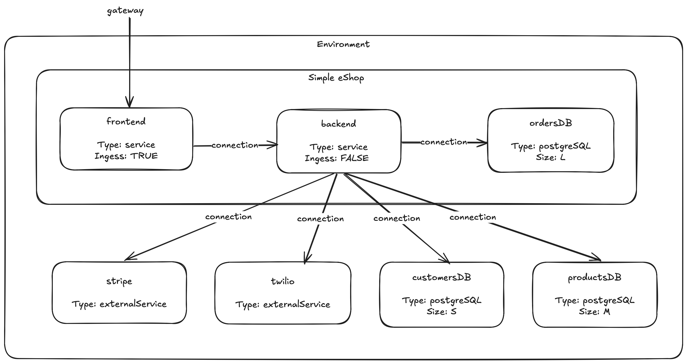
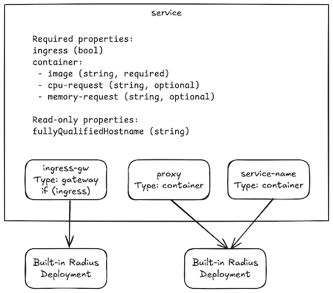
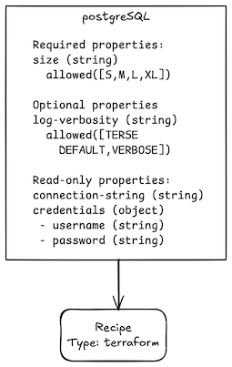
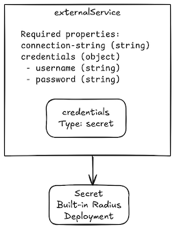

# User-Defined Resource Types Feature Spec

[@zachcasper](https://github.com/zachcasper), [@reshrahim](https://github.com/reshrahim)

## Summary

Radius is a core component of internal developer platforms for organizations building cloud-native applications. It enables developers to model their application using portable resource types pre-defined within Radius and enables platform engineers to control the deployment of these resources within the environment they specify. Today, Radius includes core resource types such as containers, gateways, secrets, and volumes as well as portable resource types such as MongoDB and Redis. Core resource types are considered foundational and cannot be customized. Radius can be customized by platform engineers by exposing parameters on portable resource types or allowing developers to use the `Applications.Core/extenders` resource type. However, these customization methods are insufficient for a mature developer platform within a sophisticated organization. 

This document details the requirements and user experience for user-defined resource types for Radius. User-defined resource types empower platform engineers to extend Radius to meet their organization's unique requirements and enable their developers to model their applications using organization-specific resource types while supporting all the capabilities of Radius. 

### **Vision** 

Our vision for user-defined resource types is to significantly expand the set of resource types available to developers and platform engineers. This will be accomplished by democratizing the creation of new resource types. User-defined resource types will: 

- Make the creation of new resource types easy to accomplish by a non-developer 
- Make it easy to share new resource types with internal developers and external platform engineers 
- Enable the discovery of new resource types across organizations and within the user community 
- Enable platform engineers to manage their user-defined resource types across environments as well as developer workstations

With these capabilities, not only will there be a wide selection of resource types available directly from the Radius project, but additional types from other teams within an organization, platform engineers from other organizations using Radius, other open-source projects, independent software vendors (ISVs), independent developers, and, aspirationally, from cloud service providers. 

These new resource types can be: 

- Commonly used application components which do not ship with Radius such as PostgreSQL
- Application components which have higher levels of abstraction such as a microservice, function, or job
- Application components which are composed of multiple resources such as a HTTPS proxy or sidecar container
- Entire deployments of commercial software solutions
- Cloud-provider specific services which use recipes to provision 

## Goals

- Enable platform engineers to define user-defined resource types to meet their organization's unique requirements 
- Enable Radius community developers to extend Radius resource types independently of the core project 
- Enable platform engineers and Radius community developers to share their user-defined resource types and associated recipes 
- Enable developers to use and integrate user-defined resource types into their applications seamlessly
- Enable specifying user-defined resource types with minimal configuration overhead 
- Support all core Radius functionality with user-defined resources 

## Non-Goals (out of scope)

* Configuring and keeping up to date Radius and Bicep tooling on developer workstations
* Modifying, versioning, and deprecation of resource types
* Deployment of updates to resources
* Radius-maintained and tested sample repository 

## About this Document

This document is the first of three feature specifications for user-defined resource types. This document covers the general user scenarios. Future documents will describe user scenarios for managing the developer workstations and all Day 2 scenarios. It is structured around a series of user stories ordered sequentially to describe an end-to-end user journey, or scenario. 

Each user story is described with detailed examples. The examples are used to convey the user experience and technical detail. While attention has been paid to technical accuracy such as syntax and structure, expressiveness is prioritized over accuracy. The syntax and structure is expected to change during implementation.

At the conclusion of the user stories, the Feature Summary section lists specific features which are required to fulfill the described user story. These features are an initial decomposition of work derived from the user stories. The features are stack ranked in order of priority resulting in a roadmap of features for user-defined resource types. Therefore, the reader is encouraged to reference the Feature Summary when questioning the priority of a user story—low priority user stories are described side by side with higher priority ones. 

## Definition of Terms

**Resource** – An abstraction representing an application, application component, cloud resource, or Radius configuration item

**Resource type** – The type for a resource which includes the name, namespace, and set of properties

**Resource type definition** – A structured description of a resource type including its namespace, name, API version, and OpenAPI-based schema

**Resource provider** – A service with an associated API which manages the lifecycle of resources. Today, Radius ships with the `Application.Core` resource provider which manages the creation and deletion of core resource types locally, in Azure, and in AWS. Now that Radius has user-defined resource types, the resource provider concept is less clear for users. Work should be performed to clarify and simplify what exactly a resource provider is and is not and what functions it performs. 

**Recipe** – A Terraform configuration or Bicep template which creates or deletes a resource type within an environment

**Core resource types** – Foundational resource types which Radius has built-in logic for creating and deleting and which other resource types can be built upon; includes application, container, gateway, secrets, and volumes; the `Application.Core` resource provider manages these resource types

**Portable resource types** – Resource types which are pre-defined in Radius but rely on recipes to be deployed

**User-defined resource types** – A custom resource with a name, namespace, and set of properties

**Resource type catalog** – The entire collection of user-defined resource types in a Radius tenant; may include multiple namespaces and resource types

**Resource type namespace** – A logical grouping of resource types; resource type names are unique within a namespace

**Recipe manifest** –  A file containing a collection of resource type to recipe mappings; the mapping includes the location (but not the contents) of the Terraform configuration or Bicep template

**Create** – A Radius API action where a resource gets created in the Radius tenant; i.e. the contents of the request payload is copied into the control plane; e.g., resource types are created

**Register** – A Radius API action where a the <u>location</u> of a resource is created in the Radius tenant; i.e. a pointer to a resource is created; e.g. recipes are registered

## User Personas

**Platform Engineers** – Platform engineers are responsible for building and maintaining the internal developer platform used by application developers within their organization. This developer platform provides the tooling and services which enables developers to build applications in a self-service manner using standardized practices within the organization. These practices include the consistent use of cloud services, continuous integration and testing, enforcement of security and operational best practices, accurate cost attribution, and other capabilities. In addition to enforcing these best practices, the developer platform performs also perform automated deployments to local and shared non-production environments (continuous delivery). 

**Application Developers** – Application developers, or simply developers, are responsible for building applications within their organization. They are responsible for technical design, implementation, and test cases. Developers typically build, run, and test their applications on a local development workstation then deploy the application to a cloud-based environment. Some organizations provide a cloud environment for individual developers, while others require developers to commit their code to a source code repository; after which the developer platform's continuous delivery capability will deploy to the cloud environment. 

**System Reliability Engineers (SREs) and Operators** – SRE and operators are responsible for managing the infrastructure and ensuring that the applications are running smoothly. They are responsible for maintaining the infrastructure and providing support for the infrastructure.  

**Security Engineer** – Security engineers are responsible for identifying and remediating security vulnerabilities within an organization's applications and infrastructure. When a vulnerability is identified, they need tools and processes to identify which software components need to be updated and the ability to quickly apply those updates across their non-production and production environments. 

**Open-Source Contributors** – A wide variety of organizations and personas may collaborate with other Radius contributors by building, testing, and providing feedback on user-defined resource types and their associated recipes. This includes platform engineers and developers discussed above, but also other open-source projects, system integrators, IT operations service providers, ISVs, and other cloud service providers. 

## Scenario 1 – Using Resource Types

### User Story 1 – Creating a basic resource type

As a platform engineer, I need to create a resource type in Radius. I want to define typed properties for my developers to use in their application definitions and include documentation and examples.

**Summary**

The platform engineer will create a resource type in their Radius tenant using the CLI. A basic resource type is a simple OpenAPI schema. More advanced uses such as modeling composite resource types are discussed in future use stories. 

The initial technical design for resource types used YAML. OpenAPI schemas are typically modeled using YAML, JSON, or TypeSpec and users in the cloud-native space are comfortable with YAML. However, after evaluating more advanced use cases and discussing with users, YAML was determined to be too limiting and only works for basic use cases. Bicep was chosen because it is already used throughout Radius, had features such as string manipulation functions, and built-in support for advanced use cases such as child resources. 

There was early concern about requiring platform engineers to use Bicep given their familiarity is centered on traditional infrastructure as code solutions, namely Terraform. However, feedback from users was that they would prefer to use Bicep because of the additional capabilities it provides, the limitations of using YAML for complex resource types, and the overall ease of use of Bicep.

> [!NOTE]
>
> Since YAML has already been implemented, the initial release of user-defined resource types may continue use YAML if that eases the implementation. However, the format should change to Bicep very quickly and support for YAML removed. Radius will only support one file format. This change is reflected in the feature summary at the bottom of this document. 

--—

**User Experience** 

```bash
# Create the resource type
rad resource-type create --from-file postgreSQL-resource-type.bicep
Creating resource type MyCompany.Data/postgreSQL
The resource type MyCompany.Data/postgreSQL has been created
```

**`postgreSQL-resource-type.bicep`**:

```yaml
extension radius

resource MyCompany.Data/postgreSQL 'System.Resources/resourceTypes@2023-10-01-preview' = {
  name: 'MyCompany.Data/postgreSQL'
  api: {
    // The API versioning scheme is left to the user to determine. It is just a string to Radius.
    // The Kubernetes scheme is used here to demonstrate that a variety of schemes may be used.
    version: 'v1alpha1'
    schema: {
      properties: {
        size: {
          type: 'string'
          enum: ['S', 'M', 'L', 'XL']
        }
      }
      required: ['size']
    }
  }
}
```

**Result** 

1. The postgreSQL resource type is created

**Exceptions**

The operation fails and informs the user interactively if:

1. The resource type already exists
2. The resource type definition does not properly compile into a `System.Resources/resourceTypes` resource
3. The API is not in conformance with the OpenAPI v3 specification
4. The user does not have permission to perform the create action on `System.Resources/resourceProviders`

> [!NOTE]
>
> The behavior of failing if the resource type already exists may change dependent upon how the modifying a resource type user story is handled. Modifying resource types has not been designed yet.

### User Story 2 – Setting Properties

As a platform engineer, as I am authoring a resource type, I need to include required and optional input properties. I also want to include output properties which will be set by my recipe. 

**Summary**

When creating the resource type, the platform engineer can add properties to the API schema and use the `required` property to denote that it is required such as:

**`postgreSQL-resource-type.bicep`**:

```diff
extension radius

resource MyCompany.Data/postgreSQL 'System.Resources/resourceTypes@2023-10-01-preview' = {
  name: 'MyCompany.Data/postgreSQL'
    version: 'v1alpha1'
    schema: {
      properties: {
+       // Required input property
        size: {
          type: 'string'
          enum: ['S', 'M', 'L', 'XL']
        }
+        // Optional input property
        logging-verbosity: {
          type: string
          enum: ['TERSE', 'DEFAULT', 'VERBOSE']
        }
+        // Output property set by the recipe, note the readOnly property
        connection-string: {
          type: 'string'
+          readOnly: true
        }
+        // Output property set by the recipe, note the readOnly property
        credentials: {
          type: 'object'
+          readOnly: true
          properties: {
            username: {
              type: 'string'
            }
            password: {
              type: 'string'
            }
          }
        }
+     // Specifying required properties
+      required: ['size']
    }
  }
}
```

### User Story 3 – Reading Properties

As a developer, I need to read properties for resources in my application definition and set environment variables for my container. For example, when I create a database resource, I need to set an environment variable in my container which gives my application the connection string.

**User Experience 1 – Set manually via Bicep by the developer**

The develop can manually inject environment variables into the container using Bicep. 

> [!NOTE]
>
> This functionality exists today. There are no changes. It is included here for context with the other examples.

**`my-backend-application.bicep`**:

```diff
resource ordersDB 'MyCompany.Data/postgreSQL@v1alpha1' = {
  name: 'ordersDB'
  properties: {
     size: 'M' 
  }
}

resource backend 'Applications.Core/containers@2023-10-01-preview' = {
  name: 'backend'
  properties: {
    container: {
      image: 'my-applicatio-container:latest'
      connections: {
      ordersDB: {
        source: ordersDB.id
      }
+      // Set environment variables in the container by referencing properties via Bicep
+      env:{
+        ORDERS_DB_CONNECTION_STRING: {
+          value: ordersDB.connectionString
+        }
+        ORDERS_DB_USERNAME: {
+          value: ordersDB.credentias.username
+        }
+        ORDERS_DB_PASSWORD: {
+          value: ordersDB.credentias.password
+        }
      }
   }
}
```

**Result**

The environment variables set specified by the developer are set in the container.

**User Experience 2 – Automatically Injected by platform engineer** 

The platform engineer can specify default environment variables which will automatically be injected into a connected resource (only a container today) when a connection is established. This is similar to existing functionality for portable resource types in Radius today (see the [Redis type](https://docs.radapp.io/reference/resource-schema/cache/redis/#environment-variables-for-connections) for example). Note that user experience 1 and 2 can be used side by side.

**`postgreSQL-resource-type.bicep`**:

```diff
extension radius

resource MyCompany.Data/postgreSQL 'System.Resources/resourceTypes@2023-10-01-preview' = {
  name: 'MyCompany.Data/postgreSQL'
  api: {
    version: 'v1alpha1'
    schema: {
      properties: {
        // Required input property
        size: {
          type: 'string'
          enum: ['S', 'M', 'L', 'XL']
        }
        // Optional input property
        logging-verbosity: {
          type: string
          enum: ['TERSE', 'DEFAULT', 'VERBOSE']
        }
        // Output property set by the recipe
        connection-string: {
          type: 'string'
          readOnly: true
+          connected-resource-environment-variable: POSTGRESQL_CONNECTION_STRING
        }
        // Output property set by the recipe
        credentials: {
          type: 'object'
          readOnly: true
          properties: {
            username: {
              type: 'string'
+              connected-resource-environment-variable: POSTGRESQL_USERNAME
            }
            password: {
              type: 'string'
+              connected-resource-environment-variable: POSTGRESQL_PASSWORD
            }
          }
        }
      // Specifying required properties
      required: ['size']
    }
  }
}
```

**Result**

When a developer creates a postgreSQL resource and a connection to that resource from a container, the environment variables are automatically set in the container.

### User Story 4 – Providing developer documentation 

As a platform engineer, I need to annotate my new resource type with documentation for the developer. My organization has a variety of data fields which may change based on the team and over time.

**Summary**

When creating the resource type, the platform engineer can annotate the resource type to include developer documentation.

**`postgreSQL-resource-type.bicep`**:

```diff
extension radius

resource MyCompany.Data/postgreSQL 'System.Resources/resourceTypes@2023-10-01-preview' = {
  name: 'MyCompany.Data/postgreSQL'
+   metadata: {
+    friendly-name: 'PostgreSQL'
+    description: '''
+        The MyCompany.Data/postgreSQL@v1alpha1 resource type
+        is a standard configuration relational database configured with 
+        corporate security settings enforced. 
+      
+        Example:
+        ...
+      
+        Owner:
+        author-platform-engineer@mycompany.com
+      
+        Change Log:
+        ...
+    '''
  api: {
    version: 'v1alpha1'
    schema: {
      properties: {
        // Required input property
        size: {
          type: 'string'
          enum: ['S', 'M', 'L', 'XL']
+          description: '''
+            The size of database to provision
+              - 'S': 0.5 vCPU, 2 GiB memory, 20 GiB storage
+              - 'M': 1. vCPU, 4 GiB memory, 40 GiB storage
+              - 'L': 2.0 vCPU, 8 GiB memory, 60 GiB storage
+              - 'XL': 4.0 vCPU, 16 GiB memory, 100 GiB storage
+            '''
        }
        // Optional input property
        logging-verbosity: {
          type: string
          enum: ['TERSE', 'DEFAULT', 'VERBOSE']
+          description: '''
+            The logging level for the database
+              - 'TERSE': Not recommended; does not provide guidance on what to do about an error
+              - 'DEFAULT': Recommended level
+              - 'VERBOSE': Use only if you plan to actually look up the Postgres source code
+          '''
        }
        // Output property set by the recipe
        connection-string: {
          type: 'string'
          readOnly: true
          connected-resource-environment-variable: POSTGRESQL_CONNECTION_STRING
+          description: 'Fully qualified string to connect to the resource'
        }
        // Output property set by the recipe
        credentials: {
          type: 'object'
          readOnly: true
          properties: {
            username: {
              type: 'string'
+              description: 'Username for the database'
              connected-resource-environment-variable: POSTGRESQL_USERNAME
            }
            password: {
              type: 'string'
              connected-resource-environment-variable: POSTGRESQL_PASSWORD
+              description: 'Password for the database user'
            }
          }
        }
      // Specifying required properties
      required: ['size']
    }
  }
}
```

> [!NOTE]
>
> During implementation, the description property on the resource type should be at least 2 KB, or approximately one page. Properties can be smaller.

**User Experience 1 – Command Line**


The developer can:

```bash
# List all resource types
rad resource-type list
NAMESPACE                RESOURCE TYPE
MyCompany.App            service
MyCompany.Data           postgreSQL
MyCompany.Net            gateway
```

```bash
# List all resource types filtering by namespace
rad resource-type list --namespace MyCompany.Data
NAMESPACE                RESOURCE TYPE
MyCompany.Data           postgreSQL
```

```bash
# Show details of a resource type
rad resource-type show MyCompany.Data/postgreSQL
NAMESPACE                MyCompany.Data
RESOURCE TYPE            postgreSQL
VERSION                  v1alpha1

DESCRIPTION
  The MyCompany.Data/postgreSQL@v1alpha1 resource type
  is a standard configuration relational database configured with 
  corporate security settings enforced.
  
  Example:
  ...

  Owner:
  author-platform-engineer@mycompany.com
     
  Change Log:
  ...

REQUIRED PROPERTIES
  - size (string) The size of database to provision
      - 'S': 0.5 vCPU, 2 GiB memory, 20 GiB storage
      - 'M': 1. vCPU, 4 GiB memory, 40 GiB storage
      - 'L': 2.0 vCPU, 8 GiB memory, 60 GiB storage
      - 'XL': 4.0 vCPU, 16 GiB memory, 100 GiB storage

OPTIONAL PROPERTIES
  - logging-level (string) The logging level for the database
      - 'TERSE': Not recommended; does not provide guidance on what to do about an error
      - 'DEFAULT': Recommended level
      - 'VERBOSE': Use only if you plan to actually look up the Postgres source code 

READ-ONLY PROPERTIES
  - connection-string (string) Fully qualified string to connect to the resource
  - credentials.username (string) The username for the database
  - credentials.password (string) The password for the database user

CONNECTED CONTAINER ENVIRONMENT VARIABLES
  - POSTGRESQL_CONNECTION_STRING (connection-string)
  - POSTGRESQL_USERNAME (credentials.username)
  - POSTGRESQL_PASSWORD (credentials.password)
```

**User Experience 2 – Radius Dashboard**

The developer can browse the resource catalog via the Radius dashboard. Resources are organized by namespace.


### User Story 5 – Registering recipes to a resource type 

As a platform engineer, I need to register a recipe which implements my new resource type. Terraform is my organization's standard infrastructure as code solution. I need to set Terraform variables based on the resource's properties and set the resource's read-only properties based on Terraform outputs.

**Summary**

The platform engineer authors a Terraform configuration which deploys the resources. The Terraform configuration must have variables defined which match the required and optional properties of the resource type and must have outputs defined for each read-only property. Radius passes required and optional properties to Terraform and sets read-only properties on the resource based on the Terraform outputs.

> [!NOTE]
>
> This example assumes that Radius has access to the Terraform configuration file. That detail is omitted for simplicity.

**User Experience**

```bash
# Register the PostgreSQL Terraform recipe in the my-env environment
rad recipe register postgreSQL \
  --environment my-env \
  --resource-type MyCompany.Data/postgreSQL \
  --template-kind terraform \
  --template-path postgreSQL.tf
Registering recipe for MyCompany.Data/postgreSQL
The recipe for MyCompany.Data/postgreSQL is registered in the my-env environment
```

**`postgreSQL.tf`**

```
terraform {
  // Providers and other Terraform configurations
  ...
}

variable "context" {
  description = "This variable contains Radius recipe context."
  type = any
}

// The required property from the resource type definition
variable "size" {
  description = "The size of database to provision"
  type = string
}

// Map t-shirt sizes to CPU and memory requirements
locals = {
  cpu = {
    var.resource.size == "S" ? 0.5 :
    var.resource.size == 'M' ? 1.0 :
    var.resource.size == 'L' ? 2.0 :
    var.resource.size == 'XL' ? 4.0:
    0.5 // Default
  }
  memory = {
    var.resource.size == "S" ? 2 :
    var.resource.size == 'M' ? 4 :
    var.resource.size == 'L' ? 8 :
    var.resource.size == 'XL' ? 16:
    2 // Default
  }  
}

// Provision database on the Kubernetes cluster
// var.context values are set by Radius
module "postgresql" {
  source = "ballj/postgresql/kubernetes"
  version = "~> 1.2"
  namespace = var.context.runtime.kubernetes.namespace
  object_prefix = var.context.application.name
  database_name = var.context.resource.name
  resources_requests_cpu = locals.cpu
  resources_requests_memory = locals.memory
  }
}

// Create outputs for each read-only resource type property
output "connection-string" {
  value = "${hostname}:${port}/${database_name}"
}

output "credentials-username" {
  value = "${username}"
}

output "credentials-password" {
  value = "${password_secret}"
}
```

> [!NOTE]
>
> Terraform outputs can only contain letters, digits, underscores, and hyphens. The period in the nested property `credentials.username` is replaced with a hyphen here as an example.  

**Result**

1. Radius confirms the Terraform configuration file is accessible
1. Recipe is registered in the environment

**Exceptions**

The operation fails and informs the user interactively if:

1. The user does not have permissions to register recipes in the environment's resource group
1. Radius does not have access to the Terraform configuration in the location specified

## Scenario 2 – Advanced Resource Types 

### **User Story 6 – Representing an external resource** 

As a platform engineer, I need to enable my developers to connect to already deployed resources outside of the environment. I need a method of publishing these external resources for my developers to connect their application to. 

**Summary**

Almost all applications connect to other systems which are managed independently. These systems could be other applications within the organization or software as a service applications managed by other vendors. These dependencies present challenges in a complex, interconnected organization. The Radius application graph is designed to help managed these dependencies by documenting connections between application components and visualizing them via the Radius dashboard and API. However, today, the application graph only supports connections between Radius-managed components. With user-defined resource types, organizations can represent application dependencies which are external to the application, environment, or organization.

Radius already restricts the ability to create resources which do not have an associated recipe in the target environment. If a resource is created in an environment without a recipe for that resource type, it will fail with an error stating that no recipe was found for the corresponding resource type. Not having a recipe for a resource type in an environment is how the platform engineer controls which resources can be deployed in which environment. 

However, to represent an external resource, Radius will support creating resource types which do not, and cannot, have a recipe registered to it. These recipe-less resource types are only resources within the Radius application graph—there is no deployed resource or other functionality associated with them aside from reading the properties such as reading the name, description, or connection string.

**User Experience** 

The platform engineer creates a resource type which cannot have a recipe registered for it.

```bash
# Create a recipe-less resource type just like other resource types
rad resource-type create --from-file external-service-resource-type.bicep
Creating resource type MyCompany.App/externalService
The resource type MyCompany.App/externalService has been created
```

**`external-service-resource-type.bicep`**:

```yaml
resource MyCompany.App/externalService 'System.Resources/resourceTypes@2023-10-01-preview' = {
  name: 'MyCompany.App/externalService'
  description: '''
    The external service resource type represents a resource which
    is not managed by Radius but appears in the application graph.
  '''
  // If true (default) allow recipes to be registered to deploy resources
  // If false, resource can be created in any environment
  allowRecipes: false 
  api: {
    version: 'v1alpha1'
    schema: {
      properties: {
        connection-string: {
          type: 'string'
          description: 'The connection string to the external service'
          connected-resource-environment-variable: EXTERNAL_SERVICE_CONNECTION_STRING
        }
        credentials: {
          type: 'object'
          properties: {
            username: {
              type: 'string'
              description: 'Username for the external service'
              connected-resource-environment-variable: EXTERNAL_SERVICE_USERNAME
            }
            password: {
              type: 'string'
              description: 'Password for the external service user'
              connected-resource-environment-variable: EXTERNAL_SERVICE_PASSSWORD
            }
          }
      }
  }
}
```

> [!NOTE]
>
> This example stores the username and password as cleartext in the Radius database. In a real example, the credentials would be stored in a secret. That was omitted from this example for simplicity. The next user story discusses child resources which could use used to embed a secret in this resource type.

The platform engineer, or environment manager can then create a resource representing the external resource in the environment. For example, the platform engineer may create a resource representing a Twilio account.

**`production-environment.bicep`**

```yaml
extension radius

resource environment 'Applications.Core/environments@2023-10-01-preview' = {
  name: 'production'
  ...
}

var twilio-account-sid = 'ACXXXXXXXXXXXXXXXXXXXXXXXXXXXXXXXX'
var twilio-username = 'twilio-prod-user'
var twilio-password = 'o84nouvTiHWiw97sbq6B'

resource twilio 'MyCompany.App/externalService@v1alpha1' = {
  name: 'twilio'
  properties: {
    environment: production
    connection-string 'https://api.twilio.com/2010-04-01/Accounts/${twilio-account-sid}'
    credentials:
      username: ${twilio-username}
      password: ${twilio-password}
}
```

Then the developer can connect to the Twilio resource in their application by using the `existing` keyword.

```yaml
// Existing resource in the resource group
resource twilio 'MyCompany.App/externalService@v1alpha1' = existing {
  name: 'twilio'
}

resource backend 'Applications.Core/containers@2023-10-01-preview' = {
  name: 'backend'
  properties: {
    application: application
    container: {
      image: 'ghcr.io/my-company/simpleEshop/backend:latest'
      ...
      }
    }
    // Environment variables are automatically injected into container via the connection
    connections: {
      twilio: {
        source: twilio.id
      }
    }
  }
}
```

### **User Story 7 – Child resources** 

As a platform engineer, I need to define a resource type which is composed of many resources. Some of the embedded resources will be core Radius resources but others may be other resource types I have created.

**Summary**

The goal of user-defined resource types is to enable users and the broader Radius community to build a library of resource types which model cloud-native application components rather than cloud infrastructure resources. A cloud-native application component will inherently be composed of multiple resources. They could be composed of other building block application components such as an authenticator component which is common for all applications across an organization. Or, they could be composed of multiple cloud infrastructure resources. For example, a microservice could be composed of an ingress gateway, a proxy enforcing mTLS, a container implementing the service, and a security scanning sidecar. 

Radius will continue to ship with core resource types including containers, auto-scalers, gateways, volumes, and secrets. It will have built-in logic for deploying these resources to various container platforms including Kubernetes, ECS, ACA, ACI, and CloudRun. In order to allow the creation of more abstract, application-oriented resource types, user-defined resource types will support the concept of child resources.

Child resources are resources which get deployed when its parent resource is deployed. The lifecycle of the child resource is tied to that of the parent. These child resources can be a mix of core resource types and user-defined resource types. 

> [!NOTE]
>
> Bicep has built-in support for child resources which was a primary reason Bicep was chosen over YAML.

**User Experience**

The platform engineer creates a resource type which has a child resource embedded within the resource type definition. 

**`service-resource-type.bicep`**:

```yaml
resource MyCompany.App/service 'System.Resources/resourceTypes@2023-10-01-preview' = {
  name: 'MyCompany.App/service'
  description: 'The service resource type is a long-running process responding to HTTP requests over TLS.'
  api: {
    version: 'v1alpha1'
    schema: {
      properties: {
        container-image: {
          type: 'string'
          description: 'Container image name'
        }
        ...
      }
    }
  } 
  // Child resource
  resource proxy 'Applications.Core/containers@2023-10-01-preview' = {
    name: 'proxy'
    properties: {
      container: {
        image: 'envoy:latest'
        ...
      }
    }
  }
  // Child resource; note the name is taken from the parent
  resource ${parent.name} 'Applications.Core/containers@2023-10-01-preview' = {
    name: ${parent.name}
    properties: {
      container: {
        // Use impage property from the parent resource
        image: ${parent.image}
        ...
      }
    }
  }
}
```

When a developer creates a `MyCompany.App/service` resource, they will not need to have any awareness that an Envoy proxy is also created. This abstraction enables the platform engineer to easily inject sidecar containers. Envoy is shown in the example here, but other common sidecars are container security scanning tools such as Aqua Security and observability tools such as OpenTelemetry or Datadog. 

The developer will, however, see that Envoy is deployed when they inspect the application graph since the child resources are standard Radius resources and will appear in the application graph.

### **User Story 8 – Conditional resources** 

As a platform engineer, I need to define a resource type which creates additional resources dependent upon the properties set by the developer.

**Summary**

Bicep has built-in support for many more advanced use cases which directly apply to Radius. Conditions is powerful example, but Bicep also has built-in functions such as string concatenation, loops, and arrays which can be directly applied to Radius resource types.

In the user experience below, an example is shown using the `if` conditional built into Bicep.

**User Experience**

The platform engineer adds a boolean property to the `service` resource type from the previous user story.

**`service-resource-type.bicep`**:

```diff
resource MyCompany.App/service 'System.Resources/resourceTypes@2023-10-01-preview' = {
  name: 'MyCompany.App/service'
  description: 'The service resource type is a long-running process responding to HTTP requests over TLS.'
  api: {
    version: 'v1alpha1'
    schema: {
      properties: {
        container-image: {
          type: 'string'
          description: 'Container image name'
        }
+        ingress: {
+          type: 'bool'
+          description: 'Expose web service to external connections'
+        }
        ...
      }
    }
  } 
  
+  // Only create ingress-gw if ingress is true
+  resource ingress-gw 'Applications.Core/gateways@2023-10-01-preview' = if (ingress) {
+    name: 'ingress-gw'
+    properties: {
+      hostname: {
+        fullyQualifiedHostname: '${parent.name}.my-company.com'
+      }
+      routes: [
+        ...
+      ]
+    } 
+  }
  
  // Child resource
  resource proxy 'Applications.Core/containers@2023-10-01-preview' = {
-     ...
  }
  // Child resource; note the name is taken from the parent
  resource ${parent.name} 'Applications.Core/containers@2023-10-01-preview' = {
-    ...
  }
}
```


## Other Changes

User-defined resource types introduces a wide range of new capabilities for Radius. So much so, that it replaces the functionality of several of today's features. Given that Radius is early in the adoption curve, it makes sense to remove or deprecate redundant functionality so as to encourage the use of user-defined resource types and minimize the amount of legacy code.

### Portable Resource Types

Radius ships today with core resource types (application, environment, container, gateway, secrets, and volumes) as well as a small library of portable resource types (SQL Server, MongoDB, Redis, RabbitMQ, and Dapr). The portable resource types will be removed from Radius builds and no longer shipped with Radius releases. Instead, these resource types will be implemented as user-defined resource types and published in a Radius-maintained samples repository. The getting started experience will be updated to demonstrate creating a resource type using these samples or `rad init` enhanced to offer the option of loading the samples. All associated functionality with portable resource types will be removed from Radius including manual resource provisioning. 

### Extenders

A core objective of Radius is to enforce a separation of concerns between developers and platform engineers. Today, Radius allows developers to punch through this wall by using `extenders` resource type. Given that user-defined resource types provide the same functionality, `extenders` will be removed from Radius. The release notes will point to documentation for using user-defined resource types.

**Alternatives Considered**

Prior to deciding to remove the `extender` resource type, we considered:

1. Marking the `extender` resource type as deprecated in the documentation and in the UI and remove it in a later release
2. Do nothing; platform engineers can use role definitions to restrict the ability to use the `extender` resource type

Both of these were excluded because user-defined resource types are the path forward and because no users are using the `extender` resource type in production today.

## **Feature Summary** 

This does not include Day 2 or developer workstation.

| **Priority** | **Complexity** | **Feature** |
| ------------ | -------------- | ----------- |
| p0 | XL | Create a resource type with a simple API defined in YAML |
| p0 | M | Ability to register recipes for user-defined resource types |
| p0 | M | Recipe context is enriched with the resource type's properties and can be referenced in Terraform |
| p1 | M | Read-only properties are automatically set based on Terraform outputs |
| p1 | S | Add properties to a resource type marked as required, optional, or read-only |
| p1 | Test only | Creating resources in an environment not tied to an application |
| p1 | Test only | Referencing a shared resource in an environment using the `existing` keyword |
|    ||——— Private preview release for early users ———|
| p1 |XL|Create a resource type defined in Bicep|
| p1 | L | Child resources |
| p1 | L | Child resources appear in application graph and are denoted as a child resource |
|  |  | ——— Included in main release ——— |
| p1 | S | `allowRecipes: false` option for resource types to represent external resources |
| p2 | M | `rad resource-type list` to list all resource types and `rad resource-type list --namespace` to filter by namespace |
| p2 | S | Ability to add free form text as metadata on a resource type and properties |
| p2 | S | `rad resource-type show` outputs rich detail including metadata, properties, and environment variables |
| p2 | M | Environment variables on properties in the resource type definition are automatically created in connected containers |
| p2 | Test only | Conditional resources |
| p2 | M | Migrate portable resource types to sample repository |
| p2 | M | Remove `extenders` |
|  |  | ————— Minimum viable product ————— |
| p3 | L | Developers can browse resource catalog in the Radius dashboard |
| p3 | S | Radius confirms Terraform file is accessible by Radius when registering a recipe |
| p4 | S | Data validation of property values |
| p4 | S | Add properties to a resource type with a default value |
| p4 | ? | LLM-based application definition generation |

Test only indicates the feature is expected to just work.

## Future Work

Two additional feature summaries are in development. All future work is not above the first application cut line above.

**Managing developer workstations**:

* **Export resource catalog** – As a platform engineer, I need to export my resource type catalog and publish the catalog to be used developers on their workstations. 
* **Import resource catalog** – As a developer with Radius already running, I need to load my organization’s resource type catalog on my local instance of Radius. My local Bicep configuration should be updated with the new resource types.
* **Bulk register recipes** – As a developer with Radius already running, I need to register recipes on my local instance of Radius for deploying my organization’s resource types locally. 
* **Installing Radius locally** – As a new developer, I need to install Radius on my workstation pre-configured with my organization's resource catalog and local development recipes. 

**Day 2 operations:**

* **Modifying metadata** – As a platform engineer, I need to update the developer documentation for a resource type. 

* **Modifying properties** – As a platform engineer, I need to modify an existing property on a resource type. I may want to change whether a property is required, add a value to an enum, or change the property type. 
* **Adding or deleting properties** – As a platform engineer, I need to add or delete a property on a resource type. 

- **Rolling out minor software updates to new resources** – As a platform engineer, I need newly created resources to use an updated software version. This is a a minor update and the developer should not have to concern themselves with this change. 
- **Rolling out minor software updates to existing resources** – As a platform engineer, I need a mechanism to update existing resources with a minor software update. Dependent upon the criticality of the application, for some applications I need to deploy updates without the developer’s involvement. For more critical applications, I will have the developer control when the update is applied. 
- **Rolling out a major update** – As a platform engineer, I need to roll out a major software update. Since it is a major update, I want developers to explicitly opt into the update so they can test their application. I want to use two different recipes for the current and the new version. 
- **Using an updated resource type** – As a developer, I need to read the release notes for an updated resource type and modify my application to use the new resource type version. 
- **Deprecating a resource type version** – As a platform engineer, I need to restrict the ability to create new resources using the previous resource type version. 
- **Creating SBOMs** – As a security engineer, I need to generate a software bill of materials for all Radius-managed resources. I need the version of all deployed components.


---


## Appendix – Reference Application

The reference application for this feature specification is called Simple eShop. It is a basic online store which has several components:

* A frontend service exposed to the public
* A backend service 
* An orders PostgreSQL database 

The Simple eShop application connects to other databases which are shared with other applications including:

* A customers PostgreSQL database 
* A products PostgreSQL database 

Simple eShop also connects to Stripe for payment processing and Twilio for sending emails and SMS messages.



### Service Resource Type

 

**`service-resource-type.bicep`**

```yaml
resource MyCompany.App/service 'System.Resources/resourceTypes@2023-10-01-preview' = {
  name: 'MyCompany.App/service'
  description: 'The service resource type is a long-running process responding to HTTP requests over TLS.'
  api: {
    version: 'v1alpha1'
    schema: {
      properties: {
        container-image: {
          type: 'string'
          description: 'Container image name'
        }
        ingress: {
          type: 'bool'
          description: 'Expose web service to external connections'
        }
        cpu-request: {
          type: 'string'
          description: 'Number of CPUs required in CPUs or milliCPUs'
        }
        memory-request: {
          type: 'string'
          description: 'Memory required in MiB or GiB'
        }
        dnsName: {
          type: 'string'
          description: 'Fully qualified DNS of the service if ingress is true'
        }
        required: ['container-image', 'ingress']
      }
    }
  } 
  // Only create ingress-gw if ingress is true
  resource ingress-gw 'Applications.Core/gateways@2023-10-01-preview' = if (ingress) {
    name: 'ingress-gw'
    properties: {
      hostname: {
        fullyQualifiedHostname: '${parent.name}.my-company.com'
      }
      routes: [
        ...
      ]
    } 
  }
  resource proxy 'Applications.Core/containers@2023-10-01-preview' = {
    name: 'proxy'
    properties: {
      container: {
        image: 'nginx:latest'
        ...
      }
    }
  }   
  resource ${parent.name} 'Applications.Core/containers@2023-10-01-preview' = {
    name: 'proxy'
    properties: {
      container: {
        image: 'parent.image'
        ...
      }
    }
  }
}
```

### PostgreSQL Resource Type

 

**`postgreSQl-resource-type.bicep`** 

```yaml
resource MyCompany.Data/postgreSQL 'System.Resources/resourceTypes@2023-10-01-preview' = {
  name: 'MyCompany.Data/postgreSQL'
  description: A postgreSQL database
  api: {
    version: 'v1alpha1'
    schema: {
      properties: {
        size: {
          type: 'string'
          description: '''
            The size of database to provision
              - 'S': 0.5 vCPU, 2 GiB memory, 20 GiB storage
              - 'M': 1. vCPU, 4 GiB memory, 40 GiB storage
              - 'L': 2.0 vCPU, 8 GiB memory, 60 GiB storage
              - 'XL': 4.0 vCPU, 16 GiB memory, 100 GiB storage
            '''
          enum: ['S', 'M', 'L', 'XL']
        }
        logging-verbosity: {
          type: string
          description: '''
            The logging level for the database
              - 'TERSE': Not recommended; does not provide guidance on what to do about an error
              - 'DEFAULT': Recommended level
              - 'VERBOSE': Use only if you plan to actually look up the Postgres source code |
          enum: ['TERSE', 'DEFAULT', 'VERBOSE']
        }
        connection-string: {
          type: 'string'
          readOnly: true
          description: 'Fully qualified string to connect to the resource'
          connected-resource-environment-variable: POSTGRESQL_CONNECTION_STRING
        }
        credentials: {
          type: 'object'
          readOnly: true
          properties: {
            username: {
              type: 'string'
              description: 'Username for the database'
              connected-resource-environment-variable: POSTGRESQL_USERNAME
            }
            password: {
              type: 'string'
              description: 'Password for the database user'
              connected-resource-environment-variable: POSTGRESQL_PASSWORD
            }
          }
        }
      required: ['size']
    }
  }
}
```

**`postgreSQL.tf`**

```json
terraform {
  // Providers and other Terraform configurations
  ...
}

variable "context" {
  description = "This variable contains Radius recipe context."
  type = any
}

// The required property from the resource type definition
variable "size" {
  description = "The size of database to provision"
  type = string
}

// Map t-shirt sizes to CPU and memory requirements
locals = {
  cpu = {
    var.resource.size == "S" ? 0.5 :
    var.resource.size == 'M' ? 1.0 :
    var.resource.size == 'L' ? 2.0 :
    var.resource.size == 'XL' ? 4.0:
    0.5 // Default
  }
  memory = {
    var.resource.size == "S" ? 2 :
    var.resource.size == 'M' ? 4 :
    var.resource.size == 'L' ? 8 :
    var.resource.size == 'XL' ? 16:
    2 // Default
  }  
}

// Provision database on the Kubernetes cluster
// var.context values are set by Radius
module "postgresql" {
  source = "ballj/postgresql/kubernetes"
  version = "~> 1.2"
  namespace = var.context.runtime.kubernetes.namespace
  object_prefix = var.context.application.name
  database_name = var.context.resource.name
  resources_requests_cpu = locals.cpu
  resources_requests_memory = locals.memory
  }
}

// Create outputs for each read-only resource type property
output "connection-string" {
  value = "${hostname}:${port}/${database_name}"
}

output "credentials-username" {
  value = "${username}"
}

output "credentials-password" {
  value = "${password_secret}"
}
```

### External Service Resource Type

 

**`external-service-resource-type.bicep`**

```yaml
resource MyCompany.App/externalService 'System.Resources/resourceTypes@2023-10-01-preview' = {
  name: 'MyCompany.App/externalService'
  description: '''
    The external service resource type represents a resource which
    is not managed by Radius but appears in the application graph.
    '''
  // If true (default) allow recipes to be registered to deploy resources
  // If false, resource can be created in any environment
  allowRecipes: false 
  api: {
    version: 'v1alpha1'
    schema: {
      properties: {
        connection-string: {
          type: 'string'
          description: 'The connection string to the external service'
          connected-resource-environment-variable: EXTERNAL_SERVICE_CONNECTION_STRING
        }
        credentials: {
          type: 'object'
          properties: {
            username: {
              type: 'string'
              description: 'Username for the external service'
              connected-resource-environment-variable: EXTERNAL_SERVICE_USERNAME
            }
            password: {
              type: 'string'
              description: 'Password for the external service user'
              connected-resource-environment-variable: EXTERNAL_SERVICE_PASSSWORD
            }
          }
      }
  } 
  resource credentials 'Applications.Core/secretStores@2023-10-01-preview' = {
  name: 'credentials'
    properties: {
      data: {
        'username': {
          value: parent.credentials.username
        }
        'password': {
          value: parent.credentials.password
        }
      }
    }
  }
}
```

### Production Environment

**`production-environment.bicep`**

```yaml
extension radius

resource environment 'Applications.Core/environments@2023-10-01-preview' = {
  name: 'production'
  properties: {
    compute: {
      kind: 'kubernetes'
      namespace: 'simpleEshop'
    }
  }
}

resource customersDB 'MyCompany.Data/postgreSQL@v1alpha1' = {
  name: 'customersDB'
  properties: {
    environment: production
    size: L
}

resource productsDB 'MyCompany.Data/postgreSQL@v1alpha1' = {
  name: 'productsDB'
  properties: {
    environment: production
    size: L
}

var twilio-account-sid = 'ACXXXXXXXXXXXXXXXXXXXXXXXXXXXXXXXX'
var twilio-username = 'simpleEshop-twilio-prod-user'
var twilio-password = 'o84nouvTiHWiw97sbq6B'

resource twilio 'MyCompany.App/externalService@v1alpha1' = {
  name: 'twilio'
  properties: {
    environment: production
    connection-string 'https://api.twilio.com/2010-04-01/Accounts/${twilio-account-sid}'
    credentials:
      username: ${twilio-username}
      password: ${twilio-password}
}

var stripe-username = 'simpleEshop-stripe-prod-user'
var stripe-password = 'o84nouvTiHWiw97sbq6B'

resource stripe 'MyCompany.App/externalService@v1alpha1' = {
  name: 'stripe'
  properties: {
    environment: production
    connection-string 'https://api.stripe.com/v1/payments
    credentials:
      username: ${stripe-username}
      password: ${stripe-password}
}
```

### Application Definition

**`simple-Eshop.bicep`**

```yaml
extension radius

@description('Radius environment ID. Set automatically by Radius')
param environment string

@description('The ID of your Radius Application. Set automatically by the rad CLI.')
param application string

resource frontend 'MyCompany.App/service@v1alpha1' = {
  name: 'frontend'
  properties: {
    application: application
    ingress: true
    container: {
      image: 'ghcr.io/my-company/simpleEshop/frontend:latest'
      cpu-request: '2'
      memory-request: '4'
      ports: {
        http: {
          containerPort: 80
        }
      }
    }
    connections: {
      backend: {
        source: backend.id
      }
    }
  }
}

resource backend 'MyCompany.App/service@v1alpha1' = {
  name: 'backend'
  properties: {
    application: application
    ingress: false
    container: {
      image: 'ghcr.io/my-company/simpleEshop/backend:latest'
      }
    }
    connections: {
      ordersDB: {
        source: ordersDB.id
      }
      stripe: {
        source: stripe.id
      }
      twilio: {
        source: twilio.id
      }
      customersDB: {
        source: customersDB.id
      }
      productsDB: {
        source: productsDB.id
      }
    }
  }
}

resource ordersDB 'MyCompany.Data/postgreSQL@v1alpha1' = {
  name: 'ordersDB'
  properties: {
    application: application
    size: L
}

// Existing resource in the resource group
resource customersDB 'MyCompany.Data/postgreSQL@v1alpha1' = existing {
  name: 'customersDB'
}

// Existing resource in the resource group
resource productsDB 'MyCompany.Data/postgreSQL@v1alpha1' = existing {
  name: 'productsDB'
}

// Existing resource in the resource group
resource twilio 'MyCompany.App/externalService@v1alpha1' = existing {
  name: 'twilio'
}

// Existing resource in the resource group
resource stripe 'MyCompany.App/externalService@v1alpha1' = existing {
  name: 'stripe'
}
```

 