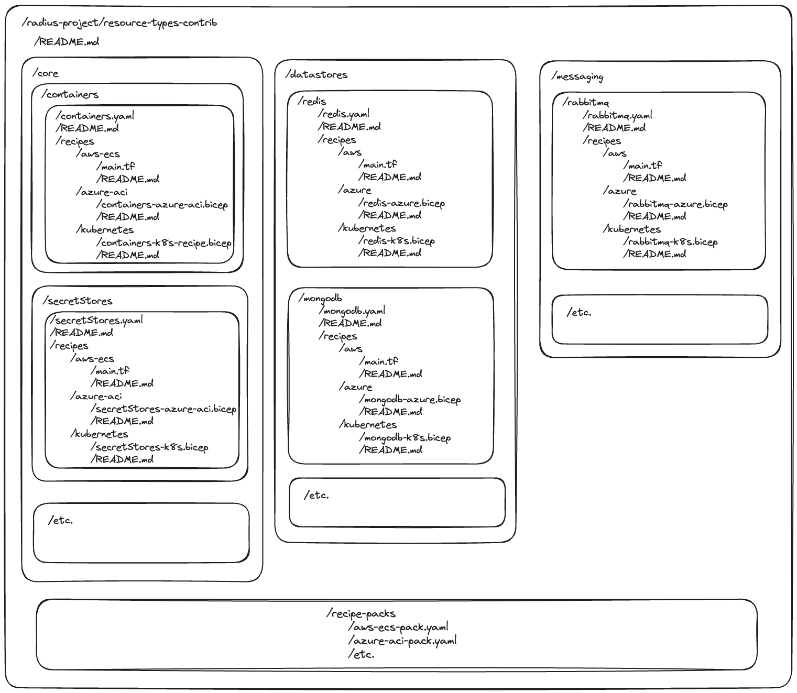

# Topic: Compute Platform Extensibility for Radius

* **Author**: Will Tsai (@willtsai)

## Terms and definitions

| Term | Definition |
|------|------------|
| **Compute platform** | An environment where applications can be deployed and run, such as Kubernetes, Azure Container Instances (ACI), etc. |
| **Core types** | Built-in resource types provided by Radius, including `containers`, `gateways`, `secretStores`, `volumes`, `environments`, and `applications`. |
| **Radius Resource Type (RRT)** | A custom resource type defined separately from Radius core types and loaded into Radius without requiring a new Radius release. Formerly referred to as User Defined Types (UDTs) |
| **Recipe** | A set of instructions that provisions a Radius resource to a Radius environment. Recipes are implemented in Bicep or Terraform. |
| **Resource Provider (RP)** | A component responsible for handling create, read, update, delete, and list (CRUDL) operations for a specific resource type. |

## Topic Summary
<!-- A paragraph or two to summarize the topic area. Just define it in summary form so we all know what it is. -->
Radius will be enhanced to support multiple compute platforms, secret stores, gateway, and volume resources through a recipe-based extensibility model. This approach decouples Radius's core logic from platform-specific provisioning code. Core resource types (`containers`, `gateways`, `secretStores`, and `volumes`) will be implemented as Radius Resource Types (RRT) and will allow platform engineers to register Bicep or Terraform recipes for them. Radius will provide default recipes for Kubernetes and Azure Container Instances (ACI), but platform engineers can use, modify, or replace these to customize how Radius provisions resources to different environments, or to add support for entirely new platforms without requiring changes to Radius core.

### Top level goals
<!-- At the most basic level, what are we trying to accomplish? -->
- Provide platform engineers with the ability to deploy Radius applications to specific platforms other than the default Kubernetes, such as Azure Container Instances (ACI), and other compute, secret store, and gateway platforms.
- Provide abstraction punch-through mechanisms to allow platform engineers and developers to leverage platform-specific features and configurations not directly supported by Radius core (e.g. confidential containers).
- Provide a recipe-based platform engineering experience that is consistent for user-defined resource types and core types.
- Expand the ability to provision a single application definition to multiple clouds by adding the capability to provision to multiple compute platforms, secret stores, volumes, and gateway types.
- Architecturally separate Radius core logic from platform-specific provisioning code.
- Enable community-provided extensions to support new platforms without Radius code changes.
- Provide Recipe Packs to bundle related recipes for easier management and sharing (e.g., a pack for ACI that includes all necessary recipes).

### Non-goals (out of scope)
<!-- What are we explicitly not trying to accomplish? -->
- Running the Radius control plane on a non-Kubernetes platform, this is tracked as a separate roadmap item in [Host Radius control plane in any container platform #39](https://github.com/radius-project/roadmap/issues/39)
- Changes to portable types beyond what's necessary to support recipe-based provisioning for core functionalities.
- Implementing a new custom resource provider (RP) framework beyond the existing RRT and Recipe mechanism for this specific feature.
- Versioning support for Recipes is out of scope, this is tracked as a separate feature in [#3 Versioning for Recipes, resource types, apis, etc.](https://github.com/radius-project/roadmap/issues/3). However, versioning is in scope for the implementation of Recipe Packs from the get go, even if the underlying Recipes packaged within the Pack don't support versioning yet.

## User profile and challenges
<!-- Define the primary user and the key problem / pain point we intend to address for that user. If there are multiple users or primary and secondary users, call them out.   -->

### User persona(s)
<!-- Who is the target user? Include size/org-structure/decision makers where applicable. -->
**Platform Engineers / Infrastructure Operators**
- Work in medium to large organizations, supporting multiple development teams by providing and managing infrastructure platforms.
- Responsible for setting up, configuring, and maintaining diverse compute, storage, and networking environments, often spanning multiple clouds or hybrid setups.
- Make platform choices based on business requirements, cost optimization, technical capabilities, and existing enterprise infrastructure.
- Need to enforce organizational standards, security policies, and operational best practices across all deployed applications.
- Often tasked with enabling developers to use modern application platforms while integrating with established enterprise systems.

### Challenge(s) faced by the user
<!-- What challenges do the user face? Why are they experiencing pain and why do current offerings not meet their need? -->
- **Limited Platform Support:** Current Radius versions primarily target Kubernetes with recent hardcoded expansion to ACI, making it difficult to use Radius in organizations that have standardized on or require other compute platforms (e.g., AWS Fargate, Google Cloud Run), or different types of secret stores and gateways.
- **Lack of Customization:** The provisioning logic for core Radius resources is hard-coded, offering limited ways to customize deployments to meet specific organizational policies (e.g., specific labels, sidecars, network configurations) without forking Radius.
- **Extensibility Barriers:** Extending Radius to support new, unsupported platforms requires modifying Radius core code, which is a significant barrier for most platform teams and leads to maintenance overhead.
- **Inconsistent Tooling:** Managing applications across different platform types often requires different toolsets and deployment pipelines, increasing complexity.

### Positive user outcome
<!-- What is the positive outcome for the user if we deliver this, i.e. what is the value proposition for the user? Remember, this is user-centric. -->
As a platform engineer, I can confidently adopt Radius across my organization, knowing I can extend its capabilities to support any compute platform, secret store, gateway, or volume my teams require, without waiting for built-in support or modifying Radius core. I can register, customize, and share recipes that define how Radius provisions these resources, ensuring consistency with our application definitions while maintaining flexibility in our infrastructure choices and adhering to organizational standards. This empowers my development teams to leverage Radius benefits regardless of the underlying infrastructure.

> Note that compute extensibility will allow for one compute platform configured per Radius Environment

## Key scenarios
<!-- List ~3-7 high level scenarios to clarify the value and point to how we will decompose this big area into component capabilities. We may ultimately have more than one level of scenario. -->

### Scenario 1: Configure a non-Kubernetes Radius environment
A platform engineer initializes a new Radius environment and registers recipes for `Radius.Compute/containers@2025-05-01-preview` to deploy applications to Azure Container Instances (ACI) instead of Kubernetes, allowing teams to use Radius in environments without Kubernetes clusters. They would similarly register recipes for ACI-compatible gateway and secret store solutions.

### Scenario 2: Customize platform deployment behavior for core resources
A platform engineer customizes the default Kubernetes recipes for `Radius.Compute/containers@2025-05-01-preview` (and similarly for `Radius.Compute/gateways` and `Radius.Security/secrets`) to align with company-specific infrastructure policies, such as adding mandatory security sidecars, custom labels for cost tracking, or integrating with internal monitoring systems, by modifying the recipe and re-registering it.

### Scenario 3: Extend Radius to a new, unsupported platform
A platform engineer creates new Bicep or Terraform recipes to enable Radius to deploy `Radius.Compute/containers@2025-05-01-preview` to AWS Elastic Container Service (ECS), `Radius.Compute/gateways@2025-05-01-preview` to an AWS Application Load Balancer, and `Radius.Security/secrets@2025-05-01-preview` to AWS Secrets Manager. They then register these recipes in their Radius environment.

## Key dependencies and risks
<!-- What dependencies must we take in order to enable this scenario? -->
<!-- What other risks are you aware of that need to be mitigated. If you have a mitigation in mind, summarize here. -->
<!-- **Dependency Name** – summary of dependency.  Issues/concerns/risks with this dependency -->
<!-- **Risk Name** – summary of risk.  Mitigation plan if known. If it is not yet known, no problem. -->
- **Bicep/Terraform Capabilities and Limitations**: The feasibility of implementing all necessary provisioning logic (currently in Go for Kubernetes) within Bicep or Terraform recipes.
    - Risk: Some complex logic might be difficult or impossible to replicate.
    - Mitigation: Early Proof of Concept (POC) for Kubernetes provisioning in Bicep/Terraform. Implement ACI provisioning first as a less complex target to identify limitations. Consider Terraform if Bicep has significant gaps for certain platforms.
- **Radius Application Graph Integrity**: Ensuring that recipes can correctly define and maintain relationships and connections between resources (e.g., `containers.connections`) as the current system does.
    - Risk: Recipes might not fully capture or might incorrectly represent resource relationships, leading to broken application deployments or incorrect graph data.
    - Mitigation: Design and provide reusable Bicep/Terraform modules or clear patterns for recipes to declare outputs that contribute to the Radius graph.
- **Complexity of Core Types**: The `containers` resource type, in particular, has a large and complex schema.
    - Risk: Re-implementing its provisioning via recipes could be a large effort and error-prone.
    - Mitigation: Phased approach, thorough testing, and clear documentation. Maintain versioned support for older types during transition.
- **Migration Path for Existing Users**: Users with existing Radius deployments will need a clear and manageable path to migrate to the new RRT-based core types and recipe model.
    - Risk: Breaking changes or complex migration steps could deter adoption.
    - Mitigation: Provide versioned resource types (e.g., `@2025-05-01-preview`), detailed migration guides, and potentially migration tooling.
- **Recipe Validation and Debugging**: Lack of strong, compile-time typing for recipes means invalid recipes might only be caught at registration or deployment time.
    - Risk: Poor user experience due to difficult-to-debug deployment failures.
    - Mitigation: Implement robust validation checks upon recipe registration (schema, parameters, outputs). Enhance CLI tooling for local recipe validation and testing.

## Key assumptions to test and questions to answer
<!-- If you are making assumptions that, if incorrect, would cause us to significantly alter our approach to this scenario, make them explicit here.  Also call out how / when you plan to validate key assumptions. -->
<!-- What big questions must we answer in order to clarify our plan for this scenario.  When and how do you plan to answer those questions (prototype feature x, user research, competitive research, etc.) -->
- **Assumption**: All essential provisioning logic currently in Radius's Go code for Kubernetes (for containers, gateways, secret stores) can be effectively replicated using Bicep or Terraform recipes.
    - Validation: POC implementation of Kubernetes recipes for core functionalities.
- **Assumption**: AppCore can reliably construct the application graph and provide recipes with all information needed to execute via their connections to other resources.
    - Validation: Test recipe deployments and inspect the resulting Radius graph.
- **Question**: What is the most effective way for recipes to declare their input parameters and output properties to ensure consistency and enable validation?
    - Exploration: Define a clear contract for recipes, potentially using a schema or metadata definition that can be validated.
- **Question**: How can platform engineers easily test and debug their custom recipes before registering them in a live environment?
    - Exploration: Investigate CLI tooling or local sandbox environments for recipe testing.
- **Question**: Recipe Packs seems redundant as sets of recipes can already be registered to an Environment, which effectively acts as a Recipe Pack. Is there a need for a separate concept of Recipe Packs, or can we simply guide users to bundle their Recipes into Environment definitions?
    - Answer: The convenience of Recipe packs will be needed so that platform engineers don't have to piece together individual Recipes for each environment from scratch as a single Recipe Pack may be re-used for many Environments. Putting everything together manually each time also opens up the door for error (e.g. forgetting to include gateway Recipes). The Environment definition is a good place to group *collections of Recipe packs* - e.g. bundle ACI and OpenAI Recipe packs together in an Environment definition.

## Current state
<!-- If we already have some ongoing investment in this area, summarize the current state and point to any relevant documents. -->
Radius currently has built-in support for Kubernetes as its primary compute platform, as well as initial support for ACI. Core resource types like `Applications.Core/containers`, `Applications.Core/gateways`, and `Applications.Core/secrets` have hard-coded provisioning logic that targets Kubernetes or Azure for ACI. While Radius supports RRTs and recipes for custom resources, this mechanism is not used for the core functionalities mentioned. Extending Radius to other platforms or significantly customizing the provisioning of these core resources typically requires modifying the Radius codebase. The `environments` resource type has a hard-coded `compute` property primarily designed for Kubernetes and ACI.

## Details of user problem
<!-- <Write this in first person. You basically want to summarize what “I” as a user am trying to accomplish, why the current experience is a problem and the impact it has on me, my team, my work and or biz, etc…. i.e. “When I try to do x aspect of cloud native app development, I have the following challenges / issues….<details>. Those issues result in <negative impact those challenges / issues have on my work and or business.> -->
When I, as a platform engineer, try to use Radius to deploy and manage applications across my organization, I face significant hurdles if our infrastructure strategy involves more than just Kubernetes. For example, if a development team wants to deploy a service to AWS Elastic Container Service (ECS) for cost or simplicity, or if we need to integrate with a managed cloud gateway service instead of the default Radius gateway on Kubernetes, I can't easily make Radius do this. I'm forced to tell my teams they can only use Radius for Kubernetes, or I have to build and maintain complex workarounds outside of Radius. This means either Radius doesn't fit our diverse needs, or I'm stuck maintaining a custom version of Radius or else needing to contribute core code changes upstream in to Radius, which is a huge operational burden and makes upgrades very risky. These limitations prevent us from fully leveraging Radius as a unified application platform across our varied infrastructure.

## Desired user experience outcome
<!-- <Write this as an “I statement” that expresses the new capability from user perspective … i.e. After this scenario is implemented “I can do, x, y, z, steps in cloud native app developer and seamlessly etc... As a result <summarize positive impact on my work / business>  -->
After this feature is implemented, I can confidently use Radius as our central application platform, regardless of the specific compute, secret store, or gateway technologies we use. I can define how `Radius.Compute/containers@2025-05-01-preview` (and similarly versioned `Radius.Compute/gateways`, `Radius.Security/secrets`, and `Radius.Storage/volumes`) are provisioned on any target platform—be it Kubernetes with our custom configurations, serverless container platforms including Azure Container Instances, Azure Container Apps, AWS ECS, Google CloudRun, or a future platform—by simply writing and registering a Bicep or Terraform recipe. I can ensure all deployments adhere to our organizational standards by embedding those standards into the recipes. I can manage these recipes like any other piece of infrastructure-as-code, versioning them, testing them, and sharing them across my teams. As a result, my development teams get a consistent experience for defining their applications, while my platform team retains control and flexibility over the underlying infrastructure, all without needing to modify Radius core or manage complex forks. This significantly reduces our operational overhead and allows us to adapt quickly to new technologies and business needs.

### Detailed user experience
 <!-- <List of steps the user goes through from the start to the end of the scenario to provide more detailed view of exactly what the user is able to do given the new capabilities>  -->
<!-- Step 1
Step 2
… -->

#### User Story 1: As a Platform Engineer, I want to create a Recipe Pack that bundles multiple recipes for core resource types, so that I can easily register and manage them in a Radius environment:

1. **Define a Recipe Pack**:
   * A platform engineer creates a Radius Recipe Pack resource definition that specifies a collection of Recipes. It would list each core resource type (e.g., `Radius.Compute/containers@2025-05-01-preview`, `Radius.Compute/gateways@2025-05-01-preview`, `Radius.Security/secrets@2025-05-01-preview`) and associate it with a specific Recipe (recipeKind and recipeLocation) and its default parameters:
   * e.g. `computeRecipePack.bicep`:
        ```bicep
        resource computeRecipePack 'Radius.Config/recipePacks@2025-05-01-preview' = {
            name: 'computeRecipePack'
            description: "Recipe Pack for deploying to Kubernetes."
            properties: {
                recipes: [
                    Radius.Compute/container: {
                        recipeKind: 'terraform'
                        recipeLocation: 'https://github.com/project-radius/resource-types-contrib.git//recipes/compute/containers/kubernetes?ref=v0.48'
                        parameters: {
                        allowPlatformOptions: true
                        }
                    }
                    Radius.Security/secrets: {
                        recipeKind: 'terraform'
                        recipeLocation: 'https://github.com/project-radius/resource-types-contrib.git//recipes/security/secrets/kubernetes?ref=v0.48'
                    }
                    Radius.Storage/volumes: {
                        recipeKind: 'terraform'
                        recipeLocation: 'https://github.com/project-radius/resource-types-contrib.git//recipes/storage/volumes/kubernetes?ref=v0.48'
                    }
                ]
            }
        }
        ```
   * e.g. `dataRecipePack.bicep`:
        ```bicep
        resource dataRecipePack 'Radius.Config/recipePacks@2025-05-01-preview' = {
            name: 'dataRecipePack'
            description: "Recipe Pack for deploying data-related services to Kubernetes."
            properties: {
                recipes: [
                    Radius.Data/redisCaches: {
                        recipeKind: 'terraform'
                        recipeLocation: 'https://github.com/project-radius/resource-types-contrib.git//recipes/data/redis-caches/kubernetes?ref=v0.48'
                    }
                ]
            }
        }
        ```
   * Create (deploy) these Recipe Packs:
        ```bash
        rad deploy computeRecipePack.bicep
        rad deploy dataRecipePack.bicep
        ```
   > Note: If the RRT for which a Recipe in the pack is specified to be deploying does not exist, the Recipe Pack creation process should fail gracefully, indicating which RRTs are missing in the error message.

1. **Environment Utilizes Recipes from the Pack**:
    * Once the Recipe Pack is created and added to the Environment, Radius will use the recipes specified in the Recipe Pack.
    * Using `rad deploy env.bicep` will deploy the environment with the specified recipe packs:
        ```diff
        resource env 'Radius.Core/environments@2025-05-01-preview' = {
            name: 'my-env'
            properties: {
        +       // The recipePacks property is an array of Recipe Pack IDs
        +       recipePacks: [computeRecipePack.id, dataRecipePack.id]
        -       // The recipes property is removed as it is now managed through recipe packs,
        -       //  as a recipe pack may contain singleton or multiple recipes
        -       recipes: {}
            }
        }
        ```
    
    > The `environments.properties.recipes` is removed in favor of `environments.properties.recipePacks`, which means users will no longer be allowed to add individual recipes directly to the environment. Recipes must now be packed into Recipe Packs resources before they may be added to an environment, and a Recipe Pack can contain one or more recipes. This change simplifies environment management and promotes reuse of common configurations.

    > If recipes are duplicated across the recipe packs, Radius will overwrite the previous recipe with the latest one applied. This means that the `recipePacks` array property on the environment is effectively a prioritized ordered list, with the last recipe pack in the list having the highest priority in case of any recipe conflicts. In the example above, if both computeRecipePack and dataRecipePack contain a recipe for the same resource type, the one from dataRecipePack will take precedence. This behavior is intentional to ensure predictability and will be clearly documented for the user.

1. **Manage and Update Recipe Packs**:
    * Platform engineers can update the Recipe Pack resource (e.g., point to new recipe versions, change default parameters, add other Recipes) and re-deploy the Recipe Pack resource. Since the Recipe Pack is modeled as a Radius resource, the Environment will automatically pick up the changes without needing to re-deploy the Environment.
    * Commands like `rad recipe-pack show computeRecipePack`, `rad recipe list -environment my-env`, and `rad environment show my-env` would allow inspection of recipe packs and recipes.
        ```bash
        $ rad recipe-pack show computeRecipePack

        RESOURCE                TYPE                            GROUP     STATE
        computeRecipePack       Radius.Config/recipePacks       default   Succeeded

        RESOURCE TYPE                    RECIPE KIND     RECIPE VERSION      RECIPE LOCATION
        Radius.Compute/containers        terraform                           https://github.com/project-radius/resource-types-contrib.git//recipes/compute/containers/kubernetes?ref=v0.48
        Radius.Security/secrets          terraform                           https://github.com/project-radius/resource-types-contrib.git//recipes/security/secrets?ref=v0.48
        Radius.Storage/volumes           terraform                           https://github.com/project-radius/resource-types-contrib.git//recipes/storage/volumes?ref=v0.48
        ```
        
        ```bash
        $ rad recipe list -environment my-env
        RECIPE PACK             RESOURCE TYPE                    RECIPE KIND     RECIPE VERSION      RECIPE LOCATION
        computeRecipePack       Radius.Compute/containers        terraform                           https://github.com/project-radius/resource-types-contrib.git//recipes/compute/containers/kubernetes?ref=v0.48
        computeRecipePack       Radius.Security/secrets          terraform                           https://github.com/project-radius/resource-types-contrib.git//recipes/security/secrets?ref=v0.48
        computeRecipePack       Radius.Storage/volumes           terraform                           https://github.com/project-radius/resource-types-contrib.git//recipes/storage/volumes?ref=v0.48
        dataRecipePack          Radius.Data/redisCaches          terraform                           https://github.com/project-radius/resource-types-contrib.git//recipes/data/redisCaches?ref=v0.48
        networkingRecipePack    Radius.Compute/gateways          terraform                           https://github.com/project-radius/resource-types-contrib.git//recipes/compute/gateways?ref=v0.48
        ```

        ```bash
        $ rad environment show my-env
        RESOURCE            TYPE                            GROUP     STATE
        my-env              Radius.Core/environments        default   Succeeded

        RECIPE PACK         RESOURCE TYPE                    RECIPE KIND     RECIPE VERSION      RECIPE LOCATION
        computeRecipePack   Radius.Compute/containers        terraform                           https://github.com/project-radius/resource-types-contrib.git//recipes/compute/containers/kubernetes?ref=v0.48
        computeRecipePack   Radius.Security/secrets          terraform                           https://github.com/project-radius/resource-types-contrib.git//recipes/security/secrets?ref=v0.48
        computeRecipePack   Radius.Storage/volumes           terraform                           https://github.com/project-radius/resource-types-contrib.git//recipes/storage/volumes?ref=v0.48
        dataRecipePack      Radius.Data/redisCaches          terraform                           https://github.com/project-radius/resource-types-contrib.git//recipes/data/redisCaches?ref=v0.48
        ```

        > Note: the `RECIPE VERSION` is equivalent to the `TEMPLATE VERSION` column that exists in the Radius CLI output today but remains blank until Recipes versioning is implemented. We're just preserving the existing output, but renaming it to `RECIPE VERSION`.

#### User Story 2: As a platform engineer, I want to create a Radius Environment that leverages default recipe packs provided by Radius for core types, so that I can quickly set up a new environment without needing to write custom recipes:

There will be default Recipe Packs built into Radius for platform engineers to use "off the shelf" for each supported compute platform (i.e. Kubernetes and ACI today, ECS and other future). Each Recipe Pack will include a set of pre-defined Recipes that are optimized for the specific platform and be invoked to provision the following resources:
- `Radius.Compute/containers`: including any resources required to run containers (e.g. Kubernetes Deployments, ACI containerGroupProfile, ECS Task Definitions), provide L4 ingress (e.g. Kubernetes LoadBalancer, Azure Load Balancer, AWS Network Load Balancer), and leverages the `secrets` Recipes to store any secrets data declared in the container resource (e.g. environment variables).
- `Radius.Security/secrets`: these default Recipes provision the most common secret store for the underlying platform (e.g. Kubernetes Secrets, Azure Key Vault, AWS Secrets Manager).
- `Radius.Storage/volumes`: these default Recipes provision the most common storage solutions for the underlying platform (e.g. Kubernetes Persistent Volumes, Azure Files, Amazon Elastic File System).

> `Radius.Compute/gateways` for L7 ingress will not be included in the default Recipe Packs since it doesn't make sense to force a default given the wide range of preferences for ingress controllers (e.g. Contour, NGINX, Cilium, etc.) by users. Instead, L7 ingress will be implemented separately in the gateways Recipes, and these will not be included as a part of default Recipe packs for each compute platform. If a user wants L7 ingress, they will need to separately bring in their own Recipes for gateways that will implement an ingress controller of their choice (Contour, NGINX, Cilium, Azure Application Gateway, AWS Application Load Balancer, etc.).

> Contour is no longer installed and the `--skip-contout-install` option on `rad install` is removed

1.  **Initialize Workspace & Environment using an `env.bicep` file**:
    * Use `rad workspace` and `group` commands to create a Radius Group and/or Workspace. 
    * Define an environment in a Bicep file and then deploy it using `rad deploy env.bicep`. The new environment version (e.g., `Radius.Core/environments@2025-05-01-preview`) will not have a hard-coded `compute` kind.
    * For example, an ACI environment might look like:
        ```diff
        extension radius

        resource env 'Radius.Core/environments@2025-05-01-preview' = {
            name: 'my-aci-env'
            properties: {
        -       compute: {
        -           // compute kind is no longer hard-coded here
        -       }
        +       recipePacks: [azure-aci-pack.id]
                // providers property remains scoped to the environment
                providers: {
                    azure: {
        -               scope: '/subscriptions/<SUBSCRIPTION_ID>/resourceGroups/<RESOURCE_GROUP_NAME>'
        +               // scope is now an object with subscriptionId and resourceGroupName properties
        +               scope: {
        +                   subscriptionId: '<SUBSCRIPTION_ID>' // required
        +                   resourceGroupName: '<RESOURCE_GROUP_NAME>' // optional
        +               }
        +               // Identity property previously captured in 'compute' is moved here
        +               identity: {
        +                   kind:'userAssigned'
        +                   managedIdentity: ['/subscriptions/<>/resourceGroups/<>/providers/Microsoft.ManagedIdentity/userAssignedIdentities/<>']
        +               }
                    }
                }
            }
        }
        ```
    * Similarly, a Kubernetes environment might look like:
        ```diff
        extension radius

        resource env 'Radius.Core/environments@2025-05-01-preview' = {
            name: 'my-k8s-env'
            properties: {
        -       compute: {
        -           // compute kind is no longer hard-coded here
        -       }
        +       recipePacks: [local-k8s-pack.id]
                // providers property remains scoped to the environment
                providers: {
        +           // The Kubernetes namespace is moved here from properties.compute
        +           kubernetes: {
        +               namespace: 'default'
        +           }
               }
            }
        }
        ```
        > The `compute` property is removed in favor of Recipe configurations, with the Kubernetes namespace moved to the providers section. If a Kubernetes provider is specified but no namespace is provided, then the namespace defaults to 'default' to align with Kubernetes conventions. Note that this is changed from how it's [implemented today](https://github.com/radius-project/radius/blob/main/pkg/cli/cmd/env/create/create.go#L119-L121). If the providers property is not specified, default to providers.kubernetes.namespace='default' and show a warning to the user: "Since no provider is specified for the environment, the default provider is set to 'kubernetes' with namespace 'default'.

        > The `scope` property is now an object with subscriptionId and resourceGroupName as separate properties for Azure environments. `subscriptionId` (required) can be overridden by the Recipe if it also sets a `subscriptionId`. `resourceGroup` (optional) can be set in the Environment or by the Recipe (value set in the Recipe overrides the value set in the Environment). If the neither the Environment nor Recipe specifies a `resourceGroup` (optional) and the resource to be deployed needs to be scoped to a resource group, then the deployment would fail. This change allows for users to have Recipes set the `resourceGroup` dynamically upon resource creation.

        > If no Recipe Packs are provided, then the environment is created with the Recipe Pack which uses Bicep to deploy to Kubernetes. This Recipe Pack will include at least containers, gateways, and secrets. This preserves the existing behavior where an Environment without recipes registered can still deploy to Kubernetes given the implementation of containers, etc. in the imperative Go code.

    * By default, `rad init` will register default recipes for Kubernetes provisioning for `containers`, `gateways`, `volumes`, and `secrets` types so that Radius may continue providing a local kubernetes experience out of the box.

1. **Alternatively, create an environment using the `rad` CLI**:

    > Note that in these examples, we are adding the ability to set `--provider` and `--recipe-packs` via the CLI. Similar CLI experience for `rad environment update`.

    ```bash
    rad environment create my-aci-env \
    --provider azure.scope='/subscriptions/mySubscriptionId/resourceGroups/my-resource-group' \
    --recipe-pack azure-aci-pack
    ```

    ```bash
    rad environment create my-k8s-env \
    --provider kubernetes.namespace='default' \
    --recipe-packs local-k8s-pack
    ```

> There needs to be a set of default Recipes and Recipe Packs for core types built into Radius for Kubernetes, ACI, and AWS ECS, so that Platform Engineers can quickly set up environments without needing to create custom recipes from scratch. The default Recipes need to be in both Bicep and Terraform formats, so that platform engineers can choose the IAC they prefer as they may need to adapt the recipes to their specific use cases.

#### User Story 3: As an application developer, I want to define my application using the new RRT versions of core types, so that I can deploy my `app.bicep` across different environments without needing to understand the underlying provisioning details:

1.  **Developers Define Applications**:
    *   Application developers define their applications using the new RRT versions of core types (e.g., `resource myapp 'Radius.Compute/containers@2025-05-01-preview' = { ... }`). They do not need to be aware of the underlying recipe details if default parameters are suitable.
1.  **Deploy Applications**:
    *   Developers (or CI/CD) run `rad deploy <bicep-file>`. Radius uses the registered recipes for the RRTs in the target environment to provision the resources.

> Note: Recipes should use Radius resource types to deploy containers and secrets. For example, environment variable values are stored as Kubernetes secrets today. The new recipe-based container needs to use the Radius.Security/secrets resource type instead of storing secrets directly in Kubernetes secrets. 

#### User Story 4: As a platform engineer and/or application developer, I would like to leverage platform-specific capabilities

##### User Story 4a: As a platform engineer, I want to configure three environments with different recipes for the same core resource type, so that I can deploy applications with standard, confidential, and Kubernetes compute requirements:

1. Configure a Radius Environment with Recipes for Standard ACI containers:
    * The platform engineer configures `std-env` with recipes for `Radius.Compute/containers@2025-05-01-preview` that deploy to standard ACI compute. These recipes will ignore the platform-specific properties on the container resource since the recipe parameter `allowPlatformOptions=false`, and log a warning.
    * Example Environment definition using Recipe packs (conceptual):
        ```diff
        resource stdEnv 'Radius.Core/environments@2023-10-01-preview' = {
            name: 'std-env'
            properties: {
                recipePacks: [azure-aci-pack.id]
        +       // Platform engineers can disable the punch-through parameter for developers:
        +       recipeParameters: {
        +           Radius.Compute/containers: {
        +               // This will ignore platform specific options (e.g. containerGroupProfile for ACI)
        +               //   specified in the container definition, such as confidential container configs
        +               allowPlatformOptions: false
        +           }
        +       }
            }
            providers: {
                azure: {
        -           scope: '/subscriptions/mySubscriptionId/resourceGroups/my-resource-group'
        +               // scope is now an object with subscriptionId and resourceGroupName properties
        +               scope: {
        +                   subscriptionId: '<SUBSCRIPTION_ID>' // required
        +                   resourceGroupName: '<RESOURCE_GROUP_NAME>' // optional
        +               }
                    identity: {
                        kind:'userAssigned'
                        managedIdentity: ['/subscriptions/<>/resourceGroups/<>/providers/Microsoft.ManagedIdentity/userAssignedIdentities/<>']
                    }
                }
            }
        }
        ```

1. Configure a Radius Environment with Recipes for Confidential ACI containers:
    * The platform engineer configures `confi-env` with the `allowPlatformOptions: true` parameter for the `Radius.Compute/containers@2025-05-01-preview` Recipe. These recipes will interpret the platform-specific properties on the container resource to provision confidential ACI compute. These recipes will ignore and log a warning for confidential container requests if the platform-specific properties are not applicable to the target environment (e.g. ACI containerGroupProfile configurations would be ignored if the deployment target environment is Kubernetes).
    * Example Environment definition (conceptual):
        ```diff
        resource environment 'Radius.Core/environments@2023-10-01-preview' = {
            name: 'confi-env'
            properties: {
                recipePacks: [azure-aci-pack.id]
        +          // Platform engineers can enable the punch-through parameter for developers:
        +       recipeParameters: {
        +           Radius.Compute/containers: {
        +               // This will apply the platform specific options (e.g. containerGroupProfile for ACI)
        +               //   specified in the container definition, such as confidential container configs.
        +               // This parameter is true in the default recipe pack, so technically
        +               //   platform engineers don't need to specify this
        +               allowPlatformOptions: true
        +           }
        +       }
            }
            providers: {
                azure: {
        -           scope: '/subscriptions/<SUBSCRIPTION_ID>/resourceGroups/<RESOURCE_GROUP_NAME>'
        +           // scope is now an object with subscriptionId and resourceGroupName properties
        +           scope: {
        +               subscriptionId: '<SUBSCRIPTION_ID>' // required
        +               resourceGroupName: '<RESOURCE_GROUP_NAME>' // optional
        +           }
                    identity: {
                        kind:'userAssigned'
                        managedIdentity: ['/subscriptions/<>/resourceGroups/<>/providers/Microsoft.ManagedIdentity/userAssignedIdentities/<>']
                    }
                }
            }
        }
        ```

1. Configure a Radius Environment with Recipes for Kubernetes containers:
    * The platform engineer configures `k8s-env` with recipes for `Radius.Compute/containers@2025-05-01-preview` that deploy to Kubernetes. These recipes will interpret the platform-specific properties on the container resource, such as tolerations, and ignore ACI-specific properties.
    * The platform engineer can also configure Kubernetes metadata, such as labels, into the parameters of the Recipe Pack, which will be applied to all containers deployed to this environment.
    * Example Environment definition (conceptual):
        ```diff
        resource environment 'Radius.Core/environments@2023-10-01-preview' = {
            name: 'k8s-env'
            properties: {
                recipePacks: [local-k8s-pack.id]
                recipeParameters: {
                    Radius.Compute/containers@2025-05-01-preview: {
                        allowPlatformOptions: true
        +               // The Kubernetes metadata.labels at the environment level can be specified here,
        +               //   this will be passed to the Recipes which will apply them to all containers deployed to this environment.
        +               metadata.labels: "{ 'team.contact.name': 'frontend' }"
                    }
                        }
            }
        +   // providers property remains scoped to the environment
        +   providers: {
        +       // The Kubernetes namespace is moved here from properties.compute
        +       kubernetes: {
        +           namespace: 'default'
        +       }
        +   }
        }
        ```

##### User Story 4b: As a developer, I want to define an application that can be deployed to standard ACI, confidential ACI, and Kubernetes compute environments, without changing the core application logic, so that I can maintain a consistent application definition across different deployment targets:

This scenario demonstrates how a single application definition, containing both standard and confidential compute requirements, can be deployed to different environments, with Radius leveraging environment-specific recipes to fulfill those requirements.

1.  The developer defines an application in a Bicep file (`app.bicep`). This definition includes:
    *   A standard container (e.g., a frontend web server).
    *   A confidential container (e.g., a backend service processing sensitive data), defined through a `platformOptions.aci` property that encapsulates an ACI containerGroupProfile object which will include the confidential container configuration.
    *   A data store, like a Redis cache.
    *   A connection from the confidential backend container to the Redis cache.
    *   The recipes will ignore and log a warning for confidential container requests if the platform-specific properties are not applicable to the target environment (e.g. ACI containerGroupProfile configurations would be ignored if the deployment target environment is Kubernetes).
*   Example `app.bicep`:
    ```diff
    import radius as radius

    resource sensitiveApp 'Radius.Core/applications@2025-05-01-preview' = {
        name: 'sensitiveApp'
        properties: {
            environment: environment
        }
    }

    resource frontend 'Radius.Compute/containers@2025-05-01-preview' = {
        name: 'frontend'
        properties: {
            application: sensitiveApp.id
            container: {
                image: 'nginx:latest'
                ports: {
                    web: {
                        containerPort: 80
                    }
                }
            }
        // This container is standard by default
        }
    }

    resource backend 'Radius.Compute/containers@2025-05-01-preview' = {
        name: 'backend'
        properties: {
            application: sensitiveApp.id
            container: {
                image: 'mycorp/sensitive-processor:v1.2'
                ports: {
                    api: {
                        containerPort: 5000
                    }
                }
            }
            connections: {
                cache: {
                    source: cache.id
                }
            }
            extensions: [
                // Dapr sidecar definition stays the same for now
                {
                    kind: 'daprSidecar'
                    appId: 'frontend'
                }
                // This should be moved to a top-level property in the container definition:
    -          {
    -              kind:  'manualScaling'
    -              replicas: 5
    -          }
                // This should go into the platformOptions.kubernetes property
    -          {
    -              kind: 'kubernetesMetadata'
    -              labels: {
    -                  'team.contact.name': 'frontend'
    -              }
    -          }
            ]
        // This container requests confidential compute
    +      platformOptions: {
    +          // Platform-specific properties are included here, following the respective platform's API schema
    +          //     e.g. podSpec for k8s, taskDefinition for ECS, containerGroupProfile for ACI
    +          aci: {
    +              sku: 'confidential'
                    // and any other ACI-specific properties available via the containerGroupProfile spec
    +          }
    +          kubernetes: {
    +              apiVersion: 'v1'
    +              kind: Pod
    +              // The Kubernetes metadata.labels at the container level can be specified here:
    +              metadata: {
    +                  labels: {
    +                      'team.contact.name': 'frontend'
    +                  }
    +              }
    +              spec: {
    +                  // Kubernetes-specific PodSpec properties, such as tolerations, specified here:
    +                  tolerations: [
    +                      {
    +                          key: 'example-key'
    +                          operator: 'Exists'
    +                          effect: 'NoSchedule'
    +                      }
    +                  ]
    +              }
    +          }
    +      }
        }
    }

    resource cache 'Radius.Data/redisCaches@2023-10-01-preview' = {
        name: 'mycache'
        properties: {
            application: application
        }
    }
    ```

1. The developer deploys the same application definition to each Environment:
    *   **Deploy to Standard Environment:**
        *   `rad deploy ./app.bicep --environment std-env`
        *   The `frontend` container is deployed as a standard container.
        *   The `backend` container, despite its platform-specific confidential container property, is deployed as a standard container because the `allowPlatformOptions` parameter is set to `false` in the `std-env` environment's recipe pack for `Radius.Compute/containers@2025-05-01-preview`. Kubernetes-specific properties like tolerations and labels are ignored in this case, as they are not applicable to ACI.
        *   The `cache` is deployed, and the connection between `backend` and `cache` is established.
    *   **Deploy to Confidential Environment:**
        *   `rad deploy ./app.bicep --environment confi-env`
        *   The `frontend` container is deployed as a standard container (as its definition doesn't request confidential compute).
        *   The `backend` container's platform-specific confidential container property is interpreted by the recipes in `confi-env` because the `allowPlatformOptions` parameter is set to `true`, and it is deployed as a confidential container (e.g., an ACI confidential container). Kubernetes-specific properties like tolerations and labels are ignored in this case, as they are not applicable to ACI.
        *   The `cache` is deployed, and the connection between `backend` (now confidential) and `cache` is established.

1. The developer can also deploy the same application to a Kubernetes environment:
    *   Given: platform engineers have configured a Radius Environment with a Recipe Pack that supports Kubernetes deployments and has `allowPlatformOptions` set to `true`.
    *   **Deploy to Kubernetes Environment:**
        *   `rad deploy ./app.bicep --environment my-k8s-env`
        *   The `frontend` container is deployed as a standard Kubernetes Pod.
        *   The `backend` container is deployed as a Kubernetes Pod with the specified tolerations and labels because the `allowPlatformOptions` parameter was set to `true` in the Kubernetes recipe pack by the platform engineer. ACI-specific properties are ignored in this case, as they are not applicable to Kubernetes.
        *   The `cache` is deployed, and the connection between `backend` and `cache` is established.

> This scenario highlights that the application definition remains consistent. The underlying infrastructure and specific compute capabilities (ACI standard vs. ACI confidential vs. Kubernetes) are determined by the recipes configured in the target Radius environment, allowing for flexible deployment to diverse compute platforms without altering the core application logic or Bicep code.

> The default Recipe packs will have the `allowPlatformOptions` parameter set to `true` for core types like `Radius.Compute/containers@2025-05-01-preview`, which allows developers to punch through the Radius abstraction and use platform-specific options (e.g., `containerGroupProfile` for ACI) in their application definitions. If `allowPlatformOptions` is not specified in the Environment via the Recipe Pack parameters, it will default to whatever is set as default in the Recipe Pack itself, which is `true` for the default Recipe Packs.

> Note that Radius will have to merge the configurations from the environment and container definitions with the configurations provided within the `platformOptions` property. For example, if the same `platformOptions.kubernetes.metadata.labels` value is specified in the container definition, it will override the same label value defined at the environment level.


#### User Story 5: As a platform engineer, I want to create or update my Radius Environments using the `rad environment` commands so that I can change the resource provisioning behavior without needing to modify and redeploy the environment definition:

**Add Recipe Packs to an environment**:
* Use `rad environment update` to add a recipe pack to a specific environment.
* Example command to add a recipe pack for ACI compute with platform-specific options disabled:
```bash
rad environment update my-aci-env \
--provider azure.scope='/subscriptions/mySubscriptionId/resourceGroups/my-resource-group' \
--recipe-packs azure-aci-pack \
--parameters {"allowPlatformOptions": false}
```
> Note: if there are existing recipes registered for the same resource type in the environment, this command will overwrite them with the recipes defined in the pack.

**Update the Kubernetes namespace in the Environment**:
* Use `rad environment update` to change the Kubernetes namespace for an existing environment.
* Example command to update the Kubernetes namespace:
```bash
rad environment update my-k8s-env --kubernetes-namespace new-namespace
```
* This command will update the `providers.kubernetes.namespace` property in the environment definition, which will be used by Radius when deploying applications to this environment.
* The `--kubernetes-namespace` flag is also available in the `rad environment create` command to set the initial namespace when creating a new environment.

**Create a new Environment without specifying Recipe Packs**:
* Today, when an Environment is created using `rad environment create my-env`, a Radius Environment is created without any Recipes registered to it. Despite not having any Recipes configured, the user is still able to deploy applications and container resources to this environment since there is imperative code in Radius core that can directly provision Kubernetes resources (containers, volumes, secrets) without requiring pre-defined Recipes.
* We want to preserve this "native" Kubernetes user experience in the new Radius compute extensibility model. Therefore, we will need to implement the following:
    1. Continue allowing the creation of an environment without specifying any recipe packs: `rad environment create my-env`.
    2. This command will create an environment and configure it with the local Kubernetes compute Recipe Pack as its default.
    3. Users will then be able to deploy applications and Kubernetes containers to this Environment even though they did not explicitly add any recipe packs, thus preserving the existing user experience.

#### User Story 6: As a platform engineer, I want to contribute new Recipes and Recipe Packs for core types to the Radius repository, so that I can extend the capabilities of Radius and share my work with the community:

> NOTE: the full detailed user experience for this is defined in this feature spec: https://github.com/radius-project/design-notes/pull/104

1.  **Understand Contribution Guidelines**:
    *   Familiarize yourself with the Radius project's general contribution guidelines (often found in `CONTRIBUTING.md`).
    *   Check for any specific guidelines related to recipes or extensibility.
2.  **Develop Your Recipe(s)**:
    *   Create high-quality, well-tested Bicep or Terraform recipes for one or more core types (`Radius.Compute/containers@2025-05-01-preview`, `Radius.Compute/gateways@2025-05-01-preview`, `Radius.Security/secrets@2025-05-01-preview`, `Radius.Storage/volumes@2025-05-01-preview`).
    *   Ensure recipes are generic enough for broad use or clearly document their specific use case.
    *   Follow established patterns for parameters, outputs, and resource naming within the Radius ecosystem.
3.  **Document Your Recipe(s)**:
    *   Provide clear documentation for each recipe, including:
        *   The platform it targets.
        *   Prerequisites for using the recipe.
        *   Input parameters (with descriptions, types, and defaults).
        *   Output values and their significance.
        *   An example of how to use the recipe.
4.  **(If contributing a Recipe Pack) Define the Recipe Pack Manifest**:
    *   Create a `recipe-pack.bicep` Recipe Pack resource definition file as described in the scenario above for creating Recipe Packs.
    *   Ensure all referenced recipes are correct and accessible.
    *   Document the purpose and intended use of the Recipe Pack.
5.  **Test Thoroughly**:
    *   Locally test the recipes and/or Recipe Pack in a Radius environment to ensure they deploy correctly and integrate as expected.
    *   Verify that applications deployed using these recipes function correctly.
6.  **Prepare Your Contribution**:
    *   Fork the `/resource-types-contrib` repository on GitHub.
    *   Clone your fork to your local machine.
    *   Create a new branch for your changes (e.g., `feature/my-recipes`).
    *   Add your recipe files and/or Recipe Pack manifest to the appropriate directory structure in your fork.
7.  **Submit a Pull Request (PR)**:
    *   Push your changes to your fork and open a Pull Request against the main Radius repository.
    *   In the PR description, clearly explain:
        *   What your recipes/Recipe Pack do.
        *   The problem they solve or the functionality they add.
        *   How to test them.
        *   Any relevant issue numbers.
8.  **Engage in the Review Process**:
    *   Respond to feedback and questions from Radius maintainers.
    *   Be prepared to make changes to your code, documentation, or structure based on the review.
9.  **Iteration and Merge**:
    *   Work with the maintainers to address any concerns until the PR is approved.
    *   Once approved, your contribution will be merged into the Radius repository where your contributed Recipes and/or Recipe Packs will be published to the Radius GHCR registry, making your Recipes/Recipe Pack available to the community.

> The proposal is add core RRTs and Recipes to a new repo called `radius-project/resource-types-contrib` where both core (built-in) and extended (optional) types and Recipes will be stored in a structure like: 

#### User Story 7: As a platform engineer or app developer, I want to migrate existing Radius applications to use the new RRT-based core types and recipes, so that I can take advantage of the new extensibility features without breaking existing applications:

1.  **Understand the New Model**:
    *   Platform engineers and developers review documentation on the RRT-based core types (`Radius.Compute/containers@2025-05-01-preview`, `Radius.Compute/gateways@2025-05-01-preview`, `Radius.Security/secrets@2025-05-01-preview`, `Radius.Storage/volumes@2025-05-01-preview`) and the recipe-driven approach.
2.  **Update Radius Environment**:
    *   Platform engineers update their Radius environment definition to use the new `Radius.Core/environments@2025-05-01-preview` (or later) resource type.
    *   They register recipes for the new RRT versions of core types in their respective environments. For users migrating from existing Kubernetes or ACI setups, they would register the default recipes provided by Radius for these platforms.
3.  **Update Application Bicep Files**:
    *   Developers modify their application Bicep files to reference the new versioned RRTs (e.g., change `Applications.Core/containers` to `Radius.Compute/containers@2025-05-01-preview`).
    *   They adjust any application properties to align with the schema of the new RRTs and the parameters expected by the registered recipes.
4.  **Test Migrated Applications**:
    *   Deploy the updated application Bicep files to the upgraded Radius environment.
    *   Thoroughly test the application's functionality, connectivity, and configuration to ensure it behaves as expected under the new recipe-based provisioning.
5.  **Iterate and Adjust**:
    *   If issues arise, consult migration logs, recipe documentation, and RRT schemas to make necessary adjustments to application definitions or recipe parameters in the environment.
6.  **Update CI/CD Pipelines**:
    *   Modify CI/CD pipelines to use the updated application Bicep files and any new CLI commands or Radius versions required for the RRT model.

#### User Story 8: As an application developer, I want to mount a secret store to my container as a volume so that my application container can access secrets securely:

Given: my platform engineer has set up a Radius environment with recipes registered for `Radius.Compute/containers@2025-05-01-preview` and `Radius.Security/secrets@2025-05-01-preview` resources. The secret store recipe is configured to provision a Key Vault or similar secret management service with the secret values provided by the developer.

1. **Define a Secret Store**:
    * The developer defines a secret store in their application Bicep file, that will leverage the default recipe to provision.
    ```bicep
    resource mySecret 'Radius.Security/secrets@2025-05-01-preview' = {
        name: 'mySecret'
        properties: {
            environment: env.id
            application: app.id
            type: 'certificate'
            data: {
                'tls.key': {
                    value: tlskey
                }
                'tls.crt': {
                    value: tlscrt
                }
            }
        }
    }
    ```

1. **Mount the Secret Store to a Container**:
    * The developer updates their container definition to include a volume that mounts the secret store.
    ```diff
    resource myContainer 'Radius.Compute/containers@2025-05-01-preview' = {
        name: 'myContainer'
        properties: {
            environment: env.id
            application: app.id
            container: {
                image: 'myContainerImage'
                volumes: {
                    secrets: {
                        kind: 'persistent'
    +                   source: mySecret.id
                        mountPath: '/var/secrets'
                    }
                }
            }
    }
    ```

1. **Deploy the Application**:
* The developer deploys the application using `rad deploy app.bicep --environment my-env`.
* Radius uses the registered recipe for `Radius.Security/secrets@2025-05-01-preview` to provision the secret store (e.g., Azure Key Vault) and the recipe for `Radius.Compute/containers@2025-05-01-preview` to deploy the container with the secret store mounted as a volume in the container.

> Note: this replaces the current implementation that requires users to associate a KeyVault to a volume resource before mounting the volume to the container, i.e. https://docs.radapp.io/reference/resource-schema/core-schema/volumes/azure-keyvault/

> This approach will require deprecation of the current [Azure KeyVault Radius Volumes resource type](https://docs.radapp.io/reference/resource-schema/core-schema/volumes/azure-keyvault/) where the Azure KeyVault will just be a Secret Store resource type provisioned using a recipe for Azure KeyVault that can be mounted to a Radius Container resource as a volume.

#### User Story 9: As an application developer, I want to add a gateway resource to my application that provisions an ingress controller that I can use to route traffic to my application containers, so that I can manage ingress traffic using my organization's preferred ingress solution:

Given: my platform engineer has set up a Radius environment with recipes registered for `Radius.Compute/containers@2025-05-01-preview` and `Radius.Compute/gateways@2025-05-01-preview` resources. The Recipe backing the gateway resource is configured to provision an ingress controller that complies with the specifications determined by my organization.

1. **Define a container for the service that needs to be exposed to the internet**:
* The developer defines a container in their application Bicep file that will be provisioned by the default recipe.
    ```bicep
    resource frontend 'Radius.Compute/containers@2025-05-01-preview' = {
        name: 'frontend'
        properties: {
            environment: env.id
            application: app.id
            container: {
                image: 'myfrontendimage'
                ports: {
                    web: {
                        containerPort: 3000
                    }
                }
            }
        }
    }
    ```

1. **Define a  Gateway Resource**:
* The developer defines a gateway resource in their application Bicep file and the default recipe provisions an ingress controller (e.g. Contour, NGINX, Traefik, etc.) to handle the traffic routing.
    ```bicep
    resource myCustomGateway 'Radius.Compute/gateways@2025-05-01-preview' = {
        name: 'myCustomGateway'
        properties: {
            environment: env.id
            application: app.id
            routes: [
                {
                    path: '/'
                    destination: 'http://${frontend.name}:3000'
                }
            ]
        }
    }
    ```

1. **Deploy the Application**:
* The developer deploys the application using `rad deploy app.bicep --environment my-env`.
* Radius uses the registered recipe for `Radius.Compute/gateways@2025-05-01-preview` to provision the ingress controller and the recipe for `Radius.Compute/containers@2025-05-01-preview` to deploy the container with the ingress controller configured to route traffic to the container.
    ```bash
    Building app.bicep...
    Deploying template './app.bicep' for application 'myapp' and environment 'my-env' from workspace 'default'...

    Deployment In Progress...

    Completed            myCustomGateway         Radius.Compute/gateways
    Completed            frontend                Radius.Compute/containers

    Deployment Complete

    Resources:
        myCustomGateway         Radius.Compute/gateways
        frontend                Radius.Compute/containers

        Public endpoint http://1.1.1.1.nip.io/
    ```

Note that the developer UX is the same as today. However, there are several changes are included in this implementation:
1. Contour is no longer installed and the `--skip-contour-install` option on `rad install` is removed.
1. L4 ingress is implemented as a part of the `containers` Recipes, e.g. Kubernetes container Recipe will include implementation of Kubernetes Service of type `LoadBalancer`, ACI container Recipe will include implementation of Azure Load Balancer, ECS container Recipe will include implementation of AWS Network Load Balancer.
1. L7 ingress is implemented separately in the `gateways` Recipes, and these will not be included as a part of the built-in Kubernetes, ACI, ECS, etc. Recipe packs. If a user wants L7 ingress, they will need to separately bring in their own Recipes (or select from those available in `/resource-types-contrib`) for `gateways` that will implement an ingress controller of their choice (Contour, NGINX, Cilium, Azure Application Gateway, AWS Application Load Balancer, etc.).

#### User Story 10: As an application developer, I want to create custom storage resources and mount them as volumes to my containers, so that I can use custom storage solutions or configurations:

Given: my platform engineer has set up a Radius environment with recipes registered for `Radius.Compute/containers@2025-05-01-preview` and `Radius.Storage/volumes@2025-05-01-preview` resources. The volume recipe is configured to provision storage (e.g. Azure Disks, Blob Storage, AWS EBS, S3, etc.) based on the specifications determined by my organization that can then be mounted to my containers.

1. **Define a Volume Resource**:
    * The developer defines a volume resource in their application Bicep file that will be provisioned by the default recipe.
    ```bicep
    resource myStorageVolume 'Radius.Storage/volumes@2025-05-01-preview' = {
        name: 'myStorageVolume'
        properties: {
            environment: env.id
            application: app.id
            sizeGb: '10'
        }
    }
    ```
    > Note that the configurations for this volume resource will be implemented in the recipe and not specified by the developer, e.g. in an Azure environment it might provision an Azure Disk while in an AWS environment it would provision an Elastic Block Store.

1. **Mount the Volume to a Container**:
    * The developer updates their container definition to include a volume that mounts the custom volume.
    ```diff
    resource myContainer 'Radius.Compute/containers@2025-05-01-preview' = {
        name: 'myContainer'
        properties: {
            environment: env.id
            application: app.id
            container: {
                image: 'myContainerImage'
                volumes: {
    +              persistentVolume: {
    +                  kind: 'persistent'
    +                  source: myStorageVolume.id
    +              }
                }
            }
    }
    ```

1. **Deploy the Application**:
* The developer deploys the application using `rad deploy app.bicep --environment my-env`.
* Radius uses the registered recipe for `Radius.Storage/volumes@2025-05-01-preview` to provision the storage volume and the recipe for `Radius.Compute/containers@2025-05-01-preview` to deploy the container with the storage mounted as a volume in the container.

#### User Story 11: As a platform engineer, I want an interactive guided experience for setting up Radius environments with default recipes for core types based on the platform I'm targeting, so that I can quickly get started with Radius without needing to manually configure everything via disparate steps:

1. **Local Kubernetes via `rad init`**:
* The `rad init` experience today sets up a default environment with and Recipes that support prototyping, development and testing using local Kubernetes containers.
* We will preserve this experience and set up the default environment with the local Kubernetes containers Recipe registered, as well as the default Recipes for the other resources that get added with `rad init` today, i.e.:
    ```bash
    NAME      TYPE                                        TEMPLATE KIND  TEMPLATE VERSION  TEMPLATE
    default   Radius.Data/sqlDatabases                    bicep                            ghcr.io/radius-project/recipes/local-dev/sqldatabases:latest
    default   Radius.Data/rabbitMQQueues                  bicep                            ghcr.io/radius-project/recipes/local-dev/rabbitmqqueues:latest
    default   Radius.Dapr/pubSubBrokers                   bicep                            ghcr.io/radius-project/recipes/local-dev/pubsubbrokers:latest
    default   Radius.Dapr/secretStores                    bicep                            ghcr.io/radius-project/recipes/local-dev/secretstores:latest
    default   Radius.Dapr/stateStores                     bicep                            ghcr.io/radius-project/recipes/local-dev/statestores:latest
    default   Radius.Data/mongoDatabases                  bicep                            ghcr.io/radius-project/recipes/local-dev/mongodatabases:latest
    default   Radius.Data/redisCaches                     bicep                            ghcr.io/radius-project/recipes/local-dev/rediscaches:latest
    default   Radius.Data/configurationStores             bicep                            ghcr.io/radius-project/recipes/local-dev/configurationStores:latest
    ```

1. **Azure or AWS container environments:**
* To set up an environment using ACI or ECS, the platform engineer needs to:
    1. [Configure a cloud provider](https://docs.radapp.io/guides/operations/providers/overview/) to register cloud credentials with the Radius control planes
    1. In the case of ACI, set up a managed identity that will be used to manage the ACI resources (potentially something similar with ECS)
    1. Deploy an ACI environment that includes the managed identity, Azure resource group scope, and Recipe Packs needed for the target container platform
* As a convenience feature, we will introduce a `rad environment create --platform aci` or `rad environment create --platform ecs` command (exact implementation or naming of the command may change during implementation) that interactively guides the platform engineer through the steps of setting up an ACI or ECS environment enumerated above, including:
    * Selecting the target cloud provider (Azure or AWS)
    * Configuring the necessary cloud credentials and managed identity
    * Registering the default Recipe Packs for ACI or ECS that include the core resource types and their recipes
    * Setting up the environment with the appropriate parameters for the target platform

### Summary of key changes:
* The `compute` property in the `environments` resource type is removed, allowing for extensibility through Recipes.
* The `compute.namespace` property is moved to `providers.kubernetes.namespace` in the `Radius.Core/environments` resource type.
* The `properties.providers.azure.scope` property in the `environments` resource type is changed to an object with the subscriptionId and resourceGroupName properties separated. `subscriptionId` (required) can be overridden by the Recipe if it provides a `subscriptionId`. `resourceGroup` (optional) can be set in the Environment or by the Recipe (value set in the Recipe overrides the value set in the Environment). If the neither the Environment nor Recipe specifies a `resourceGroup` (optional) and the resource to be deployed needs to be scoped to a resource group, then the deployment would fail.
* The following [Recipe properties](https://docs.radapp.io/reference/resource-schema/core-schema/environment-schema/#recipe-properties) are renamed for better clarity going forward:
    * `templateKind` -> `recipeKind`
    * `templatePath` -> `recipeLocation`
* Recipes accept a new `allowPlatformOptions` parameter that determines whether platform-specific configurations via their own schemas (e.g., ACI containerGroupProfile, Kubernetes podSpec) are allowed in the resource type definition.
* Ability to package and register sets of related recipes as "Recipe Packs" to simplify distribution and management. Environment definitions can reference these packs, which will include the necessary recipes for core types.
* Core types (`Applications.Core/containers`, `Applications.Core/gateways`, `Applications.Core/secrets`, `Applications.Core/volumes`) are re-implemented as Radius Resource Types (RRT) with new, versioned resource type names (e.g., `Radius.Compute/containers@2025-05-01-preview`).
* Radius resource types naming convention is standardized to `Radius.<Domain>/<ResourceType>@<Version>`, e.g. `Radius.Core/environments@2025-05-01-preview`, `Radius.Compute/containers@2025-05-01-preview`, `Radius.Security/secrets@2025-05-01-preview`, `Radius.Storage/volumes@2025-05-01-preview`.
* New `radius-project/resource-types-contrib` repository is created to host both core (built-in) and extended (optional) types and Recipes, allowing for community contributions and extensions.
* The `runtimes` property in the `Radius.Compute/containers` resource type is replaced with a `platformOptions` property that allows for platform-specific configurations (e.g., ACI confidential containers, Kubernetes tolerations). This property will be a key-value object, with the key corresponding to the platform and the value is an object that matches the platform's API schema, e.g. `'kubernetes':{<podspec>}` or `'aci':{<containerGroupProfile>}`.
* The `{kind:  'manualScaling', replicas: 5}` extension in the `Radius.Compute/containers` resource type is moved to a top-level property in the container definition, as this is a container property common to all platforms.
* The `{kind: 'kubernetesMetadata', labels: {key: value}}` extension in the `Radius.Compute/containers` resource type is moved to the `platformOptions.kubernetes` property, as it is a Kubernetes-specific configuration.
* Ingress controller customization is enabled through the `Radius.Compute/gateways@2025-05-01-preview` resource type, where platform engineers can implement the ingress controller solutions of their choice using Recipes. Contour installation is no longer a hard dependency for Radius, allowing users to use alternative gateway solutions like NGINX Ingress Controller or Traefik.
* Recipe Packs are introduced as a new concept to bundle and distribute related recipes together, making it easier to manage and share them across different environments. Recipe Packs are modeled as Radius resources, specifically `Radius.Core/recipePacks@2025-05-01-preview`, and can be referenced by environments.
* Resource types are renamed to follow the new Radius naming convention:
    ```
    `Applications.Core/environments` --> `Radius.Core/environments`
    `Applications.Core/applications` --> `Radius.Core/applications`
    `Applications.Core/containers` --> `Radius.Compute/containers`
    `Applications.Core/gateways` --> `Radius.Compute/gateways`
    `Applications.Core/volumes` --> `Radius.Storage/volumes`
    `Applications.Core/secretStores` --> `Radius.Security/secrets`
    `Applications.Datastores/sqlDatabases` --> `Radius.Data/sqlDatabases`
    `Applications.Datastores/mongoDatabases` --> `Radius.Data/mongoDatabases`
    `Applications.Datastores/redisCaches` --> `Radius.Data/redisCaches`
    `Applications.Messaging/rabbitmqQueues` --> `Radius.Data/rabbitMQQueues`
    `Applications.Dapr/*` --> `Radius.Dapr/*`
    `Radius.Config/*` --> `Radius.Config/*` (newly proposed parent namespace for `recipePacks` resource)
    `Radius.Resources/*` --> `Radius.Resources/*` (user defined custom resource types)
    ```

## Key investments
<!-- List the features required to enable this scenario(s). -->

### Feature 1: RRT Implementation of Core Application Model Types
<!-- One or two sentence summary -->
Re-implement existing core types (`Applications.Core/environments`, `Applications.Core/applications`, `Applications.Core/containers`, `Applications.Core/gateways`, `Applications.Core/secrets`, `Applications.Core/volumes`) as Radius Resource Types (RRT) with new, versioned resource type names (i.e. `Radius.Core/environments`, `Radius.Core/applications`, `Radius.Compute/containers`, `Radius.Compute/gateways`, `Radius.Security/secrets`, `Radius.Storage/volumes`). These RRTs will form the basis of the extensible application model. These new core types must support Connections and may be modified by platform engineers to allow for the configuration of platform-specific capabilities (e.g. confidential containers) in the resource types themselves.

### Feature 2: Extensible Environment Configuration
<!-- One or two sentence summary -->
Introduce a new version of the `Applications.Core/environments` resource type (e.g., `Radius.Core/environments@2025-05-01-preview`) that removes the hard-coded `compute` property and relies on recipe configurations and parameters for platform-specific settings.

### Feature 3: Default Recipes for Kubernetes and ACI
<!-- One or two sentence summary -->
Develop and provide default, production-quality Bicep/Terraform recipes for the new RRT versions of `containers`, `gateways`, `volumes` and `secretStores` that target Kubernetes (replicating current functionality) and Azure Container Instances (ACI). These will serve as out-of-the-box solutions and examples.

### Feature 4: Recipe Pack Creation and Management
<!-- One or two sentence summary -->
Implement a system for packaging and versioning sets of related recipes (Recipe Packs) to simplify distribution and management. This includes defining a clear structure for Recipe Packs and providing CLI commands for creating, updating, and applying them. Default Recipes for Kubernetes and ACI will be provided by Radius as part of the initial Recipe Packs.

### Feature 5: CLI Enhancements for Recipe Management (as necessary)
<!-- One or two sentence summary -->
Validate that `rad recipe` CLI capabilities for registering, managing, and validating recipes associated with core type RRTs are sufficient for compute extensibility scenarios. This includes robust validation of recipe parameters and outputs upon registration. Implement any necessary enhancements to the CLI to support this.

### Feature 6: Migration Path and Documentation
<!-- One or two sentence summary -->
Develop comprehensive documentation, examples, and potentially tooling to guide existing Radius users in migrating their applications and environments from the old hard-coded core types to the new RRT-based, recipe-driven model.

### Feature 7: Community Contribution Process
<!-- One or two sentence summary -->
Establish a clear process and guidelines for community members to contribute new recipes and Recipe Packs for core types, including documentation standards, testing requirements, and PR submission processes. This will encourage community engagement and extension of Radius capabilities.

### Feature 8: Guided setup experience for Specific Platforms with Default Recipes
<!-- One or two sentence summary -->
Implement an interactive CLI experience that guides platform engineers through the steps of setting up Radius environments with default recipes for core types based on the target platform (e.g., Kubernetes, ACI, ECS). This feature will streamline the initial setup process and ensure that platform engineers can quickly get started with Radius without needing to manually configure everything.

## Notes from design discussions

### Platform specific capabilities

There is a design decision to be made regarding how advanced capabilities specific to the underlying compute platform (e.g. ACI confidential containers) should be exposed to platform engineers and developers. There were three options considered, with Option 3 being the preferred after seeking feedback from the community and users:

> Note that all options advocate for the implementation of the capabilities via Recipes.

#### Option 1: Open by default in the standard container properties
Platform-specific configurations are exposed in the standard container properties provided by Radius out of the box, in a freeform format that is up to the Recipe for the underlying platform to implement (e.g. an optional [PodSpec](https://kubernetes.io/docs/reference/kubernetes-api/workload-resources/pod-v1/#PodSpec), [ECS task definition template](https://docs.aws.amazon.com/AmazonECS/latest/developerguide/task-definition-template.html) or [ACI ContainerGroupProfile](https://learn.microsoft.com/en-us/azure/container-instances/container-instances-reference-yaml#schema) object encapsulated in a `runtimes` property on the standard Container resource that gets passed through for the underlying Recipe to implement as it sees fit). The default Recipe will pass along the platform-specific properties to the underlying platform API, allowing developers to leverage advanced capabilities without requiring platform engineers to modify the container resource or Recipe. If platform engineers do not want to allow certain punch-throughs, they need to modify the RRT and/or Recipes. Alternatively, we can add a configuration to the Environment definition that platform engineers can set to enable or disable punch-throughs for developers per Environment.

```diff
resource backend 'Radius.Compute/containers@2025-05-01-preview' = {
  name: 'backend'
  properties: {
    application: application
    container: {
      image: 'mycorp/sensitive-processor:v1.2'
      ports: {
        api: {
          containerPort: 5000
        }
      }
    }
+   runtimes: {
+        // Platform-specific properties are included here, following the respective platform's API schema
+        //     e.g. podSpec for k8s, taskDefinition for ECS, containerGroupProfile for ACI
+   }
  }
}
```

**Pros:**
- Platform specific capabilities can be leveraged using built-in properties of the standard container resource type, without requiring platform engineers to modify the container resource or Recipe.
- Provides an avenue for developers to "punch-through" the Radius abstraction, which may be especially necessary for onboarding existing (brownfield) applications on to Radius.

**Cons:**
- Exposing the entire set of container configurations in order to allow for platform specific capabilities may be too broad of an abstraction punch-through, resulting in container infrastructure configurations being split or duplicated across two places (i.e. in the container resource definition itself and in the Recipe).
- May lead to a proliferation of properties in the standard container resource type by developers, making it harder to manage and control for the platform engineering team. Such a punch-through exposed to developers can lead to misuse and complications as the container contract becomes ambiguous (i.e. platform engineers have to manage a separate contract with their developers on what is and isn't allowed in the punch-through).

#### Option 2: Closed by default, requiring platform engineers to extend the container resource
This option is where the advanced capabilities are not exposed in the standard container properties provided by Radius out of the box, but rather require platform engineers to modify the container resource definitions to enable these capabilities. This could be done by creating a custom Radius Resource Type (RRT) that extends the built-in container RRT to include platform-specific properties or configurations, and then registering a Recipe that implements the extended container resource type.

```diff
resource backend 'Radius.Compute/containers@2025-05-01-preview' = {
  name: 'backend'
  properties: {
    application: application
    container: {
      image: 'mycorp/sensitive-processor:v1.2'
      ports: {
        api: {
          containerPort: 5000
        }
      }
+     // Platofrm engineers modify the resource definition to enable the advanced capabilities they need:
+     sku: 'confidential' // platform engineers add this property to enable confidential compute
    }
-   runtimes: {
-        // Remove the platform-specific properties from the core container resource type, 
-        //     instead requiring platform engineers to extend the resource type as needed.
-   }
  }
}
```

> If we go with Option 2: Closed by default, we will need to bring into scope the expansion of standard container properties to include additional common properties, such as `tags`/`labels` and `restartPolicy`, so that the majority of developer use cases are covered by the standard container resource type. Thus, platform engineers only need to extend the container resource type for advanced capabilities, rather than for common properties.

**Pros:**
- Keeps the standard container resource type clean and focused on core properties, avoiding clutter from platform-specific configurations or misuse of advanced container configurations, thus maintaining the separation of concern between platform engineers and developers.
- The Radius maintainers retain the option to add advanced capabilities to the standard container resource type in the future as needed. For example, if confidential containers become a standard offering across all platforms, the maintainers can add a `confidentialCompute` property to the standard container resource type and provide default Recipes that implement it. Properties that are common across multiple platforms (e.g. `tags`, `labels`, `restartPolicy`) can be added to the standard container resource type to cover the majority of developer use cases.

**Cons:**
- Platform engineers must modify the container resource definitions and Recipes to enable advanced capabilities, which may require additional effort and coordination, increasing the maintenance overhead.
- Limits the ability of developers to leverage advanced container features without involving platform engineers, potentially slowing down the development process.

#### Option 3 (PREFERRED): Open by default, but allow platform engineers to easily disable the punch-through via Environment configuration
This option is a hybrid approach where the advanced capabilities are exposed in the standard container properties, but their enablement is controlled by a configuration in the Radius Environment definition. Platform engineers can enable or disable the punch-through for developers on a per-Environment basis. In this implementation, the configuration would be a boolean property (e.g. `allowAdvancedContainerCapabilities`) in the Environment definition that gets passed to the Recipe when it is registered. The Recipe can then use this configuration to determine whether to apply the advanced capabilities or not. The default Environments provided by Radius would have this configuration set to `true`, allowing developers to leverage advanced capabilities out of the box. The rationale is that default Radius Environments will primarily be used for testing and experimenting with Radius features, and thus enabling the punch-through by default is preferable. We expect platform engineers to create custom Environments for production or even development use cases, where they may choose to disable the punch-through for developers.


```diff
resource environment 'Radius.Core/environments@2023-10-01-preview' = {
  name: 'myenv'
  properties: {
+       allowAdvancedContainerCapabilities: true // Platform engineers can enable or disable the punch-through for developers
    recipes: {
+       // Recipes registered here must implement the allowAdvancedContainerCapabilities property
    }
    providers: {
      azure: {
-       scope: '/subscriptions/<SUBSCRIPTION_ID>/resourceGroups/<RESOURCE_GROUP_NAME>'
+       // scope is now an object with subscriptionId and resourceGroupName properties
+       scope: {
+           subscriptionId: '<SUBSCRIPTION_ID>' // required
+           resourceGroupName: '<RESOURCE_GROUP_NAME>' // optional
+       }
      }
    }
  }
}

resource backend 'Radius.Compute/containers@2025-05-01-preview' = {
  name: 'backend'
  properties: {
    application: application
    container: {
      image: 'mycorp/sensitive-processor:v1.2'
      ports: {
        api: {
          containerPort: 5000
        }
      }
    }
+   runtimes: {
+        // Platform-specific properties are included here, following the respective platform's API schema
+        //     e.g. podSpec for k8s, taskDefinition for ECS, containerGroupProfile for ACI
+   }
  }
}
```

**Pros:**
- Platform specific capabilities can be leveraged using built-in properties of the standard container resource type, without requiring platform engineers to modify the container resource or Recipe.
- Platform engineers retain control of the enablement of advanced capabilities on a per-Environment basis, eliminating the need for modifying the core resource type.

**Cons:**
- Adds cognitive load for developers to understand when the punch-through is enabled or not, requiring them to understand how the Environment to which they are deploying their application is configured.
- Platform engineers will have an additional configuration to manage in the Environment definition.

### Are Recipe Packs really needed, or do Environments serve the same purpose?

This specification proposes the introduction of "Recipe Packs" to group related Recipes together for easier management and deployment. The convenience of Recipe packs will be needed so that platform engineers don't have to piece together individual Recipes for each environment from scratch, as a single Recipe Pack may be re-used for many Environments. Putting everything together manually each time also opens up the door for error (e.g. forgetting to include gateway Recipes).

There were several questions about whether Environments, to which platform engineers may register multiple Recipes, essentially serve the same purpose and thus negates the need for Recipe Packs. While this is a valid point, it lacks the flexibility that a dedicated Recipe Pack feature provides where a Recipe Pack can have a lifecycle independent of the Environment and thus may be re-used for many Environments. The Environment definition remains a good place to group collections of Recipe packs - e.g. bundle ACI and OpenAI Recipe packs together in an Environment definition.

### Recipe Packs: Data Model vs. Tooling Approach

#### Data model approach (PREFERRED)
Recipe packs are modeled as Radius resources, which means they are objects that get saved into the Radius datastore and thus would show up in the app graph data, etc. This approach establishes a new pattern that treats Recipe packs as core Radius resource objects while the Recipes encapsulated in the packs themselves are not. This also means that Recipe packs would be deployed at the Radius resource group level and referenced in each environment within the resource group vs. being deployed within each environment.

> Details of this approach are as described [User Story 1](#user-story-1-as-a-platform-engineer-i-want-to-create-a-recipe-pack-that-bundles-multiple-recipes-for-core-resource-types-so-that-i-can-easily-register-and-manage-them-in-a-radius-environment) above.

#### Tooling approach
Recipe packs being defined in a yaml manifest that bundles individual Recipes can be considered a tooling-based implementation because then the Recipe packs are assets or objects that don't get saved in the Radius datastore. Much like Recipes today, so this approach would be maintaining that pattern for Recipe packs as well. The tooling aspect of this approach includes the ability to encapsulate Recipe pack objects into `.bicepparam` files so that sets of Recipe packs may be reused across environments without needing to modify each individual environment each time the Recipe pack changes.

<details><summary>Click to expand tooling approach implementation details</summary>

1.  **Define a Recipe Pack**:
    *   A platform engineer creates a manifest file (e.g. `recipe-pack.yaml`) that defines a collection of recipes. This manifest would list each core resource type (e.g., `Radius.Compute/containers@2025-05-01-preview`, `Radius.Compute/gateways@2025-05-01-preview`, `Radius.Security/secrets@2025-05-01-preview`) and associate it with a specific Recipe (OCI URI or local path) and its default parameters.
    *   Example `recipe-pack.yaml`:
        ```yaml
        name: aci-production-pack
        version: 1.0.0
        description: "Recipe Pack for deploying to ACI in production."
        recipes:
            - resourceType: "Radius.Compute/containers@2025-05-01-preview"   
            recipeKind: "bicep"
            recipeLocation: "oci://ghcr.io/my-org/recipes/core/aci-container:1.2.0"
            parameters:
                cpu: "1.0"
                memoryInGB: "2.0"
                environmentVariables:
                LOG_LEVEL: "Information"
                # Optional: allow platform-specific options like containerGroupProfile for ACI
                allowPlatformOptions: true
            - resourceType: "Radius.Compute/gateways@2025-05-01-preview"
            recipeKind: "bicep"
            recipeLocation: "oci://ghcr.io/my-org/recipes/core/aci-gateway:1.1.0"
            parameters:
                sku: "Standard_v2"
            - resourceType: "Radius.Security/secrets@2025-05-01-preview"
            recipeKind: "bicep"
            recipeLocation: "oci://ghcr.io/my-org/recipes/azure/keyvault-secretstore:1.0.0"
            parameters:
                skuName: "premium"
        ```
        > Note: `templateKind` is changed to `recipeKind` and `templatePath` is changed to `recipeLocation`

1.  **Add the Recipe Pack to an Environment**:
    *   The platform engineer uses a new CLI command to add the entire pack to a Radius environment.
    *   Example: `rad environment update my-env --recipe-packs aci-production-pack='./aci-production-pack.yaml'`
    *   Or, if stored in a repo: `rad environment update my-env --recipe-packs aci-production-pack='git::https://github.com/my-org/recipe-packs.git//aci-production-pack.yaml?ref=1.0.0'`
    *   This command would iterate through the recipes defined in the manifest and register each one to the specified environment, similar to individual `rad recipe register` calls.
    *   Alternatively, the Recipe Pack could be added to the Environment definition file (e.g., `env.bicep`) in a `recipe-packs` property like below and then deployed using `rad deploy env.bicep`.
        ```bicep
        resource env 'Radius.Core/environments@2025-05-01-preview' = {
            name: 'my-env'
            properties: {
                recipePacks: [
                    {
                        name: 'local-k8s-pack'
                        uri: 'git::https://github.com/project-radius/resource-types-contrib.git//recipe-packs/local-k8s-pack.yaml?ref=1.0.0'
                    }
                ]
            }
        }
        ```
    > Note: If the RRT for which a Recipe in the pack is being registered does not exist, the Recipe Pack addition process should fail gracefully, indicating which RRTs are missing in the error message.
</details>