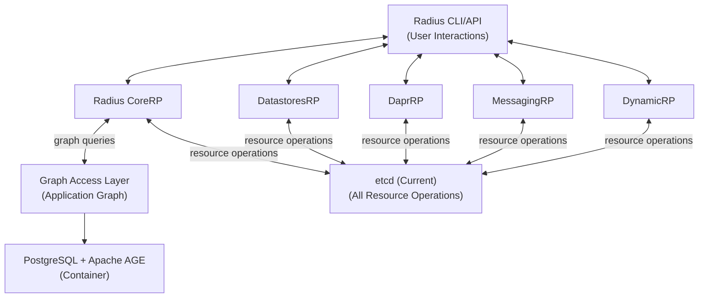
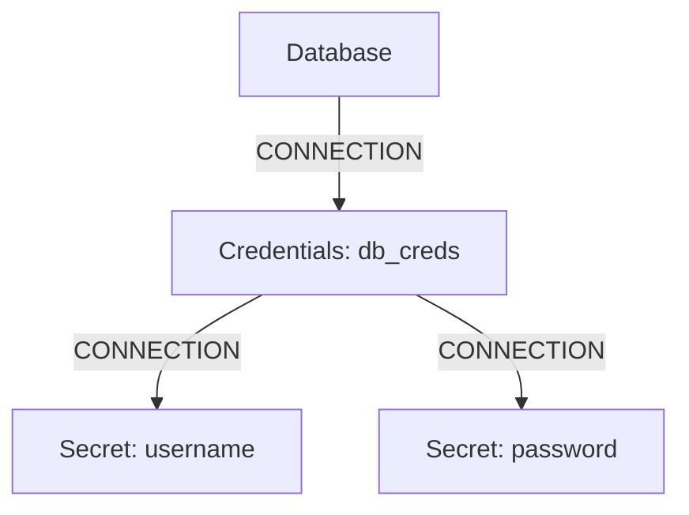

## Proposal: Integrating PostgreSQL with Apache AGE for Radius Application Graph

**Version:** 2.0
**Date:** June 16, 2025
**Author:** Sylvain Niles

---

### Overview

Project Radius currently defines and manages application graphs, representing resources and their relationships within cloud-native applications. Currently Radius relies on Kubernetes to install etcd, the default datastore, where these graph structures are stored as key value pairs. As we are adding support for nested connections the imperative Go code is becoming complex and brittle because it needs to implement basic graph traversal logic not present in etcd. Additionally we are already hitting performance limits in test environments (under a hundred resources were reported to slow things to a crawl) which inspired the work @superbeeny has done to swap the key value operations out to use postgres. Radius users could not use Drasi today to act on changes to their environments as there's no current support for key value stores and if that was added the client side filtering requirements would be a challenge in Drasi, requiring extensive middleware to parse the custom Radius data structures. 

This proposal outlines a plan to modify Project Radius to utilize **PostgreSQL with Apache AGE** as the primary store for its **application graph data specifically**, accessed via a new **Graph Access Layer (GAL)**. This change aims to decouple the core graph logic and operations from etcd, enabling more powerful graph queries, improving performance for complex relationship traversals, and offering a more specialized and efficient graph persistence layer. PostgreSQL with AGE will be deployed as a separate container in the Radius control plane, providing both traditional relational database capabilities and graph database functionality through Cypher queries. One of the benefits to recipe authors is this will allow them to define nested connections of types to both return complex relationships and properties to a recipe as well as see these relationships in the graph/dashboard.

The **Graph Access Layer (GAL)** will provide a consistent abstraction layer for Radius components to interact with the PostgreSQL + AGE backend, handling both application graph operations and potentially serving as a replacement for etcd-based storage in future iterations.

**Storage Strategy Rationale:** This proposal focuses on PostgreSQL with Apache AGE as a unified solution that can handle both application graph operations and serve as a potential replacement for etcd-based storage. PostgreSQL provides: (1) Proven production reliability and operational tooling; (2) Native support for both relational and graph data through Apache AGE; (3) Simplified deployment architecture with a single database technology; (4) Established backup, monitoring, and scaling patterns; (5) The flexibility to migrate away from etcd entirely in future phases while maintaining data consistency and operational simplicity.

Delivering this will allow us to shift to a far better user experience where connections become a rich re-usable concept that shares data and exposes deep relationships currently obfuscated by monolithic types with embedded objects (ex: database has a credentials object with username and password properties).

### Terms and Definitions

* **Radius:** An open-source, cloud-native application platform that helps developers build, deploy, and manage applications across various environments.
* **Application Graph:** A representation of an application's components (resources, services, environments, etc.) as nodes and their interconnections as edges, including metadata on both.
* **Kubernetes (K8s):** An open-source system for automating deployment, scaling, and management of containerized applications.
* **Graph Access Layer (GAL):** The internal abstraction layer that mediates all graph operations between Radius components and the underlying PostgreSQL + Apache AGE database.
* **PostgreSQL with Apache AGE:** A production-ready, scalable graph database solution supporting Cypher queries, built on PostgreSQL. This will be deployed as a separate container in the Radius control plane. [Website](https://age.apache.org/) | [GitHub](https://github.com/apache/age)
* **Node:** An entity in a graph (e.g., a Radius resource, an environment).
* **Edge:** A relationship between two nodes in a graph (e.g., "connectsTo", "runsIn"). All edges in Radius will be of type "CONNECTION".
* **Property:** Key-value pairs associated with nodes or edges, storing metadata.
* **Cypher:** A declarative graph query language.
* **RP (Resource Provider):** A component in Radius responsible for managing a specific type of resource.

### Objectives

1.  **Decouple Graph Storage:** Abstract the application graph storage from etcd, allowing Radius to use PostgreSQL with Apache AGE as a dedicated graph database via the Graph Access Layer.
2.  **Enhance Query Capabilities:** Leverage Cypher query language for more complex and efficient graph traversals and relationship analysis than what is easily achievable with etcd retrieval and client side filtering.
3.  **Improve Performance:** Improve the performance of graph read and write operations, especially for large or complex application graphs, using PostgreSQL's proven performance characteristics.
4.  **Maintain Existing Functionality:** Ensure that all existing Radius features that rely on the application graph continue to function correctly with the new PostgreSQL + AGE backend.
5.  **Enable Future etcd Migration:** Establish PostgreSQL + AGE as a foundation for potentially migrating away from etcd entirely in future development phases.

### Issue Reference:

* `radius-project/radius#<NewIssueID>` (To be created)

### Goals

* Implement a Graph Access Layer (GAL) that abstracts application graph operations with PostgreSQL + Apache AGE backend support.
* Deploy PostgreSQL with Apache AGE as a separate container in the Radius control plane architecture.
* Define a clear schema for the Radius application graph within PostgreSQL + AGE.
* Migrate existing application graph data representation (currently derived from resource relationships in etcd) to the PostgreSQL + AGE data model.
* Update Radius components to use the new GAL for all application graph operations.
* Provide migration tools for moving application graph data from etcd to PostgreSQL + AGE.
* Provide mechanisms for backup and restore of the PostgreSQL + AGE database as part of Radius install/upgrade/rollback operations.
* Develop a comprehensive test suite covering graph operations.
* Ensure the GAL can reconstruct application graphs from existing resource data during migration.


### Non-goals

* Providing a distributed PostgreSQL cluster as part of this initial integration (PostgreSQL clustering and high availability would be a separate, future consideration if needed).
* Exposing direct Cypher query capabilities to end-users of Radius (interaction should remain through Radius APIs and abstractions).
* Supporting zero-downtime migration from etcd to PostgreSQL + AGE (migration will require a maintenance window).
* Migrating all Radius storage to PostgreSQL + AGE in the initial phase - this proposal focuses specifically on application graph relationships and traversal operations.
* Moving existing key-value operations (individual resource CRUD) to the GAL - this proposal is scoped specifically to graph operations. In a future phase, we would migrate key-value operations to PostgreSQL and rename the GAL to DAL (Data Access Layer) to reflect its broader responsibility for all Radius data operations.

### User Scenarios (optional)

* **Scenario 1 (Developer):** A Radius developer needs to address performance issues for application graphs containing many resources. Retrieving all resources connected to a specific environment, which is a very expensive operation. Using Cypher through the GAL would be more expressive and orders of magnitude faster than multiple etcd calls and client-side filtering.
* **Scenario 2 (Developer):** A developer is troubleshooting a deployment that isn't working correctly. By examining the application graph through the new deeply nested app graph, they can see that their gateway resource is connected to two secret resources (crt and key), and upon inspection, they discover this certificate is for the wrong domain, explaining why their HTTPS connections are failing.

### User Experience (if applicable)

* **End-users (Application Developers using Radius CLI/APIs):** The change should be largely transparent. Existing commands and APIs for managing applications and resources should continue to work. Performance improvements might be noticeable.
* **Radius Developers/Contributors:** Will need to learn how to interact with the new GAL and potentially understand the graph data model and Cypher for advanced debugging or development. The graph implementation is fairly simple, with a small number of queries that should remain static, only new queries to support new functionality would require ramp-up on Cypher. Non-cloud test suites may speed up significantly.
* **Operators:** Will need to be aware of the new graph database component for backup, monitoring, and troubleshooting purposes. The operational burden of managing etcd for graph data would be shifted.

### Sample Input/Output:

**Example 1: Application Graph Query (replicating `rad app graph todo`)**

* **Sample Input:**
    ```
    // Show the full graph for the "todo" application with connections
    MATCH (app:Application {name: 'todo'})-[rel:CONNECTION]->(res:Resource)
    OPTIONAL MATCH (res)-[conn:CONNECTION]->(connected:Resource)
    RETURN app.name AS application, res.name AS resource, res.type AS resourceType, 
           collect(connected.name) AS connections
    ```

* **Sample Output:**
    ```json
    [
      {
        "application": "todo",
        "resource": "frontend",
        "resourceType": "Applications.Core/container",
        "connections": ["backend"]
      },
      {
        "application": "todo",
        "resource": "backend",
        "resourceType": "Applications.Core/container",
        "connections": ["todo-db", "redis-cache"]
      },
      {
        "application": "todo",
        "resource": "todo-db",
        "resourceType": "Applications.Core/postgres"
      },
      {
        "application": "todo",
        "resource": "redis-cache",
        "resourceType": "Applications.Core/redis"
      }
    ]
    ```

**Example 2: Troubleshooting Gateway Certificates (Realistic User Interaction)**

* **User Command:**
    ```bash
    rad resource inspect gateway api-gateway --show-dependencies --type secret
    ```

* **Internal GAL Query (not exposed to user):**
    ```
    // GAL finds secrets connected to the gateway
    MATCH (gateway:Resource {name: 'api-gateway', type: 'Applications.Core/gateway'})
    -[conn:CONNECTION]->(secret:Resource {type: 'Applications.Core/secret'})
    RETURN secret.id AS secretId, secret.name AS secretName
    ```

* **GAL Response to CoreRP:**
    ```json
    [
      {"secretId": "/subscriptions/.../secrets/tls-cert", "secretName": "tls-cert"},
      {"secretId": "/subscriptions/.../secrets/tls-key", "secretName": "tls-key"}
    ]
    ```

* **CoreRP then retrieves full secret data and returns to user:**
    ```json
    {
      "gateway": "api-gateway",
      "connected_secrets": [
        {
          "name": "tls-cert",
          "type": "Applications.Core/secret",
          "properties": {
            "type": "certificate",
            "domain": "wrong-domain.com",
            "expires": "2024-12-31T23:59:59Z"
          }
        },
        {
          "name": "tls-key", 
          "type": "Applications.Core/secret",
          "properties": {
            "type": "private-key",
            "domain": "wrong-domain.com"
          }
        }
      ]
    }
    ```

* **User Benefit:** User immediately sees all certificate secrets connected to their gateway and discovers the wrong domain configuration, enabling quick troubleshooting without manually checking each secret individually.

### Design

#### High-Level Design

1.  **Introduce Graph Access Layer (GAL):** The GAL will be integrated as an internal service within Radius components responsible for managing the application graph, initially working alongside existing storage mechanisms with a path toward full database consolidation.
2.  **PostgreSQL + AGE Container:** PostgreSQL with Apache AGE will be deployed as a separate container in the Radius control plane, providing both traditional database capabilities and graph functionality through Cypher queries.
3.  **Unified Database Architecture:** This approach establishes PostgreSQL as the foundation for both graph operations and potential future migration of all Radius data storage, simplifying the overall architecture.
4.  **Schema Definition:** A formal schema for application graph entities (Applications, Environments, Resources as nodes) and their relationships (as edges with types and properties) will be defined and enforced in PostgreSQL + AGE.
5.  **Component Updates:** Radius components that currently perform application graph operations (traversals, relationship queries) will be updated to use the GAL for graph queries while maintaining existing functionality through current storage mechanisms during the transition period.

**Architecture Rationale:** PostgreSQL with Apache AGE provides a strategic foundation that can serve both immediate graph database needs and future storage consolidation. Unlike embedded solutions, a containerized PostgreSQL deployment offers: (1) Production-ready operational patterns familiar to most teams; (2) Native support for both relational and graph data models; (3) Established ecosystem of monitoring, backup, and scaling tools; (4) The flexibility to migrate additional Radius storage needs to the same technology stack over time, reducing operational complexity. **Note: This proposal is scoped specifically to graph operations via the GAL. Future work would involve migrating key-value operations from etcd to PostgreSQL and renaming the GAL to DAL (Data Access Layer) to reflect its expanded role as the unified data access interface for all Radius storage operations.**

#### Architecture Diagram



* **Current (Simplified):** All Radius RPs independently connect to etcd directly.
* **Proposed:** 
  * Graph Operations: CoreRP <-> Graph Access Layer <-> PostgreSQL + Apache AGE Container directly.
  * Resource Operations: All RPs (CoreRP, DatastoresRP, DaprRP, MessagingRP, DynamicRP) <-> etcd independently
  * **Key Insight:** Only CoreRP performs graph operations; other RPs continue using etcd for their resource management

#### Detailed Design

1.  **Graph Access Layer (GAL) Implementation:**
    * The GAL will be implemented as a Go service that abstracts all application graph operations, initially working alongside existing storage mechanisms.
    * It will provide a consistent interface for PostgreSQL + Apache AGE backend operations.
    * The GAL will handle all database connections, schema management, and query optimization for the PostgreSQL + AGE backend.

2.  **PostgreSQL + Apache AGE Container Integration:**
    * PostgreSQL with Apache AGE will be deployed as a separate container in the Radius control plane.
    * **AGE Installation Options:**
        * **Init Container Approach (Recommended)**: Use an init container to compile and install Apache AGE during pod startup, ensuring version compatibility and reducing image maintenance overhead.
        * **Custom Image Approach**: Maintain a Radius-specific PostgreSQL+AGE Docker image with pre-installed AGE extension, providing faster startup but requiring image maintenance.
        * **Runtime Installation**: Install AGE via package manager (apt/apk) after container starts, offering flexibility but with startup time overhead.
    * Standard PostgreSQL connection patterns will be used with AGE-specific Cypher query capabilities.
    * Container configuration will include persistent volume mounting for data durability.
    * The GAL will establish connection pools and handle database lifecycle management.

3.  **Production Deployment Architecture:**
    * Network-based connection using standard PostgreSQL drivers with AGE extensions.
    * Support for connection pooling, high availability, and scaling patterns.
    * Integration with existing Kubernetes deployment patterns and service discovery.
    * Backup and restore capabilities through standard PostgreSQL tooling.

4.  **Schema Management:**
    * A Go module will define constants for node labels (e.g., `NodeTypeApplication`, `NodeTypeResource`) and edge labels (all edges will be type `CONNECTION`).
    * On startup, the GAL will ensure the schema (node tables, relationship tables, property definitions) exists in PostgreSQL + AGE, creating or migrating it if necessary.
    * The GAL will handle data synchronization between any remaining etcd operations and the PostgreSQL + AGE database during the transition period.

5.  **Graph Access Layer (GAL) API:**
    * Example Go interface:
        ```go
        type GraphStore interface {
            // Node operations
            CreateNode(ctx context.Context, node Node) error
            GetNode(ctx context.Context, nodeID string) (Node, error)
            UpdateNodeProperties(ctx context.Context, nodeID string, properties map[string]interface{}) error
            DeleteNode(ctx context.Context, nodeID string) error // Handle cascading deletes for owned relationships

            // Edge operations (connections)
            CreateEdge(ctx context.Context, edge Edge) error
            GetEdge(ctx context.Context, fromNodeID, toNodeID string, edgeType string) (Edge, error) // Or a unique edge ID
            UpdateEdgeProperties(ctx context.Context, edgeID string, properties map[string]interface{}) error
            DeleteEdge(ctx context.Context, edgeID string) error

            // Query operations
            GetOutgoingNeighbors(ctx context.Context, nodeID string, edgeTypePattern string) ([]Node, error)
            GetIncomingNeighbors(ctx context.Context, nodeID string, edgeTypePattern string) ([]Node, error)
            FindPaths(ctx context.Context, startNodeID, endNodeID string, maxHops int) ([][]Node, error) // More complex queries
            ExecuteCypherQuery(ctx context.Context, query string, params map[string]interface{}) ([]map[string]interface{}, error) // For advanced internal use
        }        type Node struct {
            ID         string
            Type       string // e.g., "Applications.Core/application"
            Properties map[string]interface{} // Minimal properties for query filtering only
        }

        type Edge struct {
            ID         string // Optional, could be derived from both nodes
            FromNodeID string
            ToNodeID   string
            Type       string // e.g., "Connection"
            Properties map[string]interface{}
        }
        ```

4.  **Data Persistence and State:**
    * **PostgreSQL + Apache AGE Container:** Network-based connection with standard PostgreSQL high availability, clustering, and backup mechanisms.
    * Container deployment includes persistent volume configuration for data durability.
    * Standard Kubernetes patterns for service discovery, health checks, and restart policies.

5.  **Graph Database Recovery and Regeneration:**
    * **Resilient Design:** The PostgreSQL + AGE container provides proven database reliability and recovery mechanisms through standard PostgreSQL tooling.
    * **Backup and Restore Responsibility:** DBAs are responsible for PostgreSQL backup and restore operations using standard tooling (pg_dump, continuous archiving, etc.). Radius coordinates with these procedures during upgrades and rollbacks.
    * **Radius Upgrade Integration:** Radius upgrade processes (currently under development) will be enhanced to trigger backup checkpoints and rollback during failure scenarios.
    * **Migration Tool as Recovery Tool:** Migration tools can be executed to regenerate or verify graph data consistency.
    * **Operational Benefits:** Leverages existing PostgreSQL operational expertise and tooling rather than introducing novel backup strategies.    * **Recovery Commands:**
        ```bash
        # DBA-managed PostgreSQL backup/restore (standard operations)
        # DBAs use standard PostgreSQL tooling: pg_dump, pg_restore, continuous archiving
        
        # Radius upgrade/rollback coordination
        # Integration with upgrade commands currently under development to:
        # - Trigger backup checkpoints before upgrades
        # - Trigger restore procedures during rollbacks
        
        # Graph-specific verification and rebuild (Radius-managed)
        rad admin graph verify --repair-if-needed
        rad admin graph rebuild --from-etcd
        ```

6.  **Transaction Management:**
    * All compound operations (e.g., creating a resource node and its relationship edge) must be performed within a database transaction to ensure atomicity. The GAL will manage this.
    * Radius upgrades and rollbacks would need to coordinate with the GAL.

#### Advantages (of PostgreSQL + AGE for application graph operations)

* **Rich Querying:** Cypher provides significantly more powerful and expressive graph query capabilities than filtering etcd values client side for application graph traversals.
* **Performance:** For complex graph traversals (multi-hop queries, pathfinding), PostgreSQL + AGE is optimized for such operations and likely to be much faster than current etcd-based approaches.
* **Production Ready:** PostgreSQL is a mature, battle-tested database with extensive operational tooling, monitoring, and expertise available.
* **Unified Technology Stack:** Using PostgreSQL + AGE establishes a foundation for potentially consolidating all Radius storage needs, reducing operational complexity over time.
* **Container Architecture:** Deploying as a separate container provides clear separation of concerns while enabling standard Kubernetes deployment patterns.
* **Transactional Guarantees:** PostgreSQL provides ACID transactions for both relational and graph operations, ensuring data consistency during complex deployments.
* **Schema Enforcement:** Better ability to define and enforce an application graph schema with PostgreSQL's robust schema management capabilities.
* **Operational Familiarity:** Most operations teams already have PostgreSQL expertise, reducing the learning curve compared to specialized graph databases.
* **Simplified Go Code:** Eliminates the complex imperative Go code currently required for creating and traversing application graph relationships, replacing it with declarative Cypher queries that are more maintainable and less error-prone.
* **Future Migration Path:** Establishes PostgreSQL as a foundation for potentially migrating away from etcd entirely, simplifying the overall Radius architecture.

---

**Modeling Deep Relationships Instead of Monolithic Types**

Currently, many Radius resource types (such as databases) are modeled as monolithic objects with embedded properties or sub-objects. For example, a database resource might have a `credentials` object, which itself contains `username` and `password` properties. This approach makes it difficult to express and traverse relationships between resources, and limits reusability and visibility in the application graph.

With a graph database, these relationships can be modeled explicitly. Instead of embedding credentials as an object within the database resource, the database resource can be connected to a separate `credentials` resource(e.g., named `db_creds` of type `Credentials`). This credentials resource can then be connected to two `secret` resources representing the username and password. This approach enables:

- **Intuitive Use:** Resources can be accessed within the recipe context in an intuitive manner.
- **Visibility:** Relationships between deeply nested resources are explicit and queryable.
- **Extensibility:** New types of relationships or properties can be added without changing the monolithic resource schema. Future API versions could allow some properties to be private (not exposed by connection). For example, a new edge type "USED_BY" could link a recipe to all the resources using it across multiple environments and applications, enabling infrastructure operators to understand the impact of registering a new version of a recipe by querying which resources would be affected.


**Example Graph Structure:**


In this model:
- The `Database` node is connected to a `Credentials` node via a CONNECTION.
- The `Credentials` node is connected to two `Secret` nodes (for username and password) via CONNECTIONs.

This structure enables richer queries and recipe author use cases like `context.connected_resources.database.credentials.username` instead of only being able to access the embedded `credentials` object and requiring the recipe author to parse.
Additionally it provides a better separation of concerns, and a more flexible, maintainable application graph.

#### Disadvantages (of PostgreSQL + AGE integration)

* **Enhanced Container Dependency:** Builds upon the existing optional PostgreSQL container by adding the Apache AGE plugin, requiring AGE plugin maintenance, version compatibility testing, and inclusion in our CI/CD pipeline to ensure plugin currency and compatibility with PostgreSQL updates.
* **Operational Overhead:**
    * AGE plugin-specific monitoring and health checks (PostgreSQL operations are already supported).
    * Learning Cypher query language and AGE-specific graph operations.
    * Plugin version management and compatibility testing with PostgreSQL updates.
* **Complexity:** Adds a new layer (GAL, Apache AGE plugin functionality) to the existing PostgreSQL architecture.
* **Learning Curve:** Radius developers will need to learn Cypher and Apache AGE specifics, though the underlying PostgreSQL knowledge and operational patterns are already established.

#### Proposed Option

Integrate **PostgreSQL with Apache AGE** as a containerized graph database behind a **Graph Access Layer (GAL)**. This approach provides production-ready graph database capabilities while establishing a foundation for potential future consolidation of all Radius storage needs, reducing long-term architectural complexity.

### API design

The primary API change will be internal, within the Graph Access Layer (GAL) as described in "Detailed Design." External Radius APIs (e.g., `rad resource list`, `rad application graph`) should remain functionally the same, but their implementation will now call the GAL instead of directly querying etcd.

No changes to the public Radius REST API are anticipated initially, other than potential performance improvements or new (future) API endpoints that leverage advanced graph queries.

### CLI Design

* Existing `rad` CLI commands should continue to work transparently.

### Implementation Details


#### Core RP (Resource Provider)

* Core RP will use the GAL for all application graph operations and queries.
* The GAL will serve as the primary interface for both graph operations and transitional resource storage during migration periods.
* **API Response Pattern:** Graph queries identify and retrieve relevant resources → Complete API responses assembled from PostgreSQL + AGE data.

### Error Handling

* The GAL will be responsible for translating backend-specific errors into standardized Radius errors.
* Errors such as database connection issues, query failures, transaction rollbacks, or schema violations must be handled gracefully.
* Retry mechanisms for transient errors will be implemented in the GAL.
* The GAL will integrate with the Radius OpenTelemetry implementation.

### Test plan

1.  **Unit Tests:**
    * Test individual functions within the Graph Access Layer (mocking PostgreSQL + AGE database drivers).
    * Test schema creation and migration logic for PostgreSQL + AGE backend.
2.  **Integration Tests:**
    * Test the GAL against actual PostgreSQL + Apache AGE backend instances.
    * Verify CRUD operations for nodes and edges with various property types.
    * Test transactional behavior for PostgreSQL + AGE backend.
    * Test Core RP interacting with the GAL-backed graph stores.
    * Verify that graph queries return correct resource IDs and that subsequent data retrieval returns complete resource data.
3.  **End-to-End (E2E) Tests:**
    * Adapt existing Radius E2E tests to ensure all application deployment and management scenarios function correctly with PostgreSQL + AGE backend.
    * Test that application graph operations via GAL work correctly with the containerized PostgreSQL + AGE deployment.
    * Include tests for container lifecycle management, health checks, and recovery scenarios.
    * Include tests for data persistence across Radius restarts and upgrades/rollbacks.
4.  **Performance Tests:**
    * Benchmark graph read/write operations with PostgreSQL + AGE against the current key/value based implementation for representative workloads.
    * Validate performance claims from the advantages section, specifically:
        * Complex graph traversal performance compared to etcd + client-side filtering
        * Recipe execution performance when rendering the entire graph
        * Query performance for large application graphs (100+ resources)
    * Test concurrent access to the graph database.
    * Add checks to LRT Cluster for graph operations.
5.  **Container Integration Tests:**
    * Verify PostgreSQL + AGE container deployment and configuration in Kubernetes environments.
    * Test container networking, service discovery, and connection pooling.
    * Validate persistent volume mounting and data durability.

### Security

* **Data at Rest:** 
  * **PostgreSQL with Apache AGE:** Standard PostgreSQL security practices apply, including encryption at rest, access controls, and network security.
  * Container security follows standard Kubernetes patterns with appropriate security contexts and network policies.
  * Encryption at rest for persistent volumes should be configured according to deployment requirements.
* **Access Control:** Access to the PostgreSQL + AGE database is through the GAL within the Radius process and standard PostgreSQL network access controls. Standard Radius authentication and authorization mechanisms (when implemented) will protect the Radius APIs that interact with the graph database.
* **Input Sanitization:** All user-provided data used to construct Cypher queries will use proper parameterization to prevent injection vulnerabilities.
* **Network Security:** Container-to-container communication will use Kubernetes network policies and service mesh patterns as appropriate.
* **Threat Model:** The Radius threat model must be updated to include the PostgreSQL + AGE container and GAL components.

### Compatibility

* **Backward Compatibility:**
    * For existing Radius deployments using etcd, a migration path will be necessary to move application graph data to PostgreSQL + AGE.
    * The public Radius API and CLI should remain backward compatible.
* **Data Format:** The structure of the application graph (apps, resources, properties) should remain conceptually the same, even though the storage backend changes.
* **Container Compatibility:** The PostgreSQL + AGE container deployment ensures consistent behavior across different Kubernetes environments and cloud providers.

### Monitoring and Logging

* **Logging:**
    * The Graph Access Layer should log all significant operations (e.g., graph queries, errors, transaction boundaries) at appropriate log levels.
* **Metrics:**
    * Expose metrics from the GAL in Radius OpenTelemetry:
        * Number of graph queries (per type: read/write).
        * Latency of graph queries.
        * Error rates for graph operations.
        * PostgreSQL connection pool metrics.
        * Container health and resource utilization metrics.
        * Transaction commit/rollback counts.

### Development plan

0.  **Phase 0: GAL Foundation (Milestone 0)**
    * Create the GAL with PostgreSQL + Apache AGE backend interface.
    * Implement CRUD endpoints representing Radius abstraction level graph operations.
    * Develop initial unit & integration tests for the GAL.
    * Create PostgreSQL + AGE container configuration and deployment manifests.
1.  **Phase 1: Container Integration (Milestone 1)**
    * Set up PostgreSQL + Apache AGE as a containerized dependency.
    * Define and implement schema creation and migration logic.
    * Implement robust error handling and transaction management in the GAL.
    * Add container-specific tests (deployment, networking, persistence, etc).
    * Modify Radius init and upgrade processes to deploy and manage the PostgreSQL + AGE container.
2.  **Phase 2: Migration Tooling (Milestone 2)**
    * Write idempotent migration tool for etcd => PostgreSQL + AGE.
    * Implement data validation and consistency checking tools.
    * Integrate backup checkpoint coordination with upgrade commands currently under development (DBAs maintain responsibility for actual PostgreSQL backup/restore operations outside an upgrade).
    * Develop rollback procedures for failed migrations.
3.  **Phase 3: Testing & Documentation (Milestone 3)**
    * Conduct comprehensive E2E testing, performance testing, and security review.
    * Implement container orchestration and operational procedures.
    * Develop documentation for operators and developers.
    * Create operational runbooks for common scenarios.
4.  **Phase 4: Query Enhancement (Milestone 4 - optional)**
    * Enhance GAL with more advanced query capabilities (pathfinding, complex traversals, to support new User Stories defined by product).
    * Evaluate opportunities for migrating additional Radius storage needs to PostgreSQL.
5.  **Phase 5: Full Storage Migration (Future - out of scope)**
    * Migrate existing key-value operations from etcd to PostgreSQL.
    * Rename GAL to DAL (Data Access Layer) to reflect unified data access responsibilities.
    * Deprecate etcd dependency entirely.
    * Implement unified backup, monitoring, and operational procedures for all Radius data.

### Open Questions

1.  **Schema Evolution:** How will schema changes (e.g., adding new node/edge types, new properties) be managed over time with Radius upgrades? This will be critical for the GAL to handle gracefully.
2.  **Resource Footprint:** What is the typical CPU, memory, and disk I/O footprint of the PostgreSQL + AGE container for representative Radius graph sizes?
3.  **Dashboard:** The changes proposed here such as nested types and expanded use of connections will make the app graph both richer and larger, the existing dashboard will probably need some UX design and work in order to leverage that effectively and intuitively.
4.  **etcd Deprecation Strategy:** What are the long-term benefits and challenges of completely deprecating etcd usage in Radius in favor of PostgreSQL + AGE? This could include:    * **Benefits:** Unified storage architecture, reduced operational complexity, single database technology to manage, consistent backup/restore procedures, simplified monitoring and alerting
    * **Challenges:** Migration complexity for existing deployments, potential performance implications for key-value workloads, increased PostgreSQL container resource requirements, dependency on PostgreSQL expertise rather than Kubernetes-native etcd    * **Timeline:** Should etcd deprecation be a stated goal of this project, or evaluated as a separate future initiative based on the success of graph operations?
    * **Migration Timing Advantage:** Implementing etcd deprecation now would require relatively few users to use the migration tool, as Radius is still in early adoption. Once Radius gains more production users, the operational burden of supporting migrations will magnify significantly, making early migration more strategically advantageous for both the project and users.

### Alternatives considered

1.  **Continue using etcd:**
    * **Advantages:** Leverages existing Kubernetes provided etcd installation and expertise. No new database dependency.
    * **Disadvantages:** Limited query capabilities, known performance bottlenecks for sizeable application graphs, nested rendering logic very manual and complex, tightly coupled to key value stores.
2.  **Embedded Graph Databases (e.g., Kùzu, DuckDB with graph extensions):**
    * **Advantages:** Could offer lower latency by eliminating network calls, simpler deployment with no separate container.
    * **Disadvantages:** Limited operational tooling compared to PostgreSQL, less familiar to most operations teams, harder to scale or make highly available, complicates backup and monitoring procedures.
3.  **Hosted/Server-based Graph Databases (e.g., Neo4j, Amazon Neptune):**
    * **Advantages:** Mature, feature-rich, often provide built-in clustering and HA.
    * **Disadvantages:** Adds significant operational complexity (managing a separate database cluster), vendor lock-in for managed services, additional costs, and deviates from the goal of a self-contained solution.
4.  **Other PostgreSQL Extensions (e.g., PostgREST with custom graph logic):**
    * **Advantages:** Uses familiar PostgreSQL but with different graph capabilities.
    * **Disadvantages:** Apache AGE provides native Cypher support and is specifically designed for graph workloads, offering better performance and more comprehensive graph features than custom solutions.

### Full Storage Migration Effort Evaluation

During the design phase, we evaluated the effort required to move ALL Radius storage (not just application graph operations) to the graph database. This analysis revealed that such an approach would require:

**Effort Assessment:**
- **Timeline**: 12-18 months of development effort
- **Team Size**: 6-8 engineers
- **Risk Level**: Very High - no rollback path, unknown performance characteristics

**Key Challenges Identified:**
1. **Database Client Interface Replacement**: The unified `database.Client` interface is used by all 5 resource providers (CoreRP, DatastoresRP, DaprRP, MessagingRP, DynamicRP) and supports complex query patterns, optimistic concurrency control, and resource metadata operations that would require significant re-engineering for storage operations to be via a single component.

2. **Data Model Transformation**: Current resources are optimized for key-value storage with complex nested JSON structures, scope-based organization, and rich metadata that would require fundamental restructuring for graph storage.

3. **Performance Trade-offs**: Most Radius operations are simple CRUD operations on individual resources, where traditional databases excel. Graph databases optimize for relationship traversals but may perform worse for Radius's retrieval workload patterns.

**Conclusion**: The scoped approach (application graph only) provides the core benefits of graph database technology (enhanced relationship querying, better performance for graph traversals, support for complex connections) while maintaining the proven, optimized storage patterns for individual resource operations. This delivers significant value with much lower risk and development investment. Once Radius Extensibility has shipped many of the existing RPs will be deprecated in favor of Core Types in DynamicRP, making the work to transition to a single data store viable if we decide to do it to simplify the architecture.

### PostgreSQL + AGE Configuration

**Container Deployment Configuration:**

The PostgreSQL + Apache AGE container will be deployed as part of the Radius control plane with the following configuration approach:

#### Helm Chart Configuration

**PostgreSQL + AGE Container Configuration:**
```bash
rad install kubernetes --set global.database.type=postgresql-age \
  --set global.database.postgresql.persistence.enabled=true \
  --set global.database.postgresql.persistence.size=20Gi \
  --set global.database.postgresql.persistence.storageClass=fast-ssd \
  --set global.database.postgresql.resources.requests.cpu=500m \
  --set global.database.postgresql.resources.requests.memory=1Gi \
  --set global.database.postgresql.resources.limits.cpu=2 \
  --set global.database.postgresql.resources.limits.memory=4Gi
```

#### Configuration Schema

```yaml
global:
  database:
    type: postgresql-age
    postgresql:      # Container configuration
      image:
        repository: postgres
        tag: "15-alpine"
        pullPolicy: IfNotPresent
      
      # AGE extension configuration
      age:
        enabled: true
        version: "1.5.0"
        installMethod: "init-container"  # Options: init-container, custom-image, runtime-install
        # When installMethod is "init-container", AGE will be compiled and installed during container startup
        # When installMethod is "custom-image", we maintain a Radius-specific PostgreSQL+AGE image
        # When installMethod is "runtime-install", AGE is installed via apt/apk after container starts
      
      # Persistence configuration
      persistence:
        enabled: true
        size: 20Gi
        storageClass: ""
        accessModes: ["ReadWriteOnce"]
        annotations: {}
        labels: {}
      
      # Resource allocation
      resources:
        requests:
          cpu: "500m"
          memory: "1Gi"
        limits:
          cpu: "2"
          memory: "4Gi"
      
      # Database configuration
      database: "radius"
      username: "radius"
      passwordSecretName: "postgresql-credentials"
      
      # Connection configuration
      connectionPoolSize: 20
      maxIdleConnections: 5
      maxOpenConnections: 100
```

#### Environment Variable Mapping

```bash
# PostgreSQL container configuration
RADIUS_DATABASE_TYPE=postgresql-age
RADIUS_POSTGRESQL_HOST=radius-postgresql
RADIUS_POSTGRESQL_PORT=5432
RADIUS_POSTGRESQL_DATABASE=radius
RADIUS_POSTGRESQL_USERNAME=radius
RADIUS_POSTGRESQL_PASSWORD_FILE=/etc/secrets/postgresql/password
RADIUS_POSTGRESQL_SSL_MODE=prefer
RADIUS_POSTGRESQL_CONNECTION_POOL_SIZE=20
```
