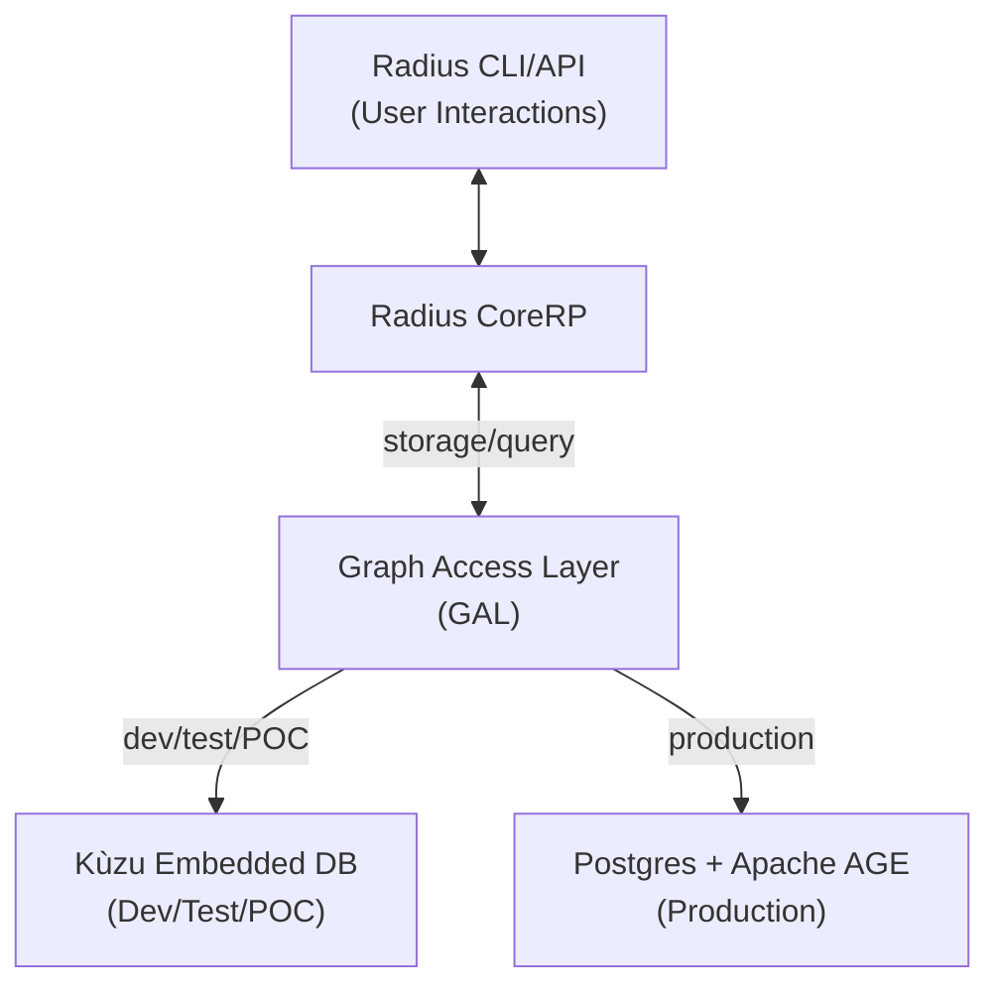
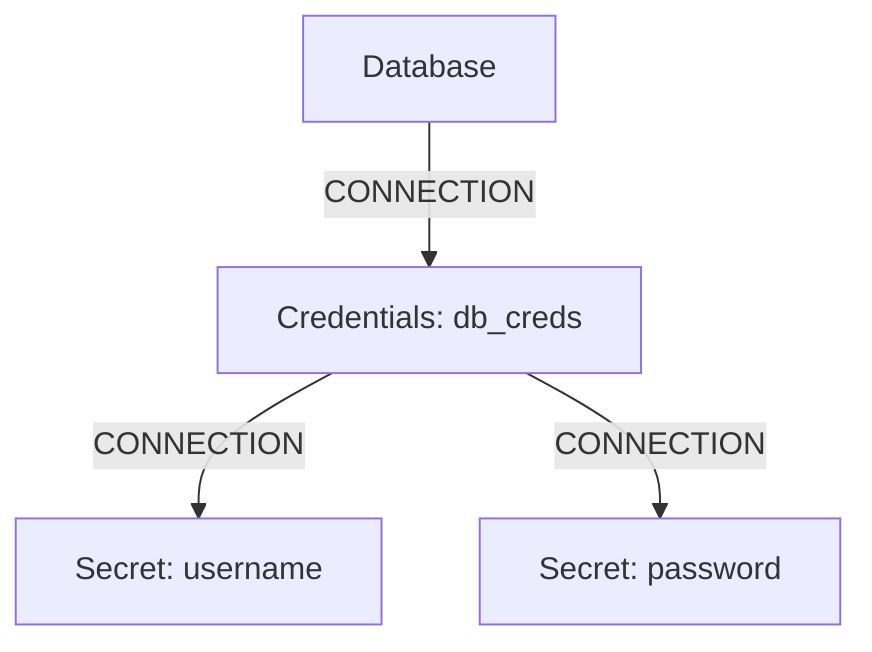

## Proposal: Integrating a Graph Database for Radius Application Graph

**Version:** 1.2
**Date:** June 11, 2025
**Author:** Sylvain Niles

---

### Overview

Project Radius currently defines and manages application graphs, representing resources and their relationships within cloud-native applications. Currently Radius relies on Kubernetes to install etcd, the default datastore, where these graph structures are stored as key value pairs. As we are adding support for nested connections the imperative Go code is becoming complex and brittle because it needs to implement basic graph traversal logic not present in etcd. Additionally we are already hitting performance limits in test environments (under a hundred resources were reported to slow things to a crawl) which inspired the work @superbeeny has done to swap the key value operations out to use postgres. Radius users could not use Drasi today to act on changes to their environments as there's no current support for key value stores and if that was added the client side filtering requirements would be a challenge in Drasi, requiring extensive middleware to parse the custom Radius data structures. 

This proposal outlines a plan to modify Project Radius to utilize a **graph database** as the primary store for its application graph, accessed via a new **Graph Access Layer (GAL)**. This change aims to decouple the core graph logic and operations from etcd, enabling more powerful graph queries, improving performance for complex relationship traversals, comparable performance to key value stores for non-graph storage/retrieval, and offering a more specialized and efficient graph persistence layer. One of the benefits to recipe authors is this will allow them to define nested connections of types to both return complex relationships and properties to a recipe as well as see these relationships in the graph/dashboard.

For development, testing, and proof-of-concept environments, we will provide Kùzu as the default embedded graph database. For production environments, the plan is to support Postgres with the Apache AGE plugin, which provides Cypher compatibility and is suitable for scalable, production-grade deployments. The GAL will be designed to support pluggable backends, allowing configuration of the graph database provider to be any supporting Cypher.

Delivering this will allow us to shift to a far better user experience where connections become a rich re-usable concept that shares data and exposes deep relationships currently obfuscated by monolithic types with embedded objects (ex: database has a credentials object with username and password properties).

### Terms and Definitions

* **Radius:** An open-source, cloud-native application platform that helps developers build, deploy, and manage applications across various environments.
* **Application Graph:** A representation of an application's components (resources, services, environments, etc.) as nodes and their interconnections as edges, including metadata on both.
* **Kubernetes (K8s):** An open-source system for automating deployment, scaling, and management of containerized applications.
* **Graph Access Layer (GAL):** The internal abstraction layer that mediates all graph operations between Radius components and the underlying graph database.
* **Kùzu:** An embeddable, transactional, high-performance graph database management system (GDBMS) supporting the Cypher query language and property graphs. Provided for dev/test/POC.
* **Postgres with Apache AGE:** A production-ready, scalable graph database solution supporting Cypher queries, built on PostgreSQL.
* **Node:** An entity in a graph (e.g., a Radius resource, an environment).
* **Edge:** A relationship between two nodes in a graph (e.g., "connectsTo", "runsIn"). All edges in Radius will be of type "CONNECTION".
* **Property:** Key-value pairs associated with nodes or edges, storing metadata.
* **Cypher:** A declarative graph query language.
* **RP (Resource Provider):** A component in Radius responsible for managing a specific type of resource.

### Objectives

1.  **Decouple Graph Storage:** Abstract the application graph storage from etcd, allowing Radius to use a dedicated graph database via the Graph Access Layer.
2.  **Enhance Query Capabilities:** Leverage Cypher query language for more complex and efficient graph traversals and relationship analysis than what is easily achievable with etcd retrieval and client side filtering.
3.  **Improve Performance:** Potentially improve the performance of graph read and write operations, especially for large or complex application graphs.
4.  **Maintain Existing Functionality:** Ensure that all existing Radius features that rely on the application graph continue to function correctly with the new backend.

### Issue Reference:

* `radius-project/radius#<NewIssueID>` (To be created)

### Goals

* Implement a Graph Access Layer (GAL) that abstracts graph operations with pluggable backend support.
* Integrate Kùzu as an embedded graph database for development, testing, and proof-of-concept environments.
* Develop Postgres with Apache AGE plugin support for production environments.
* Define a clear schema for the Radius application graph within both backends.
* Migrate existing graph data representation (currently in etcd/postgres) to the graph database data model.
* Update Radius RPs and controllers to use the new GAL for all graph-related operations.
* Provide migration tool for moving to graph db.
* Provide mechanisms for backup and potential restore of the graph database as part of Radius install/upgrade/rollback operations.
* Develop a comprehensive test suite covering graph operations with both backends.
* Add configuration options to select between graph database providers.


### Non-goals

* Providing a distributed Kùzu cluster as part of this initial integration (Kùzu is primarily embedded; clustering would be a separate, future consideration if needed).
* Exposing direct Cypher query capabilities to end-users of Radius (interaction should remain through Radius APIs and abstractions).
* Supporting zero-downtime migration from etcd to graph database (migration will require a maintenance window).

### User Scenarios (optional)

* **Scenario 1 (Developer):** A Radius developer needs to address performance issues for application graphs containing many resources. Retrieving all resources connected to a specific environment, which is a very expensive operation. Using Cypher through the GAL would be more expressive and orders of magnitude faster than multiple etcd calls and client-side filtering.
* **Scenario 2 (Developer):** A developer is troubleshooting a deployment that isn't working correctly. By examining the application graph through the new deeply nested app graph, they can see that their gateway resource is connected to two secret resources (crt and key), and upon inspection, they discover this certificate is for the wrong domain, explaining why their HTTPS connections are failing.

### User Experience (if applicable)

* **End-users (Application Developers using Radius CLI/APIs):** The change should be largely transparent. Existing commands and APIs for managing applications and resources should continue to work. Performance improvements might be noticeable.
* **Radius Developers/Contributors:** Will need to learn how to interact with the new GAL and potentially understand the graph data model and Cypher for advanced debugging or development. The graph implementation is fairly simple, with a small number of queries that should remain static, only new queries to support new functionality would require ramp-up on Cypher. Non-cloud test suites may speed up significantly.
* **Operators:** Will need to be aware of the new graph database component for backup, monitoring, and troubleshooting purposes. The operational burden of managing etcd for graph data would be shifted.

### Sample Input/Output:

**Example 1: Application Graph Query (replicating `rad app graph todo`)**

* **Sample Input:**
    ```
    // Show the full graph for the "todo" application with connections
    MATCH (app:Application {name: 'todo'})-[rel:CONNECTION]->(res:Resource)
    OPTIONAL MATCH (res)-[conn:CONNECTION]->(connected:Resource)
    RETURN app.name AS application, res.name AS resource, res.type AS resourceType, 
           collect(connected.name) AS connections
    ```

* **Sample Output:**
    ```json
    [
      {
        "application": "todo",
        "resource": "frontend",
        "resourceType": "Applications.Core/container",
        "connections": ["backend"]
      },
      {
        "application": "todo",
        "resource": "backend",
        "resourceType": "Applications.Core/container",
        "connections": ["todo-db", "redis-cache"]
      },
      {
        "application": "todo",
        "resource": "todo-db",
        "resourceType": "Applications.Core/postgres"
      },
      {
        "application": "todo",
        "resource": "redis-cache",
        "resourceType": "Applications.Core/redis"
      }
    ]
    ```

**Example 2: Troubleshooting Query (Scenario 2 - Finding certificate domains)**

* **Sample Input:**
    ```
    // Find all secrets connected to a gateway resource for certificate inspection
    MATCH (gateway:Resource {name: 'api-gateway', type: 'Applications.Core/gateway'})
    -[conn:CONNECTION]->(secret:Resource {type: 'Applications.Core/secret'})
    RETURN gateway.name AS gateway, secret.name AS secretName, 
           secret.properties.domain AS certificateDomain
    ```

* **Sample Output:**
    ```json
    [
      {
        "gateway": "api-gateway",
        "secretName": "tls-cert",
        "certificateDomain": "wrong-domain.com"
      },
      {
        "gateway": "api-gateway", 
        "secretName": "tls-key",
        "certificateDomain": "wrong-domain.com"
      }
    ]
    ```

### Design

#### High-Level Design

1.  **Introduce Graph Access Layer (GAL):** The GAL will be integrated as an internal service within the primary Radius component(s) responsible for managing the application graph (e.g., the Radius Core RP or a dedicated graph service).
2.  **Pluggable Backend Support:** The GAL will support both Kùzu (for dev/test/POC) and Postgres+AGE (for production), with configuration to select the backend.
3.  **Schema Definition:** A formal schema for Radius entities (Applications, Environments, Resources, etc. as nodes) and their relationships (as edges with types and properties) will be defined and enforced in both backends.
4.  **Data Synchronization/Migration:** Provide a migration tool to copy existing Radius environments/app graph to the newly installed graph db.
5.  **Component Updates:** All Radius components that currently interact with etcd or Postgres for graph information will be updated to use the new GAL for all graph-related operations.

#### Architecture Diagram



* **Current (Simplified):** Radius Core Components <-> etcd
* **Proposed:** Radius Core Components <-> Graph Access Layer <-> Graph Database (Kùzu or Postgres+AGE)

#### Detailed Design

1.  **Graph Access Layer (GAL) Implementation:**
    * The GAL will be implemented as a Go service that abstracts all graph operations.
    * It will provide a pluggable interface allowing different graph database backends.
    * Configuration will determine which backend to use (Kùzu for dev/test, Postgres+AGE for production).

2.  **Dev/Test/POC Backend - Kùzu Integration:**
    * The Kùzu Go driver (`github.com/kuzudb/go-kuzu`) will be used.
    * Kùzu database will be initialized during `rad init`. The database file (`radius_app_graph.kuzu`) will be stored on persistent storage accessible to the Radius control plane.
    * Initially CoreRP will move existing etcd CRUD operations to the GAL without using Kùzu.
    * Once the GAL is released Kùzu support will be added.

3.  **Production Backend - Postgres with Apache AGE:**
    * Postgres with Apache AGE plugin will be supported for production deployments.
    * Network-based connection using standard PostgreSQL drivers with AGE extensions.
    * Support for connection pooling, high availability, and scaling. (Can be a later phase)

4.  **Schema Management:**
    * A Go module will define constants for node labels (e.g., `NodeTypeApplication`, `NodeTypeResource`) and edge labels (all edges will be type `CONNECTION`).
    * On startup, Radius will ensure the schema (node tables, relationship tables, property definitions) exists in the backend, creating or migrating it if necessary.
    * Node properties will be strongly typed (string, int, bool, arrays, maps). Complex nested objects might need to be stored as JSON strings if direct support is limited, or flattened, but no current use case should require this.

5.  **Graph Access Layer (GAL) API:**
    * Example Go interface:
        ```go
        type GraphStore interface {
            // Node operations
            CreateNode(ctx context.Context, node Node) error
            GetNode(ctx context.Context, nodeID string) (Node, error)
            UpdateNodeProperties(ctx context.Context, nodeID string, properties map[string]interface{}) error
            DeleteNode(ctx context.Context, nodeID string) error // Handle cascading deletes for owned relationships

            // Edge operations (connections)
            CreateEdge(ctx context.Context, edge Edge) error
            GetEdge(ctx context.Context, fromNodeID, toNodeID string, edgeType string) (Edge, error) // Or a unique edge ID
            UpdateEdgeProperties(ctx context.Context, edgeID string, properties map[string]interface{}) error
            DeleteEdge(ctx context.Context, edgeID string) error

            // Query operations
            GetOutgoingNeighbors(ctx context.Context, nodeID string, edgeTypePattern string) ([]Node, error)
            GetIncomingNeighbors(ctx context.Context, nodeID string, edgeTypePattern string) ([]Node, error)
            FindPaths(ctx context.Context, startNodeID, endNodeID string, maxHops int) ([][]Node, error) // More complex queries
            ExecuteCypherQuery(ctx context.Context, query string, params map[string]interface{}) ([]map[string]interface{}, error) // For advanced internal use
        }

        type Node struct {
            ID         string
            Type       string // e.g., "Applications.Core/application"
            Properties map[string]interface{}
        }

        type Edge struct {
            ID         string // Optional, could be derived from both nodes
            FromNodeID string
            ToNodeID   string
            Type       string // e.g., "Connection"
            Properties map[string]interface{}
        }
        ```

4.  **Data Persistence and State:**
    * **Kùzu (Dev/Test/POC):** Kùzu runs embedded, so the Radius process managing it is authoritative. The database file (`radius_app_graph.kuzu`) is stored on persistent storage accessible to the Radius control plane.
    * **Postgres+AGE (Production):** Network-based connection with standard PostgreSQL high availability, clustering, and backup mechanisms.

5.  **Transaction Management:**
    * All compound operations (e.g., creating a resource node and its relationship edge) must be performed within a database transaction to ensure atomicity. The GAL will manage this.
    * Radius upgrades and rollbacks would need to coordinate with the GAL.

#### Advantages (of Graph Database via GAL over etcd/key value stores for graph storage)

* **Rich Querying:** Cypher provides significantly more powerful and expressive graph query capabilities than filtering etcd values client side.
* **Performance:** For complex graph traversals (multi-hop queries, pathfinding), a graph database is likely to be much faster as it's optimized for such operations. For Radius this would be during most recipe execution as the entire graph is rendered.
* **Specialized Data Store:** Graph databases are purpose-built for graph data, leading to efficient storage and indexing for graph structures while remaining performant for standard storage and retrieval operations of non-graph data.
* **Pluggable Backend:** The GAL will allow for Radius users to use any Cypher compatible graph database such as Neo4J or CosmosDB with Gremlin.
* **Transactional Guarantees:** Both Kùzu and Postgres with Apache AGE provide ACID transactions for graph operations, we've already encountered many situations where the graph is in a bad state from a test failing to clean up properly etc. We may be able to move the entire test framework to using transaction and rollback per test eliminating this problem entirely.
* **Schema Enforcement:** Better ability to define and enforce a graph schema.
* **Support for streaming monitoring of graph changes:** A project like Drasi cannot consume a change feed of the Radius app graph because it doesn't support key value stores and would require extensive middleware custom to Radius data structures to replicate the client side filtering necessary for identifying the changes desired.
* **Simplified Go Code:** Eliminates the complex imperative Go code currently required for creating and traversing key-value structures in etcd, replacing it with declarative Cypher queries that are more maintainable and less error-prone.

---

**Modeling Deep Relationships Instead of Monolithic Types**

Currently, many Radius resource types (such as databases) are modeled as monolithic objects with embedded properties or sub-objects. For example, a database resource might have a `credentials` object, which itself contains `username` and `password` properties. This approach makes it difficult to express and traverse relationships between resources, and limits reusability and visibility in the application graph.

With a graph database, these relationships can be modeled explicitly. Instead of embedding credentials as an object within the database resource, the database resource can be connected to a separate `credentials` resource(e.g., named `db_creds` of type `Credentials`). This credentials resource can then be connected to two `secret` resources representing the username and password. This approach enables:

- **Intuitive Use:** Resources can be accessed within the recipe context in an intuitive manner.
- **Visibility:** Relationships between deeply nested resources are explicit and queryable.
- **Extensibility:** New types of relationships or properties can be added without changing the monolithic resource schema. Future API versions could allow some properties to be private (not exposed by connection). For example, a new edge type "USED_BY" could link a recipe to all the resources using it across multiple environments and applications, enabling infrastructure operators to understand the impact of registering a new version of a recipe by querying which resources would be affected.


**Example Graph Structure:**


In this model:
- The `Database` node is connected to a `Credentials` node via a CONNECTION.
- The `Credentials` node is connected to two `Secret` nodes (for username and password) via CONNECTIONs.

This structure enables richer queries and recipe author use cases like `context.connected_resources.database.credentials.username` instead of only being able to access the embedded `credentials` object and requiring the recipe author to parse.
Additionally it provides a better separation of concerns, and a more flexible, maintainable application graph.

#### Disadvantages (of Graph Database integration)

* **New Dependency:** Introduces a graph database as a new core dependency for Radius, including its Go driver(s).
* **Operational Overhead:**
    * Managing the graph database file or instance (backups, storage).
    * Monitoring performance and health.
    * Requires persistent volume or managed database for production usage.
* **Complexity:** Adds a new layer (GAL, graph database integration) to the Radius architecture.
* **Learning Curve:** Radius developers might need to learn Cypher and the specifics of the chosen graph database(s).

#### Proposed Option

Integrate a **Graph Database** behind a **Graph Access Layer (GAL)** with pluggable backend support. Initially provide **Kùzu as an embedded graph database** for dev/test/POC environments and **Postgres with Apache AGE** for production environments. This approach balances the benefits of dedicated graph DB capabilities with flexibility in deployment scenarios.

### API design

The primary API change will be internal, within the Graph Access Layer (GAL) as described in "Detailed Design." External Radius APIs (e.g., `rad resource list`, `rad application graph`) should remain functionally the same, but their implementation will now call the GAL instead of directly querying etcd.

No changes to the public Radius REST API are anticipated initially, other than potential performance improvements or new (future) API endpoints that leverage advanced graph queries.

### CLI Design

* Existing `rad` CLI commands should continue to work transparently.

### Implementation Details


#### Core RP (Resource Provider)

* Core RP will use the GAL to manage the graph during deployment rendering and query the GAL for any app graph API requests.

### Error Handling

* The GAL will be responsible for translating backend-specific errors into standardized Radius errors.
* Errors such as database connection issues, query failures, transaction rollbacks, or schema violations must be handled gracefully.
* Retry mechanisms for transient errors will be implemented in the GAL.
* The GAL will integrate with the Radius OpenTelemetry implementation.

### Test plan

1.  **Unit Tests:**
    * Test individual functions within the Graph Access Layer (mocking graph database drivers).
    * Test schema creation and migration logic for both backends.
2.  **Integration Tests:**
    * Test the GAL against actual backend instances (both Kùzu and Postgres with Apache AGE).
    * Verify CRUD operations for nodes and edges with various property types.
    * Test transactional behavior for both backends.
    * Test Core RP interacting with the GAL-backed graph stores.
3.  **End-to-End (E2E) Tests:**
    * Adapt existing Radius E2E tests to ensure all application deployment and management scenarios function correctly with both graph backends.
    * Include tests for data persistence across Radius restarts and upgrades/rollbacks.
4.  **Performance Tests:**
    * Benchmark graph read/write operations with both backends against the current key/value based implementation for representative workloads.
    * Validate performance claims from the advantages section, specifically:
        * Complex graph traversal performance compared to etcd + client-side filtering
        * Recipe execution performance when rendering the entire graph
        * Query performance for large application graphs (100+ resources)
    * Test concurrent access to the graph for both backends.
    * Add checks to LRT Cluster for graph operations.
5.  **Backup/Restore Tests:**
    * Verify that database backups can be successfully created and restored for both backends.
6.  **Backend Compatibility Tests:**
    * Ensure identical behavior and results across Kùzu and Postgres with Apache AGE backends.
    * Test configuration switching between backends.

### Security

* **Data at Rest:** 
  * **Kùzu:** The database file (`radius_app_graph.kuzu`) contains the application graph data. It should be protected by appropriate file system permissions on the persistent volume where it's stored. 
  * **Postgres with Apache AGE:** Standard PostgreSQL security practices apply, including encryption at rest, access controls, and network security.
  * Encryption at rest for storage should be considered, managed by the underlying infrastructure (e.g., Kubernetes PV encryption).
* **Access Control:** Access to the graph database is through the GAL within the Radius process. Standard Radius authentication and authorization mechanisms (when implemented) will protect the Radius APIs that indirectly interact with the graph database. There is no direct network exposure of Kùzu in the embedded model. PostgreSQL with Apache AGE will use a standard networked database access model.
* **Input Sanitization:** If any user-provided data is used to construct Cypher queries (even if parameterized), ensure proper parameterization is always used by the GAL to prevent injection vulnerabilities.
* **Threat Model:** The Radius threat model must be updated to have a section for the GAL.

### Compatibility (optional)

* **Backward Compatibility:**
    * For existing Radius deployments using etcd as the graph store, a migration path will be necessary. 
    * The public Radius API and CLI should remain backward compatible.
* **Data Format:** The structure of the application graph (apps, resources, properties) should remain conceptually the same, even though the storage backend changes.
* **Backend Compatibility:** The GAL ensures that both Kùzu and Postgres with Apache AGE backends provide identical functionality and behavior to Radius components.

### Monitoring and Logging

* **Logging:**
    * The Graph Access Layer should log all significant operations (e.g., graph queries, errors, transaction boundaries) at appropriate log levels.
* **Metrics:**
    * Expose metrics from the GAL in Radius OpenTelemetry:
        * Number of graph queries (per type: read/write, per backend).
        * Latency of graph queries (per backend).
        * Error rates for graph operations (per backend).
        * Database size and health metrics.
        * Transaction commit/rollback counts (per backend).

### Development plan

0.  **Phase 0: GAL (Milestone 0)**
    * Create the GAL with pluggable backend interface.
    * Implement CRUD endpoints representing Radius abstraction level graph operations.
    * Develop initial unit & integration tests for the GAL.
    * Ensure via debug logging that no components are communicating directly with etcd other than the GAL.
1.  **Phase 1: Kùzu Integration (Milestone 1)**
    * Phase 1 will be worked on with etcd code still in use, a configuration flag will be used to use the graph backend so we can ship smaller change sets and users can test if desired.
    * Set up Kùzu as an embedded dependency with pluggable architecture.
    * Define and implement Kùzu schema creation.
    * Implement robust error handling and transaction management in the GAL for Kùzu backend.
    * Add Kùzu specific tests (schema creation, backup/restore, etc).
    * Modify Radius init and upgrade processes to trigger appropriate behavior in the GAL.
    * Write idempotent migration tool for etcd => graph db.
2.  **Phase 2: Postgres with Apache AGE Integration (Milestone 2)**
    * Research Postgres with Apache AGE capabilities and integration requirements.
    * Implement Postgres with Apache AGE backend for the GAL.
    * Ensure feature parity between Kùzu and Postgres with Apache AGE backends.
    * Add comprehensive tests for Postgres with Apache AGE backend.
    * Implement configuration options for backend selection.
3.  **Phase 3: Testing & Documentation (Milestone 3)**
    * Implement backup/restore CLI commands for both backends.
    * Conduct comprehensive E2E testing, performance testing, and security review.
    * Develop documentation for operators and developers.
4.  **Phase 4: Query Enhancement (Milestone 4 - optional)**
    * Enhance GAL with more advanced query capabilities (pathfinding, complex traversals, to support new User Stories defined by product).

### Open Questions

1.  **Schema Evolution:** How will schema changes (e.g., adding new node/edge types, new properties) be managed over time with Radius upgrades? This will be critical for the GAL to handle gracefully.
2.  **Resource Footprint:** What is the typical CPU, memory, and disk I/O footprint of each backend for representative Radius graph sizes?
3.  **Dashboard:** The changes proposed here such as nested types and expanded use of connections will make the app graph both richer and larger, the existing dashboard will probably need some UX design and work in order to leverage that effectively and intuitively.

### Alternatives considered

1.  **Continue using etcd:**
    * **Advantages:** Leverages existing Kubernetes provided etcd installation and expertise. No new database dependency.
    * **Disadvantages:** Limited query capabilities, known performance bottlenecks for sizeable application graphs, nested rendering logic very manual and complex, tightly coupled to key value stores.
2.  **Other Embedded Graph Databases (e.g., a Go-native one if a mature one exists):**
    * **Advantages:** Could offer tighter integration if fully Go-native.
    * **Disadvantages:** Kùzu is chosen for dev/test for its performance, Cypher support, and active development. A pure Go alternative might lack some of these mature features or performance characteristics.
3.  **Hosted/Server-based Graph Databases (e.g., Neo4j, Dgraph as a service, NebulaGraph):**
    * **Advantages:** Mature, feature-rich, often provide built-in clustering and HA.
    * **Disadvantages:** Adds significant operational complexity (managing a separate database cluster), network latency between Radius and the DB, cost, and deviates from the goal of a more self-contained/embeddable solution for core graph logic. This proposal prioritizes decoupling and enhancing capabilities with a pluggable solution first.