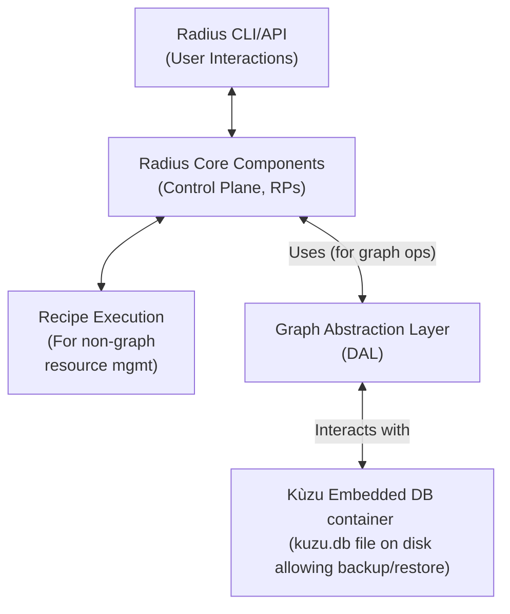
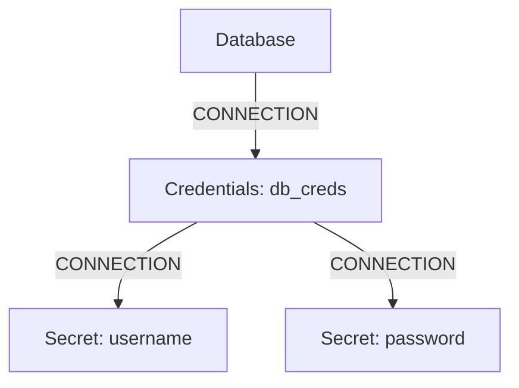

## Proposal: Integrating Kùzu for Radius Application Graph

**Version:** 1.0
**Date:** June 4, 2025
**Author:** Sylvain Niles

---

### Overview

Project Radius currently defines and manages application graphs, representing resources and their relationships within cloud-native applications. Currently Radius relies on Kubernetes to install etcd, the default datastore, where these graph structures are stored as key value pairs. As we are adding support for nested connections the imperative Go code is becoming complex and brittle because it needs to implement basic graph traversal logic not present in etcd. Additionally we are already hitting performance limits in test environments which inspired the work @superbeeny has done to swap the key value operations out to use postgres.

This proposal outlines a plan to modify Project Radius to utilize Kùzu, an embedded, high-performance graph database, as the primary store for its application graph. This change aims to decouple the core graph logic and operations from the underlying Kubernetes infrastructure, enabling more powerful graph queries, potentially improving performance for complex relationship traversals, and offering a more specialized and efficient graph persistence layer. One of the benefits to recipe authors is this will allow them to define nested connections of types to both return complex relationships and properties to a recipe as well as see these relationships in the graph/dashboard. This will also pave the way for Radius to operate more seamlessly in environments beyond Kubernetes or where direct Kubernetes API access for graph storage is not ideal.

Delivering this will allow us to shift to a far better user experience where connections become a rich re-usable concept that shares data and exposes deep relationships currently obfuscated by monolithic types with embedded objects (database has a credentials object with username and password properties).

### Terms and Definitions

* **Radius:** An open-source, cloud-native application platform that helps developers build, deploy, and manage applications across various environments.
* **Application Graph:** A representation of an application's components (resources, services, environments, etc.) as nodes and their interconnections as edges, including metadata on both.
* **Kubernetes (K8s):** An open-source system for automating deployment, scaling, and management of containerized applications.
* **CRDs (Custom Resource Definitions):** Extensions of the Kubernetes API that allow users to create custom resource types. Currently a common way Radius stores graph data in K8s.
* **Kùzu:** An embeddable, transactional, high-performance graph database management system (GDBMS) supporting the Cypher query language and property graphs.
* **Node:** An entity in a graph (e.g., a Radius resource, an environment).
* **Edge:** A relationship between two nodes in a graph (e.g., "connectsTo", "runsIn").
* **Property:** Key-value pairs associated with nodes or edges, storing metadata.
* **Cypher:** A declarative graph query language.
* **RP (Resource Provider):** A component in Radius responsible for managing a specific type of resource.

### Objectives

1.  **Decouple Graph Storage:** Abstract the application graph storage from Kubernetes CRDs, allowing Radius to use a dedicated graph database.
2.  **Enhance Query Capabilities:** Leverage Kùzu's Cypher query language for more complex and efficient graph traversals and relationship analysis than what is easily achievable with Kubernetes API queries.
3.  **Improve Performance:** Potentially improve the performance of graph read and write operations, especially for large or complex application graphs.
4.  **Increase Portability:** Facilitate the use of Radius in non-Kubernetes environments or scenarios where a dedicated graph store is preferred.
5.  **Maintain Existing Functionality:** Ensure that all existing Radius features that rely on the application graph continue to function correctly with Kùzu as the backend.

### Issue Reference:

* `radius-project/radius#<NewIssueID>` (To be created)

### Goals

* First step in allowing the Radius control plane to run outside Kubernetes.
* Integrate Kùzu as an embedded graph database within relevant Radius components (e.g., Core RP, Deployment Engine).
* Define a clear schema for the Radius application graph within Kùzu.
* Migrate existing graph data representation (currently in etcd/postgres) to the Kùzu data model.
* Implement a data access layer (DAL, name TBD) service that abstracts Kùzu operations (CRUD, queries) for other Radius components.
* Update Radius RPs and controllers to use the new Kùzu-backed DAL for all graph-related operations.
* Provide mechanisms for backup and potential restore of the Kùzu database as part of Radius install/upgrade/rollback operations.
* Develop a comprehensive test suite covering graph operations with Kùzu.
* Build this in a way that Kùzu could be swapped out for a network accessible graph database such as Neo4J or Postgres with Apache AGE extension.


### Non-goals

* Re-architecting more of Radius to eliminate Kubernetes as a dependency beyond the graph storage and access layer.
* Providing a distributed Kùzu cluster as part of this initial integration (Kùzu is primarily embedded; clustering would be a separate, future consideration if needed).
* Exposing direct Kùzu Cypher query capabilities to end-users of Radius (interaction should remain through Radius APIs and abstractions).
* Replacing all uses of the Kubernetes CRDs by Radius.
* Migrating existing Radius clusters to the new graph, a fresh install is required. (up for debate)

### User Scenarios (optional)

* **Scenario 1 (Developer):** A Radius developer needs to address performance issues for application graphs containing many resources. Retriving all resources connected to a specific environment, which is a very expensive operation. Using Cypher through the Kùzu DAL would be more expressive and orders of magnitude faster than multiple etcd calls and client-side filtering.
* **Scenario 2 (Platform Engineer):** A platform engineer wants to run Radius without Kubernetes, this is one of the decoupling features required. 

### User Experience (if applicable)

* **End-users (Application Developers using Radius CLI/APIs):** The change should be largely transparent. Existing commands and APIs for managing applications and resources should continue to work. Performance improvements might be noticeable.
* **Radius Developers/Contributors:** Will need to learn how to interact with the new Kùzu DAL and potentially understand the Kùzu data model and Cypher for advanced debugging or development.
* **Operators:** Will need to be aware of the new Kùzu database component for backup, monitoring, and troubleshooting purposes. The operational burden of managing etcd for graph data would be shifted.

### Sample Input/Output:

* **Sample Input (Conceptual Cypher Query via DAL, replicating `rad app graph todo`):**
    ```
    // Show the full graph for the "todo" application
    MATCH (app:Application {name: 'todo'})-[rel]->(res:Resource)
    RETURN app.name AS application, type(rel) AS relationship, res.name AS resource, res.type AS resourceType
    ```
* **Sample Output (from DAL):**
    ```json
    [
      {
        "application": "todo",
        "relationship": "CONTAINS",
        "resource": "frontend",
        "resourceType": "Applications.Core/container"
      },
      {
        "application": "todo",
        "relationship": "CONTAINS",
        "resource": "backend",
        "resourceType": "Applications.Core/container"
      },
      {
        "application": "todo",
        "relationship": "CONNECTS_TO",
        "resource": "todo-db",
        "resourceType": "Applications.Core/postgres"
      },
      {
        "application": "todo",
        "relationship": "CONNECTS_TO",
        "resource": "redis-cache",
        "resourceType": "Applications.Core/redis"
      }
    ]
    ```

### Design

#### High-Level Design

1.  **Introduce Kùzu:** Kùzu will be integrated as an embedded library within the primary Radius component(s) responsible for managing the application graph (e.g., the Radius Core RP or a dedicated graph service).
2.  **Graph Abstraction Layer:** A new internal service or Data Access Layer (DAL) will be created. This layer will provide an API for all graph operations (e.g., `listDeployments`, `listResources`, and allow new operations like `showDependencies(resource)`). Internally, this DAL will translate these requests into Kùzu operations (Cypher queries, API calls to Kùzu's Go driver).
3.  **Schema Definition:** A formal schema for Radius entities (Applications, Environments, Resources, etc. as nodes) and their relationships (as edges with types and properties) will be defined and enforced in Kùzu.
4.  **Data Synchronization/Migration:** No migration is planned.
5.  **Component Updates:** All Radius components that currently interact with Kubernetes CRDs for graph information will be updated to use the new Graph Abstraction Layer.

#### Architecture Diagram



* **Current (Simplified):** Radius Core Components <-> Kubernetes API Server (for CRD-based graph)
* **Proposed:** Radius Core Components <-> Graph Abstraction Layer <-> Kùzu Embedded DB

#### Detailed Design

1.  **Kùzu Integration:**
    * The Kùzu Go driver (`github.com/kuzudb/go-kuzu`) will be used.
    * Kùzu database will be initialized during `rad init`. The database file (`radius_app_graph.kuzu`) will be stored on ephemeral or persistent storage accessible to the Radius control plane. (requiring setup of a volume for laptop installations seems excessive)
    * Initially CoreRP will move CRUD operations using etcd to the DAL without using Kùzu.
    * Once the DAL is released Kùzu support will be added in a pluggable way, allowing for future network graph db support vs the embedded solution.

2.  **Schema Management:**
    * A Go module will define constants for node labels (e.g., `NodeTypeApplication`, `NodeTypeResource`) and edge labels (e.g., `EdgeTypeContains`, `EdgeTypeConnectsTo`).
    * On startup, Radius will ensure the schema (node tables, relationship tables, property definitions) exists in Kùzu, creating or migrating it if necessary.
    * Node properties will be strongly typed (string, int, bool, arrays, maps). Complex nested objects might need to be stored as JSON strings if Kùzu's direct support is limited, or flattened, but no current use case should require this.

3.  **Graph Abstraction Layer (DAL) API:**
    * Example Go interface:
        ```go
        type GraphStore interface {
            // Node operations
            CreateNode(ctx context.Context, node Node) error
            GetNode(ctx context.Context, nodeID string) (Node, error)
            UpdateNodeProperties(ctx context.Context, nodeID string, properties map[string]interface{}) error
            DeleteNode(ctx context.Context, nodeID string) error // Handle cascading deletes for owned relationships

            // Edge operations (connections)
            CreateEdge(ctx context.Context, edge Edge) error
            GetEdge(ctx context.Context, fromNodeID, toNodeID string, edgeType string) (Edge, error) // Or a unique edge ID
            UpdateEdgeProperties(ctx context.Context, edgeID string, properties map[string]interface{}) error
            DeleteEdge(ctx context.Context, edgeID string) error

            // Query operations
            GetOutgoingNeighbors(ctx context.Context, nodeID string, edgeTypePattern string) ([]Node, error)
            GetIncomingNeighbors(ctx context.Context, nodeID string, edgeTypePattern string) ([]Node, error)
            FindPaths(ctx context.Context, startNodeID, endNodeID string, maxHops int) ([][]Node, error) // More complex queries
            ExecuteCypherQuery(ctx context.Context, query string, params map[string]interface{}) ([]map[string]interface{}, error) // For advanced internal use
        }

        type Node struct {
            ID         string
            Type       string // e.g., "Applications.Core/application"
            Properties map[string]interface{}
        }

        type Edge struct {
            ID         string // Optional, could be derived from both nodes
            FromNodeID string
            ToNodeID   string
            Type       string // e.g., "Connection"
            Properties map[string]interface{}
        }
        ```

4.  **Data Persistence and State:**
    * Kùzu runs embedded, so the Radius process managing it is authoritative.
    * If a single DAL node in the cluster is unable to scale to the traffic of the cluster we would have to separate out write traffic to a single instance and reads could scale reasonably.
    * For this proposal, we assume a single active Radius DAL node is managing the Kùzu DB file for writes, with potential for read-only file replication for other instances if feasible and performant.

5.  **Transaction Management:**
    * All compound operations (e.g., creating a resource node and its relationship edge) must be performed within a Kùzu transaction to ensure atomicity. The DAL will manage this.
    * Radius upgrades and rollbacks would need to coordinate with the DAL.

#### Advantages (of Kùzu over K8s CRDs for graph storage)

* **Rich Querying:** Cypher provides significantly more powerful and expressive graph query capabilities than filtering etcd values client side.
* **Performance:** For complex graph traversals (multi-hop queries, pathfinding), Kùzu is likely to be much faster as it's optimized for such operations. For Radius this would be during most recipe execution as the entire graph is rendered.
* **Specialized Data Store:** Kùzu is purpose-built for graph data, leading to efficient storage and indexing for graph structures.
* **Decoupling from Kubernetes:** Reduces dependency on the K8s API server for core graph logic, improving portability and potentially reducing load on the K8s control plane for graph-heavy operations.
* **Not strongly tied to Kùzu** The DAL will allow for Radius users to use any Cypher compatible graph database such as Neo4J or CosmosDB with Gremlin.
* **Transactional Guarantees:** Kùzu provides ACID transactions for graph operations.
* **Schema Enforcement:** Better ability to define and enforce a graph schema within Kùzu.

---

**Modeling Deep Relationships Instead of Monolithic Types**

Currently, many Radius resource types (such as databases) are modeled as monolithic objects with embedded properties or sub-objects. For example, a database resource might have a `credentials` object, which itself contains `username` and `password` properties. This approach makes it difficult to express and traverse relationships between resources, and limits reusability and visibility in the application graph.

With a graph database like Kùzu, these relationships can be modeled explicitly. Instead of embedding credentials as an object within the database resource, the database node can be connected to a separate `credentials` node (e.g., named `db_creds` of type `Credentials`). This credentials node can then be connected to two `secret` nodes representing the username and password. This approach enables:

- **Reusability:** Credentials or secrets can be shared across multiple resources.
- **Visibility:** Relationships between resources, credentials, and secrets are explicit and queryable.
- **Extensibility:** New types of relationships or properties can be added without changing the monolithic resource schema. Future API versions could allow some properties to be private (not exposed by connection).


**Example Graph Structure:**


In this model:
- The `Database` node is connected to a `Credentials` node via a connection.
- The `Credentials` node is connected to two `Secret` nodes (for username and password) via connections.

This structure enables richer queries and recipe author use cases like `context.connected_resources.database.credentials.username` instead of only being able to access the embedded `credentials` object and requiring the recipe author to parse.
Additionally it provides a better separation of concerns, and a more flexible, maintainable application graph.

#### Disadvantages (of Kùzu integration)

* **New Dependency:** Introduces Kùzu as a new core dependency for Radius, including its Go driver.
* **Operational Overhead:**
    * Managing the Kùzu database file (backups, storage).
    * Monitoring Kùzu's performance and health. (LRT Cluster)
    * Requires persistent volume for the Kùzu database file. (Same as Postgres for production usage)
* **Complexity:** Adds a new layer (DAL, Kùzu integration) to the Radius architecture.
* **Embedded Nature & HA:** Kùzu's primary mode is embedded. Achieving high availability for the Kùzu store in a distributed Radius control plane requires careful design (e.g., leader election for the writer, replication strategy for readers, or a future Kùzu server mode). This proposal initially focuses on a simpler embedded model.
* **Learning Curve:** Radius developers might need to learn Kùzu and Cypher.

#### Proposed Option

Integrate **Kùzu as an embedded graph database** managed by a new Radius service. A Graph Abstraction Layer (DAL) will be developed to mediate all graph operations. This approach balances the benefits of a dedicated graph DB with the relative simplicity of an embedded solution for the initial phase.

### API design

The primary API change will be internal, within the Graph Abstraction Layer (DAL) as described in "Detailed Design." External Radius APIs (e.g., `rad resource list`, `rad application graph`) should remain functionally the same, but their implementation will now call the DAL instead of directly querying Kubernetes CRDs.

No changes to the public Radius REST API are anticipated initially, other than potential performance improvements or new (future) API endpoints that leverage advanced graph queries.

### CLI Design

* Existing `rad` CLI commands should continue to work transparently.

### Implementation Details


#### Core RP (Resource Provider)

* Core RP will use the DAL to manage the graph during deployment rendering and query the DAL for any app graph API requests.

### Error Handling

* The DAL will be responsible for translating Kùzu-specific errors into standardized Radius errors.
* Errors such as database connection issues, query failures, transaction rollbacks, or schema violations must be handled gracefully.
* Retry mechanisms for transient Kùzu errors will be implemented in the DAL.
* The DAL will integrate with the Radius OpenTelemetry implementation.

### Test plan

1.  **Unit Tests:**
    * Test individual functions within the Graph Abstraction Layer (mocking Kùzu Go driver).
    * Test Kùzu schema creation and migration logic.
2.  **Integration Tests:**
    * Test the DAL against an actual embedded Kùzu instance.
    * Verify CRUD operations for nodes and edges with various property types.
    * Test complex Cypher queries through the DAL.
    * Test transactional behavior.
    * Test Core RP interacting with the Kùzu-backed DAL.
3.  **End-to-End (E2E) Tests:**
    * Adapt existing Radius E2E tests to ensure all application deployment and management scenarios function correctly with Kùzu as the graph backend.
    * Include tests for data persistence across Radius restarts.
    * Test migration from CRD store to Kùzu store (if applicable).
4.  **Performance Tests:**
    * Benchmark graph read/write operations with Kùzu against the current CRD-based implementation for representative workloads.
    * Test concurrent access to the graph.
    * Add checks to LRT Cluster for graph operations.
5.  **Backup/Restore Tests:**
    * Verify that Kùzu database backups can be successfully created and restored.

### Security

* **Data at Rest:** The Kùzu database file (`radius_graph.kuzu`) contains the application graph data. It should be protected by appropriate file system permissions on the persistent volume where it's stored. Encryption at rest for the volume should be considered, managed by the underlying infrastructure (e.g., Kubernetes PV encryption).
* **Access Control:** Access to Kùzu is through the embedded Go driver within the Radius process. Standard Radius authentication and authorization mechanisms will protect the Radius APIs that indirectly interact with Kùzu. There is no direct network exposure of Kùzu in the embedded model.
* **Input Sanitization:** If any user-provided data is used to construct Cypher queries (even if parameterized), ensure proper parameterization is always used by the DAL to prevent injection vulnerabilities (Kùzu's Go driver should support parameterized queries).
* **Threat Model:** The Radius threat model must be updated to have a section for the DAL.

### Compatibility (optional)

* **Backward Compatibility:**
    * For existing Radius deployments using Kubernetes CRDs as the graph store, a migration path will be necessary. This could involve a period where Radius supports both backends, or a one-time migration tool. Currently we don't promise backward compatibility so no migration tool is planned.
    * The public Radius API and CLI should remain backward compatible.
* **Data Format:** The structure of the application graph (apps, resources, properties) should remain conceptually the same, even though the storage backend changes.

### Monitoring and Logging

* **Logging:**
    * The Graph Abstraction Layer should log all significant operations (e.g., Kùzu queries, errors, transaction boundaries) at appropriate log levels.
* **Metrics:**
    * Expose metrics from the DAL in Radius OpenTelemetry:
        * Number of Kùzu queries (per type: read/write).
        * Latency of Kùzu queries.
        * Error rates for Kùzu operations.
        * Kùzu database size.
        * Transaction commit/rollback counts.

### Development plan

0.  **Phase 0: DAL (Milestone 0)**
    * Create the DAL.
    * Implement CRUD endpoints representing Radius abstraction level graph operations.
    * Develop initial unit & integration tests for the DAL.
    * Ensure via debug logging that no components are communicating with the planes CRD other than the DAL.
1.  **Phase 1: Core Integration (Milestone 1)**
    * Research Kùzu Go driver capabilities and limitations in detail.
    * Set up Kùzu as an embedded dependency - but as a pluggable architecture where the embedded calls could be swapped for network calls to any Cypher compatible graph database.
    * Define and implement Kùzu schema creation.
    * Implement robust error handling and transaction management in the DAL.
    * Add Kùzu specific tests (schema creation, backup/restore, etc)
    * Modify Radius init and upgrade processes to trigger appropriate behavior in the DAL.
4.  **Phase 2: Tooling & Testing (Milestone 2)**
    * Implement backup/restore CLI commands.
    * Conduct comprehensive E2E testing, performance testing, and security review of DAL threat model.
    * Develop documentation for operators and developers.
3.  **Phase 2: Query Enhancement (Milestone 3 - optional)**
    * Enhance DAL with more advanced query capabilities (pathfinding, complex traversals, to support new User Stories defined by product).

### Open Questions

1.  **Kùzu Performance under Concurrent Go Routines:** How well does Kùzu's Go driver and embedded database handle high concurrency from multiple goroutines within a single Radius process? Are there internal locking mechanisms in Kùzu to be aware of?
2.  **Schema Evolution:** How will schema changes in Kùzu (e.g., adding new node/edge types, new properties) be managed over time with Radius updates?
3.  **Kùzu Resource Footprint:** What is the typical CPU, memory, and disk I/O footprint of an embedded Kùzu instance for representative Radius graph sizes?

### Alternatives considered

1.  **Continue using Kubernetes CRDs:**
    * **Advantages:** Leverages existing Kubernetes infrastructure and expertise. No new database dependency.
    * **Disadvantages:** Limited query capabilities, potential performance bottlenecks for complex graph operations, nested rendering logic very manual and complex, tightly coupled to Kubernetes.
2.  **Other Embedded Graph Databases (e.g., a Go-native one if a mature one exists):**
    * **Advantages:** Could offer tighter integration if fully Go-native.
    * **Disadvantages:** Kùzu is chosen for its performance, Cypher support, and active development. A pure Go alternative might lack some of these mature features or performance characteristics.
3.  **Hosted/Server-based Graph Databases (e.g., Neo4j, Dgraph as a service, NebulaGraph):**
    * **Advantages:** Mature, feature-rich, often provide built-in clustering and HA.
    * **Disadvantages:** Adds significant operational complexity (managing a separate database cluster), network latency between Radius and the DB, cost, and deviates from the goal of a more self-contained/embeddable solution for core graph logic. This proposal prioritizes decoupling and enhancing capabilities with an embedded solution first.