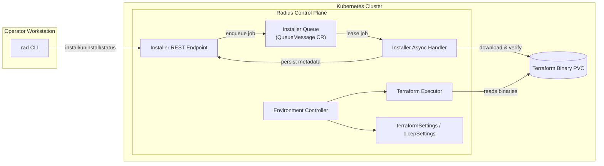

# Terraform & Bicep Settings Lifecycle Refresh

- **Author**: Yetkin Timocin (@ytimocin)

## Overview

We will externalize Radius Terraform and Bicep recipe configuration into dedicated settings resources, centralize Terraform binary lifecycle, and let platform teams supply Terraform settings exactly as they do today. This keeps Radius orchestration intact while removing opinionated guardrails that block mature Terraform estates. The work is anchored to the feature spec [`2025-08-14-terraform-bicep-settings.md`](../features/2025-08-14-terraform-bicep-settings.md).

## Terms and Definitions

- **TerraformSettings**: New `Radius.Core/terraformSettings` resource encapsulating `.terraformrc`, backend, environment, and logging settings. Migrates everything currently in `recipeConfig.terraform` (provider mirrors/credentials, backend blocks, `env` variables, trace logging flags) while shifting env secret injection to recipe parameters.
- **BicepSettings**: New `Radius.Core/bicepSettings` resource describing registry authentication. Carries forward the existing `recipeConfig.bicep.authentication` map (registry host → secret ID); no additional Bicep settings exist today.
- **Installer Async Handler**: Implementation registered with the existing async worker service (`pkg/server/asyncworker.go`) that consumes install/uninstall queue messages (`pkg/components/queue`) and manages Terraform binaries.

## Objectives

> **Issue Reference:** <https://github.com/radius-project/radius/issues/10615>

### Goals

**Terraform**

- Add `Radius.Core/terraformSettings` resources and wire `Radius.Core/environments` (the new environment type) to reference reusable configuration.
- Introduce an installer async pipeline and CLI-driven Terraform binary lifecycle (`rad terraform install|uninstall|status`) with operator control over version, source URL, and checksum.
- Allow Terraform settings (provider mirrors, credentials, env vars, backend blocks) to flow through unchanged so Radius is unopinionated about Terraform configuration.
- Deliver Phase 1 with the existing Kubernetes backend, and stage AzureRM/S3 backend support as Phase 2 follow-up while keeping Tier-2 backends on the roadmap (for example `oss`, `gcs`, `http`, `oci`, `pg`, `cos`).

**Bicep**

- Add `bicepSettings` resources so registry authentication is reusable outside `recipeConfig`.
- Preserve support for BasicAuth, Azure workload identity, and AWS IRSA secret injection with no new runtime behaviors.

### Non Goals

- Delivering `terraform plan` functionality (covered by a future spec).
- Enabling non-Kubernetes Terraform backends in Phase 1. AzureRM and S3 land in Phase 2; the rest of the Tier-2 backlog remains out of scope here.
- Reworking Bicep execution beyond registry authentication parity.
- Adding new capabilities for legacy `Applications.Core/environments`.
- Changing recipe parameter or SecretStore semantics; env secret injection continues via recipe parameters.
- Modifying Bicep runtime behavior or the bundled Bicep CLI; only registry authentication moves into `bicepSettings`.

### User Scenarios (optional)

#### User Story 1 - Terraform lifecycle

A platform engineer runs `rad terraform install --version 1.6.4 --wait` to seed the control plane with the organization's pinned Terraform build. The installer async handler downloads from the internal mirror, validates the checksum, writes metadata, and exposes status. A follow-up `rad terraform install --version 1.7.0` automatically queues behind the first job and runs after it completes. The engineer confirms success with `rad terraform status` before dispatching recipe executions. Result: the control plane holds a single active Terraform version at any time, and sequential installs guard against race conditions or partial upgrades.

#### User Story 2 - Migrating settings

Another engineer owns an environment that still uses `recipeConfig`. They deploy a new `terraformSettings` resource mirroring their existing `.terraformrc`, backend block, and env vars, plus a `bicepSettings` resource for private registries. After updating the environment to reference the new resources, the controller emits warnings and telemetry while legacy fields remain, confirming the new settings path is active. Recipes keep running with no downtime, and operators can remove the old configuration once their automation is updated.

## User Experience (if applicable)

**Sample Input:**

```bash
rad terraform install --version 1.6.4
rad terraform status
```

**Sample Output:**

```text
Terraform 1.6.4 install started...
Terraform 1.6.4 ready (installed 2025-10-10T10:30Z)
```

## Design

### High Level Design

- Environments (`Radius.Core/environments`) reference `terraformSettings` / `bicepSettings` resources.
- `Radius.Core/environments` controller consumes the new settings resources exclusively, while the legacy `Applications.Core/environments` controller continues to serve existing `recipeConfig` callers until that surface is retired.
- Installer REST endpoint stores install/uninstall requests in a dedicated async queue (`pkg/components/queue/queueprovider`) configured with single-flight semantics. The installer async handler (running inside the existing worker service) consumes jobs sequentially, manages binaries on the shared Terraform storage, and updates status metadata. (The Helm chart will drop the old init-container download path in favor of this queue-driven workflow.)
- Terraform executor resolves versioned binary paths, renders `.terraformrc`, configures backends, and emits structured logs.

### Terraform Binary Architecture

With this design, Terraform binaries are **no longer installed in RP pods** via init-containers. Instead:

- **Installation**: Platform engineers explicitly install Terraform using `rad terraform install`. The installer async handler downloads the binary, verifies the checksum, and stores it on a shared PVC.
- **Storage**: Binaries are stored at `/mnt/radius-terraform/<version>/` on a Persistent Volume Claim (PVC) mounted by the async worker service.
- **Execution**: The Terraform executor (running in the async worker service) reads binaries from the shared PVC. Recipe execution creates working directories per execution in the same pod.
- **No pod restart required**: Since binaries are on a shared volume, installing or upgrading Terraform does not require restarting any pods.
- **Single active version**: The control plane maintains one active Terraform version at a time. Sequential installs are queued and processed in order.

### Architecture Diagram



### Detailed Design

- TypeSpec adds `Radius.Core/terraformSettings@2025-08-01-preview` and `Radius.Core/bicepSettings@2025-08-01-preview` aligned with the feature spec.
- The `Radius.Core/environments` controller sources Terraform/Bicep inputs exclusively from the new settings resources, while the legacy `Applications.Core/environments` controller continues serving `recipeConfig` callers until deprecation. Both paths reuse the existing air-gapped download/auth/TLS helpers so we avoid duplicating plumbing.
- Installer async handler (plugged into the existing worker pipeline in `pkg/server/asyncworker.go`) downloads Terraform binaries, verifies checksums, persists version metadata (requested URL, checksum, install timestamp, health) in installer status storage, and places binaries on the shared PVC mount (for example `/mnt/radius-terraform/<version>/`). Its queue is configured with `MaxOperationConcurrency = 1`, so install/uninstall jobs execute strictly in submission order.
- **Uninstall safety**: Before removing a binary, the uninstall handler:
  1. Queries active recipe executions to check if any are using Terraform
  2. If executions are in progress, rejects with error: "Terraform is in use by N active executions. Retry after executions complete."
  3. Marks the version as `pending-deletion` in status storage
  4. Waits for a configurable drain period (default: 30 seconds) to allow in-flight operations to complete
  5. Re-checks for active executions; if still in use, fails with timeout error
  6. Only deletes the binary if no executions reference it
- CLI invokes installer APIs for install/uninstall/status; Phase 2 may add a `validate` call that reuses the same infrastructure when preflight checks are implemented.
- TerraformSettings serializer covers `.terraformrc` (provider mirrors, credentials, env vars) and backend blocks. Phase 1 keeps the existing Kubernetes backend adapter; AzureRM/S3 adapters plug in during Phase 2, with other backends passed through without managed auth until prioritized.
- **Secret handling clarification**:
  - **`terraformSettings.terraformrc.credentials`**: Contains `SecretReference` values (`{secretId, key}`) for Terraform Cloud/Enterprise tokens. Secrets are fetched at recipe execution time, never persisted.
  - **`terraformSettings.env`**: Contains **non-sensitive** environment variables only (e.g., `TF_LOG`, `TF_REGISTRY_CLIENT_TIMEOUT`). For sensitive values that must be passed as environment variables, use recipe parameters with `SecretReference` instead.
  - **`terraformSettings.backend.config`**: For Phase 1 (Kubernetes backend), no secrets are needed. For Phase 2 backends (AzureRM, S3), authentication credentials will use `SecretReference` fields (e.g., `accessKey: {secretId, key}`).
  - **`bicepSettings.authentication.registries.*.basic`**: Uses `SecretReference` for password/secret fields.
  - All secrets resolve at runtime via `Radius.Security/secrets`; the settings resources store only references, never plaintext values.
- **Migration precedence**: When an environment has both `recipeConfig` (legacy) and references to the new settings resources, the new settings resources take precedence. Specifically:
  - If `terraformSettings` reference exists, `recipeConfig.terraform` is ignored entirely
  - If `bicepSettings` reference exists, `recipeConfig.bicep` is ignored entirely
  - Controllers emit deprecation warnings listing which `recipeConfig` fields are being ignored
  - This deterministic rule prevents ambiguous merging behavior and encourages clean migration
- Recipe execution resolves the binary path via the stored metadata. Note: All environments share the single globally-installed Terraform version.
- **Reference tracking**: Settings resources track which environments reference them (similar to Recipe Packs). This enables:
  - Listing environments that use a settings resource
  - Preventing deletion of settings resources that are still in use
  - Proper cleanup when environments are deleted (removes reference, not the settings resource itself)

**Terraform settings example**

```bicep
resource corpTerraformSettings 'Radius.Core/terraformSettings@2025-08-01-preview' = {
  name: 'corpTerraformSettings'
  properties: {
    terraformrc: {
      providerInstallation: {
        networkMirror: {
          url: 'https://mirror.corp.example.com/terraform/providers'
          include: [
            '*'
          ]
          exclude: [
            'hashicorp/azurerm'
          ]
        }
        direct: {
          exclude: [
            'hashicorp/azurerm'
          ]
        }
      }

      credentials: {
        'app.terraform.io': {
          token: {
            secretId: '/planes/radius/local/providers/Radius.Security/secrets/tfc-token'
            key: 'token'
          }
        }
      }
    }

    backend: {
      type: 'kubernetes'
      config: {
        secretSuffix: 'prod-terraform-state'
        namespace: 'radius-system'
      }
    }

    env: {
      TF_LOG: 'TRACE'
      TF_REGISTRY_CLIENT_TIMEOUT: '15'
    }

    logging: {
      level: 'TRACE'
    }
  }
}
```

**Environment referencing settings resources**

Environments reference settings resources via their resource IDs. A single settings resource can be shared across multiple environments:

```bicep
resource prodEnvironment 'Radius.Core/environments@2025-08-01-preview' = {
  name: 'prod'
  properties: {
    compute: {
      kind: 'kubernetes'
      namespace: 'prod-apps'
    }
    terraformSettings: corpTerraformSettings.id
    bicepSettings: corpBicepSettings.id
  }
}
```

If `terraformSettings` is not specified, Terraform recipes will fail with an error requiring explicit configuration. If `bicepSettings` is not specified, Bicep recipes work with public registries only (no authentication).

Bicep auth supports BasicAuth, Azure workload identity, and AWS IRSA. Example below uses BasicAuth; the others follow the same registry map.

**Bicep settings example**

```bicep
resource corpBicepSettings 'Radius.Core/bicepSettings@2025-08-01-preview' = {
  name: 'corpBicepSettings'
  properties: {
    authentication: {
      registries: {
        'bicep.azurecr.io': {
          basic: {
            username: 'bicep-registry-user'
            password: {
              secretId: '/planes/radius/local/providers/Radius.Security/secrets/bicep-registry'
              key: 'password'
            }
          }
        }
      }
    }
  }
}
```

### API Design (if applicable)

- New ARM resources `Radius.Core/terraformSettings` and `Radius.Core/bicepSettings` (preview `2025-08-01`).
- Installer REST endpoints:
  - `POST /installer/terraform/install` `{ "version": "1.6.4", "source": {...} }`
  - `POST /installer/terraform/uninstall` _(uninstalls the current version)_
  - `GET /installer/terraform/status`
  - _(Phase 2 nice-to-have)_ `POST /installer/terraform/validate` `{ "environmentId": "/.../environments/my-env" }`

**Installer Status Schema**

The `GET /installer/terraform/status` endpoint returns:

```json
{
  "currentVersion": "1.6.4",
  "state": "ready",
  "binaryPath": "/mnt/radius-terraform/1.6.4/terraform",
  "installedAt": "2025-10-10T10:30:00Z",
  "source": {
    "url": "https://releases.hashicorp.com/terraform/1.6.4/terraform_1.6.4_linux_amd64.zip",
    "checksum": "sha256:abc123..."
  },
  "queue": {
    "pending": 0,
    "inProgress": null
  },
  "history": [
    {
      "version": "1.6.4",
      "operation": "install",
      "state": "succeeded",
      "startedAt": "2025-10-10T10:29:00Z",
      "completedAt": "2025-10-10T10:30:00Z"
    }
  ]
}
```

**State values**: `not-installed`, `installing`, `ready`, `uninstalling`, `pending-deletion`, `failed`

### CLI Design (if applicable)

- `rad terraform install [--version|--url|--checksum|--ca-bundle]` _(required by feature spec)_
- `rad terraform uninstall` _(required by feature spec; uninstalls the current version)_
- `rad terraform status` _(new; surfaces installer async status persisted by the worker so operators can diagnose installs quickly)_
- _(Phase 2 nice-to-have)_ `rad terraform validate --environment <envId>` to run preflight backend/env checks ahead of recipe execution.

**Sync / Async Options**

- `rad terraform install` and `rad terraform uninstall` accept an optional `--wait` flag. By default the command returns immediately after submitting the request (async). When `--wait` is supplied the CLI polls status until the operation succeeds or fails, giving teams flexibility for interactive or automated flows.
- `--wait` uses a default timeout of 10 minutes. Use `--wait --timeout <duration>` to override (e.g., `--timeout 30m` for large downloads over slow connections).

**Idempotency and Conflict Handling**

- **Duplicate installs**: If `rad terraform install --version 1.6.4` is called when version 1.6.4 is already installed and healthy, the command returns success immediately without re-downloading. This makes install calls safe to retry in CI/CD pipelines.
- **Version upgrade**: If a different version is requested (e.g., 1.7.0 when 1.6.4 is installed), the new version is queued for installation. The previous version is retained until the new install succeeds.
- **Concurrent requests**: Multiple concurrent install requests for the same version are deduplicated by the queue handler—only one download occurs. Different version requests are queued and processed sequentially (`MaxOperationConcurrency = 1`).
- **In-progress conflict**: If an install is already in progress, new requests are queued. The CLI (without `--wait`) returns immediately with status "queued". With `--wait`, it polls until the queued operation completes.
- **Failed retry**: If an install fails, the same version can be retried. The failed attempt is marked in status history for debugging.

**Why Async?**

- Terraform archives can be large; async avoids CLI timeouts and survives terminal disconnects.
- The installer queue runs with `MaxOperationConcurrency = 1`, so installs run in order and `rad terraform status`/`--wait` can gate follow-on steps.

### Implementation Details

#### UCP (if applicable)

- Register an installer-specific async handler with the existing worker service (`pkg/server/asyncworker.go`). Installer REST endpoints enqueue jobs using `pkg/components/queue` under a dedicated queue name configured with `MaxOperationConcurrency = 1`, and that worker loop dequeues and executes jobs sequentially—so no new Kubernetes controller is required.

- Ensure Helm charts mount Terraform binary PVC and expose installer endpoints.

#### Core RP (if applicable)

- Wire the new `Radius.Core/environments` controller to resolve settings and validate secrets/backends, while keeping the legacy controller focused on `recipeConfig` until retirement.

#### Portable Resources / Recipes RP (if applicable)

- Terraform driver consumes `terraformSettings` data for `.terraformrc`, backend config, env vars, and logging. Secret injection for custom providers continues via recipe parameters referencing Radius Secrets; no sensitive values are persisted.
- Read `bicepSettings` for registry auth (BasicAuth, Azure workload identity, AWS IRSA) and drop the legacy Secret kind switch; no execution changes beyond reference handling. Azure WI client/tenant IDs and AWS IAM ARN remain plain properties (not Secrets) per the feature spec.

### Error Handling

- If a download or checksum verification step fails, we keep the previous Terraform version (if any) and mark the install as failed so operators can retry.
- When required secrets or backend settings are missing, the environment reconcile stops before any Terraform code runs.
- CLI commands return clear errors such as “install in progress, retry after status shows Succeeded” so users know what to do next.

## Test Plan

- Unit tests cover the new schemas, installer REST endpoints, queue handler, and CLI flag parsing.
- Integration tests cover sequential installs, status reporting, rollback behaviour, and the legacy fallback path.
- Functional pipelines run `rad terraform install` before Terraform recipes and verify that recipes succeed with the new settings resources.

## Security

- Secrets stay in `Radius.Security/secrets`; we only fetch them at runtime and never write the values to disk or logs.
- Installer downloads use HTTPS, and operators can supply custom CA bundles when needed.
- **Installer RBAC**: The installer REST endpoints require the caller to have the `Radius.Core/installer/write` permission for install/uninstall operations and `Radius.Core/installer/read` for status queries. These permissions are granted by default to the `radius-admin` role. Audit logs record the caller identity, operation type, requested version, and timestamp for all installer operations.
- Settings resources (`terraformSettings`, `bicepSettings`) follow standard ARM RBAC—callers need appropriate `read`/`write` permissions on the resource scope.

## Compatibility (Optional)

- `Applications.Core/environments` keep working during migration; we emit warnings when legacy `recipeConfig` is still in use.
- The new CLI is required for installer commands, but older CLIs continue to run legacy recipes until environments migrate.

## Upgrade Considerations

This feature introduces a **breaking change** for existing Terraform recipe users:

### Breaking Change

After upgrading to a Radius version with this feature, Terraform recipes will fail until `rad terraform install` is executed. The old init-container-based Terraform download is removed.

### Required Post-Upgrade Steps

1. **Install Terraform**: After Helm upgrade, run `rad terraform install --version <desired-version>` to install the Terraform binary.
2. **Verify installation**: Run `rad terraform status` to confirm Terraform is ready.
3. **Deploy settings resources**: Create and deploy `terraformSettings` and/or `bicepSettings` resources as needed.
4. **Update environments**: Reference the new settings resources from your environments.

### Error Handling

If Terraform is not installed, recipe execution will fail with a clear error message: "Terraform is not installed. Run 'rad terraform install' to install Terraform."

### Terraform Version Compatibility

Terraform maintains backward compatibility for state files - newer Terraform versions can read state created by older versions. When upgrading Terraform versions, this is the platform engineer's responsibility to validate. Radius does not track which Terraform version was used to deploy resources.

### State Migration

Terraform state migration (e.g., from Kubernetes backend to AzureRM or S3) is **out of scope**. Users must handle state migration manually using `terraform state` commands before changing backend configurations in `terraformSettings`.

## Monitoring and Logging

- Metrics track queue depth, install/uninstall duration, success and failure counts, and the active Terraform version.
- Logs include environment IDs, Terraform versions, and correlation IDs; Terraform stdout/stderr continues to flow through the standard sink.
- Distributed traces wrap installer requests and Terraform execution so operators can see end-to-end timing.

## Deployment Considerations

- **Helm Upgrades**: the chart mounts the shared Terraform PVC and registers the installer queue (single concurrency). After upgrading, operators run `rad terraform install` to seed the desired version, then deploy `terraformSettings`/`bicepSettings` like any other ARM resource.
- **GitOps**: commit the new settings resources to your repo and add a bootstrap step (pipeline or operator action) that runs the installer so Flux/Argo has a Terraform binary available.
- **Air-gapped**: The installer accepts mirror URLs, checksums, and TLS bundles directly via CLI flags (`--url`, `--checksum`, `--ca-bundle`). These are independent of `terraformSettings`, which configures provider mirrors and registries used during recipe execution. This separation allows Terraform to be installed before any `terraformSettings` resource exists.

## Development Plan

Work delivers in two phases.

1. **Phase 1 - Core Implementation**

   1. Add REST controllers for `Radius.Core/terraformSettings` and `Radius.Core/bicepSettings`, assuming the new namespace wiring lands upstream. Support CRUD operations with unit tests so these resources can stand on their own before environments reference them.
   2. Add `terraformSettings` / `bicepSettings` TypeSpec definitions, regenerate SDKs, and update datamodel converters. Include unit tests for the new schemas and conversions.
      - Reuse the shapes and conversion coverage already prototyped in the air-gapped work as the authoritative source for mirror/module registry/version/TLS/auth fields.
   3. Introduce installer status storage (datamodel + persistence layer) and the installer REST endpoints (install/uninstall/status) including request validation and unit tests.
   4. Register a dedicated installer queue/worker with `MaxOperationConcurrency = 1`; implement the async handler that downloads, verifies, and stages Terraform binaries with `current/previous` symlink management. Add integration tests exercising sequential installs and failure rollback.
   5. Implement binary lifecycle helpers (mirror downloads, checksum validation, PVC layout) and ensure uninstall removes unused versions only when idle. Cover these helpers with unit tests.
      - Lift validation and mirror logic out of existing air-gapped install code so the installer reuses hardened paths.
   6. Update the `rad` CLI with `terraform install|uninstall|status --wait` semantics, polling logic, and CLI unit tests.
   7. Teach the new `Radius.Core/environments` controller/executors to consume `terraformSettings`/`bicepSettings`, keep the legacy controller reading `recipeConfig`, and emit adoption telemetry. Update regression tests to cover both paths.
      - Adapt existing air-gapped wiring for provider mirror auth, env/secret extraction, and registry logging to pull data from the new settings resources instead of `recipeConfig`.
   8. Add migration scaffolding (warnings + legacy compatibility checks) and integration tests that submit sequential installs, conflicting installs, and migrations.
      - Reuse secret-tracking helpers so migrations surface missing secrets when environments move off legacy configuration.
   9. Update deployment assets (Helm values/ConfigMaps) to provision the installer queue, PVC mounts, default Terraform download settings, and adjust CI pipelines so they seed Terraform via the installer.

   - Carry forward the Terraform log-level plumbing from existing air-gapped work so trace logging is available once installs run through the new pipeline.

2. **Phase 2 - Enhancements & Nice-to-haves**
   1. Add first-class AzureRM and S3 backend support for Terraform recipes, including controller validation, secret plumbing, and functional coverage.
   2. Implement `rad terraform validate` (Phase 2 nice-to-have; preflight backend/env checks) leveraging installer status metadata.
      - Build atop existing backend/TLS verification routines that already test connectivity to mirrors and inject CA bundles.
   3. Provide `rad terraform migrate` tooling to move environments off `recipeConfig`.
   4. Add richer telemetry/dashboards, documentation polish, and any optional automation once adoption targets are met.

## Open Questions

- Add Radius.Core routing for `terraformSettings` and `bicepSettings`: a parallel effort is introducing the namespace/builder wiring. Our handler work depends on its arrival; if it slips, only unit tests will pass until routing exists.

## Alternatives Considered

- **Controller vs. other install mechanisms**
  - Keep the initContainer and let it pull from mirrors (rejected: still per-pod download, no central version control, contradicts spec).
  - Bake Terraform into the Application RP image (rejected: single version for all environments, rebuilds required for upgrades, no rollback validation).
  - Run ad-hoc installer Jobs from the CLI (rejected: lacks idempotency/status, prone to race conditions, no persisted metadata).
  - Require external tooling to provision Terraform binaries (rejected: Radius would not meet the spec requirement to install/manage Terraform).
- Encode settings per Environment only (rejected: no reuse/sharing, hard to manage at scale).

## Design Review Notes

_TBD post review_
