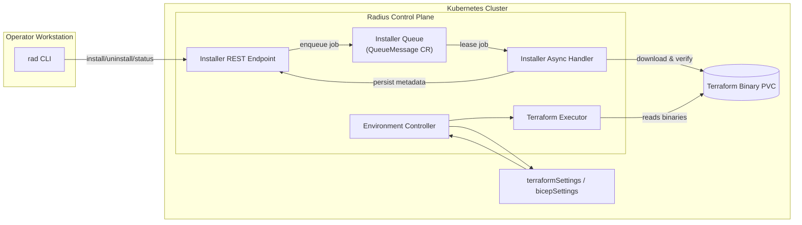

# Terraform & Bicep Settings Lifecycle Refresh

- **Author**: Yetkin Timocin (@ytimocin)

## Overview

We will externalize Radius Terraform and Bicep recipe configuration into dedicated settings resources, centralize Terraform binary lifecycle, and let platform teams supply Terraform settings exactly as they do today. This keeps Radius orchestration intact while removing opinionated guardrails that block mature Terraform estates. The work is anchored to the feature spec [`2025-08-14-terraform-bicep-settings.md`](../features/2025-08-14-terraform-bicep-settings.md).

## Terms and Definitions

- **TerraformSettings**: New `Radius.Core/terraformSettings` resource encapsulating `.terraformrc`, backend, environment, and logging settings. Migrates everything currently in `recipeConfig.terraform` (provider mirrors/credentials, backend blocks, `env` variables, trace logging flags) while shifting env secret injection to recipe parameters.
- **BicepSettings**: New `Radius.Core/bicepSettings` resource describing registry authentication. Carries forward the existing `recipeConfig.bicep.authentication` map (registry host → secret ID); no additional Bicep settings exist today.
- **Installer Async Handler**: Implementation registered with the existing async worker service (`pkg/server/asyncworker.go`) that consumes install/uninstall queue messages (`pkg/components/queue`) and manages Terraform binaries.

## Objectives

> **Issue Reference:** <https://github.com/radius-project/radius/issues/10615>

### Goals

**Terraform**

- Add `Radius.Core/terraformSettings` resources and wire `Radius.Core/environments` (the new environment type) to reference reusable configuration.
- Introduce an installer async pipeline and CLI-driven Terraform binary lifecycle (`rad terraform install|uninstall|status`) with operator control over version, source URL, and checksum.
- Allow Terraform settings (provider mirrors, credentials, env vars, backend blocks) to flow through unchanged so Radius is unopinionated about Terraform configuration.
- Deliver Phase 1 with the existing Kubernetes backend, and stage AzureRM/S3 backend support as Phase 2 follow-up while keeping Tier-2 backends on the roadmap (for example `oss`, `gcs`, `http`, `oci`, `pg`, `cos`).

**Bicep**

- Add `bicepSettings` resources so registry authentication is reusable outside `recipeConfig`.
- Preserve support for BasicAuth, Azure workload identity, and AWS IRSA secret injection with no new runtime behaviors.

### Non Goals

- Delivering `terraform plan` functionality (covered by a future spec).
- Enabling non-Kubernetes Terraform backends in Phase 1. AzureRM and S3 land in Phase 2; the rest of the Tier-2 backlog remains out of scope here.
- Reworking Bicep execution beyond registry authentication parity.
- Adding new capabilities for legacy `Applications.Core/environments`.
- Changing recipe parameter or SecretStore semantics; env secret injection continues via recipe parameters.
- Modifying Bicep runtime behavior or the bundled Bicep CLI; only registry authentication moves into `bicepSettings`.

### User Scenarios (optional)

#### User Story 1 - Terraform lifecycle

A platform engineer runs `rad terraform install --version 1.6.4 --wait` to seed the control plane with the organization's pinned Terraform build. The installer async handler downloads from the internal mirror, validates the checksum, writes metadata, and exposes status. A follow-up `rad terraform install --version 1.7.0` automatically queues behind the first job and runs after it completes. The engineer confirms success with `rad terraform status` before dispatching recipe executions. Result: the control plane holds a single active Terraform version at any time, and sequential installs guard against race conditions or partial upgrades.

#### User Story 2 - Migrating settings

Another engineer owns an environment that still uses `recipeConfig`. They deploy a new `terraformSettings` resource mirroring their existing `.terraformrc`, backend block, and env vars, plus a `bicepSettings` resource for private registries. After updating the environment to reference the new resources, the controller emits warnings and telemetry while legacy fields remain, confirming the new settings path is active. Recipes keep running with no downtime, and operators can remove the old configuration once their automation is updated.

## User Experience (if applicable)

**Sample Input:**

```bash
rad terraform install --version 1.6.4
rad terraform status
```

**Sample Output:**

```text
Terraform 1.6.4 install started...
Terraform 1.6.4 ready (installed 2025-10-10T10:30Z)
```

## Design

### High Level Design

- Environments (`Radius.Core/environments`) reference `terraformSettings` / `bicepSettings` resources.
- `Radius.Core/environments` controller consumes the new settings resources exclusively, while the legacy `Applications.Core/environments` controller continues to serve existing `recipeConfig` callers until that surface is retired.
- Installer REST endpoint stores install/uninstall requests in a dedicated async queue (`pkg/components/queue/queueprovider`) configured with single-flight semantics. The installer async handler (running inside the existing worker service) consumes jobs sequentially, manages binaries on the shared Terraform storage, and updates status metadata. (The Helm chart will drop the old init-container download path in favour of this queue-driven workflow.)
- Terraform executor resolves versioned binary paths, renders `.terraformrc`, configures backends, and emits structured logs.

### Architecture Diagram



### Detailed Design

- TypeSpec adds `Radius.Core/terraformSettings@2025-08-01-preview` and `Radius.Core/bicepSettings@2025-08-01-preview` aligned with the feature spec.
- The `Radius.Core/environments` controller sources Terraform/Bicep inputs exclusively from the new settings resources, while the legacy `Applications.Core/environments` controller continues serving `recipeConfig` callers until deprecation. Both paths reuse the existing air-gapped download/auth/TLS helpers so we avoid duplicating plumbing.
- Installer async handler (plugged into the existing worker pipeline in `pkg/server/asyncworker.go`) downloads Terraform binaries, verifies checksums, persists version metadata (requested URL, checksum, install timestamp, health) in installer status storage, and places binaries on the shared PVC mount (for example `/mnt/radius-terraform/<version>/`). Its queue is configured with `MaxOperationConcurrency = 1`, so install/uninstall jobs execute strictly in submission order; uninstall only removes a version once no executions reference it.
- CLI invokes installer APIs for install/uninstall/status; Phase 2 may add a `validate` call that reuses the same infrastructure when preflight checks are implemented.
- TerraformSettings serializer covers `.terraformrc` (provider mirrors, credentials, env vars) and backend blocks. Phase 1 keeps the existing Kubernetes backend adapter; AzureRM/S3 adapters plug in during Phase 2, with other backends passed through without managed auth until prioritized.
- Migration guidance stays in the Phase 2 backlog: controllers emit warnings while `recipeConfig` remains, and documentation will walk operators through removing the legacy fields.
- Recipe execution resolves the pinned binary path via the stored metadata, preserving multi-tenant isolation so environments can run different Terraform versions without interference.

**Terraform settings example**

```bicep
resource corpTerraformSettings 'Radius.Core/terraformSettings@2025-08-01-preview' = {
  name: 'corpTerraformSettings'
  properties: {
    terraformrc: {
      provider_installation: {
        network_mirror: {
          url: 'https://mirror.corp.example.com/terraform/providers'
          include: [
            '*'
          ]
          exclude: [
            'hashicorp/azurerm'
          ]
        }
        direct: {
          exclude: [
            'hashicorp/azurerm'
          ]
        }
      }

      credentials: {
        'app.terraform.io': {
          secret: '/planes/radius/local/providers/Radius.Security/secrets/tfc-token'
        }
      }
    }

    backend: {
      type: 'kubernetes'
      config: {
        secret_suffix: 'prod-terraform-state'
        namespace: 'radius-system'
      }
    }

    env: {
      TF_LOG: 'TRACE'
      TF_REGISTRY_CLIENT_TIMEOUT: '15'
    }

    logging: {
      level: 'TRACE'
    }
  }
}
```

**Bicep settings example**

```bicep
resource corpBicepSettings 'Radius.Core/bicepSettings@2025-08-01-preview' = {
  name: 'corpBicepSettings'
  properties: {
    authentication: {
      registries: {
        'bicep.azurecr.io': {
          basic: {
            username: 'bicep-registry-user'
            secret: '/planes/radius/local/providers/Radius.Security/secrets/bicep-registry-password'
          }
        }
        'internal.corp.example.com': {
          azureWorkloadIdentity: {
            clientId: '00000000-0000-0000-0000-000000000123'
            tenantId: '11111111-1111-1111-1111-111111111111'
            secret: '/planes/radius/local/providers/Radius.Security/secrets/internal-wi-token'
          }
        }
        'modules.aws.corp.example.com': {
          awsIrsa: {
            roleArn: 'arn:aws:iam::123456789012:role/RadiusBicepModules'
            secret: '/planes/radius/local/providers/Radius.Security/secrets/aws-irsa-token'
          }
        }
      }
    }
  }
}
```

### API Design (if applicable)

- New ARM resources `Radius.Core/terraformSettings` and `Radius.Core/bicepSettings` (preview `2025-08-01`).
- Installer REST endpoints:
  - `POST /installer/terraform/install` `{ "version": "1.6.4", "source": {...} }`
  - `POST /installer/terraform/uninstall` `{ "version": "1.5.7" }`
  - `GET /installer/terraform/status`
  - _(Phase 2 nice-to-have)_ `POST /installer/terraform/validate` `{ "environmentId": "/.../environments/my-env" }`

### CLI Design (if applicable)

- `rad terraform install [--version|--url|--checksum]` _(required by feature spec)_
- `rad terraform uninstall [--version]` _(required by feature spec)_
- `rad terraform status` _(new; surfaces installer async status persisted by the worker so operators can diagnose installs quickly)_
- _(Phase 2 nice-to-have)_ `rad terraform validate --environment <envId>` to run preflight backend/env checks ahead of recipe execution.

**Sync / Async Options**

- `rad terraform install` and `rad terraform uninstall` accept an optional `--wait` flag. By default the command returns immediately after submitting the request (async). When `--wait` is supplied the CLI polls status until the operation succeeds or fails, giving teams flexibility for interactive or automated flows.

**Why Async?**

- Terraform archives can be large; returning immediately prevents CLI timeouts and lets installs continue even if a terminal disconnects.
- The installer queue runs with `MaxOperationConcurrency = 1`, so repeated installs (for example `rad terraform install 1.6.0` followed by `1.7.0`) execute strictly in order without overlapping downloads.
- Automation pipelines can trigger installs and move on, using `rad terraform status` (or `--wait`) to gate later steps when needed.

### Implementation Details

#### UCP (if applicable)

- Register an installer-specific async handler with the existing worker service (`pkg/server/asyncworker.go`). Installer REST endpoints enqueue jobs using `pkg/components/queue` under a dedicated queue name configured with `MaxOperationConcurrency = 1`, and that worker loop dequeues and executes jobs sequentially—so no new Kubernetes controller is required.

- Ensure Helm charts mount Terraform binary PVC and expose installer endpoints.

#### Core RP (if applicable)

- Wire the new `Radius.Core/environments` controller to resolve settings and validate secrets/backends, while keeping the legacy controller focused on `recipeConfig` until retirement.

#### Portable Resources / Recipes RP (if applicable)

- Terraform driver consumes `terraformSettings` data for `.terraformrc`, backend config, env vars, and logging. Secret injection for custom providers continues via recipe parameters referencing Radius Secrets; no sensitive values are persisted.
- Read `bicepSettings` for registry auth (BasicAuth, Azure workload identity, AWS IRSA) and drop the legacy Secret kind switch; no execution changes beyond reference handling. Azure WI client/tenant IDs and AWS IAM ARN remain plain properties (not Secrets) per the feature spec.

### Error Handling

- If a download, checksum, or `terraform init` step fails we keep the previous Terraform version and mark the install as failed so operators can retry.
- When required secrets or backend settings are missing, the environment reconcile stops before any Terraform code runs.
- CLI commands return clear errors such as “install in progress, retry after status shows Succeeded” so users know what to do next.

## Test Plan

- Unit tests cover the new schemas, installer REST endpoints, queue handler, and CLI flag parsing.
- Integration tests cover sequential installs, status reporting, rollback behaviour, and the legacy fallback path.
- Functional pipelines (`functional-test-cloud`, `functional-test-noncloud`, `long-running-azure`, nightly CLI jobs) are updated to run `rad terraform install` before Terraform recipes and to verify that recipes succeed with the new settings resources.

## Security

- Secrets stay in `Radius.Security/secrets`; we only fetch them at runtime and never write the values to disk or logs.
- Installer downloads use HTTPS, and operators can supply custom CA bundles when needed.
- Only authenticated callers can hit the installer REST/CLI entry points; no new identities are introduced.

## Compatibility (Optional)

- `Applications.Core/environments` keep working during migration; we emit warnings when legacy `recipeConfig` is still in use.
- The new CLI is required for installer commands, but older CLIs continue to run legacy recipes until environments migrate.

## Monitoring and Logging

- Metrics track queue depth, install/uninstall duration, success and failure counts, and the active Terraform version.
- Logs include environment IDs, Terraform versions, and correlation IDs; Terraform stdout/stderr continues to flow through the standard sink.
- Distributed traces wrap installer requests and Terraform execution so operators can see end-to-end timing.

## Deployment Considerations

- **Helm Upgrades**: the chart mounts the shared Terraform PVC and registers the installer queue (single concurrency). After upgrading, operators run `rad terraform install` to seed the desired version, then deploy `terraformSettings`/`bicepSettings` like any other ARM resource.
- **GitOps**: commit the new settings resources to your repo and add a bootstrap step (pipeline or operator action) that runs the installer so Flux/Argo has a Terraform binary available.
- **Air-gapped**: set mirror URLs, checksums, and TLS bundles in `terraformSettings`. The installer honours those values, reusing the existing air-gapped logic for provider mirrors and registries.

## Development Plan

Work delivers in two phases. We will work from a dedicated feature branch and land each numbered item as its own PR into that branch before merging back to `main` once the plan is complete.

1. **Phase 1 - Core Implementation**

   1. Add REST controllers for `Radius.Core/terraformSettings` and `Radius.Core/bicepSettings`, assuming the new namespace wiring lands upstream. Support CRUD operations with unit tests so these resources can stand on their own before environments reference them.
   2. Add `terraformSettings` / `bicepSettings` TypeSpec definitions, regenerate SDKs, and update datamodel converters. Include unit tests for the new schemas and conversions.
      - Reuse the shapes and conversion coverage already prototyped in the air-gapped branch (`radius-air-gapped/typespec/Applications.Core/environments.tsp`, `pkg/corerp/datamodel/recipe_types.go`, and `pkg/corerp/api/v20231001preview/environment_conversion*_test.go`) as the authoritative source for mirror/module registry/version/TLS/auth fields.
   3. Introduce installer status storage (datamodel + persistence layer) and the installer REST endpoints (install/uninstall/status) including request validation and unit tests.
   4. Register a dedicated installer queue/worker (`pkg/server/asyncworker.go`, `pkg/components/queue`) with `MaxOperationConcurrency = 1`; implement the async handler that downloads, verifies, and stages Terraform binaries with `current/previous` symlink management. Add integration tests exercising sequential installs and failure rollback.
   5. Implement binary lifecycle helpers (mirror downloads, checksum validation, PVC layout) and ensure uninstall removes unused versions only when idle. Cover these helpers with unit tests.
      - Lift the validation and mirror logic out of `radius-air-gapped/pkg/recipes/terraform/install.go` and `pkg/recipes/terraform/customsource/*` (custom releases URL, direct archive download, TLS enforcement) so the installer reuses those hardened code paths.
   6. Update the `rad` CLI with `terraform install|uninstall|status --wait` semantics, polling logic, and CLI unit tests.
   7. Teach the new `Radius.Core/environments` controller/executors to consume `terraformSettings`/`bicepSettings`, keep the legacy controller reading `recipeConfig`, and emit adoption telemetry. Update regression tests to cover both paths.
      - The air-gapped branch already wires provider mirror auth, env/secret extraction, and registry logging through the Terraform driver (`pkg/recipes/driver/terraform/*.go`) and keeps the Bicep registry auth flow (`pkg/recipes/driver/bicep/bicep.go`, `pkg/rp/util/authclient/*`); adapt that implementation to pull data from the new settings resources instead of `recipeConfig`.
   8. Add migration scaffolding (warnings + legacy compatibility checks) and integration tests that submit sequential installs, conflicting installs, and migrations.
      - Reuse the secret-tracking helpers added in `radius-air-gapped/pkg/recipes/terraform/types.go` to ensure migrations surface missing secrets when environments move off legacy configuration.
   9. Update deployment assets (Helm values/ConfigMaps) to provision the installer queue, PVC mounts, default Terraform download settings, and adjust GitHub workflows/functional test pipelines (e.g., `functional-test-cloud`, `functional-test-noncloud`, `long-running-azure`, nightly CLI tests) so they seed Terraform via the installer.

   - Carry forward the Terraform log-level plumbing from `radius-air-gapped` (`pkg/recipes/driver/terraform/terraform.go`, Helm chart `global.terraform.loglevel`) so trace logging is available once installs run through the new pipeline.

2. **Phase 2 - Enhancements & Nice-to-haves**
   1. Add first-class AzureRM and S3 backend support for Terraform recipes, including controller validation, secret plumbing, and functional coverage.
   2. Implement `rad terraform validate` (Phase 2 nice-to-have; preflight backend/env checks) leveraging installer status metadata.
      - Build atop the existing backend/TLS verification routines in `radius-air-gapped/pkg/recipes/terraform/execute.go` and `pkg/recipes/driver/terraform/registry.go`, which already test connectivity to mirrors and inject CA bundles.
   3. Provide `rad terraform migrate` tooling to move environments off `recipeConfig`.
   4. Add richer telemetry/dashboards, documentation polish, and any optional automation once adoption targets are met.

Each task maps to reviewable PRs following the backlog captured in this document, merged into the feature branch before the branch itself merges to `main`.

## Open Questions

- Add Radius.Core routing for `terraformSettings` and `bicepSettings`: a parallel effort is introducing the namespace/builder wiring. Our handler work depends on its arrival; if it slips, only unit tests will pass until routing exists.

## Alternatives Considered

- **Controller vs. other install mechanisms**
  - Keep the initContainer and let it pull from mirrors (rejected: still per-pod download, no central version control, contradicts spec).
  - Bake Terraform into the Application RP image (rejected: single version for all environments, rebuilds required for upgrades, no rollback validation).
  - Run ad-hoc installer Jobs from the CLI (rejected: lacks idempotency/status, prone to race conditions, no persisted metadata).
  - Require external tooling to provision Terraform binaries (rejected: Radius would not meet the spec requirement to install/manage Terraform).
- Encode settings per Environment only (rejected: no reuse/sharing, hard to manage at scale).

## Design Review Notes

_TBD post review_
