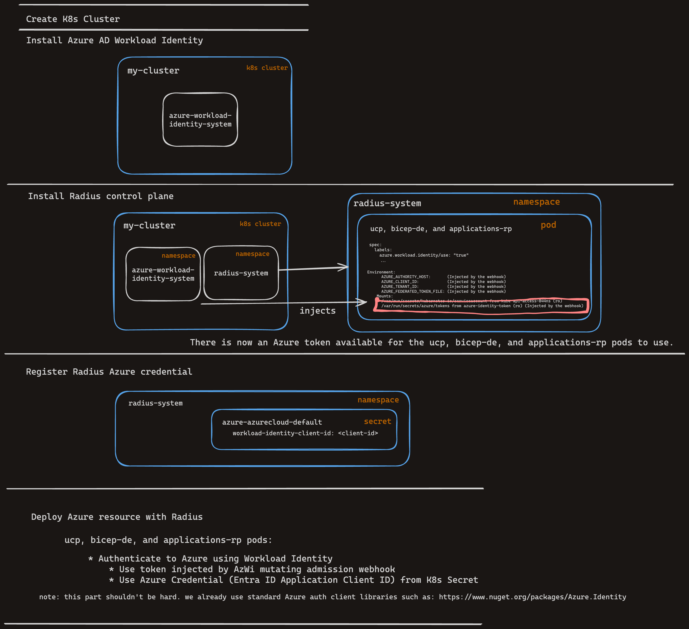

# Radius Azure Workload Identity Support

* **Status**: In Review
* **Author**: Will Smith (@willdavsmith)

## Overview

A software workload such as a container-based application, service, or script needs an identity to authenticate, access, and communicate with services that are distributed across different platforms and/or cloud providers. For workloads running outside of Azure, the workload needs a credential (secret or certificate) to access Azure resources. These credentials pose a security threat and must be stored and rotated regularly.  

Radius supports Azure service principal identity to deploy and manage Azure resources. However, this adds an extra task for operators to rotate the credentials for the identity. A workload identity or federated identity helps us avoid this maintenance challenge of manually managing the credentials and eliminates the risk of exposing secrets or having certificates expire. 

The goal of the scenario is to enable infrastructure operators to configure Azure workload identity support for Radius to deploy and manage Azure resources.

## Terms and definitions

1. **Entra ID Application** is an application that is registered in Azure Active Directory (Azure AD) and is used to authenticate with Azure resources.

1. **Azure Service Principal** is the local representation of an Entra ID Application object in a tenant or directory. It's the identity of the application instance. Service principals define application access and resources the application accesses.

1. **Azure Workload Identity** is an alternative form of Azure authentication  that removes the need to manage secrets. Azure Workload Identity uses the same service principal or managed identity to trust tokens from an external identity provider (IdP). Once that trust relationship is created, your external software workload exchanges trusted tokens from the external IdP for access tokens from the Microsoft Identity platform. Your software workload uses that access token to access the protected Azure resources to which the workload has been granted access. This eliminates the burden of managing and rotating the secrets.

1. **Azure AD Workload Identity mutating admission webhook (AzWI mutating admission webhook)** is a pod on the Kubernetes cluster that intercepts the pod creation request and injects the signed service account token into the pod. This signed service account token is used by the Azure provider to authenticate with Azure resources.


## Objectives

> **Issue Reference: https://github.com/radius-project/radius/issues/7308**

### Goals

* Radius users can configure Azure provider to use Azure workload identity for authentication.
* Azure workload identity can be configured via interactive experience.
* Azure workload identity can be configured manually (scriptable).
* Radius users can deploy and manage Azure resources without using a Entra ID Application client secret.

### Non-goals

* Azure Managed Identity support
    - "Managed Identity" in this context is a term describing the Azure feature that allows Azure resources to authenticate with Azure services. We will
    not be supporting this feature for now because we would like to focus on Azure workload identity first, which is more cloud and Kubernetes cluster type agnostic.

* **AWS Workload Identity (IRSA) support**
    - Will be tracked as separate work: https://github.com/radius-project/radius/issues/7618

### User scenarios

#### User story 1: As an infrastructure operator, I can configure Radius to use Azure workload identity via interactive experience.

1. Install the `rad` CLI.

1. run `rad init --full` to begin the interactive experience
    ```
    rad init --full
    ```

1. Enter the environment name, namespace and select "yes" to add a cloud provider and select "Azure" to add an Azure cloud provider.
    ```
    Select your cloud provider:
    > 1. Azure
      2. AWS
      3. [back]
    ```

1. Enter or use the Azure subscription and resource group name. Select  "Workload Identity" for the Azure cloud provider.
    ```
    Select the identity for the Azure cloud provider 
    1. Service principal                               
    > 2. Workload Identity    
    ```

1. Enter the Entra ID Application Client ID and Tenant ID.
    ```
    Please follow the guidance at aka.ms/rad-workload-identity to set up workload identity for Radius.

    Enter the Client ID of the Entra ID Application that you have created for Radius.

    > Enter the Client ID:

    Enter the Tenant ID of the Entra ID Application that you have created for Radius.

    > Enter the Tenant ID:
    ```

Radius is now configured to use Azure workload identity for authentication.

#### User story 1: As an infrastructure operator, I can configure Radius to use Azure workload identity without an interactive experience.

1. Install the `rad` CLI.

1. Install Radius using `rad install kubernetes`
    ```
    rad install kubernetes --set global.azureWorkloadIdentity.enabled=true
    ```

1. Create a Radius environment and add an Azure cloud provider.
    ```
    rad group create default
    rad env create default
    rad env update default --azure-subscription-id <subscription-id> --azure-resource-group <resource-group> 
    ```

1. Register the Entra ID Application using `rad credential register azure wi`.
    ```
    rad credential register azure wi --client-id <client-id> --tenant-id <tenant-id>
    ```

Radius is now configured to use Azure workload identity for authentication.

## User Experience

We will be adding a new option to the `rad init --full` command to allow the user to choose between Azure service principal identity and Azure workload identity.

We will be adding a new option to the Radius Helm chart to allow the user to enable Azure Workload Identity during installation via `rad install kubernetes --set global.azureWorkloadIdentity.enabled=true`.

We will be changing the `rad credential register azure` command to `rad credential register azure sp`

We will be adding a new `rad credential register azure wi` command to allow the user to register the Entra ID Application Client ID for Azure Workload Identity.

**Sample Input:**

See above

**Sample Output:**

See above

**Sample Recipe Contract:**

n/a

## Design

### High Level Design

During installation, if the user enables the Azure Workload Identity feature, the Radius control plane (bicep-de, ucp, applications-rp) pods will be annotated with the `azure.workload.identity/use: "true"` label. The AzWi mutating admission webhook will see this label on the pods and will project a signed service account token to each of the pods. The signed service account token and the credential registered by the user will be used by Radius to authenticate with Azure.

Please see https://azure.github.io/azure-workload-identity/docs/concepts.html for more information on how the AzWI mutating admission webhook works.

### Architecture Diagram



### Detailed Design

#### Advantages (of each option considered)

n/a

#### Disadvantages (of each option considered)

n/a

#### Proposed Option

n/a

### API design

```typespec
@doc("The properties of Azure Workload Identity credential storage")
model AzureWorkloadIdentityProperties extends AzureCredentialProperties {
  @doc("Workload Identity kind")
  kind: AzureCredentialKind.WorkloadIdentity;

  @doc("clientId for WorkloadIdentity")
  clientId: string;

  @doc("tenantId for WorkloadIdentity")
  tenantId: string;

  @doc("The storage properties")
  storage: CredentialStorageProperties;
}
```

### CLI Design

`rad init --full` will need to be updated to ask the user to choose between service principal auth and Azure Workload Identity.

We will need to update the `rad credential register azure` command to not require a client secret when registering the Entra ID Application Client ID.

We will need to update the Radius Helm chart to allow the user to enable Azure Workload Identity during installation with the `global.azureWorkloadIdentity.enabled` value. We will need to update the installation flow (for `rad init` and `rad install kubernetes`) to annotate the Radius control plane pods with the `azure.workload.identity/use: "true"` label if the user sets this value in the Helm chart.

### Implementation Details

#### UCP

UCP should be updated to read the Entra ID Application Client ID from the credential store. It should then authenticate with Azure using this Client ID and the signed service account token.

#### Bicep

n/a

#### Deployment Engine

Deployment Engine should be updated to read the Entra ID Application Client ID from the credential store. It should then authenticate with Azure using this Client ID and the signed service account token.

#### Core RP

Core RP should be updated to read the Entra ID Application Client ID from the credential store. It should then authenticate with Azure using this Client ID and the signed service account token.

#### Portable Resources / Recipes RP

n/a

### Error Handling

#### Azwi mutating admission webhook is not installed in the cluster.
* At Radius install time if Radius detects that the AzWI mutating admission webhook is not installed on the cluster, we should return an error to the user: "Azure Workload Identity mutating admission webhook is not installed in the cluster. Please follow the guidance at aka.ms/rad-workload-identity to set up workload identity for Radius."

## Test plan

We will change the Radius functional tests to use Azure workload identity instead of service principal identity. 

## Security

We will not be storing any secrets in Radius. The user will have to register the Entra ID Application Client ID with Radius using the `rad credential register azure wi` command. This command will not require a client secret. We are using a project and process that is a well-known way to authenticate with Azure via Azure workload identity. The user will have the same security concerns as today - their Entra ID Application should have least-privileges.

## Compatibility

We will be changing the `rad credential register azure` command to `rad credential register azure sp`. This will break any existing scripts that use this command, including our functional tests.

To use Azure Workload Identity with Radius, the user will have to re-install the Radius control plane.

## Monitoring and Logging

We will have the same monitoring and logging as today. We will not be adding any new instrumentation.

## Development plan

* Create POC for Radius + Azure Workload Identity (1 engineer, 0.5 sprint)
* Create and review technical design (1 engineer, 0.5 sprint)
* Implement CLI and Helm chart changes (1 engineer, 1 sprint)
* Implement changes in UCP, Bicep, and Applications RP (1 engineer, 0.5 sprint)
* End-to-end testing and documentation (1 engineer, 0.5 sprint)

Total: 3 sprints of engineering effort

## Open Questions

## Alternatives considered 

n/a

## Design Review Notes

<!--
Update this section with the decisions made during the design review meeting. This should be updated before the design is merged.
-->
