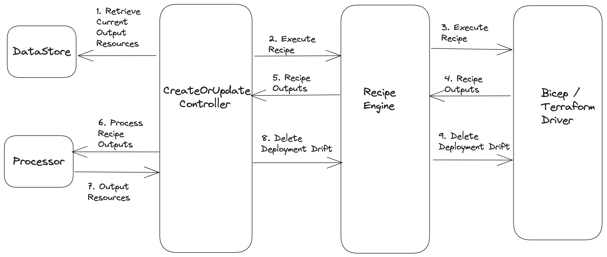

# Title

* **Status**: Pending
* **Author**: Karishma Chawla (@kachawla)

## Overview

When a Radius portable resource consuming a recipe is redeployed, the recipe is retrieved from the source and redeployed. Any drift between the current state of deployed resources and the state of the previous deployment needs to be handled by separately. For Terraform recipes, Terraform automatically manages deletion of the unused resources from previous state using the Terraform state file. For Bicep recipes however this needs to managed by Radius.

To address this for Bicep, we have implemented a solution that identifies the output resources that are no longer relevant to the recipe and delete each resource individually using the resource delete API. This functionality is currently implemented in the create/update controller of portable resources, tightly coupling the controller with Bicep specific behavior. To ensure flexibility in supporting different recipe types, we are introducing an abstraction layer for drift management within the recipe driver component.

This document delves into the architectural updates to the recipe deployment flow and the new APIs proposed in the recipe engine and Driver.

## Terms and definitions

**Portable resources**: Abstractions over various resource categories for infrastructure portability. Executes recipes to create infrastructure on Cloud and Kubernetes. https://docs.radapp.dev/author-apps/portability/links-resources/

**Recipes**: Recipes enable a separation of concerns between infrastructure operators and developers by automating infrastructure deployment. https://docs.radapp.dev/author-apps/recipes/

**Terraform State File**: A Terraform state file is a file that stores the current state of your Terraform configuration. The state file contains information about the resources that have been created, as well as their configuration and current state. https://www.terraform.io/docs/language/state/index.html

## Objectives

### Goals

* Detect and manage recipe deployment drift for different recipe types.

### Non goals

* Modify the existing approach to drift detection and management for Bicep recipes.
* Introduce custom drift management for Terraform recipes deployment.

### User scenarios

#### Changing Infrastructure and Compliance Requirements

As a developer, my applications infratructure requirements have changed over time, so have the compliance compliance requirements for my organization. To address these changes, my IT ops team has revised the default recipe for the Redis cache within the environment where my applications are deployed. When I redeploy my application consuming the recipe, the modified recipe is deployed. It is expected that any resources that are no longer defined in the updated recipe will be automatically deleted as part of this deployment.

## Design

Before delving into the proposed design, let's recap the current architecture of recipe drift detection and management. It's important to note that the current state applies exclusively to Bicep, as Terraform recipes are still in development, necessitating a reevaluation of the overall architecture.

### Current Architecture (Bicep)

Drift detection and garbage collection of unused resources for Bicep recipes involve the following steps:
  1. Prior to deploying a recipe, a snapshot of the existing output resources is saved in a separate object.
  2. After the recipe deployment, updated list of output resources is retrieved. A comparison between the new and previous lists identifies the resources that are no longer used.
  3. The identified resources that have drifted are then deleted.

Currently, these steps are executed within the update resource controller. However, with the introduction of Terraform recipes (and potential future recipe types), embedding Bicep-specific logic within the controller is no longer ideal. Custom logic of this nature should be abstracted within drivers designed for the specific recipe type being executed.

### Proposed Architecture

The proposed design aims to move the drift management logic above to the Bicep driver. To achieve this, a new API for drift management will be introduced into the recipe engine and driver components, with individual recipe drivers implementing different implementations of this new API.

Here's a high level architecture overview of the data flow involved in recipe deployment focusing on drift management:



The new API will be responsible for drift management between deployments specifically for recipe types requiring explicit drift management by Radius. For recipes such as Terraform where additional work is unnecessary, the API will function as a no-op. For instance, in the context of Bicep, this entails cleaning up resources that have diverged from the expected state between the current and previous deployments; calculating the differences between deployments and removing obsolete resources. The implementation of this API for any new driver will depend on the capabilities offered by the underlying orchestrator it utilizes.

The API will be invoked from the update resource controller after recipe execution and output processing have completed. The controller is responsible for passing both the previous and new output resources to the API.

### API design (if applicable)

#### RecipeEngine / RecipeDriver

**API Name:** `DeleteDeploymentDrift`

**Inputs:**
- `DeploymentDriftOptions`

**Outputs:**
- `Error`
  - `RecipeDriftDetectionFailed`
  - `RecipeResourceDeletionFailed`

**DeploymentDriftOptions**: This will be added to the recipe types as this is shared by the engine and driver -

```
type DeploymentDriftOptions struct {
  // List of previously deployed output resources.
  OldOutputResources []rpv1.OutputResource

  // List of output resources deployed in current recipe execution.
  NewOutputResources []rpv1.OutputResource

  // Metadata related to portable resource deploying the recipe. 
  RecipeMetadata ResourceMetadata
}
```

## Alternatives considered

### Integrating Drift Management into the Execute API

An initial consideration was to include drift management within the Execute API of the driver. However, drift detection necessitates knowledge of the new output resources, which are available only after the recipe outputs have been processed. Since output processing is carried out within the controller, this information is not accessible in the Execute API.

Moreover, abstracting garbage collection into a separate API also improves maintainability. Combining multiple functionalities within a single API can lead to complex logic and increase the likelihood of oversight when developers new to the code base implement additional drivers. Isolating functionalities simplifies maintenance and minimizes the risk of introducing bugs.

## Test plan

### Unit Tests

Existing CreateOrUpdate controller unit tests will be updated to verify that the new API is invoked after recipe execution and output processing have completed.

Unit tests will be added for the new API for the individual recipe drivers.

### Functional Tests

Currently, functional tests specifically validating drift management for Bicep are lacking. To address this, a new tracking issue will be created to introduce a test scenario that involves redeploying a resource with an updated recipe, with validation of the deletion of underlying resources that are no longer utilized by the revised recipe. The priority will be to achieve comprehensive functional test coverage for Bicep after the planned features for the August release are implemented.

## Security

* No new security vectors are being introduced.

* Updated implementation improves the overall security of recipe execution abstracting out the recipe type specific logic from the common code leading. This abstraction prevents the potential risk of data loss due to the unintended deletion of resources that are still in use for recipe types that do not require explicit drift management.

## Compatibility (optional)

No compatibility impact, no customer facing APIs are being added or updated.

## Monitoring

* Recipe drift management duration - this will be only applicable to Bicep recipe execution.

## Development plan

The existing Recipe Engine and Driver components are already in place. Implementation of the proposed design will involved the implementation of the new APIs and associated unit tests, all of which will be included within a single PR.

## Open issues

None