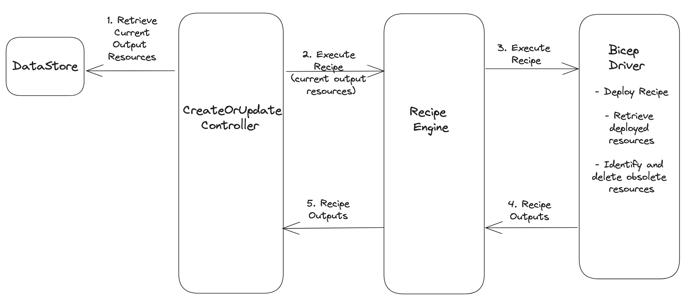

# Recipe Resource Garbage Collection

* **Status**: Pending
* **Author**: Karishma Chawla (@kachawla)

## Overview

When a Radius portable resource consuming a recipe is redeployed, the recipe is retrieved from the source and redeployed. Any unused resources that are no longer included in the output resources of current recipe deployment compared to the previous deployment output need to be deleted by Radius for certain recipe types. For Terraform recipes, Terraform automatically manages deletion of the unused resources from previous state using the Terraform state file. For Bicep recipes however this needs to managed by Radius.

To address this for Bicep, we have implemented a solution that identifies the output resources that are no longer relevant to the recipe and delete each resource individually using the resource delete API. This functionality is currently implemented in the create/update controller of portable resources, tightly coupling the controller with Bicep specific behavior. To ensure flexibility in supporting different recipe types, we are moving garbage collection of unused resources to per recipe specific abstraction layer - recipe driver.

This document delves into the architectural updates to the recipe deployment flow and the API updates proposed in the recipe engine and Driver.

## Terms and definitions

**Portable resources**: Abstractions over various resource categories for infrastructure portability. Executes recipes to create infrastructure on Cloud and Kubernetes. https://docs.radapp.dev/author-apps/portability/links-resources/

**Recipes**: Recipes enable a separation of concerns between infrastructure operators and developers by automating infrastructure deployment. https://docs.radapp.dev/author-apps/recipes/

**Terraform State File**: A Terraform state file is a file that stores the current state of your Terraform configuration. The state file contains information about the resources that have been created, as well as their configuration and current state. https://www.terraform.io/docs/language/state/index.html

## Objectives

### Goals

* Detect and garbage collect unused recipe resources.

### Non goals

* Modify the existing approach to garbage collection of resources for Bicep recipes.
* Introduce custom resource cleanup/garbage collection for resources deployed by Terraform recipes. Terraform automatically manages this using the Terraform state file.

### User scenarios

#### Changing Infrastructure and Compliance Requirements

As a developer, my applications infratructure requirements have changed over time, so have the compliance requirements for my organization. To address these changes, my IT ops team has revised the default recipe for the Redis cache within the environment where my applications are deployed. When I redeploy my application consuming the recipe, the modified recipe is deployed. It is expected that any resources that are no longer defined in the updated recipe will be automatically deleted as part of this deployment.

## Design

Before delving into the proposed design, let's recap the current architecture of recipe resource garbage collection. It's important to note that the current state applies exclusively to Bicep, as Terraform recipes are still in development, necessitating a reevaluation of the overall architecture.

### Current Architecture (Bicep)

Garbage collection of unused resources for Bicep recipes involve the following steps:
  1. Prior to deploying a recipe, a snapshot of the existing output resources is saved in a separate object.
  2. After the recipe deployment, updated list of output resources is retrieved. A comparison between the new and previous lists identifies the resources that are no longer used.
  3. The identified resources that are not included in the new list are then deleted.

Currently, these steps are executed within the update resource controller. However, with the introduction of Terraform recipes (and potential future recipe types), embedding Bicep-specific logic within the controller is no longer ideal. Custom logic of this nature should be abstracted within drivers designed for the specific recipe type being executed.

### Proposed Architecture

The proposed design aims to move the garbage collection logic above to the Bicep driver. To achieve this, garbage collection of resources will be a part of the Execute API implementation flow, after deployment of the recipe and retrieval of recipe outputs have completed.

Here's a high level architecture overview of the data flow involved in recipe deployment focusing on garbage collection:



The updated Execute API will be responsible for garbage collection of resources between deployments specifically for recipe types requiring explicit resource cleanup by Radius. For recipes such as Terraform where additional work is unnecessary, this additional step will not be executed. For instance, in the context of Bicep, this entails cleaning up obsolete resources that are no longer included in the output resources of current recipe deployment compared to the previous deployment output. The implementation of garbage collection as a part of Execute API for any new driver will depend on the capabilities offered by the underlying orchestrator it utilizes.

The Execute API is invoked from the update resource controller. The controller will be responsible for passing the list of previously deployed output resources identifiers to the recipe engine's Execute API.

### API design (if applicable)

#### RecipeEngine / RecipeDriver

Execute API inputs will be updated to include the list of previously deployed output resource IDs.

**Updated API Input:**
```
type ExecuteOptions struct {
	BaseOptions
  
  // Previously deployed state of output resource IDs.
  prevState []string
}
```

**Outputs:**
- No change required to the Execute API response.

- `Error`: A new error type will be added to the recipe driver to indicate that garbage collection of resources failed. This error will be returned by the Execute API if garbage collection fails.
  - `RecipeGarbageCollectionFailed`

## Alternatives considered

### Adding a new API for Garbage Collection in Engine and Driver

An initial consideration was to introduce a new API into the recipe engine and driver components for garbage collection of resources, with individual recipe drivers implementing different implementations of this new API. The potential advantage of this approach is the clear separation of functionalities within each API - Execute and GarbageCollectResources, simplifying execute API logic and reducing the risk of oversights when new developers implement additional drivers.

However, we realized that all the necessary information for garbage collection is available during recipe execution. Introducing an extra round trip between the controller, engine, and driver would not provide a favorable trade-off. Instead, we can achieve the desired separation of functionality by abstracting garbage collection into a separate function. If necessary, we can consider introducing the new API only within the driver if it becomes challenging to maintain as more driver implementations are added.

## Test plan

### Unit Tests

1. **Driver Unit Tests:** These tests will be updated to ensure that garbage collection is invoked after recipe execution and output processing have been completed. Additionally, these tests will validate the correct error type is returned if garbage collection fails.

2. **CreateOrUpdate Controller Unit Tests:** Existing unit tests for the CreateOrUpdate controller will be updated to exclude the expected execution of garbage collection after recipe execution.

### Functional Tests

Currently, functional tests specifically validating garbage collection for Bicep are lacking. To address this, a new tracking issue will be created to introduce a test scenario that involves redeploying a resource with an updated recipe, with validation of the deletion of underlying resources that are no longer utilized by the revised recipe. The priority will be to achieve comprehensive functional test coverage for Bicep after the planned features for the August release are implemented.

## Security

* No new security vectors are being introduced.

* Updated implementation improves the overall security of recipe execution abstracting out the recipe type specific logic from the common code. This abstraction prevents the potential risk of data loss due to the unintended deletion of resources that are still in use for recipe types that do not require explicit garbage collection.

## Compatibility (optional)

No compatibility impact, no customer facing APIs are being added or updated.

## Monitoring

* Recipe garbage colelction duration - this will be only applicable to Bicep recipe execution.

## Development plan

The existing Recipe Engine and Driver components are already in place. Implementation of the proposed design will involve the update to the existing API and associated unit tests, all of which will be included within a single PR.

## Open issues

None