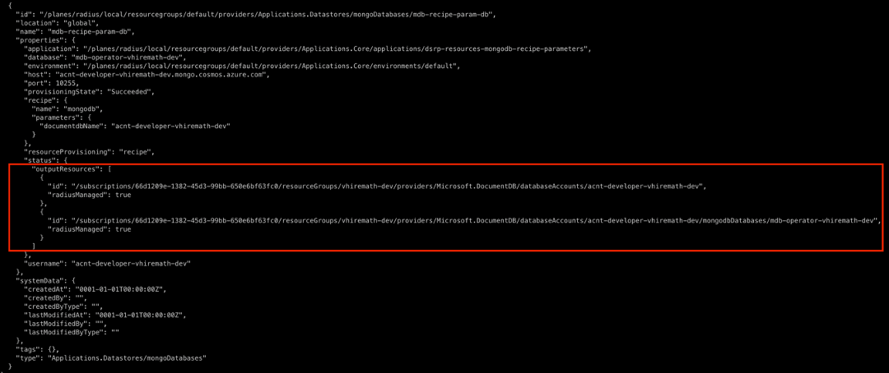
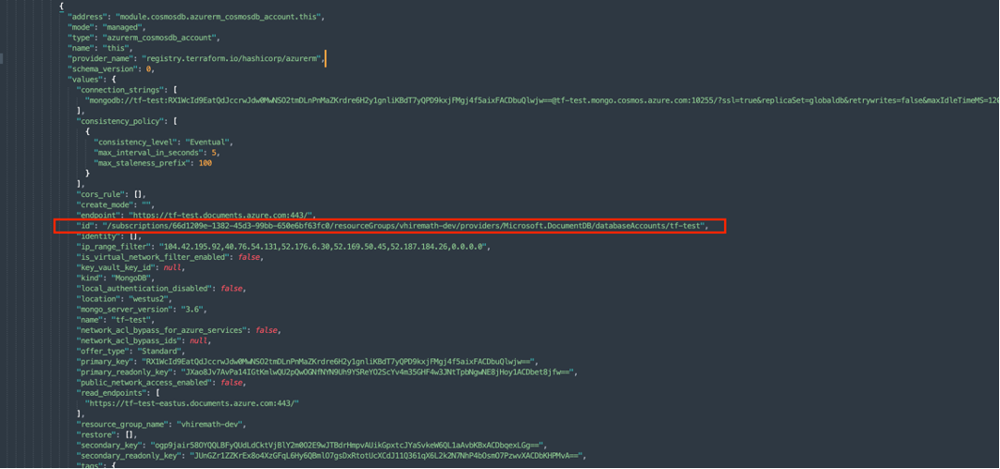
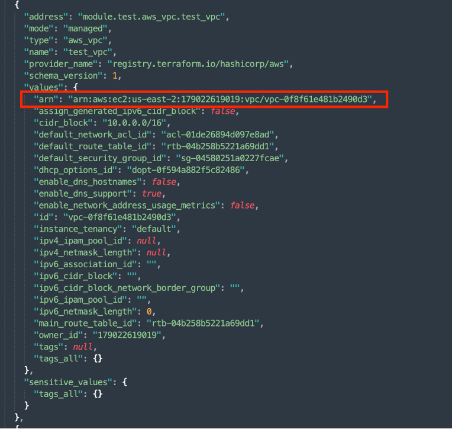
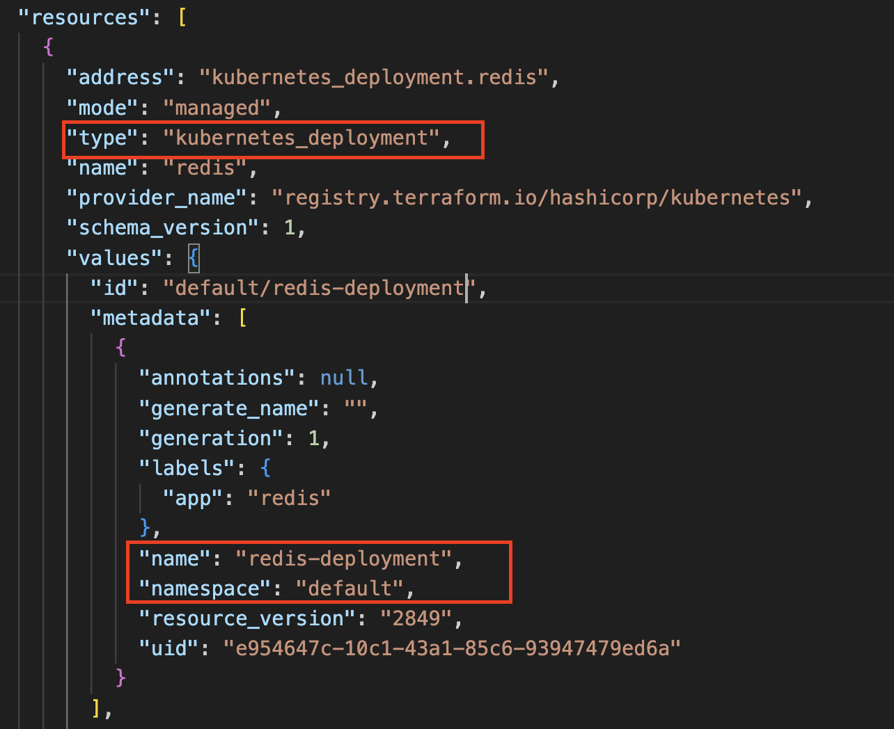
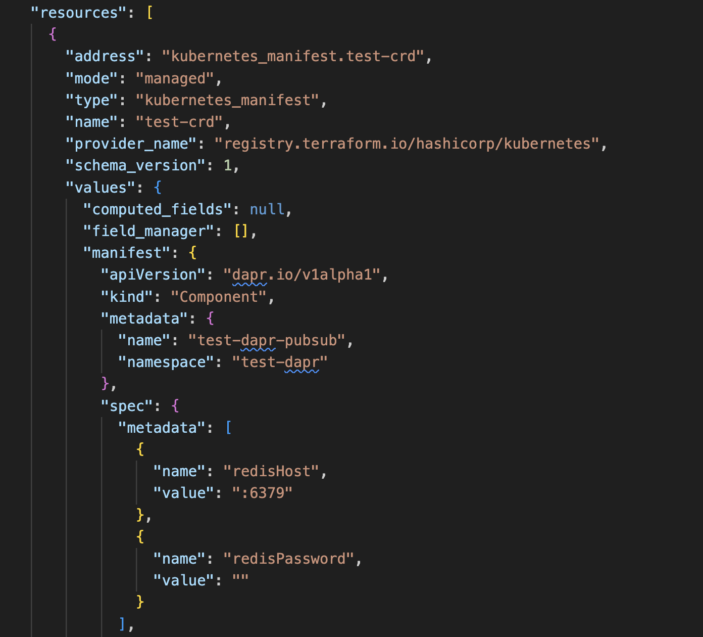

# Title

* **Status**: Approved
* **Author**: Vishwanath Hiremath (@vishwahiremat)

## Overview

Today, we populate the recipe response from the 'result' output if set in the recipe and the resources created by the template. There are two ways resources can be returned i.e., 
1) Explicitly as part of the 'result' output.
2) Implicitly when it is created in the template.  

For bicep resources created in the template are returned as part of recipe deployment response. For terraform we don’t return the resources that are not defined in the recipe, and we would like to have that as part of recipe response.

## Terms and definitions

## Terms and definitions

| Term     | Definition                                                                                                                                                                                                 |
| -------- | ---------------------------------------------------------------------------------------------------------------------------------------------------------------------------------------------------------- |
| Terraform | “HashiCorp Terraform is an infrastructure as code tool that lets you define both cloud and on-prem resources in human-readable configuration files that you can version, reuse, and share.” |
| UCP Qualified resource ID | IDs that are in the format of 1)	/planes/radius/local/... &nbsp;&nbsp; 2)	subscriptions/{guid}/... (Relative ID format) |
| Terraform ID | In Terraform, every resource has an .id attribute. This is a unique identifier assigned by the provider to each resource. It’s automatically created upon resource creation and cannot be changed. The .id is used internally by Terraform to track resource dependencies and manage state. |


## Objectives

> **Issue Reference:** https://github.com/radius-project/radius/issues/6354

### Goals
-	Terraform recipe deployment should return resource ids (that are not defined in the recipe output) as part of the recipe output. 

### Non goals
-   Adding resource IDs to recipe response from providers other than Azure, AWS and Kubernetes.

### User scenarios (optional)
#### User story 1
As a radius user I would like to see the resource information of the resources deployed by terraform recipes. Scenario: I register azure cosmosdb terraform recipe to the radius environment and run “rad deploy \<bicep\>” command to deploy an application. After its successful, when I want to get resource information by running “rad resource list mongoDatabases -o json”, I would like to see the resource ids information in OutputResources block.


## Design


#### Parse terraform state file to get resource IDs 
Terraform uses state store to determine which changes to make to your infrastructure, and it has all the information about the resources deployed. When terraform recipes are deployed, state store can be accessed and parse the resource values to get the deployed resource IDs. Example of terraform state file with Database account:



But all resource IDs displayed here in state file are not UCP qualified, for example for Kubernetes provider it is represented as \<namespace\>/<resource_name> and for AWS it is the unique id of the resource. So id may have different meaning in different providers. So, we should use the information from the state store and create UCP formatted ID for deployed resources.

#### Adding support to create UCP qualified resource IDs for Azure, AWS & Kubernetes providers

1) **Azure**  (provider name: registry.terraform.io/hashicorp/azurerm)
    For Azure resources, id property represents relative ID(i.e of the format /subscriptions/\<subscription\>/resourceGroups/\<resource-group\>/providers/..) if it's a ARM resource, which is a UCP qualified ID. And for non ARM resources that does not have UCP qualified ID, it's not added as part of the recipe response or expected by the users to add it as part of recipe output. Use existing ParseResource() function to check if the resource id from the state store in UCP qualified.


2) **AWS** (provider name: registry.terraform.io/hashicorp/aws)
    For AWS resources, "arn" property from the state store can be used to create UCP qualified ID.  
    ARN format: arn:partition:service:region:account-id:resource-type/resource-id.  
    And this is converted into UCP format : 
    ```
    /planes/aws/<partition>/accounts/<account-id>/regions/<region>/providers/AWS.<service>/<resource-type>/<resource-id>
    ```
    Example:
    
    For ARN:  
    ```
    arn:aws:ec2:us-east-2:179022619019:subnet/subnet-0ddfaa93733f98002
    ```
    UCP formatted ID:
    ```
     /planes/aws/aws/accounts/179022619019/regions/us-east-2/providers/AWS.ec2/subnet/subnet-0ddfaa93733f98002
    ```

3) **Kubernetes** (provider name: registry.terraform.io/hashicorp/kubernetes)    
    For Kubernetes resources, UCP qualified id can be created using the namespace, resource name and resource types information from the state store. 

    Resource type values are prefixed with "kubernetes_" keyword that need to be removed while creating the ID.
    
    Providers information is not found on the state store, create a resource type to provider lookup table table for the popular kubernetes resources to get the provider information.
    Ex:
    ```
    {
        "deployment" : "apps",
        "service"    : "core",
        "secret"     : "core",
        "role"       : "rbac.authorization.k8s.io"
    }
    ```
    

    ID created will be of the format:
    ```
    /planes/kubernetes/local/namespaces/<namespace>/providers/<provider>/<resource_type>/<resource_name>
    ```
    For cluster scoped resources.
    ```
    /planes/kubernetes/local/providers/<provider>/<resource_type>/<resource_name>
    ```

    Example:
    

     UCP formatted ID:
     ```
     /planes/kubernetes/local/namespaces/default/providers/apps/Deployment/redis-deployment
     ```
    For resources created using resource type "kubernetes_manifest", use "apiversion","kind" to get the provider and resource type.  
    Example: 
    

    UCP formatted ID:
    ```
     /planes/kubernetes/local/namespaces/test-dapr/providers/dapr.io/Component/test-dapr-pubsub
    ```

4) **Other providers**  
    For resources from other providers, resource IDs are not returned as part of recipe response and users can add it as part of the recipe output if needed.    

## Test plan

#### Unit Tests
-   Add unit tests for prepare recipe response with terraform IDs.
-   Add tests for verifying the generation of the UCP IDs for resources created by different providers

#### Functional tests
- 	Add a e2e test to verify terraform recipe deployment returns resource ids that are not defined in recipe.

## Development plan

- Task 1:  
    - Parsing terraform state store file to get the resource IDs.
    - Unit Testing
- Task 2:
    - Creating UCP qualified resource IDs from the state store data.
    - Unit Testing
- Task 3:
    - Adding functional tests.