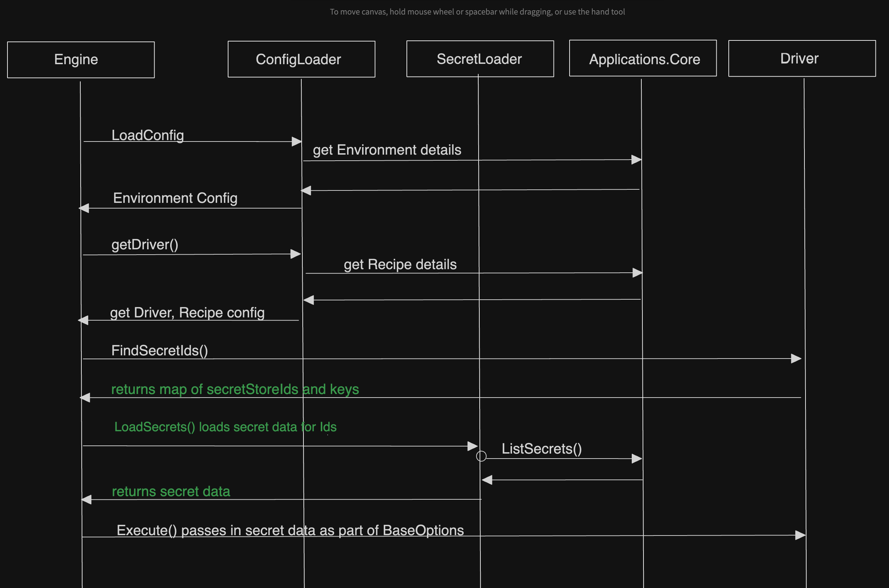

# Handling of Secrets Data for Terraform Providers

* **Status**: Pending
* **Author**: lakshmimsft

## Overview

We've described the design for support of multiple Terraform Providers in Radius in the following PR: [Design Document to support multiple Terraform Providers](https://github.com/radius-project/design-notes/pull/39/files) and implemented secret handling for Private Terraform modules [Ref PR link](https://github.com/radius-project/radius/pull/7306).
This document  describes in detail the handling of secrets data between the Engine and Driver for Terraform Providers building on the above designs.

## Terms and definitions

| Term     | Definition                                                                                                                                                                                                 |
| -------- | ---------------------------------------------------------------------------------------------------------------------------------------------------------------------------------------------------------- |
| Terraform Provider | A Terraform provider is a plugin that allows Terraform to interact with and manage resources of a specific infrastructure platform or service, such as AWS, Azure, or Google Cloud. |

## Objectives

**Reference for new type recipeConfig and handling of secrets for Private Terraform Repository:** [Design document for Private Terraform Repository](https://github.com/radius-project/design-notes/blob/3644b754152edc97e641f537b20cf3d87a386c43/recipe/2024-01-support-private-terraform-repository.md)

**Secret Implementation for Private Terraform Repository:**[Secret Implementation for Private Terraform Repository](https://github.com/radius-project/radius/pull/7306)

**Reference for support of multiple Terraform Providers in Radius:** [Design Document to support multiple Terraform Providers](https://github.com/radius-project/design-notes/pull/39/files)

> **Issue Reference:** <!-- (If appropriate) Reference an existing issue that describes the feature or bug. -->
https://github.com/radius-project/radius/issues/6539

### Goals

Describe data flow, specific function calls when using secrets to configure Terraform Providers, building on design in the referred design documents.

### Non goals

The document is focussed on handling secrets for Terraform Providers, with Applications.Core/secretStores being the underlying resource for the secret store (which today supports Kubernetes secrets). Other sources and types of secretsStores are out of scope for this document. 

### User scenarios (optional)

#### User story 1
As an operator, I maintain a set of Terraform recipes for use with Radius. I have a set of provider configurations which are applicable across multiple recipes. These provider configurations now include secrets, which are injected into the Terraform configuration, allowing the Terraform process to access them as needed.


## User Experience (if applicable)

**Sample Input:**

This is pulled in from existing document:
[Design Document to support multiple Terraform Providers](https://github.com/radius-project/design-notes/pull/39/files)

``` diff
resource env 'Applications.Core/environments@2023-10-01-preview' = {
  name: 'dsrp-resources-env-recipes-context-env'
  location: 'global'
  properties: {
    compute: {
      ...  
    }
    providers: {
      ...
    }
    recipeConfig: {
      terraform: {
        authentication: {
          ...
        }
        providers: {
          azurerm: [
            {
              subscriptionid: 1234
              tenant_id: '745fg88bf-86f1-41af'
+              secrets: { // Individual Secrets from SecretStore
+                my_secret_1: {
+                  source: secretStoreConfig.id
+                  key: 'secret.one'
+                }
+                my_secret_2: {
+                  source: secretStoreConfig.id
+                  key: 'secret.two'
+                }
+              }
            }, {
              subscriptionid: 1234
              tenant_id: '745fg88bf-86f1-41af'
              alias: 'az-paymentservice'
            } ]
          gcp: [
            {
              project: 1234
              regions: [ 'us-east1', 'us-west1' ]
            }
          ]
          oraclepass: [
            {
              database_endpoint: '...'
              java_endpoint: '...'
              mysql_endpoint: '...'
            }
          ]
        }
      }
      env: {
        MY_ENV_VAR_1: 'my_value'
      }
+      envSecrets: { // Individual Secrets from SecretStore
+        MY_ENV_VAR_2: {
+          source: secretStoreConfig.id
+          key: 'envsecret.one'
+        }
+        MY_ENV_VAR_3: {
+          source: secretStoreConfig.id
+          key: 'envsecret.two'
+        }
+     }
    }
    recipes: {
    }
  }
}

```

**Sample Output:**
n/a

**Sample Recipe Contract:**
n/a

## Design

### High Level Design

The design for handling secrets for Private Terraform modules established the basis for data flow between Engine and Driver components in the codebase. For Terraform Providers, we will continue to maintain the flow where secrets are retrieved in the Engine and passed into the Driver in the Execute() call. 
The following diagram describes the updated data flow. The calls in green highlight updates to existing code.



### Detailed Design

The FindSecretIds function in the DriverWithSecrets interface is updated to return a map of SecretStoreIds and keys. These will hold data for a Terraform module as before and in addition, also hold SecretStoreIds and keys for provider configuration and environment variables, iterating through the input environment recipe configuration. 

The LoadSecrets method in the SecretLoader interface will be updated return secret data for multiple Ids returned from FindSecretIds().

#### Advantages (of each option considered)
Retrieving secrets in the Engine and passing them into the Driver was discussed positively as a way forward. Looking ahead with Containerization, the Driver will have all the information it needs to be able to be spin off into a separate process.

#### Disadvantages (of each option considered)
N/A

#### Proposed Option
N/A

### API design (if applicable)
N/A

### CLI Design (if applicable)
N/A

### Implementation Details
###Recipes (Engine and Driver)

```go


// FindSecretIDs will be updated in current DriverWithSecrets interface to now return map of secretStoreIds and keys
type DriverWithSecrets interface {
  ...
	// FindSecretIDs gets the secretStore resource IDs and keys for the recipe including module, provider, envSecrets.
	FindSecretIDs(ctx context.Context, config recipes.Configuration, definition recipes.EnvironmentDefinition) (map[string]string, error)
}

// LoadSecrets function in SecretsLoader interface will populate resolved secrets based on the Ids returned from FindSecretIDs(). The result is passed as BaseOptions.Secrets to the Driver in Execute() call.
type SecretsLoader interface {
	LoadSecrets(map[string]string, ...)(map[string]map[string]string, error){ // returns secretStoreId[key]value
}

// When calling driver.Execute we pass in BaseOptions which is structured as:
type BaseOptions struct {
	// Configuration is the configuration for the recipe.
	Configuration recipes.Configuration

	// Recipe is the recipe metadata.
	Recipe recipes.ResourceMetadata

	// Definition is the environment definition for the recipe.
	Definition recipes.EnvironmentDefinition

	// Secrets specifies the module authentication information stored in the secret store.
	Secrets map[string]map[string]string
}
```

### Error Handling

If there is an error when iterating through the recipe configuration or calling ListSecrets API, error will be returned. These errors will not include sensitive data on secret keys or values.

## Test plan

Testing will include unit tests on all new functions created and a
functional Test will be created to test this functionality e2e.\
Unit Tests should include test for 'secret not found'
and verify that upon returning an error, we do not return sensitive information in the error message.

## Security

Secret data will be held in memory and be passed to the Driver which will inject these values into the Terraform configuration in working directory for Terraform. This directory is created when a Terraform recipe is set to be deployed and deleted once deployment of the Terraform recipe is completed.

Secret data will not be persisted and secret data will not be logged by Radius.
Terraform recipe authors should, in general, set the sensitive flag for any input and output variables that contain sensitive data.

## Compatibility (optional)
N/A

## Monitoring and Logging

No updates to existing metrics and logs. 
We need to make sure we do not log sensitive information within calls.

## Development plan
Updates to Engine, Driver function call - (under 0.5 Sprint)
Unit Tests + Functional Test - (under 0.5 Sprint)

Total: 1 Sprint

## Open Questions

TBD

## Alternatives considered
We could also update FindSecretIds() to return a list of SecretStoreIds and the LoadSecrets function retrieves all secrets for the SecretStore and passes the data to the driver.
We decided to limit the secret data sent to the Driver to only what the Driver will need and are going with the current design. This can be updated in the future if needed.


## Design Review Notes
1. Update design per discussion.Design can be more generic and need not follow Env ConfigStructure.
2. PMs to discuss scenarios with customer, get clarity on use cases for  Recipe Provider Config versus Env Level Provider Config which may get us to revisit design.
