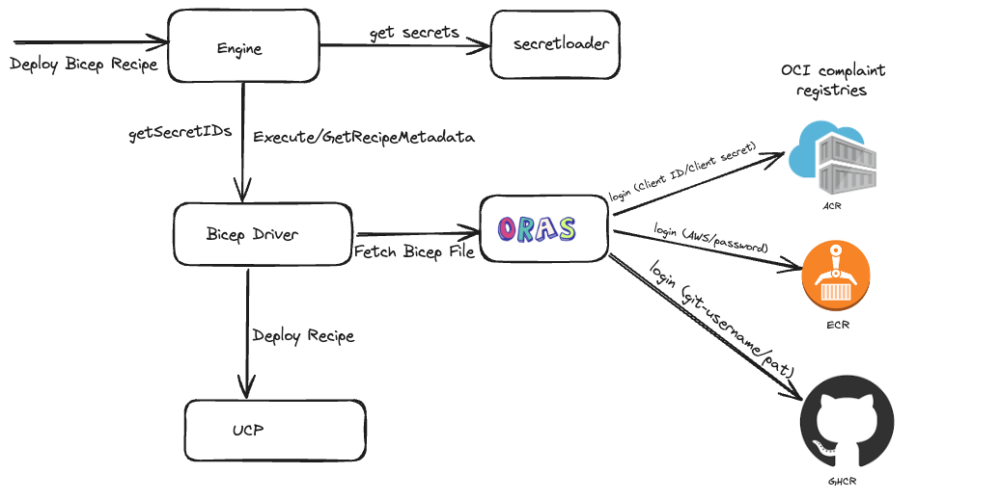

# Adding support for Private Bicep Registries

* **Status**: Pending
* **Author**: Vishwanath Hiremath (@vishwahiremat)

## Overview

Today, infrastructure recipes are restricted to being stored on publicly accessible OCI-compliant registries. This limitation means that Radius does not support the use of privately-hosted Bicep recipes, nor does it provide a mechanism to configure authentication for accessing these private registries. This gap is a significant hindrance for organizations that develop their own infrastructure modules and prefer to store them in secure, privately-accessible repositories.

To address this issue and enhance the usability of Radius for serious enterprise use cases, we propose adding support for private Bicep registries. This feature will enable Radius to authenticate and interact with private OCI-compliant registries, ensuring secure access to proprietary bicep recipes.

## Terms and definitions

| Term     | Definition                                                                                                                                                                                                 |
| -------- | ---------------------------------------------------------------------------------------------------------------------------------------------------------------------------------------------------------- |
| OCI compliant registry | An OCI-compliant registry refers to a container registry that adheres to the specifications set by the Open Container Initiative  |
| ORAS | ORAS is the de facto tool for working with OCI Artifacts.(https://oras.land/) |
| Private Bicep Registry | A private Bicep registry is a dedicated repository for storing and managing Bicep modules which is not accessible publicly need to authenticate into it for registry operations.| 

## Objectives
> **Issue Reference:** https://github.com/radius-project/radius/issues/6917

### Goals
- Enable support to use bicep recipes stored in private bicep registries.
- Support all OCI compliant private registries.

### Non goals
- Support to manage(configure/view) OCI registry credentials in Radius environment via CLI. (this is a future priority scenario and would not be in scope for the initial release)

### User scenarios (optional)
As an operator I am responsible for maintaining Bicep recipes for use with Radius. Bicep recipes used contains proprietary configurations, or data that should not be shared publicly and its intended for internal use within our organization and have granular control over who can access, contribute to, or modify bicep recipes. So I store the recipes in a private bicep registry. And I would like to use these private registries as template-path while registering a bicep recipe.


## User Experience (if applicable)
Credential information is stored in `Application.Core/secretstore` resource, users are expected to provide keys based on the `type` of authentication used,  with the appropriate values in the secret store that will be used to authenticate private registry.
| type     | Expected Keys                                                                                                                                                                                                 |
| -------- | ---------------------------------------------------------------------------------------------------------------------------------------------------------------------------------------------------------- |
| basicAuthentication | username, password  |
| azureFederatedIdentity | clientid, tenantId |
| awsIRSA | arn | 


```
resource secretStore 'Applications.Core/secretStores@2023-10-01-preview' = {
  name: 'acrsecrets'
  properties:{
    type: 'generic'
    resource: 'registry-secrets/acr'
    data: {
      'username': {
        value: '<username>'
      }
      'password': {
        value: '<registry-password>'
      }
    }
  }
}
```
`bicep` recipe config is added in the environment to stores bicep recipe configurations, update it to point to the `secretStore` with credential information.
```
"recipeConfig": {
  "terraform": {
    ...
  },
  "bicep": {
    "authentication":{
      "test.azurecr.io":{
        "secret": "/planes/radius/local/resourcegroups/default/providers/Applications.Core/secretStores/acrsecrets"
        "type": "basicAuthentication"
      },
    }
  }
  "env": {
    ...
  }
},
```


## Design


At a high level, data flow between radius components:
- Engine calls bicep driver to get secret id of the resource that has credential(e.g. username/password) information.
- Engine gets the secret values from the secret loader and calls driver to execute recipe deployment.
- Bicep driver uses ORAS auth client to authenticate the private container registry and fetches the bicep file contents and calls UCP to deploy recipe.


### Design details
Currently, OCI-compliant registries are used to store Bicep recipes, with the ORAS client facilitating operations like publish and pull these recipes from the registries. ORAS provides package auth, enabling secure client authentication to remote registries. Private Registry credentials information  must be stored in an `Application.Core/secretStores` resource and the secret resource ID is added to the recipe configuration.

During the recipe deployment bicep driver checks for secrets information for that container registry the recipe deploying is stored on,  and creates an oras auth client to authenticate the private bicep registries.

#### Username-Password based authentication

Different container registry providers use the the username and password in various ways:

**Azure**:

Azure provides multiple ways to authenticate ACR using ORAS, we can use different types of credentials depending on the setup and preferences. Here are the main types of credentials to use:

*Admin User Credentials*:

Users can enable the admin user and obtain these credentials from the Azure portal:
```
Username : The ACR admin username.
Password : The ACR admin password.
```

*Service Principal*:
```
Username: The service principal's client ID.
Password: The service principal's client secret.
```

*Azure CLI Token*:
```
Username: Use '00000000-0000-0000-0000-000000000000' (a placeholder indicating token-based authentication).
Password: Use the token obtained from az acr login.
```

You can obtain the token using the Azure CLI:
```
az acr login --name <registry-name> --expose-token
```
**Github**:

Github uses personal access token as password to auth into ghcr.
```
Username: Github username.
Password: Personal access token.
```

**AWS**:
```
Username: AWS
Password: output of `aws ecr get-login-password --region region`
```
While there are various container registry providers, each offering multiple authentication methods, by leveraging ORAS, we abstract away the need for provider-specific code to handle authentication. 

ORAS auth client example to authenticate private registry using username and password,
```
	repo.Client = &auth.Client{
		Client: retry.DefaultClient,
		Credential: auth.StaticCredential("orasregistry.azurecr.io", auth.Credential{
			Username: "<username>",
			Password: "<password>",
		}),
	}
	repo.Client = client
```

#### Authentication using Federated identity
**Azure**:

Users can leverage Azure Federated Identity to authenticate seamlessly. When Azure Federated Identity is set up on a Kubernetes cluster, it enables secure and managed authentication, allowing workloads running on the cluster to access ACR without needing to manage service principal credentials directly. This approach enhances security by eliminating the need for hardcoded credentials and simplifies the authentication process by relying on Azure Active Directory (AAD) token issuance for the cluster's managed identity.

To authenticate ACR using Azure Federated credentials, we need to get the refresh token from ACR, and use it with ORAS auth client. The detailed steps are outlined below:

- Retrieve the Azure Active Directory (AAD) token for the client ID configured with Azure Federated Identity.
- Get refresh token from ACR by exchanging for the above AAD access token
  ```
  formData := url.Values{
      "grant_type":   {"access_token"},
      "service":      <acr-url>,
      "tenant":       <tenant-id>,
      "access_token": <aad-token>,
    }
    
    // jsonResponse contains the refresh token from ACR.
    jsonResponse, err := http.PostForm("https://<acr-url>/oauth2/exchange", formData)
  ```
- Use `RefreshToken` in ORAS auth client to authenticate private ACR.
  ```
  repo.Client = &auth.Client{
		Client: retry.DefaultClient,
		Credential: auth.StaticCredential(<acr-url>, auth.Credential{
			RefreshToken: <refresh-token>,
		}),
	}
  ```

**AWS**:

Similar to Azure Federated Identity, users can leverage AWS IAM Roles for Service Accounts (IRSA) to authenticate seamlessly to Amazon Elastic Container Registry (ECR). Users are expected to provide `arn` as secret in secretStore resources referenced in the recipe config.
- Retrieve the ECR Authorization token using the `arn` configured with AWS IRSA.
- And use that as a access token with ORAS auth client
  ```
  repo.Client = &auth.Client{
		Client: retry.DefaultClient,
		Credential: auth.StaticCredential(<ecr-url>, auth.Credential{
			AccessToken: <ecr-auth-token>,
		}),
	}
  ```


### API design (if applicable)
***Model changes***

environment.tsp
```diff
@doc("Configuration for Recipes. Defines how each type of Recipe should be configured and run.")
model RecipeConfigProperties {
  @doc("Configuration for Terraform Recipes. Controls how Terraform plans and applies templates as part of Recipe deployment.")
  terraform?: TerraformConfigProperties;

+  @doc(Configuration for Bicep Recipes. Controls how Bicep plans and applies templates as part of Recipe deployment.)
+  bicep?: BicepConfigProperties;

  @doc("Environment variables injected during Terraform Recipe execution for the recipes in the environment.")
  env?: EnvironmentVariables;
}

+@doc(Configuration for Bicep Recipes. Controls how Bicep plans and applies templates as part of Recipe deployment.)
+model BicepConfigProperties {
+
+  @doc("Authentication information used to access private bicep registries, which is a map of registry hostname to secret config that contains credential information.")
+  authentication?: Record<RegistrySecretConfig>;
}
```
`RegistrySecretConfig` contains registry credential information, we also want users to specify the type of credentials, e.g. username-password, federated credentials.

Option 1: 

Adding a `type` property to `RegistrySecretConfig`
environment.tsp
```
@doc(RegistrySecretType represents the authentication type used to authenticate private Bicep registries.)
enum RegistryAuthType {
  @doc("basicAuthentication type is used to represent username and password based authentication and the secretstore resource is expected to have the keys 'username' and 'password'")
  basicAuthentication

  @doc("azureFederatedIdentity type is used to represent registry authentication using azure federated identity and the secretstore resource is expected to have the keys 'clientId' and 'tenantId'")
  azureFederatedIdentity

  @doc("awsIRSA type is used to represent registry authentication using AWS IRSA.")
  awsIRSA
}

@doc("Registry Secret Configuration used to authenticate to private bicep registries.")
model RegistrySecretConfig {
  @doc("The ID of an Applications.Core/SecretStore resource containing credential information used to authenticate private container registry.The keys in the secretstore depends on the type.")
  secret?: string;

  @doc(RegistryAuthType represents the authentication type used to authenticate private Bicep registries.)
  type: RegistryAuthType
}
```
Option 2:

Adding support to the `Applications.Core/secretStores` resource to include additional types. Today `secretStores` resource only supports types `certificate` and `generic`.

secretstores.tsp

```diff
@doc("The type of SecretStore data")
enum SecretStoreDataType {
  @doc("Generic secret data type")
  generic,

  @doc("Certificate secret data type")
  certificate,

+  @doc("basicAuthentication type is used to represent username and password based authentication and the secretstore resource is expected to have the keys 'username' and 'password'")
+  basicAuthentication
+
+  @doc("azureFederatedIdentity type is used to represent registry authentication using azure federated identity and the secretstore resource is expected to have the keys 'clientId' and 'tenantId'")
+  azureFederatedIdentity
+
+  @doc("awsIRSA type is used to represent registry authentication using AWS IRSA.")
+  awsIRSA
}

```
I propose adding `type` property to the `RegistrySecretConfig` i.e Option 1, as with the current implementation of the secrets flow between engine-driver,  Option 2 lead to either having driver specific code in engine/secretLoader or driver an making api call to corerp to get secrets information. 

***Bicep Example***

environment.bicep
```
"recipeConfig": {
  "terraform": {
    ...
  },
  "bicep": {
    "authentication":{
      "test.azurecr.io":{
        "secret": "/planes/radius/local/resourcegroups/default/providers/Applications.Core/secretStores/acr-secret"
        "type": "azureFederatedIdentity"
      },
      "123456789012.dkr.ecr.us-west-2.amazonaws.com":{
        "secret": "/planes/radius/local/resourcegroups/default/providers/Applications.Core/secretStores/aws-secret",
        "type":"awsIRSA"
      },
      "ghcr.io":{
        "secret": "/planes/radius/local/resourcegroups/default/providers/Applications.Core/secretStores/ghcr-secret",
        "type": "basicAuthentication"
      },
    }
  }
  "env": {
    ...
  }
},
```


### Implementation Details
#### Portable Resources / Recipes RP (if applicable)
***Bicep Driver***

- Implement FindSecretIDs() function in bicep driver, to retrieve the secret store resource IDs associated with private bicep registries.
    ```
    // FindSecretIDs is used to retrieve a map of secretStoreIDs and corresponding secret keys.
    // associated with the given environment configuration and environment definition.
    func (d *bicepDriver) FindSecretIDs(ctx context.Context, envConfig recipes.Configuration, definition recipes.EnvironmentDefinition) (secretStoreIDResourceKeys map[string][]string, err error) {
        ...
    }
    ```
- Update Bicep driver apis i.e execute, delete and getMetadata to use oras auth package for private registry authentication.

### Error Handling

- Authorization failure error:

  This error can occur if users provide incorrect credential information or omit the Bicep recipe configuration for their private registry, we can add a new error code for this scenario `BicepRegistryAuthFailed`
  
  Incorrect credential information:
  ```
  NewRecipeError("BicepRegistryAuthFailed", fmt.Sprintf("could not authenticate to the bicep registry %s, the credentials provided for username '%s' are incorrect: %s", <private-oras-registry-name>, <username> <error returned by the oras client>))
  ```
  Missing Bicep Recipe Config:
  ```
  NewRecipeError("BicepRegistryAuthFailed", fmt.Sprintf("could not authenticate to the bicep registry %s, missing credentials. : %s", <private-oras-registry-name>, <error returned by the oras client>))
  ```
- Invalid Secret keys
  This issue arises when users provide invalid key in the secretstore for a specific registry authentication type.
  e.g: for type `azureFederatedIdentity`, user provide invalid keys.
  NewRecipeError("BicepRegistryAuthFailed", fmt.Sprintf("Invalid secret keys provided for type %s. The required keys are %s and %s.", "azureFederatedIdentity","clientId","tenantId"))
  ```

## Test plan

#### Unit Tests
-   Update environment conversion unit tests to validate recipeConfig property.
-   Update environment controller unit tests to add recipe config.
-   Adding new unit tests in bicep driver validating recipe config changes and retrieving secrets.

#### Functional tests
- Add e2e test to verify recipe deployment using a bicep stored in a private bicep registry.
    - publish a recipe to private ghcr.io/radius-project/private-recipes/<recipe> 
    - Deploy the recipe as part of the functional test using github app token to authenticate ghcr. 

## Security
With this design we enable username-password and based authentication for OCI compliant registries, we let the users manage secrets. For secret rotation users need to re deploy the `Applications.Core/secretStores` resource with updated credentials.
We also enable 

## Development plan

- Task 1:  
    - Adding a new property bicepConfig in recipeConfig to environment and making necessary changes to typespec, datamodel and conversions.
    - Updating unit tests.
- Task 2:
    - Adding changes to bicep driver to retrieve secrets.
    - Adding changes to bicep driver to use oras auth package to authenticate private bicep registries
    - Update/Add unit tests
- Task 3:
    - Adding changes to support Azure federated identity to authenticate ACR
    - Testing ACR authentication using azure federated identity.
- Task 4:
    - Adding changes to support AWS IRSA to authenticate ECR
    - Testing ECR authentication using AWS IRSA.
- Task 5:
    - Manual Validation and adding e2e tests to verify using private bicep registries
- Task 6:
    - Adding developer documentation for private bicep registry support feature.

## Design Review Notes
- Maintain the current design for the `rad bicep publish` command as it is, where users takes care of logging into private registry and radius uses the dockerfile based authentication to publish recipes to private registries.
- Include details on how to handle different registry authentication types.  