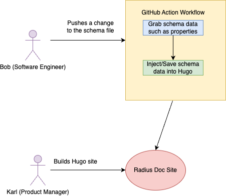

# Title

* **Status**: Pending
* **Author**: Jason Viviano (@jasonviviano)

## Overview

As Radius grows and develops manually sustaining the pages linked above will 
become a time sink as well as lead to gaps in the information displayed to 
users. You can test this out by looking through our current CADL files such as 
the [mongoDB file](https://github.com/project-radius/radius/blob/main/cadl/
Applications.Link/mongoDatabases.cadl) and comparing the parameter descriptions 
to what is in our [MongoDB reference page](https://edge.docs.radapp.dev/
reference/resource-schema/link-schema/databases/mongodb/). The way we describe 
parameters, and the contents of this resource are not mapped 1 to 1. Any time 
there are changes to this file there will be a lag in the documentation change 
and as our resources-maintained grow and resources change content it will 
always require someone to invest time manually to handle changing the 
documentation to match the schema file.

## Terms and definitions

| Term | Definition |
|----|------|
| OpenAPI | The OpenAPI Specification is a specification language for HTTP APIs that provides a standardized means to define your API to others. |
| TypeSpec | TypeSpec is a language for describing cloud service APIs and generating other API description languages, client and service code, documentation, and other assets. TypeSpec provides highly extensible core language primitives that can describe API shapes common among REST, GraphQL, gRPC, and other protocols. |
| CADL | Deprecated/older version of TypeSpec. |

## Objectives

### Goals

* Agree on user scenarios that the automation of the reference documentation will need.
* Brainstorm options for implementation details.

### Non goals

The following points will need to be addressed in the future:

* Migration from CADL to TypeSpec.

### User scenarios (optional)

**Personas**

1. Software Engineer: Has the permission to create/update/delete schema files.
2. Documentation Maintainer/Product Manager: Has the role to update and maintain the Radius documentation including its markdown files and overall structure.

#### MongoDB TypeSpec schema file is updated by the software engineer

Bob is a software engineer on Team Sushi for Radius, he has to implement a new feature that requires adding a new parameter called `cool` to the MongoDB resource. He decides that in order to accomplish this the steps are:

1. Updating the `mongoDatabases.cadl` file with the paramater `name`, `description` and `data type`.

Changing the schema from:

```
@doc("MongoDatabase link properties")
model MongoDatabaseProperties extends BasicResourceProperties{
  @doc("Provisioning state of the mongo database link at the time the operation was called")
  @visibility("read")
  provisioningState?: ProvisioningState;

  @doc("Secret values provided for the resource")
  secrets?: MongoDatabaseSecrets;
  ....
```

To:

```
@doc("MongoDatabase link properties")
model MongoDatabaseProperties extends BasicResourceProperties{
  @doc("Provisioning state of the mongo database link at the time the operation was called")
  @visibility("read")
  provisioningState?: ProvisioningState;
  ....

  @doc("Specifies if the resource is cool")
  cool?: boolean;
  ....
```

2. Merging his PR to the main branch.

Once Bob completes these steps, any other action required from him on the documentation side is done. He pings his Karl the PM for Team Sushi about the merge and goes on about his day.

Karl now has to simply build the Radius documentation using the latest version of the Radius repo in order to check on the MongoDB resource reference page.
When Karl visits the Radius MongoDb resource reference page he will automatically see an updated resource parameter table that contains:

```
## Properties

| Property |	Required |	Description |
....
| `cool` |	y | Specifies if the resource is cool |
```

#### PostgreSQL is added as a TypeSpec schema file that needs to also have its own reference page.

Bob is a software engineer for Team Sushi, he has to create a new TypeSpec schema file for the new resource that Radius supports, PostgreSQL. The steps he follows are the following:

1. Bob creates the file `postgresql.tsp`.
2. Schema contains the following parameter defined:

```
@doc("Postgresql link properties")
model PostgresqlProperties extends BasicResourceProperties{
  @doc("Provisioning state of the postgresql database link at the time the operation was called")
  @visibility("read")
  provisioningState?: ProvisioningState;

  @doc("Secret values provided for the resource")
  secrets?: postgresqlSecrets;

  @doc("Host name of the target postgresql database")
  host?: string;

  @doc("Port value of the target postgresql database")
  port?: int32;

  @doc("Database name of the target postgresql database")
  database?: string;

  @doc("The recipe used to automatically deploy underlying infrastructure for the postgresql link")
  recipe?: Recipe;

  @doc("List of the resource IDs that support the postgresql resource")
  resources?: ResourceReference[];

  @doc("Specifies how the underlying service/resource is provisioned and managed.")
  resourceProvisioning?: ResourceProvisioning;

  @doc("Username to use when connecting to the target postgresql database")
  username?: string;
}
```

3. Bob's PR gets merged into the main version of the Radius repo.

Once Bob is finished with the task he pings Karl the product manager on Team Sushi. Karl's job in this is now to create the markdown page that will host the information for PostgreSQL. For Karl the steps are:

1. Build the Radius documentation Hugo page.
2. Create a markdown file for the PostgreSQL reference resource page called `postgresql.md`.
3. To populate the markdown file with the PostgreSQL parameter data found in the schema Karl uses a [custom Hugo shortcode](https://gohugo.io/templates/shortcode-templates/) that builds a table directly using the `name`, `required`, `description` values found in the schema:

```
## Properties

{{ with .Get "schema-data" }}
{{ else }}
{{ errorf "missing value for parameter 'name': %s" .Position }}
{{ end }}
```

4. Once Karl has formatted the page with the markdown structure outline needed and placed the Hugo shortcode for data needed he can push a PR and merge his changes to the Radius documentation. 

## Design

The diagram below depicts the high-level interactions that users will have with the GitHub Action workflow used to build the connection with the Radius repo and the Radius documentation.



### Requirements

The following requirements must be addressed to enable the discussed scenarios:

| Priority | Requirement |
| P0 | Collecting schema model data from TypeSpec(I.e. scrapping model parameters and functions) |
| P0 | Transfering schema model data to markdown form |
| P1 | Support for using schema model data in Hugo shortcodes | 

### Dependencies

1. CADL/TypeSpec files: schema file standardization might be needed.

### Design details

TypeSpec doesn't currently support a direct schema file to markdown approach however there is a `tsp` file to `json` or `yaml` OpenAPI spec file conversion method. A possible high level design workflow  could operate as such:

#### Option 1

1. Typespec file converted to OpenAPI.
2. OpenAPI file is converted to data which can then be manipulated and injected into markdown files or into some Hugo config file to be stored in a variable.
3. Process is converted into a GitHub Actions workflow script that runs in order to save the data for use for the Radius doc repo.

### API design (if applicable)

N/A

## Alternatives considered

There's plenty of ways to interact with an OpenAPI file to extract data. Through NodeJS I've found that the following libraries help with manipulating the schema file:

- https://github.com/Mermade/widdershins, library for NodeJS
- [Generating TypeScript Types from Open API & JSON Schemas](https://www.youtube.com/watch?v=PYmqcCsmTGQ&t=2220s)

However I think it's important to call out that depending on the programming language used for the actual scripting file that alternatives or possibly better libraries could exist. I believe Python might also hold a couple of libraries that
interact with OpenAPI at a reasonable level.

## Test plan

N/A

## Security

N/A

## Compatibility (optional)

N/A

## Monitoring

N/A

## Development plan

N/A

## Open issues

1. 

## Appendices

### CADL Vs Typespec

Typespec is the newer version of the project formerly known as CADL and because of that there’s been some changes to how some of formatting of its schema models. I’ll provide just some examples of the differences to help people get some context.

#### File Extension
CADL: `redisCaches.cadl`
Typespec: `redisCaches.tsp`

#### Imports
redisCaches.cadl
```
import "@cadl-lang/rest";
import "@cadl-lang/versioning";
import "@azure-tools/cadl-azure-core";
import "@azure-tools/cadl-azure-resource-manager";
import "@azure-tools/cadl-providerhub";
import "@cadl-lang/openapi";

// These files allow the use of {rootScope} in the generated paths with a custom resourceOperations object
import "../customRootScope.cadl";
import "../aksrootscope.cadl";

import "./global.cadl";

using Cadl.Http;
using Cadl.Rest;
using Cadl.Versioning;
using Azure.ResourceManager;
using Azure.ResourceManager.Radius;
using OpenAPI;
```

redisCaches.tsp

```
import "@typespec/rest";
import "@typespec/openapi3";
import "@typespec/versioning";
import "@typespec/http";
import "@azure-tools/typespec-azure-core";
import "@azure-tools/typespec-azure-resource-manager";
import "@azure-tools/typespec-providerhub";

// These files allow the use of {rootScope} in the generated paths with a custom resourceOperations object
import "./customRootScope.tsp";
import "./aksrootscope.tsp";

import "./global.tsp";

using TypeSpec.Http;
using TypeSpec.Rest;
using TypeSpec.Versioning;
using Azure.ResourceManager;
using Azure.ResourceManager.Radius;
using OpenAPI;
```

#### Decorators
redisCaches.cadl

```
@versionedDependency(Azure.ResourceManager.Versions.v1_0_Preview_1)
namespace Applications.Link;
```


redisCaches.tsp
```
@useDependency(Azure.ResourceManager.Versions.v1_0_Preview_1)
namespace Applications.Link;
```
