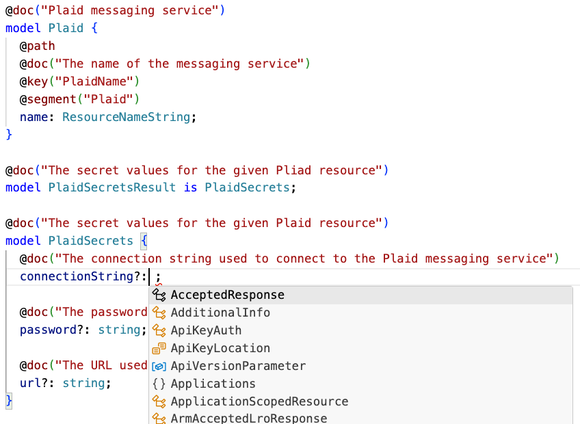
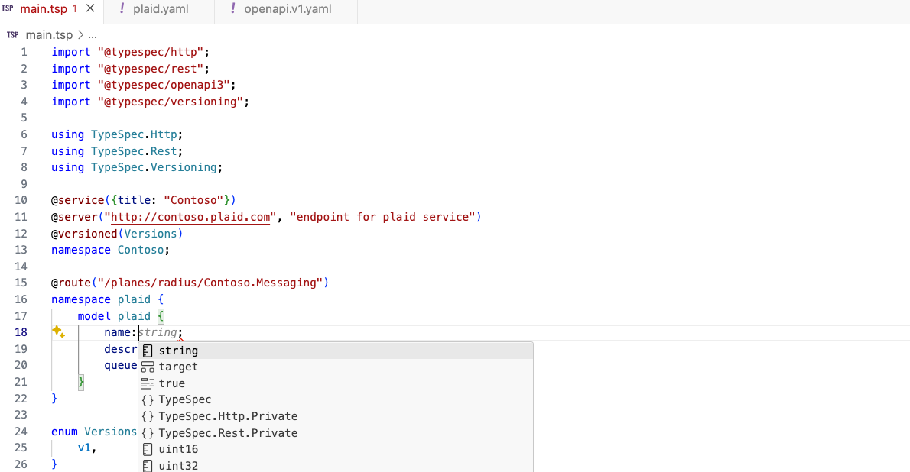

# Resource Extensibility (User Defined Resource Types)

* **Status**: Pending
* **Author**: Reshma abdul Rahim (@reshrahim)

## Summary

The cloud native landscape is changing and expanding at a rapid pace like never before. Many enterprises use a wide range of technologies together for achieving their cloud-native strategy.  For any technology that’s a newcomer and helps solve a problem in the cloud native landscape, users look for an easy and seamless way to integrate their existing tools and technologies and incrementally adopt the new technology to their strategy. For Radius, we have heard requests from our users/community to support technologies that their applications are tightly coupled with E.g.: an internal messaging service or a technology they absolutely love E.g.: PostgreSQL/Kafka.

We need to enable the open-source community to build and experiment with imperfect things. We need to provide an extensibility model that supports “Bring your own technology”, define and use it with Radius. This will help us to meet the community where they are and enable them to experiment and leverage their work as open-source contributions.

One of the high value extensibility points in Radius is Recipes. We have received interests to create custom resource types, define Recipes for the custom resource types and use it in the Radius application. Today Radius Extenders helps unblock users by modeling any kind of technology in an untyped way, but they are not first-class in the same way a custom type is. The goal of providing resource extensibility is to empower developers or infrastructure operators to author and run their applications with custom resource types seamlessly in Radius and use all the other features such as Recipes, connections and app graph with ease and flexibility.

### Top level goals

1. Enable users to author their applications with custom resource types in Radius without having to write Go code to integrate with Radius components and deploy their application seamlessly.
2. Automatically enable Radius features such as Recipes, Connections, App graph, rad CLI for custom resource types.
3. Enable users to contribute and open-source the custom resource types and recipes to the community. This will accelerate the adoption of Radius across the cloud native community.
4. Radius uses the resource extensibility framework to refactor its already built in resource types.

### Non-goals (out of scope)

We will not cover the design and user experience for "Recipes for any resource" in this document to keep the scope of the work simple.


## User profile and challenges

**Enterprises**: Platform engineering teams or operations in enterprises focus on streamlining the developer-experience for their organization by defining a set of recommended practices for application teams and provide self-service capabilities for application teams/developers to use. Radius aids the platform engineering efforts with the help of Recipes where the platform engineers or operators define the infrastructure-as-code templates to create resources on demand when application is deployed. One of the major challenges that exists with the Recipes today is the limited number of resources supported. Radius doesn’t provide an extensibility model for users to bring their custom resources, define Recipes and deploy them.

**Open-source community**: Building a sustainable open-source community is crucial to the success of any open-source project, including Radius. We need to cultivate an ecosystem for the open-source community to thrive, innovate and produce high quality work. Users from the community are motivated to contribute for different reasons:
    -  They want to use the project at their work and need a feature, 
    -  The project triggered their interests in the cloud native landscape and want to use the technology.
    -  They want to code in a particular language E.g. :Go
    -  They want to integrate their existing tools and technologies with the project

Today Radius enables users to get started on contributing to Radius with good-first-issues but doesn’t have a model to promote contributions further. Since the beginning of its open source launch, [Dapr](www.dapr.io) created the components repository and invited users to build their own components to unblock their scenarios and in turn folks contributed to the project. Learning from Dapr, Radius needs to have the extensibility points defined for contributors to interact with the project so that they can build out the things that they need to enable their scenarios and in turn the community gets benefitted with those contributions.

### User persona(s)
<!-- Who is the target user? Include size/org-structure/decision makers where applicable. -->

- Platform engineers: Platform engineers are responsible for streamlining the developer-experience for their organization by defining a set of recommended practices for application teams and provide self-service capabilities for application teams/developers to use. They are responsible for building the platform and providing the necessary tools and services for the application teams to deploy their applications.

- IT Operators: IT operators are responsible for managing the infrastructure and ensuring that the applications are running smoothly. They are responsible for maintaining the infrastructure and providing support for the infrastructure. They are the primary users of Radius Recipes as they are responsible for defining the infrastructure-as-code templates for the applications.

- System Reliability Engineers (SREs) : SREs are responsible for ensuring the reliability of the applications and services that are deployed in the cloud. They are responsible for maintaining the infrastructure and ensuring that the applications are running smoothly. They maintain the infrastructure-as-code templates and provide support for the applications that are deployed. 

- System integrators : System integrators are partners who help enterprises integrate proprietary services with cloud native applications. They are responsible for designing and building cloud native applications on behalf of their customers.

- Developers : Developers are responsible for building the cloud native applications. They are responsible for writing the code, designing and maintaining the applications.

- Open-source contributors : Cloud native open-source contributors can be any of the above personas who are interested in contributing to the cloud native projects. 

### Positive user outcomes

- Author and deploy : I can bring my own applications with custom resources/services and integrate with Radius seamlessly. I don’t have to write Go code to integrate with Radius components and can use simple spec to generate the resource definition and integrate with Radius 

- Recipes for user defined types: I can create Recipes for the custom resource types and deploy via Radius 

- OSS contributions: I can create and contribute Recipes for the custom resource types for the community to use.

## Key scenarios

### Scenario 1: Deb integrates the Budgets app with Radius

Deb, a platform engineer at a Financial Services company, wants to integrate the Budgets app with Radius. The Budgets app relies on an internal messaging service called Plaid. Deb wants to use Plaid as a resource type in Radius to deploy the application seamlessly. He needs a way to define and use Plaid as a custom resource type in Radius without having to write Go code. This will enable him to leverage all the features of Radius, such as Recipes, Connections, and the rad CLI, with ease and flexibility.

### Scenario 2: Amy contributes and open-sources PostgreSQL support to Radius

Amy is a system integrator who helps customers build cloud native applications on AWS. Amy heard about Radius and starts integrating their customer workloads in Radius. She sees a lot of her scenarios involve PostgreSQL and finds Radius doesn’t support that yet. She wants to contribute the PostgreSQL support to Radius and open source it so anyone can use it

### Scenario 3: Raj publishes Recipes for proprietary services

Raj is a partner or a system integrator who helps enterprises integrate proprietary service for eg : Oracle database in their cloud native applications. Raj tries out Radius and wants to write Recipes to create an Oracle Database with a standard set of best practices and policies integrated. He works with a lot of customers who are wanting to use the Oracle Database recipe in their applications.

## Key dependencies and risks
<!-- What dependencies must we take in order to enable this scenario? -->

<!-- What other risks are you aware of that need to be mitigated. If you have a mitigation in mind, summarize here. -->
<!-- **Dependency Name** – summary of dependency.  Issues/concerns/risks with this dependency -->
<!-- **Risk Name** – summary of risk.  Mitigation plan if known. If it is not yet known, no problem. --> 

- Dependency: Bicep compiler merge support
    - We need to ensure that the ongoing Bicep compiler merge work is complete so that custom resource types can be dynamically generated for the user defined resource types.
    - Mitigation: Work closely with the Bicep team to ensure that the merge is completed on time and that the necessary features are available to enable custom resource types in Radius .

- Risk: Adoption and community engagement
    - There is a risk that users may not fully embrace the extensibility feature or contribute custom resource types to the community.
    - Mitigation: Actively engage with users, provide clear documentation and resources, and foster a supportive and inclusive community to encourage adoption and contributions.

- Risk: Compatibility and maintainability
    - As more custom resource types are added to Radius, there is a risk of compatibility issues and increased maintenance overhead.
    - Mitigation: Implement thorough testing and versioning strategies to ensure compatibility, and establish clear guidelines for maintaining custom resource types.

- Risk: Security and trust
    - Allowing users to contribute custom resource types introduces potential security risks and the need to establish trust in the community-contributed code.
    - Mitigation: Implement strict security measures, such as code reviews and vulnerability scanning, and establish a transparent review process for community contributions.

## Key assumptions to test and questions to answer
<!-- If you are making assumptions that, if incorrect, would cause us to significantly alter our approach to this scenario, make them explicit here.  Also call out how / when you plan to validate key assumptions. -->
<!-- What big questions must we answer in order to clarify our plan for this scenario.  When and how do you plan to answer those questions (prototype feature x, user research, competitive research, etc) -->

- Assumption: Users will find value in the extensibility feature and actively contribute to the community.
- Assumption: Users will use extensibility in lieu of existing extenders because they want to take advantage of things like strong typing and validation in Radius

## Current state 
<!-- If we already have some ongoing investment in this area, summarize the current state and point to any relevant documents. -->

### Existing solutions

| Solution | Description | Challenges |
|----------|-------------|------------|
| Kubernetes CRD's | Kubernetes Custom Resource Definitions (CRDs) are a way to extend the Kubernetes API and create custom resource types. CRDs allow users to define their own resource types and controllers to manage those resources. CRDs are widely used in the Kubernetes ecosystem to create custom resources for various use cases. | Complicated to author CRDs ; Versioning and Maintenance ; Ensuring backward compatibility |
| Crossplane XRD's | Built on top of Kubernetes CRD's  |  |

### Current state in Radius

[Radius Extenders](https://docs.radapp.io/guides/author-apps/custom/overview/#extenders) enables users to author custom resource types but they are weakly typed. They allow you to pass in any property or secret and for cases where the developer/operator need to extend and reference a simple resource type definition. Extenders are for untyped/ weakly typed resources and do not provide a lot of customization for users wanting to have guardrails in their platforms with strongly typed resource definitions following a strict set of rules and restrictions. 

## Existing user problem
<!-- <Write this in first person. You basically want to summarize what “I” as a user am trying to accomplish, why the current experience is a problem and the impact it has on me, my team, my work and or biz, etc…. i.e. “When I try to do x aspect of cloud native app development, I have the following challenges / issues….<details>. Those issues result in <negative impact those challenges / issues have on your work and or business.> -->

### User Jobs to be done

As a platform engineer trying to build a custom platform for application development, I have the following jobs to be done and requirements to meet:

#### Main job : Build a custom platform for application development

|  Related jobs | Functional aspects | Emotional aspects | 
| ------------- | ------------------ | ----------------- | 
| Define the set of key technologies for the enterprise applications | Set of technologies that organizations intend to use for their applications based on the nature of technology, open-source support, documentation support, existing vendor relations, expertise in the team | Easy to use, troubleshoot, sense of service ownership |
| Specify the contract for the key services in the application platform | Author a schema for the custom resources easily with auto guidance tools | Simple tools that enables the schema authoring, uniformity and consistency |
| Iterating and testing the application platform | Productive inner loop for development and testing the application platform | Simple and easy way to iterate on changes, test and deploy them |
| Ship the custom platform | Registering the API's to the platform, providing documentation, onboarding and support | intuitive, seamless, collaborative |
| Maintain the custom platform | Versioning and maintaining the API's | Ease of support, sense of ownership (decision making) | 
| Support for compliance and security | Compatibility and security policies | Trust the platform |
| Open-source custom resources | Repository and pipeline to validate, testing the infrastructure and publishing  | Desire to contribute, easy to use, low overhead /dependency to publish |

As an IT operator and developer trying to build and maintain the application, I have the following jobs to be done and requirements to meet:

#### Main job : Use the custom platform to build and maintain the application

|  Related jobs | Functional aspects | Emotional aspects | 
| ------------- | ------------------ | ----------------- | 
| Use the custom app platform to build my application  | Learn, define and consume the APIs | Easy to use, adopt, low concept count | 
| Manage and deploy the custom resources in the application platform| Create a IaC template for the custom resource type with compliance and other policies | Easy to author, test and deploy |  
| Maintain the application over time | Versioning of the custom resources and enabling automatic upgrades | Less overhead to maintain |
| Troubleshoot the custom application platform | Tools or experiences in Dashboard that enables users to troubleshoot and manage the custom resources | Immediate access to key data for troubleshooting, simple and intuitive |
| Open sourcing templates | Repository and pipeline to validate, testing the infrastructure and publishing  | Desire to contribute, easy to use, low overhead /dependency to publish |

## Solution approach in Radius

### Main job : Build a custom platform for application development

#### Define the set of key technologies for the enterprise applications
Enterprises choose technologies based on the nature of technology, open-source support, documentation support, existing vendor relations, expertise in the team. Radius can provide the following to the users:

*Community supported assets* : Community supported assets include the resource type definitions and IaC templates to deploy and manage resources in applications. Radius can enable the community to provide and use the assets for the prevalent cloud native technologies. This will help users to use pre-existing assets IaC templates and definitions in their applications without having to author them from scratch. 

*Community supported assets meets their requirements* : Enterprises have a wide range of requirements for their applications based on the nature of the application, market, region, hosting models,compliance and security policies. Radius can enable the community to provide and use the resource type definitions and IaC templates that meet the requirements of the enterprises and meet them where they are. This will enable users to build what they want via Radius thus unblocking them to build their applications.

*Maintenance and support for the community supported assets* : Radius can provide the necessary tools and services to maintain and support the community supported assets. This will help the community to contribute, maintain the assets and provide support to the users who are using the assets.

**Solution in Radius**

1. Resource extensibility for defining the custom resource types in Radius
1. Recipes for the custom resource types
1. Community supported resource type definitions
1. Community supported Recipes
1. Radius auto generates AWS, Azure Recipes from the definitions (Recipes for any resource) 

We will cover the design and user experience for all the above solutions except for "Recipes for any resource" in this document to keep the scope of the work simple.

#### Specify the contract for the key services in the application platform

As a platform engineer, I want to provide the custom platform with the following: 

*Resource schema authoring*: Define a schema for the custom resource types that my application uses in Radius. The schema defines the structure and properties of the custom resource type. 

*Auto guidance for schema authoring*: The resource schema authoring tool provides auto guidance and validation to help the user author the schema. The auto guidance tool provides suggestions and recommendations to the user based on the schema that they are authoring. 

*Consistency and uniformity in the schema*: The authored resource schema is consistent and uniform across all the custom resource types that the user defines.

**Solution in Radius**

*Schema authoring format*

| Schema Format | Why chose? | Why not to chose? | 
|---------------|------------|-------------------|
| Typespec | Developer friendly; Maintenance and upgrades are easier; Errors and guidance violations at development time  | Microsoft developed language; May not be widely adopted by the cloud-native communities ; Yet another language to adopt | 
| OpenAPI YAML/JSON | More common and standard format across the open-source communities ; K8s CRD's follow the structure of Open API  | Managing versions and ensuring backward compatibility is challenging |

*User groups and their needs*

There are two types of users that we need to cater to:
1. Users who are new or comfortable with experimenting a new schema format typespec
1. Users who are familiar with openAPI schema format and are proficient in defining the schema in YAML/JSON format

Hence, we need to support both the schema formats in Radius to support both user groups.

*User experience*

1. Deb is a platform engineer at Contoso open to use typespec and wants to author a custom resource Plaid in Radius

    Pre-requisites: User has typespec compiler/CLI installed

    1. Deb uses the radCLI to scaffold a template typespec definition

        ```bash
        rad resource-provider init contoso --template-kind typespec
        ```
        A sample contoso.tsp file and manifest files are created in the application folder with all the typespec dependencies installed.

        Question :Can we build on top of `tsp init` which is used to set up a typespec project with a sample template? The other option is to use `rad resource-provider new` to scaffold a template typespec definition and the user takes care of the typespec dependencies and setup which might be a confusing.

    1. Deb authors the schema for plaid in typespec format
        
        ```
        import "@typespec/http";
        import "@typespec/rest";
        import "@typespec/openapi3";
        import "@typespec/versioning";

        using TypeSpec.Http;
        using TypeSpec.Rest;
        using TypeSpec.Versioning;

        @service({title: "Contoso"})
        @server("http://contoso.plaid.com", "endpoint for plaid service")
        @versioned(Versions)
        namespace Contoso;

        @route("/planes/radius/Contoso.Messaging")
        namespace plaid {
            model plaid {
                name:string;
                description:string;
                queue:string;
            }
        }

        ```

    1. VSCode Type spec extension warns Deb on the errors and warnings as he types
     
        

    1. Deb uses intellisense to autocomplete the schema and properties

        

    1. Deb chooses a version for the schema

        ```
        import "@typespec/http";
        import "@typespec/rest";
        import "@typespec/openapi3";
        import "@typespec/versioning";

        using TypeSpec.Http;
        using TypeSpec.Rest;
        using TypeSpec.Versioning;

        @service({title: "Contoso"})
        @server("http://contoso.plaid.com", "endpoint for plaid service")
        @versioned(Versions)
        namespace Contoso;

        @route("/planes/radius/Contoso.Messaging")
        namespace plaid {
            model plaid {
                name:string;
                description:string;
                queue:string;
            }
        }

        enum Versions {
            v1,
        }
        ```
   1. Deb registers the schema in Radius
    
        ```bash
        rad resource-provider register contoso --template-kind typespec -e myenv -v v1
        ```
        Radius complies the schema and registers the custom resource type Plaid in UCP

    1. Deb lists the resources types he has in his environment

        ```bash
        rad resource-provider list -e myenv
        ```
        Radius lists the custom resource types that Deb has registered in his environment

2. Amy is a system integrator who is familiar with OpenAPI schema format and wants to author a custom resource PostgreSQL in Radius

    1. Amy uses the radCLI to scaffold a yaml template definition

        ```bash
        rad resource-provider init plaid --template-kind yaml
        ```
        A sample yaml file is created in the application folder.

    1. Amy authors the schema for plaid in typespec format
        
        ```
        namespace: 'Applications.Datastores'
        apiVersion: 'v1'
        scope: '/planes/radius/Applications.Datastores'
        resourceTypes:
            'Applications.Datastores/postgreSQL':
                name: 'Name of the resource'
                description: 'PostgreSQL' 
                properties: 
                required: ['host', 'env', 'secrets']
                host:
                    type: 'string'
                    description: 'Hostname'
                env:
                    type: 'string'
                    description: 'Radius environment'
                app:
                    type: 'string'
                    description: 'Radius application'
                secrets:
                    connectionstring:
                    type: 'string'
                    description: 'Connection string for PostgreSQL'
        ```

    1. Amy adds a version for the schema

         ```
        namespace: 'Applications.Datastores'
        apiVersion: 'v1'
        scope: '/planes/radius/Applications.Datastores'
        resourceTypes:
            'Applications.Datastores/postgreSQL':
                name: 'Name of the resource'
                description: 'PostgreSQL' 
                properties: 
                required: ['host', 'env', 'secrets']
                host:
                    type: 'string'
                    description: 'Hostname'
                env:
                    type: 'string'
                    description: 'Radius environment'
                app:
                    type: 'string'
                    description: 'Radius application'
                secrets:
                    connectionstring:
                    type: 'string'
                    description: 'Connection string for PostgreSQL'
        ```
   1. Amy registers the postgreSQL schema to an existing provider in Radius
    
        ```bash
        rad resource-type add -rp Applications --template-kind yaml -e myenv -v v1
        ```
        
        Radius complies the schema and registers the custom resource type Plaid in UCP
        
        Question : Will we continue to accept new types like postgreSQL to `Applications` namespace
   
#### Iterating and testing the application platform

 As a platform engineer, I need a productive inner loop for development and testing the application platform. Simple and easy way to iterate on changes, test and deploy them

**Solution in Radius**

1. Bicep tooling support to test and deploy the custom resource types - rad CLI support to generate and publish the Bicep types for the custom resources to the registry.
1. Documentation to guide the users on how to test and deploy the custom resource types in Radius

*User groups and their needs*

There are two types of users that we need to cater to:
1. Users who have registered schema using typespec schema format
1. Users who have registered schema using yaml schema format

*User experience*

1. Deb compiles the typespec schema 
    
        ```bash
        tsp compile
        ```
        The typespec schema is compiled and validated for any errors and warnings

1. Deb publishes the bicep types to a registry
    
        ```bash
        rad publish-bicep-types --file contoso.tsp --registry myregistry
        ```
    The `contoso.tsp` is complied into open api specs; the  index.json and types.json files are generated and published to the registry for the custom resource type Plaid and the new resource provider is added to `bicepconfig.json`
    ```json
    {
        "experimentalFeaturesEnabled": {
            "extensibility": true,
            "extensionRegistry": true,
            "dynamicTypeLoading": true
        },
        "extensions": {
            "radius": "br:biceptypes.azurecr.io/radius:latest",
            "aws": "br:biceptypes.azurecr.io/aws:latest"
            "Contoso": "br:biceptypes.azurecr.io/contoso:latest"
        }
    }
    ```

1. Create a app.bicep with plaid resource type

    ```bicep
    param plaidName string
    param plaidDescription string
    param plaidQueue string

    resource plaid 'Contoso.Messaging/Plaid@v1' = {
        name: plaidName
        description: plaidDescription
        queue: plaidQueue
    }
    ```
1. Deb uses the rad CLI to deploy the application with the custom resource type Plaid

    ```bash
    rad deploy app.bicep 
    ```
    The application is deployed with the custom resource type Plaid in Radius. Deb can iterate on the changes, compile and test the application with the custom resource type.

#### Ship the custom platform

As a platform engineer, I want to register the API's to the platform, provide documentation, onboarding and support. Intuitive, seamless, collaborative

**Solution in Radius**

1. End-end-documentation for the custom resource types - Radius provides documentation to the users on how to author, test and deploy the custom resource types in Radius.
    1. Typespec samples and documentation - Provide samples and documentation for the users to author the schema in typespec format
    1. Documentation for generating Radius-Bicep types - Reuse existing pipelines and GH workflows used in Radius to generate Radius types in Bicep as an example and provide documentation to the users on how to build and publish the custom resource types in Radius.

Question - Documentation seems like a good starting point for users to get started on using custom resource types? What are other ways, should we provide sdk's to author the schema and generate the types?

#### Maintain the custom platform

As a platform engineer, I want to version and maintain the API's. Ease of support, sense of ownership (decision making)

**Solution in Radius**

* Versioning of the API's

* Versioning of the bicep types
