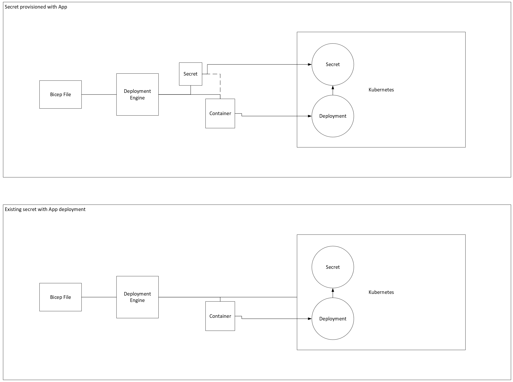

# Support secret stores in environment variables

* **Author**: Nick Beenham (@superbeeny)

## Overview

Currently the only way to provide kubernetes secrets to a container is to mount them through a secret volume. This is not ideal for many use cases, especially when the secret is only needed in the environment variables of the container. This proposal aims to add support for secret stores to the environment variables of a container.

## Terms and Definitions
Kubernetes secret: A Kubernetes object that stores sensitive data, such as passwords, OAuth tokens, and ssh keys. Putting this information in a secret is safer and more flexible than putting it verbatim in a pod definition or in a docker image. See the documentation [here](https://kubernetes.io/docs/concepts/configuration/secret/).

## Objectives

> **Issue Reference:** [Issue #5520](https://github.com/radius-project/radius/issues/5520)

### Goals

- Allow users to provide Kubernetes secrets to a container through environment variables

### Non-Goals
- (out-of-scope): Integration with other secret stores besides Kubernetes. This is tracked by other issues.
- (out-of-scope): Other users for secrets besides envvars. This is tracked by other issues.

### User scenarios (optional)

<!--
Describe the user scenarios for this design. Ensure that you define the
roles and personas in these user scenarios when it requires API design.
If you have an existing issue that describes the user scenarios, please
link to that issue instead.
-->

#### User story 1
As a radius user, I want to provide a secret to a container through an environment variable so that I can avoid mounting the secret as a volume. I want to be able to reference the secret within the application bicep file.

```bicep
extension radius

@description('The Radius Application ID. Injected automatically by the rad CLI.')
param application string

resource demo 'Applications.Core/containers@2023-10-01-preview' = {
  name: 'demo'
  properties: {
    application: application
    container: {
      image: 'ghcr.io/radius-project/samples/demo:latest'
      ports: {
        web: {
          containerPort: 3000
        }
      }
      env: {
        DB_USER: { value: 'DB_USER' }
        DB_PASSWORD: {
          valueFrom: {
            secretRef: {
              source: secret.id
              key: 'DB_PASSWORD'
            }
          }
        }
      }
    }
  }
}

resource secret 'Applications.Core/secretStores@2023-10-01-preview' = {
  name: 'secret'
  properties: {
    application: application
    data: {
      DB_PASSWORD: {
        value: 'password'
      }
    }
  }
}

```

To reference a secret directly:
  
  ```bicep
  env: {
        DB_USER: { value: 'DB_USER' }
        DB_PASSWORD: {
          valueFrom: {
            secretRef: {
              source: 'myKubernetesSecret'
            }
          }
        }
      }
```


## Design

### High Level Design
<!--
High level overview of the data flow and key components.

Provide a high-level description, using diagrams as appropriate, and top-level
explanations to convey the architectural/design overview. Don’t go into a lot
of details yet but provide enough information about the relationship between
these components and other components. Call out or highlight new components
that are not part of this feature (dependencies). This diagram generally
treats the components as black boxes. Provide a pointer to a more detailed
design document, if one exists. 
-->
The design of this new feature will require updates to the versioned datamodel, the conversion functions, the containers typespec and the common typespec.
These will be breaking changes to the schema. Users will need to update the environment variables in their bicep files to use the new secret reference type. 

### Architecture Diagram


### Detailed Design

<!--
This section should be detailed and thorough enough that another developer
could implement your design and provide enough detail to get a high confidence
estimate of the cost to implement the feature but isn’t as detailed as the 
code. Be sure to also consider testability in your design.

For each change, give each "change" in the proposal its own section and
describe it in enough detail that someone else could implement it. Cover
ALL of the important decisions like names. Your goal is to get an agreement
to proceed with coding and PRs.

If there are alternatives you are considering please include that in the open
questions section. If the product has a layered architecture, it's good to
align these sections with the product's layers. This will help readers use
their current understanding to understand your ideas.

Discuss the rationale behind architectural choices and alternative options 
considered during the design process.
-->
The design of this feature will require updates to the versioned datamodel, the conversion functions, the containers typespec and the common typespec to leverage the new secret reference type and provide support for secret stores in environment variables beyond the current support for environment variables with a string value.

#### Advantages (of each option considered)
<!--
Describe what's good about this plan relative to other options. 
Provides better user experience? Does it feel easy to implement? 
Provides flexibility for future work?
-->
Advantages of this approach are that it allows users to provide secrets to a container through environment variables. This is a common use case and will make it easier for users to provide secrets to their containers. In using much of the existing functionality of Radius, this approach is also relatively simple to implement.

#### Disadvantages (of each option considered)
<!--
Describe what's not ideal about this plan. Does it lock us into a 
particular design for future changes or is it flexible if we were to 
pivot in the future. This is a good place to cover risks.
-->
Disadvantages are that it will break existing bicep files that use environment variables. Users will need to update their bicep files to use the new secret reference type.

#### Proposed Option
<!--
Describe the recommended option and provide reasoning behind it.
-->

We first convert the versioned datamodel to a base datamodel that can handle secrets.

```diff
// toEnvDataModel: Converts from versioned datamodel to base datamodel
func toEnvDataModel(e map[string]*EnvironmentVariable) (map[string]datamodel.EnvironmentVariable, error) {

	m := map[string]datamodel.EnvironmentVariable{}

	for key, val := range e {
		if val == nil {
			return nil, v1.NewClientErrInvalidRequest(fmt.Sprintf("Environment variable %s is nil", key))
		}
		if val.Value != nil && val.ValueFrom != nil {
			return nil, v1.NewClientErrInvalidRequest(fmt.Sprintf("Environment variable %s has both value and secret value", key))
		}

		if val.Value != nil {
			m[key] = datamodel.EnvironmentVariable{
				Value: val.Value,
			}
		} else {
			m[key] = datamodel.EnvironmentVariable{
				ValueFrom: &datamodel.EnvironmentVariableReference{
					SecretRef: &datamodel.EnvironmentVariableSecretReference{
						Source: to.String(val.ValueFrom.SecretRef.Source),
						Key:    to.String(val.ValueFrom.SecretRef.Key),
					},
				},
			}

		}

	}
	return m, nil
}

// fromEnvDataModel: Converts from base datamodel to versioned datamodel
func fromEnvDataModel(e map[string]datamodel.EnvironmentVariable) map[string]*EnvironmentVariable {
	m := map[string]*EnvironmentVariable{}

	for key, val := range e {
		if val.Value != nil {
			m[key] = &EnvironmentVariable{
				Value: val.Value,
			}
		} else {
			m[key] = &EnvironmentVariable{
				ValueFrom: &EnvironmentVariableReference{
					SecretRef: &EnvironmentVariableSecretReference{
						Source: to.Ptr(val.ValueFrom.SecretRef.Source),
						Key:    to.Ptr(val.ValueFrom.SecretRef.Key),
					},
				},
			}

		}
	}

	return m
}

```


### API design 

<!--
Include if applicable – any design that changes our public REST API, CLI
arguments/commands, or Go APIs for shared components should provide this
section. Write N/A here if not applicable.
- Describe the REST APIs in detail for new resource types or updates to
  existing resource types. E.g. API Path and Sample request and response.
- Describe new commands in the CLI or changes to existing CLI commands.
- Describe the new or modified Go APIs for any shared components.
-->
Updates to the container typespec to allow for secret references in environment variables. This replaces the existing environment variable type of `map[string]string`  to allow for a secret reference.  

**containers.tsp**
```diff
@doc("Definition of a container")
model Container {
  @doc("The registry and image to download and run in your container")
  image: string;

  @doc("The pull policy for the container image")
  imagePullPolicy?: ImagePullPolicy;

  @doc("environment")
  env?: Record<EnvironmentVariable>;

  @doc("container ports")
  ports?: Record<ContainerPortProperties>;

  @doc("readiness probe properties")
  readinessProbe?: HealthProbeProperties;

  @doc("liveness probe properties")
  livenessProbe?: HealthProbeProperties;

  @doc("container volumes")
  volumes?: Record<Volume>;

  @doc("Entrypoint array. Overrides the container image's ENTRYPOINT")
  command?: string[];

  @doc("Arguments to the entrypoint. Overrides the container image's CMD")
  args?: string[];

  @doc("Working directory for the container")
  workingDir?: string;
}

@doc("Envinronment variables type")
model EnvironmentVariable {

  @doc("The value of the environment variable")
  value?: string;

  @doc("The reference to the variable")
  valueFrom?: EnvironmentVariableReference;
}

@doc("The reference to the variable")
model EnvironmentVariableReference {
  @doc("The secret reference")
  secretRef: SecretReference;
}

```

We also need to move the `SecretReference` type to the common typespec so that it can be used in multiple places.

**common.tsp**
```diff
@doc("This specifies a reference to a secret. Secrets are encrypted, often have fine-grained access control, auditing and are recommended to be used to hold sensitive data.")
model SecretReference {
  @doc("The ID of an Applications.Core/SecretStore resource containing sensitive data required for recipe execution.")
  source: string;

  @doc("The key for the secret in the secret store.")
  key: string;
}
```


### Implementation Details
<!--
High level description of updates to each component. Provide information on 
the specific sub-components that will be updated, for example, controller, processor, renderer,
recipe engine, driver, to name a few.
-->
The renderer will need to be updated in several areas to handle the new secrets implementation.

The function **GetDependencyIDs** will need to be updated to handle the new secret reference type. This function will need to determine if the environment variable is a secret reference or a string. The function will also need to determine whether the secret is a radius resource or a Kubernetes secret.

The function **convertEnvVar** will need to be created to facilitate the conversion of `map[string]EnvironmentVariable` to `map[string]corev1.EnvVar`. The function will need to handle resolving the secret coming from a Kubernetes secret or a Radius resource ID.


#### Core RP (if applicable)

### Error Handling
<!--
Describe the error scenarios that may occur and the corresponding recovery/error handling and user experience.
-->
Error handling is covered within the functions and Radius errors are used where appropriate.

## Test plan

<!--
Include the test plan to validate the features including the areas that
need functional tests.

Describe any functionality that will create new testing challenges:
- New dependencies
- External assets that tests need to access
- Features that do I/O or change OS state and are thus hard to unit test
-->
### Unit Tests
- The addition of tests for the conversion functions from and to the versioned datamodel to the base datamodel.
- Update functional tests to cover the new functionality.

## Security

<!--
Describe any changes to the existing security model of Radius or security 
challenges of the features. For each challenge describe the security threat 
and its mitigation with this design. 

Examples include:
- Authentication 
- Storing secrets and credentials
- Using cryptography

If this feature has no new challenges or changes to the security model
then describe how the feature will use existing security features of Radius.
-->
The handling of secrets will remain within Kubernetes and Radius is only providing a way to reference these secrets in the environment variables of a container. This is an improvement over the current method of mounting secrets as volumes as it allows for more flexibility and security. Also, the secrets are stored in the Kubernetes secret store and are never exposed to the user.

## Compatibility (optional)

<!--
Describe potential compatibility issues with other components, such as
incompatibility with older CLIs, and include any breaking changes to
behaviors or APIs.
-->
These will be breaking changes to the schema. Users will need to update the environment variables in their bicep files to use the new secret reference type.

## Monitoring and Logging

<!--
Include the list of instrumentation such as metric, log, and trace to 
diagnose this new feature. It also describes how to troubleshoot this feature
with the instrumentation. 
-->
No additional monitoring or logging is required for this feature.

## Development plan

<!--
Describe how you will deliver your features. This includes aligning work items
to features, scenarios, or requirements, defining what deliverable will be
checked in at each point in the product and estimating the cost of each work
item. Don’t forget to include the Unit Test and functional test in your
estimates.
-->
Work completed in a pair programming session with a second developer. The work will be broken down into the following tasks:
- Update the versioned datamodel to include the new secret reference type
- Update the conversion functions to handle the new secret reference type
- Update the containers typespec to include the new secret reference type
- Update the common typespec to include the new secret reference type
- Update the functional tests to cover the new functionality
- Update the documentation to include the new functionality

## Open Questions

<!--
Describe (Q&A format) the important unknowns or things you're not sure about. 
Use the discussion to answer these with experts after people digest the 
overall design.
-->

## Alternatives considered

<!--
Describe the alternative designs that were considered or should be considered.
Give a justification for why alternative approaches should be rejected if
possible. 
-->

## Design Review Notes

<!--
Update this section with the decisions made during the design review meeting. This should be updated before the design is merged.
-->