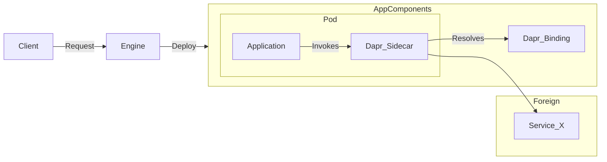

# Title

* **Author**: Lucas Peirone (@SoTrx)

## Overview

Currently Radius support for Dapr is incomplete. This design document aims to add support for another Dapr Building Blocks: Bindings.

## Terms and definitions

[Dapr](https://github.com/dapr/dapr): Distributed Application Runtime. 
Software that makes it easier to build microservice applications. It provides "building blocks" for writing microservices, which are high level functionalities. 

[Dapr Bindings](https://docs.dapr.io/developing-applications/building-blocks/bindings/bindings-overview/): Dapr building block that allows you to interact with external resources in a loosely coupled way. Bindings are used to interact with external resources such as databases, queues, and storage systems.

Bindings further subdivide into two types: input and output bindings. 
- Input bindings are used to receive events from an external resource
- Output bindings are used to send events to an external resource. 


## Objectives

> **Issue Reference:** radius-project/radius#7960

### Goals

- Allow users to create, update, and delete Dapr Bindings using Radius.

### Non goals

- (out-of-scope) Manage resources used by Dapr Bindings. This includes databases, queues, and storage systems. By definition, Dapr Bindings are meant to be used for external resources.

### User scenarios (optional)

<!--
Describe the user scenarios for this design. Ensure that you define the
roles and personas in these user scenarios when it requires API design.
If you have an existing issue that describes the user scenarios, please
link to that issue instead.
-->

#### User story 1

As a Radius user, I want my application to be able to react to external systems changes without having any dependencies on them. 

For this example, the external system X will deliver messages to a Storage Queue. 

```bicep
// Input binding to an Azure Storage Queue 
// The external system 
// https://docs.dapr.io/reference/components-reference/supported-bindings/storagequeues/
resource jobsQueue 'Applications.Dapr/bindings@2023-10-01-preview' = {
  name: 'jobsQueue'
  properties: {
    application: app.id
    environment: environment
    resourceProvisioning: 'manual'
    type: 'bindings.azure.storagequeues'
    metadata: {
      accountName: '<ACCOUNT-NAME>'
      accountKey: '<ACCOUNT-KEY>'
      queueName: '<QUEUE-NAME>'
      direction: 'input'
    }
  }
}

resource demoApp 'Applications.Core/containers@2023-10-01-preview' = {
  name: 'demo-app'
  properties: {
    connections: {
      queue: {
        source: jobsQueue.id
      }
    }
  ...
  }
}
```

Then, idependently of the backing servcie used by the external system, the application can receive and process messages in code using the created Binding.

```go
import (
	"encoding/json"
	"log"
	"net/http"
	"github.com/gorilla/mux"
)

func handler(w http.ResponseWriter, r *http.Request) {
  ctx := context.Background()
  client, _:= dapr.NewClient()
  // Note : 
  var messagePayload MyMessageType 
  _ := json.NewDecoder(r.Body).Decode(&messagePayload)
  
  // Process the message
  // ...

  // Acknowledge the message
  w.WriteHeader(http.StatusOK)     
}

func main() {
	r := mux.NewRouter()
  // Each time a request is received with the input binding
  endpoint := fmt.Sprintf("/%s", CONNECTION_QUEUE_COMPONENTNAME)
	r.HandleFunc(endpoint, handler).Methods("POST", "OPTIONS")
	http.ListenAndServe(":6002", r)
}
```

#### User story 2

As a Radius user, I want to make sure that my application is able to send messages to external systems without having any dependencies on them.

This example will use an external SMTP server to send emails. This external STMP server could be for example centralized in a company's infrastructure or an external service like SendGrid.

```bicep
// Output binding to an SMTP server. 
// https://docs.dapr.io/reference/components-reference/supported-bindings/smtp/
resource mailing 'Applications.Dapr/bindings@2023-10-01-preview' = {
  name: 'mailing'
  properties: {
    application: app.id
    environment: environment
    resourceProvisioning: 'manual'
    type: 'bindings.smtp'
    metadata: {...}
  }
}

resource demoApp 'Applications.Core/containers@2023-10-01-preview' = {
  name: 'demoApp'
  properties: {
    connections: {
      mail: {
        source: mailing.id
      }
    }
  ...
  }
}
```

Then, the application can send messages to the external system using the created Binding.

```go
ctx := context.Background()
client, _:= dapr.NewClient()
// Sending an email with the output binding
in := &dapr.InvokeBindingRequest{
    Name:      CONNECTION_MAIL_COMPONENTNAME,
    Operation: "create",
    Data: []byte("This is the body of the message"),
    Metadata: map[string]string{"emailTo": "example@example.net", "subject": "Not fishy"},
}
out, _:= client.InvokeBinding(ctx, in)
```

## Design

### High Level Design



### Detailed Design
This design will require to add a new type to the Dapr RP. This will include:
  - Adding `Application.Dapr/Bindings` to the TypeSpec frontend
  - Adding the corresponding `DaprBinding` type to the internal representation of a Dapr component
  - Allow a new type of dapr component (binding) to be emitted in the backend Kubernetes cluster.

#### Advantages (of each option considered)
The main advantage of this approach is that it is pure addition, and it will be non-breaking for existing users.

#### Disadvantages (of each option considered)
The main disavantage of this approach is that it will produce some code duplication.

#### Proposed Option

This option is the most straightforward and will be the most efficient in terms of development time.
As the implementation of the Dapr Building Block is not yet complete, it would be better to have a simple implementation that can be improved later, even if it means some code duplication.
Plus, the future implementation of User-Defined type might lead to a refactor of the Dapr RP as a whole.

### API design (if applicable)

Aside from the new type, the API will be identical to the other Dapr Building Blocks.

**typespec/Applications.Dapr/bindings.tsp**
```TypeSpec
model DaprBindingResource
  is TrackedResourceRequired<DaprBindingProperties, "DaprBindings"> {
  @doc("Binding name")
  @key("bindingName")
  @path
  @segment("bindings")
  name: ResourceNameString;
}

@doc("Dapr binding portable resource properties")
model DaprBindingProperties {
  ...EnvironmentScopedResource;
  ...DaprResourceProperties;

  @doc("A collection of references to resources associated with the binding")
  resources?: ResourceReference[];

  ...RecipeBaseProperties;
}
```

### Implementation Details

As for every Dapr Building Block, the implementation will need to create in the Dapr RP:
- A versioned/unversioned api type converter
- A dedicated processor for the Dapr Binding type

This implementation will also have some side-effects outside of the Dapr RP:
- Updates to the allowed resource type in the Portable Resource Renderer
- Updates to the `getResourceDataByID` function in the Core RP to take the new type into account 
- Updates to the `ResourceTypesList` variable in the CLI (cli/clients/managements.go) to be able to list the new type

### Error Handling

No new error handling required. The error handling will be the same as for the other Dapr Building Blocks.

## Test plan

Unit tests must cover:
- converter functions
- processor functions

Functional tests must cover:
- Using a binding in a sample application. The direction (input/output) of the binding is not important for this test. The external system can a simple Redis or even nothing at all with bindings that don't require an external system such a [CRON binding](https://docs.dapr.io/reference/components-reference/supported-bindings/cron/).
- Using a binding with a secret-store indirection. This will require a secret store to be created and used in the binding.

## Security

N/A

## Compatibility (optional)

This is purely additive and should not affect existing resources.

## Monitoring and Logging

<!--
Include the list of instrumentation such as metric, log, and trace to 
diagnose this new feature. It also describes how to troubleshoot this feature
with the instrumentation. 
-->

## Development plan

N/A, already completed 

## Open Questions

By design, it doesn't make sense to have a default recipe for a Dapr Binding as it is meant to be used with external resources. This means that this resource will always be created with a manual resource provisioning. Is there any way to make this more intuituive for the user?

## Alternatives considered

N/A 

## Design Review Notes
