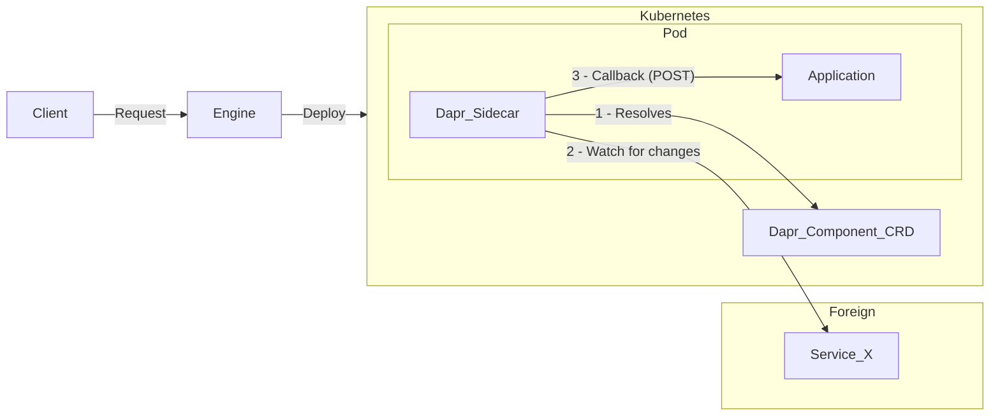
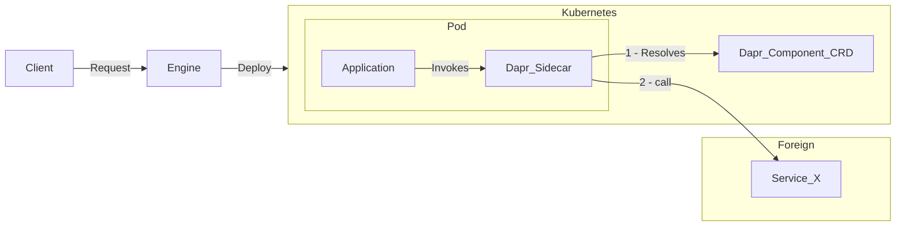

# Dapr Binding Implementation

* **Author**: `Lucas Peirone (@SoTrx)`

## Overview

This design document proposes the addition of support for Dapr Bindings within Radius. By integrating Dapr Bindings, resources will be able to interact with external systems in a decoupled and scalable manner, facilitating better communication between services and external resources.

## Terms and definitions

[Dapr](https://github.com/dapr/dapr): Distributed Application Runtime. It provides "building blocks" for writing microservices, offering high-level functionalities for common service tasks.

**External Resource**: A resource that is not part of the application's infrastructure. This could be a database, queue, storage system, etc. It may be a service created by another team within the same organization, a third-party service, or a service created by a different organization. No management rights over the external resource are assumed.

[**Dapr Bindings**](https://docs.dapr.io/developing-applications/building-blocks/bindings/bindings-overview/): A Dapr building block that enables interaction with external resources in a loosely coupled way. Bindings are used to interact with resources like databases, queues, and storage systems.

Bindings are further categorized into two types: input and output bindings:
- **Input bindings** are used to receive events from an external resource. [Example](https://docs.dapr.io/reference/components-reference/supported-bindings/kafka/)
- **Output bindings** are used to send events to an external resource. [Example](https://docs.dapr.io/reference/components-reference/supported-bindings/smtp/)
- These two categories are not mutually exclusive. Some bindings can serve as both an input and output binding.

For a single Dapr Binding, the following resources are defined:
- **Exactly one** Dapr component: This is a [Kubernetes Custom Resource Definition (CRD)](https://docs.dapr.io/reference/api/bindings_api/) that defines the binding's configuration, including authentication information.
- **Zero or one** External Resource: In some cases, the binding does not require an external resource, making it self-sufficient. An example of this is the [CRON binding](https://docs.dapr.io/reference/components-reference/supported-bindings/cron/).


## Objectives

> **Issue Reference:** radius-project/radius#7960

### Goals

- Enable users to create, update, and delete Dapr Bindings Component (CRD) using Radius.
- Create a list of recipes covering common use cases for Dapr Bindings. 

### Non goals

- (out-of-scope) Managing **external resources** used by Dapr Bindings. As we do not have management rights over the external resources, we will not be able to create, update, or delete them. The user will need to create the external resource and provide the necessary information to the Dapr Binding.

### User scenarios (optional)

#### User story 1

As an operator using Radius, I want the application I manage to interface with other applications in my organization without exposing their implementation details to the developers.

In this example, my application requires the result of a process from a foreign application as input. As the operator, I know that the foreign application is currently hosted in Azure and uses Azure Storage Queue as a messaging solution.


```bicep
// Input binding to an Azure Storage Queue 
// https://docs.dapr.io/reference/components-reference/supported-bindings/storagequeues/
resource jobsQueue 'Applications.Dapr/bindings@2023-10-01-preview' = {
  name: 'jobsQueue'
  properties: {
    application: app.id
    environment: environment
    resourceProvisioning: 'manual'
    type: 'bindings.azure.storagequeues'
    metadata: {
      accountName: '<ACCOUNT-NAME>'
      accountKey: '<ACCOUNT-KEY>'
      queueName: '<QUEUE-NAME>'
      direction: 'input'
    }
  }
}

resource demoApp 'Applications.Core/containers@2023-10-01-preview' = {
  name: 'demo-app'
  properties: {
    connections: {
      queue: {
        source: jobsQueue.id
      }
    }
  ...
  }
}
```

```go

func handler(w http.ResponseWriter, r *http.Request) {
  ctx := context.Background()
  client, _:= dapr.NewClient()

  var messagePayload MyMessageType 
  _ := json.NewDecoder(r.Body).Decode(&messagePayload)
  
  // Process the message
  // ...

  // Acknowledge the message
  w.WriteHeader(http.StatusOK)     
}

func main() {
	r := mux.NewRouter()
  // Message received from the queue will be forwarded to the service
  // on the "/<component-name>" endpoint as a POST request 
  endpoint := fmt.Sprintf("/%s", CONNECTION_QUEUE_COMPONENTNAME)
	r.HandleFunc(endpoint, handler).Methods("POST", "OPTIONS")
	http.ListenAndServe(":6002", r)
}
```

In the future, the foreign application could be moved to a different cloud provider or switch to another messaging solution:
- For the operator, this change will only require updating a single Radius resource (or recipe).
- For the developer, the application will continue receiving messages from the same endpoint.


#### User story 2

As an operator using Radius, I want the application I manage to send messages to external systems. I don't have control over the external system, but I want to ensure that the application can communicate with it.

This example uses an external SMTP server to send emails. The SMTP server could be centralized within a company's infrastructure or an external service like `SendGrid`.

```bicep
// Output binding to an SMTP server. 
// https://docs.dapr.io/reference/components-reference/supported-bindings/smtp/
resource mailing 'Applications.Dapr/bindings@2023-10-01-preview' = {
  name: 'mailing'
  properties: {
    application: app.id
    environment: environment
    resourceProvisioning: 'manual'
    type: 'bindings.smtp'
    metadata: {...}
  }
}

resource demoApp 'Applications.Core/containers@2023-10-01-preview' = {
  name: 'demoApp'
  properties: {
    connections: {
      mail: {
        source: mailing.id
      }
    }
  ...
  }
}
```

The application can then send messages to the external system using the created binding.

```go
ctx := context.Background()
client, _:= dapr.NewClient()
// Sending an email with the output binding
in := &dapr.InvokeBindingRequest{
    Name:      CONNECTION_MAIL_COMPONENTNAME,
    Operation: "create",
    Data: []byte("This is the body of the message"),
    Metadata: map[string]string{"emailTo": "example@example.net", "subject": "Not fishy"},
}
out, _:= client.InvokeBinding(ctx, in)
```
In the future, the SMTP server could be moved to a different provider or switched to a new messaging service:

- For the operator, this change will only require updating a single Radius resource or recipe.
- For the developer, the application will continue sending messages through the same binding without requiring code changes.

## Design

### High Level Design

#### Architectural components 

##### Input Binding


##### Output Binding


#### Sequence Diagram

( No changes in existing interactions)

#### Common Usage Recipes

Since a Binding is intended to interact with an external system outside of the operator control, a binding recipe would create only the CRD. This approach would require a two-step process to create a single CRD, which could otherwise be achieved in a single step using manual provisioning.

To address this, rather than mapping [every possible binding](https://docs.dapr.io/reference/components-reference/supported-bindings/) to a recipe, the proposal is to create a few common usage recipes that cover the most frequently used cases.

To maximize convenience for the user, these recipes will be designed with the following considerations:

- **Local Development**: The recipe will create both the binding CRD and the "external resource".
- **Production**: The recipe will create only the binding CRD, with the user providing the necessary information for connecting to the external resource.

**Sample Recipes:**

- **Object Storage Binding Recipe**
  - Local Development: Creates both [CRD](https://docs.dapr.io/reference/components-reference/supported-bindings/s3/#s3-bucket-creation) and a `MinIO` instance.
  - Production, Azure: Creates [CRD](https://docs.dapr.io/reference/components-reference/supported-bindings/s3/#s3-bucket-creation) only.
  - Production, AWS: Creates [CRD](https://docs.dapr.io/reference/components-reference/supported-bindings/s3/) only.

- **Mailing Binding Recipe**
  - Local Development: Creates both [CRD](https://docs.dapr.io/reference/components-reference/supported-bindings/smtp/) and a [`MailDev`](https://github.com/maildev/maildev) instance.
  - Production: Creates [CRD](https://docs.dapr.io/reference/components-reference/supported-bindings/smtp/) only.

### Detailed Design

This design will require adding a new type to the Applications.Dapr resource provider. This includes:
- Extending the TypeSpec schema definition to include the new `Application.Dapr/bindings` resource 
- Adding the corresponding Dapr Binding type to the internal representation (Dapr Resource Provider)
- Allowing a new type of Dapr component (binding) to be emitted in the backend Kubernetes cluster.

#### Advantages (of each option considered)

The main advantage of this implementation approach is that it is purely additive and will be non-breaking for existing users.

#### Disadvantages (of each option considered)

The main disadvantage of this approach is that it will lead to some code duplication.

For each new Dapr Building Block type, we will need to create both a versioned/not versioned API type converter and a dedicated processor.

The processor code for Dapr building blocks is largely similar across different types, with the only variation being the resource type involved.

Example:
- [Pub/Sub processor](https://github.com/radius-project/radius/blob/main/pkg/daprrp/processors/pubsubbrokers/processor.go)
- [Configuration store processor](https://github.com/radius-project/radius/blob/main/pkg/daprrp/processors/configurationstores/processor.go)

Similarly, the converter code is nearly identical for all Dapr building blocks, differing only in the resource type being converted.

Example:
- [Pub/Sub converter](https://github.com/radius-project/radius/blob/main/pkg/daprrp/api/v20231001preview/pubsubbroker_conversion.go)
- [Configuration store converter](https://github.com/radius-project/radius/blob/main/pkg/daprrp/api/v20231001preview/configurationstore_conversion.go)

#### Proposed Option

This option is the most straightforward and efficient in terms of development time. Since the Dapr Building Block implementation is not yet complete, it would be better to have a simple implementation that can be improved later, even if it introduces some code duplication. Additionally, future implementations of User-Defined Types may lead to a refactor of the entire Applications.Dapr resource provider.

### API design (if applicable)

Aside from the new type, the API will remain identical to the other Dapr Building Blocks.

**typespec/Applications.Dapr/bindings.tsp**
```TypeSpec
model DaprBindingResource
  is TrackedResourceRequired<DaprBindingProperties, "DaprBindings"> {
  @doc("Binding name")
  @key("bindingName")
  @path
  @segment("bindings")
  name: ResourceNameString;
}

@doc("Dapr binding portable resource properties")
model DaprBindingProperties {
  ...EnvironmentScopedResource;
  ...DaprResourceProperties;

  @doc("A collection of references to resources associated with the binding")
  resources?: ResourceReference[];

  ...RecipeBaseProperties;
}
```

### Implementation Details

As for every Dapr Building Block, the implementation will need to create in the Applications.Dapr resource provider:
- A versioned/not versioned api type converter
- A dedicated processor for the Dapr Binding type

This implementation will also have some side-effects outside of the Applications.Dapr resource provider:
- Updates to the allowed resource type in the Portable Resource Renderer
- Updates to the `getResourceDataByID` function in the Core RP to take the new type into account 
- Updates to the `ResourceTypesList` variable in the CLI (cli/clients/managements.go) to be able to list the new type

### Error Handling

For input bindings, the Dapr sidecar will send an OPTIONS request to the application at startup. The application must respond with either a 2xx or a 405 status code. If the application does not respond, the Dapr sidecar will retry the initialization 3 times before canceling the binding initialization. Additional checks can also be configured on a per-binding basis.

For output bindings, if there is an error with the external system, the Dapr sidecar will [retry the operation with the default policy](https://docs.dapr.io/operations/resiliency/policies/#retries).

This [behavior is configurable](https://docs.dapr.io/operations/resiliency/policies/#overriding-default-retries) by the user, though it is not yet possible to configure the [resiliency policy](https://docs.dapr.io/operations/resiliency/resiliency-overview/#complete-example-policy) in Radius.


## Test plan

Unit tests must cover:
- converter functions
- processor functions

Functional tests proposed:
- Using a binding in a sample application (the direction, input/output, of the binding is not important for this test). The external system can be something simple like Redis or a [CRON binding](https://docs.dapr.io/reference/components-reference/supported-bindings/cron/) that doesn't require an external system.
- Using a binding with secret-store indirection, which will require creating and using a secret store in the binding.

## Security

For data at rest, the binding can reference a secret store instead of storing sensitive information directly within the binding configuration.

For data in transit, all communication between Dapr components and external systems should use TLS/SSL. This can be configured on a per-binding basis in the metadata. 

Additionally, networking configurations can be applied in accordance with the [Dapr security specification](https://docs.dapr.io/concepts/security-concept/#bindings-security).


## Compatibility (optional)

This is purely additive and should not affect existing resources.

## Monitoring and Logging

N/A

## Development plan

N/A, already completed 

## Open Questions
N/A

## Alternatives considered

N/A 

## Design Review Notes

Round 1:
- In the first iteration, recipes were considered out of scope, as they would result in a two-step process to create a single CRD (the Dapr Binding component). This was reconsidered, as not supporting recipes for a resource contradicts the Radius design philosophy. Therefore, common usage recipes were added to the design.