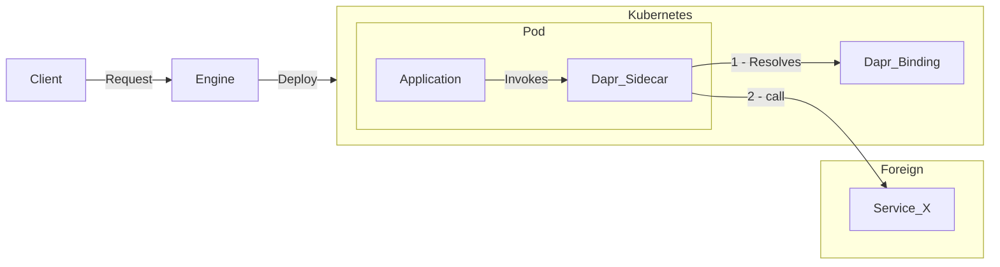

# Title

* **Author**: Lucas Peirone (@SoTrx)

## Overview

Currently, Radius support for Dapr is incomplete. This design document aims to add support for another Dapr Building Block: Bindings.

## Terms and definitions

[Dapr](https://github.com/dapr/dapr): Distributed Application Runtime. It provides "building blocks" for writing microservices, which are high level functionalities. 

[Dapr Bindings](https://docs.dapr.io/developing-applications/building-blocks/bindings/bindings-overview/): A Dapr building block that allows interaction with external resources in a loosely coupled way. Bindings are used to interact with external resources such as databases, queues, and storage systems.

Bindings are further subdivided into two types: input and output bindings:
- Input bindings are used to receive events from an external resource.
- Output bindings are used to send events to an external resource.


## Objectives

> **Issue Reference:** radius-project/radius#7960

### Goals

- Enable users to create, update, and delete Dapr Bindings using Radius.

### Non goals

- (out-of-scope) Managing resources used by Dapr Bindings. This includes databases, queues, and storage systems. By definition, Dapr Bindings are intended to be used for external resources.
- (out-of-scope) Default recipes for Dapr Bindings. Each binding will have different requirements, so it doesn't make sense to have a single default recipe.

### User scenarios (optional)

#### User story 1

As a Radius user, I want my application to be able to react to changes in external systems without depending directly on them.

In this example, an external system (X) will deliver messages to a storage queue.

```bicep
// Input binding to an Azure Storage Queue 
// The external system 
// https://docs.dapr.io/reference/components-reference/supported-bindings/storagequeues/
resource jobsQueue 'Applications.Dapr/bindings@2023-10-01-preview' = {
  name: 'jobsQueue'
  properties: {
    application: app.id
    environment: environment
    resourceProvisioning: 'manual'
    type: 'bindings.azure.storagequeues'
    metadata: {
      accountName: '<ACCOUNT-NAME>'
      accountKey: '<ACCOUNT-KEY>'
      queueName: '<QUEUE-NAME>'
      direction: 'input'
    }
  }
}

resource demoApp 'Applications.Core/containers@2023-10-01-preview' = {
  name: 'demo-app'
  properties: {
    connections: {
      queue: {
        source: jobsQueue.id
      }
    }
  ...
  }
}
```

Independently of the backing service used by the external system, the application can receive and process messages using the created binding.

```go

func handler(w http.ResponseWriter, r *http.Request) {
  ctx := context.Background()
  client, _:= dapr.NewClient()

  var messagePayload MyMessageType 
  _ := json.NewDecoder(r.Body).Decode(&messagePayload)
  
  // Process the message
  // ...

  // Acknowledge the message
  w.WriteHeader(http.StatusOK)     
}

func main() {
	r := mux.NewRouter()
  // Each time a request is received via the input binding
  endpoint := fmt.Sprintf("/%s", CONNECTION_QUEUE_COMPONENTNAME)
	r.HandleFunc(endpoint, handler).Methods("POST", "OPTIONS")
	http.ListenAndServe(":6002", r)
}
```

#### User story 2

As a Radius user, I want my application to send messages to external systems without having direct dependencies on them.

This example uses an external SMTP server to send emails. The SMTP server could be centralized within a company's infrastructure or an external service like SendGrid.

```bicep
// Output binding to an SMTP server. 
// https://docs.dapr.io/reference/components-reference/supported-bindings/smtp/
resource mailing 'Applications.Dapr/bindings@2023-10-01-preview' = {
  name: 'mailing'
  properties: {
    application: app.id
    environment: environment
    resourceProvisioning: 'manual'
    type: 'bindings.smtp'
    metadata: {...}
  }
}

resource demoApp 'Applications.Core/containers@2023-10-01-preview' = {
  name: 'demoApp'
  properties: {
    connections: {
      mail: {
        source: mailing.id
      }
    }
  ...
  }
}
```

The application can then send messages to the external system using the created binding.

```go
ctx := context.Background()
client, _:= dapr.NewClient()
// Sending an email with the output binding
in := &dapr.InvokeBindingRequest{
    Name:      CONNECTION_MAIL_COMPONENTNAME,
    Operation: "create",
    Data: []byte("This is the body of the message"),
    Metadata: map[string]string{"emailTo": "example@example.net", "subject": "Not fishy"},
}
out, _:= client.InvokeBinding(ctx, in)
```

## Design

### High Level Design

#### Architectural components 


```mermaid
graph LR
    Client -->|Request| Engine
    Engine -->|Deploy| Kubernetes
    Application -->|Invokes| Dapr_Sidecar
    Dapr_Sidecar -->|1 - Resolves| Dapr_Binding
    Dapr_Sidecar --> |2 - call| Service_X

    subgraph Foreign
        Service_X
    end

    subgraph Pod
        Application
        Dapr_Sidecar
    end

    subgraph Kubernetes
        Pod
        Dapr_Binding
    end
```	

#### Sequence Diagram

( No changes in existing interactions)

### Detailed Design

This design will require adding a new type to the Dapr RP. This includes:
- Adding Application.Dapr/Bindings to the TypeSpec frontend.
- Adding the corresponding DaprBinding type to the internal representation (DaprRP)
- Allowing a new type of Dapr component (binding) to be emitted in the backend Kubernetes cluster.

#### Advantages (of each option considered)

The main advantage of this implementation approach is that it is purely additive and will be non-breaking for existing users.

#### Disadvantages (of each option considered)

The main disadvantage of this approach is that it will lead to some code duplication.

#### Proposed Option

This option is the most straightforward and efficient in terms of development time. Since the Dapr Building Block implementation is not yet complete, it would be better to have a simple implementation that can be improved later, even if it introduces some code duplication. Additionally, future implementations of User-Defined Types may lead to a refactor of the entire Dapr RP.

### API design (if applicable)

Aside from the new type, the API will remain identical to the other Dapr Building Blocks.

**typespec/Applications.Dapr/bindings.tsp**
```TypeSpec
model DaprBindingResource
  is TrackedResourceRequired<DaprBindingProperties, "DaprBindings"> {
  @doc("Binding name")
  @key("bindingName")
  @path
  @segment("bindings")
  name: ResourceNameString;
}

@doc("Dapr binding portable resource properties")
model DaprBindingProperties {
  ...EnvironmentScopedResource;
  ...DaprResourceProperties;

  @doc("A collection of references to resources associated with the binding")
  resources?: ResourceReference[];

  ...RecipeBaseProperties;
}
```

### Implementation Details

As for every Dapr Building Block, the implementation will need to create in the Dapr RP:
- A versioned/unversioned api type converter
- A dedicated processor for the Dapr Binding type

This implementation will also have some side-effects outside of the Dapr RP:
- Updates to the allowed resource type in the Portable Resource Renderer
- Updates to the `getResourceDataByID` function in the Core RP to take the new type into account 
- Updates to the `ResourceTypesList` variable in the CLI (cli/clients/managements.go) to be able to list the new type

### Error Handling

No new error handling is required. The error handling will remain the same as for other Dapr Building Blocks.

## Test plan

Unit tests must cover:
- converter functions
- processor functions

Functional tests proposed:
- Using a binding in a sample application (the direction, input/output, of the binding is not important for this test). The external system can be something simple like Redis or a [CRON binding](https://docs.dapr.io/reference/components-reference/supported-bindings/cron/) that doesn't require an external system.
- Using a binding with secret-store indirection, which will require creating and using a secret store in the binding.

## Security

N/A

## Compatibility (optional)

This is purely additive and should not affect existing resources.

## Monitoring and Logging

N/A

## Development plan

N/A, already completed 

## Open Questions
N/A

## Alternatives considered

N/A 

## Design Review Notes
