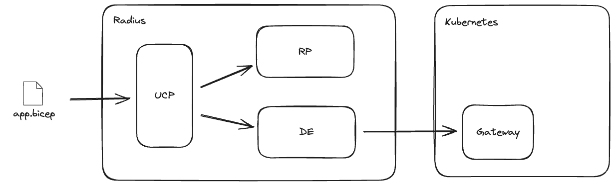

# Adding Configurable Gateway Timeouts to Radius

* **Author**: Nick Beenham (@superbeeny)

## Overview

<!--
Provide a succinct high-level description of the component or feature and 
where/how it fits in the big picture. The overview should be one to three 
paragraphs long and should be understandable by someone outside the Radius
team. Do not provide the design details in this, section - there is a
dedicated section for that later in the document.
-->
The purpose of this feature is to allow the user to configure a timeout on the gateway for an application. This will allow the user to specify how long the gateway should wait for a response from the application before timing out. This will be useful in scenarios where the application may take a long time to respond, or where the user wants to ensure that the application responds within a certain time frame.

## Terms and definitions

<!--
Include any terms, definitions, or acronyms that are used in
this design document to assist the reader. They may or may not
be part of the user-facing experience once implemented, and can
be specific to this design context.
-->
Route timeout: The amount of time the gateway should wait for a response from the application before timing out.
[specification](https://www.envoyproxy.io/docs/envoy/v1.14.2/api-v2/api/v2/route/route_components.proto#envoy-api-field-route-routeaction-timeout)

## Objectives

<!--
Describe goals/non-goals and user-scenario of this feature to understand
the end-user goals.
* If the feature shares the same objectives of the existing design, link
  to the existing doc and section rather than repeat the same context.
* If the feature has a scenario, UX, or other product feature design doc,
  link it here and summarize the important parts.
-->

> **Issue Reference:** [#8221](https://github.com/radius-project/radius/issues/8221)

### Goals

<!--
Describe goals to define why we are doing this work, how we will make
priority decisions, and how we will determine success.
-->
The goal of this feature is to allow the user to configure a timeout on the gateway for an application within the applications bicep file.

### Non goals
Other forms of routing configuration are not in scope for this feature. This includes but is not limited to:
* Configuring timeouts for other types of resources
* Configuring timeouts for other types of routing
* Configuring timeouts for other types of applications
* Configuring timeouts for other types of gateways

### User scenarios (optional)

<!--
Describe the user scenarios for this design. Ensure that you define the
roles and personas in these user scenarios when it requires API design.
If you have an existing issue that describes the user scenarios, please
link to that issue instead.
-->

#### User story 1
As a user, I want to be able to configure a timeout on the gateway for an application so that I can specify how long the gateway should wait for a response from the application before timing out.


## User Experience (if applicable)
<!--
If the change impacts the user experience, provide expected interaction 
flow we aim to achieve through this proposal.

When users interact with Radius through the CLI, include sample 
input commands and their corresponding output. Include a bicep/helm code 
sample, if this proposal involves updates to that experience.
-->

**Sample Input:**
<!--
Provide a sample CLI command input and/or bicep/helm code.
-->
```bicep
resource gateway 'Applications.Core/gateways@2023-10-01-preview' = {
  name: 'demo-gateway'
  properties: {
    application: app.id
    hostname: {
      fullyQualifiedHostname: 'demo.somedomain.com'
    }
    routes: [
      {
        path: '/'
        destination: 'http://${ui.name}:3000'
      }
      {
        timeoutPolicy: {
            request: '30s'
            backendrequest: '1m'
          }
        path: '/api'
        destination: 'http://${api.name}'
      }
    ]
    tls: {
      certificateFrom: grimmCertificateStore.id
      minimumProtocolVersion: '1.2'
    }
  }
}
```

**Sample Output:**
<!--
Provide a sample output for the inputs provided above.
-->


## Design

### High Level Design
<!--
High level overview of the data flow and key components.

Provide a high-level description, using diagrams as appropriate, and top-level
explanations to convey the architectural/design overview. Don’t go into a lot
of details yet but provide enough information about the relationship between
these components and other components. Call out or highlight new components
that are not part of this feature (dependencies). This diagram generally
treats the components as black boxes. Provide a pointer to a more detailed
design document, if one exists. 
-->

The design of this feature will require updates to the versioned datamodel, the render functions and the gateway typespec. The gateway typespec will be updated to include a timeoutPolicy object which will allow the user to configure the timeout on the gateway for an application. The render functions will be updated to render the timeoutPolicy object in the gateway resource. The versioned datamodel will be updated to include the timeoutPolicy object in the gateway resource.

### Architecture Diagram
<!--
Provide a diagram of the system architecture, illustrating how different
components interact with each other in the context of this proposal.

Include separate high level architecture diagram and component specific diagrams, wherever appropriate.
-->


### Detailed Design

<!--
This section should be detailed and thorough enough that another developer
could implement your design and provide enough detail to get a high confidence
estimate of the cost to implement the feature but isn’t as detailed as the 
code. Be sure to also consider testability in your design.

For each change, give each "change" in the proposal its own section and
describe it in enough detail that someone else could implement it. Cover
ALL of the important decisions like names. Your goal is to get an agreement
to proceed with coding and PRs.

If there are alternatives you are considering please include that in the open
questions section. If the product has a layered architecture, it's good to
align these sections with the product's layers. This will help readers use
their current understanding to understand your ideas.

Discuss the rationale behind architectural choices and alternative options 
considered during the design process.
-->

The solution would update the specification for the gateway resource in the bicep file to include a timeoutPolicy object. This object would contain the following properties:  
  **request:** The amount of time the gateway should wait for a response from the application before timing out.  
  **backendrequest:** The amount of time the gateway should wait for a response from the application before timing out when the connection is idle.

This maps to the gateway API timeoutPolicy - https://gateway-api.sigs.k8s.io/api-types/httproute/#timeouts-optional

#### Advantages (of each option considered)
<!--
Describe what's good about this plan relative to other options. 
Provides better user experience? Does it feel easy to implement? 
Provides flexibility for future work?
-->
The advantage of this approach is that it is simple and easy to understand. It allows the user to configure the timeout on the gateway for an application on a route by route basis within the applications bicep file.

These proposed changes should not be breaking changes and should not require any changes to existing applications.

#### Disadvantages (of each option considered)
<!--
Describe what's not ideal about this plan. Does it lock us into a 
particular design for future changes or is it flexible if we were to 
pivot in the future. This is a good place to cover risks.
-->

#### Proposed Option
<!--
Describe the recommended option and provide reasoning behind it.
-->

### API design (if applicable)

<!--
Include if applicable – any design that changes our public REST API, CLI
arguments/commands, or Go APIs for shared components should provide this
section. Write N/A here if not applicable.
- Describe the REST APIs in detail for new resource types or updates to
  existing resource types. E.g. API Path and Sample request and response.
- Describe new commands in the CLI or changes to existing CLI commands.
- Describe the new or modified Go APIs for any shared components.
-->
Updates to the gateway typespec to allow for timeout configuration.
```diff

@doc("Route attached to Gateway")
model GatewayRoute {
  @doc("The path to match the incoming request path on. Ex - /myservice.")
  path?: string;

  @doc("The URL or id of the service to route to. Ex - 'http://myservice'.")
  destination?: string;

  @doc("Optionally update the prefix when sending the request to the service. Ex - replacePrefix: '/' and path: '/myservice' will transform '/myservice/myroute' to '/myroute'")
  replacePrefix?: string;

  @doc("Enables websocket support for the route. Defaults to false.")
  enableWebsockets?: boolean;

  @doc("The timeout policy for the route.")
  timeoutPolicy?: GatewayRouteTimeoutPolicy;
}

@doc("Gateway route timeout policy")
model GatewayRouteTimeoutPolicy {
  @doc("The response timeout in duration for the route. Defaults to 15 seconds.")
  response?: string;
  
  @doc("The backend timeout in duration for the route. Cannot be more than the request timeout")
  backendrequest?: string;

  
}
```

### Implementation Details
<!--
High level description of updates to each component. Provide information on 
the specific sub-components that will be updated, for example, controller, processor, renderer,
recipe engine, driver, to name a few.
-->
The renderer for the gateway resource will be updated to render the timeoutPolicy object in the gateway resource. 

The versioned datamodel will be updated to include the timeoutPolicy object in the gateway resource.


#### Core RP (if applicable)

### Error Handling
<!--
Describe the error scenarios that may occur and the corresponding recovery/error handling and user experience.
-->
Error handling is covered within the functions and Radius errors are used where appropriate.

## Test plan

<!--
Include the test plan to validate the features including the areas that
need functional tests.

Describe any functionality that will create new testing challenges:
- New dependencies
- External assets that tests need to access
- Features that do I/O or change OS state and are thus hard to unit test
-->
The existing gateway tests will be updated to include tests for the new timeoutPolicy object. This will include tests to ensure that the gateway times out correctly when the response time exceeds the configured timeout.

## Security

<!--
Describe any changes to the existing security model of Radius or security 
challenges of the features. For each challenge describe the security threat 
and its mitigation with this design. 

Examples include:
- Authentication 
- Storing secrets and credentials
- Using cryptography

If this feature has no new challenges or changes to the security model
then describe how the feature will use existing security features of Radius.
-->
There are no changes to current security policies.

## Compatibility (optional)

<!--
Describe potential compatibility issues with other components, such as
incompatibility with older CLIs, and include any breaking changes to
behaviors or APIs.
-->
There should be no compatibility issues with existing applications.

## Monitoring and Logging

<!--
Include the list of instrumentation such as metric, log, and trace to 
diagnose this new feature. It also describes how to troubleshoot this feature
with the instrumentation. 
-->
No additional monitoring or logging is required for this feature.

## Development plan

<!--
Describe how you will deliver your features. This includes aligning work items
to features, scenarios, or requirements, defining what deliverable will be
checked in at each point in the product and estimating the cost of each work
item. Don’t forget to include the Unit Test and functional test in your
estimates.
-->
Work will be completed in steps:
1. Update the gateway typespec to include the timeoutPolicy object.
2. Update the render functions to render the timeoutPolicy object in the gateway resource.
3. Update the versioned datamodel to include the timeoutPolicy object in the gateway resource.
4. Update the gateway tests to include tests for the new timeoutPolicy object.
5. Update the functional tests to include tests for the new timeoutPolicy object.
6. Update the documentation to include the new timeoutPolicy object.

## Open Questions

<!--
Describe (Q&A format) the important unknowns or things you're not sure about. 
Use the discussion to answer these with experts after people digest the 
overall design.
-->

## Alternatives considered

<!--
Describe the alternative designs that were considered or should be considered.
Give a justification for why alternative approaches should be rejected if
possible. 
-->

## Design Review Notes

<!--
Update this section with the decisions made during the design review meeting. This should be updated before the design is merged.
-->