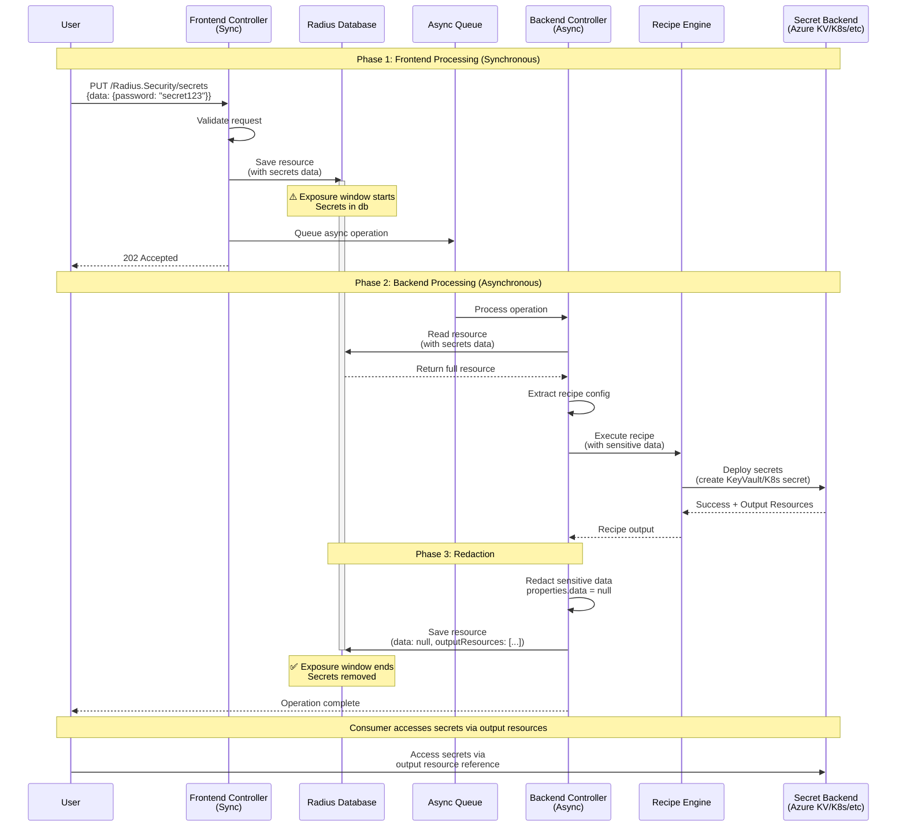

# Redacting Sensitive Data for Radius.Security/secrets

* **Author**: Lakshmi Javadekar (@lakshmimsft)

## Overview

The `Radius.Security/secrets` resource type, defined in the [resource-types-contrib](https://github.com/radius-project/resource-types-contrib) repository, enables users to deploy sensitive data such as tokens, passwords, keys, and certificates to various secret backends (Azure Key Vault, HashiCorp Vault, Kubernetes secrets, etc.). This resource is handled by dynamic-rp, a type-agnostic processor providing CRUD operations for user-defined types.

Currently, dynamic-rp stores all resource properties, including sensitive `data` fields, in the Radius database. This design proposes a mechanism to redact (nullify) sensitive data after the recipe successfully deploys the secrets to their designated backend, ensuring that secret data does not persist in the Radius database.

## Terms and definitions

| Term | Definition |
|------|------------|
| **Dynamic-RP** | Type-agnostic resource provider that handles CRUD operations for user-defined types without prior knowledge of their schemas |
| **Recipe** | Deployment template (Bicep/Terraform) that provisions infrastructure resources |
| **Recipe-based deployment** | Asynchronous deployment flow where recipes execute to create actual infrastructure |
| **Radius.Security/secrets** | New resource type for managing secrets across multiple backends (recipe-based, multi-backend) |

## Objectives

> **Issue Reference:** Implementation of sensitive data handling for Radius.Security/secrets resource type to prevent long-term storage of plaintext secrets in Radius database. ref: https://github.com/radius-project/radius/issues/10421

### Goals

1. **Prevent persistent storage**: Ensure sensitive data is nullified from Radius database after successful recipe deployment
2. **Minimal impact to dynamic-rp core**: Implement redaction as an extensible processor hook without requiring dynamic-rp to understand resource schemas.
3. **Enable recipe-based secret deployment**: Allow recipes to access sensitive data during execution to deploy secrets to various backends (Azure Key Vault, HashiCorp Vault, K8s, etc.)
4. **Support multi-backend flexibility**: Enable the same implementation to work with any recipe backend


### Non goals

1. **Prevent all temporary storage**: The design accepts that sensitive data will temporarily exist in the database during recipe execution (seconds to minutes)


### User scenarios (optional)

#### User story 1: Developer deploying secrets to Azure Key Vault

Alice, a platform engineer, wants to deploy application secrets to Azure Key Vault using Radius. She defines a `Radius.Security/secrets` resource with sensitive credentials and associates it with an Azure Key Vault recipe. The recipe deploys the secrets to Azure Key Vault, and after successful deployment, the sensitive data is removed from Radius database. Alice can still reference the secrets via output resources, but sensitive values are no longer stored in Radius.

#### User story 2: Multi-environment secret management

Bob manages multiple environments (dev, staging, prod) and needs different secret backends for each. He uses the same `Radius.Security/secrets` resource definition but associates different recipes: Kubernetes secrets for dev, HashiCorp Vault for staging, and Azure Key Vault for prod. The redaction mechanism works consistently across all backends without requiring backend-specific code.

## User Experience (if applicable)

**Sample Input:**

```bicep
resource appSecrets 'Radius.Security/secrets@2025-08-01-preview' = {
  name: 'app-secrets'
  properties: {
    environment: environment.id
    kind: 'generic'
    data: {
      databasePassword: {
        value: 'super-secret-password'
        encoding: 'string'
      }
      apiKey: {
        value: 'YXBpLWtleS1iYXNlNjQ='
        encoding: 'base64'
      }
    }
  }
}
```

**Sample Output:**

After deployment, the resource stored in Radius database:

```json
{
  "id": "/planes/radius/local/resourceGroups/my-rg/providers/Radius.Security/secrets/app-secrets",
  "type": "Radius.Security/secrets",
  "properties": {
    "environment": "/planes/radius/local/resourceGroups/my-rg/providers/Applications.Core/environments/myenv",
    "kind": "generic",
    "data": null,  // ← Sensitive data removed
    "status": {
      "outputResources": [
        {
          "id": "/subscriptions/sub-id/resourceGroups/rg/providers/Microsoft.KeyVault/vaults/my-keyvault"
        }
      ]
    }
  }
}
```

## Design

### High Level Design

The design introduces a redaction mechanism that operates in the backend async controller after recipe execution. The flow ensures that:

1. **Frontend (sync)**: Stores full resource including sensitive data in database, queues async operation
2. **Backend (async)**: Reads resource from database (with sensitive data), executes recipe using the data
3. **Redaction**: After successful recipe execution, nullifies sensitive data fields
4. **Final save**: Stores redacted resource back to database

Key components:
- **Recipe Controller** (`pkg/portableresources/backend/controller/createorupdateresource.go`): Orchestrates recipe execution and resource updates
- **Redaction Logic**: New functionality to detect `Radius.Security/secrets` type and nullify `properties.data`
- **Cleanup Handlers**: Defer blocks ensuring redaction even on failures

### Architecture Diagram



**Exposure Window:** T0 → T4

### Detailed Design

#### Option 1: Frontend Nullification (Rejected)

**Description**: Nullify sensitive data in the frontend controller before initial database save, similar to Applications.Core/secretStores.

**Reasons for rejection**:
- **Cannot support recipes**: Recipe execution happens in backend async operation and needs access to sensitive data, this would break the recipe-based deployment.

#### Option 2: Backend Post-Recipe Redaction (Recommended)

**Description**: Store full resource in database temporarily, execute recipe using the data, redact after successful deployment.

**Advantages**:
- **Recipe compatible**: Recipe has full access to sensitive data during execution
- **Type-agnostic**: Dynamic-rp doesn't need to understand specific schemas
- **Multi-backend support**: Works with any recipe backend (Azure KV, HashiCorp, K8s)
- **Follows recipe patterns**: Aligns with how other recipe outputs are handled
- **Pragmatic**: Achieves security goal with minimal complexity
- **Testable**: Clear boundaries for testing redaction logic

**Disadvantages**:
- Temporary exposure window (seconds to minutes) during recipe execution
- Recommended db encryption at rest
- Needs robust failure handling to ensure cleanup

### Option 3: Database Encryption at Rest (Recommended)

**Description**: Recommend customers enable encryption at the infrastructure/database layer to protect sensitive data during the temporary exposure window (T0-T4). Both Azure AKS and AWS EKS provide encryption at rest for their etcd databases by default.

**Current Database Architecture:**
- **Provider abstraction**: `pkg/components/database/databaseprovider` supports pluggable backends
- **Current backend**: Kubernetes API Server (backed by etcd)
- **Future support**: Database will be configurable to support alternative backends

 Both Azure AKS and AWS EKS provide encryption at rest for their etcd databases by default. For other etcd backends:
  - Kubernetes supports native etcd encryption via `EncryptionConfiguration`
  - Transparent to Radius application code
  - Document recommended encryption requirements.
  - **Setup**: Kubernetes admin configures encryption provider (AES-CBC, AES-GCM, or KMS)
  - **Reference**: https://kubernetes.io/docs/tasks/administer-cluster/encrypt-data/
- For future database backends, rely on native encryption at rest features of the database

**Advantages**:
- No code changes needed and transparent to Radius application
- Customer-controlled where Infrastructure teams configure and manage encryption
- Protects secrets during exposure window (T0-T4)
- Database backups are also encrypted
- Separation of concerns: Security handled at appropriate infrastructure layer
- Entire database encrypted, not just secrets

**Disadvantages**:
- Not automatic, customers must configure if not available by default.

Document encryption requirement in Radius installation guides

### Option 4: Application-Level Encryption in Dynamic-RP

**Description**: Implement encryption/decryption of sensitive data at the application layer using Go crypto APIs with ChaCha20-Poly1305 cipher and per-request nonce.

**Implementation Details:**
- Store root key in a Kubernetes secret (similar to ucp-cert)
- Use Go's `crypto/cipher` package with ChaCha20-Poly1305 AEAD cipher
- Generate unique nonce per encryption operation
- Encrypt sensitive data before database save, decrypt when needed for recipe execution

**Advantages**:
- Adds application-level protection even if database encryption is not encrypted at rest
- Encrypts resource JSON data before database storage
- Implementation available: Go crypto APIs provide ChaCha20-Poly1305 support

**Disadvantages**:
- Performance overhead: Encryption/decryption adds latency to both save and recipe execution
- Key management
- Increased code complexity: Error handling for crypto operations

**Notes**: OpenSSL is CLI-only; Go crypto APIs are recommended for programmatic encryption.
  - **Alternative considered**: Using initContainer to load root key as a file was discussed but rejected due to:
    - Security concerns: Pod that can mount the volume could read the key
    - Managing writes on pod restarts and scaling complexity with multiple pods
    - Kubernetes secrets provide better access controls via RBAC

### Option 5: Type-Specific vs Annotation-Based Encryption + Redaction

**Description**: Two approaches to identify resources requiring sensitive resource data encryption and redaction:

**Option A: Type-Specific**
- Hard-code encryption and redaction logic for specific resource types (e.g., `Radius.Security/secrets`)
- Check resource type string in dynamic-rp backend controller
- Explicitly detect known sensitive resource types

**Option B: Annotation-Based (Extensible)**
- Use OpenAPI extension annotations (e.g., `x-radius-sensitive`/ `x-radius-secure`) in resource type definitions
- Dynamic-rp reads schema annotations to determine which resources need encryption and which fields will need redaction
- Type schema declares its sensitivity requirements
- More flexible for future resource types without code changes

**Trade-offs:**

| Aspect | Type-Specific | Annotation-Based |
|--------|---------------|------------------|
| **Implementation complexity** | Simple: hardcoded type check | Complex: schema parsing, annotation handling |
| **Extensibility** | Requires code changes for new types | New types declare sensitivity via schema |
| **Type safety** | Explicit and clear | Requires schema validation |
| **Performance** | Minimal overhead (string comparison) | Schema lookup/parsing overhead |

**Notes**:
- **Standard OpenAPI keywords considered but rejected**:
  - `writeOnly`: Indicates property should not be returned in responses. Constraint: Only controls response serialization, does not enforce encryption or database-level field nullification.
  - `format: password`: UI hint for masking input fields in forms. Constraint: Client-side UX concern, not server-side security enforcement.
  - Both keywords have well-defined OpenAPI semantics that don't align with Radius encryption/redaction requirements
  - Decision: Use custom `x-radius-*` annotations for Radius-specific security semantics to avoid overloading standard OpenAPI keywords.

**Recommendation**: TBD - requires team discussion. Is this a "do it now vs later" decision?

#### Proposed Option

**Option 2 + Option 3 + Option 4 + (Option 5 approach TBD): Backend Post-Recipe Redaction With Recommendation to encrypt db** is the recommended approach. 

### API design (if applicable)

N/A - No changes to public REST API, CLI, or Go APIs. This is an internal implementation detail of how secret data will be redacted for specific resource types during processing by dynamic-rp.

### CLI Design (if applicable)

N/A - No CLI changes required.

### Implementation Details

#### Core RP (if applicable)

No changes required to Core RP. The implementation is isolated to dynamic-rp.

#### Portable Resources / Recipes RP (if applicable)

**Primary Changes in Recipe Controller** (`pkg/portableresources/backend/controller/createorupdateresource.go`):

-Add redaction hook after recipe execution
-Add cleanup handler to ensure redaction on errors
-Type Detection Helper

### Error Handling

**Scenario 1: Recipe execution fails**
- Error: Recipe fails to deploy secrets to backend
- Handling: Defer block ensures `data` field is nullified even on failure
- User Experience: Recipe error is returned to user, but sensitive data is still cleaned up from database

**Scenario 2: Redaction fails during cleanup**
- Error: Nullification logic encounters unexpected error
- Handling: Log error but do not fail the overall operation since recipe already succeeded
- User Experience: Recipe succeeds, warning logged about redaction issue

**Scenario 3: Database save fails after redaction**
- Error: Final save operation fails
- Handling: Return error to user, operation will be retried
- User Experience: Operation shows as failed, will be retried by async controller

**Scenario 4: Resource type detection fails**
- Error: Unable to determine if resource requires redaction
- Handling: Skip redaction, log warning
- User Experience: No impact, operation proceeds normally

## Test plan

### Unit Tests

1. **Processor redaction logic**:
   - Test function that correctly nullifies `data` field
   - Test redaction is no-op for non-secret resource types
   - Test redaction handles missing `data` field gracefully
   - Test type detection logic correctly identifies `Radius.Security/secrets`

2. **Controller integration**:
   - Test redaction is called after successful recipe execution
   - Test defer block redacts on recipe failure
   - Test defer block redacts on unexpected errors

### Integration/Functional Tests

1. **Recipe-based deployment**:
   - Deploy `Radius.Security/secrets` with K8s secret recipe
   - Verify secrets are created
   - Verify `data` field is null in Radius database after deployment
   - Verify output resources are correctly populated

2. **Failure scenarios**:
   - Trigger recipe execution failure
   - Verify `data` field is still nullified in database
   - Verify recipe error is properly surfaced to user

3. **Update scenarios**:
   - Update existing `Radius.Security/secrets` resource
   - Verify updated secrets are deployed and redacted

4. **End-to-end secret lifecycle**:
   - Create resource with sensitive data
   - Verify recipe deploys to backend
   - Verify data is redacted after deployment
   - Read resource back and verify `data` is null
   - Reference secrets via output resources in consuming application

## Security

### Security Model

The design includes a **temporary exposure window** during which sensitive data exists in the Radius database (from frontend save to backend redaction, typically seconds to minutes). This is a deliberate trade-off to support recipe-based deployment while maintaining type-agnostic dynamic-rp design.

### Security Threats and Mitigations

**Primary Defense: Database Encryption at Rest**

The recommended mitigation for temporary secret exposure is infrastructure-level database encryption at rest. This provides defense-in-depth protection against multiple threat vectors without requiring changes to Radius code.

- **For etcd** (current Kubernetes-based deployments): Enable Kubernetes Encryption if encryption not provided by default.
- **For future database backends**: Enable native encryption at rest features
- **Benefits**: Protects against backups, unauthorized access, and storage layer compromise

**Threat 1: Recipe failure leaves secrets in database**
- Risk: Failed recipe execution leaves secrets indefinitely
- Primary Mitigation: **Database encryption at rest** - limits damage if cleanup fails
- Additional Controls:
  - Defer block ensures best-effort cleanup on all exit paths
  - Error handler attempts save with redacted data
  - Future enhancement: Background cleanup job for orphaned secrets

**Threat 2: Secrets in operational/debug logs**
- Risk: Database operational logs may capture sensitive data in plaintext
  - **For Kubernetes API Server**: Audit logs (separate from etcd) can capture request/response bodies. K8s audit policy can be configured to exclude request/response bodies to avoid logging sensitive data.
  - **For future database backends**: Query logs and debug logs vary by implementation
 - Avoid enabling debug logging in production environments
  - Configure Kubernetes audit policy to exclude request/response bodies for sensitive operations
  - Encrypt operational logs at rest
  - Implement log retention policies for timely cleanup


### Infrastructure Requirements

Organizations deploying Radius with `Radius.Security/secrets` should ensure:

1. **Encryption at rest** (Required):
   - Enable etcd encryption for Kubernetes-based deployments
   - Enable native encryption at rest for future database backends

2. **Network encryption** (Required):
   - TLS for all database connections
   - Encrypted communication between Radius components

3. **Access controls** (Required):
   - RBAC on database restricting access to minimum required services
   - Service accounts with least privilege
   - Regular access audits

## Compatibility (optional)

**No breaking changes**. This is a new feature for a new resource type (`Radius.Security/secrets`).

**Forward compatibility**: 

## Monitoring and Logging

### Logging

1. **Redaction events** (Info level):
   ```
   "Sanitizing sensitive data field"
   Fields: resourceID, resourceType
   ```

2. **Redaction failures** (Error level):
   ```
   "Failed to redact sensitive data"
   Fields: resourceID, error
   ```

### Troubleshooting

**Issue**: Secrets not removed from database after deployment
- Check: Logs for redaction errors
- Check: Recipe execution succeeded
- Check: Async operation completed successfully
- Action: Review controller logs, check database state, verify processor implementation

**Issue**: Recipe execution fails with missing data
- Check: Ensure recipe is receiving full data before redaction
- Check: Verify redaction happens after recipe execution, not before
- Action: Review recipe parameters, check recipe logs

## Development plan

### Phase 1: Core Implementation (Sprint 1)
- **Week 1**: Implement redaction logic in processor
  - Create `SensitiveDataProcessor` interface
  - Implement `RedactSensitiveData()` in `DynamicProcessor`
  - Add type detection helper functions
  - Unit tests for redaction logic
  - Integrate with recipe controller
  - Add redaction hook in `CreateOrUpdateResource`
  - Implement defer block for cleanup on errors
  - **Estimate**: 5 days

### Phase 2: Testing and Validation (Sprint 1)
- **Week 2**: Comprehensive testing
  - Integration tests with K8s recipes
  - Failure scenario testing
  - **Estimate**: 2 days

### Phase 3: Documentation  (Sprint 1)
- **Week 2**: Documentation
  - Update user documentation
  - **Estimate**: 1 days


## Open Questions

1. **Q: Is it possible to add to pre-flight checks to warn if encryption is disabled and we add a warning?**
- A:

## Alternatives considered

### Alternative 1: Resource-Specific Controller (Rejected)
- Create dedicated controller for `Radius.Security/secrets` instead of using dynamic-rp
- Rejected: Breaks type-agnostic model, doesn't scale to other sensitive types

### Alternative 2: Bypass Frontend Database Save (Not Recommended)
Queue contains only metadata today. Resource details are retrieved using id.

**Description**: Pass sensitive data directly from frontend to async queue Queue contains only metadata today. Resource details are retrieved using id.without saving to database, backend reads from queue instead of database.

**Advantages**:
- Eliminates database exposure window entirely
- No secrets data in database at any point

**Disadvantages**:
- **Queue becomes sensitive storage**: Queue now stores plaintext secrets temporarily
  - Queue backend (internal in-memory or distributed) needs same security as database
  - Queue messages need encryption at rest and in transit
  - Problem just moves from database to queue
- **Message size limits**: Queue messages have size limits
  - Large resources with many secrets might exceed limits
  - Current internal queue implementation may not handle large payloads
- **Queue durability concerns**:
  - In-memory queues: Lost on restart (need durable queue)
  - Distributed queues: Still persisted, same encryption concerns as database
- **Operational complexity**:
  - Harder to debug (data not in standard location)
  - Increases testing surface area
- **Race conditions**:
  - Frontend saves redacted resource to DB
  - If queue message lost, backend can't reconstruct full resource
  - Need fallback/retry mechanism
- **Breaking change**: Requires changes to core async operation infrastructure used by ALL resource types

**Current Queue Implementation:**
- **Location**: `pkg/components/queue`
- **Type**: Internal queue (configurable backend)
- **Message structure**: Designed for metadata only
- **Persistence**: Depends on configuration

**Recommendation**:
- **Not recommended**: Complexity and operational risk outweigh benefits
- **Key insight**: Queue is just as sensitive as database - moving secrets from DB to queue doesn't eliminate the security challenge, just moves it
- **Better alternatives**:
  - Infrastructure-level encryption (etcd encryption)
  - Application-level encryption with proper key management
- **If pursued in future**:
  - Must be part of broader architectural redesign
  - Requires queue encryption, message size handling, durability guarantees
  - Not isolated to secrets - affects all async operations

## Design Review Notes

_(To be updated after design review meeting)_

---

## References

- [Radius.Security/secrets type definition](https://github.com/radius-project/resource-types-contrib/blob/main/Security/secrets/secrets.yaml)
- [Dynamic-RP architecture](https://github.com/radius-project/radius/tree/main/pkg/dynamicrp)
- [Recipe controller](https://github.com/radius-project/radius/blob/main/pkg/portableresources/backend/controller/createorupdateresource.go)
