# Redacting Sensitive Data for Radius Resource Types

* **Author**: `Lakshmi Javadekar (@lakshmimsft)`

## Overview

Radius Resource Types (RRTs) such as `Radius.Security/secrets`, enables users to deploy sensitive data such as tokens, passwords, keys, and certificates to various secret backends (Azure Key Vault, HashiCorp Vault, Kubernetes secrets, etc.). All RRTs are handled by dynamic-rp, a type-agnostic processor providing CRUD operations for user-defined types.

Currently, dynamic-rp stores all resource properties, including sensitive data fields, in the Radius database. This design proposes a mechanism to encrypt sensitive data at the application layer before database storage, then decrypt and redact (nullify) sensitive data before recipe processing, ensuring that sensitive data does not persist in the Radius database.

## Terms and definitions

| Term | Definition |
|------|------------|
| **Radius Resource Types** | User-defined resource types in [resource-types-contrib](https://github.com/radius-project/resource-types-contrib) repository |
| **Redaction** | Process of nullifying (setting to null) sensitive data fields after decryption to prevent persistence in database |
| **Dynamic-RP** | Type-agnostic resource provider that handles CRUD operations for user-defined types without prior knowledge of their schemas |
| **Recipe** | Deployment template (Bicep/Terraform) that provisions infrastructure resources |
| **Recipe-based deployment** | Asynchronous deployment flow where recipes execute to create actual infrastructure |
| **Radius.Security/secrets** | New resource type for managing secrets across multiple backends (recipe-based, multi-backend) |

## Objectives

> **Issue Reference:** Implementation of sensitive data handling for Radius.Security/secrets resource type to prevent long-term storage of plaintext secrets in Radius database. ref: https://github.com/radius-project/radius/issues/10421

### Goals

1. **Prevent persistent storage**: Ensure sensitive data is encrypted before database storage and nullified from Radius database before recipe execution begins
2. **Type-agnostic implementation**: Implement encryption and redaction logic that can be extended to other sensitive resource types without requiring dynamic-rp to understand specific schemas
3. **Enable recipe-based secret deployment**: Allow recipes to access decrypted sensitive data in-memory during execution to deploy secrets to various backends (Azure Key Vault, HashiCorp Vault, K8s, etc.) without persisting decrypted data to the database
4. **Support multi-backend flexibility**: Enable the same implementation to work with any recipe backend


### Non goals

1. **Prevent all temporary storage**: The design accepts that encrypted sensitive data will temporarily exist for a brief period (milliseconds to seconds) between frontend save and backend decryption/redaction, before recipe execution begins.


### User scenarios (optional)

#### User story 1: Developer deploying secrets to Azure Key Vault

Alice, a platform engineer, wants to deploy application secrets to Azure Key Vault using Radius. She defines a `Radius.Security/secrets` resource with sensitive credentials (property marked with `x-radius-sensitive` annotation) and associates it with an Azure Key Vault recipe. Radius encrypts the sensitive data. When the async worker processes the request, it decrypts and redacts the sensitive data from the database before executing the recipe. The recipe deploys the secrets to Azure Key Vault using the in-memory decrypted data. Alice can reference the secrets via output resources, but sensitive values are not persisted in Radius database.

#### User story 2: Multi-environment secret management

Bob manages multiple environments (dev, staging, prod) and needs different secret backends for each. He uses the same `Radius.Security/secrets` resource definition but associates different recipes: Kubernetes secrets for dev, HashiCorp Vault for staging, and Azure Key Vault for prod. The redaction mechanism works consistently across all backends without requiring backend-specific code.

## User Experience (if applicable)

### Resource Type Schema Definition

The infrastructure operator defines a RRT schema with a `data` property annotated with `x-radius-sensitive` to indicate it contains sensitive information:

```yaml
# Excerpt of RRT schema using `x-radius-sensitive` annotation for sensitive fields
types:
  userTypeSensitive:    
    apiVersions:
      "2023-10-01-preview":
        schema:
          type: "object"
          properties:
            environment:
              type: string
              description: Environment ID for the userTypeSensitive resource
            kind:
              type: string
              enum: [generic]
              description: Type of data being stored
            data:
              type: string
              x-radius-sensitive: true  # ← Marks this field as sensitive
              description: Sensitive data to be deployed
            required:
              - environment
              - data 
```                     
### Resource in Bicep: 

Application developers use the resource type in their deployments:
```bicep

@secure
param apiKey string

resource appSensitive 'Radius.Security/userTypeSensitive@2023-10-01-preview' = {
  name: 'app-sensitive'
  properties: {
    environment: environment.id
    kind: 'generic'
    data: apiKey
  }
}

/*
Note: x-radius-sensitive maps to appropriate secure Bicep type:
   - `type: string` + `x-radius-sensitive: true` → `secureString`
   - `type: object` + `x-radius-sensitive: true` → `secureObject`
*/
```
Ref: [Secure strings and objects](https://learn.microsoft.com/en-us/azure/azure-resource-manager/templates/data-types?utm_source=chatgpt.com#secure-strings-and-objects)


```
### Sample Output:

After deployment, the resource stored in Radius database:

```json
{
  "id": "/planes/radius/local/resourceGroups/my-rg/providers/Radius.Security/userTypeSensitive/app-sensitive",
  "type": "Radius.Security/userTypeSensitive",
  "properties": {
    "environment": "/planes/radius/local/resourceGroups/my-rg/providers/Applications.Core/environments/myenv",
    "kind": "generic",
    "data": null,  // ← Sensitive data removed
    "status": {
      "outputResources": [
        {
          "id": "/subscriptions/sub-id/resourceGroups/rg/providers/Microsoft.KeyVault/vaults/my-keyvault"
        }
      ]
    }
  }
}
```

## Design

### High Level Design

The design introduces encryption and redaction mechanisms that minimize sensitive data exposure. Encryption occurs in the frontend before database storage, and redaction occurs in the backend before recipe execution. The flow ensures that:

1. **Frontend (sync)**: Encrypts sensitive data (fields marked with `x-radius-sensitive` annotation), stores encrypted resource in database, queues async operation
2. **Backend (async)**: Reads resource from database (with encrypted data), decrypts sensitive fields in memory, immediately nullifies sensitive fields in database
3. **Recipe execution**: Executes recipe using in-memory decrypted data (never re-persisted to database)
4. **Completion**: Updates resource with recipe outputs (`outputResources`). On success, returns normal success result. On failure, returns `Result{Requeue: false}` to prevent retries that would fail due to missing sensitive data.

Key components:
- **Type Converter** (`bicep-tools/pkg/converter`): Maps fields with `x-radius-sensitive: true` annotation to `secureString`/`secureObject` Bicep types during YAML-to-Bicep type conversion. 
- **Frontend Controller**: Encrypts sensitive fields marked with `x-radius-sensitive` before database save using application-layer encryption (`ChaCha20-Poly1305`)
- **Backend Recipe Controller** (`pkg/portableresources/backend/controller/createorupdateresource.go`): Decrypts encrypted data, immediately redacts from database, then orchestrates recipe execution with in-memory data
- **GET Controller**: Checks schema for `x-radius-sensitive` annotations and redacts fields when `provisioningState` is not in `Succeeded` state. For other  states perform redaction to ensure no encrypted data exposure.

- **Encryption/Decryption Logic**: Application-layer encryption using Go `crypto/cipher` package with `ChaCha20-Poly1305 AEAD` cipher, root key stored in Kubernetes secret
- **No-Retry Logic**: Backend controller returns `Result{Requeue: false}` on all failure paths for resources with sensitive fields, requiring user resubmission on failure. Successful operations return normal success result.

### Architecture Diagram

```mermaid
sequenceDiagram
    participant User
    participant Frontend as Frontend Controller<br/>(Sync)
    participant DB as Radius Database
    participant Queue as Async Queue
    participant Backend as Backend Controller<br/>(Async)
    participant Recipe as Recipe Engine
    participant SecretStore as Secret Backend<br/>(Azure KV/K8s/etc)

    Note over User,SecretStore: Phase 1: Frontend Processing (Synchronous)
    User->>Frontend: PUT RRT with sensitive data<br/>{data: "secret123"}
    Frontend->>Frontend: Validate request
    Frontend->>Frontend: Encrypt fields marked<br/>x-radius-sensitive: true
    Frontend->>DB: Save resource<br/>(with ENCRYPTED data)
    activate DB
    Note over DB: 🔒 Encrypted data in DB<br/>Exposure window starts
    Frontend->>Queue: Queue async operation
    Frontend-->>User: 202 Accepted<br/>provisioningState: Accepted

    Note over User,SecretStore: Phase 2: Backend Processing (Asynchronous)
    Queue->>Backend: Process operation
    Backend->>DB: Read resource<br/>(with encrypted data)
    DB-->>Backend: Return resource (encrypted)
    Backend->>Backend: Decrypt properties.data<br/>IN MEMORY ONLY
    Backend->>Backend: Nullify encrypted data:<br/>properties.data = null
    Backend->>DB: Save resource<br/>(data: null)
    deactivate DB
    Note over DB: ✅ Exposure window ends<br/>Encrypted data removed
    
    Note over Backend: In-memory decrypted data<br/>used for recipe execution
    Backend->>Backend: Extract recipe config<br/>(uses in-memory data)
    Backend->>Recipe: Execute recipe<br/>(with in-memory decrypted data)
    Recipe->>SecretStore: Deploy secrets<br/>(create KeyVault/K8s secret)
    SecretStore-->>Recipe: Success + Output Resources
    Recipe-->>Backend: Recipe output
    
    Note over Backend: Recipe complete
    Backend->>Backend: Update status with<br/>outputResources
    activate DB
    Backend->>DB: Save resource<br/>(data: null, outputResources: [...])
    deactivate DB
    Backend->>Backend: Return Result
    Note over Backend: On failure: Result{Requeue: false}<br/>On success: normal success result
    Backend-->>User: Operation complete<br/>provisioningState: Succeeded

    Note over User,SecretStore: Phase 3: Consumption
    User->>SecretStore: Access secrets via<br/>outputResources reference
    SecretStore-->>User: Secret values
```



### Detailed Design

#### Option 1: Frontend Nullification (Rejected)

**Description**: Nullify sensitive data in the frontend controller before initial database save, similar to Applications.Core/secretStores.

**Reasons for rejection**:
- **Cannot support recipes**: Recipe execution happens in backend async operation and needs access to sensitive data, this would break the recipe-based deployment.

#### Option 2: Application-Layer Encryption with Backend Pre-Recipe Redaction  (Recommended)

**Description**: The frontend encrypts sensitive fields marked with `x-radius-sensitive` using application-layer encryption before database storage. The backend controller loads the encrypted resource, decrypts sensitive fields into memory, immediately redacts the persisted record (saving `data: null` back to the database), and then runs the recipe using only the in-memory decrypted copy. The decrypted payload never leaves process memory. On failure, the controller returns `Result{Requeue=false}` to prevent retries.

**Advantages**:
- **Shortest exposure window**: Encrypted data exists in database momentarily (frontend save → backend redaction)
- **Recipe compatible**: Recipe receives decrypted data via in-memory structures
- **Type-agnostic**: Relies on `x-radius-sensitive` annotation, not specific resource types
- **Multi-backend support**: Works with any recipe backend (Azure KV, HashiCorp, K8s)
- **Application-layer protection**: Even if database encryption at rest is not configured, sensitive data is encrypted
- **Testable**: Clear boundaries for testing encryption, decryption, redaction, and no-retry flow

**Disadvantages**:
- No automatic retries: failures require manual resubmission with fresh sensitive data
- Application-layer encryption adds complexity: key management, encryption/decryption overhead, error handling
- Performance overhead: Encryption/decryption adds latency to frontend save and backend processing
- Requires updates across frontend, backend, controllers

**Redaction timing and retries:**
- **Frontend**: Encrypts fields marked with `x-radius-sensitive: true` before saving to database
- **Backend**: Decrypts sensitive fields in memory, immediately persists sanitized copy (data: null), keeps decrypted data only in memory for recipe execution
- **No retries on failure**: Controller returns `Result{Requeue:false}` for failure paths only, preventing retry attempts that would fail due to missing sensitive data
- **Success path**: On successful completion, returns normal success result

##### Application-Layer Encryption Details
- Store root key in a Kubernetes secret (similar to ucp-cert)
- Use Go's `crypto/cipher` package with `ChaCha20-Poly1305 AEAD` cipher
- Generate unique nonce per encryption operation
- Key rotation:
    - **Initial implementation (Manual)**: 
      - Administrator generates new 256-bit key
      - Updates Kubernetes Secret `radius-encryption-key`
      - Restarts Radius pods to reload key from secret
      - Limitation: Cannot decrypt data encrypted with old key (acceptable since data lifetime is minimal (few seconds) (frontend save → backend redaction))
    - **Potential Future enhancement (Automated with Versioning)**:
      - Support multiple concurrent keys with version identifiers
      - Encrypted data includes key version: `{"version": 2, "encrypted": "...", "nonce": "..."}`
      - Rotation process:
        1. System generates new key (version N+1)
        2. Adds to secret alongside existing keys
        3. Controllers hot-reload keys without restart
        4. New encryption uses latest key version
        5. Decryption uses versioned key (old data still readable during transition)
        6. After grace period (e.g., 24 hours), remove old key versions
      - Benefits: Zero-downtime rotation, gradual migration, no data loss
      - Rotation triggers: Time-based (every 90 days) or manual via CLI command

**Encryption Flow (Frontend)**:
1. Check schema for fields with `x-radius-sensitive: true` annotation
2. For each sensitive field:
   - Generate random 24-byte nonce
   - Encrypt field value using `ChaCha20-Poly1305` with root key and nonce
   - Store as: `{"encrypted": base64(ciphertext), "nonce": base64(nonce)}`
3. Save encrypted resource to database

**Decryption Flow (Backend)**:
1. Load resource from database (contains encrypted fields)
2. Check schema for fields with `x-radius-sensitive: true` annotation
3. For each encrypted field:
   - Extract nonce and ciphertext
   - Decrypt using `ChaCha20-Poly1305` with root key and nonce
   - Store decrypted value in memory only
4. Nullify encrypted fields in resource: set to `null`
5. Save sanitized resource to database
6. Use in-memory decrypted data for recipe execution

**Error Handling**:
- Decryption failure: Log error, return `Result{Requeue: false}`, fail operation (user must resubmit)
- Key not found: Log error, return `Result{Requeue: false}`, fail operation
- Schema annotation missing: Skip encryption/decryption (treat as non-sensitive)

**Notes**: 
- `OpenSSL` is CLI-only; Go crypto APIs are used for programmatic encryption
- **Alternative considered**: Using initContainer to load root key as a file was discussed but rejected due to:
  - Security concerns: Pod that can mount the volume could read the key
  - Managing writes on pod restarts and scaling complexity with multiple pods
  - Kubernetes secrets provide better access controls via RBAC

### Option 3: Database Encryption at Rest (Recommend to Customers)

**Description**: Recommend customers enable encryption at the infrastructure/database layer. Both Azure AKS and AWS EKS provide encryption at rest for their etcd databases by default.

**Current Database Architecture:**
- **Provider abstraction**: `pkg/components/database/databaseprovider` supports pluggable backends
- **Current backend**: Kubernetes API Server (backed by etcd)
- **Future support**: Database will be configurable to support alternative backends

 Both Azure AKS and AWS EKS provide encryption at rest for their etcd databases by default. For other etcd backends:
  - Kubernetes supports native etcd encryption via `EncryptionConfiguration`
  - Transparent to Radius application code
  - Document recommended encryption requirements.
  - **Setup**: Kubernetes admin configures encryption provider (`AES-CBC, AES-GCM, or KMS`)
  - **Reference**: https://kubernetes.io/docs/tasks/administer-cluster/encrypt-data/
- For future database backends, rely on native encryption at rest features of the database

**Advantages**:
- No code changes needed and transparent to Radius application
- Customer-controlled where Infrastructure teams configure and manage encryption
- Separation of concerns: Security handled at appropriate infrastructure layer
- Entire database encrypted, not just sensitive fields

**Disadvantages**:
- Not automatic, customers must configure if not available by default.

Document encryption requirement in Radius installation guides

### Design Consideration: GET Operation Update

**Challenge**: Edge Case: User may issue GET request while resource is still deploying (eg. provisioningState: "Updating"), before backend has completed redaction and deployed the resource. Resource in database may still contain encrypted data.

**Solution**: GET controller checks schema for fields marked with `x-radius-sensitive: true` and automatically nullifies those fields before returning the response. Only perform this check if `provisioningState` is not `Succeeded`.

**Implementation**:
- Check `provisioningState` from resource
- If not  `Succeeded`, fetch schema and redact sensitive fields
- Otherwise: return resource directly (fast path)

**Trade-off**: Small latency increase for GET during rare deployment window. 

### Design Consideration: Lingering Encrypted Data Cleanup

**Challenge**: If backend fails after encryption but before redaction (pod crash, decryption error, database failure), encrypted sensitive data may remain in database with no automatic cleanup.

**Manual Re-deployment Overwrites Encrypted Data**:
- Existing functionality includes the Frontend PUT handler checking for existing resource and it will overwrite encrypted data with new request (normal PUT behavior) when user re-runs the deployment.

**Cleanup**: Background cleanup job to identify `Failed` resources older than configurable threshold and nullify any encrypted fields within those resource entries.

#### Proposed Option

**Option 2 + 3 + GET Operation Update** is the recommended approach. 

### API design (if applicable)

N/A - No changes to public REST API, CLI, or Go APIs. This is an internal implementation detail of how secret data will be redacted for specific resource types during processing by dynamic-rp.

### CLI Design (if applicable)

N/A - No CLI changes required.

### Implementation Details

#### Core RP (if applicable)

No changes required to Core RP. The implementation is isolated to dynamic-rp.

#### Portable Resources / Recipes RP (if applicable)

**Primary Changes in Recipe Controller** (`pkg/portableresources/backend/controller/createorupdateresource.go`):

- Add decryption logic immediately after deserialization
- Immediate redaction and database save before recipe execution
- Disable retries by returning Result{Requeue:false} on failure paths only


###  Bicep Type Generation updates

**Changes Required**:
1. Detect `x-radius-sensitive: true` annotation in YAML schema properties
2. Map to appropriate secure type:
   - `type: string` + `x-radius-sensitive: true` → `secureString`
   - `type: object` + `x-radius-sensitive: true` → `secureObject`


### Logging Data

1. **Never log decrypted values**: Field values must never be written to logs at any verbosity level 
2. **Sanitize error messages**: Ensure error messages don't include sensitive values
3. **Code review**: Verify no log statements in encryption/decryption code paths log field values

### Error Handling
**Scenario 1: Encryption fails in frontend (synchronous)**
- Error: Encryption operation fails when processing PUT request (key unavailable, crypto error, schema fetch failure)
- Handling: Return `500 Internal Server Error`, do not save to database or queue async operation
- User Experience: Request fails immediately with error message. User can retry after administrator resolves issue.

**Scenario 2: Decryption fails in backend**
- Error: Unable to decrypt encrypted data (corrupted data, wrong key version, invalid ciphertext format)
- Handling: Return `Result{Requeue: false}`, fail operation
- User Experience: Operation marked as `Failed` with decryption error. User must resubmit request with fresh sensitive data.

**Scenario 3: Encryption key not found**
- Error: Root encryption key not available in Kubernetes Secret when backend attempts decryption
- Handling: Return `Result{Requeue: false}`, fail operation
- User Experience: Operation marked as `Failed` with error indicating missing encryption key. Administrator must configure `radius-encryption-key` Kubernetes Secret.

**Scenario 4: Database save fails during redaction (before recipe)**
- Error: Database save fails when attempting to nullify encrypted fields (before recipe execution begins)
- Handling: Return `Result{Requeue: false}`, fail operation (encrypted data may still exist in database)
- User Experience: Operation marked as `Failed`. User must resubmit with fresh sensitive data.

**Scenario 5: Recipe execution fails**
- Error: Recipe fails to deploy secrets to backend (network timeout, authentication failure, resource creation error)
- Handling: Return `Result{Requeue: false}` to prevent retries. Note: Sensitive data already redacted from database before recipe execution began.
- User Experience: Operation marked as `Failed` with recipe error details in status. User must troubleshoot recipe issue and resubmit with fresh sensitive data.

**Scenario 6: Database save fails after recipe completion**
- Error: Final save operation fails when storing recipe outputs and status (after recipe successfully completes)
- Handling: Return error normally without `Requeue: false` (sensitive data already redacted, safe to retry)
- User Experience: Operation shows as `Failed`. Async controller may retry the save operation automatically since sensitive data is already redacted.

**Scenario 7: Schema annotation detection fails**
- Error: Unable to fetch schema from UCP or detect `x-radius-sensitive` annotations
- Handling: Skip encryption/redaction, log warning, proceed with normal processing (treat as non-sensitive resource)
- User Experience: No impact on deployment, operation proceeds normally. Resource treated as non-sensitive (data not encrypted or redacted).

**Scenario 8: GET request during deployment**
- Error: User issues GET request while `provisioningState` is `Updating` (before backend completes redaction)
- Handling: GET controller checks schema for `x-radius-sensitive` fields and redacts them before returning response
- User Experience: User sees `data: null` in response even if encrypted data still in database. No exposure of encrypted or plaintext data.


## Test plan

### Unit Tests

**1. Encryption Logic (Frontend)**:
   - Test schema annotation detection correctly identifies sensitive fields
   - Test nested sensitive fields detected correctly
   - Test encryption of fields marked with `x-radius-sensitive: true`
   - Test multiple sensitive fields in same resource are encrypted independently
   - Test non-sensitive fields are not encrypted
   - Test encryption failure when key unavailable returns error

**2. Decryption and Redaction Logic (Backend)**:
   - Test decryption of encrypted fields produces original plaintext
   - Test redaction (nullification) of encrypted fields after decryption
   - Test nullified fields saved to database correctly
   - Test decryption failure returns `Result{Requeue: false}`
   - Test key not found returns `Result{Requeue: false}`
   - Test decryption skipped for resources without encrypted fields

**3. Bicep Type Converter**:
   - Test `x-radius-sensitive: true` + `type: string` maps to `secureString`
   - Test `x-radius-sensitive: true` + `type: object` maps to `secureObject`
   
### Integration/Functional Tests

**1. End-to-End Recipe-based Deployment**:
   - Deploy resource with property marked `x-radius-sensitive`
   - Verify deployment succeeds with `provisioningState: Succeeded`
   - Verify sensitive property is `null` in database after deployment
   - Verify `outputResources` populated correctly
   - Verify GET returns `data: null` after deployment


2. **Failure scenarios**:
   - Trigger recipe execution failure
   - Verify sensitive field is still nullified in database
   - Verify no retry occurs (check async operation logs?)
   - Verify recipe error is properly surfaced to user

3. **Update scenarios**:
   - Update existing resource with sensitive property
   - Verify updated resource is deployed and sensitive property redacted

## Security

### Security Model

The design employs a **defense-in-depth approach** with multiple security layers:

1. **Application-Layer Encryption (Primary)**: Sensitive fields marked with `x-radius-sensitive` are encrypted using `ChaCha20-Poly1305 AEAD` cipher before database storage
2. **Short Exposure Window**: Encrypted data exists in database for few seconds (frontend save → backend redaction)
3. **In-Memory Processing**: Decrypted data exists only in process memory during recipe execution, never re-persisted
4. **GET Redaction**: Sensitive fields redacted in API responses during deployment to prevent exposure
5. **Database Encryption at Rest (Secondary/Recommended to Customers)**: Customer-configured infrastructure-level encryption provides additional protection

**Temporary Exposure Window**: Encrypted sensitive data exists in the Radius database from frontend save to backend redaction, typically up to few seconds. This is a deliberate trade-off to support recipe-based deployment while maintaining type-agnostic dynamic-rp design.

### Security Threats and Mitigations

**Threat 1: Backend failure before redaction leaves encrypted data in database**
- **Risk**: Pod crash, decryption failure, or database save failure **before** redaction completes may leave encrypted data in database
- **Note**: Recipe failure does NOT cause this threat (redaction happens before recipe execution)
- **Primary Mitigation**: Application-layer encryption - data is ciphertext, not plaintext
- **Secondary Mitigation**: Database encryption at rest - adds second layer of protection
- **Additional Controls**:
  - Short exposure window few seconds minimizes risk
  - Re-deployment overwrites encrypted data (standard recovery path)
  - No-retry logic prevents failed operations from re-executing without sensitive data
  - Future: Background cleanup job for orphaned encrypted data in `Failed` resources

**Threat 2: Encryption key compromise**
- **Risk**: Unauthorized access to Kubernetes Secret containing encryption key
- **Mitigations**:
  - Kubernetes RBAC restricts access to Radius service accounts only
  - Key stored in Kubernetes Secret with restricted permissions
  - Kubernetes Secret encrypted at rest if etcd encryption enabled
  - Key never logged or exposed in error messages

**Threat 3: Encrypted data in operational/debug logs**
- **Risk**: Database operational logs may capture encrypted sensitive data
- **Note**: Logs contain **encrypted** ciphertext, not plaintext
- **Mitigations**:
  - Configure Kubernetes audit policy to exclude request/response bodies
  - Avoid enabling debug logging in production environments
  - Encrypt operational logs at rest
  - Implement log retention policies for timely cleanup
  - Application-layer encryption ensures any logged data is ciphertext

**Threat 4: Unauthorized GET access during deployment**
- **Risk**: Attacker issues GET request during deployment window to access encrypted data
- **Mitigations**:
  - GET controller redacts sensitive fields before returning response
  - RBAC controls which users can GET resources
  - Even during deployment window, GET returns `data: null` (never encrypted data)

### Infrastructure Requirements

Organizations deploying Radius with resources containing `x-radius-sensitive` fields should ensure:

1. **Encryption key management**:
   - Create Kubernetes Secret `radius-encryption-key` with 256-bit key
   - Restrict access via RBAC to Radius service accounts only
   - Rotate key periodically (manual process initially)
  
2. **Enable Kubernetes `EncryptionConfiguration`** (Required):
   - Configure etcd encryption to protect all Kubernetes Secrets at rest
   - This encrypts the root encryption key itself
   - Reference: https://kubernetes.io/docs/tasks/administer-cluster/encrypt-data/
   - Note: Azure AKS and AWS EKS enable this by default


2. **Network encryption** (Required):
   - TLS for all database connections
   - Encrypted communication between Radius components

3. **Encryption at rest** (Recommended for defense-in-depth):
   - Enable etcd encryption for Kubernetes-based deployments
   - Enable native encryption at rest for future database backends

4. **Access controls** (Required):
   - RBAC on database restricting access to minimum required services
   - Service accounts with least privilege
   - Regular access audits

## Compatibility (optional)

**No breaking changes**. This is a new feature for a new resource type (`Radius.Security/secrets`).

**Forward compatibility**: 

## Logging

1. **Encryption Success (Info level)**:
`"Encrypted sensitive field for storage" Fields: resourceID, resourceType, fieldName, operation="encrypt"`

2. **Encryption Failure (Error level)**:
`"Failed to encrypt sensitive field" Fields: resourceID, resourceType, fieldName, error, operation="encrypt_failed"`

3. **Decryption Success (Info level)**:
`"Decrypted sensitive field from storage" Fields: resourceID, resourceType, fieldName, operation="decrypt"`

4. **Decryption Failure (Error level)**:
`"Failed to decrypt sensitive field" Fields: resourceID, resourceType, fieldName, error, operation="decrypt_failed"`

5. **Redaction Success (Info level)**:
`"Redacted sensitive field from database" Fields: resourceID, resourceType, fieldName, operation="redact"`

6. **Redaction Failure (Error level)**:
`"Failed to redact sensitive field from database" Fields: resourceID, resourceType, fieldName, error, operation="redact_failed"`

7. **Key Not Found (Error level)**:
`"Encryption key not found in Kubernetes Secret" Fields: secretName="radius-encryption-key", namespace, error`

### Troubleshooting

**Issue: Deployment fails with "Failed to encrypt sensitive field"**
- **Cause**: Encryption key not available or encryption operation failed
- **Check**: 
  - Verify Kubernetes Secret `radius-encryption-key` exists: `kubectl get secret radius-encryption-key -n <radius-namespace>`
  - Check frontend controller logs for encryption errors
  - Verify RBAC permissions for Radius service account to access secret
- **Action**: 
  - Create encryption key if missing
  - Fix RBAC permissions
  - Retry deployment

**Issue: Deployment fails with "Failed to decrypt sensitive field"**
- **Cause**: Encrypted data corrupted, wrong key, or key unavailable
- **Check**:
  - Check backend controller logs for decryption errors
  - Verify encryption key exists in Kubernetes Secret
  - Check if key was rotated (old encrypted data can't be decrypted with new key)
- **Action**:
  - If key rotated: Re-deploy resource with fresh sensitive data
  - If corrupted: Delete resource and re-deploy
  - If key missing: Restore or recreate key (note: can't decrypt old data)

**Issue: Recipe execution fails after deployment starts**
- **Cause**: Recipe configuration error, backend unavailable, authentication failure
- **Note**: Sensitive data is already redacted from database (not a data exposure issue)
- **Check**:
  - Check resource status for recipe error details
  - Check recipe logs in backend controller
  - Verify recipe backend is accessible (K8s, Azure KV, etc.)
- **Action**:
  - Fix recipe configuration or backend issue
  - Re-deploy with corrected configuration

## Development plan
### Phase 1: Core Infrastructure (Sprint 1-2)

**1. Bicep Type Converter Updates** (1-2 days):
- Update `bicep-tools/pkg/converter`
- Map `x-radius-sensitive: true` to `secureString`/`secureObject`
- Preserve annotation in generated types
- Unit tests for type conversion

**2. Encryption/Decryption Infrastructure** (3 days):
- Create `pkg/crypto/encryption` package
  - Implement `ChaCha20-Poly1305` encryption/decryption
  - Key management (load from Kubernetes Secret)
  - Nonce generation
  - Error handling
- Unit tests for crypto operations
- Integration with `pkg/components/secret` for key retrieval

**3. Schema Annotation Detection** (3 days):
- Implement schema fetching from UCP
- Parse `x-radius-sensitive: true` annotations
- Handle nested fields
- Unit tests for annotation detection

**4. Schema Validation** (1 days):
- Update schema validation. When a resource type schema is registered (via `rad resource-type create`), validate:
  - Fields marked with `x-radius-sensitive: true` must have `type: string` or `type: object`
  - Return error if `x-radius-sensitive` is applied to other types (number, boolean, array, etc.)
- Unit tests for schema validation logic

**5. Kubernetes Secret Setup and Installation** (2-3 days):
- **Helm Chart Updates**:
  - Add template for `radius-encryption-key` Kubernetes Secret
  - Generate 256-bit random key during Helm install
  - Create Secret in Radius system namespace
- **RBAC Configuration**:
  - Create/update service account for Radius controllers
  - Add RBAC rules to allow Secret read access
  - Ensure least-privilege permissions
- **Testing**:
  - Test fresh installation creates key correctly
  - Test installation with existing key
  - Test RBAC permissions work correctly
  - Test controllers can load key at startup

### Phase 2: Frontend Implementation (Sprint 2-3)

**6. Frontend Encryption** (3 days):
- Add encryption logic to frontend PUT handler
- Encrypt fields marked with `x-radius-sensitive`
- Store encrypted format: `{"encrypted": "...", "nonce": "..."}`
- Error handling for encryption failures
- Unit tests for frontend encryption

**7. GET Controller Redaction** (2 days):
- Add redaction logic to GET controller
- Check `provisioningState` and redact if not `Succeeded`
- Handle schema fetch failures gracefully
- Unit tests for GET redaction

### Phase 3: Backend Implementation (Sprint 2-3)

**8. Backend Decryption and Redaction** (5 days):
- Update `pkg/portableresources/backend/controller/createorupdateresource.go`
- Add decryption after database read
- Immediate redaction (save `data: null`) before recipe
- Keep decrypted data in memory for recipe execution
- Return `Result{Requeue: false}` on failures
- Unit tests for backend flow

**9. Background Cleanup Job for Lingering Encrypted Data** (5 days):
- Create background controller/job to periodically scan for orphaned encrypted data
- Identify resources with `provisioningState!= Succeeded` where `SystemData.LastModifiedAt` is older than configurable threshold 
- For each Failed resource:
  - Fetch resource schema
  - Check for fields with `x-radius-sensitive: true` annotation
  - Nullify any encrypted fields still present in the resource
  - Save cleaned resource back to database
- Configuration:
  - Configurable cleanup interval
  - Configurable age threshold
  - Enable/disable cleanup via feature flag or configuration
- Logging:
  - Log each cleanup operation (resourceID, fields nullified, timestamp)
- Error handling:
  - Handle schema fetch failures gracefully
  - Continue processing other resources if one fails
- Unit tests for cleanup logic
- Integration tests verifying cleanup runs and nullifies encrypted data


**10. Error Handling and Recovery** (4 days):
- Implement comprehensive error handling
- Add logging for all operations
- Test failure scenarios
- Document user recovery procedures


### Phase 4: Testing + Documentation(Sprint 3-4)

**11. Integration Testing** (5 days):
- End-to-end encryption → decryption → redaction flow
- Recipe execution with in-memory data
- GET during deployment
- Failure and recovery scenarios
- Multi-backend recipe testing (K8s, Azure KV)
- Performance testing

**12. Documentation** (2 days):
- User documentation for `x-radius-sensitive` annotation
- Installation guide for encryption key setup
- Troubleshooting guide
- Security best practices
- Recovery procedures

## Open Questions

## Alternatives considered

### Alternative 1: Resource-Specific Controller (Rejected)
- Create dedicated controller for `Radius.Security/secrets` and other sensitive types instead of using dynamic-rp
- Rejected: Breaks type-agnostic model, doesn't scale to other sensitive types

### Alternative 2: Bypass Frontend Database Save (Not Recommended)
Queue contains only metadata today. Resource details are retrieved using id.
Pass sensitive data directly from frontend to async queue.without saving to database, backend reads from queue instead of database.

**Advantages**:
- Eliminates database exposure window entirely
- No secrets data in database at any point

**Disadvantages**:
- **Queue becomes sensitive storage**: Queue now stores plaintext secrets temporarily
  - Queue backend (internal in-memory or distributed) needs same security as database
  - Queue messages need encryption at rest and in transit
  - Problem just moves from database to queue
- **Message size limits**: Queue messages have size limits
  - Large resources with many secrets might exceed limits
  - Current internal queue implementation may not handle large payloads
- **Queue durability concerns**:
  - In-memory queues: Lost on restart (need durable queue)
  - Distributed queues: Still persisted, same encryption concerns as database
- **Operational complexity**:
  - Harder to debug (data not in standard location)
  - Increases testing surface area
- **Race conditions**:
  - Frontend saves redacted resource to DB
  - If queue message lost, backend can't reconstruct full resource
  - Need fallback/retry mechanism
- **Breaking change**: Requires changes to core async operation infrastructure used by ALL resource types

**Current Queue Implementation:**
- **Location**: `pkg/components/queue`
- **Type**: Internal queue (configurable backend)
- **Message structure**: Designed for metadata only
- **Persistence**: Depends on configuration

**Recommendation**:
- **Not recommended**: Complexity and operational risk outweigh benefits
- **Key insight**: Queue is just as sensitive as database - moving secrets from DB to queue doesn't eliminate the security challenge, just moves it
- **Better alternatives**:
  - Infrastructure-level encryption (etcd encryption)
  - Application-level encryption with proper key management
- **If pursued in future**:
  - Must be part of broader architectural redesign
  - Requires queue encryption, message size handling, durability guarantees
  - Not isolated to secrets - affects all async operations

## Design Review Notes

An earlier version of this design document focused on detecting Radius.Security/secrets type and performing encryption/redaction for it's specific field. After discussions we updated the approach to now detect `x-radius-sensitive` annotation in any type and perform encryption/redaction for the sensitive fields.
---

## References

- [Radius.Security/secrets type definition](https://github.com/radius-project/resource-types-contrib/blob/main/Security/secrets/secrets.yaml)
- [Dynamic-RP architecture](https://github.com/radius-project/radius/tree/main/pkg/dynamicrp)
- [Recipe controller](https://github.com/radius-project/radius/blob/main/pkg/portableresources/backend/controller/createorupdateresource.go)
- [Secure strings and objects](https://learn.microsoft.com/en-us/azure/azure-resource-manager/templates/data-types?utm_source=chatgpt.com#secure-strings-and-objects)