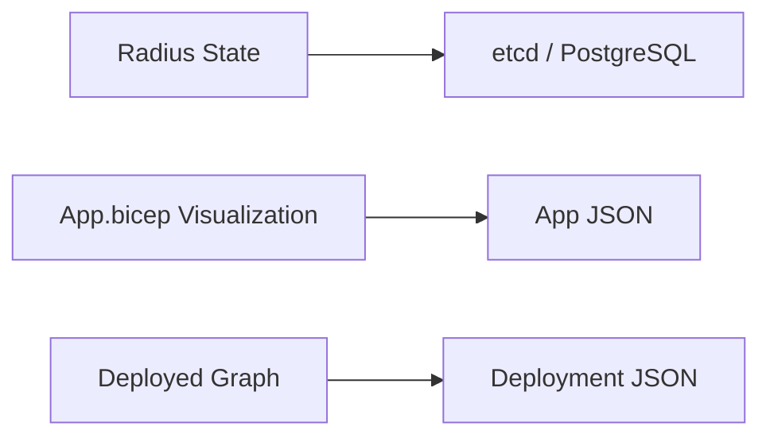
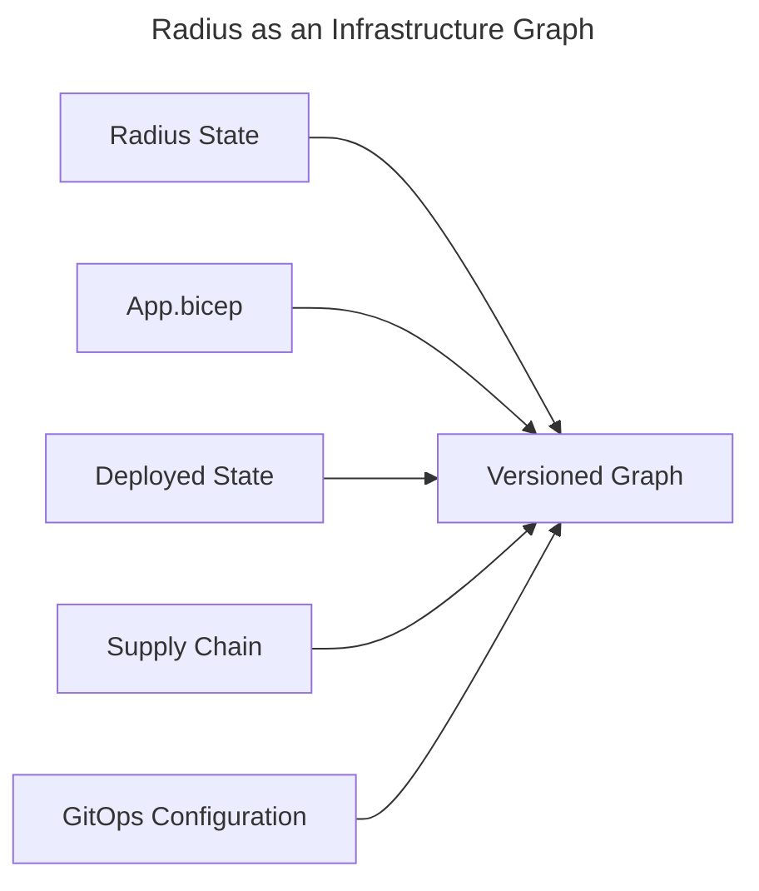

# Graph-Enabling Radius: A Proposal for Infrastructure Graph Storage

**Date**: April 2026
**Status**: Proposal

## Summary

Radius manages application and infrastructure state today using key-value storage using etcd or PostgreSQL as available storage provider implementations. This proposal introduces a graph storage layer underneath the existing Radius storage providers. The graph layer preserves current key-value access patterns while unlocking relationship-aware querying, versioned state navigation, and a new class of user experiences built on visualizing and traversing infrastructure as a connected graph.

## Context

Radius is developing three capabilities that shape this proposal:

1. **App graph visualization** — displaying `app.bicep` files as interactive graphs.
2. **Deployment graph display** — showing the live state of a deployed application as a graph.
3. **Repo Radius** — running Radius inside GitHub Actions without a persistent control plane, using serialized files or serialized database backups stored in orphan git branches.

These features will work using the existing storage backends (etcd, serialized JSON files, or PostgreSQL).

This proposal is to develop, in parallel, a graph storage system that serves as the underlying state store — enabling all of the above while opening the door to a broader set of graph-native experiences.

## User Experiences Enabled by Graph Storage

- **Browse a unified app + infrastructure graph.** An experience similar to Azure Resource Graph, extended to include all upstream assets used to produce the current infrastructure state: `app.bicep` files, parameters, recipe packs, deployment history, and more. Users can navigate up, down, and across the graph to understand how their infrastructure was built and how it changes over time.

- **Visualize the Radius data model.** Applications, environments, groups, recipe packs, recipes, resource types, and deployed resources rendered in graph form — clarifying the relationships that are otherwise implicit in API responses and configuration files.

- **Query the graph.** Write queries against infrastructure state using graph query languages to enable ad-hoc exploration, compliance checks, and reporting. Potentially, support Kusto-like queries, similar to the [Azure Resource Graph support](https://learn.microsoft.com/en-us/azure/governance/resource-graph/concepts/query-language).

- **Drive compliance and automation with change queries.** Connect Drasi reactive queries to the graph to build change-driven compliance systems, automated remediation, and event-driven workflows that trigger on graph mutations.

- **Scale across operational modes.** The same graph model works as a single local developer instance, a team-distributed system backed by git, or a hyperscaler cloud-scale deployment with a hosted graph database — without changing the user experience or query model.

- **Integrate external tools into the infrastructure graph.** Incorporate GitOps tools (Argo CD, Flux), CI/CD pipelines (GitHub Actions, Azure Pipelines), the software supply chain, dependency graphs, and other application and infrastructure tooling as first-class nodes and edges in the graph.

## Current vs. Future Storage by Feature

### Current storage

### Future graph storage

## High-Level Features of the Graph Storage System

- **Graph querying and key-value access.** The storage layer exposes both key-value operations (no need to rewrite existing Radius storage providers) and graph traversal/pattern-matching queries via selected graph query languages.

- **Versioned graph state.** Every mutation to the graph produces a versioned snapshot, enabling users to browse, query, and diff the graph across any point in its history. In git-backed environments, versioning aligns naturally with commits and branches.

- **Multiple runtime modes.** The graph storage system runs as:

  | Mode | Description | Example |
  | ------ | ------------- | --------- |
  | **Local stateless** | Graph generated from files in a local repository clone | Developer preview, pre-commit validation |
  | **Server stateless** | Graph generated ephemerally in CI/CD without a persistent process | GitHub Actions, PR visualization |
  | **Long-running stateful** | Graph hosted in a graph database on the control plane | Enterprise deployments, real-time collaboration |

- **Ingest from existing tools.** Many infrastructure and application tools already store their configuration in text files (YAML, JSON, HCL, Bicep) and ship parsers that turn those files into structured data. GitHub's dependency graph works this way — it reads package manifests from many platforms and builds a unified dependency view. Radius can use the same approach: leverage existing parsers from tools like Kustomize, KRO, Flux, and others to pull their resources into the graph alongside Radius-native `app.bicep` definitions. No new file formats are required — the graph simply understands what's already in a repository. Git-versioned files and important elements of their contents can be represented as elements of the graph.
