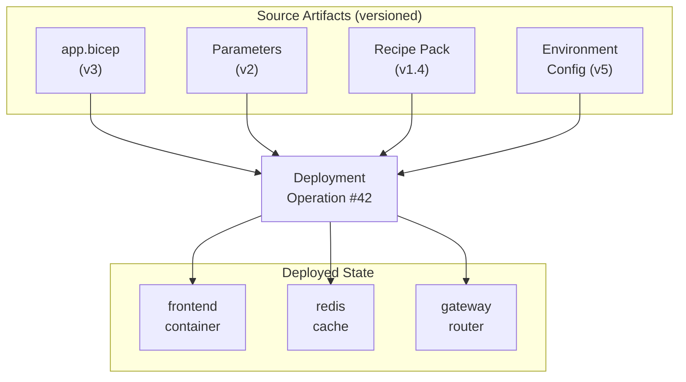
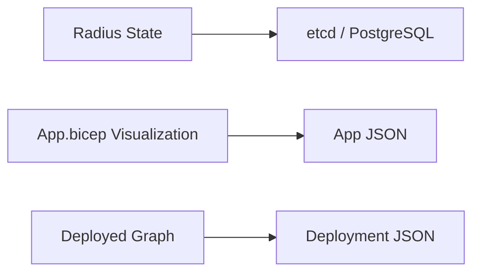
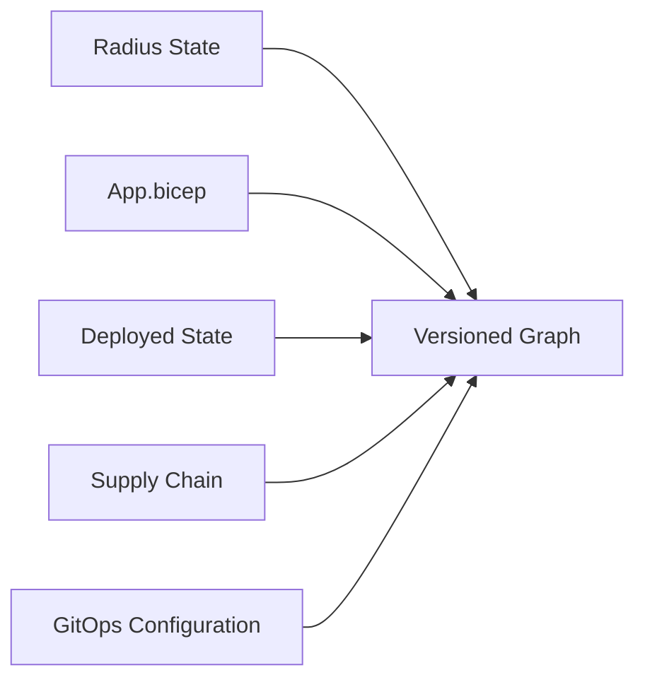

# Deployment Lineage: Radius as a Versioned Infrastructure Graph

## Summary

Given any running resource deployed by Radius, a user can answer: *What exact versions of which files, recipes, and configurations produced this?* Given any source artifact, a user can answer: *What did this deploy, and where?* This proposal introduces a versioned graph that makes this possible — connecting every deployed resource to the specific versions of every artifact that created it: the `app.bicep` file, the parameters, the recipes, the environment configuration, and the deployment operation itself.

## Context

Radius is currently developing three capabilities that shape this proposal:

1. **App graph visualization** — displaying `app.bicep` files as interactive graphs.
2. **Deployment graph display** — showing the live state of a deployed application as a graph.
3. **Repo Radius** — running Radius inside GitHub Actions without a persistent control plane, using serialized files stored in orphan git branches.

These features will work using the existing storage backends (etcd, serialized JSON files, or PostgreSQL). This proposal is to develop, in parallel, a graph storage system that unifies these into a single connected model where every deployed resource is linked to the versioned artifacts that produced it.

## Proposal Adds: A Versioned Graph of Deployed State and Source Artifacts

Given any deployed resource, a user can traverse the graph to find:

- The exact `app.bicep` file (and version) that declared it.
- The artifact diffs between deployments.
- The parameter values used at deployment time.
- The recipe and recipe pack that provisioned the underlying infrastructure.
- The environment and group configuration in effect when it was deployed.
- The deployment operation that created or last modified it.

Given any source artifact (an `app.bicep` file, a recipe, a parameter set), a user can traverse the graph in the other direction to find every deployed resource it has ever produced, across environments and over time.

*Starting from any node, you can navigate to every other node. What created this container? What did this recipe deploy? What changed between deployment #41 and #42?*

## Current vs. Future Storage

### Current storage

Deployed state, source artifacts, and visualization data live in separate stores with no connecting relationships.

### Future graph storage

One versioned graph where deployed state, source artifacts, and deployment history are connected and traversable.

## High-Level Features

- **Versioned graph state.** Every deployment produces a versioned snapshot of the graph — source artifacts, deployment operations, and resulting deployed resources — linked together. Users can browse, query, and diff the graph across any point in its history.

- **Graph querying and key-value access.** The storage layer exposes both key-value operations (preserving compatibility with existing Radius storage providers) and graph traversal queries for navigating the relationships between deployed state and source artifacts.

- **Multiple runtime modes.** The graph storage system runs as:

  | Mode | Description | Example |
  | ------ | ------------- | --------- |
  | **Local stateless** | Graph generated from files in a local repository clone | Developer preview, pre-commit validation |
  | **Server stateless** | Graph generated ephemerally in CI/CD without a persistent process | GitHub Actions, PR visualization |
  | **Long-running stateful** | Graph hosted in a graph database on the control plane | Enterprise deployments, real-time collaboration |

- **Ingest from existing tools.** Many infrastructure and application tools already store their configuration in text files (YAML, JSON, HCL, Bicep) and ship parsers that turn those files into structured data. GitHub's dependency graph works this way — it reads package manifests from many platforms and builds a unified dependency view. Radius can use the same approach: leverage existing parsers from tools like Kustomize, KRO, Flux, and others to pull their resources into the graph alongside Radius-native `app.bicep` definitions. No new file formats are required — the graph simply understands what's already in a repository.
