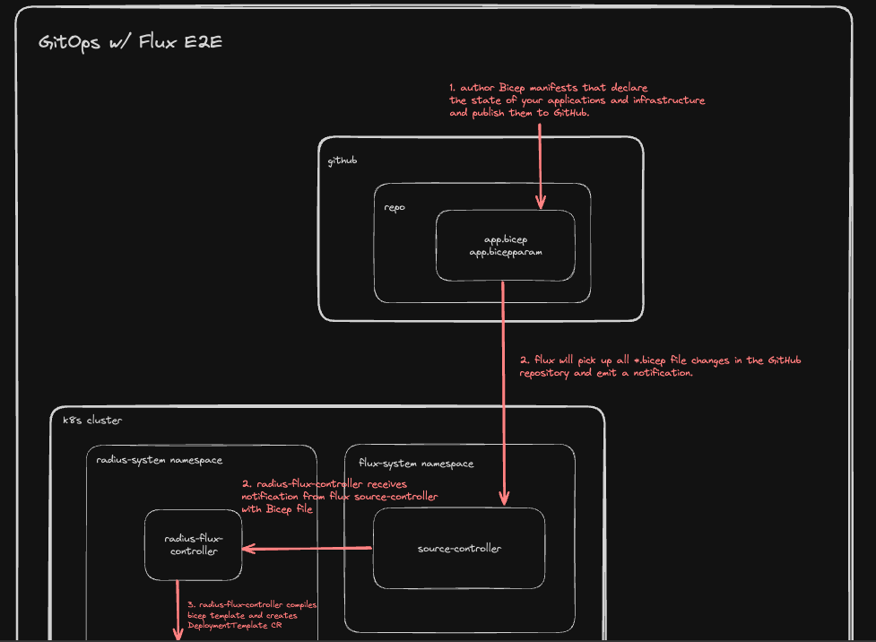
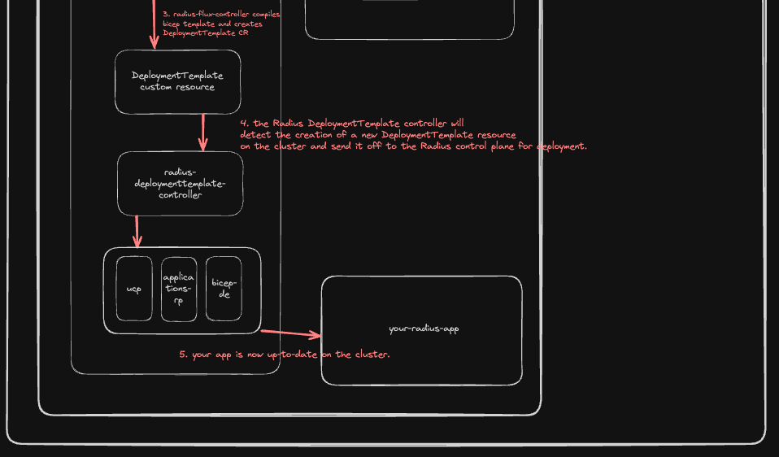

# Radius Flux Controller Design

* **Author**: Will Smith (@willdavsmith)

## Overview

<!--
Provide a succinct high-level description of the component or feature and
where/how it fits in the big picture. The overview should be one to three
paragraphs long and should be understandable by someone outside the Radius
team. Do not provide the design details in this, section - there is a
dedicated section for that later in the document.
-->

The Radius Flux Controller is a new Radius control plane service that, along with the Radius DeploymentTemplate Controller, enables GitOps practices for Radius users. It is responsible for reading the Git repository, compiling Bicep files, and creating the DeploymentTemplate resources on the cluster. This controller ensures that the infrastructure defined in the Git repository is accurately reflected in the Kubernetes cluster, enabling a seamless GitOps workflow.

## Terms and definitions

<!--
Include any terms, definitions, or acronyms that are used in
this design document to assist the reader. They may or may not
be part of the user-facing experience once implemented, and can
be specific to this design context.
-->

- **GitOps**: A set of practices to manage infrastructure and application configurations using Git.
- **Bicep**: A domain-specific language (DSL) for managing resources; originally developed to deploy Azure resources declaratively, Radius uses Bicep to model applications and resources agnostic of a cloud provider.
- **DeploymentTemplate**: A custom resource in Kubernetes that represents the desired state of a Bicep deployment.

## Objectives

<!--
Describe goals/non-goals and user-scenario of this feature to understand
the end-user goals.
* If the feature shares the same objectives of the existing design, link
  to the existing doc and section rather than repeat the same context.
* If the feature has a scenario, UX, or other product feature design doc,
  link it here and summarize the important parts.
-->

> **Issue Reference:** #6689

### Goals

<!--
Describe goals to define why we are doing this work, how we will make
priority decisions, and how we will determine success.
-->

- Enable seamless integration of GitOps workflows with Radius + Bicep. Users should be able to specify their Bicep files and parameters in a Git repository and have the resources within them automatically deployed to their Kubernetes cluster.
- Ensure that the infrastructure defined in the Git repository is accurately reflected in the Kubernetes cluster. This includes creating, updating, and deleting resources as necessary, based on the changes in the Git repository.
- Provide an experience that is consistent with existing Flux workflows. Users should be able to use Flux as they do today, with the addition of the Radius Flux Controller for managing Bicep files.

### Non goals

<!--
Describe non-goals to identify something that we won’t be focusing on
immediately. We won’t be expending any effort on these matters. If there
will be follow-ups after this work, list them here. If there are things
we plan to do in the future, but are out of scope of this design, list
them here. Provide a brief explanation on why this is a non-goal.
-->

- Supporting non-Flux GitOps tools (e.g., ArgoCD).

### User scenarios (optional)

<!--
Describe the user scenarios for this design. Ensure that you define the
roles and personas in these user scenarios when it requires API design.
If you have an existing issue that describes the user scenarios, please
link to that issue instead.
-->

#### Helly can use Radius and Bicep to simplify application and infrastructure management

Helly is an infrastructure operator for an enterprise company. Her team manages a production application that is deployed on Kubernetes and uses AWS resources. To simplify the management of the application and infrastructure, Helly decides to use Radius and Bicep. She writes Bicep manifests that define the AWS resources required by the application, such as S3 buckets and RDS databases, as well as Radius resources that define container applications. Helly then uploads these Bicep files to a Git repository. She then writes a Flux configuration which includes Flux installation, Radius installation, and Flux setup for tracking her Git repository. Finally, Helly applies the Flux configuration to her Kubernetes cluster, and Radius deploys the resources defined in the Bicep manifests to the cluster. Now, any changes to the Bicep files in the Git repository are automatically reflected in the Kubernetes cluster, enabling a seamless GitOps workflow.

## Design

### High Level Design
<!--
High level overview of the data flow and key components.

Provide a high-level description, using diagrams as appropriate, and top-level
explanations to convey the architectural/design overview. Don’t go into a lot
of details yet but provide enough information about the relationship between
these components and other components. Call out or highlight new components
that are not part of this feature (dependencies). This diagram generally
treats the components as black boxes. Provide a pointer to a more detailed
design document, if one exists.
-->

The Radius Flux Controller reads the Git repository, compiles Bicep files, and creates DeploymentTemplate resources on the cluster. It interacts with the DeploymentTemplate controller to ensure that the desired state defined in the Git repository is accurately reflected in the Kubernetes cluster.

### Architecture Diagram
<!--
Provide a diagram of the system architecture, illustrating how different
components interact with each other in the context of this proposal.

Include separate high level architecture diagram and component specific diagrams, wherever appropriate.
-->





### Detailed Design: Radius Flux Controller

<!--
This section should be detailed and thorough enough that another developer
could implement your design and provide enough detail to get a high confidence
estimate of the cost to implement the feature but isn’t as detailed as the
code. Be sure to also consider testability in your design.

For each change, give each "change" in the proposal its own section and
describe it in enough detail that someone else could implement it. Cover
ALL of the important decisions like names. Your goal is to get an agreement
to proceed with coding and PRs.

If there are alternatives you are considering please include that in the open
questions section. If the product has a layered architecture, it's good to
align these sections with the product's layers. This will help readers use
their current understanding to understand your ideas.

Discuss the rationale behind architectural choices and alternative options
considered during the design process.
-->

The Radius Flux Controller will be implemented as a new controller in the `controller` service. Here is the high-level control loop of the new controller:

1. The controller watches all `GitRepository` resources in the cluster.
1. For each `GitRepository` resource, the controller fetches the artifact from the Flux source controller and unpacks it to a temporary directory.
1. The controller checks for a `radius-gitops-config.yaml` file in the repository. If the file is not present, then the controller skips the repository.
1. The controller reads the `radius-gitops-config.yaml` file and extracts the Bicep compilation instructions, such as the Bicep file path and parameters.
1. The controller compiles the Bicep file using the Bicep CLI, which is installed on the controller.
1. The controller creates (or updates) a `DeploymentTemplate` resource on the cluster with the compiled Bicep file as the template.
1. The controller lists all `DeploymentTemplate` resources in the cluster that have been created from this Git repository and deletes any resources that are not present in the Git repository.
1. The controller repeats this process at a regular interval to ensure that the resources in the Git repository are accurately reflected in the Kubernetes cluster.

The following is a detailed description of the major steps in the control loop.

#### Reading the Git Repository

The code for reading the Git repository will use the Flux GitOps toolkit libraries and will be based off the example [here](https://fluxcd.io/flux/gitops-toolkit/source-watcher/).

The controller is set up to watch `GitRepository` resources in the cluster:
```go
func (r *FluxController) SetupWithManager(mgr ctrl.Manager) error {
	if err := mgr.GetFieldIndexer().IndexField(context.Background(), &radappiov1alpha3.DeploymentTemplate{}, deploymentTemplateRepositoryField, deploymentTemplateRepositoryIndexer); err != nil {
		return err
	}

	return ctrl.NewControllerManagedBy(mgr).
		For(&sourcev1.GitRepository{}, builder.WithPredicates(GitRepositoryRevisionChangePredicate{})).
		Complete(r)
}
```

When a `GitRepository` resource is created or updated, the controller will get the object and read the contents of the Git repository:
```go 
func (r *FluxController) Reconcile(ctx context.Context, req ctrl.Request) (ctrl.Result, error) {
  ...
	// Get the GitRepository object from the cluster
	var repository sourcev1.GitRepository
	if err := r.Get(ctx, req.NamespacedName, &repository); err != nil {
		return ctrl.Result{}, client.IgnoreNotFound(err)
	}

  ...

  // Fetch the artifact from the Source Controller
	logger.Info("Fetching artifact", "url", artifact.URL)
	if err := r.ArchiveFetcher.Fetch(artifact.URL, artifact.Digest, tmpDir); err != nil {
		logger.Error(err, "unable to fetch artifact")
		return ctrl.Result{}, err
	}
  ...
}
```

#### Parsing the `radius-gitops-config.yaml` File

The controller will look for a `radius-gitops-config.yaml` file in the Git repository. If the file is not present, then the controller will skip the repository. If the file is present, then the controller will read the file and extract the Bicep compilation instructions:
```go
  // Read the radius-gitops-config.yaml file
  configFile := filepath.Join(tmpDir, "radius-gitops-config.yaml")
  config, err := ioutil.ReadFile(configFile)
  if err != nil {
    logger.Error(err, "unable to read radius-gitops-config.yaml file")
    return ctrl.Result{}, err
  }

  // Parse the radius-gitops-config.yaml file
  var radiusConfig RadiusConfig
  if err := yaml.Unmarshal(config, &radiusConfig); err != nil {
    logger.Error(err, "unable to parse radius-gitops-config.yaml file")
    return ctrl.Result{}, err
  }
```

The `radius-gitops-config.yaml` file will have the following structure:
```yaml
config:
  - file: main.bicep
    parameters: main.bicepparam
    namespace: default
    resourceGroup: default
  - file: secondary.bicep
    # namespace: defaults to "secondary"
    # resourceGroup: defaults to "secondary"
```

#### Compiling the Bicep File

The controller will compile the Bicep file using the Bicep CLI, which is installed on the controller. It will use existing functionality to leverage the Bicep compiler: https://github.com/radius-project/radius/blob/87f7ea1b8d814a266fb89333ea4e5b38463ed7f9/pkg/cli/bicep/types.go#L46

#### Creating the `DeploymentTemplate` Resource

The controller will create (or update) a `DeploymentTemplate` resource on the cluster with the compiled Bicep file as the template:
```go
  // Create the DeploymentTemplate resource
  deploymentTemplate := &radappiov1alpha3.DeploymentTemplate{
    ObjectMeta: metav1.ObjectMeta{
      Name:      radiusConfig.Name,
      Namespace: radiusConfig.Namespace,
    },
    Spec: radappiov1alpha3.DeploymentTemplateSpec{
      Template: string(compiledBicep),
    },
  }

  // Create or update the DeploymentTemplate resource
  if err := r.CreateOrUpdate(ctx, deploymentTemplate); err != nil {
    logger.Error(err, "unable to create or update DeploymentTemplate resource")
    return ctrl.Result{}, err
  }
```

#### Deleting Stale `DeploymentTemplate` Resources

The controller will list all `DeploymentTemplate` resources in the cluster that have been created from this Git repository and delete any resources that are not present in the Git repository:
```go
	// List all DeploymentTemplates on the cluster that are from the same git repository
	deploymentTemplates := &radappiov1alpha3.DeploymentTemplateList{}
	err = r.Client.List(ctx, deploymentTemplates, client.MatchingFields{deploymentTemplateRepositoryField: repository.Name})
	if err != nil {
		logger.Error(err, "unable to list deployment templates")
		return ctrl.Result{}, err
	}

	// For all of the DeploymentTemplates on the cluster, check if the bicep file
	// that it was created from is still present in the git repository. If not, delete the
	// DeploymentTemplate from the cluster.
	for _, deploymentTemplate := range deploymentTemplates.Items {
		if _, err := r.FileSystem.Stat(path.Join(tmpDir, deploymentTemplate.Name)); os.IsNotExist(err) {
			// File does not exist in the git repository,
			// delete the DeploymentTemplate from the cluster
			logger.Info("Deleting DeploymentTemplate", "name", deploymentTemplate.Name)
			if err := r.Client.Delete(ctx, &deploymentTemplate); err != nil {
				logger.Error(err, "unable to delete deployment template")
				return ctrl.Result{}, err
			}

			logger.Info("Deleted DeploymentTemplate", "name", deploymentTemplate.Name)
		} else if err != nil {
			logger.Error(err, "failed to check if file exists")
			return ctrl.Result{}, err
		}
	}
```

### Detailed Design: Bicep Compilation

The Bicep compilation will be done using the Bicep CLI. The Bicep CLI itself will be present in a container image that is mounted as a volume in the controller pod. The controller will use the Bicep CLI to compile the Bicep file and return the compiled template as a string.

`deploy/images/bicep/Dockerfile`:
```Dockerfile
FROM alpine:latest

ARG TARGETARCH

RUN apk --no-cache add curl

WORKDIR /

RUN curl -Lo bicep https://github.com/Azure/bicep/releases/latest/download/bicep-linux-x64 \
    && chmod +x ./bicep

ENTRYPOINT ["/bin/sh"]
```

`deploy/Chart/templates/controller/deployment.yaml`:
```yaml
    spec:
      ...
      initContainers:
      - name: bicep
        image: "{{ .Values.bicep.image }}:{{ .Values.bicep.tag | default $appversion }}"
        command: ['sh', '-c', 'mv ./bicep /usr/local/bin/bicep']
        volumeMounts:
        - name: bicep
          mountPath: /usr/local/bin
      ...
      containers:
      ...
        volumeMounts:
        - name: bicep
          mountPath: /usr/local/bin
      ...
      volumes:
      ...
        - name: bicep
          emptyDir: {}
      ...
```

### Implementation Details
<!--
High level description of updates to each component. Provide information on
the specific sub-components that will be updated, for example, controller, processor, renderer,
recipe engine, driver, to name a few.
-->

- **Controller**: The Radius Flux Controller will be implemented as a new controller in the `controller` service. The controller will read the Git repository, compile Bicep files, and create DeploymentTemplate resources on the cluster.
- **Bicep Compilation**: The Bicep compilation will be done using the Bicep CLI. The Bicep CLI itself will be present in a container image that is mounted as a volume in the controller pod. The controller will use the Bicep CLI to compile the Bicep file and return the compiled template as a string.

### Error Handling
<!--
Describe the error scenarios that may occur and the corresponding recovery/error handling and user experience.
-->

All errors will be logged to the Kubernetes event log. We will also provide detailed error messages in the controller logs to help users troubleshoot any issues.

## Test plan

<!--
Include the test plan to validate the features including the areas that
need functional tests.

Describe any functionality that will create new testing challenges:
- New dependencies
- External assets that tests need to access
- Features that do I/O or change OS state and are thus hard to unit test
-->

- **Unit Tests**: Test the individual components of the Radius Flux Controller. There are many external dependencies that will need to be mocked, such as GitRepository objects and Bicep compilation.
- **Functional Tests**: Test the end-to-end functionality of the Radius Flux Controller together with the DeploymentTemplate controller. This will involve creating GitRepository objects on a real Kubernetes cluster and verifying that the resources in the Bicep templates are created and updated correctly.
- **Sample**: Provide a sample Git repository with Bicep files and a `radius-gitops-config.yaml` file to test the Radius Flux Controller. This should be added as a sample in our documentation.

## Security

<!--
Describe any changes to the existing security model of Radius or security
challenges of the features. For each challenge describe the security threat
and its mitigation with this design.

Examples include:
- Authentication
- Storing secrets and credentials
- Using cryptography

If this feature has no new challenges or changes to the security model
then describe how the feature will use existing security features of Radius.
-->

No new security challenges are introduced by the Radius Flux Controller. It uses the existing security features of Radius and Flux.

## Compatibility (optional)

<!--
Describe potential compatibility issues with other components, such as
incompatibility with older CLIs, and include any breaking changes to
behaviors or APIs.
-->

The Radius Flux Controller is compatible with existing Radius components and does not introduce any breaking changes.

## Monitoring and Logging

<!--
Include the list of instrumentation such as metric, log, and trace to
diagnose this new feature. It also describes how to troubleshoot this feature
with the instrumentation.
-->

The Radius Flux Controller will be setup as another controller in the Radius controller process. It will use standard Radius and Kubernetes logging and monitoring facilities, such as Kubernetes events and logs, to provide visibility into its actions. Users will be able to troubleshoot the Radius Flux Controller by examining the logs and events generated by the controller, as is the case with other Kubernetes controllers.

## Development plan

<!--
Describe how you will deliver your features. This includes aligning work items
to features, scenarios, or requirements, defining what deliverable will be
checked in at each point in the product and estimating the cost of each work
item. Don’t forget to include the Unit Test and functional test in your
estimates.
-->

The development of the Radius Flux Controller will be broken down into the following tasks:

1. Implement the Bicep compilation functionality in the controller.
1. Implement the control loop for the controller.
1. Write unit and functional tests for the controller.
1. Write documentation and samples for the controller.


## Open Questions

<!--
Describe (Q&A format) the important unknowns or things you're not sure about.
Use the discussion to answer these with experts after people digest the
overall design.
-->

* Does this design fit well into the Kubernetes controller pattern? Are there any improvements that can be made to the design to better align with Kubernetes controller best practices?

## Alternatives considered

<!--
Describe the alternative designs that were considered or should be considered.
Give a justification for why alternative approaches should be rejected if
possible.
-->

* We should consider different formats for the `radius-gitops-config.yaml` format.

## Design Review Notes

<!--
Update this section with the decisions made during the design review meeting. This should be updated before the design is merged.
-->
