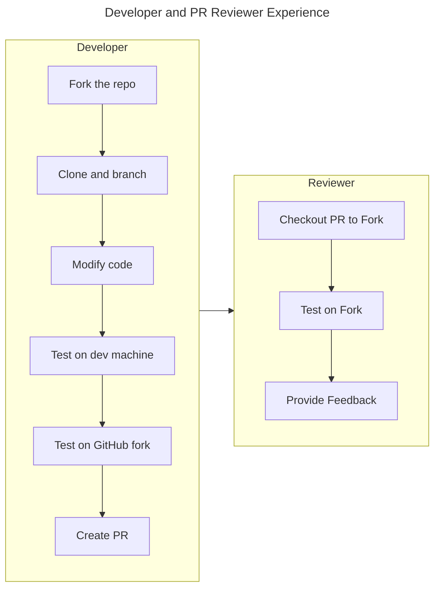
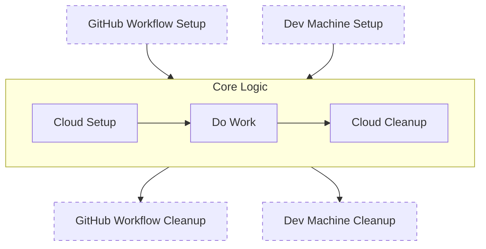
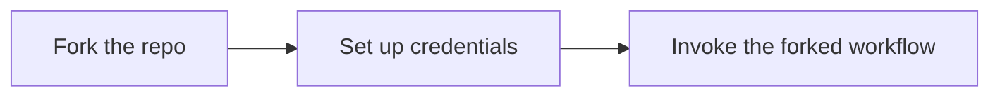

# GitHub Workflow Changes

* **Author**: brooke-hamilton

## Overview

Large GitHub workflows can be challenging to test and fix due to their complexity. While complexity itself is not a barrier to developing the workflows, the inability to debug and test on repo forks along with the difficulty in running workflow logic on local developer machines makes new features and bug fixes costly. The limited options for testing result in lengthy development times for simple changes.

This design describes an evolutionary approach to managing our GitHub workflows which will decrease the difficulty and time it takes to test changes. The design is expressed through a set of design principles that can be applied to all workflows. 

## Terms and definitions

- Workflow: A configurable automated process made up of one or more jobs. Workflows are defined in YAML files stored in the .github/workflows directory.
- Job: A set of steps that execute as part of a workflow. Jobs can run sequentially or in parallel as defined in the workflow. Parallel jobs do not execute on the same runner, but they can share context using a workspace.
- Step: An individual task that can run commands, scripts, or actions. Steps are defined within jobs and are executed in the order they are listed.
- Context: A way to access information about workflow runs, variables, runner environments, jobs, and steps. Each context is an object that contains properties, which can be strings or other objects.
- Runner: A server that runs your workflows when they are triggered. GitHub provides hosted runners, or you can host your own.
- Action: A custom application for the GitHub Actions platform that performs a complex but frequently repeated task. Actions can be used as steps in workflows.
- Event: A specific activity that triggers a workflow. Examples include push, pull_request, and schedule.
- Artifact: Files created during a workflow run that can be saved and shared with other jobs or workflows.
- Matrix: A strategy that allows you to create multiple job runs for different combinations of variables, such as different versions of a programming language or operating system.
- Secrets: Encrypted environment variables that you create in a repository or organization. They are used to store sensitive information like API keys and tokens.
- Environment: A set of secrets, variables, and protection rules that are scoped to a specific environment, such as development, staging, or production.
- Core logic: the set of operations that is the reason for having a workflow.

## Objectives

- Provide a reusable pattern for workflows so that developers can confidently and quickly modify workflows and create new ones.
- Provide guidelines for evaluating workflows during PR reviews.

### Goals

- Significantly reduce the time required to create/modify/fix GitHub workflows.
- Increase the reliability of workflows.
- Reduce time dedicated to addressing workflow failures by the on-call engineer.

### Non-goals

- This design does not include details on how each Radius workflow would be modified to align with the patterns defined here.
- Not every workflow must be updated to the principles defined in this design. We will prioritize refactoring workflows based on the level of effort each workflow is requiring from the team when we need to make changes or when the workflows fail and need attention.
- Replacement of security tokens, e.g. PATs, with GitHub applications.

### User scenarios

#### User story: Forks

As a Radius developer, I can fork a repo and run any workflow on the fork with minimal setup, so that I can quickly test changes and confidently submit a PR for those changes.

#### User story: Local debugging

As a Radius developer, I can debug and test workflow logic on my machine, without having to commit the workflow changes to a repository, so that I can efficiently finish my work and ensure high quality code in the workflows.

#### User story: Security context

As a Radius developer, I can establish a security context that works on my machine or within a GitHub workflow, so that I can easily test automation developed locally, and without code changes I can run that automation within a GitHub workflow.

#### User story: Review workflow process

As a PR reviewer, I can checkout the PR to my own fork and test workflows there so that I can ensure the quality of the workflow.

### Developer Experience

Developers should be able to follow a standard development process when modifying GitHub workflows. Reviewers can test by checking out the PR to their own fork.

_Fig. 1: The developer and PR reviewer steps_
## Design

### High Level Workflow Design Principles

#### Use GitHub workflows for CI/CD setup and workflow layout

We will use GitHub workflows for these things:

- Identity and Security
- Test runner setup
- Control flow, including matrix operations

GitHub workflows will not contain core logic (unless the workflow is very simple).

#### Core logic is debuggable and testable on a developer machine with minimal setup.

_Fig. 2: Testable automation that can run from a GitHub workflow or a dev machine_

#### Workflows can be run on any fork without requiring access to the `radius-project` repos, and without having a Radius GitHub security role.

_Fig. 3: Running a GitHub workflow on a fork_
#### Use the GitHub CLI for default security context

On a developer machine, if the dev is logged into the GitHub CLI, the security context is automatically passed to GitHub by the CLI. For any action that is taken in GitHub we should default to using the GH CLI so that this context works locally and within workflows. 

In some cases we will choose to use a GitHub CLI call instead of a GitHub provided workflow action so that we can have runnable and testable code on a developer machine (because GitHub actions are not locally testable.)

#### Use GitHub actions for setup, cleanup, and matrix operations

The use of actions should be limited to setup and cleanup that is unique to GitHub workflows or runners because any logic that exists in a GitHub action cannot be executed on a developer machine. Some examples are below:

- Cloning repos
- Installing tools
- Retrieving stored secrets
- Publishing results

> NOTE: The above exapmles are also needed on a developer machine, but the Implementation is different.

:warning: When using GitHub actions that are published on other repositories, we are [placing our trust](https://arstechnica.com/information-technology/2025/03/supply-chain-attack-exposing-credentials-affects-23k-users-of-tj-actions/) in the authors of that repo that they will prevent malicious code from executing. Choose wisely, and consider forking and customizing a GitHub action instead of calling it directly.

#### Reusable logic exists in custom GitHub actions instead of copy/paste to multiple workflows.

Apply the DRY principle (don't repeat yourself).

#### Core logic is runnable from Make commands.

Any core logic that is currently in GitHub workflows will be moved to Make commands that are runnable on a developer machine (with some environment setup).

Developer automation is already provided through Make. Some of the GitHub workflows also use the same Make commands, e.g. `make build` is invoked from GitHub workflows. 

Some of the existing Make commands invoke scripts. This pattern will continue in order to keep all significant logic isolated to scripts because we do not want to move the complexity problem from GitHub workflows into Make. Simple composite commands should remain within the Make files as they are today.

#### Configuration is provided through environment variables.

Environment variables can be set on developer machines (and stored in `.env` files). GitHub workflows will set environment variables during setup steps. Core logic will read the environment variables.

### Design options considered but not chosen

- Adopt a new automation tool like [Just](https://github.com/casey/just) or [Task](https://taskfile.dev/), and deprecate Make. These tools have advantages, but a side-effect of adopting a new tool would likely be the existince of a new tool in our toolbox without the removal of Make, which would increase complexity. Make currently meets our needs for invoking developer automation.
- Remove everything from GitHub workflows except the invocation of another tool: GitHub workflows have advantages when setting up the automation environment, e.g. retrieving credentials, cloning repos, configuring runners, installing tools, etc. 

## Security

### Least Privilege

Workflows will continue to adhere to the least privilege feature in which they declare which permissions are required by the workflow.

### Identity

Where possible, the automation logic will use the GitHub CLI, which has identity built in. Developers would log into the CLI when running code on their machines, which would allow them to run the logic on their forks. When running as part of at GitHub workflow, the GitHub CLI context is already set up and no further configuration is required.

## Development plan

### Docs: Contributing Automation Code

A new folder exists in the `radius/docs` folder that provides a `README.md` file with guidance on creating and editing GitHub workflows and other repo automation like `make`.

### PR Template

Modify the PR template checklist for each repository that contains workflows to include items similar to the following: 

Workflow modifications have been tested on a repo fork and the changes conform to the workflow development guidance (add hyperlink to the guidance )  

- [ ] This PR contains no modifications to GitHub workflows or repo automation.  
- [ ] Changes to GitHub workflows, actions, and other repo automation have been tested on a repo fork.

### Existing GitHub Workflows

Existing workflows will evolve to implement the design principles. For example, if a new step is being added to an existing workflow, the step would be added via a Make command, which adheres to the principle that all logic is runnable on a developer machine.

### New GitHub Workflows

New GitHub workflows will adhere to the design principles. 

## Open Questions and Actions

- Which actions cannot be perfomed by the GitHub CLI? How will identity be provided to them?
- Provide guidance on which git/gh commands allow a PR reviewer to check out a PR to their own fork.
- We need a prototype of moderate complexity that implements these principles.

## Design Review Notes
