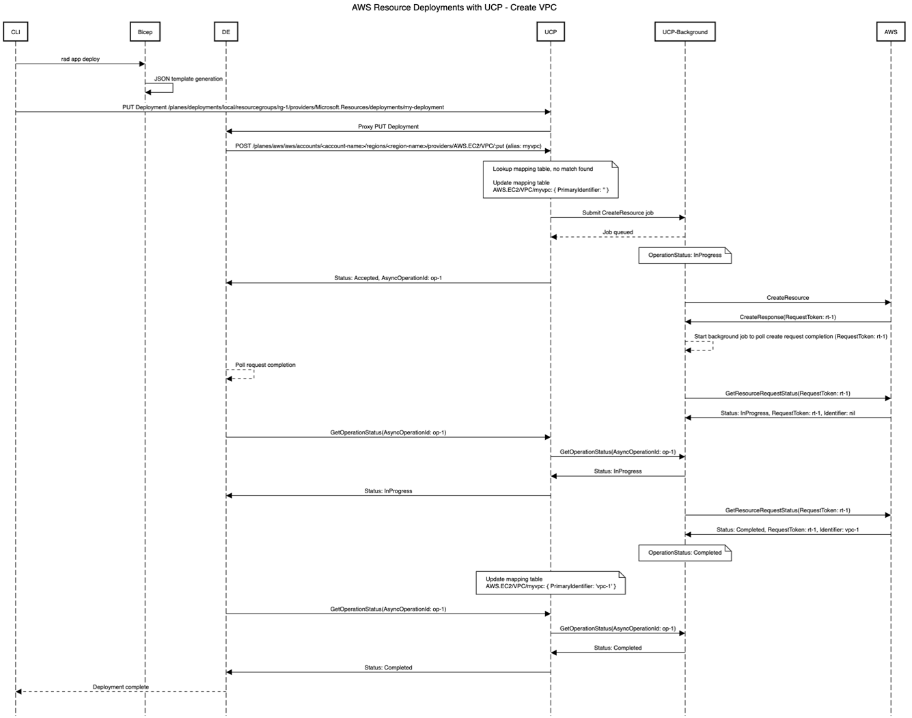
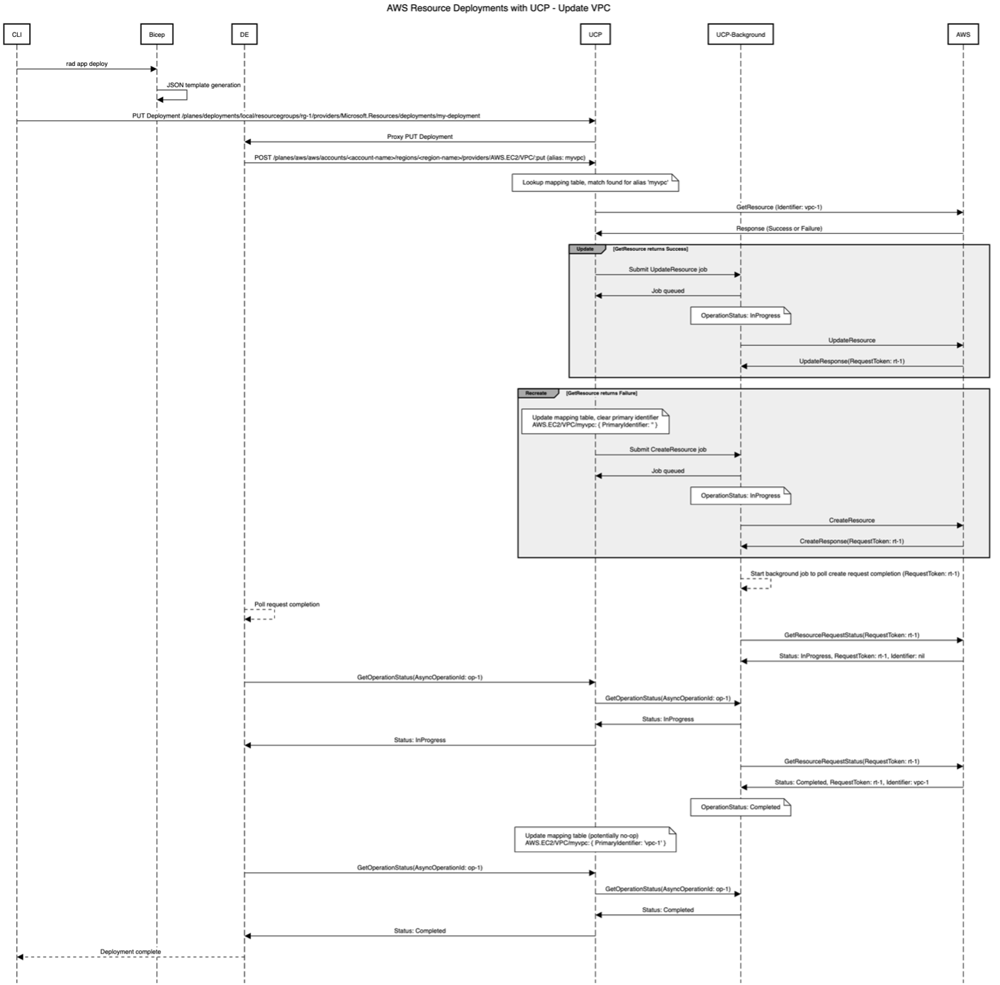
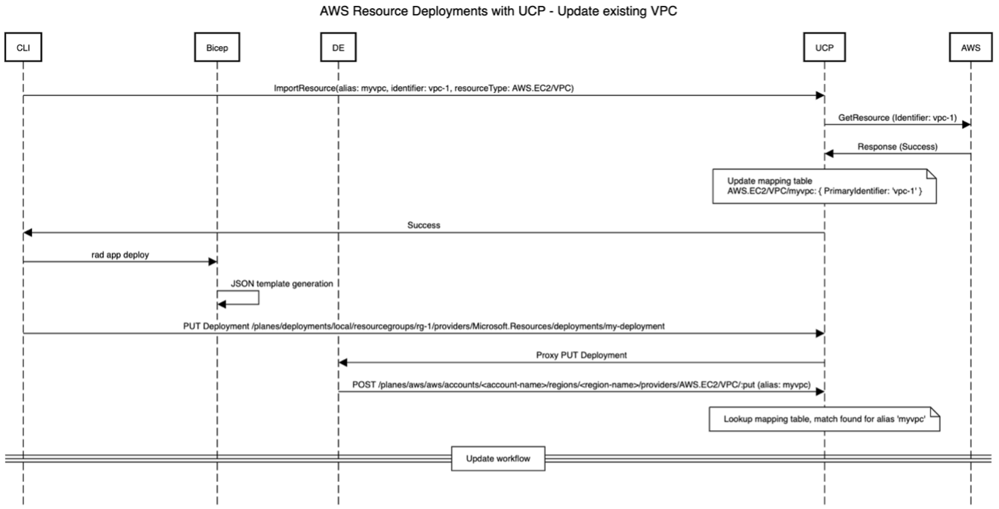

# Handling Non-Idempotent AWS Resources in UCP

**Note: This design doc has been ported over from an old design doc and might not match the template completely**

* **Status**: Pending
* **Author**: Vinaya Damle (vinayada)

## Overview

We’ve been at work adding support for AWS resources to UCP and Bicep by using the Cloud-Control API. UCP can already support the standard lifecycle of AWS resources supported by Cloud-Control (create, update, read, list, delete). However, despite enabling UCP to manage AWS resources, we have limitations in Bicep’s support for non-idempotent resources. Approximately 300 resources in AWS are non-idempotent, including VPC which is a central concept. The most common pattern with non-idempotency is that the resource has a server-generated name – we can detect these cases because the Cloud-Formation schema will designate the primary identifier (name) as readonly.	 

Unlike Terraform, Cloud-Formation, and Pulumi, Bicep is stateless – the aforementioned IaC languages all have an in-built state-store which provides idempotent behaviors on top of a non-idempotent API. For the Bicep end-to-end we have a decision to make whether to add a state store at the Bicep/Deployments level as part of the resource model or inside UCP by exposing a set of idempotent APIs that leverage an internal state store. The model that we choose should be applied to AWS as well as any future non-idempotent scenarios. This document describes an approach for building idempotent APIs at the UCP level. Any design approach we pursue will be relatively complex and we would like to find any flaws or gaps in the design before we start building.


## Terms and definitions
- Idempotent resource - A resource that can be created or updated using the same template. No prior knowledge of the existence/non-existence of the resource is needed.

- Primary Identifier - AWS resources can be retrieved from the Cloud Control API using the fields that are designated as primary identifier(s). There are could be one or more primary identifiers for a resource.

## Objectives

UCP should expose a set of idempotent APIs on top of the underlying non-idempotent systems. The principles that guide the user-experience design and constraints are:-
1.	Users must be able to use the same bicep template for initial deployment as well as updates of a resource (templates are idempotent).
2.	Users must be able to work with resources created out-of-band from Radius (using AWS console, CLI, etc.).


> **Issue Reference:** https://github.com/radius-project/radius/issues/6227

### Goals

We want to present an idempotent experience in Bicep to users using AWS resource which are inherently non-idempotent in nature.

### Non goals

NA

## Design

AWS resources can be retrieved from the Cloud Control API using the fields that are designated as primary identifier(s). There are some AWS resources for which one or more of the primary identifiers is a read-only property and is set to an auto-generated value when the resource is created. This means that users never get to choose the identifiers of these resources, they are always assigned by the server. 

Unlike ARM there isn’t a single predictable property that serves as the identifier for all resources. Determining which property or set of properties act as the identifier requires knowledge of the resource type’s schema. UCP uses the identifier of an AWS resource as the last segment in its resource ID, as it is closest to the ARM name property. All of the standard ARM lifecycle interactions between a client and UCP and AWS Cloud Control already know the identifier to use because it is provided in the URL. UCP extends ARM’s protocol to support an additional family of endpoints that do not require the identifier – to be called from the deployment engine. All interactions with Cloud Control except creation require the identifier. 

This causes an impedance mismatch with Bicep because a Bicep template must support both initial creation of a resource and updates without editing the template. For a non-idempotent resource like VPC, it is not possible for users to write down the identifier until after the template has been processed once.  

This means that the association between the template and the identifier of the resource must be stateful at some level of the system for the “same template” principle to be satisfied. If Bicep & UCP begin relying on internal state for correctness we must also handle the cases when the developer creates/updates resources out of band from Bicep (say using AWS console) and wants to use this resource in Bicep as well as cases where the resource state has drifted from what is stored in UCP. 

### Design details


#### Scoping of stored state 

For this proposal we are choosing to build the state store into UCP at the Radius resource group scope level and associate the AWS resource ID to the Radius resource group.

The two fundamentals for IaC idempotency are: 

- Associating a key with “each resource as the user sees it”. 
- Maintaining a state store that can be updated and indexed with these keys. 
 
The requirements for the keys are that they be unique within the scope of the state store and that they are deterministic (not random).  

The existing tools in the IaC space solve for idempotency by building a state-store scoped to the deployment object itself. For example, each Terraform Workspace (directory) is a state-store, and each Cloud Formation stack is a long-lived server-side resource with a state store. The keys associated with each resource in the deployment can be derived from symbolic names provided by users during authoring.

In contrast, the default mode for Bicep is to create a deployment which is more like a log than a long-lived resource and is thus not a good place for us to store state. The Bicep team is working on stacks which will have the same behaviors and semantics as CloudFormation stacks, however it seems like this functionality is months away from Azure and even further away from Radius. The “stack” behavior (like TF or CF) is a well understood solution to these state problems, it does introduce another concept which is naming the stack. 

#### Proposed Solution 

To address this idempotency issue, we will introduce a state in UCP which will create a mapping between the user specified alias and the actual deployed AWS resource. Based on the presence/absence of this mapping, UCP will determine if this is a create or an update operation on the resource. If developers want to use resources created out-of-band into their applications, they will be able to do so by explicitly importing that resource into Radius which will create the mapping in UCP. 

The mapping in UCP will store a reference to the AWS resource with the ID being the deployment scope (Radius resource group) + the user’s specified alias, and it will map to the AWS resource’s scope, the primary identifier of the AWS resource, and metadata about whether the lifecycle of this resource is managed by Radius. Since the deployment scope is the Radius resource group, the user can list AWS resources when they list resources in their Radius resource group. The user will also be able to delete AWS resources when the Radius resource group is deleted.
 
```
Request: GET /planes/radius/local/resourceGroups/my-rg 

Response: { 
  … 

  resources: [ 
    { 
      name: my-vpc-alias 
      id: /planes/radius/local/resourceGroups/my-rg/providers/AWS.EC2/VPC:reference/my-vpc-alias 
      type: AWS.EC2/VPC:reference 
      mapsTo: { 
        scope: /planes/aws/aws/accounts/123456789/regions/us-west-2/providers/AWS.EC2/VPC 
        primaryIdentifier: vpc-123 
      } 
      properties: { 
        CidrBlock: 10.0.0.0/24 
      } 
    } 
    … 

  ] 
} 
```
 

Note that the above options are storing a UCP resource of type AWS.EC2/VPC:reference which is a reference to a VPC resource and not the VPC resource itself. We can also cache the resource properties for better performance.

One drawback of this approach is that by requiring an alias on every AWS resource, the user must learn another new concept. 

We’ve already created a set of imperative REST APIs in UCP for the deployment engine to call. This is necessary because the ARM APIs require us to know the AWS resource identifier up front and the deployment engine does not have knowledge of AWS types.


#### Bicep Changes 

We will introduce a new required field called “alias” on the AWS resource. The user will require to specify a friendly name to identify the resource which needs to be unique per resource type in the deployment scope. 
 
```
resource vpc ‘AWS.EC2/VPC@default’ = { 
  alias: ‘my-vpc-alias’ 
  properties: { 
    CidrBlock: '10.0.0.0/24' 
  } 
} 
```

We chose to add a new “alias” property instead of using the symbolic name because the symbolic name would have to be unique across resource types in the deployment scope (Radius resource group) which is a difficult constraint to meet. We chose to add the “alias” property to all AWS resources (instead of just non-idempotent ones) for consistency.  

Note that for now, we will add the “alias” property only for AWS resources and not other resources such as Azure. 


#### UCP/DE Changes 

We will make changes to UCP to handle AWS resources similarly to Radius resources. UCP will store the AWS resource metadata in the same way that Radius resources are stored today (that is, the key will be the resourceID). We will store three pieces of metadata for each of these tracked AWS resources: 

- Scope: Describes the AWS resource scope, including the account ID and the region ID for the resource deployment 
- PrimaryIdentifier: Lists the AWS primary identifier, which is required to uniquely identify the resource 
- OwnedResource: Specifies if the lifecycle of the AWS resource is controlled by the Radius application 

Example with VPC resource: 
```
/planes/radius/local/resourceGroups/my-rg/providers/AWS.EC2/VPC:reference/my-vpc-alias: { 
    scope: /planes/aws/aws/accounts/123456789/regions/us-west-2/providers/AWS.EC2/VPC 
    primaryIdentifier: vpc-123 
    ownedResource: true  
} 
```
 

Note that here we are using the Radius resource group to construct the key of the tracking entry instead of the AWS resourceID. The deployment engine provides the resource group information from the deployment’s resource group during the POST call that it makes to UCP to create/update the resource. This will associate the AWS resource with the Radius resource group, and thus allow the user to list AWS resources deployed within a Radius resource group. 

UCP will look up the resource by its key and determine whether to make a create or update call and accordingly queue an async task. A background job will pick up the create/update task, make the actual create/update call to AWS and then actively monitor the operation completion based on the Request Token returned by AWS and update the stored status. When the deployment engine requests the operation status, the AWS proxy will return the operation status based on the currently stored state. 

If a request for the resource alias comes in when another operation (create/update/delete) for the same alias is in progress, we will return a 409 Conflict to the user. 

The OwnedResource property specifies the delete behavior for the resource as a part of Radius resource group deletion. If OwnedResource is set to true, then this resource will be deleted when the resource group is deleted. OwnedResource will be set to true is when the resource is deployed by Bicep. There is an open question here about the default behavior for OwnedResource. We could set it to true or false by default for imported resources, or we could require the user to specify this on each import.

#### Cons
-	Alias required for all AWS resources (even for idempotent resources)
-	User may need to know the format and values for primary identifiers


### User scenarios

#### Create VPC using UCP for the very first time 

This section walks through the process of creating a resource using the Bicep -> UCP -> Cloud Control end-to-end. The example shows a VPC which is a non-idempotent resource, but the behavior and data-flows would be the same for all AWS resources. 

The deployment engine uses an extension to ARM’s protocol to initiate operations which we reviewed previously in this forum. Once the operation is initiated, it behaves like any other ARM async-operation.  

The delta from our current implementation is addition of alias mapping to UCP and the use of a background job to track provisioning process. The background job is needed to avoid UCP making state transitions on a GET request. The background job processing will use existing UCP infrastructure.
 


Example Payload 

URL: POST /planes/aws/aws/accounts/123456789/regions/us-west-2/providers/AWS.EC2/VPC/:put 

```
RequestBody: { 
  alias: vpc-myuniquealias 
  trackedBy: /planes/radius/local/resourceGroups/my-rg/providers/AWS.EC2/VPC:reference/my-vpc-alias 
  properties: { 
        CidrBlock: '10.0.0.0/24' 
  } 
}
```
The trackedBy field declares the deployment scope for the AWS resource and associates the AWS resource with the Radius resource group. This field is used as the key to create the tracking entry in the UCP state store. The deployment engine uses the deployment’s resource group to construct this field.  

The response to this payload is a standard ARM-RPC async response. 

Failure conditions: 

If the CreateResource AWS Cloud Control call fails before returning an identifier, we will remove the alias mapping in UCP. 

Race conditions: 

UCP receives a second POST request with “put” action when the first one is in progress – To avoid creation of two AWS resources, UCP will atomically update the mapping table with the alias before issuing the create request. The second request would find an alias with no value and would return 409 Conflict error to the user. 

Canceled Deployments – If a deployment is canceled while UCP is polling resource creation, it will not result in cancellation of the polling of the in-progress operation completion. 

 

#### Update existing VPC created using UCP 

This walkthrough demonstrates the data-flows for an update operation (where we already have a storage entry). Assume that the Bicep file being deployed here is the same as the above Create flow. This case differs from the previous case because already have a mapping in our state store.  Before updating the resource, UCP will first make a GetResource call to AWS to check with the underlying resource exists and choose between CreateResource and UpdateResource Cloud Control calls.
 


Payload 

URL: POST /planes/aws/aws/accounts/123456789/regions/us-west-2/providers/AWS.EC2/VPC/:put  

```
RequestBody: { 
  alias: my-vpc-alias 
  trackedBy: /planes/radius/local/resourceGroups/my-rg/providers/AWS.EC2/VPC:reference/my-vpc-alias 
  properties: { 
  CidrBlock: '10.0.0.0/24' 
  }
} 
```

Failure conditions
•	If the UpdateResource AWS Cloud Control call fails before returning an identifier, we will keep the alias mapping, and return an error to the user informing them that the update failed.

Race conditions
•	UCP receives an update request (another POST /planes/aws/aws/accounts/<aID>/regions/<regionName>/providers/AWS.EC2/VPC/:put) while the update operation is in progress – UCP will lookup the mapping table for the alias. An alias is found but an operation status is in progress. UCP will therefore return a 409 Conflict error to the user.

 
#### Handling of out-of-band AWS resources 

In many cases, users want to be able to interface with pre-created cloud resources in their applications. Bicep has an ‘existing’ keyword used to specify this relationship. To uniquely identify a created AWS resource, we need: 

The resource type name (e.g. AWS.EC2/VPC, or AWS::EC2::VPC) 

The primary identifier of the resource (e.g. vpc-123, or primaryidentifier1|primaryidentifier2)

Problem Scenario 

In many cases, users want to be able to interface with pre-created cloud resources in their applications. Bicep has an ‘existing’ keyword used to specify this relationship. To uniquely identify a created AWS resource, we need:
•	The resource type name (e.g. AWS.EC2/VPC, or AWS::EC2::VPC)
•	The primary identifier of the resource (e.g. vpc-123, or primaryidentifier1|primaryidentifier2)



Failure conditions
•	GetResource called during import fails (for example, if the resource does not exist) – UCP will fail the import command and report the error to the user
•	Import uses an already existing alias – UCP will fail the import command and report the error to the user


#### Drift Detection 

Since UCP will be storing state, the possibility of drift between UCP state and AWS state is possible. We believe that we can address drift-detection concerns passively as part of the existing data-flows. 


##### Scenario 1: Create using Bicep, delete AWS resource out-of-band, update using Bicep 

In this scenario, UCP will be storing a mapping to a resource that doesn't exist. UCP will create a new and update the store to reflect the mapping to the new primary identifier.

##### Scenario 2: Create using Bicep, update AWS resource out-of-band, update using Bicep 

In this scenario, UCP will update the resource using the state provided by Bicep. We always requery the resource’s state prior to performing an update operation. When we compute a patch for the resource we will do so based on its current state.  

##### Future work 

As a future enhancement, UCP could have a periodic background job for drift detection and cleanup dangling resource entries.


### API design (if applicable)

For AWS Resources, the request body will contain new fields "alias" and "trackedBy"

URL: POST /planes/aws/aws/accounts/123456789/regions/us-west-2/providers/AWS.EC2/VPC/:put 

```
RequestBody: { 
  alias: vpc-myuniquealias 
  trackedBy: /planes/radius/local/resourceGroups/my-rg/providers/AWS.EC2/VPC:reference/my-vpc-alias 
  properties: { 
        CidrBlock: '10.0.0.0/24' 
  } 
}
```

## Alternatives considered

The state store could be built into Bicep/Deployment Engine. However, the default mode for Bicep is to create a deployment which is more like a log than a long-lived resource and is thus not a good place for us to store state. 

## Test plan

Test for the following scenarios:-
1. Create new VPC (or other non-idempotent AWS resource)
2. Update VPC (or other non-idempotent AWS resource) created using Bicep
3. Update existing VPC created out-of-band
3. Create using Bicep, delete out-of-band, update using Bicep
4. Create using Bicep, update AWS resource out-of-band, update using Bicep
5. Regression testing for other AWS resources

## Security

NA

## Compatibility (optional)

Bicep templates for all AWS resources (idempotent and non-idempotent) will require to specify the "alias" field.

## Monitoring

We will add logs to trace the create/update for an alias. This will help us debug issues related to drift detection.

## Development plan

We can break down the implementation into the following steps:-
1. Make AWS resources as UCP tracked resources
2. Add new fields "alias" and "trackedBy" to AWS resources
3. Add state in UCP to track AWS resources by alias
4. Modify Create/Update/Delete workflows to use the state to determine Create/Update operations


## Open issues

- What should be the default behavior for OwnedResource. We could set it to true or false by default for imported resources, or we could require the user to specify this on each import.
- Another idempotency issue with AWS resources is resources with properties that are both create and write only. Some resources in AWS have properties that can only be set at create time and never retrieved again. The ideal experience would be that if a user changes the value of a create-and-write only property as part of an update operation, UCP detects it and returns an error to the user. However, this is currently not possible because these types of properties are unable to be retrieved from AWS, so UCP cannot perform a diff. There are 50 different resources with about 70 such properties. 
